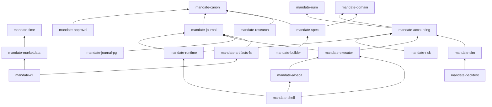

<p align="center">
  <picture>
    <source media="(prefers-color-scheme: dark)" srcset="assets/brand/mandate-lockup-reversed.svg">
    
  </picture>
</p>

# Mandate

Autonomous trading agents that run on their owner's own brokerage account, inside a mandate the
owner writes or confirms and can enforce. The owner sets the envelope: capital, goal, risk limits,
allowed asset classes, how much the agent may do alone, and when it must ask. Inside that envelope
a research agent proposes theses from market data, news, and filings, and admits instruments into
the agent's working universe only through an eligibility floor and the owner's autonomy rules.
Deterministic code sizes and builds every order, an independent risk gate decides whether it may go
out, the agent asks the owner when a decision exceeds what it may do alone, and every observation,
decision, approval, order, and fill is written to a hash-chained journal a third party can verify
without trusting the operator.

Mandate never holds customer funds or any permission that can move them, never charges per trade
or on profits, and trades paper only until securities counsel signs off on live trading
([compliance](docs/product/08-compliance-and-regulatory.md)).

> **Where it stands:** exact arithmetic, market data, accounting, the fill model, the backtest
> loop, and the journal's hash chain, hot store, artifact store, and verification are built and
> verified; the agent runtime, order builder, approvals, and most of the risk gate and the mandate
> document are in (346 reference cases pass), the Alpaca paper connector's implementation slices
> and the research thin slice are landing, and the journal's cold store is next. Nothing in this
> repository places a real order ([status](#status)).

## How it works

```mermaid
flowchart LR
    owner["Owner<br/>writes the mandate"] --> mandate["Mandate<br/>validated, versioned"]
    research["Research agent<br/>theses with evidence"] --> admit["Admission<br/>eligibility floor,<br/>autonomy rules"]
    mandate --> admit
    admit --> universe["Working universe"]
    universe --> signals["Signal models<br/>opinions, never orders"]
    signals --> builder["Order builder<br/>deterministic sizing"]
    mandate --> builder
    builder --> dry["Risk gate dry run<br/>a denial is never<br/>put to the owner"]
    dry --> autonomy["Autonomy policy<br/>AUTO · ASK · DENY"]
    autonomy -->|"AUTO"| gate["Risk gate<br/>on current state"]
    autonomy -->|"ASK"| ask["Ask the owner<br/>deadline, safe default"]
    ask -->|"approved"| gate
    gate -->|"allowed"| exec["Executor<br/>journal first,<br/>idempotent"]
    exec --> broker[("Owner's broker<br/>Alpaca paper")]
    exec --> journal[("Hash-chained journal")]
```



- **The mandate is the contract.** No code path lets an agent act outside it; limits are enforced
  by the risk gate, independent of the agent's own logic.
- **Reducing risk never needs approval; increasing risk beyond the limits always does.** Timeouts
  and ambiguity resolve to a default that never adds risk.
- **Language models produce opinions, never orders.** A thesis or a signal is typed input with a
  confidence; sizing, order construction, and the risk decision are pure functions.
- **Journal before acting.** Every order intent is recorded with an idempotency key before it is
  sent, so a crash at any step recovers without a duplicate order.
- **Kill switches work without the model** and touch only their scope.

## What we are building

Built means merged and verified against its reference cases; in progress means tests or briefs are
merged and the implementation is under way; planned means scheduled in the
[milestones](docs/project/02-milestones-and-wbs.md).

| Component | What it does | Milestone | State |
|---|---|---|---|
| Exact arithmetic, time, canonical JSON | Decimal money and quantity types, the NYSE calendar and sessions, the hashing format | M1 to M4 | Built |
| Market data | Alpaca historical bars, trades, quotes, and corporate actions into verified datasets | M1 | Built |
| Accounting | Positions, cash and settlement, fees, corporate actions, P&L, buying power | M2 | Built |
| Simulated execution and backtest | The fill model, the backtest loop, a baseline strategy, an exact metrics report | M3 | Built; the report is pinned by a committed golden digest |
| Journal and verification | Hash chain, append protocol, Postgres hot store, artifact store, a verification command | M4 | Built; cold store next |
| Mandate document | Parsing, validation, the policy hierarchy, change classification, risk state | M5 | In progress (families S, V, P, C, T, L and 15 of 24 R passing; the fold's last slice and the envelope split remain) |
| Risk gate | The ordered checks, US account rules, eligibility, conduct controls, forced flatten | M5 | In progress (spine, eligibility, conduct merged; US account rules and the mandate limits in review) |
| Order builder and autonomy | AUTO, ASK, or DENY per decision; deterministic sizing and order construction | M5 | Built; the trim-to-target cases wait on the risk gate |
| Agent runtime and kill switches | One writer per agent, the decision cycle, restarts, kill switches | M5 | Built |
| Research agent | Theses, corroboration, admission, revision lineages, expiry | M5 | In progress (thin slice: admission and the lineage fold merged) |
| Executor and Alpaca paper connector | Idempotent intents, reconciliation after restart, protective exits at the broker | M6 | In progress (implementation in stacked slices) |
| Escalation | Approval requests with deadlines and safe defaults; email, one chat channel, CLI control | M7 | In progress (the pure `mandate-approval` crate merged; runtime, CLI, and spec follow) |
| Robinhood connector | Agentic trading accounts for retail users, the second connector | M8 | Planned |
| Control plane and workspace services | Organizations and workspaces, SSO, roles, step-up auth, OAuth broker connections, the policy service | M8 | Planned |
| Web app | Mandate authoring, backtest and paper views, dashboard, audit explorer | M9 | In progress (foundation under DEC-200) |
| Private approvals and channels | Notifications carrying only opaque IDs, details served from the workspace; push, email, chat | M10 | Planned |
| Hybrid installer | Helm chart and Docker Compose, outbound-only connectivity, signed releases | M11 | Planned |
| Billing | Organization plans and agent counts, with no per-trade or outcome-based pricing | M12 | Planned |
| Hardening and release | Security review, penetration test, runbooks, terms and disclosures, soak | M13 | Planned |

Phase 1 ends when one agent trades an Alpaca paper account unattended, on theses it generated,
through a soak with forced restarts and escalations and no duplicate orders, and its theses beat
the pre-registered baselines on forward paper (M5 to M7,
[DEC-99](docs/project/04-decision-log.md)). Phase 2 is the platform for design partners (M8 to
M13). Kraken Derivatives US, Interactive Brokers, and Coinbase come in later releases; options,
short sales, and margin are out of scope for v1 ([PRD](docs/product/04-prd-v1.md)).

## Repository

This repository is the monorepo for all of Mandate. Today it holds:

| Path | Contents |
|---|---|
| `crates/` | The Rust core: every crate listed under [Engine](#engine) |
| `python/` | `mandate_tools` (the reference-case exporter) and `research_spike` (theses from news and prices through an LLM, sized under caps, paper orders, a journal, a scorecard) |
| `docs/` | Product, design ([HLD](docs/HLD.md)), specifications, decisions, and the work tracker |
| `schemas/` | JSON Schemas for the mandate and the policy |
| `reference/` | The Python reference implementation of the mandate spec, which generates its cases |
| `fixtures/` | Machine-readable reference cases the Rust tests reproduce |
| `xtask/` | The CI pipeline as a binary |
| `assets/` | Brand assets |

The web app, the workspace and control-plane services, and the installer join this repository when
their milestones start.

## Engine

### Design invariants

- **Exact arithmetic, or an error.** Money, prices, quantities, and basis points are typed
  wrappers over a 96-bit decimal with a declared scale per type (quantities 9 places, marks 12,
  ratios 24, up to 28); every operation is checked and returns a typed error on overflow or on a
  result that does not fit the scale, and wide intermediates use 256-bit integers. Safety-critical
  crates deny `f32` and `f64`, `unwrap` and `panic`, slice indexing, and `as` casts through a
  shared lint header that CI verifies.
- **Determinism.** Safety-critical crates read no clock and no randomness; identifiers come from an
  injected generator; ordered maps only (`BTreeMap`, never `HashMap`); state is a fold over journal
  events with a versioned fold, so a backtest, a paper run, and a live run share one core and only
  the shell differs.
- **Specifications are the contract.** Three specs ([trading domain](docs/specs/trading-domain.md),
  [journal](docs/specs/journal.md), [mandate](docs/specs/mandate.md)) define the rules, and each
  ships machine-readable reference cases the code must reproduce exactly. Spec paths are protected
  in CI: they change only through a recorded decision, in a change that ships no code.
- **The journal is the source of truth.** Canonical JSON bytes, SHA-256 hash chaining, per-stream
  heads with writer fencing, content-addressed artifacts, and Merkle anchors, with a verifier that
  reports the first failing check by its stable code.

### Crates

Crates are layered; a crate may depend only on workspace crates in strictly lower layers, and CI
checks the graph against the declaration in `xtask/layers.toml`.



| Layer | Crate | Responsibility | Safety-critical | Pure |
|---|---|---|---|---|
| 0 | `mandate-num` | `Usd`, `Price`, `Qty`, `Bps`, `Fraction`, `Ratio` with exact-or-error arithmetic; square-root impact and integer roots, the metric, gate, and sizing arithmetic, tick rounding, and money-to-shares sizing | yes | yes |
| 0 | `mandate-time` | `UtcNanos` (RFC 3339 with fractional seconds), dates, the NYSE calendar, trading sessions, trade-date rules | yes | yes |
| 0 | `mandate-canon` | Canonical JSON, the decimal grammar, SHA-256 digests | yes | yes |
| 1 | `mandate-domain` | The shared vocabulary: asset identifiers, the working universe, autonomy decisions, agent modes, purposes, market sessions | yes | yes |
| 1 | `mandate-approval` | The pure approvals crate: request content, the ask budget, admission checks, step-up, re-validation and drift, quiet hours (E8-1 to E8-3 merged; the runtime grant path and CLI follow) | yes | yes |
| 2 | `mandate-accounting` | The account fold: positions, cost basis, cash and settlement, fees with per-order caps, marks, realized and unrealized P&L, corporate actions, buying power | yes | yes |
| 2 | `mandate-journal` | Drafts, the append protocol (idempotency, fencing, heads), verification, anchoring, the artifact core | yes | yes |
| 3 | `mandate-spec` | The mandate document as code: parsing against the schema's decimal grammars, validation, the policy hierarchy, change classification, the condition language, risk state, goals (families S, V, P, C, T, L and 15 of 24 R cases passing) | yes | yes |
| 4 | `mandate-risk` | The independent risk gate: trading-domain §9.1's ordered checks, US account rules, the eligibility floor, market-conduct controls, the agent-scoped flatten (spine, eligibility, conduct merged; the rest in review) | yes | yes |
| 5 | `mandate-builder` | Autonomy classification (AUTO, ASK, DENY) and the conviction-linear order builder: combine, size, clip (families A and 25 of 32 B passing; the trim cases wait on the gate) | yes | yes |
| 5 | `mandate-research` | The research-agent thin slice: the thesis contract, the seventeen ordered admission checks, expiry, revision lineages (the family-N harness slices follow) | yes | yes |
| 6 | `mandate-runtime` | The agent runtime core: one writer per agent, the decision cycle as a pure fold and handler, the startup hold, kill switches | yes | yes |
| 6 | `mandate-executor` | The account stream's single writer: journal-first idempotent intents, client order ids derived from the intent id, the order state machine, reconciliation, protective exits (implementation in stacked slices) | yes | yes |
| 6 | `mandate-sim` | The backtest fill model as a pure function: eligibility, touch and through, marketable limits, volume caps with square-root impact, stops, stop-limits, OCO, gaps, auctions | yes | yes |
| 6 | `mandate-marketdata` | Alpaca historical bars, trades, and quotes as exact vendor numbers in idempotent Parquet datasets; corporate actions; sessions; data-quality inspection; header-driven rate limiting | no | no |
| 6 | `mandate-journal-pg` | The Postgres hot store: canonical bytes with a hash check, append-only roles and triggers, stream heads with writer fencing | yes | no |
| 6 | `mandate-artifacts-fs` | Write-once objects under their SHA-256, atomic publish, checked reads | yes | no |
| 7 | `mandate-backtest` | The backtest loop, a moving-average baseline, and an exact-decimal metrics report, pinned by a committed golden report | yes | yes |
| 7 | `mandate-alpaca` | The Alpaca paper connector behind transport traits: trading and data clients, wire parsing with no floats, the instrument snapshot and latest quote, recorded fixtures | yes | no |
| 7 | `mandate-cli` | `mandate download`, `mandate inspect`, `mandate journal verify`, `mandate artifact put` and `get` | no | no |
| 8 | `mandate-shell` | The composition crate and `mandate-tracer` binary: adapters and stages that wire the core crates together; it holds no trading logic (every tracer stage refuses until its upstream source lands) | yes | no |
| tool | `mandate-refcases` | One named test per reference case, driven by `fixtures/refcases/*.json`; `status.toml` records which cases pass | yes | no |
| tool | `xtask` | The CI pipeline as a binary: `cargo xtask check` | no | no |

`xtask/layers.toml` is the binding crate inventory and dependency declaration.

### Specifications and reference cases

| Spec | Version | Reference cases | How the code is held to it |
|---|---|---|---|
| [Trading domain](docs/specs/trading-domain.md) | v0.13, approved | 26 worked cases (RC-01 onward) and 41 registered reason codes over accounting, settlement, corporate actions, fills, US account rules | `mandate-refcases` runs each case as a test; `status.toml` marks the ones that pass and a passing case may never regress |
| [Journal](docs/specs/journal.md) | v0.6 | Byte-exact vectors: decimal normalization, string escaping, a 5-event chain, the export line, the Merkle anchor, 9 append-protocol cases (idempotent retry, stale head, fenced writer, rejected float), 9 tamper cases with their expected first failure, and the generated agent-stream payload vectors of §9.1 | Conformance tests reproduce every vector byte for byte; `mandate journal verify` reports the tamper cases' codes |
| [Mandate](docs/specs/mandate.md) | v0.6 | 298 generated cases across schema, validation, policy, change classification, risk state, autonomy, the order builder, the gate, admission, lineage, and expiry | A Python reference implementation (`reference/mandate`) generates the cases; CI regenerates them and diffs, runs the checker, a fuzzer over the invariants MI-1 to MI-30, and a seeded-mutant check. The Rust harness runs every case; 284 of 298 pass, the rest pending on their owning stories |

### Verification pipeline

`cargo xtask check` runs every CI job locally, in this order (`spec-guard` runs earlier in the `fast` CI job):

| Part | What it enforces |
|---|---|
| `lint` | `cargo fmt`, `clippy -D warnings`, the crate layering and safety-critical lint headers, debt markers, the feature map, `typos`, `ruff` |
| `test` | `cargo nextest` across the workspace, doctests, `pytest` for the Python packages |
| `pending` | Every test marked `#[ignore = "pending <story>"]` must fail on the current stubs, so a story's tests are proven to discriminate before its implementation lands |
| `refcases` | The JSON fixtures are the exact export of the YAML specs |
| `reference` | The mandate reference implementation regenerates its cases byte-identically; checker, fuzzer, and seeded mutants pass |
| `supply-chain` | `cargo-deny` (advisories, bans, licences, sources), the direct-dependency registry in `docs/dependencies.md`, `gitleaks` |
| `spec-guard` | Protected paths (`docs/specs/`, `schemas/`, `reference/`, `fixtures/refcases/`, `status.toml`) change only with a cited decision and no code |
| `postgres` | The journal hot-store tests against a real PostgreSQL when `MANDATE_PG_URL` is set |
| `mutants` | `cargo-mutants` over changed safety-critical library code: zero missed mutants, or a written equivalence argument |

CI runs the same pipeline as two required checks (`fast`, `full`); documentation-only changes take
a short path that runs `typos`, the spec guard, and the commit-trailer check in seconds.

## Building and running

Requirements: the pinned Rust toolchain (`rust-toolchain.toml`, 1.98.1, edition 2024); `uv` with
Python 3.14 for the Python packages; PostgreSQL 17 or later (18 in CI) only for the hot-store tests; Alpaca
market-data keys only for `mandate download`. On Linux, `.cursor/install.sh` installs the CI tools
at their pinned versions.

```bash
cargo xtask check                                   # the whole pipeline
cargo nextest run -p mandate-accounting             # one crate
cargo run -p mandate-cli -- download --help         # historical data into Parquet datasets
cargo run -p mandate-cli -- inspect <dataset>       # coverage, gaps, duplicates, quality, statistics
cargo run -p mandate-cli -- journal verify <export> [--store <dir>] [--anchor <file>]
cargo run -p mandate-cli -- artifact put <file> --store <dir>
```

Nothing in this repository places an order. The market-data client reads through an injected
transport with recorded fixtures in tests; the only network calls are `download` against Alpaca's
historical endpoints with keys you supply in the environment.

## Status

| Milestone | State |
|---|---|
| M0 Foundations | Done: workspace, CI, conventions, the agent workflow |
| M1 Market data | Done: bars, trades, quotes, sessions and early closes, corporate actions, safe concurrent writes, data-quality reporting, proactive rate limiting; exit run on real data passed 2026-09-26 |
| M2 Accounting | Done: verified against the hand-calculated reference cases including splits, dividends, partial fills, settlement |
| M3 Simulated execution and backtest | Done: the fill model (RC-10, RC-12, RC-19 passing) and the baseline backtest with an exact-decimal metrics report, reproducible bit for bit from a committed golden report |
| M4 Journal | In progress: done except the cold store and segment manifests, which are next: hash chain, verification, Postgres hot store, artifact store, the verification command |
| M5 Agent runtime and risk | In progress: the runtime and kill switches are built (#151); the mandate document's parse, validation, policy, change classification, and risk-state fold are merged (families S, V, P, C, T, L, and 15 of 24 R passing); the order builder and autonomy are built (#216, #234); the risk gate's spine, eligibility floor, and conduct controls are merged, with US account rules and the remaining mandate limits in review; the research thin slice's admission and lineage fold are merged, its harness slices next |
| M6 Alpaca connector | In progress: tests merged (#152: 310 tests, twelve submission crash points, 23 recorded Alpaca paper scenarios); the implementation lands as stacked slices (#184, #194, #196, #198, and the E7-4 slices), with fault-injected reconciliation as the exit criterion |
| M7 Escalation | In progress: E8-1 to E8-3 (approval content, the ask budget, admission, re-validation, drift) implemented in `mandate-approval` (#250, #254, #275); the runtime grant path, the CLI, and the M7 spec change follow |
| M8 to M13 | Planned ([milestones](docs/project/02-milestones-and-wbs.md)); the web app's foundation started early under DEC-200 |

The [work tracker](docs/project/08-work-tracker.md) records every story, claim, and decision with
its PR numbers. Nothing trades live with real money until securities counsel has signed off
([DEC-98](docs/project/04-decision-log.md), [DEC-102](docs/project/04-decision-log.md)).

## How changes land

The founder builds with AI coding agents under [AGENTS.md](AGENTS.md). A safety-critical story
ships as three pull requests: the tests, with pending markers and an independent oracle; the
implementation, which may only delete those markers and must pass the mutation gate; and the status
change that marks reference cases passing (DEC-77). Every pull request merges only on green CI and
a written verdict from an independent review agent on a different model from its author (DEC-79),
which tries to break the change with its own probes. Interpretations the specs leave open are
recorded as numbered decisions before code is written; the founder reviews after the fact and can
veto. Each decision is its own file under
[docs/project/decisions/](docs/project/decisions/README.md) (DEC-344), so parallel streams do not
contend for one log. They coordinate through claim issues, a reserved-identifier table for the
other identifiers, and one merge
queue ([coordination playbook](.cursor/skills/mandate-mode/playbooks/coordination.md)).

## Documents

- [Documentation index](docs/README.md) and [High-Level Design](docs/HLD.md)
- Architecture decisions: [ADR-0001 engineering setup](docs/adr/0001-engineering-setup.md),
  [ADR-0002 autonomous ideation and retail](docs/adr/0002-autonomous-ideation-and-retail.md),
  [ADR-0003 earned autonomy](docs/adr/0003-earned-autonomy.md)
- Product: [vision](docs/product/01-vision-and-strategy.md), [PRD v1](docs/product/04-prd-v1.md),
  [roadmap](docs/product/05-roadmap.md), [compliance](docs/product/08-compliance-and-regulatory.md)
- Project: [milestones](docs/project/02-milestones-and-wbs.md), [RAID log](docs/project/03-raid-log.md),
  [decision log](docs/project/04-decision-log.md), [backlog](docs/project/06-backlog-v1.md),
  [work tracker](docs/project/08-work-tracker.md)

## Licence and disclaimer

All rights reserved; no licence is granted to use, copy, modify, or distribute this software beyond
what GitHub's terms require for viewing a public repository ([LICENSE](LICENSE)). Mandate is
software under development, not investment advice, and it holds no customer funds.
