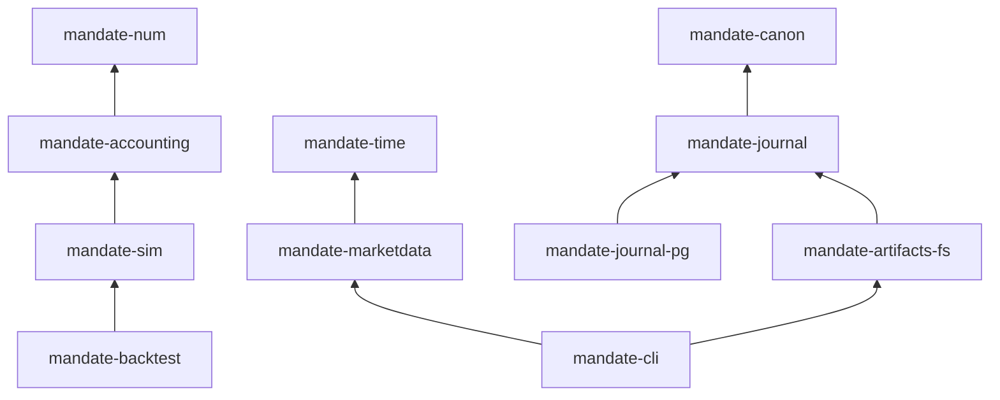

# Mandate

A deterministic core for autonomous trading agents that run on their owner's own brokerage
account, inside an envelope the owner sets: capital, goal, limits, allowed asset classes, and when
the agent must ask before acting. Language models produce opinions (theses, admissions,
signal-model outputs); deterministic code sizes and builds every order, an independent risk gate
decides whether it may go out, and every step is written to a hash-chained journal that a third
party can verify without trusting the operator.

This repository is the engine: exact arithmetic, market data, accounting, simulated execution, the
journal, and the specifications those crates reproduce case for case. There is no user interface,
no live broker connector, and no real-money trading yet ([status](#status)).

## Design invariants

- **Exact arithmetic, or an error.** Money, prices, quantities, and basis points are typed
  wrappers over a 96-bit decimal with a declared scale per type (quantities 9 places, marks 12,
  ratios 24, up to 28); every operation is checked and returns a typed error on overflow or on a
  result that does not fit the scale, and wide intermediates use 256-bit integers. Safety-critical
  crates deny `f32` and `f64`, `unwrap` and `panic`, slice indexing, and `as` casts through a
  shared lint header that CI verifies.
- **Determinism.** Safety-critical crates read no clock and no randomness; identifiers come from an
  injected generator; ordered maps only (`BTreeMap`, never `HashMap`); state is a fold over journal
  events with a versioned fold, so a backtest, a paper run, and a live run share one core and only
  the shell differs.
- **Specifications are the contract.** Three specs ([trading domain](docs/specs/trading-domain.md),
  [journal](docs/specs/journal.md), [mandate](docs/specs/mandate.md)) define the rules, and each
  ships machine-readable reference cases the code must reproduce exactly. Spec paths are protected
  in CI: they change only through a decision-log entry, in a change that ships no code.
- **The journal is the source of truth.** Canonical JSON bytes, SHA-256 hash chaining, per-stream
  heads with writer fencing, content-addressed artifacts, and Merkle anchors, with a verifier that
  reports the first failing check by its stable code.
- **LLMs never place orders.** The order builder and the risk gate are pure functions over typed
  inputs; a model's output is an opinion with a confidence, never an instruction.

## Architecture

Crates are layered; a crate may depend only on workspace crates in strictly lower layers, and CI
checks the graph against the declaration in `xtask/layers.toml`.



| Layer | Crate | Responsibility | Safety-critical | Pure |
|---|---|---|---|---|
| 0 | `mandate-num` | `Usd`, `Price`, `Qty`, `Bps`, `Fraction` with exact-or-error arithmetic, square-root impact and integer roots; `Ratio`, tick rounding, money-to-shares sizing, and the metric arithmetic are stubs with their tests merged, pending E4-2 | yes | yes |
| 0 | `mandate-time` | `UtcNanos` (RFC 3339 with fractional seconds), dates, the NYSE calendar, trading sessions, trade-date rules | yes | yes |
| 0 | `mandate-canon` | Canonical JSON, the decimal grammar, SHA-256 digests | yes | yes |
| 2 | `mandate-accounting` | The account fold: positions, cost basis, cash and settlement, fees with per-order caps, marks, realized and unrealized P&L, corporate actions, buying power | yes | yes |
| 2 | `mandate-journal` | Drafts, the append protocol (idempotency, fencing, heads), verification, anchoring, the artifact core | yes | yes |
| 6 | `mandate-sim` | The backtest fill model as a pure function: eligibility, touch and through, marketable limits, volume caps with square-root impact, stops, stop-limits, OCO, gaps, auctions | yes | yes |
| 6 | `mandate-marketdata` | Alpaca historical bars, trades, and quotes as exact vendor numbers in idempotent Parquet datasets; corporate actions; sessions; data-quality inspection; header-driven rate limiting | no | no |
| 6 | `mandate-journal-pg` | The Postgres hot store: canonical bytes with a hash check, append-only roles and triggers, stream heads with writer fencing | yes | no |
| 6 | `mandate-artifacts-fs` | Write-once objects under their SHA-256, atomic publish, checked reads | yes | no |
| 7 | `mandate-backtest` | The backtest loop, a moving-average baseline, and an exact-decimal metrics report (tests merged; implementation in progress) | yes | yes |
| 7 | `mandate-cli` | `mandate download`, `mandate inspect`, `mandate journal verify`, `mandate artifact put` and `get` | no | no |
| tool | `mandate-refcases` | One named test per reference case, driven by `fixtures/refcases/*.json`; `status.toml` records which cases pass | yes | no |
| tool | `xtask` | The CI pipeline as a binary: `cargo xtask check` | no | no |

Phase 1 adds `mandate-domain`, `mandate-spec` (the mandate document, validation, policy, change
classification, risk state), `mandate-risk` (the gate), `mandate-builder` (autonomy and the order
builder), the agent runtime, and `mandate-executor` with `mandate-alpaca`
([ADR-0001 ES-02](docs/adr/0001-engineering-setup.md), [HLD](docs/HLD.md)).

`python/` holds `mandate_tools` (the reference-case exporter that turns the YAML specs into the
JSON fixtures) and `research_spike` (a Python spike: theses from news and prices through an LLM,
sized under caps, paper orders, a hash-chained journal, a scorecard against SPY).

## Specifications and reference cases

| Spec | Version | Reference cases | How the code is held to it |
|---|---|---|---|
| [Trading domain](docs/specs/trading-domain.md) | v0.10, approved | 26 worked cases (RC-01 onward) and 40 registered reason codes over accounting, settlement, corporate actions, fills, US account rules | `mandate-refcases` runs each case as a test; `status.toml` marks the ones that pass and a passing case may never regress |
| [Journal](docs/specs/journal.md) | v0.4 | Byte-exact vectors: decimal normalization, string escaping, a 5-event chain, the export line, the Merkle anchor, 9 append-protocol cases (idempotent retry, stale head, fenced writer, rejected float), 9 tamper cases with their expected first failure | Conformance tests reproduce every vector byte for byte; `mandate journal verify` reports the tamper cases' codes |
| [Mandate](docs/specs/mandate.md) | v0.6 | 298 generated cases across schema, validation, policy, change classification, risk state, autonomy, the order builder, the gate, admission, lineage, and expiry | A Python reference implementation (`reference/mandate`) generates the cases; CI regenerates them and diffs, runs the checker, a fuzzer over the invariants MI-1 to MI-20, and a seeded-mutant check. The Rust harness for these cases is Phase 1 work |

## Verification pipeline

`cargo xtask check` runs every CI job locally, in this order (`spec-guard` runs earlier in the `fast` CI job):

| Part | What it enforces |
|---|---|
| `lint` | `cargo fmt`, `clippy -D warnings`, the crate layering and safety-critical lint headers, debt markers, the feature map, `typos`, `ruff` |
| `test` | `cargo nextest` across the workspace, doctests, `pytest` for the Python packages |
| `pending` | Every test marked `#[ignore = "pending <story>"]` must fail on the current stubs, so a story's tests are proven to discriminate before its implementation lands |
| `refcases` | The JSON fixtures are the exact export of the YAML specs |
| `reference` | The mandate reference implementation regenerates its cases byte-identically; checker, fuzzer, and seeded mutants pass |
| `supply-chain` | `cargo-deny` (advisories, bans, licences, sources), the direct-dependency registry in `docs/dependencies.md`, `gitleaks` |
| `spec-guard` | Protected paths (`docs/specs/`, `schemas/`, `reference/`, `fixtures/refcases/`, `status.toml`) change only with a cited decision and no code |
| `postgres` | The journal hot-store tests against a real PostgreSQL when `MANDATE_PG_URL` is set |
| `mutants` | `cargo-mutants` over changed safety-critical library code: zero missed mutants, or a written equivalence argument |

CI runs the same pipeline as two required checks (`fast`, `full`); documentation-only changes take
a short path that runs `typos`, the spec guard, and the commit-trailer check in seconds.

## Building and running

Requirements: the pinned Rust toolchain (`rust-toolchain.toml`, 1.98.1, edition 2024); `uv` with
Python 3.14 for the Python packages; PostgreSQL 17 or later (18 in CI) only for the hot-store tests; Alpaca
market-data keys only for `mandate download`. On Linux, `.cursor/install.sh` installs the CI tools
at their pinned versions.

```bash
cargo xtask check                                   # the whole pipeline
cargo nextest run -p mandate-accounting             # one crate
cargo run -p mandate-cli -- download --help         # historical data into Parquet datasets
cargo run -p mandate-cli -- inspect <dataset>       # coverage, gaps, duplicates, quality, statistics
cargo run -p mandate-cli -- journal verify <export> [--store <dir>] [--anchor <file>]
cargo run -p mandate-cli -- artifact put <file> --store <dir>
```

Nothing in this repository places an order. The market-data client reads through an injected
transport with recorded fixtures in tests; the only network calls are `download` against Alpaca's
historical endpoints with keys you supply in the environment.

## Status

| Milestone | State |
|---|---|
| M0 Foundations | Done: workspace, CI, conventions, the agent workflow |
| M1 Market data | Done except the exit run on real credentials: bars, trades, quotes, sessions and early closes, corporate actions, safe concurrent writes, data-quality reporting, proactive rate limiting |
| M2 Accounting | Done: verified against the hand-calculated reference cases including splits, dividends, partial fills, settlement |
| M3 Simulated execution and backtest | Fill model done (RC-10, RC-12, RC-19 passing); the backtest loop and metrics report have their tests merged, implementation in progress |
| M4 Journal | Done except the cold store and segment manifests: hash chain, verification, Postgres hot store, artifact store, the verification command |
| M5 Agent runtime and risk (Phase 1) | Started: five streams (the mandate document as code with its case harness, the risk gate, the order builder, the runtime skeleton, the research-agent thin slice) run as brief, tests, and implementation pull requests; the runtime and order-builder briefs are merged (#126, #128) and the risk-gate and mandate-document briefs are in review (#127, #129); the mandate spec v0.6 with its 298 cases is the contract |

The [work tracker](docs/project/08-work-tracker.md) records every story, claim, and decision
with its PR numbers. Phase 1 ends when an agent trades an Alpaca paper account unattended through a
soak with forced restarts and no duplicate orders. Nothing trades live with real money until
securities counsel has signed off ([DEC-98](docs/project/04-decision-log.md),
[DEC-102](docs/project/04-decision-log.md)).

## How changes land

The founder builds with AI coding agents under [AGENTS.md](AGENTS.md). A safety-critical story
ships as three pull requests: the tests, with pending markers and an independent oracle; the
implementation, which may only delete those markers and must pass the mutation gate; and the status
change that marks reference cases passing (DEC-77). Every pull request merges only on green CI and
a written verdict from an independent review agent on a different model from its author (DEC-79),
which tries to break the change with its own probes. Interpretations the specs leave open are
recorded as numbered decisions before code is written; the founder reviews after the fact and can
veto. Parallel streams coordinate through claim issues, a reserved-identifier table, and one merge
queue ([coordination playbook](.cursor/skills/mandate-mode/playbooks/coordination.md)).

## Documents

- [Documentation index](docs/README.md) and [High-Level Design](docs/HLD.md)
- Architecture decisions: [ADR-0001 engineering setup](docs/adr/0001-engineering-setup.md),
  [ADR-0002 autonomous ideation and retail](docs/adr/0002-autonomous-ideation-and-retail.md)
- Product: [vision](docs/product/01-vision-and-strategy.md), [PRD v1](docs/product/04-prd-v1.md),
  [roadmap](docs/product/05-roadmap.md), [compliance](docs/product/08-compliance-and-regulatory.md)
- Project: [milestones](docs/project/02-milestones-and-wbs.md), [RAID log](docs/project/03-raid-log.md),
  [decision log](docs/project/04-decision-log.md), [backlog](docs/project/06-backlog-v1.md),
  [work tracker](docs/project/08-work-tracker.md)

## Licence and disclaimer

All rights reserved; no licence is granted to use, copy, modify, or distribute this software beyond
what GitHub's terms require for viewing a public repository ([LICENSE](LICENSE)). Mandate is
software under development, not investment advice, and it holds no customer funds.
