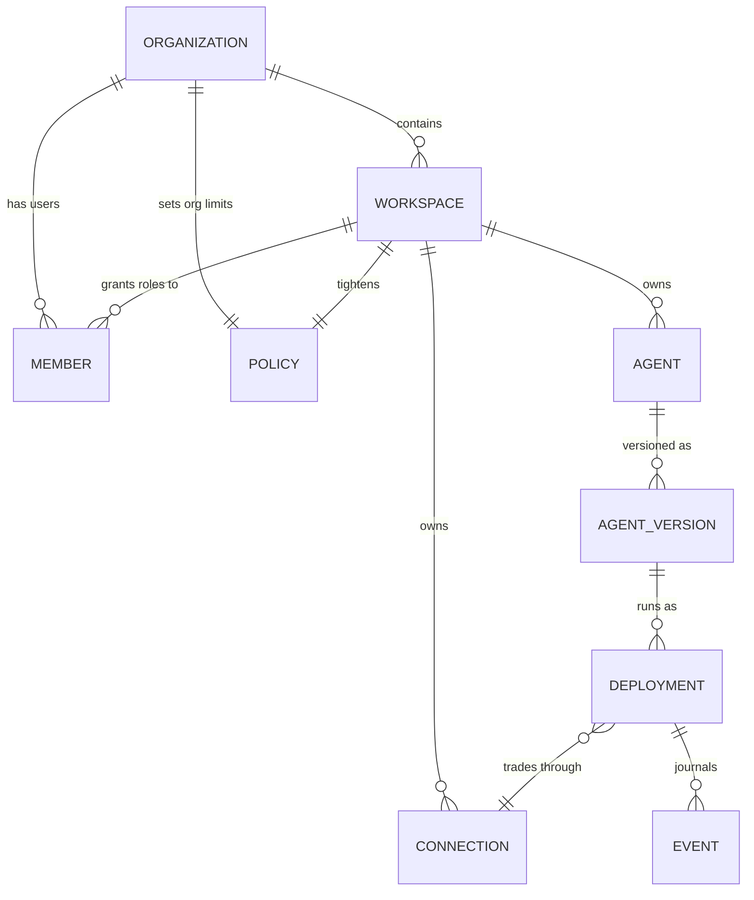
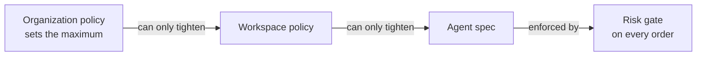
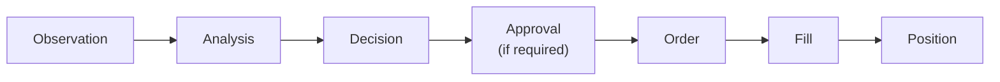
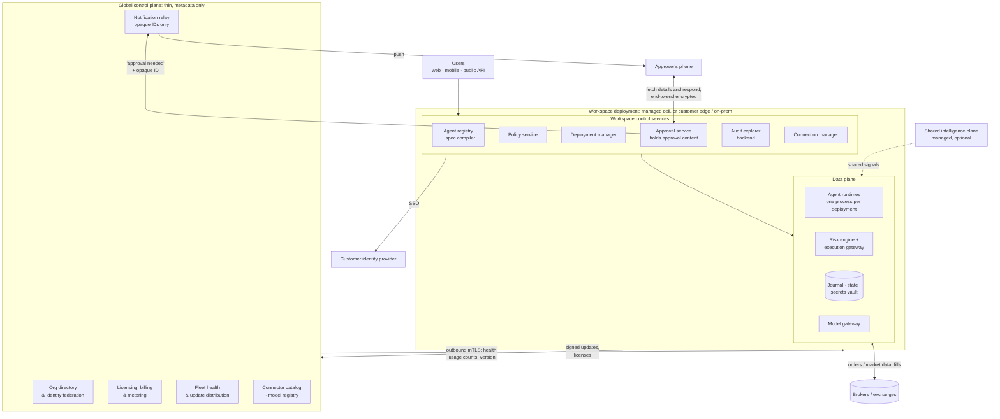
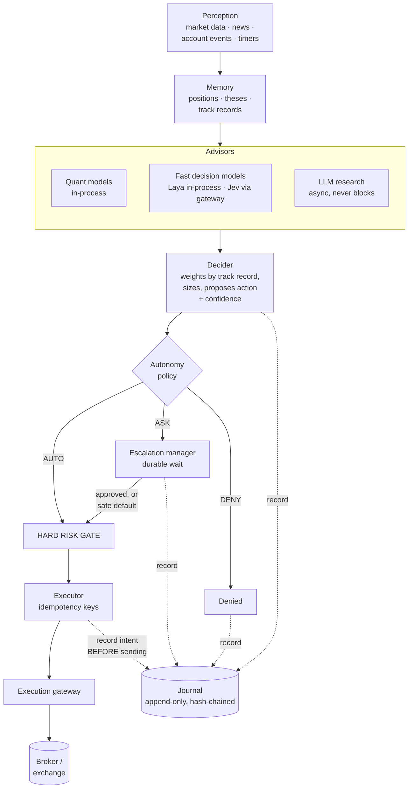
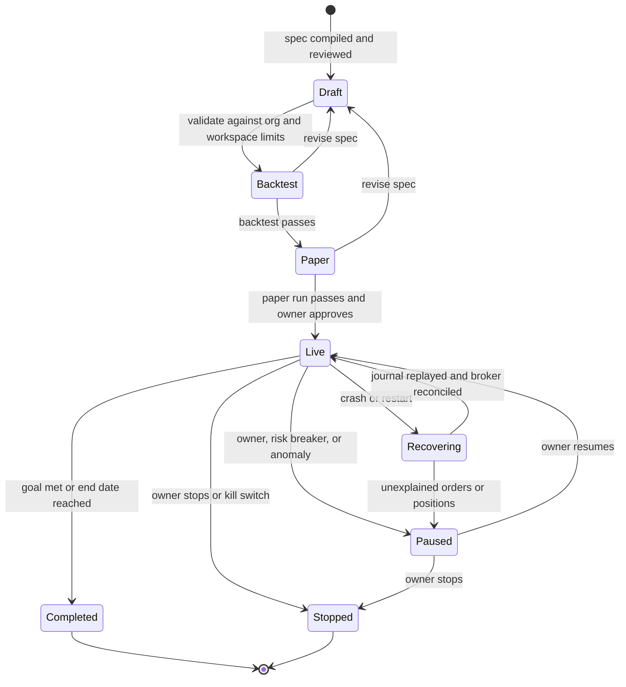
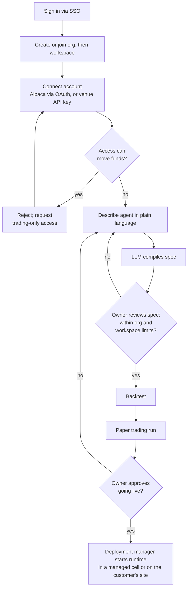
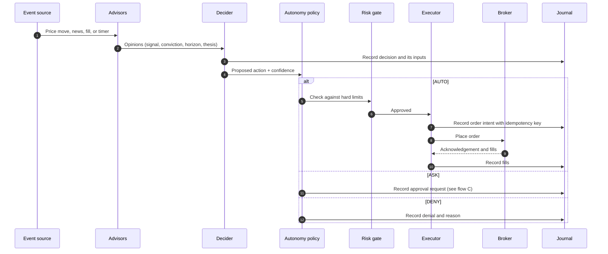
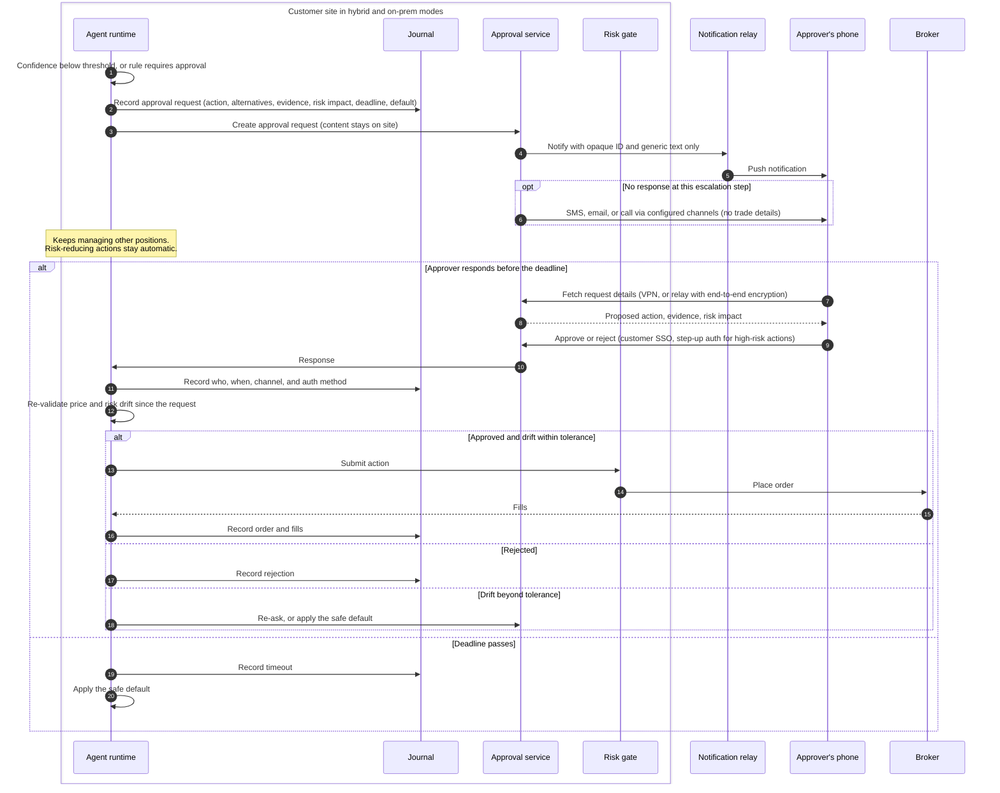
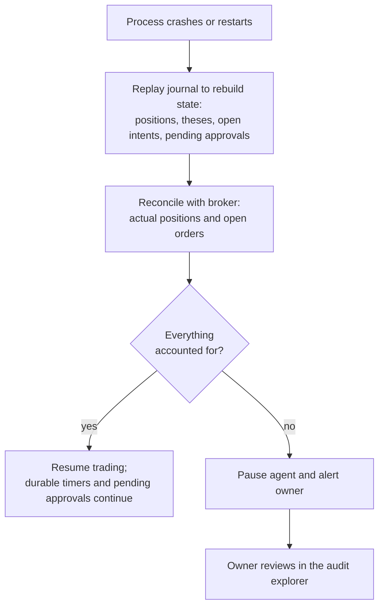

# Mandate: High-Level Design

| | |
|---|---|
| **Status** | Draft v0.2 |
| **Last updated** | 2026-09-24 |
| **Scope** | Production service for deploying autonomous trading agents: fully managed, hybrid, or fully on-prem / air-gapped |

## Contents

1. [Summary](#1-summary)
2. [Requirements](#2-requirements)
3. [Core concepts](#3-core-concepts)
4. [Architecture](#4-architecture)
5. [Agent runtime](#5-agent-runtime)
6. [Key flows](#6-key-flows)
7. [Logging and audit](#7-logging-and-audit)
8. [Multi-tenancy and security](#8-multi-tenancy-and-security)
9. [Intelligence layer](#9-intelligence-layer)
10. [Billing](#10-billing)
11. [Technology](#11-technology)
12. [Risks and open decisions](#12-risks-and-open-decisions)

---

## 1. Summary

Users connect their brokerage or exchange accounts, grant scoped permissions, and create
**autonomous agents** by describing a goal and behavior. Each agent runs continuously,
works toward its goal, and makes trading decisions on its own. When it is unsure, or when a
decision exceeds what it is allowed to do alone, it notifies the user (push, SMS, email,
chat), waits with a deadline, and then acts on the response, or on a safe default if nobody
answers. Every observation, analysis, decision, approval, order, and fill is recorded in a
tamper-evident log.

The platform is multi-tenant (**Organization → Workspace → Agents**), supports SSO, bills per
organization, and runs in three modes: fully managed on our infrastructure, hybrid (a thin
hosted control plane with everything sensitive on the customer's side), or fully on-prem /
air-gapped. It serves both retail users (managed) and businesses (any mode).

Design principles:

- **The agent spec is the contract.** An agent can never act outside the goal, universe,
  risk limits, and autonomy rules its owner approved.
- **Reducing risk never needs approval; increasing risk beyond agreed limits always does.**
- **Safe defaults everywhere.** Timeouts, outages, and ambiguity resolve to "don't add risk".
- **Record before acting.** Intent is journaled before any order leaves the system.
- **One installer, three deployment modes.** The same software runs managed, hybrid, or fully
  on-prem. In hybrid and on-prem modes, strategy, approvals, audit data, and credentials never
  leave the customer's site.

---

## 2. Requirements

### Functional

- **Tenancy:** Organization → Workspace → Agents. Billing is per organization; the workspace is the tenant.
- **Identity:** SSO via SAML / OIDC and SCIM provisioning for businesses; email, passkey, or social login for retail.
- **Accounts:** connect broker / exchange accounts and grant scoped permissions to specific agents.
- **Agent definition:** goal, behavior, instruments, risk limits, autonomy rules (what it may do alone vs. must ask), lifetime, notification preferences.
- **Deployment:** many agents per workspace, deployable at any time; pause, resume, stop, clone, and version.
- **Lifetime:** run forever, until a date, or until the goal is met.
- **Escalation:** when unsure, notify the user, wait with a deadline, then execute the response or the safe default.
- **Audit:** everything recorded, queryable, and replayable.
- **Deployment modes:** fully managed; hybrid (thin hosted control plane, everything sensitive on the customer's side); fully on-prem / air-gapped.

### Non-functional

- **Safety:** hard risk gates that agent logic cannot bypass; kill switches at every level; fail-safe defaults.
- **Latency tiers:** microseconds on the execution path; 30–300 ms for fast decisions; seconds to minutes for research, which runs asynchronously and never blocks trading.
- **Durability:** agents run indefinitely and survive crashes, restarts, and upgrades, with no duplicate orders.
- **Isolation:** tenant data, secrets, and processes separated; no noisy neighbors.
- **Auditability:** tamper-evident logs, configurable retention, export.

---

## 3. Core concepts



| Entity | What it is |
|---|---|
| Organization | Billing, SSO configuration, org-wide policies and limits, audit |
| Workspace | **The tenant.** Members, connections, agents, data, encryption keys |
| Connection | A broker / exchange account, a reference to its stored credential, and the scopes granted to agents |
| Agent / Agent version | A versioned definition (the "spec") |
| Deployment | A running instance of one agent version, with a lifecycle |
| Event | One journaled step: observation, analysis, decision, approval, order, fill, or position change |

**Policies inherit downward and can only tighten.** An organization sets a maximum; a
workspace may lower it; an agent may lower it further. Nothing below can loosen what is above.



Every deployment journals a causal chain of events:



### The agent spec

Users describe an agent in plain language or through a form. An LLM **compiles** the
description into a structured spec, which the user reviews and approves. The spec is the
contract: the agent cannot act outside it.

```yaml
agent: btc-accumulator
goal:
  objective: "Accumulate 2 BTC at an average price below $58k"
  done_when: position >= 2 BTC            # or: forever | a date | a return target
universe: [BTC/USD]
connection: conn_alpaca_paper
behavior:
  description: "Buy dips, avoid trading 30 min around major macro news"
  advisors: [quant.mean_reversion, fast.news_materiality, llm.research]
  cadence: event-driven + every 15 min
risk:   { max_position_usd: 150000, max_leverage: 1, max_daily_loss_pct: 2, max_drawdown_pct: 8 }
autonomy:
  auto: [reduce_risk, orders_below_usd: 5000]
  ask:  [orders_above_usd: 5000, confidence_below: 0.65, unusual_market_input]
  on_timeout: { after: 10m, default: skip }   # the default is always the safe option
notify: { approvers: [role:approver], channels: [push, sms, email], quiet_hours: "23:00-07:00" }
```

Goal types the spec supports:

- **Accumulate / distribute** a position within price and time constraints.
- **Return target** under risk limits (e.g. target return with a maximum drawdown).
- **Mandate** (hedge, rebalance, or maintain an exposure).
- **Event-driven** (act on defined event classes such as earnings, filings, or macro releases).

---

## 4. Architecture

The control plane is split in two. A **thin global control plane** holds only non-sensitive
metadata. Everything that reveals strategy or trading intent lives in the **workspace
deployment**, next to the agents, wherever that deployment runs.



### Global control plane (thin)

Holds only what is safe to keep outside the customer's site:

- **Org directory and identity federation:** organizations, workspace IDs, user IDs, and roles,
  for seat counts and routing. Authentication itself happens against the customer's identity
  provider, directly from the workspace deployment.
- **Licensing, billing, and metering:** usage counts, never content.
- **Fleet health and update distribution:** versions, heartbeats, signed release bundles.
- **Notification relay:** delivers push notifications to phones through Apple's and Google's
  push services. Payloads carry only an opaque ID and generic text.
- **Connector catalog and model registry:** downloadable connectors and model artifacts.

It never sits in the path of a trade, and it never holds strategy, approval content, audit
data, positions, or credentials.

### Workspace deployment

Workspace control services and the data plane always run together:

- **Workspace control services:** agent registry and spec compiler, policy service,
  deployment manager, approval service, audit explorer backend, connection manager.
- **Data plane:** agent runtimes, risk engine, execution gateway, journal and state, secrets
  vault, model gateway.

In managed mode, workspace deployments are grouped into **cells**, each hosting many
workspaces. Cells bound the blast radius of failures and allow data residency by region.
Large customers get a dedicated cell. On the customer's side, the deployment makes
**outbound-only** connections to the global control plane over mutual TLS; no inbound ports
are opened.

### Deployment modes

| Component | Managed | Hybrid | Fully on-prem / air-gapped |
|---|---|---|---|
| Global control plane | Ours | Ours | Customer's (same software) |
| Workspace control services | Ours | Customer's | Customer's |
| Data plane | Ours | Customer's | Customer's |
| Shared intelligence | Ours | Optional subscription | Optional offline feed, or none |
| Typical customer | Retail, small teams | Most businesses | Banks, funds with strict policies |

What changes in fully on-prem / air-gapped mode:

- **Identity:** SSO directly against the customer's identity provider.
- **Notifications:** through the customer's own channels (mail server, Teams or Slack, their
  SMS gateway), or push through our relay if they allow that single outbound connection.
- **Billing:** a signed license file plus periodic usage reports delivered offline.
- **Updates:** signed release bundles the customer installs.

**Engineering rule:** every component ships from the same installer and runs in our cloud or
theirs. No hosted-only dependency is allowed in a core path, so fully on-prem is a packaging
choice, not a separate product.

### Where data lives

| Data | Sensitivity | Managed | Hybrid | Fully on-prem |
|---|---|---|---|---|
| Org directory: org, workspace, and user IDs, roles | Low | Ours | Ours (IDs only) | Customer's |
| Usage counts, versions, heartbeats | Low | Ours | Ours | Customer's; offline reports |
| Agent specs: goals, instruments, limits, behavior | **High (strategy)** | Ours | Customer's | Customer's |
| Approval requests and responses | **High (trading intent)** | Ours | Customer's | Customer's |
| Journal, audit data, positions, orders, fills | **High** | Ours | Customer's | Customer's |
| Model prompts and outputs | **High** | Ours | Customer's | Customer's |
| Broker / exchange credentials | **Critical** | Our vault | Customer's vault | Customer's vault |
| Notification payloads through the relay | Low (opaque IDs) | Ours | Ours | Customer's, or our relay if allowed |

External model calls (Jev, hosted LLMs) send prompt content to those providers. Each
workspace's policy decides which providers are allowed; hybrid and on-prem deployments can
be restricted to local models only.

### Behavior when the global control plane is unavailable

- **Trading continues** in every mode; the global control plane is never in the trade path.
- **Approvals continue** in hybrid mode through the customer-side channels configured as
  fallbacks (email via their mail server, Teams or Slack); only relay-delivered push is lost.
  Approvers authenticate against the customer's identity provider, not against us.
- **Deferred:** usage reports and updates queue until the connection returns.

### Shared intelligence plane

Market data ingestion and judgments about public events (for example, "is this filing
material to this company?") are computed once and fanned out to all subscribed workspaces.
This is the main cost lever for the managed offering. Hybrid and on-prem deployments can subscribe to it
or run their own.

---

## 5. Agent runtime

Written in Rust. One process per agent deployment.



| Component | Responsibility |
|---|---|
| Perception | Subscribes to market data, news, account events, and timers; fills and position updates from the broker arrive here, closing the loop |
| Memory | Positions, theses (why each position exists and what would invalidate it), advisor track records, lessons |
| Advisors | Produce opinions in a common signal format: quant models, fast decision models, LLM research |
| Decider | Weights advisors by earned track record, sizes positions from calibrated confidence, proposes an action |
| Autonomy policy | Classifies each proposed action as AUTO, ASK, or DENY according to the spec |
| Escalation manager | Creates approval requests, waits durably, applies responses or safe defaults |
| Risk gate | Independent code on the execution path that enforces the policy hierarchy |
| Executor | Turns decisions into orders with idempotency keys; reconciles with the broker |
| Journal | Append-only, hash-chained record of every step |

### Isolation and custom logic

- **One process per deployment**, with OS-level CPU and memory limits. This gives real
  isolation and independent lifecycles, and many small retail agents can still share a host.
- **User-supplied logic**, if enabled, runs as **WebAssembly plug-ins** (sandboxed,
  deterministic, language-neutral). Heavier workloads use Firecracker micro-VMs.

### Durability

- **Write-ahead intent:** every order intent is journaled before it is sent, with an
  idempotency key, so a retry after a crash can never double-trade.
- **Event-sourced state:** on restart, the runtime replays its journal, reconciles against the
  broker's actual positions and open orders, and resumes.
- **Durable timers:** long waits (an approval pending for hours, "run until December") use a
  durable-execution engine. Restate is preferred because it ships as a single Rust binary that
  also runs on the edge; Temporal is the established alternative.
- **Venue-side protection:** protective exits rest at the broker as OCO or bracket orders, so
  positions keep protection if the platform is down, within limits: equity stops trigger only in
  the regular session, crypto stop-limits can miss on gaps, and exits briefly remove protection
  while they run ([trading domain spec §5.4](specs/trading-domain.md#54-protective-exits-dec-28-dec-36)).

### Agent lifecycle



Waiting for an approval is not a separate lifecycle state: a live agent can have pending
approvals for some actions while it keeps managing everything else.

---

## 6. Key flows

### A. Onboarding to first deployment

1. User signs in via SSO and creates or joins an organization, then a workspace.
2. User connects an account. **The platform never holds permissions that can move funds:**
   OAuth connections (Alpaca) request trading and account-read scopes only; for API-key
   connections (Kraken Derivatives US), the platform queries the key's permissions from the venue
   and rejects any key that allows withdrawals or transfers.
3. User creates an agent: plain-language description → compiled spec → review. Risk and
   autonomy rules are validated against organization and workspace limits.
4. A **backtest and a paper-trading run are required** before the agent may trade live.
5. User deploys; the deployment manager in the workspace deployment starts the runtime, in a managed cell or on the customer's site.



### B. Decision cycle

1. An event arrives: price move, news, fill, or timer.
2. Advisors produce opinions.
3. The decider proposes an action with a confidence level.
4. The autonomy policy classifies it as AUTO, ASK, or DENY.
5. The risk gate checks it.
6. The executor places the order. Every step is journaled with links to its causes.



### C. Escalation: unsure → ask → wait → act

1. **Triggers:** confidence below threshold, a rule that requires approval, an unusual market
   input (distribution drift), or a trade too large to take alone.
2. The runtime creates an **approval request** containing the proposed action, alternatives,
   supporting evidence, risk impact, deadline, and the default applied on timeout.
3. The agent keeps managing everything else while it waits. **Risk-reducing actions stay automatic.**
4. The **approval service**, which runs in the workspace deployment, sends notifications
   according to user preferences and an escalation chain (push → SMS → phone call), respecting
   quiet hours. **Notifications carry only an opaque ID and generic text** ("Agent
   btc-accumulator needs approval"), never the trade itself. Push goes through our relay; SMS,
   email, and chat can go through the customer's own gateways. Large actions can require
   **two approvers**.
5. The approver opens the request. The app fetches the details **directly from the approval
   service**, over the customer's VPN or through the relay with end-to-end encryption, so the
   relay cannot read them. The approver authenticates against the customer's identity provider;
   **high-risk approvals require step-up authentication** (passkey or biometrics).
6. Before executing, the runtime **re-validates** that price and risk have not drifted beyond a
   tolerance since the request was created. If they have, it re-asks or applies the default.
7. On timeout, the safe default is applied.
8. Every step is journaled: who approved, when, through which channel, and how they authenticated.



### D. Crash recovery

The process restarts, replays its journal, reconciles with the broker, and resumes. Any
orders or positions it cannot account for trigger an alert and pause the agent.



---

## 7. Logging and audit

- **Per-workspace event store:** append-only and hash-chained. Each event links to its causes,
  so "why did this order happen?" is a single query from the fill back to the observations
  that triggered it.
- **Large artifacts** (LLM prompts and responses, data snapshots) live in object storage,
  content-addressed by hash; events store the hash.
- **Storage tiers:**
  - Hot (queryable): Postgres, moving to ClickHouse at scale.
  - Cold (retention): Parquet on object storage with write-once (object lock) retention.
  - Anchoring: the chain's root hash is periodically published externally so tampering is detectable.
- **Location:** the event store and the audit explorer backend run in the workspace
  deployment, so in hybrid and on-prem modes audit content never leaves the customer's site.
  The audit explorer UI reads directly from that backend.
- **Export** to the customer's SIEM or storage bucket; retention configured per organization.
- **Privacy:** personal data is encrypted with per-user keys. Deleting a key erases the person
  without breaking the immutable log (crypto-shredding).

---

## 8. Multi-tenancy and security

| Concern | Design |
|---|---|
| Tenant boundary | The workspace. Every record carries a workspace ID; row-level security in the database; per-workspace encryption keys; bring-your-own-key for businesses |
| Isolation tiers | Retail: shared cells with logical isolation. Business on managed: dedicated database or dedicated cell. Hybrid and on-prem: physically separate |
| Processes | Agent processes are never shared across workspaces |
| Messaging | NATS JetStream; its account model maps to workspaces, and it runs as a single binary on the edge |
| Roles | Org owner, org admin, billing admin, workspace admin, operator, **approver**, viewer, auditor. Optional separation of duties: an agent's creator cannot be its sole approver for large actions |
| Agent identity | Each agent has its own service identity and scoped tokens; every action is attributed to a specific agent |
| Credentials | Managed: vault backed by a key management service. Hybrid and on-prem: local vault; **credentials never leave the customer's environment** |
| Data location | Sensitive data stays in the workspace deployment; the global control plane holds only IDs, counts, and versions (see [Where data lives](#where-data-lives)) |
| Authentication | Workspace deployments authenticate users directly against the customer's identity provider, so logins and approvals keep working without the global control plane |
| Step-up authentication | Required to connect accounts, raise limits, approve large trades, or go live |
| Quotas | Per workspace: agents, model spend, API rate, data subscriptions |

**Kill switches at every level:** agent, connection, workspace, organization, and a global
switch for the managed service. Hybrid and on-prem customers control their own; the managed
global switch cannot reach into customer deployments.

---

## 9. Intelligence layer

- **Model gateway:** routes calls to Jev (hosted decision model), a Laya pool or in-process
  Laya (open-weight decision model), and LLM providers. Handles deadlines, fallbacks, and
  caching, and meters cost per workspace and per agent. Hybrid and on-prem deployments can be
  restricted to **local models only**.
- **Calibration service:** recalibrates each model's confidence against realized outcomes, per
  agent. Calibrated confidence is what determines whether an agent is "unsure".
- **Market data service:** normalized live streams plus a point-in-time historical store.
  Managed deployments ingest once and share; hybrid and on-prem deployments connect directly to venues.

Speed tiers:

| Tier | Latency | What runs there |
|---|---|---|
| Hot | microseconds | Market data handling, risk gate, order management, kill switch |
| Fast | 30–300 ms | Decision models (Laya, Jev) answering typed questions with probabilities |
| Slow | seconds–minutes | LLM research: reading filings and news, writing theses; never blocks trading |

---

## 10. Billing

- **Billed entity:** the organization.
- **Components:** plan (seats and agents), usage (agent-hours, decisions, model tokens at cost
  plus margin, data), and hybrid / on-prem licenses.
- **Pipeline:** workspace deployments emit usage counts (never content) → metering pipeline in
  the global control plane → billing provider (Stripe Billing, Orb, or Metronome). Hybrid
  deployments send signed usage reports over their outbound connection; air-gapped deployments
  use a signed license file plus periodic offline usage reports.
- **Pricing constraint:** never charge per trade or as a percentage of assets. This keeps the
  platform a software business and away from broker-dealer and investment-adviser models.

---

## 11. Technology

| Layer | Choice |
|---|---|
| Agent runtime, risk engine, execution gateway, connectors, market data, journal writer | Rust |
| Research, model training and calibration, LLM tooling, Python SDK | Python (PyO3 bindings, gRPC) |
| Web app / mobile approvals | Next.js / React Native with push notifications |
| Storage | Postgres, object storage (S3, or MinIO on the edge), ClickHouse at scale |
| Messaging / durable execution | NATS JetStream / Restate (or Temporal) |
| Orchestration | Kubernetes cells (managed); Helm chart or single-node k3s (customer site) |
| Packaging | One installer deploys the global control plane, workspace control services, and data plane in any mode; signed release bundles for air-gapped sites |
| Sandboxing | WebAssembly plug-ins; Firecracker for heavier workloads |
| Observability | OpenTelemetry; agent traces double as part of the audit record |

---

## 12. Risks and open decisions

1. **Managed retail regulation.** Agents trading retail users' accounts is the riskiest
   combination, even when users define the agents. Obtain a legal review before launching
   retail. Business customers in hybrid or on-prem mode are the safest starting point.
2. **NautilusTrader licensing.** It is LGPL-3.0. Distributing it inside on-prem software,
   particularly statically linked Rust, carries relinking obligations. Decide whether to use
   its connectors or write our own.
3. **Market data redistribution.** Passing equities exchange data to tenants requires vendor
   and exchange licenses. In v1, each user's market data comes through their own Alpaca
   account, so Mandate does not redistribute it; any shared data offering needs licensing first.
4. **Custom code in v1.** Declarative specs only, or also WebAssembly plug-ins?
5. **First connectors (decided, [DEC-23](project/04-decision-log.md#decisions)).** Alpaca
   first (US stocks, ETFs, crypto spot; paper trading; OAuth), Kraken Derivatives US second
   (CFTC-regulated crypto perpetuals), then Interactive Brokers and Coinbase US futures. The
   platform serves the United States first.
6. **Approval channels in v1.** A native mobile app for push, or SMS, email, and Slack / Telegram first.
7. **Mobile access to on-site approval services.** Whether approvers reach the customer's
   approval service through the customer's VPN, through our relay with end-to-end encryption,
   or both; and how the mobile app is distributed to firms that require device management.
8. **Directory data in hybrid mode.** The minimum identity data the global control plane needs
   for seat billing and routing (for example, hashed user IDs instead of names and emails).
