# Billing Design

| | |
|---|---|
| **Status** | Draft v0.1. The engineering readings are Accepted (agent) in [DEC-442](../project/decisions/DEC-442.md); the provider, prices, grace lengths, trials, terms text, and tax handling are Proposed for the founder (DEC-79: spending, legal and compliance text) |
| **Implements** | [HLD §10](../HLD.md#10-billing); PRD [FR-10.1 to FR-10.3](../product/04-prd-v1.md#610-billing); [pricing and packaging](../product/07-pricing-and-packaging.md); milestone M12; backlog E14; design gap 11 |
| **Builds on** | [Inference spec §7](../specs/inference.md#7-cost-model-hooks) (metering record, reservations, billing feed); [infrastructure design §10](infrastructure.md#10-cost-model) (cost model, DEC-434 item 18 budgets); the global control plane design (#562, DEC-440: licenses, the usage-report chain, metering ingest); the identity spec (#556, DEC-437: the billing admin role, seats) |
| **Constraint** | [Compliance](../product/08-compliance-and-regulatory.md): never per trade, never on assets or profits, no custody of funds (`AGENTS.md`, "Do not") |

This document says what Mandate bills for, how usage is counted and turned into invoices, what a
plan entitles an organization to, and what happens when an organization does not pay. Nothing of
it is built (§8).

## Contents

1. [Scope and non-goals](#1-scope-and-non-goals)
2. [Invariants](#2-invariants)
3. [Plans and entitlements](#3-plans-and-entitlements)
4. [Metering pipeline](#4-metering-pipeline)
5. [Provider integration](#5-provider-integration)
6. [Lifecycle walk](#6-lifecycle-walk)
7. [Adversaries](#7-adversaries)
8. [What exists and what is planned](#8-what-exists-and-what-is-planned)
9. [Decisions](#9-decisions)
10. [Backlog](#10-backlog)
11. [Open questions](#11-open-questions)

---

## 1. Scope and non-goals

### 1.1 In scope

| Part | What it is |
|---|---|
| **Plans and entitlements** | What an organization bought: seats, workspaces, deployed agents, usage allowances, features. Turned into a signed license by the control plane's license service |
| **Metering** | Counting usage in each workspace deployment from journaled facts and the inference meter, sealing it into signed usage reports, and ingesting them |
| **Rating and invoicing** | Applying a versioned price book to ingested totals, through a billing provider that holds the payment method and sends invoices |
| **Quotas and spend caps** | Limits on new spend, checked before the spend, in the workspace deployment |
| **Non-payment** | Dunning, then withholding license renewal, then the license's own grace and lapse |

### 1.2 Non-goals and hard lines

- **Never per trade, never on assets or profits.** No price, quota, or usage dimension is derived
  from orders, fills, notional, positions, P&L, account value, or assets under management. This
  keeps Mandate a software business ([compliance](../product/08-compliance-and-regulatory.md),
  "No per-trade or outcome-based pricing").
- **Never holds funds.** Mandate keeps no stored-value balance that can be withdrawn, never takes
  payment from a trading account, and never stores card or bank numbers. The provider holds the
  payment method; Mandate holds the provider's opaque customer ID.
- **Never reads strategy.** Billing sees counts, costs, opaque IDs, and role names. It never sees a
  mandate, an instrument, a position, a thesis, a model prompt or output, or an order.
- **Never a trading control.** Billing cannot pause, stop, or flatten an agent, cancel an order, or
  engage a kill switch. Its one lever on a site is the license: after grace it refuses only new deployments and new openings, and never blocks an exit, a protective order, the kill switch, or any risk reduction (control plane design
  §3.3, DEC-440 item 13).
- **Not our own cost control.** The platform's internal monthly caps on infrastructure and
  inference spend (DEC-434 item 18) and the internal paper budgets ($5 per agent per risk day, $20
  per internal workspace per day; DEC-431 item 15) are operating budgets. They reuse this design's
  enforcement points (§3.4) but are not customer billing.

---

## 2. Invariants

Each "never" and "always" here is a test. Tests use an independent oracle: totals recomputed from
journaled events by a separate accumulator, never by calling the code under test.

| ID | Invariant | Source | Test |
|---|---|---|---|
| **BL-1** | **Counts and opaque IDs only.** A usage report, a metered total, and every message to the billing provider carry only opaque IDs, closed enumerations, counts, fixed-point costs, period bounds, versions, and digests. No field can hold an instrument, quantity, price of a security, mandate field, model content, or personal datum | HLD §10; CP-1; rule 6 | Type test on the report and provider-request types (no free `String` outside closed enumerations). Canary run: a workspace whose instruments, agent names, and users are unique canary strings trades a paper day; every byte sent to ingest and to the provider fake is scanned for every canary |
| **BL-2** | **No billable unit from trading activity.** The counter list (§4.1) is closed and none of its members reads an order, fill, intent, `DecisionMade`, position, P&L, or account value event | Compliance; pricing principle 2 | A counter-source test: each counter names its source event types, and a lint fails if any is on the deny list. Property test: two journals identical except for orders and fills (one trades, one holds) give identical usage reports |
| **BL-3** | **No custody, no trading account.** Billing has no dependency path to the vault, a broker connection, the account ledger, or the executor, and the price book has no stored-value or withdrawable balance type | Compliance; rule 7; rule 12 | Layering (`xtask/layers.toml`): the billing crates cannot depend on `mandate-executor`, connector, or vault crates. Schema test: credits exist only as invoice adjustments |
| **BL-4** | **Billing never stops risk reduction and never liquidates.** No billing state maps to a pause, stop, exit, cancel, or kill switch. Non-payment acts only by withholding license renewal; the license after grace it refuses only new deployments and new openings, and never blocks an exit, a protective order, the kill switch, or any risk reduction. It never stops a running agent; reconciliation, journal reads, and exports continue | Rules 2, 3, 13; CP-3, CP-6; identity spec §11.2 | Fault injection: an organization driven through every billing state (§6) while its paper agents hold positions; every exit, protective order, owner exit, risk exit, and kill switch passes in every state; after lapse, an opening is refused with `license_lapsed`, the refusal is raised by the risk gate (its gate record names the reason), and an exit in the same instrument is not refused |
| **BL-5** | **Non-payment follows a fixed, noticed ladder.** Openings are refused for non-payment no sooner than the end of dunning plus the license grace (§6.2), and each step is preceded by a notice to the org's owners and billing admins. Only a non-payment confirmed by the provider's API, never a webhook body or an outage, moves an organization down the ladder | Rule 3 (ambiguity never adds risk); DEC-440 item 13 | Clock-driven test over the ladder: no step happens early; a webhook claiming failure with the provider API showing paid moves nothing; a provider outage at renewal time renews |
| **BL-6** | **Metering is idempotent.** Any number of deliveries of the same reports, in any order, gives the same ingested totals and the same provider usage, because reports de-duplicate by `report_id` and provider calls carry deterministic idempotency keys (§5.2) | CP-10 | Fuzz: random duplicate, reordered, and delayed deliveries plus ingest and provider crashes give totals equal to a clean single delivery |
| **BL-7** | **Metering reconciles with the journal.** For every deployment and closed period, the sealed report equals a recount from the journal and the inference meter stream, and the billed total equals the sum of ingested reports. A mismatch or a chain gap holds the affected invoice line for review; it is never filled with an estimate | CP-10; inference spec §7.4 | Separate accumulator over journaled events and `meter:{workspace_id}` recomputes every counter; a seeded off-by-one in the report builder must fail it. Ingest test: a missing report holds the line |
| **BL-8** | **Quotas and spend caps are checked before the spend.** A capped dimension is reserved before it is incurred: a model call reserves its maximum cost (INF-7); a deployment commits the agent-hours left in the period (§3.4). A cap only refuses new spend; it never stops a running agent or touches a position | INF-7; CP §3.3 | Fuzz over calls, deployments, stops, restarts, and period boundaries: a separate accumulator shows spend never exceeds a cap, and no refusal ever appends a mode change, cancel, or exit |
| **BL-9** | **Bring-your-own-key usage is metered, not billed for tokens.** A call made with a customer's provider key counts toward quotas and rate caps and appears in usage, but its token cost is billed at zero; only calls on platform keys are billed at cost plus margin | HLD §10; DEC-432 item 16 | Rating test: the same calls marked `key_owner = customer` rate to zero token charges and identical quota consumption |
| **BL-10** | **No retroactive price change.** Price-book versions are immutable once published, take effect only at a future billing-cycle boundary, and each cycle is rated by the version pinned at its start. Re-rating a closed cycle reproduces its invoice exactly | Pricing principle 3; consumer fairness | Property test: publishing a new version at any moment never changes the rating of any usage in a cycle that started before its effective date; re-rating every closed cycle reproduces each line to the cent |
| **BL-11** | **Every invoice line traces to usage.** Each line names its counter, period, price-book version, and the `report_id`s it sums (or the plan entitlement it charges), so it is recomputable. A correction is a new line referencing the original; nothing is edited | Journal spec append-only rule | Trace test: for every line in a generated cycle, recomputing from the named reports and version gives the line amount; the billing store's tables accept no UPDATE or DELETE |
| **BL-12** | **Fixed-point money, one rounding.** Costs are fixed-point decimals (6 places, as inference spec §7.1); amounts are summed unrounded and rounded once per invoice line, half up, to the currency's minor unit | `AGENTS.md` conventions | Property test: line totals equal the rounded exact sum; no floating-point type in the billing crates (clippy `float_arithmetic` deny) |
| **BL-13** | **Tenant scope.** Billing records are keyed by `org_id` and read only by that organization's owners and billing admins and by platform billing staff; a deployment writes only its own reports | CP-11; HLD §8 | Cross-organization tests on every billing endpoint and on ingest |
| **BL-14** | **A billing outage never affects trading or an issued license.** With billing, ingest, or the provider down, sites run unchanged and reports queue; an unknown payment state renews a license rather than withholding it | CP-2, CP-8; rule 3 | Drill with billing and the provider fake down for longer than a renewal threshold: no license is withheld, no site changes behaviour, and queued reports drain with BL-6 totals |

| **BL-15** | **Billing notices are opaque** (rule 6). A notice Mandate sends about billing, a license, a quota, or a cap goes through the notification dispatcher (notifications spec, #558, NT-1) with exactly the payload `{notice, text}`: a random notice id and one text key from the closed set. Amounts, plan names, workspace names, counts, and invoice contents are never pushed; the recipient reads them after signing in. Emails the billing provider sends itself (receipts, dunning) are outside this path and are named as such in §6.1; they carry only what BL-1 lets the provider hold | Rule 6; NT-1; `AGENTS.md` safety-critical paths | BL-1's canary run extended to every billing notice kind through every channel adapter and the relay: every captured byte matches `{notice, text}` with a key from the closed set, and no canary or amount appears |

**Known limit, stated.** BL-7 holds for sites that run our software unmodified. A hybrid or
air-gapped customer controls its own software and could forge counts; §7 bounds what that buys.

---

## 3. Plans and entitlements

### 3.1 The model

The billed entity is the organization (HLD §10, FR-10.1). A plan is a named bundle; an
organization has one subscription to one plan at a time.

| Element | Meaning | Where enforced |
|---|---|---|
| **Plan** | Individual, Team, or Enterprise ([pricing](../product/07-pricing-and-packaging.md#packaging)), plus a free paper tier if the founder chooses one (DEC-442 item 17) | Billing; carried into the license |
| **Entitlements** | `max_workspaces`, `max_agents_deployed` (split paper and live), `max_seats`, feature flags from a closed list (`hybrid`, `sso_saml`, `scim`, `siem_export`, `connected_clients`), and per-workspace usage allotments (§3.4) | The license (control plane design §3.3), verified on the site |
| **Usage dimensions** | The counters of §4.1. A dimension is priced only if the price book says so | Rating, in billing |
| **Allowance** | Included units per cycle per dimension; usage above it is overage | Rating |
| **Add-ons** | Extra live agents or seats bought above the plan, which raise entitlements | Billing, then a new license |
| **Price book** | Versioned, immutable prices per plan, dimension, and add-on, with the token margin and an `effective_from` cycle boundary (BL-10) | Rating |

Entitlements and prices are separate on purpose: the license (what may run) is verified on the site
with no network call, while prices never leave the global control plane.

### 3.2 Seats

A seat is a user ID with any role in the organization, counted from the directory, which holds IDs
and role names only (identity spec ID-15). The billing admin role sees plans and invoices only
(identity spec §4). Adding a member beyond `max_seats` is refused at invitation with a reason code,
or bought as an add-on; it never removes an existing member. How seats are counted for price (the
cycle's peak, or its last day) is a pricing rule (DEC-442 item 15).

### 3.3 Trials and the free paper tier

- A trial is a plan with an end date and entitlements limited to **paper agents only**: no live
  connection is permitted while live trading waits on counsel's sign-off anyway (HLD §12 item 1).
- A trial ending without a paid plan moves the organization to the free paper tier if one exists,
  or to non-renewal (§6.2). Because trial agents are paper, the ladder costs no real-money risk.
- One trial per organization; whether a trial needs a payment method, and how duplicate
  organizations are limited, is DEC-442 item 17.

### 3.4 Quota enforcement points

Every enforcement point is local to the workspace deployment, so it works with the control plane
unreachable (CP-2), and each refuses only new activity (BL-8).

| Quota | Enforced at | Before the spend | On reaching it |
|---|---|---|---|
| Workspaces | Workspace creation (workspace API) | Count against `max_workspaces` | Creation refused with a reason code |
| Deployed agents (paper, live) | Deployment manager, before `AgentDeployed` | Count against `max_agents_deployed` | Deployment refused (`DeploymentRejected`, reason `entitlement`); running agents untouched |
| Seats | Invitation (identity) | Count against `max_seats` | Invitation refused |
| Model spend | Model gateway (inference spec §7.3) | Reservation of the call's maximum cost against the workspace's monthly allotment and the daily caps | `budget_exhausted`; no fresh model output, which only shrinks buys (INF-4) |
| Agent-hours (only if the plan caps them) | Deployment manager | At deployment and at each cycle start, commit the hours left in the cycle for each running agent; deploy only if `used + committed + new ≤ cap` | Deployment refused. A running agent is never stopped for hours: its hours were committed when it was deployed |
| Org spend cap (set by a billing admin) | Split into per-workspace allotments carried in the license | As the rows above | As the rows above, plus a notice to billing admins at 50%, 80%, and 100% (the DEC-434 item 18 pattern; opaque, BL-15) |
| Opening or increasing orders (after lapse) | The risk gate, as gate reason `license_lapsed` (control plane design §3.3), reading the license state the site verified locally from the signed license | The gate checks it with every other check, before the order is sent | The opening is refused. Risk exits, protective orders, owner exits, discretionary exits, and kill switches are exempt as always (rule 13); the check lives in the gate because the exemptions do. No other enforcement point refuses an order |

The cycle allotment is a fourth cap in inference spec §7.3's table, per billing cycle, and is
enforced alongside the per-risk-day caps (the envelope's research cost cap and the workspace's daily
model spend), never instead of them. A call starts only if it fits under all of them.

**Why per-workspace allotments.** An organization's monthly model spend cap cannot be checked
exactly across workspaces in different cells without a network call in the path of a model call.
The license carries each workspace's allotment instead (`model_spend_usd_per_cycle`), the gateway
enforces it locally with reservations, and a billing admin rebalances by having a new license
issued. A raised allotment is not risk: it allows more model calls, each still bounded by the
envelope's `cost_cap_usd_per_day` (DEC-120) and the gateway's checks.

---

## 4. Metering pipeline

```mermaid
flowchart LR
    subgraph WS["Workspace deployment"]
        j["Journal and<br/>meter streams"] --> b["Usage builder"]
        b --> s["UsageReportSealed<br/>(signed, chained)"]
        s --> q["cp-agent queue"]
    end
    q -->|"outbound mTLS, or a file<br/>when air-gapped"| ing["Metering ingest<br/>(control plane)"]
    ing --> agg["Aggregation<br/>per org, counter, cycle"]
    agg --> rec["Reconciliation<br/>and holds"]
    rec --> rate["Rating<br/>(price book version)"]
    rate --> prov["Billing provider<br/>(interface, §5)"]
    prov -.->|"webhooks as hints;<br/>state by API read"| bill["Billing state"]
    bill -->|"renew or withhold"| lic["License service"]
```



### 4.1 Counters

The closed list, extended from the control plane design §3.5 with the key owner (BL-9). Every
counter is per organization, deployment, and hourly period; none is per agent or per instrument in
what leaves the site.

| Counter | Source on the site | Notes |
|---|---|---|
| `agent_hours_paper`, `agent_hours_live` | Deployment and mode events (`AgentDeployed`, `AgentModeChanged`, `AgentStopped`), in seconds, summed | Mode from the stream's `environment` (ES-23), never self-declared |
| `decision_cycles` | The runtime's completed evaluation cycles, holds included | Never `DecisionMade`, which is intent-level (BL-2). Recommended unpriced in v1 (DEC-442 item 15) |
| `model_calls`, `input_tokens`, `output_tokens`, `cached_tokens` | Inference metering records (inference spec §7.1) | Split by `endpoint_class`, provider, and `key_owner`, carried through the site's sum (inference spec §7.4) to ingest. A customer key is the customer's own aggregator account, or a provider key that aggregator routes, under the same routing lock (DEC-432 items 14, 16) |
| `model_cost_usd` | The same records' `cost_usd` | Our cost, before margin; the margin is applied in rating, never on the site |
| `workspaces`, `seats` | Workspace and membership events | Peak in the period |
| `data_units` | Zero in v1: each user's data comes through their own Alpaca account (HLD §12 item 3) | Reserved so a shared data offering needs no format change |

### 4.2 Emission and sealing

- The usage builder runs in the workspace deployment and reads only the event types its counters
  name. It closes each hourly period (DEC-440 item 17 recommends hourly) after the period's end
  plus a settle delay, so late-appended events of the period are in.
- It appends `UsageReportSealed` to the control stream, then signs the report with the deployment
  key and chains it by `prev_report_hash` (DEC-440 item 9). The journal event comes first, so a
  report can always be rebuilt and the queue can never hold a report the journal lacks.
- `mandate-cli usage recount` recomputes any period from the journal and compares it with the sealed
  report (BL-7). Hybrid customers can run it to check what they are billed.

### 4.3 Ingest, aggregation, reconciliation

| Step | Rule |
|---|---|
| Verify | Signature against the deployment's enrolled key; chain continuity; counters in the closed list. A failure is refused and recorded, never partly applied |
| De-duplicate | By `report_id`; a second copy is acknowledged and dropped (BL-6) |
| Aggregate | Sum per organization, counter, `key_owner`, and billing cycle. A period belongs to the cycle containing its `period_start`; cycles start on hour boundaries, so no period straddles two |
| Reconcile | A cycle's line is final only when every deployment's chain is continuous through the cycle end. A gap, a late report past the close window, or a bounds check failure (§7) holds the line for billing review |
| Model cost | Platform-key `model_cost_usd` is compared with the provider invoices for our keys (inference spec §7.2). A difference is our cost variance; it never changes a customer's line or a risk day's cap accounting |

### 4.4 Corrections

A sealed report is never changed. If a recount finds a sealed report wrong (a builder defect), the
site seals a **correction report** that names the original and carries signed deltas. A correction
for an open cycle adjusts that cycle; one for a closed cycle becomes a separate credit or debit line
on the next invoice, referencing the original lines (BL-11). Corrections in the customer's favour
are applied automatically; ones against the customer need billing staff review and a notice.

### 4.5 Hybrid and air-gapped

| Mode | License | Usage |
|---|---|---|
| Managed | Issued per cell from the plan through the same code | Reports over the cell's link |
| Hybrid | Signed license pulled over the outbound link, term as contract (DEC-440 item 14) | Signed reports over the link; queued on disk while it is down (CP-10) |
| Air-gapped | Signed license file installed by hand | The queue exported as a signed file on a schedule in the contract (Proposed: monthly); ingest verifies it like a stream. A late file holds the lines, never estimates them |

---

## 5. Provider integration

### 5.1 Interface

Billing talks to the provider through one interface, so the provider choice (DEC-442 item 14) is
reversible and every test runs against a recorded fake.

| Operation | Purpose | Idempotency key |
|---|---|---|
| `upsert_customer(org_id)` | Create the provider customer; returns an opaque ID | `org_id` |
| `set_subscription(org_id, plan, add_ons, effective_at)` | Plan changes | `org_id`, plan change ID |
| `report_usage(org_id, counter, cycle, quantity, report_ids_digest)` | Push rated or raw usage | SHA-256 of `org_id`, counter, cycle, and the sorted `report_id`s |
| `issue_credit(org_id, invoice_line_ref, amount, reason_code)` | Refunds and corrections | Correction or refund ID |
| `get_account_state(org_id)` | Paid-through date, open invoices, dunning state | Read only |
| Hosted checkout and portal links | The customer enters payment details on the provider's page | None; Mandate never sees the card or bank number (BL-3) |

What the provider receives is BL-1's closed set plus the billing contact the org owner enters on the
provider's own page. Whether the provider rates usage from raw counts or receives rated amounts
depends on the provider; either way the price-book version and report digests stay ours.

### 5.2 Idempotency and ordering

- Every write carries the deterministic key above, so a retry after a timeout cannot double-bill
  (BL-6). A usage push for a cycle whose set of reports changed carries a new key and replaces the
  prior quantity through the provider's correction mechanism, never by adding to it.
- An outbox in the billing store holds every provider call; a crash between commit and send resends
  with the same key.

### 5.3 Webhooks

- Each webhook's signature is verified against the provider's signing secret, held in the control
  plane's vault, and its event ID is de-duplicated.
- **A webhook is a hint, never a fact.** On any webhook, billing reads the account state through the
  provider's API and acts on that (BL-5). A forged or replayed webhook therefore changes nothing the
  API does not confirm.
- Webhooks are journaled in the control plane's own audit log with the event ID and type, never the
  body's personal data.

### 5.4 Failure handling

| Failure | Effect | Exit |
|---|---|---|
| Provider down | Pushes wait in the outbox; invoices are late; no license is withheld (BL-14) | Provider returns; outbox drains with the same keys |
| Ingest or billing down | Sites queue reports (CP-10); licenses already issued run their term | Service returns; queues drain |
| Provider and our totals disagree | The line is held; a reconciliation alert (opaque IDs) goes to billing staff | Staff correct through §4.4 |
| Provider account suspended or migrated | Billing state freezes at last known; renewals continue (BL-14) | A new provider behind the same interface; history stays in our store |

---

## 6. Lifecycle walk

### 6.1 Each state to its exit

| Step | Entered by | What it changes | How it ends, and who ends it |
|---|---|---|---|
| **Sign-up** | Org owner creates an organization | A provider customer; a trial or free paper plan; a license with paper-only entitlements | Trial start, or a paid plan chosen at the hosted checkout |
| **Trial** | Sign-up | Paper agents within trial entitlements; usage metered as for paid plans | Upgrade (paid plan), or the end date: free paper tier or non-renewal (§3.3). A notice 7 days before (Proposed) |
| **Upgrade mid-cycle** | Billing admin or owner | New entitlements now; a new license (higher `sequence`); proration by the provider | Immediate. Raising an entitlement only allows deployments, each still needing a confirmed mandate version (CP §3.3) |
| **Downgrade mid-cycle** | Billing admin or owner | Takes effect at the next cycle boundary (recommended, DEC-442 item 15). The new license's lower entitlements refuse new deployments only | The cycle boundary. If more agents run than the new plan allows, none is stopped; the owner sees which deployments the plan no longer covers and is billed overage until the owner stops some (stopping is the owner's act) |
| **Payment failure** | The provider's API shows an invoice unpaid | Status `past_due`; notices to owners and billing admins | Payment succeeds (back to active), or dunning ends unpaid |
| **Dunning** | `past_due` | Provider retries on its schedule (Proposed: 14 days); notices at each retry. Trading unchanged | Paid: active. Unpaid at the end: renewal withheld |
| **Renewal withheld** | Dunning ended unpaid, confirmed by API read (BL-5) | The license service stops issuing renewals. The site's license runs to `not_after` | Payment: a renewal is issued at once. Otherwise the license reaches `not_after` |
| **License grace** | Site clock past `not_after` (control plane §3.3) | Banners only; nothing new beyond the license's limits | Payment and a new license, or `grace_days` elapse (Proposed: 30, DEC-440 item 13) |
| **Lapsed** | Grace elapsed | Refuses only new deployments (and resumes into an opening mode) and new openings, through the risk gate's `license_lapsed` (§3.4); never blocks an exit, a protective order, the kill switch, or any risk reduction. Reconciliation, journal reads, and exports continue (BL-4) | A new license after payment; agents return to their journaled mode, and nothing paused for another reason resumes |
| **Cancellation** | Owner cancels | Effective at the cycle end (Proposed); the final invoice carries that cycle's usage; renewal is not issued past it, so the license then follows grace and lapse | Reactivation before lapse; or the organization stays lapsed with read and export access for the records period |
| **Refund** | Billing staff, under the refund terms (counsel) | A credit through `issue_credit` against named invoice lines (BL-11). Paid back by the provider to the original method, never to or from a trading account | The credit is journaled in billing's audit log |
| **Organization deletion** | Owner, after every agent is stopped and every live connection removed | Billing closes the subscription, settles the final invoice, and deletes the provider customer's personal data where the provider allows. Billing records (invoices, report digests) are kept for the tax and records retention period | Retention ends; journal retention is the journal spec's (§6.2), not billing's |

**Notice channels.** Every notice above that Mandate sends is an opaque notice (BL-15): `{notice,
text}` through the notification dispatcher, read in full only after sign-in. Banners are in the
signed-in app, not notices. The provider's own emails are a separate channel we do not template.

| Notice | Sent by | Channel |
|---|---|---|
| Trial ending, renewal withheld, license `renewal_due`, grace, lapse | Mandate | Opaque notice through the dispatcher (#558), to owners and org admins; an in-app banner for billing admins, who receive nothing pushed (#558 §3.3) |
| Payment failed, dunning retries, receipts, invoices, refunds | The billing provider | The provider's own email to the billing contact entered on its hosted page; outside rule 6's payload path, and holding only BL-1's fields plus the invoice the provider rendered |
| Spend at 50%, 80%, 100% of a cap | Mandate | Opaque notice and an in-app banner |
| A correction against the customer (§4.4) | Mandate | Opaque notice; the correction is read in the app |

The closed text set in #558 §4.2 has no billing key today; `account_changed` covers these notices
until a `billing_update` key is added by a spec change (§11).

### 6.2 The non-payment ladder

```
invoice unpaid ─▶ dunning (Proposed 14 d) ─▶ renewal withheld ─▶ license not_after ─▶ grace (Proposed 30 d) ─▶ lapsed
   trading unchanged            trading unchanged        trading unchanged       banners only        openings refused; exits never
```

- For **managed** organizations the license term follows the paid-through date, so a withheld
  renewal reaches `not_after` at the end of the paid cycle. The earliest openings can be refused is
  therefore the end of the paid cycle plus grace, and never before dunning has ended.
- For **hybrid** organizations the license runs the contract term (DEC-440 item 14). Billing cannot
  revoke it mid-term: there is no revocation message (CP-8), and missing heartbeats revoke nothing.
  Non-payment mid-term is a contract matter for counsel's terms; the license lapses only at term
  end plus grace.
- **Reconciling DEC-440 item 13 with the identity spec §11.2.** The identity spec says a license past
  grace is "a billing matter, never a trading stop". This design is built against DEC-440 item 13's
  recommendation, as DEC-440 instructs while the item is Proposed: after grace a license refuses
  only new deployments and new openings, and never blocks an exit, a protective order, the kill
  switch, or any risk reduction. That adds no risk. The final wording, in CP-6, BL-4, and identity
  §11.2 alike, stays the founder's under DEC-440 item 13 (DEC-442 item 2).

---

## 7. Adversaries

| Who | Attempt | What stops it | Residual |
|---|---|---|---|
| **Hybrid or air-gapped site** | Under-reports usage by modifying its software or withholding files | The main priced lever, deployed agents, is bounded by the signed license, not by reports. Bounds checks at ingest: `agent_hours ≤ max_agents_deployed × period length`; chain gaps hold lines; missing air-gapped files hold lines; an audit right in the license terms (DEC-440 item 17, counsel) | Under-reported model tokens on BYO keys cost nothing (BL-9); on platform keys, our provider invoices show the true spend for our keys (§4.3), so the gap is detected. Agent-hours within the license bound can be under-reported: billing risk, accepted |
| **Network attacker or buggy site** | Replays old reports to inflate or a stale one to confuse | `report_id` de-duplication, the hash chain, signatures by the enrolled deployment key; a replayed report is acknowledged and dropped (BL-6) | None found |
| **Tenant** | Games quotas: splits across workspaces, deploys and stops to reset hours, labels live as paper | Quotas are per organization, split into allotments the license carries; hours are summed in seconds across deploys; mode comes from the stream's `environment` (ES-23) | Several organizations for several trials: limited per DEC-442 item 17 |
| **Tenant** | Sets the site clock back to stretch a license | The site checks validity against the highest UTC time it has journaled (control plane §6) | A clock frozen from install: billing risk only |
| **Attacker with the webhook endpoint or a stolen signing secret** | Forges "payment failed" to lapse a victim, or "paid" to avoid lapse | Webhooks are hints; state comes from the provider API (§5.3). Even a lapse only refuses openings after grace (BL-4) | A compromised provider account could report false state through its API: worst case a victim's openings stop after the full ladder, with notices at each step; never an exit blocked |
| **Malicious platform insider** | Withholds renewal to coerce a customer | The ladder's notices; two-person license changes (DEC-440 item 10); lapse refuses openings only | Commercial leverage over openings at term end, disclosed in terms |
| **Malicious platform insider** | Re-rates past cycles at higher prices | Immutable price versions pinned per cycle (BL-10); corrections only as traced new lines (BL-11) | None found |
| **Careless billing admin** | Sets an org spend cap to zero by mistake | A cap refuses only new model calls and deployments; running agents, exits, and protection continue (BL-8) | Fewer ideas until fixed, by design |
| **Bad model** | Burns spend | The gateway's reservation against the envelope cap and the workspace allotment (INF-7) | None beyond the cap |

---

## 8. What exists and what is planned

As of 2026-10-03, no billing code exists.

| Area | Exists today | Planned |
|---|---|---|
| Plans, prices | Packaging hypotheses ([pricing](../product/07-pricing-and-packaging.md)); no prices | Price book and rating, E14-7 |
| Metering on the site | The research spike computes `cost_usd` per call (inference spec §11); no usage builder | Usage builder and recount, E14-4, with E20-7 (#562) |
| Model spend caps | Specified (inference spec §7.3); the internal paper budgets (DEC-431 item 15) | The gateway (E15), the workspace allotment, E14-9 |
| License | None | Format and verification E20-4 (#562); issuance from the plan E14-2; the non-payment ladder E14-8 |
| Ingest, reconciliation | None | E14-5 on E20-7 |
| Provider | None; no account, no spend | Interface and recorded fake E14-6; a real provider only after DEC-442 item 14 |
| Usage view | None | E14-3, E15-11 |
| Lifecycle | None | E14-10 |

---

## 9. Decisions

[DEC-442](../project/decisions/DEC-442.md) records this document's choices.

**Accepted (agent; DEC-79 reversible engineering, DEC-176 readings that only tighten):** the closed
counter list with no trading-derived unit (item 1); the license as billing's only lever, designed
against DEC-440 item 13's recommendation with the final wording left to the founder (item 2); the ladder's order and its API-confirmed
steps (item 3); enforcement before spend with per-workspace allotments and committed agent-hours
(item 4); idempotency keys, reconciliation holds, and no estimates (item 5); corrections as new
lines (item 6); price versions pinned per cycle (item 7); webhooks as hints (item 8); `key_owner`
on the metering record (item 9); no stored value and hosted payment pages (item 10); billing's
layering (item 11); the E14 rows (item 12); decision cycles, never `DecisionMade` (item 13);
opaque billing notices (item 21).

**Proposed for the founder** (spending, prices, legal text; DEC-79). Until each is decided: no
billing provider account, no prices, no charges; the code is built against a recorded fake.

| Item | Decision | Recommendation |
|---|---|---|
| 14 | Billing provider | Stripe Billing for v1: hosted checkout, dunning, usage records, and a tax engine in one vendor; behind §5.1's interface so Orb or Metronome can rate on top later if Enterprise contracts need it |
| 15 | Prices, allowances, the token margin, the seat rule, and which dimensions are priced | Platform fee plus live agents above the allowance plus tokens at cost plus margin; paper agents free within the allowance; decision cycles unpriced; seats at the cycle's peak; downgrades at the cycle end, upgrades prorated. Numbers after design-partner interviews |
| 16 | Dunning and grace lengths | Dunning 14 days; license grace 30 days (with DEC-440 item 13); a notice at each step |
| 17 | Trials and the free paper tier | A free paper tier with no card; one per organization; live trading only on a paid plan and after counsel's sign-off |
| 18 | Terms text: refunds, cancellation, the hybrid audit right, price-change notice | Counsel drafts; recommend 30 days' notice of price changes and cancellation at cycle end |
| 19 | Tax handling | The provider's tax engine for US sales tax; counsel on which states the service is taxable in |
| 20 | Air-gapped report cadence | Monthly signed files, stated in the contract |

---

## 10. Backlog

Rows E14-4 to E14-12, added to the [backlog](../project/06-backlog-v1.md#e14-billing). **SC** marks a
story on a safety-critical path (the license's effect on openings borders the risk gate).

## 11. Open questions

1. **The cycle-level event.** No journal event marks a completed evaluation cycle today; the
   `decision_cycles` counter needs one, or the counter is dropped if the founder leaves it unpriced.
2. **The control plane's counter list** (#562 §3.5) names tokens by endpoint class and provider but
   not by `key_owner`; whichever PR lands second adds it (E14-12 lists the other deltas).
3. **Identity spec §11.2's sentence** (#556) should match BL-4 and DEC-440 item 13 once both merge.
4. **Overage on a downgrade.** Billing overage for agents the owner keeps running after a downgrade
   is the safe reading (nothing stops); whether to cap that overage is a pricing question.
5. **Platform staff refunds and two-person rules.** Whether credits above a threshold need two
   staff, as license changes do (DEC-440 item 10).
6. **A `billing_update` text key** in the notifications spec's closed set (#558 §4.2), so billing
   notices read differently from account-security ones (BL-15).
