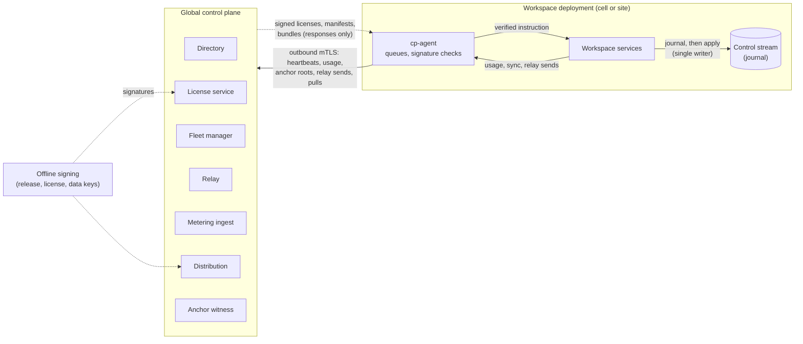

# Global Control Plane (design v0.1, draft)

| | |
|---|---|
| **Status** | Draft v0.1. The engineering readings are Accepted (agent) in [DEC-440](../project/decisions/DEC-440.md); license terms, vendors, and spend are Proposed for the founder (DEC-79) |
| **Date** | 2026-10-03 |
| **Owner** | Engineering (founder) |
| **Implements** | [HLD §4](../HLD.md#4-architecture) (global control plane, deployment modes, where data lives, behaviour when it is unavailable, shared data plane), [§8](../HLD.md#8-multi-tenancy-and-security), [§10](../HLD.md#10-billing); PRD [FR-9.1 to FR-9.3](../product/04-prd-v1.md#69-deployment), [FR-10.1 to FR-10.3](../product/04-prd-v1.md#610-billing), §7 Availability and Privacy; milestones M8, M11, M12; design gap 8 |
| **Builds on** | [Infrastructure design](infrastructure.md) (DEC-434: OPS-12, OPS-15, §7, §11); [journal spec §7, §10](../specs/journal.md#10-anchoring); [inference spec §4.1, §7.4](../specs/inference.md#74-billing-feed); [data plane spec §6](../specs/data-plane.md#6-fan-out-and-deployment-modes) |
| **Siblings (open PRs)** | `docs/specs/identity.md` (#556, the directory, ID-15), `docs/specs/notifications.md` (#558, the relay, §4.6), `docs/specs/workspace-api.md` (#560), `docs/security/threat-model.md` (#557, boundary B10) |

The global control plane is the small service we run for every customer. It knows who the
organizations are, what they are licensed for, which release each site runs, how much they used,
and where to deliver an opaque push. It knows nothing about what any agent trades.

The repository is public, so this document stays at the architecture level. It names no hosts,
accounts, keys, or vendors' account details.

## Contents

1. [Scope](#1-scope)
2. [Invariants](#2-invariants)
3. [Components and interfaces](#3-components-and-interfaces)
4. [Unavailability walk](#4-unavailability-walk)
5. [Multi-region and tenancy](#5-multi-region-and-tenancy)
6. [Adversaries](#6-adversaries)
7. [What exists and what is planned](#7-what-exists-and-what-is-planned)
8. [Decisions](#8-decisions)
9. [Backlog](#9-backlog)
10. [Open questions](#10-open-questions)

---

## 1. Scope

### 1.1 What the global control plane holds and does

| Function | What it holds | What it does |
|---|---|---|
| **Directory** | Organization, workspace, deployment, and user IDs; role names; which deployment (cell or customer site) hosts each workspace | Seat counts; routing a signed-in client to the right deployment; the enrollment of hybrid sites |
| **Licensing and entitlement** | Licenses: signed documents naming an organization, its deployments, entitlements, and validity dates | Issues and renews licenses; managed cells and hybrid sites verify them locally |
| **Fleet** | Each deployment's release digest, component versions, health enumerations, last heartbeat | Shows fleet health; publishes signed release manifests; plans rollouts cell by cell; records which sites installed what |
| **Notification relay** | Nothing after each attempt; opaque IDs and counts in its logs | Forwards end-to-end encrypted web push (and native push after v1) for deployments that cannot reach a push service directly (notifications spec §4.6, #558) |
| **Metering ingest** | Signed usage reports: counts and costs per organization and period | Checks, de-duplicates, and forwards totals to the billing provider (HLD §10) |
| **Distribution** | Signed artifacts: release bundles, connector packages, model-registry entries (inference spec §4.1), and shared-data bundles (data plane spec §6) | Serves them to cells and sites that pull them |
| **Anchor witness** | Journal anchor roots: 32-byte hashes (journal spec §10) | Stores each root with its receipt time, so a restore can be compared against a copy held outside the site (infrastructure §6.3 step 4) |

### 1.2 What it never holds

The HLD's rule is that content stays in the workspace deployment
([Where data lives](../HLD.md#where-data-lives)). The global control plane never holds, receives,
or can request:

- mandates, agent specs, policies, theses, the working universe, or any instrument a workspace
  watches or trades;
- approval requests or responses, notices' text beyond the generic key, or chat threads;
- journal events, artifacts, positions, orders, fills, P&L, balances, or broker account numbers;
- model prompts or outputs;
- credentials of any kind: broker keys and tokens, sessions, passkeys, recovery codes, or
  provider keys. The VAPID private key stays with the deployment; the relay forwards, and does not
  keep, the deployment's signed VAPID header for one push (CP-1, §3.6,
  [DEC-726](../project/decisions/DEC-726.md));
- personal data: names, email addresses, phone numbers, or IdP subjects (identity spec §3.3, #556).
  The one exception is a web-push `endpoint` passing through the relay, forwarded and not kept
  (CP-1, §3.6).

It is never in the path of a trade, a sign-in to a hybrid site (ID-15), an approval, or a kill
switch.

### 1.3 By deployment mode

| | Managed | Hybrid | Fully on-prem / air-gapped |
|---|---|---|---|
| Who runs the global control plane | We do | We do | The customer runs the same software, or none (Won't in v1, [backlog](../project/06-backlog-v1.md#wont-v1)) |
| Link from the deployment | The cell's outbound mutual TLS | The site's outbound mutual TLS; no inbound port | None; files carried by hand |
| License | Issued per cell from the plan | Signed license pulled over the link | Signed license file |
| Usage | Signed reports over the link | Signed reports over the link | Signed report files carried out |
| Releases | We promote cell by cell | The site pulls; its operator installs (§3.4) | Signed bundles installed by hand |
| Relay | Not needed for web push (direct) | Used when egress allows only us | The customer's own channels |

### 1.4 Non-goals

- **No trading function.** No order, no kill switch, no pause, and no mandate change goes through
  the global control plane. That includes the managed global kill switch (§3.7).
- **No content analytics.** It computes no statistic over trading activity beyond the usage counts
  of §3.5.
- **No identity provider.** Sign-in happens at the workspace deployment (identity spec §6, #556).
- **Not the billing system.** It forwards metered totals; plans and prices live with the billing
  provider and in gap 11's `docs/design/billing.md`.

---

## 2. Invariants

Each invariant names its check. "Test" is an automated test in CI or the weekly run; "drill" is a
staging exercise with the outbound link cut or altered, whose result is journaled.

| ID | Invariant | Source | How it is checked |
|---|---|---|---|
| **CP-1** | **No content leaves a workspace deployment for the control plane.** Every message a deployment sends it is one of a closed set of types (§3.8) whose fields are opaque IDs, enumerations, counts, costs, versions, digests, and timestamps. No type has a free-text field or a field that can hold an instrument, quantity, price, mandate field, or personal datum. **Three stated exceptions**, all in `RelaySend` only: `endpoint`, a push-service URL unique to one browser; `ciphertext`, at most 512 bytes of an end-to-end encrypted opaque notice; and `authorization`, the deployment's own RFC 8292 VAPID header (`vapid t=<JWT>, k=<public key>`, at most 1 024 octets of one fixed shape), opaque to the relay and forwarded byte for byte as the push's `Authorization` header (the founder, [DEC-726](../project/decisions/DEC-726.md), which allows this one field and no other). This design treats `endpoint` as personal data: the relay forwards all three and keeps none after the attempt, and logs none of them (§3.6). Whether a push endpoint is personal data, and its retention, is owned by the notifications spec (NT-1, #558) and the threat model (#557) | HLD "Where data lives"; PRD §7 Privacy; rule 6 | Type test: every outbound field is an ID newtype, a closed enumeration, a number, a fixed-point decimal, a digest, a timestamp, a semantic version, or one of the three named relay exceptions (`PushEndpoint`, validated against the allowed push-service origins; `Ciphertext`, at most 512 bytes; and the VAPID `authorization`, refused unless it has DEC-726 item 4's shape and is at most 1 024 octets); no other `String` field exists. Canary test: a workspace whose instruments, agent names, rule IDs, prices, and user names are unique canary strings runs a trading day; every byte sent on the outbound link, outside the relay's `ciphertext`, is captured and scanned for every canary, and so is the decoded claims segment of every `authorization` |
| **CP-2** | **The control plane being down never stops trading.** With the outbound link cut, every agent keeps its decision cycle, openings within its mandate, exits, protection, reconciliation, approvals through customer channels, and owner commands | OPS-12; PRD §7 Availability | Drill: the paper suites and the kill-switch suite run with the link cut for a simulated week; outcomes equal those of a run with the link up, except relay push and queued reports |
| **CP-3** | **Nothing from the control plane blocks risk reduction.** No exit, protective order, risk exit, owner exit, or kill switch waits on, is ordered after, or fails because of any control-plane message, license state, release state, or outage | Rules 3, 13; OPS-4 | Fault injection: the exit and kill-switch suites pass with the link cut, a hung link, an expired license, a withdrawn release, and a revoked enrollment certificate |
| **CP-4** | **The control plane never changes a mandate or an agent.** No message from it can create, confirm, or apply a mandate version, change an envelope field or policy, deploy, resume, pause, or stop an agent, submit or cancel an order, engage a kill switch, or touch a credential | Rules 1, 11; HLD §8 | Layering: the planned `cp-agent` crate depends on no journal, runtime, executor, mandate registry, or vault crate (a crate-level rule in `xtask/layers.toml`, which checks crate dependencies, not types). Its only way into the site is a port: a trait the `cp-agent` crate declares (an instruction sink whose input type is §3.8's inbound messages) and workspace control services implement, the shape of `mandate-executor`'s `ports.rs`. The dependency therefore runs from workspace services to `cp-agent`, never the other way, so `cp-agent` gains no transitive journal dependency. The implementation's handlers can append only §3.8's listed events. A fuzz test feeds every inbound message type with random content and asserts no such event is appended |
| **CP-5** | **Every instruction is signed, journaled, and bounded.** An inbound instruction (license, release offer, release withdrawal, catalog entry, data bundle; no inbound instruction is exempt. A `Receipt` is not an instruction: it has no effect and is stored with its report or anchor, not journaled) takes effect only if (a) its signature verifies against a key pinned in the installed release, not against the TLS channel; (b) workspace control services, the control stream's single writer (journal spec §2, under the fencing of §5.1), journal it before it takes effect. `cp-agent` verifies and hands over; it never appends; and (c) its effect is in §3.8's closed list, which only restricts new activity or offers something for local approval. Anything else is refused and the refusal journaled | DEC-440 item 3; ES-17 | Tests per message type: an unsigned, wrongly signed, replayed (older sequence), or out-of-list instruction is refused with a journaled refusal; a valid one is journaled before its effect |
| **CP-6** | **License expiry never forces a liquidation and never blocks an exit.** In the shared wording: after grace a lapsed license refuses only new deployments and new openings; it never blocks an exit, a protective order, the kill switch, or any risk reduction (DEC-440 item 13, Proposed). The openings are refused through the existing mechanism only: an agent restriction of mode `exits_only` (mandate spec §5.9; trading spec §7.4, "risk-reducing and protective orders only"), journaled as `AgentModeApplied`. It is never a new risk-gate check, and never a liquidation. Positions, protection, owner exits, risk exits, reconciliation, journal reads, and exports continue | Rules 2, 3, 13 | Test: a license that expires mid-session leaves every open position and resting protective order untouched, and every exit and kill switch passes; after grace, every agent of the deployment's workspaces enters `exits_only` with the restriction `license_lapsed`, an opening is refused by the existing mode check, and an exit is not |
| **CP-7** | **Outbound only.** A hybrid site and a managed cell open every connection to the control plane; the control plane has no route, port, or credential that reaches into either | HLD §4; FR-9.2 | Installer check: no listening port is opened for the control plane; drill: a connection attempt from the control-plane network to a site fails at the network layer |
| **CP-8** | **No deadline the control plane controls can stop trading during an outage.** Licenses, enrollment certificates, and pinned keys carry validity far longer than the outage the design tolerates (§4), and are renewed well before expiry while the link is up. The enrollment certificate's lifetime and renewal threshold are named in E20-14. Missing heartbeats never revoke anything | CP-2; rule 3 | Test: the site's next-expiry alert fires at the renewal threshold; a drill with the link cut for longer than the renewal threshold shows only the alert |
| **CP-9** | **Anti-rollback.** A site refuses a license, release manifest, catalog entry, or data bundle whose sequence number is below the highest it has journaled for that kind, except a release rollback its own operator starts under infrastructure §7.4 | DEC-440 item 6 | Test, once per kind: replaying an older signed license, release manifest, catalog entry, and data bundle is each refused and journaled, against the highest sequence journaled in `LicenseApplied`, `ReleaseOffered`, `CatalogEntryRegistered`, and `DataBundleImported` |
| **CP-10** | **Usage reports are complete and idempotent.** Every usage period produces exactly one signed report per deployment, chained to the previous one by hash; reports queue on the site's disk while the link is down and are never dropped; ingest de-duplicates by report ID and flags a gap in the chain | HLD §10; inference spec §7.4 | Test: random link cuts and duplicate sends give the same billed totals as a clean run; a missing report is flagged, never estimated silently |
| **CP-11** | **Tenant scope at the control plane.** A deployment's credential reads and writes only its own records: its license, its heartbeats, its usage reports, its relay sends, and the public artifacts. A cell's credential covers only the workspaces the directory places on that cell | HLD §8; OPS-6 | Cross-deployment tests: every endpoint called with another deployment's IDs is refused |
| **CP-12** | **The managed global switch cannot reach a customer site, and the control plane cannot trigger it.** Platform operator actions are issued inside each cell (§3.7) | HLD §8; DEC-440 item 8 | Layering and drill: the control plane has no message type that maps to `PlatformOperatorAction`; a hybrid site has no handler for one from outside its own operators |

**Known limit, stated rather than hidden.** CP-1 bounds content, not metadata. The control plane
learns how many workspaces and agents an organization has, how much it used, when push notices are
sent, and which release it runs. Activity levels and their timing are visible (§6). The relay's
512-byte cap and the closed report schema bound what a compromised deployment could smuggle out
through us, as do the 1 024-octet cap and fixed shape of the VAPID header (DEC-726 item 8), but a
fully compromised deployment already holds its own data.

---

## 3. Components and interfaces

All traffic between a deployment and the control plane is on one outbound mutual-TLS link. The
deployment's side is one process, the **control-plane agent** (`cp-agent`), which runs in the
workspace deployment, owns the link, the local queues, and signature checks, and is the only
process allowed that egress (infrastructure §9). Runtimes, executors, and the vault never talk to
the control plane.

`cp-agent` is **not a journal writer**. It verifies each inbound instruction and hands it to
workspace control services, the control stream's single owner (journal spec §2), which append it
under their writer epoch (journal spec §5.1) and only then apply it. This is the same one-writer
shape the agent harness uses for its research worker (DEC-431 item 1). Nothing on the kill-switch
path depends on `cp-agent`: owner commands are journaled by workspace services whether `cp-agent`
is running, hung, or absent (CP-3).

### 3.1 Enrollment

1. An org admin creates a deployment in the directory and receives a single-use enrollment token
   with a short lifetime (E13-1).
2. The installer generates the deployment's key pair on the site. The private key never leaves the
   site's vault.
3. `cp-agent` presents the token and a certificate signing request. The directory binds a client
   certificate to the new `deployment_id` and the organization.
4. The site journals `ControlPlaneEnrolled` (name provisional, §3.8) with the deployment ID and the
   certificate's fingerprint.

Revoking a deployment's certificate disconnects it, which is an outage from the site's point of
view (§4), never a trading stop.

### 3.2 Directory

| Record | Fields |
|---|---|
| Organization | `org_id`, plan reference, display handle generated by the plane from a fixed alphabet (never customer-set; the organization's real name stays in the workspace) |
| Deployment | `deployment_id`, `org_id`, mode (`managed_cell`, `hybrid`), region, client certificate fingerprint |
| Workspace | `workspace_id`, `org_id`, `deployment_id` |
| Member | `user_id`, `workspace_id` or `org_id`, role name, state |

- **IDs and role names only** (ID-15, #556). No email, name, or IdP subject. A user is found by
  `user_id`, which the workspace issues.
- **Routing.** A client that has signed in once caches the list of `(workspace_id, deployment
  endpoint)` it may use. The directory serves that list to an authenticated client; the client
  needs it only to find a deployment it has not used before. An outage leaves cached routes
  working.
- **Sync.** Workspace services push membership changes (IDs and roles) as `DirectorySync`
  messages, queued while the link is down (identity spec §11.2, #556).
- **Organization scope.** An organization-wide command (for example, the organization kill switch)
  is sent by the client to each workspace deployment directly, using the routing list. The
  directory never carries the command (workspace API spec §12 question 2, #560).

### 3.3 License service

A license is a signed document:

| Field | Rule |
|---|---|
| `license_id`, `sequence` | `sequence` increases per organization; CP-9 refuses a lower one |
| `org_id`, `deployment_ids` | Which deployments may use it |
| `entitlements` | `max_workspaces`, `max_agents_deployed`, feature flags from a closed list (for example `hybrid`, `connected_clients`) |
| `not_before`, `not_after`, `grace_days` | Validity, checked against the highest UTC time the site has journaled (§6; the frozen-clock behaviour is E20-13) |
| `key_id`, `signature` | Signed by the license key, held in the offline signing service, never in the control plane's general compute |

The site's behaviour, all journaled (`LicenseApplied`, `LicenseStateChanged`):

| State | Entered when | What it blocks | What never changes |
|---|---|---|---|
| `valid` | A valid license is in effect | Deploying beyond `max_agents_deployed`, or a workspace beyond `max_workspaces`. Each is a refused request, never a stop of what runs | Running agents, mandates, exits, protection, kill switch |
| `renewal_due` | Within the renewal threshold of `not_after` (Proposed: 30 days) | Nothing. Admins see a banner | As above |
| `grace` | Past `not_after`, within `grace_days` | Nothing new beyond `valid`'s limits. Banners to org owners and admins | As above |
| `lapsed` | Past grace (DEC-440 item 13, Proposed) | New deployments (the deployment manager refuses them), and openings: every agent in the covered workspaces takes the agent restriction `license_lapsed` with mode `exits_only` (mandate spec §5.9; trading spec §7.4), journaled as `AgentModeApplied` | Exits, protection, owner exits, risk exits, kill switch, reconciliation, journal, audit reads, exports, acknowledgments |

- **Lowering an entitlement** below what runs refuses new deployments only. It never stops a
  running agent. Stopping one is the owner's act.
- **Raising an entitlement** only allows more deployments, each of which still needs the owner's
  confirmed mandate version and the autonomy rules (rule 11). It is not risk.
- **Managed cells** receive a license per organization from the plan, through the same code, so the
  path is exercised every day.
- **Air-gapped** licenses are files with the same format.
- **The shared wording** (#556, #562, #565): after grace a lapsed license refuses only new deployments and new openings; it never blocks an exit, a protective order, the kill switch, or any risk reduction.
- **No new gate check.** The gate already enforces the effective mode (trading spec §9.1); a lapse
  only adds one restriction to the strictest-of set. Entering `exits_only` cancels working opening
  orders and pending approvals, as for every restriction (mandate spec §5.9); it never cancels an
  exit or a protective order. The name `license_lapsed` joins mandate spec §5.9's list in the
  spec change E20-4 lands first; until then no license state reaches an agent at all, which is the
  current behaviour.
- **Leaving `lapsed`** takes a new valid license, journaled by workspace services
  (`LicenseStateChanged`); the restriction lifts on its own, as each restriction lifts
  independently (mandate spec §5.9). Any other restriction stays.

### 3.4 Fleet manager

| Message | Direction | Content |
|---|---|---|
| `Heartbeat` | Site to plane, every 60 s | `deployment_id`, release digest, component versions, enumerated health per component (`ok`, `degraded`, `down`). In v1, versions and health only: counts arrive in the usage report (§3.5), which billing already needs |
| `ReleaseManifest` | Plane to site, on pull | Release ID, `sequence`, image and bundle digests, minimum readable `schema_version`s, notes ID; signed by the release key (ES-17) |
| `ReleaseWithdrawn` | Plane to site, on pull | Release ID and a reason enumeration; signed by the release key |
| `InstallReport` | Site to plane | Release ID, outcome enumeration, timestamps |

Rules:

- **The release key is not in the control plane.** Images and bundles are signed with cosign under
  the founder's hardware key (ES-17, infrastructure §7.1 step 3); the control plane only serves
  them. The installed release pins the public keys it accepts.
- **Who installs.** Managed: our promotion, one cell at a time, canary first (infrastructure §7.1
  step 4). Hybrid: the site's update policy, `manual` by default, or `automatic within a window`
  the customer sets. The control plane offers; it never installs.
- **How it installs.** Drain and hand-over (DEC-434 item 7). An upgrade never cancels a resting
  protective order (OPS-7), never changes a mandate version, and journals the new build digest
  (`actor.build`). A release that cannot read a stream's `schema_version` refuses to start; the old
  release keeps running (DEC-434 item 8).
- **A withdrawal** is shown to operators and refuses new installs of that release. It changes no
  running process: stopping a release with a known defect is the site operator's act (or ours, in
  managed mode, through the normal rollback).
- **Missing heartbeats** mark a site `unreachable` in the fleet view and alert our on-call for
  managed cells. They revoke nothing (CP-8).

### 3.5 Metering ingest

A usage report, one per deployment per period (Proposed: hourly), signed by the deployment's key:

| Field | Rule |
|---|---|
| `report_id`, `deployment_id`, `org_id`, `period_start`, `period_end` | Opaque IDs and UTC times |
| `prev_report_hash` | SHA-256 of the previous report; a chain per deployment |
| `counters` | Closed list: agent-hours by mode (paper, live), decisions, model calls and tokens by endpoint class and provider, model cost (fixed-point decimal), workspaces, seats |

- Built in the workspace deployment from journaled facts and the inference meter (inference spec
  §7.1, §7.4). Never per agent ID or per instrument.
- Queued on the site's disk until acknowledged (CP-10). Air-gapped sites export the queue as a
  signed file.
- Ingest verifies the signature and chain, de-duplicates by `report_id`, and forwards totals to the
  billing provider. A gap is flagged for billing review, never filled with an estimate.
- Prices and margins are applied by billing, never here (HLD §10). Never per trade or as a share
  of assets.

### 3.6 Relay, distribution, and the anchor witness

- **Relay.** As notifications spec §4.6 (#558): it accepts `{relay_id, endpoint, urgency, ttl_s,
  authorization, ciphertext}`, ciphertext at most 512 bytes, forwards, returns the push service's
  status, keeps nothing after the attempt, and logs opaque IDs and counts. `authorization` is the
  deployment's VAPID header, the one field DEC-726 adds: the relay checks only its shape and its
  1 024-octet cap, forwards it unchanged as the `Authorization` header, and never logs, stores, or
  echoes it. The relay holds no VAPID key. It has no route into any deployment.
- **Distribution.** Serves signed artifacts by digest. Each kind has its own signing key: release
  (binaries, connector packages), registry (model-registry entries, inference spec §4.1), and data
  (shared-data bundles, data plane spec §6.1). A site verifies the signature and digests before
  using a byte. Bundles are whole datasets, never per-workspace slices (DEC-433 item 9), so the
  plane never learns what a workspace watches.
- **Anchor witness.** Receives each anchor root (journal spec §10), stores it with its receipt
  time, and returns a signed receipt. A restore compares its anchors with this copy (infrastructure
  §6.3). Whether hybrid customers may opt out is journal spec §13 question 2; this design takes no
  position beyond: an opt-out site loses this comparison, nothing else.

### 3.7 The managed global switch

HLD §8 lists a global kill switch for the managed service. Journal spec §9 records it as a
`PlatformOperatorAction`, and the runtime acts on it with a stop and an automated risk exit (E6-1
task, `PlatformOperator`). Issued from the global control plane, it would let one compromised
service liquidate every managed workspace.

This design therefore places it in the cells (DEC-440 item 8): a platform operator issues it
through each cell's operator tooling, authenticated with step-up in that cell, journaled in every
affected workspace, the same path as the per-thesis halt (HLD §8). The global control plane may
show which cells have applied it. It cannot issue it, and it never reaches a hybrid site (CP-12).
The members of `PlatformOperatorAction`, including the "approval" it names, stay Proposed in
DEC-261 item 9.

### 3.8 The closed message set

Every message on the link, its direction, and what it may cause on the site. Names are provisional
until the journal spec registers the events (E20-3). Every event in the "Journaled" column is
appended by workspace control services, the control stream's single writer, never by `cp-agent`.

| Message | Direction | Signed by | Journaled on the site as | Allowed effect on the site |
|---|---|---|---|---|
| `Enroll` | Out | Enrollment token | `ControlPlaneEnrolled` | Stores the client certificate |
| `Heartbeat`, `InstallReport` | Out | mTLS | Not journaled (telemetry, DEC-73) | None |
| `UsageReport` | Out | Deployment key | `UsageReportSealed` | None |
| `AnchorRoot` | Out | Deployment key | Already in `AnchorComputed` | None |
| `DirectorySync` | Out | mTLS | Membership events already journaled | None |
| `RelaySend` | Out | mTLS | The notice's delivery record (#558 §5.5) | None |
| `License` | In | License key | `LicenseApplied`, `LicenseStateChanged` | Refuse new deployments and workspaces; when `lapsed`, the `license_lapsed` restriction (`exits_only`). Never more |
| `ReleaseManifest` | In | Release key | `ReleaseOffered`; `ReleaseInstalled` when the site installs | Offer to the site's operator or update window. Never installs by itself in hybrid |
| `ReleaseWithdrawn` | In | Release key | `ReleaseWithdrawnNoticed` | Refuse new installs of it; alert |
| `CatalogEntry` | In | Release or registry key | `CatalogEntryRegistered` (kind, content hash, sequence), so CP-9 has a journaled highest sequence per kind. A registry entry a mandate later pins is still registered as `ConfigSnapshotRegistered` (existing), which carries no sequence | Becomes selectable after the local evaluation gate and the owner's pin (inference spec §4.2). Never changes an existing pin |
| `DataBundle` | In | Data key | `DataBundleImported` (bundle digest, kind, sequence), journaled before any byte of the bundle is used, so CP-9 has a journaled highest sequence and an observation can name its bundle (data plane spec §6.1) | New data for queries. Never an order input except through a thesis that passes every check (DP-8) |
| `Receipt` | In | Plane key | Not journaled: stored with the report or anchor | None. Not an instruction |

Any other message, or any field outside its schema, is refused and journaled as
`ControlPlaneMessageRefused` with an enumerated reason. There is no message by which the control
plane can ask for data: every outbound message is the site's own initiative.

---

## 4. Unavailability walk

"Down" covers our outage, a network fault on the customer's side, and a revoked enrollment
certificate; the site cannot tell them apart and treats them the same.

| Duration | Trading, exits, kill switch | Approvals | What is lost or queued | What the user sees | How it ends |
|---|---|---|---|---|---|
| **Minutes** | Unchanged (CP-2, CP-3) | Unchanged; relayed web push retries, email and chat unaffected (#558 §7) | Heartbeats; usage reports and anchor roots queue | Nothing beyond a status-strip note if relay push fails | Link returns; queues drain in order |
| **Hours** | Unchanged | Hybrid: customer channels only for relay-push users | Releases cannot be pulled; new clients without a cached route cannot find a deployment they never used | Status strip: "control plane unreachable" with the time | As above |
| **Days** | Unchanged | As above | Queues grow on disk; an alert at a size threshold (Proposed: 30 days of reports, which is kilobytes) | Admin banner | As above; billing reviews any period with a late report |
| **Past a renewal threshold** | Unchanged until `not_after` plus grace (§3.3) | As above | License renewal | License banner from `renewal_due` | Link returns and renewal lands; or an air-gapped license file is installed by hand |
| **Past license grace** (only if the outage outlasts the whole license term plus grace) | Agents in `exits_only` under `license_lapsed` (if DEC-440 item 13 is accepted); everything in CP-6 continues | Unchanged | As above | License banner and the agent's mode reason | A license file installed by hand; this is why hybrid licenses run a full term (§3.3) and air-gapped delivery exists for every message |
| **Partition** (site up, link half-open) | Unchanged | As above | The site sees send failures; the plane sees missing heartbeats and marks `unreachable` | As for hours | Heals; duplicate reports are de-duplicated by `report_id` (CP-10) |
| **Plane restored from backup** | Unchanged | Unchanged | The plane may have lost recent heartbeats, reports, and anchor roots | Nothing | Sites resend unacknowledged reports and roots; the chain shows any gap; licenses on sites are not affected because sites keep the highest sequence (CP-9) |

**A compromised control plane, at worst.** Everything it can do, given that the release, license,
registry, and data signing keys are offline (§6, DEC-440 item 5):

1. **Stop serving.** Equivalent to an outage: no trading effect for the life of the license.
2. **Read metadata.** IDs, role names, counts, release digests, activity timing, anchor roots. No
   content (CP-1).
3. **Forge or drop push.** Ciphertext only; a forged push shows only generic text and opens the
   fixed origin; a drop delays an approval into its timeout default, which never adds risk
   (#558 §9).
4. **Offer an older signed release or license.** Refused (CP-9).
5. **Refuse a site's enrollment or revoke its certificate.** An outage, as in 1.
6. **Route a new client wrongly.** The client then signs in at the wrong deployment and fails, because
   authentication is the workspace's (ID-15).

It cannot place, cancel, or size an order; change, confirm, or apply a mandate; deploy, resume, or
stop an agent; engage a kill switch; read a credential; or open a connection into a site (CP-4,
CP-7, CP-12). If a signing key is also stolen, see §6.

---

## 5. Multi-region and tenancy

### 5.1 Regions

- **Cells are regional** (HLD §4, infrastructure §1.2); the control plane is global and small.
- **One home region in v1** (US), with a warm standby in a second region (DEC-434 item 13's two US
  regions). Because nothing it holds is in the trade path, its recovery targets are looser than the
  journal's: hours, not seconds, read under DEC-440 item 16 with DEC-434 item 17's targets (E20-15).
- **Data residency.** The directory and usage reports hold no personal data and no content (§1.2),
  so a single home region does not move customer data across borders. Users outside the US are
  Won't in v1.
- **The relay** runs in each region that hosts cells, so push does not cross regions needlessly; it
  is stateless.

### 5.2 Tenancy

| Layer | Rule |
|---|---|
| Identity of callers | One client certificate per deployment (§3.1); a managed cell's certificate is scoped to the workspaces the directory places on it (CP-11) |
| Data | Every record carries `org_id` and `deployment_id`; queries are scoped by the caller's certificate, never by a parameter |
| Rate limits | Per deployment, per message type; a noisy site cannot starve others' heartbeats or relay sends |
| Public artifacts | Releases, catalog entries, and data bundles are the same bytes for every subscriber, so serving them reveals nothing about one tenant (DEC-433 item 9) |
| Staff access | Platform staff roles with step-up, every action journaled in the control plane's own audit log; license changes need two people (DEC-440 item 10). Staff have no path into a hybrid site and break-glass only into a managed cell (journal spec §7) |

### 5.3 Fully on-prem

The same software can run as the customer's own control plane: directory, license verification,
fleet view, and their own relay or none. Won't in v1; the packaging must not rule it out (HLD §4
engineering rule). Every message in §3.8 therefore has a file form, so an air-gapped site never
needs a live link.

---

## 6. Adversaries

| Adversary | Tries to | Blocked or disclosed by | Residual |
|---|---|---|---|
| **Careless user** | Lets a license lapse and expects agents to keep opening | `renewal_due` and `grace` banners; `lapsed` puts agents in `exits_only`; exits and the kill switch continue (CP-6) | Missed opportunities after grace, by design |
| **Careless user** | Installs an upgrade during market hours | Drain and hand-over (DEC-434 item 7); the update window for hybrid | A drained agent skips decision cycles during the hand-over |
| **Bad model** | Uses the control plane to exfiltrate | Models run in the workspace with no route to it; only `cp-agent` has that egress; outbound messages have no free-text field (CP-1) | None found |
| **Malicious insider at the platform** | Pushes a malicious release, a forged license, or a poisoned data bundle | Signing keys offline and per kind (DEC-440 item 5); release signing under the founder's hardware key (ES-17); hybrid installs need the site's operator by default; anti-rollback (CP-9) | A stolen release key plus a site on automatic updates runs attacker code: that is the supply-chain threat (#557 §6.10, E21-8). Hybrid default `manual` limits it |
| **Malicious insider at the platform** | Issues the global kill switch to liquidate managed workspaces | Not issuable from the control plane (CP-12); issued per cell with step-up and journaled in each workspace (§3.7) | An insider with cell operator rights; the operator-approval member of `PlatformOperatorAction` is still Proposed (DEC-261 item 9) |
| **Malicious insider at the platform** | Withholds license renewal to stop a customer's trading | `lapsed` only refuses new deployments and openings; hybrid licenses run a full term; air-gapped file delivery | Commercial leverage over openings at term end; disclosed in terms (counsel) |
| **Stolen license key** | Forges licenses | Forging lower entitlements only restricts new activity; higher ones only allow deployments that still need the owner's confirmation; rotation through a new release pinning a new key | Billing loss; no trading risk |
| **Stolen data key** | Publishes false filings to steer theses | Text is untrusted (DP-8); every thesis passes §8.5's checks, the eligibility floor, corroboration, and autonomy; source revocation invalidates theses (DEC-433 item 19) | Bounded by the envelope like any bad input |
| **Malicious tenant** | Reads another tenant's directory rows, licenses, or reports | Scope by certificate (CP-11); cross-deployment tests | None found |
| **Malicious tenant** | Floods the relay or ingest | Per-deployment rate limits; 512-byte relay cap | Our cost; alerting |
| **Malicious tenant** | Under-reports usage | Reports are built from journaled facts and signed by the site's key; the hybrid site controls its own software, so a determined customer can forge counts | Billing risk on hybrid, accepted; audit right in the license terms (counsel) |
| **Malicious tenant** | Sets the site clock back to extend a license | The site keeps the highest UTC time it has journaled and checks validity against that | A clock frozen from install; billing risk only |
| **Network attacker** | Impersonates the control plane to a site | mTLS with a pinned server CA; every instruction is also signed by an offline key (CP-5), so a forged channel alone changes nothing | Denial of service, as an outage |
| **Bad market tick** | — | The control plane carries no market data or marks | Not applicable |
| **Compromised workspace deployment** | Smuggles content out through reports or the relay | Closed schemas, the 512-byte ciphertext cap, and the VAPID header's fixed shape and 1 024-octet cap (DEC-726) bound it | A compromised deployment holds its own data anyway; #557 owns it |

Implied advice: the control plane computes no ranking, signal, or view, and shared-data bundles
carry no directional field (DP-12). It cannot imply platform advice.

---

## 7. What exists and what is planned

As of 2026-10-03, nothing of the global control plane is built.

| Area | Exists today | Planned |
|---|---|---|
| Directory, enrollment | None. Identity is the founder's CLI in Phase 1 | E20-1, E20-2 (M8), with E9 (#556) |
| License | None | E20-4 (M8 format and verification), E14-2 (M12 issuance) |
| Fleet, releases | `actor.build` digests journaled (ES-17). No signing, no manifests | E20-5 (M8 heartbeats), E20-6 (M11 manifests and offers), with E21-8 (signing) |
| Metering | The research spike computes cost per call (inference spec §11) | E20-7 (M12), from the gateway's meter |
| Relay | None; an HLD box | E8-14 (M10, #558) on E20-8's service |
| Distribution | None; the shared data plane is Won't in v1 per the backlog | E20-9 (M11) for releases and catalog entries |
| Anchor witness | `AnchorComputed` is specified (journal spec §10); no receiver | E20-10 (M11) |
| Message set and journal events | None | E20-3 (M8), a journal spec change first |

---

## 8. Decisions

[DEC-440](../project/decisions/DEC-440.md) records this document's choices.

**Accepted (agent; DEC-79 reversible engineering, DEC-176 readings that only tighten):** the closed
message set and its allowed effects (items 1 to 3), one `cp-agent` per deployment (item 4), offline
per-kind signing keys (item 5), anti-rollback (item 6), no automatic install on hybrid sites by
default (item 7), the managed global switch issued per cell, never from the control plane (item 8),
usage reports as a signed chain (item 9), two-person license changes (item 10), the E20 epic
(item 11), and routing by `user_id` with no personal data in the directory (item 12).

**Decided by the founder:** CP-1's third relay exception, the deployment's VAPID header in
`RelaySend` ([DEC-726](../project/decisions/DEC-726.md) item 1, 2026-10-09); DEC-726 items 2 to 8
only tighten it (DEC-176).

**Proposed for the founder** (license terms, spend, vendors; DEC-79). The most conservative option
holds until each is decided.

| Item | Decision | Recommendation |
|---|---|---|
| 13 | What a lapsed license does after grace | The shared wording with #556 and #565: after grace a lapsed license refuses only new deployments and new openings; it never blocks an exit, a protective order, the kill switch, or any risk reduction. Openings are refused by the `license_lapsed` agent restriction (`exits_only`, mandate spec §5.9). Grace 30 days; renewal threshold 30 days |
| 14 | License term for hybrid | The contract term (annual, per [pricing](../product/07-pricing-and-packaging.md)), so a control-plane outage can never reach a lapse inside it |
| 15 | Billing provider | Gap 11 decides it (HLD §10 names three); the ingest forwards totals through an interface so the choice stays reversible |
| 16 | Hosting of the control plane | With DEC-434 item 13 at M8: the same provider as managed cells, separate accounts and keys from every cell |
| 17 | Usage-report period and the audit right over hybrid usage | Hourly reports; an audit right in the hybrid license terms, worded by counsel |

---

## 9. Backlog

Epic **E20 Global control plane (proposed, DEC-440 item 11)**. E18 is the enterprise harness and
E21 operations, and E19 the agent harness (DEC-431). E20 was free, and is reserved in the decision
log's Reserved identifiers table. The rows are added to
the [backlog](../project/06-backlog-v1.md#e20-global-control-plane-proposed-dec-440).

## 10. Open questions

1. **Shared data plane in v1.** The backlog lists the shared data plane as Won't in v1, while
   DEC-433 item 16 puts SEC filings in it. Distribution (§3.6) is designed either way; the data
   plane spec owns the answer.
2. **Anchor opt-out for hybrid** (journal spec §13 question 2). This design is neutral.
3. **Phone access in hybrid** (HLD §12 item 7; workspace API spec §12 question 3, #560). Whether
   the relay should also carry the end-to-end encrypted approval fetch changes §3.6's relay from
   push-only to a tunnel. This draft keeps it push-only.
4. **Organization-wide views across cells.** An org owner with workspaces in two cells sees each
   cell's data from that cell; the client merges. Whether that is enough for M9's dashboard is the
   workspace API's call.
5. **Recovery targets for the control plane** (§5.1). Stated as a reading under DEC-440 item 16
   for now; E20-15 settles whether they become their own Proposed item.
