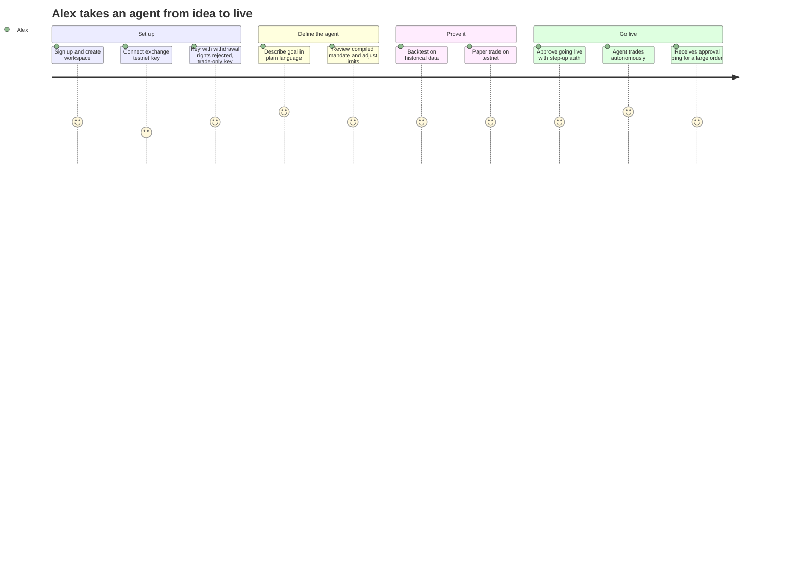

# Personas and User Journeys

| | |
|---|---|
| **Owner** | Product |
| **Status** | Draft v0.1 |

Personas are hypotheses to validate with design partners.

## Primary personas (v1)

### 1. Alex: professional systematic trader

- **Profile:** trades crypto perpetual futures full-time or alongside a job; has written bots;
  trades their own capital across two or three exchanges.
- **Goals:** run strategies 24/7 without watching screens; never wake up to a blown account;
  know why the bot did what it did.
- **Frustrations:** scripts break silently; no guardrails beyond exchange limits; LLM-based
  tools feel like toys; approving every trade defeats the purpose.
- **Jobs to be done:**
  - "When I have a trading idea, I want to turn it into an agent with hard limits so I can
    stop babysitting it."
  - "When something unusual happens, I want to be asked, not surprised."
- **Deployment:** managed.
- **What success looks like:** agents running live for weeks, a handful of approval pings a
  week, zero limit breaches.

### 2. Priya: emerging manager, small fund

- **Profile:** portfolio manager at a fund managing tens of millions; team of three to eight;
  outsourced compliance; uses Google Workspace or Okta.
- **Goals:** scale strategies without hiring more traders; give investors and auditors evidence
  of process; keep strategy private.
- **Frustrations:** building execution and monitoring infrastructure in-house; no audit trail
  for automated decisions; vendors want strategy data in their cloud.
- **Jobs to be done:**
  - "When a decision exceeds our comfort zone, I want the right person to approve it from
    their phone, with evidence."
  - "When our auditor asks why a trade happened, I want to answer in one query."
- **Deployment:** hybrid (workspace deployment on the fund's cloud account).
- **What success looks like:** several agents live across two strategies; audit export used in
  a real review; approvals handled by the right roles.

## Secondary personas (v1)

### 3. Dana: compliance officer (often fractional)

- **Goals:** confirm agents stay within mandates; retain records; review escalations and
  overrides.
- **Needs:** read-only auditor role, exportable decision trace, retention settings, alerts on
  policy changes.

### 4. Sam: platform / IT administrator

- **Goals:** deploy and upgrade the workspace deployment safely; wire up SSO; control network
  egress.
- **Needs:** one installer (Helm or Docker Compose), outbound-only networking, health status,
  signed releases, clear upgrade path.

## Later personas

### 5. Marcus: head of trading or risk at a prop firm or fund

- Runs many agents across desks; needs org-wide limits, separation of duties, two-person
  approvals, fully on-prem deployment, SAML and SCIM.

### 6. Jordan: retail investor (managed)

- Wants a simple, conservative agent (for example, "accumulate BTC on dips, never more than
  10% of my account"). Requires presets, education, strong defaults, and legal review before
  launch.

## Roles in the product

| Role | Typical persona | Can |
|---|---|---|
| Org owner / admin | Priya, Marcus | Manage billing, SSO, org-wide limits, workspaces |
| Workspace admin | Priya | Manage members, connections, workspace limits |
| Operator | Alex, Priya | Create, deploy, pause, and stop agents |
| Approver | Priya, Marcus | Respond to approval requests |
| Viewer | Team members | See agents, positions, and decisions |
| Auditor | Dana | Read-only access to the journal and exports |

## Key journeys

### J1. First agent live (Alex)

**Moments that matter:** the compiled mandate reads exactly like what Alex meant; the backtest
and paper run are fast; the first approval ping has enough context to decide in seconds.

### J2. Approval from a phone (Priya)

1. The agent proposes an order above the workspace's approval threshold.
2. Priya receives a push or chat notification with no trade details ("Agent eth-carry needs
   approval").
3. She opens it; details load from the fund's own workspace deployment: proposed action,
   alternatives, evidence, risk impact, deadline, and the default if she does nothing.
4. She approves with a passkey. The agent re-checks price drift, then executes.
5. The journal records who approved, when, through which channel, and how she authenticated.

**Moments that matter:** she can decide in under a minute; nothing sensitive went through a
third party; if she had ignored it, the safe default would have applied.

### J3. "Why did this happen?" (Dana)

1. Dana opens a fill in the audit explorer.
2. She follows the causal trace: fill → order → approval (if any) → decision → advisor
   opinions → observations.
3. She exports the trace for the period under review.

**Moment that matters:** a complete answer without asking an engineer.

### J4. Hybrid install (Sam)

1. Sam downloads the installer and a workspace enrollment token.
2. Installs into the fund's Kubernetes cluster; the deployment connects outbound to the global
   control plane.
3. Configures SSO against the fund's identity provider and a fallback approval channel (email
   through the fund's mail server).
4. Confirms health in the admin view; credentials are stored only in the local vault.

**Moment that matters:** no inbound firewall changes; no strategy data leaves the fund.

### J5. Something goes wrong (Alex)

1. A market shock pushes the agent's drawdown past the first rung of its ladder.
2. The agent halves position sizes automatically (risk-reducing, no approval needed) and
   notifies Alex.
3. At the second rung it switches to exits only.
4. Alex reviews and either resumes, adjusts the mandate (which requires step-up auth because it
   raises risk), or stops the agent.

**Moment that matters:** the system protected capital before Alex saw the message.
