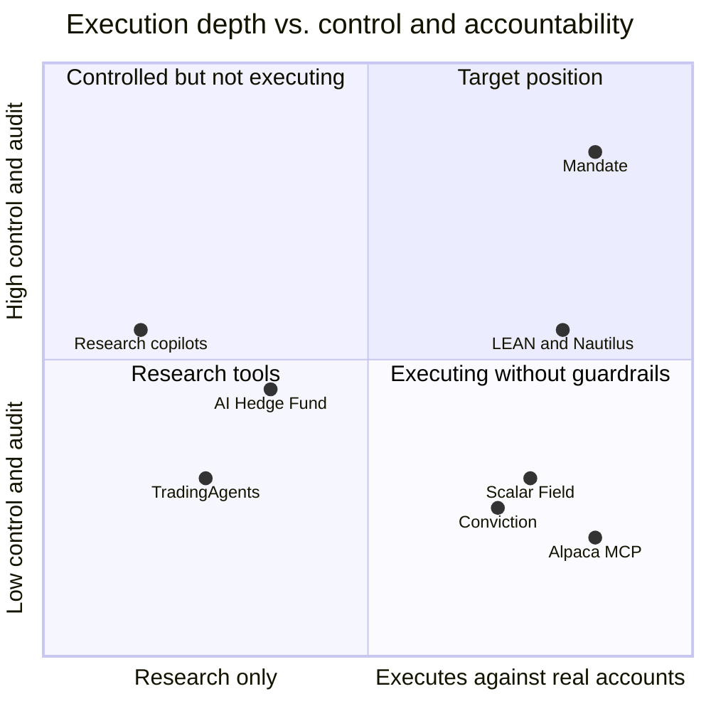

# Competitive Landscape

| | |
|---|---|
| **Owner** | Product |
| **Status** | Draft v0.1, based on public sources as of 2026-09 |

## Summary

No existing product combines **production execution against real accounts**, **enforceable
mandates with selective escalation**, **complete decision audit**, and **deploy-anywhere**.
Open-source agent frameworks are research scaffolds; execution engines have no agent layer;
YC-backed startups either stop at research or build consumer apps with shallow safety.

## Open-source frameworks and engines

| Project | What it is | Strengths | Gaps relative to Mandate |
|---|---|---|---|
| TradingAgents (Tauric Research) | Multi-agent LLM "trading firm" on LangGraph: analysts, bull/bear debate, trader, risk team, portfolio manager | Popular; multi-provider; decision memory; point-in-time fixes; grid backtests | LLM makes the call; one decision per ticker/date run; no production execution, escalation, or multi-tenant operation |
| AI Hedge Fund (virattt) | Investor-persona and quant "alpha models" feeding portfolio construction and risk | "LLM never touches the trade"; one pipeline for backtest, paper, live (planned); clean signal interface | Persistent ledger, paper broker, scheduler still on the roadmap; no approvals, SSO, or deployment story |
| RD-Agent(Q) + Qlib (Microsoft) | Agent that proposes, codes, and backtests factors and models on Qlib | Strong research loop; fast data layer; point-in-time data | Research only; no execution or operations |
| FinRobot (AI4Finance) | Multi-agent equity research with deterministic valuation | Numbers computed by code, not the LLM | Research reports, not trading |
| FinRL (AI4Finance) | Reinforcement-learning trading environments | Train/test/trade pipeline | Research; limited risk controls |
| LEAN (QuantConnect) | Event-driven engine; Universe → Alpha → Portfolio → Risk → Execution pipeline | Mature, brokerage integrations, modular framework | No agent layer, escalation, or agent audit |
| NautilusTrader | Rust-core event-driven engine; same code for backtest, sandbox, live | Performance; reconciliation; crash-only design; many venue adapters | No agent layer; LGPL-3.0 licensing considerations for on-prem distribution |

## Broker and connectivity infrastructure

| Product | What it is | Relevance |
|---|---|---|
| Alpaca MCP server | Lets AI assistants place orders on Alpaca through natural language; defaults to paper | Shows demand for AI order flow; no mandate enforcement, escalation, or audit beyond the broker's own |
| SnapTrade (YC W22) | API connecting retail brokerage accounts to apps | Possible connectivity partner for equities |

## YC-backed companies (2024–2026)

### Closest: users deploy agents that trade

| Company | Pitch | Gap we exploit |
|---|---|---|
| Scalar Field (Sp25) | Agentic trading desk: research, backtesting, brokerage-connected trading agents | Consumer full stack; no enforceable mandates, selective escalation, or on-prem |
| Conviction (S25) | Describe an idea, backtest it, turn it into an agent that acts for you | Retail focus; regulatory exposure; thin risk layer |
| Instinct (W26) | Team of agents searching thousands of markets; "one-person investment firm" | Onchain / consumer; no firm-grade controls or deployment options |
| Volaren (F26) | Turn views into trades, portfolios, and backtestable strategies | Early; personalization over control and audit |

### Adjacent: research copilots for funds (stop before execution)

Multiplier (Sp26), finbar (W25), InferEdge, Constant, Trata, Serafis, Soria, Oasive,
Dataglade, Axis (W26), Kimpton (Sp26), KelAI (Sp26), Sharpe (S24).

**Gap:** they produce memos and trade proposals; a human still executes and monitors.
Mandate is where their outputs could become supervised, executing agents.

### Adjacent: AI-native funds (trade their own capital)

Standard Signal, Spectre Intelligence, Prodigy Research, Event Horizon Labs.

**Relevance:** not customers for a consumer product, but they rebuild the same infrastructure
(audit, replay, approvals, multi-tenant security). A later enterprise segment.

### Adjacent: compliance for trading firms

Hadrius, TovenAI. They supervise humans; none supervise autonomous agents.

## Positioning map

Placement is qualitative, based on public descriptions.

## Differentiators to defend

1. **Mandate enforcement** outside agent logic (policy hierarchy plus hard risk gate).
2. **Rule-based, selective escalation** under user-set autonomy rules, with safe defaults and re-checks before execution.
3. **Causal decision audit**, tamper-evident, exportable.
4. **Deploy anywhere** with strategy, approvals, audit, and credentials on the customer's side.
5. **Speed tiers**: Rust hot path and fast decision models, with LLMs off the critical path.

## Competitive risks

- A broker adds guardrails and approvals to its own agent tooling. Alpaca is both our first
  connector ([DEC-23](../project/04-decision-log.md#decisions)) and the maker of an MCP server
  for AI trading, so it is a partner and a potential competitor.
- A well-funded consumer app (Scalar Field, Conviction) moves upmarket with controls and audit.
- NautilusTrader or QuantConnect adds an agent layer.

Mitigation: multi-venue from day one, enterprise deployment modes, and audit depth that
single-broker tools cannot match. See the [RAID log](../project/03-raid-log.md).
