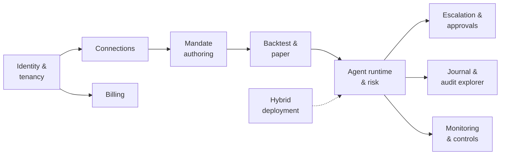

# PRD: Mandate v1 (Design-Partner Release)

| | |
|---|---|
| **Owner** | Product |
| **Status** | Draft v0.1 |
| **Related** | [Vision](01-vision-and-strategy.md) · [Personas](02-personas-and-journeys.md) · [HLD](../HLD.md) · [Backlog](../project/06-backlog-v1.md) |

## 1. Problem

Traders and small funds want agents that trade on their behalf around the clock, but they
cannot trust today's agents with real capital: agents cannot be bounded, autonomy is
all-or-nothing, and decisions cannot be explained or audited. See
[Vision](01-vision-and-strategy.md#the-problem).

## 2. Goals

1. A US user can take an agent from a plain-language idea to **live trading through Alpaca**
   (US stocks, ETFs, crypto spot), with the agent provably unable to act outside its mandate.
2. Agents **escalate selectively**: they act alone when confident and within limits, and ask
   the right person, with evidence, when not.
3. Every decision is **traceable** from a fill back to the observations behind it.
4. Design partners can run in **managed** or **hybrid** mode.

## 3. Non-goals (v1)

- Live retail trading before counsel signs off; retail on paper is in scope from the start
  ([DEC-98](../project/04-decision-log.md#decisions); see [Compliance](08-compliance-and-regulatory.md)).
- Users outside the United States.
- Options trading (see [DEC-24](../project/04-decision-log.md#decisions)).
- Short sales, margin borrowing, and the overnight session
  ([DEC-30, DEC-32](../project/04-decision-log.md#decisions)).
- Interactive Brokers and Coinbase connectors (later releases).
- Fully on-prem / air-gapped control plane.
- Native mobile apps (web push, email, and one chat app cover approvals in v1; SMS and phone calls come next, per [DEC-19](../project/04-decision-log.md#decisions)).
- User-supplied code (WebAssembly plug-ins).
- Strategy marketplace or copy trading.
- An order ticket, or any buy that does not go through an agent: the owner buys by asking an agent
  or setting one up ([DEC-528](../project/decisions/DEC-528.md) item 1).
- Platform-ranked, scored, "trending" or suggested instrument lists; search is display-only and
  watchlists are the owner's (DEC-528 item 2).
- Shared data plane.
- SAML and SCIM (OIDC SSO only).

## 4. Target users

Primary: [Alex](02-personas-and-journeys.md#1-alex-professional-systematic-trader) and
[Priya](02-personas-and-journeys.md#2-priya-emerging-manager-small-fund).
Secondary: Dana (compliance), Sam (IT). Design partners: 5–10 accounts.

## 5. Scope overview

## 6. Functional requirements

Priority: **P0** required for v1, **P1** strongly desired, **P2** if time allows.

### 6.1 Identity and tenancy

| ID | Requirement | Priority |
|---|---|---|
| FR-1.1 | Users sign up with email + passkey, or sign in via OIDC SSO (Google, Okta, Microsoft Entra) | P0 |
| FR-1.2 | Organization → Workspace hierarchy; users can belong to multiple workspaces | P0 |
| FR-1.3 | Roles: org owner/admin, workspace admin, operator, approver, viewer, auditor | P0 |
| FR-1.4 | Step-up authentication (passkey) for connecting accounts, raising limits, going live, and high-risk approvals | P0 |
| FR-1.5 | Org-level policy limits that workspaces and agents can only tighten | P0 |
| FR-1.6 | Separation of duties option: an agent's creator cannot be the sole approver above a threshold | P1 |

**Acceptance criteria (FR-1.5):** attempting to save a workspace or agent limit looser than its
parent is rejected with a message naming the parent limit.

### 6.2 Connections

| ID | Requirement | Priority |
|---|---|---|
| FR-2.1 | Connect an **Alpaca** account (paper and live) through Alpaca's OAuth flow ([DEC-23](../project/04-decision-log.md#decisions)) | P0 |
| FR-2.2 | **Never hold fund-movement permissions:** OAuth connections request trading scopes only; API-key connections have permissions checked at connect time and keys that allow withdrawals or transfers are rejected | P0 |
| FR-2.3 | Grant a connection to specific agents with scopes (instruments, maximum notional); **one agent per instrument per broker account**, coordinated by one account ledger; activity not originated by Mandate switches the account's agents to exits-only ([DEC-26](../project/04-decision-log.md#decisions)) | P0 |
| FR-2.6 | Verify at connect and daily that the account trades at 1× buying power; pause agents and prompt the owner otherwise | P0 |
| FR-2.7 | Paper trading uses the IEX data profile; **live equity agents require consolidated (SIP) market data** on the user's Alpaca account; runtimes subscribe to trading-status and LULD channels ([DEC-35](../project/04-decision-log.md#decisions)) | P0 |
| FR-2.4 | Tokens and credentials stored only in the workspace deployment's vault; never shown again after entry | P0 |
| FR-2.5 | **Kraken Derivatives US** connector for CFTC-regulated crypto perpetuals (demo and live) | P1 |

**Acceptance criteria (FR-2.2):** the Alpaca OAuth request contains no scopes beyond trading and
account read; an API key with withdrawal or transfer rights is rejected before storage with
instructions for creating a trading-only key; rejections are journaled without secret values.

### 6.3 Mandate authoring

| ID | Requirement | Priority |
|---|---|---|
| FR-3.1 | Describe an agent in plain language; the system compiles a structured mandate (goal, allowed asset classes and `max_instruments`, capital, connection, behavior, signal models, sizing, cadence, protection, risk, autonomy, notifications), extracting values the user stated and proposing envelope values, each shown as proposed and confirmed by the user; the working universe comes from the research agent at runtime ([DEC-97](../project/04-decision-log.md#decisions); [mandate spec §7](../specs/mandate.md#7-compiler-and-platform-proposals-dec-97)) | P0 |
| FR-3.2 | Edit the mandate in a form and as YAML; both stay in sync | P0 |
| FR-3.3 | Validate against platform, org, and workspace policy before saving | P0 |
| FR-3.4 | Show a plain-language summary of the compiled mandate for confirmation | P0 |
| FR-3.5 | Mandates are versioned; deployments pin a version; diffs between versions are viewable | P0 |
| FR-3.6 | Goal types: continuous, accumulate, profit stop (a stopping level, not a target); maintain exposure later ([DEC-46](../project/04-decision-log.md#decisions)) | P0 (continuous, accumulate, profit stop), P2 (exposure) |
| FR-3.7 | Signal-model library: momentum, mean reversion, trend (quant); funding/carry when perpetuals arrive; LLM research; one fast decision model. Parameters have no defaults; documentation describes methodology only ([DEC-52](../project/04-decision-log.md#decisions)) | P0 quant and LLM research (the research agent, DEC-97), P1 fast model |
| FR-3.8 | Templates for common mandate structures; a template may propose envelope values, shown as proposed | P1 |
| FR-3.9 | Research agent: originates theses (instrument, direction, horizon, evidence, invalidation) from market data, news, filings, and the agent's memory; admits instruments into the working universe through the eligibility floor, `max_instruments`, and the autonomy rules; every thesis and admission journaled; bring-your-own-strategy mode pins the universe ([DEC-97](../project/04-decision-log.md#decisions), [ADR-0002](../adr/0002-autonomous-ideation-and-retail.md)) | P0 |
| FR-3.10 | Thesis revision: a thesis that fails on forward paper may be revised by the research agent; a revision is journaled as `ThesisRevised` with its lineage, scored from zero on forward paper only, passes every admission rule, cannot loosen the envelope, and is capped per lineage ([DEC-111](../project/04-decision-log.md#decisions)) | P1 |

**Acceptance criteria (FR-3.1, FR-3.4):** for a set of reference descriptions, the compiled
mandate contains every value the description states, each with its quoted source; proposed envelope
values are marked as proposed; and no envelope field is active until the user confirms it
([DEC-97](../project/04-decision-log.md#decisions)).

### 6.4 Backtest and paper trading

| ID | Requirement | Priority |
|---|---|---|
| FR-4.1 | Backtest a mandate version on historical data with fees, slippage, corporate actions (splits, dividends), and funding for perpetuals | P0 |
| FR-4.2 | Report: return, volatility, Sharpe, maximum drawdown, turnover, fees, versus buy-and-hold | P0 |
| FR-4.3 | Paper trade on Alpaca's paper environment using the same runtime as live | P0 |
| FR-4.4 | Going live requires a completed backtest and a paper run of at least a configurable duration, plus owner approval with step-up auth | P0 |
| FR-4.5 | Backtests are reproducible from the recorded mandate version and data snapshot | P1 |

### 6.5 Agent runtime and risk

| ID | Requirement | Priority |
|---|---|---|
| FR-5.1 | Agents run continuously until stopped, a date, or the done condition | P0 |
| FR-5.2 | Autonomy policy classifies each proposed action as AUTO, ASK, or DENY per the mandate | P0 |
| FR-5.3 | Independent risk gate enforces position, order-size, exposure, order-count, cooldown, daily-loss, drawdown, and lifetime-loss limits ([mandate spec §5](../specs/mandate.md#5-risk-state-and-limits)) | P0 |
| FR-5.4 | Drawdown ladder: user-set rungs (for example, halve sizes → exits only → flatten and pause) with breach confirmation; lifting exits-only or flatten requires owner acknowledgment and resets the high-water mark; a lifetime loss floor is never reset ([DEC-44, DEC-49](../project/04-decision-log.md#decisions)) | P0 |
| FR-5.5 | Risk-reducing actions never require approval; discretionary exits are paced by conduct controls ([DEC-48](../project/04-decision-log.md#decisions)) | P0 |
| FR-5.6 | Order intents are journaled before sending, with idempotency keys | P0 |
| FR-5.7 | On restart, the agent replays its journal, reconciles with the exchange, and resumes; unexplained differences pause the agent and alert the owner | P0 |
| FR-5.8 | Protective exits rest at the broker as OCO or bracket orders (regular session only for equities), with defined exit and kill-switch sequences ([DEC-28](../project/04-decision-log.md#decisions)) | P0 |
| FR-5.12 | Opening orders are limit orders within a price collar, in the regular session only; market orders only for risk-reducing exits in the regular session; no short sales; no overnight trading ([DEC-29, DEC-30, DEC-32, DEC-37](../project/04-decision-log.md#decisions)) | P0 |
| FR-5.13 | Instrument eligibility floor and market-conduct controls enforced by the risk gate ([DEC-31](../project/04-decision-log.md#decisions); [spec §3.2, §9.6](../specs/trading-domain.md#96-market-conduct-controls-dec-31)) | P0 |
| FR-5.14 | Account restrictions and trading halts are checked before every order; restrictions switch all agents on the account to exits-only or pause them | P0 |
| FR-5.9 | Calibration (post-v1): a user-selected, versioned method; every change journaled and treated as a risk-increasing mandate change. v1 has fixed user-set weights ([DEC-47](../project/04-decision-log.md#decisions)) | P2 |
| FR-5.10 | **US market rules enforced by the risk gate:** day-trading rules for the broker's regime (Alpaca: intraday margin; legacy rules for other brokers), 1× buying power with no debit (margin accounts may reuse unsettled proceeds; cash accounts use settled cash only), sessions, auction windows, and halts. Exact rules: [trading domain spec §9](../specs/trading-domain.md#9-risk-gate) | P0 |
| FR-5.11 | Flag potential wash sales to the user in reports (informational, not tax advice) | P2 |

**Acceptance criteria (FR-5.8 to FR-5.14):** all
[trading domain reference cases](../specs/reference-cases/trading-domain.yaml) pass, including
RC-08, RC-09, RC-09B, RC-18 (account rules and buying power), RC-14, RC-20, RC-21 (protective
exits), RC-15 (restrictions), RC-16 (eligibility), RC-17 (account ledger), and RC-22 (conduct
controls); every gate decision, including allows, is journaled with the checks that produced it.

**Acceptance criteria (FR-5.6, FR-5.7):** in fault-injection tests that kill the runtime at every
step of order submission, no order is ever duplicated and every position is reconciled.

### 6.6 Escalation and approvals

| ID | Requirement | Priority |
|---|---|---|
| FR-6.1 | Triggers are the user's autonomy rules (for example, combined score below a threshold, order or daily buying above a size, unusual market input); orders the gate would deny are never sent for approval | P0 |
| FR-6.2 | Approval request contains the agent's proposed action, the mandate rule that triggered it, model outputs with authorship, the combined score labeled as not a probability of profit, the deadline, and the default (skip); never platform-authored alternatives or profit estimates ([DEC-126](../project/04-decision-log.md#decisions); [mandate spec §6.4](../specs/mandate.md#64-approvals)) | P0 |
| FR-6.3 | Channels: web push, email, SMS, Slack or Telegram; escalation chain with quiet hours | P0 (web push, email, one chat), P1 (SMS, phone call) |
| FR-6.4 | Notifications carry only an opaque ID and generic text; details load from the workspace deployment | P0 |
| FR-6.5 | An approval binds quantity, limit price, and mandate version; the gate re-runs before executing and skips on deny | P0 |
| FR-6.6 | On timeout, apply the safe default | P0 |
| FR-6.7 | Two-approver rule above a configurable threshold | P1 |
| FR-6.8 | The agent continues managing other positions while an approval is pending | P0 |

**Acceptance criteria (FR-6.4):** inspecting relay and notification-provider payloads shows no
instrument, size, price, or thesis.

### 6.7 Journal and audit explorer

| ID | Requirement | Priority |
|---|---|---|
| FR-7.1 | Append-only, hash-chained journal per workspace covering observations, analyses, decisions, approvals, orders, fills, and configuration changes | P0 |
| FR-7.2 | Causal trace view from any fill or order back to its causes | P0 |
| FR-7.3 | Timeline per agent with filters (event type, time, outcome) | P0 |
| FR-7.4 | Export as JSON and CSV for a time range | P0 |
| FR-7.5 | Chain verification tool that detects any modified or missing event | P1 |
| FR-7.6 | Trading records retained 6 years after the later of creation and the closing of the supported position, lot, or account, in write-once storage; organizations may extend, not shorten; legal hold ([DEC-33](../project/04-decision-log.md#decisions); [spec §13](../specs/trading-domain.md#13-records-retention-dec-33)) | P0 |
| FR-7.7 | Daily per-workspace surveillance report (self-trade checks, order-to-fill ratios, close-window activity, concentration), retained as a record | P0 |

### 6.8 Monitoring and controls

| ID | Requirement | Priority |
|---|---|---|
| FR-8.1 | Dashboard: agents, state, positions, P&L, open approvals, recent decisions | P0 |
| FR-8.2 | Pause, resume, stop per agent; kill switch per workspace and per connection | P0 |
| FR-8.3 | Alerts: risk rung reached, reconciliation mismatch, data feed stale, agent paused | P0 |
| FR-8.4 | Per-signal-model scorecards (hit rate, calibration measurement) from the user's own results only, for the user's review; never aggregated across users, shown in the model picker, or used in marketing; they never change weights. Delivered in Phase 1 for the research agent's forward-paper evaluation ([DEC-99](../project/04-decision-log.md#decisions)) | P0 |
| FR-8.5 | Landing and holdings: the landing page shows the owner's connected accounts, each connection's own holdings read-only with their age, and "no agents deployed" when there are none. A holding no agent bought is the owner's and is never shown as an agent's (connections CN-7). For Robinhood, only the agentic account (CN-8). [DEC-528](../project/decisions/DEC-528.md); E11-10 | P1 (v1, Phase 2, after the first paper trade) |
| FR-8.6 | Instrument search by name or ticker, display-only, ordered by match to the query and then alphabetically; owner-curated watchlists stored in the workspace. No ranking, scoring, flagging or platform-authored suggestion ([data-plane spec §1.4](../specs/data-plane.md#14-non-goals)). An instrument page offers "ask an agent" and "set up an agent", never "buy". DEC-528; E11-11 | P1 (v1, Phase 2, after the first paper trade) |

### 6.9 Deployment

| ID | Requirement | Priority |
|---|---|---|
| FR-9.1 | Managed mode on our infrastructure | P0 |
| FR-9.2 | Hybrid mode: workspace deployment installed on the customer's Kubernetes (Helm) or a single host (Docker Compose), outbound-only connectivity | P0 |
| FR-9.3 | Signed releases and an in-place upgrade path without losing agent state | P0 |

### 6.10 Billing

| ID | Requirement | Priority |
|---|---|---|
| FR-10.1 | Billing per organization through a billing provider; plan plus agent count | P0 |
| FR-10.2 | Usage metering (agent-hours, model usage) from counts only | P1 |
| FR-10.3 | Hybrid license key tied to the organization | P0 |

### 6.11 After v1 ([DEC-528](../project/decisions/DEC-528.md))

The founder's 2026-10-08 product flow added three requirements. None is placed in v1 yet. Each
needs a spec change, or evidence, that is not scheduled. These are placed after v1 because whether
they fit in v1 is not settled; the founder may pull FR-11.1 into Phase 2 once its spec change lands.

| ID | Requirement | Phase |
|---|---|---|
| FR-11.1 | Monitor-only agents: an agent that watches the instruments and conditions its confirmed mandate names and alerts, and never opens a position. Its autonomy denies every opening, and its notifications carry only opaque IDs (rule 6). Needs a mandate spec change; E10-19 | Later (Phase 3 unless pulled forward) |
| FR-11.2 | Event-triggered research: news, filings, price moves, and earnings dates and call transcripts may bring a research run forward. Debounced; rate- and cost-capped; allowlisted and corroborated sources ([DEC-101](../project/04-decision-log.md#decisions)); prompt-injection defences. Research produces opinions only (rule 4). Needs agent harness spec §5.3's change and a source evaluation for an earnings calendar and transcripts; E19-12 | Later (after the research agent's [DEC-99](../project/04-decision-log.md#decisions) evaluation passes) |
| FR-11.3 | An agent over holdings the owner already has (adoption). Deferred: [DEC-46](../project/04-decision-log.md#decisions) stands until cost basis and tax lots are modelled, with wash-sale handling and an answer for trading-domain spec §7.1 and connections CN-7. The backlog's "Later" section | Deferred |

## 7. Non-functional requirements

| Area | Requirement |
|---|---|
| Safety | Zero orders outside the mandate in all tests; kill switches take effect within one decision cycle |
| Latency | p99 under 1 ms in-process from input to order bytes ready (gate, order builder, canonicalization and hash), excluding the durable journal append (p99 under 5 ms) and the broker round trip ([DEC-74](../project/04-decision-log.md#decisions)); fast decision models respond within their configured deadline or are skipped |
| Reliability | Zero duplicate orders under fault injection; agents recover automatically after restart |
| Security | Credentials never leave the vault; step-up auth for sensitive actions; per-workspace encryption keys |
| Privacy | In hybrid mode, no mandate, approval, journal, or credential content reaches the global control plane |
| Auditability | Every state change journaled; chain verification passes |
| Availability | Global control plane outage does not stop trading; hybrid approvals continue through fallback channels |

## 8. Success metrics (design-partner release)

| Metric | Target |
|---|---|
| Design partners with an agent on paper | 5+ |
| Design partners with an agent live | 3+ |
| Orders outside mandate / duplicate orders | 0 / 0 |
| Share of decisions made autonomously (live agents) | 90%+ |
| Escalations judged warranted by the approver | 70%+ |
| Median approval response time | under 5 minutes |
| Hybrid deployments installed | 1+ |

See [Metrics](06-metrics.md) for definitions.

## 9. Release criteria

- All P0 requirements met with acceptance criteria passing.
- Fault-injection suite: zero duplicate orders, full reconciliation.
- A continuous paper-trading soak across several agents with no unhandled errors.
- Security review of credential handling, step-up auth, and notification payloads.
- Runbooks for the alerts in FR-8.3.
- Terms of service and risk disclosures reviewed by counsel.

See [Quality and release plan](../project/07-quality-and-release.md).

## 10. Open questions

1. ~~Whether options join v1 or wait~~: they wait ([DEC-24](../project/04-decision-log.md#decisions), accepted 2026-09-27).
2. Which fast decision model ships first: Laya (self-hosted) or Jev (hosted, early access).
3. Minimum paper-trading duration before live.
4. ~~Whether LLM research is P0 for design partners or can follow~~: it is P0, as the research agent (FR-3.9, [DEC-97](../project/04-decision-log.md#decisions)).
