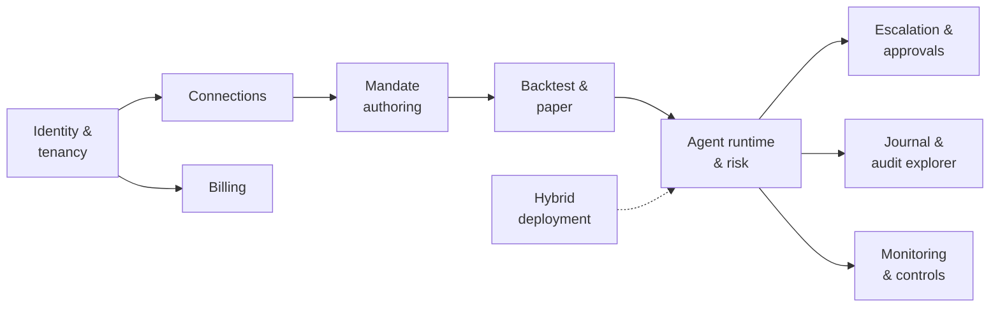

# PRD: Mandate v1 (Design-Partner Release)

| | |
|---|---|
| **Owner** | Product |
| **Status** | Draft v0.1 |
| **Related** | [Vision](01-vision-and-strategy.md) · [Personas](02-personas-and-journeys.md) · [HLD](../HLD.md) · [Backlog](../project/06-backlog-v1.md) |

## 1. Problem

Traders and small funds want agents that trade on their behalf around the clock, but they
cannot trust today's agents with real capital: agents cannot be bounded, autonomy is
all-or-nothing, and decisions cannot be explained or audited. See
[Vision](01-vision-and-strategy.md#the-problem).

## 2. Goals

1. A user can take an agent from a plain-language idea to **live trading on a crypto
   exchange**, with the agent provably unable to act outside its mandate.
2. Agents **escalate selectively**: they act alone when confident and within limits, and ask
   the right person, with evidence, when not.
3. Every decision is **traceable** from a fill back to the observations behind it.
4. Design partners can run in **managed** or **hybrid** mode.

## 3. Non-goals (v1)

- Retail launch (pending legal review; see [Compliance](08-compliance-and-regulatory.md)).
- US equities / Interactive Brokers (next release).
- Fully on-prem / air-gapped control plane.
- Native mobile apps (web push, email, SMS, and chat cover approvals in v1).
- User-supplied code (WebAssembly plug-ins).
- Strategy marketplace, copy trading, or platform-provided trade recommendations.
- Shared intelligence plane.
- SAML and SCIM (OIDC SSO only).

## 4. Target users

Primary: [Alex](02-personas-and-journeys.md#1-alex-professional-systematic-trader) and
[Priya](02-personas-and-journeys.md#2-priya-emerging-manager-small-fund).
Secondary: Dana (compliance), Sam (IT). Design partners: 5–10 accounts.

## 5. Scope overview

## 6. Functional requirements

Priority: **P0** required for v1, **P1** strongly desired, **P2** if time allows.

### 6.1 Identity and tenancy

| ID | Requirement | Priority |
|---|---|---|
| FR-1.1 | Users sign up with email + passkey, or sign in via OIDC SSO (Google, Okta, Microsoft Entra) | P0 |
| FR-1.2 | Organization → Workspace hierarchy; users can belong to multiple workspaces | P0 |
| FR-1.3 | Roles: org owner/admin, workspace admin, operator, approver, viewer, auditor | P0 |
| FR-1.4 | Step-up authentication (passkey) for connecting accounts, raising limits, going live, and high-risk approvals | P0 |
| FR-1.5 | Org-level policy limits that workspaces and agents can only tighten | P0 |
| FR-1.6 | Separation of duties option: an agent's creator cannot be the sole approver above a threshold | P1 |

**Acceptance criteria (FR-1.5):** attempting to save a workspace or agent limit looser than its
parent is rejected with a message naming the parent limit.

### 6.2 Connections

| ID | Requirement | Priority |
|---|---|---|
| FR-2.1 | Connect at least one crypto exchange (testnet and live); first exchange per [decision log](../project/04-decision-log.md#open-decisions) OD-01 | P0 |
| FR-2.2 | Query key permissions at connect time; **reject keys with withdrawal permission** | P0 |
| FR-2.3 | Grant a connection to specific agents with scopes (instruments, maximum notional) | P0 |
| FR-2.4 | Credentials stored only in the workspace deployment's vault; never shown again after entry | P0 |
| FR-2.5 | Second exchange | P1 |

**Acceptance criteria (FR-2.2):** a key with withdrawal rights is rejected before storage, with
instructions for creating a trade-only key; the rejection is journaled without the key value.

### 6.3 Mandate authoring

| ID | Requirement | Priority |
|---|---|---|
| FR-3.1 | Describe an agent in plain language; the system compiles a structured mandate (goal, done condition, instruments, connection, behavior, advisors, cadence, risk, autonomy, notifications) | P0 |
| FR-3.2 | Edit the mandate in a form and as YAML; both stay in sync | P0 |
| FR-3.3 | Validate against org and workspace limits before saving | P0 |
| FR-3.4 | Show a plain-language summary of the compiled mandate for confirmation | P0 |
| FR-3.5 | Mandates are versioned; deployments pin a version; diffs between versions are viewable | P0 |
| FR-3.6 | Goal types: accumulate/distribute, return target under risk limits, maintain exposure | P0 (accumulate, return target), P1 (exposure) |
| FR-3.7 | Advisor library: momentum, mean reversion, funding/carry (quant); LLM research; one fast decision-model advisor | P0 quant, P1 LLM and fast model |
| FR-3.8 | Templates for common mandates | P1 |

**Acceptance criteria (FR-3.1, FR-3.4):** for a set of reference descriptions, the compiled
mandate matches the intended fields, and every field the compiler inferred rather than read
from the description is highlighted for review.

### 6.4 Backtest and paper trading

| ID | Requirement | Priority |
|---|---|---|
| FR-4.1 | Backtest a mandate version on historical data with fees, funding, and slippage | P0 |
| FR-4.2 | Report: return, volatility, Sharpe, maximum drawdown, turnover, fees, versus buy-and-hold | P0 |
| FR-4.3 | Paper trade on the exchange testnet using the same runtime as live | P0 |
| FR-4.4 | Going live requires a completed backtest and a paper run of at least a configurable duration, plus owner approval with step-up auth | P0 |
| FR-4.5 | Backtests are reproducible from the recorded mandate version and data snapshot | P1 |

### 6.5 Agent runtime and risk

| ID | Requirement | Priority |
|---|---|---|
| FR-5.1 | Agents run continuously until stopped, a date, or the done condition | P0 |
| FR-5.2 | Autonomy policy classifies each proposed action as AUTO, ASK, or DENY per the mandate | P0 |
| FR-5.3 | Independent risk gate enforces position, leverage, daily-loss, and drawdown limits on every order | P0 |
| FR-5.4 | Drawdown ladder: configurable rungs (for example, halve sizes → exits only → flatten and notify) | P0 |
| FR-5.5 | Risk-reducing actions never require approval | P0 |
| FR-5.6 | Order intents are journaled before sending, with idempotency keys | P0 |
| FR-5.7 | On restart, the agent replays its journal, reconciles with the exchange, and resumes; unexplained differences pause the agent and alert the owner | P0 |
| FR-5.8 | Protective stop orders rest at the exchange for open positions | P1 |
| FR-5.9 | Calibrated confidence per advisor, updated from realized outcomes | P1 |

**Acceptance criteria (FR-5.6, FR-5.7):** in fault-injection tests that kill the runtime at every
step of order submission, no order is ever duplicated and every position is reconciled.

### 6.6 Escalation and approvals

| ID | Requirement | Priority |
|---|---|---|
| FR-6.1 | Triggers: confidence below threshold, rule requires approval, order above size threshold, unusual market input | P0 |
| FR-6.2 | Approval request contains proposed action, alternatives, evidence, risk impact, deadline, and default | P0 |
| FR-6.3 | Channels: web push, email, SMS, Slack or Telegram; escalation chain with quiet hours | P0 (web push, email, one chat), P1 (SMS, phone call) |
| FR-6.4 | Notifications carry only an opaque ID and generic text; details load from the workspace deployment | P0 |
| FR-6.5 | Before executing an approved action, re-validate price and risk drift; re-ask or apply default if beyond tolerance | P0 |
| FR-6.6 | On timeout, apply the safe default | P0 |
| FR-6.7 | Two-approver rule above a configurable threshold | P1 |
| FR-6.8 | The agent continues managing other positions while an approval is pending | P0 |

**Acceptance criteria (FR-6.4):** inspecting relay and notification-provider payloads shows no
instrument, size, price, or thesis.

### 6.7 Journal and audit explorer

| ID | Requirement | Priority |
|---|---|---|
| FR-7.1 | Append-only, hash-chained journal per workspace covering observations, analyses, decisions, approvals, orders, fills, and configuration changes | P0 |
| FR-7.2 | Causal trace view from any fill or order back to its causes | P0 |
| FR-7.3 | Timeline per agent with filters (event type, time, outcome) | P0 |
| FR-7.4 | Export as JSON and CSV for a time range | P0 |
| FR-7.5 | Chain verification tool that detects any modified or missing event | P1 |
| FR-7.6 | Retention settings per organization | P1 |

### 6.8 Monitoring and controls

| ID | Requirement | Priority |
|---|---|---|
| FR-8.1 | Dashboard: agents, state, positions, P&L, open approvals, recent decisions | P0 |
| FR-8.2 | Pause, resume, stop per agent; kill switch per workspace and per connection | P0 |
| FR-8.3 | Alerts: risk rung reached, reconciliation mismatch, data feed stale, agent paused | P0 |
| FR-8.4 | Per-advisor scorecards (hit rate, calibration) | P1 |

### 6.9 Deployment

| ID | Requirement | Priority |
|---|---|---|
| FR-9.1 | Managed mode on our infrastructure | P0 |
| FR-9.2 | Hybrid mode: workspace deployment installed on the customer's Kubernetes (Helm) or a single host (Docker Compose), outbound-only connectivity | P0 |
| FR-9.3 | Signed releases and an in-place upgrade path without losing agent state | P0 |

### 6.10 Billing

| ID | Requirement | Priority |
|---|---|---|
| FR-10.1 | Billing per organization through a billing provider; plan plus agent count | P0 |
| FR-10.2 | Usage metering (agent-hours, model usage) from counts only | P1 |
| FR-10.3 | Hybrid license key tied to the organization | P0 |

## 7. Non-functional requirements

| Area | Requirement |
|---|---|
| Safety | Zero orders outside the mandate in all tests; kill switches take effect within one decision cycle |
| Latency | Risk gate and order path add under 1 ms; fast-decision advisors respond within their configured deadline or are skipped |
| Reliability | Zero duplicate orders under fault injection; agents recover automatically after restart |
| Security | Credentials never leave the vault; step-up auth for sensitive actions; per-workspace encryption keys |
| Privacy | In hybrid mode, no mandate, approval, journal, or credential content reaches the global control plane |
| Auditability | Every state change journaled; chain verification passes |
| Availability | Global control plane outage does not stop trading; hybrid approvals continue through fallback channels |

## 8. Success metrics (design-partner release)

| Metric | Target |
|---|---|
| Design partners with an agent on paper | 5+ |
| Design partners with an agent live | 3+ |
| Orders outside mandate / duplicate orders | 0 / 0 |
| Share of decisions made autonomously (live agents) | 90%+ |
| Escalations judged warranted by the approver | 70%+ |
| Median approval response time | under 5 minutes |
| Hybrid deployments installed | 1+ |

See [Metrics](06-metrics.md) for definitions.

## 9. Release criteria

- All P0 requirements met with acceptance criteria passing.
- Fault-injection suite: zero duplicate orders, full reconciliation.
- A continuous paper-trading soak across several agents with no unhandled errors.
- Security review of credential handling, step-up auth, and notification payloads.
- Runbooks for the alerts in FR-8.3.
- Terms of service and risk disclosures reviewed by counsel.

See [Quality and release plan](../project/07-quality-and-release.md).

## 10. Open questions

1. First exchange (depends on founder and design-partner jurisdictions).
2. Which fast decision model ships first: Laya (self-hosted) or Jev (hosted, early access).
3. Minimum paper-trading duration before live.
4. Whether LLM research is P0 for design partners or can follow.
