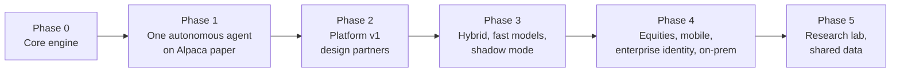

# Product Roadmap

| | |
|---|---|
| **Owner** | Product |
| **Status** | Draft v0.1 |

Phases are ordered by dependency and gated by exit criteria, not dates. A phase starts when
the previous phase's exit criteria are met.

## Now

### Phase 0: Core engine

Build the trading core from first principles, piece by piece.

- Market data: types, historical download from Alpaca (US stocks, ETFs, crypto), storage,
  quality checks, corporate actions (splits, dividends).
- Accounting for spot instruments: positions, cash, fees, corporate actions, settlement,
  realized and unrealized P&L. Perpetuals accounting (funding, margin) arrives with Kraken in
  Phase 3.
- Simulated execution: fills, slippage, fees.
- Backtest loop with a deliberately simple baseline strategy and evaluation metrics.
- Journal: append-only, hash-chained event log.

**Exit criteria:** a baseline strategy backtests reproducibly on a basket of US stocks and ETFs
and on BTC/USD spot, with
correct accounting (verified against hand-calculated cases) and a complete journal.

### Phase 1: One autonomous agent on Alpaca paper

- Agent runtime: perception, memory, quant signal models, order builder, autonomy policy.
- Research agent: LLM ideation from market data, news, filings, and memory into theses; universe
  admission through the eligibility floor and the autonomy rules; bring-your-own-strategy mode
  ([DEC-97](../project/04-decision-log.md#decisions), [ADR-0002](../adr/0002-autonomous-ideation-and-retail.md)).
  The first slice runs in the team's internal paper workspaces, with the research basket as its
  fixed test data universe, every admission `ask`, paper only, and scorecards on; dynamic admission
  for users' agents, under their own envelopes, follows once the forward-paper evaluation passes
  ([DEC-103](../project/04-decision-log.md#decisions)).
- Signal-model scorecards: every thesis scored after its horizon against pre-registered baselines on
  forward paper trading, net of modeled costs ([DEC-99](../project/04-decision-log.md#decisions),
  E15-3).
- Thesis revision loop (Should): a thesis that failed on forward paper may be revised, with its
  autopsy journaled, scored from zero on forward paper only, and capped per lineage; only after the
  forward-paper evaluation has run once ([DEC-111](../project/04-decision-log.md#decisions), E17-9).
- Risk gate, drawdown ladder, kill switch.
- Alpaca connector (paper), reconciliation, idempotent order intents, crash recovery.
- US market rules in the risk gate: day-trading regime (legacy or intraday margin), settlement, short-sale rules,
  market hours.
- Escalation v0: email and one chat channel, deadlines, safe defaults.
- Command-line control.

**Exit criteria:** an agent trades an Alpaca paper account unattended, on theses it generated,
through a continuous soak,
survives forced restarts with no duplicate orders, and escalates and applies defaults
correctly. The research agent's theses beat the pre-registered baselines on forward paper trading,
net of modeled costs, over a pre-registered evaluation window and metric
([DEC-99](../project/04-decision-log.md#decisions)).

## Next

### Phase 2: Platform v1 (design partners)

Everything in the [PRD](04-prd-v1.md) P0 list:

- Global control plane (thin) and workspace control services; managed mode.
- Web app: workspaces, connections, mandate authoring (plain language → mandate), backtest and
  paper, dashboard, approvals, audit explorer.
- OIDC SSO, roles, step-up auth, policy hierarchy.
- Private approval flow (opaque notifications).
- Billing and hybrid license keys.
- Hybrid installer (Helm / Docker Compose).
- Robinhood Agentic Trading connector (retail equities over MCP into a dedicated account); the
  retail profile and disclosures; live retail trading once counsel signs off ([DEC-98](../project/04-decision-log.md#decisions)).
- The landing page with the owner's connected accounts and their holdings, read-only; display-only
  instrument search and owner-curated watchlists. Every buy still goes through an agent: there is
  no order ticket ([DEC-528](../project/decisions/DEC-528.md); PRD FR-8.5, FR-8.6).

**Exit criteria:** PRD release criteria met; 5+ design partners on paper, 3+ live.

### Phase 3: Hybrid at scale, fast models, shadow mode

- Hybrid deployments hardened (upgrades, health, fallback approval channels).
- Fast decision models (Laya in-process, Jev optional) with deadlines.
- Scorecards extended to the fast decision models; user-selectable sizing methods; calibration only as a user-selected, versioned method (DEC-47).
- Shadow mode for new mandate versions. Multi-variant mandate experiments (E15-5,
  [strategy option 16](10-strategy-options.md#option-16-mandate-experiments-multi-variant-shadow-mode-founder-2026-09-27))
  are pulled forward to right after the Phase 1 exit.
- Kraken Derivatives US connector: CFTC-regulated crypto perpetuals, with perpetuals accounting
  (funding, margin, liquidation thresholds) and a funding/carry signal model.
- SMS and phone escalation; two-approver rule.
- Monitor-only agents, unless pulled into Phase 2 once their mandate spec change lands, and
  event-triggered research once the research agent's evaluation has passed
  ([DEC-528](../project/decisions/DEC-528.md); PRD §6.11).

**Exit criteria:** escalation precision and autonomy-rate targets met across design partners;
at least one hybrid customer in production.

## Later

### Phase 4: Equities, mobile, enterprise

- Options on Alpaca.
- Interactive Brokers connector (CME futures, professional accounts); Coinbase US futures.
- Native mobile app for approvals.
- SAML and SCIM; separation of duties; fully on-prem / air-gapped packaging.
- SOC 2 readiness.

### Phase 5: Research lab and shared data

- Retail education and community features (retail itself starts in v1, [DEC-98](../project/04-decision-log.md#decisions)).
- Research lab: users define and backtest mandate variants; promotion requires approval.
- Shared data plane: shared market data and factual public-event classifications (no directional
  views) for managed workspaces.
- WebAssembly plug-ins for custom logic.

**Not yet placed:** agents over holdings the owner already has (adoption). They wait until cost basis
and tax lots are modelled, with wash-sale handling and an answer for external activity
([DEC-46](../project/04-decision-log.md#decisions), [DEC-528](../project/decisions/DEC-528.md) item 3).

## Explicitly not planned

- Signals sold separately from agents.
- An order ticket, and instrument lists the platform ranks or suggests ([DEC-528](../project/decisions/DEC-528.md)).
- Strategy marketplace or copy trading.
- Custody of funds.
- Pricing tied to trades, assets, or profits.
