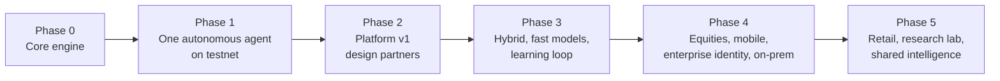

# Product Roadmap

| | |
|---|---|
| **Owner** | Product |
| **Status** | Draft v0.1 |

Phases are ordered by dependency and gated by exit criteria, not dates. A phase starts when
the previous phase's exit criteria are met.

## Now

### Phase 0: Core engine

Build the trading core from first principles, piece by piece.

- Market data: types, historical download (Binance public data), storage, quality checks.
- Accounting: positions, cash, fees, funding, realized and unrealized P&L.
- Simulated execution: fills, slippage, fees.
- Backtest loop with a deliberately simple baseline strategy and evaluation metrics.
- Journal: append-only, hash-chained event log.

**Exit criteria:** a baseline strategy backtests reproducibly on BTC and ETH perpetuals with
correct accounting (verified against hand-calculated cases) and a complete journal.

### Phase 1: One autonomous agent on testnet

- Agent runtime: perception, memory, quant advisors, decider, autonomy policy.
- Risk gate, drawdown ladder, kill switch.
- Exchange connector (testnet), reconciliation, idempotent order intents, crash recovery.
- Escalation v0: email and one chat channel, deadlines, safe defaults.
- Command-line control.

**Exit criteria:** an agent trades a testnet account unattended through a continuous soak,
survives forced restarts with no duplicate orders, and escalates and applies defaults
correctly.

## Next

### Phase 2: Platform v1 (design partners)

Everything in the [PRD](04-prd-v1.md) P0 list:

- Global control plane (thin) and workspace control services; managed mode.
- Web app: workspaces, connections, mandate authoring (plain language → mandate), backtest and
  paper, dashboard, approvals, audit explorer.
- OIDC SSO, roles, step-up auth, policy hierarchy.
- Private approval flow (opaque notifications).
- Billing and hybrid license keys.
- Hybrid installer (Helm / Docker Compose).

**Exit criteria:** PRD release criteria met; 5+ design partners on paper, 3+ live.

### Phase 3: Hybrid at scale, fast models, learning loop

- Hybrid deployments hardened (upgrades, health, fallback approval channels).
- Fast decision models (Laya in-process, Jev optional) with deadlines.
- Calibration service; advisor scorecards; trust-weighted decider.
- Shadow mode for new mandate versions.
- Second exchange; SMS and phone escalation; two-approver rule.

**Exit criteria:** escalation precision and autonomy-rate targets met across design partners;
at least one hybrid customer in production.

## Later

### Phase 4: Equities, mobile, enterprise

- Interactive Brokers connector (US equities), Alpaca connector.
- Native mobile app for approvals.
- SAML and SCIM; separation of duties; fully on-prem / air-gapped packaging.
- SOC 2 readiness.

### Phase 5: Retail, research lab, shared intelligence

- Retail managed offering with presets and education (only after legal review).
- Research lab: agents propose and test new mandate variants; promotion requires approval.
- Shared intelligence plane: shared market data and public-event judgments for managed
  workspaces.
- WebAssembly plug-ins for custom logic.

## Explicitly not planned

- Trade recommendations or signals sold by the platform.
- Strategy marketplace or copy trading.
- Custody of funds.
- Pricing tied to trades, assets, or profits.
