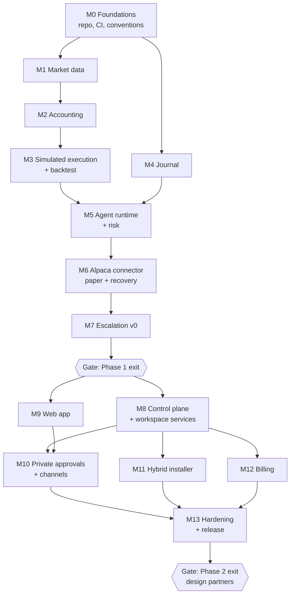

# Milestones and Work Breakdown

| | |
|---|---|
| **Owner** | Project management |
| **Status** | Draft v0.1 |

Milestones are sequenced by dependency and closed by exit criteria, not dates. Work packages
(WP) map to the [backlog](06-backlog-v1.md) epics.

## Milestone map

**Critical path:** M1 → M2 → M3 → M5 → M6 → M7 → M8 → M10 → M13.

## Work packages

### Phase 0: Core engine

| WP | Deliverable | Depends on | Exit criteria |
|---|---|---|---|
| M0 Foundations | Rust workspace, Python package, CI (build, test, lint), coding conventions, ADR template | None | CI green on main; conventions documented |
| M1 Market data | Core types (trade, bar, corporate action); Alpaca historical-data downloader for US stocks, ETFs, and crypto; Parquet storage; `download` and `inspect` commands (coverage, gaps, duplicates, market sessions, statistics) | M0 | A stock/ETF basket and BTC/USD history downloaded and inspected; gap and session handling tested |
| M2 Accounting | Spot accounting: positions, cash, fees, corporate actions (splits, dividends), settlement, realized and unrealized P&L; property-based tests | M1 | Matches hand-calculated reference cases, including splits, dividends, partial fills, and unsettled cash |
| M3 Simulated execution + backtest | Fill model (market, limit), slippage and fee models, event loop, baseline strategy, metrics report | M2 | Baseline backtest reproducible bit-for-bit from inputs |
| M4 Journal | Append-only, hash-chained event log; causal links; verification tool | M0 | Tampering with any event is detected |

### Phase 1: One autonomous agent on Alpaca paper

| WP | Deliverable | Depends on | Exit criteria |
|---|---|---|---|
| M5 Agent runtime + risk | Perception, memory, quant signal models, order builder, autonomy policy, risk gate (including US market rules), drawdown ladder, kill switch; mandate schema v0 | M3, M4 | Agent never exceeds limits or breaks US account rules in simulation fuzzing |
| M6 Alpaca connector | Paper connector (API keys for the founder's own account in Phase 1; OAuth arrives in M8); idempotent order intents; reconciliation; crash recovery | M5 | Fault injection at every step: zero duplicates, full reconciliation |
| M7 Escalation v0 | Approval requests, deadlines, safe defaults, drift re-validation; email and one chat channel; CLI control | M6 | Continuous Alpaca paper soak with forced restarts and escalations passes |

### Phase 2: Platform v1

| WP | Deliverable | Depends on | Exit criteria |
|---|---|---|---|
| M8 Control plane + workspace services | Global control plane (directory, licensing, fleet, relay); workspace services (mandate registry and compiler, policy, deployment manager, approvals, audit backend, connections with Alpaca OAuth); OIDC SSO, roles, step-up auth | Phase 1 gate | Multi-workspace isolation tests pass; policy hierarchy enforced; OAuth requests trading scopes only |
| M9 Web app | Workspaces, connections, mandate authoring, backtest and paper views, dashboard, audit explorer | Phase 1 gate | Journey J1 completed end to end by a non-team user |
| M10 Private approvals + channels | Opaque notifications; details served from the workspace deployment; web push, email, chat; escalation chains, quiet hours | M8, M9 | No sensitive content in any relay or provider payload |
| M11 Hybrid installer | Helm chart and Docker Compose; outbound-only connectivity; signed releases; upgrade without state loss | M8 | Journey J4 completed on a clean cluster; upgrade preserves agents |
| M12 Billing | Organization billing, plans, agent counts, hybrid license keys | M8 | Test organization billed correctly across plan changes |
| M13 Hardening + release | Security review, penetration test, runbooks, terms and disclosures, soak | M10, M11, M12 | [Phase 2 release gate](07-quality-and-release.md#release-gates) passes |

## Phase gates

| Gate | Criteria | Sign-off |
|---|---|---|
| Tier 1 specs | Trading domain (v0.8), journal (v0.2), and mandate (v0.5) specs with their reference cases approved | Founder: **passed 2026-09-25** (DEC-71) |
| Phase 0 exit | M1–M4 exit criteria met | Founder |
| Phase 1 exit | M5–M7 exit criteria met; Alpaca paper soak report reviewed | Founder |
| Phase 2 exit | PRD release criteria; design partners onboarded | Founder, counsel (terms) |
