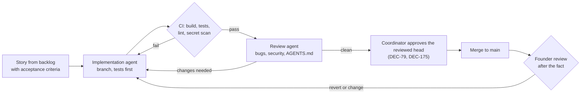

# Quality and Release Plan

| | |
|---|---|
| **Owner** | Project management (founder) |
| **Status** | Draft v0.1 |

## Definition of Ready (story)

- Linked to an epic and PRD requirement.
- Acceptance criteria written and testable.
- Dependencies identified; any open decision resolved or explicitly deferred.

## Development workflow (founder + agents)

1. **One story per change.** Each change implements one backlog story and cites the HLD section
   and PRD requirement it serves.
2. **Tests first for safety-critical code.** For accounting, the risk gate, idempotency,
   reconciliation, and authentication, the founder writes or verifies the reference test cases
   before an agent writes the implementation.
3. **Independent review.** A separate agent run reviews every change before the founder sees it.
4. **Approval of the reviewed head.** A change merges once CI is green and the independent review
   passed, on the head that review saw (DEC-79, DEC-175); safety-critical paths also need zero
   missed mutants and an adversarial review. The founder reviews after the fact and can revert;
   the decisions DEC-79 reserves still wait for the founder.
   **Two lanes** ([DEC-516](decisions/DEC-516.md), proposed): that is the safety lane. A change
   that touches no safety-critical path, spec, gate or safety surface runs on the light lane: one
   item per PR, green CI, the author's checks and the screen's pictures in the body, then merge,
   with the review reading the diff after the merge and the founder judging from the pictures.
5. **No live secrets for agents.** Agents use paper and demo credentials and fixtures only.
6. **CI runs on ready pull requests, not drafts** ([DEC-610](decisions/DEC-610.md)). A builder
   proves a change locally with `cargo xtask check` and keeps its pull request a draft, where `ci`
   runs no job. It marks the pull request ready once its independent review passes, or earlier
   when the change needs CI's runners (the Postgres tests, the mutation shards). Marking it ready
   starts the run that judges it, and a merge still needs `fast` and `full` run and green on the
   exact head: a run skipped on a draft never counts.
7. **Decisions are recorded.** An agent that needs to deviate from an accepted decision stops and
   writes a new decision instead, as a file under `docs/project/decisions/` (DEC-344).

Full agent rules: [`AGENTS.md`](../../AGENTS.md).

## Definition of Done (story)

- Review agent pass on the merged head; merged; CI green.
- Unit tests for new logic; property-based tests for accounting and risk logic.
- Journal events emitted for every new state change.
- Documentation updated (user-facing and runbooks where relevant).
- No new high-severity security findings.

## Test strategy

| Layer | What | Applies to |
|---|---|---|
| Unit | Pure logic: accounting, fills, risk checks, policy evaluation | All Rust and Python code |
| Property-based | Invariants: cash + positions conserve value net of fees; risk gate never passes an order outside limits | Accounting, risk gate |
| Simulation fuzzing | Random market paths and mandates through the full runtime; assert no limit violations | Runtime, order builder, risk |
| Replay | Re-run recorded journals and market data; assert identical decisions | Backtest, runtime determinism |
| Fault injection | Kill the process at every step of order submission and approval handling; assert no duplicates and full reconciliation | Executor, connector, recovery |
| Integration | Alpaca paper environment end to end (Kraken demo when that connector ships) | Connectors |
| Market rules | Simulated scenarios for both day-trading regimes, settlement, short sales, and market hours; trading-domain reference cases | Risk gate, accounting |
| Soak | Several agents on Alpaca paper continuously, with forced restarts and escalations | Phase 1 and Phase 2 gates |
| Security | Threat model, dependency scanning, secret scanning, penetration test | Platform |
| Privacy | Capture relay and provider payloads; assert no sensitive content | Notifications |
| Isolation | Cross-workspace access attempts at API, database, and messaging layers | Multi-tenancy |

**Pending tests.** A tests PR marks each test its stubs cannot pass `#[ignore = "pending <story>"]`
(DEC-77), and `cargo xtask ci pending` runs every one of them and requires each to fail at its
story's stub (DEC-110, DEC-137). The verdict is one answer per tree (DEC-164): pending properties
draw from a pinned seed, no `PROPTEST_*` variable is inherited and no saved failure is replayed or
written, and a failing property is judged only by the minimal failure proptest reports, not by the
panics of cases it shrank past.

## Release gates

### Phase 0 gate

- Accounting matches hand-calculated reference cases.
- Baseline backtest reproducible from inputs.
- Journal verification detects tampering.

### Phase 1 gate

- Simulation fuzzing: zero limit violations.
- Fault injection: zero duplicate orders; full reconciliation.
- US market-rule scenarios pass.
- Alpaca paper soak completed with forced restarts and escalations; report reviewed.

### Phase 2 gate (design partners)

- All PRD P0 requirements pass acceptance criteria.
- Phase 1 gate suites still pass.
- Isolation and privacy tests pass.
- Penetration test completed; high-severity findings fixed.
- Runbooks exist for every alert in PRD FR-8.3.
- Terms of service and risk disclosures approved by counsel.
- Hybrid install and upgrade verified on a clean environment.

## Launch checklist (design partners)

- [ ] Design-partner agreements signed (scope, support, feedback expectations)
- [ ] Onboarding guide: connecting Alpaca through OAuth, first mandate, backtest, paper, going live
- [ ] Status page and support channel
- [ ] Alert routing and on-call rota
- [ ] Billing plans configured
- [ ] Analytics events verified (see [metrics](../product/06-metrics.md#instrumentation))
- [ ] Rollback plan for each release

## Incident management

| Severity | Definition | Response |
|---|---|---|
| SEV-1 | Order outside mandate, duplicate order, credential exposure, or cross-tenant data access | Global or workspace kill switch as needed; notify affected customers; postmortem |
| SEV-2 | Agents paused at scale, approvals not delivered, reconciliation failures | Immediate response; customer notification if impact persists |
| SEV-3 | Degraded UI, delayed reports, single-agent issues | Fix in normal flow |

Every SEV-1 and SEV-2 gets a written postmortem with root cause, timeline, and follow-up
actions tracked in the [RAID log](03-raid-log.md).
