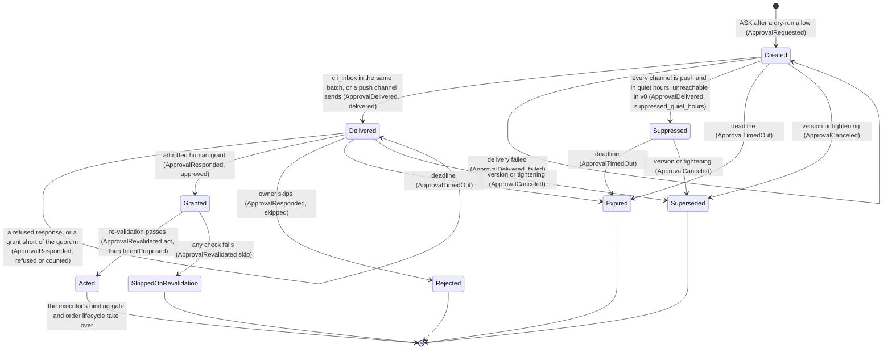

# Task: M7 escalation v0 — approvals, deadlines, the safe default, drift re-validation, and CLI owner control

Agent task brief ([ADR-0001](../../adr/0001-engineering-setup.md) ES-15), **stream M7**, claim
[#213](https://github.com/kunwarshivam/mandate/issues/213). This is DEC-77 stage 1: a brief, docs
only. It covers E8-1, E8-2, and E8-3, plus M7's CLI owner control
([milestones](../02-milestones-and-wbs.md): "Approval requests, deadlines, safe defaults, drift
re-validation; email and one chat channel; CLI control").

Today the runtime already **creates** an ASK, binds it, times it out, and cancels it, but it
**records a grant and does nothing with it** (DEC-131 item 25(a)): `PendingApproval` carries no
order body, so nothing can rebuild the order a grant would place. M7 v0 closes that gap and nothing
else. It adds four things: the content a grant binds, the checks a grant must pass again before it
becomes an intent, a way for the owner to answer that the journal records first, and the CLI the
founder uses for approvals and for the controls the runtime already accepts.

Code citations are read on `main` at `41031ed` (#211). Re-read the cited files before each round:
a claim about a safety-critical crate is only as good as the head it was read from (E7-7's stop
conditions).

## Story

- **Stories** ([backlog E8](../06-backlog-v1.md#e8-escalation-and-approvals)):
  - **E8-1 (Must):** "As an approver, I want requests with the proposed action, alternatives,
    evidence, risk impact, deadline, and default so that I can decide quickly." See Decisions
    needed 1 for how this brief reads "alternatives".
  - **E8-2 (Must):** "As an owner, I want timeouts to apply the safe default so that silence never
    adds risk."
  - **E8-3 (Must):** "As an owner, I want approved actions re-validated for drift so that stale
    approvals are not executed blindly."
  - **M7 CLI control:** the founder's owner controls from the terminal (DEC-148 item (2): "Phase 1
    (M5 to M7) has no owner-input API beyond the founder's CLI control (M7)").
- **Acceptance (this brief sets the bar for E8-1 to E8-3, which have none written):**
  - E8-1: every `ApprovalRequested` carries the full bound content listed in "Request content",
    whose canonical hash the owner's response must repeat; the CLI's `approvals show` renders only
    that content; nothing appears beyond mandate spec §6.4's list as the spec PR extends it (the risk
    impact, `reference_mark`, and the approver requirement, all facts about the owner's own order and
    mandate, never platform-authored opinion).
  - E8-2: property: across random sequences of requests, ticks, responses, restarts, mode changes,
    and version changes, no approval that did not receive a timely admitted grant is followed by an
    `IntentProposed` (EI-2). Every approval ends in exactly one terminal event (EI-6).
  - E8-3: property: a grant is acted on only if, at the moment it is processed, the version, the
    mode, the reclassification, the gate dry run, and the price drift all pass (EI-5); the intent
    equals the bound content field for field (EI-4); every skip is journaled with its reason.
  - CLI: every owner command reaches the runtime only as a committed control-stream event, the
    pause and skip need no step-up, the kill switch's step-up is the local `CliConfirm` and is
    judged at the moment the owner committed it (DEC-158, option (c), accepted by the founder), and the
    property tests of "Test plan" pass.
- **PRD / HLD / spec anchors:** [PRD](../../product/04-prd-v1.md) §6.6 FR-6.1 (triggers are the
  autonomy rules; gate denials are never asked), FR-6.2 (content; never platform-authored
  alternatives or profit estimates), FR-6.4 (opaque ID and generic text only), FR-6.5 (binding,
  gate re-runs, skip on deny), FR-6.6 (safe default on timeout), FR-6.7 (two approvers, P1),
  FR-6.8 (the agent keeps managing other positions); FR-8.2 (pause, resume, stop, kill switch).
  [HLD](../../HLD.md) §5 "Durability" (durable timers), §6.C (escalation: the flow this story
  implements for a single owner and a terminal), §6.D (crash recovery).
  [Mandate spec](../../specs/mandate.md#64-approvals) §2.2 (a version cancels pending approvals),
  [§5.9](../../specs/mandate.md#59-restrictions-and-the-effective-mode) (exits-only or stricter
  cancels them), [§6.2](../../specs/mandate.md#62-evaluation) (dry run first; ASK only for
  `open` and `increase`), §6.3 (the fields rules see), §6.4 (content, binding, step-up, two
  approvers, `skip` on timeout, quiet hours). [Journal spec](../../specs/journal.md) §2 (one writer
  per stream; cross-stream facts copied by the owner), §3 (the envelope's `actor`), §5.1 (append
  and idempotency), §5.2 (write before acting), §9 (the five approval events).
  [Trading domain spec](../../specs/trading-domain.md#96-market-conduct-controls-dec-31) §9.6 (the
  price collar, whose `x` is the drift band's source), §5.5 (the kill switch),
  [§11](../../specs/trading-domain.md#11-reconciliation) (the reconciliation hold).
  [Product experience](../../product/09-product-experience.md) D5, D6, P1 to P4, P8, P10, PX-4,
  PX-6, PX-7, PX-10, PX-11 (accepted as DEC-135).
- **Decisions that apply:** DEC-05 (reducing risk never needs approval), DEC-06 (timeouts resolve to
  a safe default), DEC-07 (journal before acting), DEC-11 (opaque notifications), DEC-16 (durable
  timers are journal-backed, behind `TimerSource`), DEC-17 (journal tailing between processes),
  DEC-19 (v1 channels), DEC-42 (timeout always skips), DEC-77 (the brief / tests / implementation /
  status sequence), DEC-79 (what agents decide; what stays with the founder), DEC-97 (the platform
  originates ideas, so a thesis is labeled platform-authored), DEC-126 (no scorecard on an
  approval), DEC-131 items 11, 14, 22, 23, and 25(a) to 25(c) (the runtime's approval behavior and
  the gap M7 closes), DEC-135 (PX-4: no step-up to pause, step-up to resume and Stop; PX-7: step-up
  per approval; PX-10: Approve and Skip with equal weight), DEC-136 (the owner Stop's flat-or-release
  precondition), DEC-141 and DEC-148 (an owner-connected agent never approves its own proposal;
  M7's CLI is the only owner input in Phase 1).
- **Non-negotiables this story is mostly about:** rule 2 (reducing risk never needs approval;
  increasing it beyond limits always does), rule 3 (timeouts and ambiguity resolve to a safe
  default that never adds risk — the story's centre), rule 4 (a grant approves a deterministic
  order the builder sized; nothing an LLM wrote becomes an order), rule 5 (every step journaled
  before its effect), rule 6 (notifications carry opaque IDs and generic text only), rule 13
  (nothing in the approval path can hold, deny, or delay an exit, a protective order, or a kill
  switch).

## Scope

### What M7 v0 is

One owner (the founder), one workspace, paper only (rule 8, DEC-103), a terminal instead of a
phone. The runtime asks; the request is committed to the agent stream with everything it binds; a
notification carrying only an opaque ID goes out; the owner reads the request with
`mandate approvals show`, answers with `approve` or `skip`, and the CLI commits that answer to the
workspace control stream; the runtime tails the control stream, admits or refuses the answer,
re-validates a grant against the current state, and only then journals `IntentProposed` and hands
the intent to the executor, whose binding gate runs once more. Silence, lateness, a crash, a
version change, a tightening, or any failed check ends in `skip`.

### Stream boundaries

| This stream owns | This stream does not touch |
|---|---|
| New `mandate-approval` crate (pure core of the approval flow) | `mandate-risk`, `mandate-builder`, `mandate-executor`, `mandate-spec`: M7 calls them through the runtime's existing ports and changes none of them |
| The runtime's approval code: `PendingApproval`, `asked`, `responded`, `expire`, `cancel_approvals`, and the new grant path in `crates/mandate-runtime/src/` | The runtime's kill-switch, mode, recovery, and fold rules other than the approval rows (stream I); any change there is asked for, not made |
| The CLI's `approvals` and `agent` commands in `crates/mandate-cli/` | The CLI's `download`, `inspect`, `journal`, and `artifact` commands |
| The notifier driver and the control-stream tailing in `mandate-shell`, **by agreement with stream L**, which owns that crate (Decisions needed 5) | The tracer's stages and fail-closed suite |
| The proposed MC-E reference cases (spec PR) and their `status.toml` rows (status PR) | Every other case family |
| Its own rows in the decision log, backlog, tracker, feature map, `xtask/layers.toml`, and `CODEOWNERS` | Other streams' rows |

### What exists today (read on `41031ed`)

| Where | What it does | What M7 changes |
|---|---|---|
| `mandate-runtime/src/step.rs` `allowed`, `asked` | ASK journals `ApprovalRequested` (instrument, qty, limit, purpose, version, deadline, `on_timeout: skip`) and arms `TimerId::ApprovalDeadline` | Adds the bound content of "Request content", the content hash, and a `Notify` effect after the draft |
| `step.rs` `APPROVAL_WINDOW_S = 300` | A crate constant until `MandateView` carries `autonomy.approval.timeout_s` (DEC-131 25(c)) | Reads the mandate's `timeout_s` once stream F widens `MandateView` (dependency) |
| `step.rs` `expire` | At a tick with `deadline <= now`, journals `ApprovalTimedOut` and cancels the timer | Unchanged in substance. The deadline stays folded state (DEC-16), so a lost timer costs a late record, never an act |
| `step.rs` `cancel_approvals` | Exits-only or stricter, any `MandateVersionApplied`, owner pause and stop, and the kill switch cancel every pending approval | Unchanged in behavior, and EI-7 re-asserts it; its `rebound` reason splits into `version_applied` and `mode_tightened` so the D5 inbox can say why |
| `step.rs` `responded` | Journals `ApprovalResponded` with `result: recorded` if the fold knows the approval, else `refused`, and **acts on nothing** | Replaced by admission (EI-10, EI-11, EI-14, EI-15), then re-validation, then the intent |
| `state.rs` `PendingApproval` | Instrument, version, deadline, `adds_risk` | Carries the whole `BoundAction` |
| `state.rs` fold of `ApprovalResponded` | Removes the approval from the pending set whatever the response said | Only an admitted skip, or an admitted grant followed by its `ApprovalRevalidated`, ends it; a `refused` response and a `counted` grant short of the quorum leave it pending (EI-6) |
| `ports.rs` `OrderPlan::classify` | Returns `Autonomy` (`Auto`, `Ask`, `Deny`) only | Widened in the tests PR to return the `DecidedBy` label too, which the request records and check 10 compares; the adapter over `mandate-builder` already has it |
| `types.rs` `Proposal` | Instrument, side, qty, limit, purpose, combined score | Gains `asset_class`, which the drift band needs; the builder adapter supplies it |
| `state.rs` `awaiting_risk_approval` | While any risk-adding approval is pending, no new risk-adding proposal is made; exits continue | Kept: one pending risk-adding approval per agent is also the first anti-fatigue bound (EI-13) |
| `types.rs` `Input::ApprovalResponse(ApprovalOutcome)` | The response as an in-process input, with a shell-supplied `at` | Retired in the tests PR: a response arrives as `Input::Journal` of a control-stream event, whose `event_id` is the idempotency key and whose `actor` is checked (DEC-155 item 2) |
| `types.rs` `NotificationRef { subject_event, message_key }` | Opaque ID and a message key only | Becomes `mandate-approval`'s closed `Notification` type (EI-9) |
| `mandate-builder/src/autonomy.rs` `DecidedBy::label` | Four variants: `builtin_risk_reducing`, `rule:<id>`, `default`, `admission_ceiling` | Read, not changed: the label is what the request records and what re-classification compares. `builtin_risk_reducing` never labels an ASK (only `open` and `increase` are asked), so it cannot appear at check 10 either |
| `step.rs` `responded`, `ApprovalVerdict::Denied` | Writes `verdict: denied` and `result: recorded` or `refused` | The vocabulary becomes `verdict: skipped` and `result: admitted`, `counted`, or `refused` (see "Journal events"). Replay reads a legacy `denied` as `skipped`, and a legacy `recorded` or `refused` as terminal, which is what they meant when written, so an old journal folds to the outcomes it had (EI-12) |
| DEC-131 item 25(j), the unfixed residue | A response that arrives in the same step as the tightening that cancels its approval is recorded as `recorded`, because it is read against the state before the batch applies. Harmless today, because nothing is handed | **Under M7 it would be an order after the stop** (DEC-131 item 11). Closed two ways: the response now arrives as its own `Input::Journal` of a control-stream event, so it is never the same input as a tightening or a kill switch; and admission reads the pending set **minus the batch's own cancellations** (`batch.resolved`) and the mode **this step applies**, so even inside one batch a cancelled approval is `not_pending`. EI-7 and EI-8 assert it; MC-E31 is its case |

### Invariants touched

Written before the rules (AGENTS.md, "Invariants first"). After every change to this brief or the
code, re-check all of them, not only the one a finding named.

| # | Invariant |
|---|---|
| EI-1 | No `IntentProposed` of purpose `open` or `increase` follows an `ApprovalRequested` unless an admitted, timely human grant for that approval exists and the re-validation that follows it returned `act` |
| EI-2 | **Silence never acts.** An approval with no admitted grant before its deadline produces no intent in any input order, any restart pattern, and any timer loss or duplication |
| EI-3 | **At most one act per approval.** Whatever is replayed, re-tailed, re-submitted, or restarted, one approval id causes at most one `IntentProposed` |
| EI-4 | **A grant never widens.** The intent a grant produces equals the bound content field for field: instrument, side, quantity, limit price, purpose, and mandate version. There is no re-pricing and no re-sizing |
| EI-5 | **Re-validation only skips.** A grant acts only in states where the version equals the bound version, the effective mode is `normal`, the instrument is unrestricted and in the working universe, the re-classification is not `deny` and not an `ask` by a different trigger, the gate dry run allows the bound order, and the price drift is inside the band |
| EI-6 | **Terminal is terminal.** Every approval ends in exactly one of an admitted skip (`ApprovalResponded`, `verdict: skipped`, `result: admitted`), `ApprovalTimedOut`, `ApprovalCanceled`, or `ApprovalRevalidated` (`act` or `skip`); a `refused` response and a `counted` grant are not terminal; nothing after the terminal event changes the outcome |
| EI-7 | No approval outlives the mode or the version that permitted it: after exits-only or stricter, or any `MandateVersionApplied`, no approval is pending (DEC-131 items 23 and 25(b)), and a response processed in the same step or batch as the cancelling tightening, version, or kill switch is never admitted (closing DEC-131 item 25(j)) |
| EI-8 | **Risk reduction is never behind an approval.** No exit, protective order, owner exit, risk exit, flatten, or kill switch waits on, is ordered after, or is cancelled by any approval state; no grant is acted on after a kill switch in any input order; pause needs no step-up (PX-4); and a kill switch is applied however late it is processed, with or without valid step-up evidence: without it, it still stops the agent and flattens as an automated flatten does (waiting for the regular session for equities, MC-F04) (rules 2 and 13; DEC-158 option (c)) |
| EI-9 | Every notification payload is an opaque approval ID plus one text from a closed set; it holds no instrument, side, quantity, price, order value, score, thesis, agent name, rule name, or deadline (rule 6, PX-6, PX-7) |
| EI-10 | **Only a human approves.** A response is admitted only from a control-stream event whose `actor.kind` is `user`, whose responder is in the mandate's `autonomy.approval.approvers`, and, once M8's connected clients can propose (E10-6), which does not come from a connected client at all. The runtime never constructs a grant, and no agent, system, broker, platform-operator, or connected-client identity can (DEC-141 item (2), DEC-148). **Pinned for E10-6:** a connected client's control-stream events must carry an actor that is not `user` (a `client` kind added to journal §3 by E10-6's spec change) or a `client_id` that admission refuses; either keeps this check sufficient |
| EI-11 | Every admitted grant, resume, Stop, acknowledgment, and owner exit, and every kill-switch privilege beyond the stop, carries step-up evidence; for a grant, resume, Stop, and acknowledgment it was authenticated within the 300 s before the moment the runtime processes it, and for an owner exit and a kill-switch privilege within the 300 s before the moment the owner committed it; a kill switch without valid evidence is never refused, and applies as the stop and flatten of DEC-158 option (c); an assertion id is used once per workspace; evidence of method `cli_confirm` is refused for a `live` environment by type |
| EI-12 | Replay: the same journal gives the same approval outcomes, and folding the control stream twice acts once |
| EI-13 | **Asking is bounded.** At most one pending risk-adding approval per agent; at most `ASK_BUDGET_PER_RISK_DAY` requests per agent per risk day; after a skip by the owner, the same instrument is not asked again until the next risk day or the next applied version; after a timeout, not within the next `timeout_s` |
| EI-14 | **What the owner saw is what is bound.** A response is admitted only if it repeats the canonical content hash of the request it answers |
| EI-15 | **Time only moves forward.** A response's effective time is the later of its submitted time and the runtime's folded risk clock; a deadline never moves; a response at or after its deadline is refused |
| EI-16 | A request is grantable only once delivered on at least one channel: a response to an approval with no `ApprovalDelivered` of status `delivered` is refused. Quiet hours suppress **push** channels only; `cli_inbox` is a pull channel, delivered in the same batch as the request and never suppressed, so in v0 every request is grantable from creation (DEC-156 item 6) |

### Oracles

Each property test computes its expectation its own way and is shown to fail on a seeded bug before
it is trusted (AGENTS.md, "Independent oracles"; "Planted bugs" below).

| Oracle | What it computes, independently of the code under test | Holds |
|---|---|---|
| **Transition table** | A table in the test, written from this brief's lifecycle diagram, of the allowed `(state, event) → state` moves; it replays the committed drafts parsed from bytes with `mandate_journal::Draft::parse` and fails on any move not in the table, and on any approval with zero or two terminal events | EI-6, EI-7 |
| **Causation walker** | From each committed `IntentProposed`, follows `causation_id` back through `ApprovalRevalidated` and `ApprovalResponded` to the `ApprovalRequested`, and counts intents per approval id | EI-1, EI-3 |
| **Field comparer** | Compares the `IntentProposed` payload with the `ApprovalRequested`'s bound content key by key from the parsed bytes, never from in-memory state | EI-4, EI-14 |
| **Separate clock accumulator** | Keeps its own maximum of every tick and response time it generated, and its own deadline per request from the generated `timeout_s`; decides "timely" from those alone | EI-2, EI-15 |
| **Scaled-integer drift** | Computes `|m_now − m_req| × 10 000 ≤ band_bp × m_req` on integers scaled by the test itself, not through `mandate-num` | EI-5 (drift) |
| **Sentinel scanner** | Generates instruments, quantities, prices, thesis text, agent names, and rule ids from distinctive sentinels, serializes every `Notification` the run produced, and fails on any sentinel substring | EI-9 |
| **Principal generator** | Generates responses from every `actor.kind` and from responders inside and outside `approvers`, and asserts admission only for the `user`-and-listed cell | EI-10 |
| **Assertion ledger** | Its own set of assertion ids seen, and its own `authenticated_at` window check | EI-11 |
| **Risk-reduction probe** | After every generated input, injects an exit, a protective re-placement, and a kill switch, and asserts each is handed in the same step whatever the approval state; the injected kill switch is drawn with fresh, stale, malformed, and missing step-up evidence, and every one must stop the agent and flatten as an automated flatten does (equities waiting for the regular session), while an owner-exit privilege without valid evidence is refused | EI-8, EI-11 |
| **Budget counter** | Counts `ApprovalRequested` per agent per America/New_York risk day with its own day boundary from `mandate-time`'s calendar fixtures, and the suppression windows from its own table | EI-13 |
| **MC-A expectations** | The mandate reference cases MC-A01 to MC-A16, used as the table of expected classifications for re-classification | EI-5 (re-classification) |

### Crates and layering

| Crate | Layer | Change |
|---|---|---|
| **`mandate-approval` (new)** | **1**, `safety_critical = true`, `pure = true`, `allowed_external = ["thiserror"]` | The pure approval core: request content and its canonical hash, response admission, step-up evidence checks, re-validation as a function of values, drift arithmetic, the ask budget and suppression fold, the closed `Notification` type, and quiet-hours delivery. Depends on `mandate-num`, `mandate-time`, and `mandate-canon` only (layer 0) |
| `mandate-runtime` | 6 | Carries `BoundAction` in `PendingApproval`; follows the workspace control stream for the events addressed to its agent; admits, re-validates, and acts through `mandate-approval`; journals the new and extended events. Gains `mandate-approval` as a dependency; stays pure |
| `mandate-cli` | 7 | `approvals list/show/approve/skip` and `agent status/pause/resume/stop/kill/exit/acknowledge`. Gains `mandate-approval` and `mandate-journal-pg` (both lower layers). Stays `safety_critical = false`: it is an **untrusted surface** by design, and every check that decides an outcome runs again in the runtime (DEC-155 item 5) |
| `mandate-shell` | 8 (stream L) | Tails the control stream into the runtime; drives `Effect::Notify` through the `Notifier` port and feeds the delivery result back as an input |
| `mandate-journal`, `mandate-journal-pg` | 2, 6 | Unchanged. The new event types are journal-spec catalogue entries (spec PR). No event schema is exported yet: `schemas/events/` does not exist, and its export is E5-1's own protected-path PR, which will pick these events up like every other |

Layer 1 is the lowest that works: the runtime (6) and the CLI (7) both need it, and it needs only
layer 0. Putting it at layer 5 beside `mandate-builder` would let it reach `mandate-spec` and
`mandate-risk`, which it must not: the approval core decides nothing about limits, and every limit
comparison stays in the gate. That boundary is rung 1 of the trust ladder, not a rule in this
brief. **No new external dependency**; `docs/dependencies.md` is unchanged.

Files, by PR:

| PR | Files |
|---|---|
| Spec | `docs/specs/mandate.md` §6.4 and §11, `docs/specs/journal.md` §9, `docs/specs/reference-cases/mandate.yaml` (MC-E), `reference/mandate/ref.py`, `generate.py`, `check_cases.py`, `fuzz.py`, `mutants.py`, and the regenerated `fixtures/refcases/` (`cargo xtask refcases --write`, never by hand) |
| Tests | `crates/mandate-approval/` (`Cargo.toml`, `src/lib.rs` with the safety-critical lint header, `src/{content,admit,revalidate,drift,budget,notify,quiet,stepup}.rs` as stubs, `tests/{hand,properties,refcases}.rs`), `crates/mandate-runtime/{src/types.rs,src/ports.rs,tests/hand.rs,tests/properties.rs,tests/golden-journal.json}`, `crates/mandate-cli/tests/`, `crates/mandate-refcases/` (the MC-E interpretation), the workspace `Cargo.toml`, `xtask/layers.toml`, `CODEOWNERS`, `.cursor/skills/verify-mandate/feature-map.md` |
| Implementation | `crates/mandate-approval/src/`, `crates/mandate-runtime/src/{state,step,payload}.rs`, `crates/mandate-cli/src/{lib,main,approvals,agent}.rs`, and the shell's control-stream tail and notifier driver in `crates/mandate-shell/src/` (with stream L) |
| Status | `crates/mandate-refcases/status.toml` (the MC-E rows) |

## The approval lifecycle



`Granted` is not a resting state: admission and re-validation happen in the **same step**, and
their drafts commit in one batch (`ApprovalResponded`, `ApprovalRevalidated`, and, on `act`,
`IntentProposed`). A crash between them is impossible because the batch is all-or-nothing (journal
§5.1); a crash before the batch commits leaves the control-stream response to be re-tailed, and it
is then judged at the later clock (EI-15), usually as late. A crash after the commit but before the
handoff leaves an outstanding intent, which `Input::Started` re-hands or drops by the folded mode
exactly as for any other opening (DEC-131 item 22); the approval is already terminal, so nothing
asks or acts twice (EI-3).

| State | Entered by | What it blocks | How it ends | Who can end it |
|---|---|---|---|---|
| **Created** | The runtime, at an evaluation where the dry run allowed an `open` or `increase` and the classification is `ask` and the ask is not suppressed (EI-13) | New risk-adding proposals for this agent (`awaiting_risk_approval`). Never an exit, protection, or a kill switch (EI-8) | In v0, delivery to `cli_inbox` in the same batch, so Created is never observed between steps; with push channels, delivery or suppression; deadline; cancellation | The notifier (moves it on); the deadline; the runtime's mode or version change |
| **Delivered** (notified) | `ApprovalDelivered { status: delivered }`. A `failed` delivery leaves it Created, so it is not grantable and times out | As Created | An admitted response; the deadline; a cancellation. A refused response (wrong hash, stale step-up) leaves it Delivered, so the owner can answer again before the deadline | The approver (grant or skip); the deadline; the runtime |
| **Suppressed** | `ApprovalDelivered { status: suppressed_quiet_hours }` for every channel. **Unreachable in v0**, because `cli_inbox` is always delivered; it exists for E8-4's push-only configurations | As Created. Not grantable (EI-16) | The deadline (skip); a cancellation | The deadline; the runtime. **Not** the approver |
| **Granted** | An admitted human grant (EI-10, EI-11, EI-14, EI-15) | — (transient) | Re-validation, in the same step | The runtime alone, deterministically |
| **Acted** | `ApprovalRevalidated { result: act }` then `IntentProposed` with `causation_id` = the revalidation | — | Terminal for the approval; the order continues under the executor | The executor's binding gate may still deny (`GateDecided`); the D5 inbox shows "approved and skipped by the gate" |
| **Rejected** | `ApprovalResponded { verdict: skipped }` from an admitted human skip (no step-up needed) | Re-asking this instrument until the next risk day or version (EI-13) | Terminal | — |
| **Expired** | `ApprovalTimedOut { on_timeout: skip }` at the first tick at or after the deadline | Re-asking this instrument for one `timeout_s` (EI-13) | Terminal | — |
| **Superseded** | `ApprovalCanceled { reason }`: `version_applied`, `mode_tightened` (exits-only or stricter, whatever caused it), `owner_pause`, `owner_stop`, `kill_switch` | — | Terminal. Anything still wanted is re-proposed at a later evaluation under the new state | The runtime |
| **SkippedOnRevalidation** | `ApprovalRevalidated { result: skip, reason }` | — | Terminal; re-proposal allowed at the next evaluation, counted against the budget | — |

### At the time boundaries

"Walk every state to its exit" (AGENTS.md): what happens to a pending approval at each boundary.

| Boundary | Created / Delivered / Suppressed | A grant processed after the boundary |
|---|---|---|
| **Regular-session close (equities)** | Stays pending until its deadline; no new equity ASK is created in the close window, because the dry run denies openings there (trading §9.6, `close_window`) and an ASK needs a dry-run allow | Re-validation's dry run denies the opening in the close window and outside the regular session (trading §5.1, §9.4), so it is skipped with the gate's reason. Crypto has no session close |
| **Midnight America/New_York (risk day)** | Stays pending. `RiskDayStarted` resets the ask budget and the skip suppression | Re-classification runs on the new day's inputs: a `bought_today_usd` rule that asked may now say `auto` (the grant still covers it), a limit that latched makes the mode stricter and has already cancelled the approval, and a `deny` skips |
| **Restart** | Survives the fold with its deadline, which `Input::Started` re-arms. If the startup hold is taken (trading §11, DEC-131 item 13), the first step after `Started` sees `paused` and cancels every pending approval (DEC-131 item 23) | A control-stream response committed before the crash is re-tailed and judged at `max(submitted_at, folded clock)`; past the deadline it is refused as late. A cancelled approval's response is refused as not pending |
| **Mandate version change** | Any `MandateVersionApplied` cancels it (DEC-131 25(b)), including a risk-reducing one, which mandate §2.2 also re-proposes | A response bound to the old version is refused as not pending; it never re-binds to the new version |
| **Owner pause, Stop, kill switch; any exits-only or stricter restriction** | Cancelled in the same step, before the switch's own effects are ordered after it (DEC-131 item 11) | Refused as not pending |
| **Deadline** | `ApprovalTimedOut` at the first tick at or after it; a response processed at or after it is refused even if that tick has not come yet (EI-15) | Refused as late |
| **Quiet hours start or end** | No effect in v0: `cli_inbox` is a pull channel and quiet hours govern push delivery only (DEC-156 item 6), so a crypto agent's overnight request is listed and grantable. With E8-4's push channels, a push inside quiet hours is suppressed while the inbox still lists the request | Unaffected once delivered |

## The safe default on timeout

`on_timeout` is `skip` and has no other value: the schema makes it a constant, `mandate-spec` makes
it a unit type, and `mandate-builder`'s `ApprovalRequest.on_timeout` has one variant. M7 adds
nothing that could act on a timeout; it removes the one gap left, which is that `responded` today
compares a response only with the fold's pending set, not with the deadline. Under M7:

1. The deadline is **folded state** in the committed `ApprovalRequested`, not a timer. The timer
   only says when to look (DEC-16, `ports.rs` `TimerSource`), so a lost timer delays the
   `ApprovalTimedOut` record and never produces an act, and a duplicated timer is inert because
   `expire` skips what is no longer pending.
2. A response is **late** if its effective time, the later of the CLI's `submitted_at` and the
   runtime's folded risk clock, is at or after the deadline. Late responses are recorded as
   refused and act on nothing, even when the tick that would expire the approval has not arrived.
3. A response the owner committed in time but that the runtime processes late (the runtime was
   down, the tail lagged) is **late**. That can lose an approval the owner meant, which is the safe
   direction, and it prevents a delayed grant acting on a market that has moved (the stale-price
   adversary).
4. Timeout, lateness, refusal, cancellation, and every failed re-validation all end the same way:
   nothing is sent, and the event says why.

## Acting on a grant (E8-3)

A grant goes through these checks **in this order**, in one step, and the first failure refuses or
skips with its reason code. Each is a check the order already passed once when it was asked; running them again
on the current state is what "re-validated for drift" means. None can make an order larger or more
aggressive than bound (EI-4).

| # | Check | Reason code on failure | Source of the rule |
|---|---|---|---|
| 1 | The approval is pending in the fold | `not_pending` | DEC-131 item 11 |
| 2 | Effective time is before the deadline | `late` | Mandate §6.4, EI-15 |
| 3 | The response's actor is a human user (`actor.kind = user`) in `approvers`; and, once M8's connected clients can propose (E10-6), not the client that proposed it | `not_an_approver` | Mandate §6.4, DEC-141 (2), EI-10 |
| 4 | The approval was delivered on at least one channel (always true in v0, `cli_inbox`) | `not_delivered` | Mandate §6.4 quiet hours, EI-16 |
| 5 | The response repeats the request's content hash | `content_mismatch` | EI-14 |
| 6 | Step-up evidence is present, fresh (≤ 300 s before the effective time), unused, and of a method the environment allows | `step_up_missing`, `step_up_stale`, `step_up_reused`, `step_up_method` | Mandate §6.4, PX-7, EI-11 |
| 7 | Quorum: the responder is not already in the approval's grant set and, with `independent_approval_required`, is not the mandate's author; the responder joins the grant set; if it now holds `approvers_required` distinct approvers the grant is `admitted`, else `counted` and the approval stays pending | `duplicate_approver`, `not_independent` (`counted` is not a failure) | Mandate §6.4 two approvers, E8-6 |
| 8 | The mandate version equals the bound version | `version_changed` | Mandate §6.4 binding |
| 9 | The effective mode is `normal` and the instrument is unrestricted and in the working universe | `mode`, `instrument_restricted` | Mandate §5.9, §2.3 |
| 10 | Re-classification of the bound order in the current view is not `deny`, and is not an `ask` decided by a different trigger | `reclassified_deny`, `reclassified_other_trigger` | Mandate §6.4 "`deny` is never overridden" |
| 11 | The gate dry run allows the bound order | the gate's reason code | FR-6.5, mandate §6.2 |
| 12 | Price drift since the request is inside the band | `drift` | E8-3, DEC-156 item 3 |

A skip goes through checks 1 to 5 only: it needs no step-up (PX-7), one skip from any listed
approver ends the approval whatever the quorum, and a refused skip changes nothing, because the
approval then times out, which is also a skip.

**One result vocabulary, two events.** Checks 1 to 7 are **admission**, journaled on
`ApprovalResponded` with `result` ∈ `admitted` (quorum reached; re-validation follows in the same
batch), `counted` (a valid grant short of the quorum; not terminal), or `refused` (with the check's
reason code; not terminal). Checks 8 to 12 are **re-validation**, journaled on `ApprovalRevalidated`
with `result` ∈ `act` or `skip` (with the reason code and every value compared). `mandate-approval`'s
`Admission` and `Revalidation` enums have exactly these variants, so every outcome maps to one
journaled value and the transition-table oracle can be written from this table alone.

The folded `PendingApproval` carries `grants: BTreeSet<OpaqueUser>`, the approvers whose grants were
`counted` or `admitted`, rebuilt from those `ApprovalResponded` events on replay; check 7 counts it,
and PB-18 plants the bug of counting one approver twice.

**What checks 10 and 11 re-measure.** The bound order's own fields (instrument, side, quantity,
limit, purpose) and its **bound** combined score, against the **current** §6.3 risk fields
(`drawdown`, `daily_pnl_fraction`, `position_usd_after`, `gross_usd_after`, `bought_today_usd`,
`position_pnl_fraction`, `session`, `new_instrument`, `first_trade_in_instrument`) and the current
view. The score is bound because it is what the owner approved; the risk fields are current because
they are what could have made the order unsafe since. On `act`, `IntentProposed` follows in the same batch with the
bound fields and is handed to the sink, after which the executor's **binding** gate decides on the
account stream; M7 does not bypass it and does not treat the dry run as authority (rules 1 and 12).

Check 10 compares the `DecidedBy` label (`rule:<id>`, `default`, `admission_ceiling`) recorded at the
request with the label now (`builtin_risk_reducing` cannot occur for an `open` or `increase`). The same trigger means the owner answered the question now being asked;
`auto` means no question is needed; a different `ask` trigger is a different question the owner has
not seen, so it skips and is re-proposed with its own content.

### Drift

The runtime folds the last `MarkUpdated` per instrument from the account stream (today it folds
`MarkUpdated` as inert). The request records that mark and its account-stream `seq` as
`reference_mark`. At re-validation the latest folded mark `m_now` is compared with `m_req`:

    |m_now − m_req| × 10 000 ≤ band_bp × m_req        (exact decimals, no division, no floats)

`band_bp` is **100 for `us_equity` and 200 for `crypto`**: the smallest aggressiveness `x` the
collar uses for each asset class (trading §9.6 gives 1% or 2% for equities by liquidity and 2% for
crypto, so the band is never looser than the gate's own bound for any instrument). Units are basis
points here and a percentage in the trading spec; the spec PR states both, and the test fixes the
conversion (AGENTS.md, "Trace every reference": units).

Drift is symmetric on purpose. A price that moved **against** a buy (up) leaves the bound limit
passive, which the gate's 20% passive band would allow; a price that moved **for** it (down) makes
the bound limit aggressive, which the collar might still allow within `x`. Either way the owner
approved one market and the order would work in another, which is what E8-3 calls stale. No mark at
the request or none now skips as `drift` (fail closed). A bad tick can only cause a skip: the act
still needs the binding gate on sane quotes (trading §8.2). There is no re-pricing in v1 (mandate
§6.4); anything still wanted is re-proposed at the next evaluation at its own price.

## Request content (E8-1)

Mandate spec §6.4's list, **extended by the spec PR** with three rows that are facts, not opinion
(risk impact, `reference_mark`, and the approver requirement), as a canonical object inside `ApprovalRequested` whose SHA-256
(journal §4, through `mandate-canon`) is the **content hash**. The CLI renders from this object and
nothing else, so what the owner saw is what is recorded (P8).

| Field | Content | Read of E8-1 |
|---|---|---|
| Proposed action | instrument, side (`buy`; an ASK is only ever `open` or `increase`), quantity, limit price, order value (limit × quantity), purpose | "proposed action" |
| Trigger | the mandate version, and the `DecidedBy` label of the rule that asked, with the rule as the owner wrote it | "the mandate rule that triggered it" (FR-6.2) |
| Evidence | the combined score labeled "combined model score, not a probability of profit"; references (event ids and artifact hashes) to each `ModelOutputRecorded` used, each labeled by author: "Output of software you selected" or platform-authored; for an admission, the thesis in the §8.2 and §8.4 shape by reference | "evidence" |
| Risk impact | the §6.3 fields at the request: `order_usd`, `position_usd_after`, `gross_usd_after`, `bought_today_usd`, `drawdown`, `daily_pnl_fraction`; the mandate's own caps they are measured against; `reference_mark` | "risk impact": facts about this order against the owner's own limits, never an estimate |
| Deadline and default | the deadline as a UTC timestamp, and "If you do nothing, this action is skipped" | "deadline, and default" |
| Choices | Approve or Skip, with equal weight and neither preselected (PX-10) | "alternatives" (Decisions needed 1) |
| Approvers | `approvers_required`, and the independence requirement | — |

**Never** in the content: a profit estimate, a price target, a scorecard (DEC-126, compliance
question 35), a platform-authored alternative trade, "recommended", or any persuasive wording. The
spec PR adds no new user-facing sentence: the only fixed strings are the two §6.4 already gives
(Decisions needed 2).

Large texts (a thesis, a model's output) stay artifacts referenced by hash, so the request stays
small and self-contained in one committed event. The journal spec's "content shown (artifact)" for
the approval events becomes "content object inline, large parts by artifact reference" in the spec
PR.

## Notifications (rule 6)

```rust
/// The whole of what leaves the workspace deployment for an approval. There is no field for
/// anything else, which is how rule 6 is held at rung 1.
pub struct Notification {
    pub subject: ApprovalRef,   // the ApprovalRequested event id: an opaque ULID
    pub text: GenericText,      // a closed enum
}

pub enum GenericText {
    ApprovalNeeded,  // "An agent in your workspace needs your approval"
}
```

- `ApprovalRef` has no constructor from anything but an `ApprovalRequested` event id, and no
  `Display` besides the id. No agent label in v0 (PX-6's owner option (c) comes with E8-4).
- The runtime emits `Effect::Notify` **after** the `ApprovalRequested` draft in the same effect
  list, so a notification never points at an uncommitted request (rule 5).
- The shell's `Notifier` port delivers and returns `Delivered { approval, channel, status,
  message_id }`, which the runtime journals as `ApprovalDelivered`. v0 has one channel,
  **`cli_inbox`**: the request appears in `mandate approvals list`, which reads the owner's own
  journal inside the workspace. Email and a chat channel are E8-4 with E8-5's captured-payload
  acceptance, a separate brief, because choosing a provider is spending (DEC-79; Decisions
  needed 3).
- Quiet hours govern **push** channels only (DEC-156 item 6). `cli_inbox` is a pull channel: the
  runtime journals its `ApprovalDelivered { channel: cli_inbox, status: delivered }` in the same
  batch as the `ApprovalRequested`, because the inbox *is* the journal, and `approvals list` and
  `show` list every pending request whatever the push delivery state. For push channels (E8-4),
  `mandate_approval::deliver_now(quiet_hours, at)` decides from `notifications.quiet_hours`
  (America/New_York, DST through `mandate-time`) whether a push is sent or suppressed; the pure
  function and its DST tests land here so E8-4 inherits them. Risk-limit alerts ignore quiet hours
  (§6.4) and are not this story's.
- Risk and mode alerts keep the runtime's existing `NotificationRef` path until E8-4 folds them into
  `GenericText`; this story adds only `ApprovalNeeded`.

## Step-up authentication

Phase 1 has no identity provider: E9-1 sign-in and E9-4 step-up are M8 (DEC-148 item (1)). The
mandate spec requires step-up for **live** approvals; Phase 1 is paper only (rule 8, DEC-103). M7 v0
therefore defines the evidence type and the checks the runtime makes, and ships one paper-only
method, recorded as DEC-155 item 4:

```rust
pub struct StepUp {
    pub assertion: AssertionId,        // unique per gesture; a second use is refused
    pub authenticated_at: RiskClock,   // at most 300 s before the effective time
    pub method: StepUpMethod,
}

pub enum StepUpMethod {
    /// The CLI's typed confirmation: the owner re-types the confirmation code `approvals show`
    /// printed for this request's content hash. Proves the owner read this content; does not
    /// authenticate against an identity provider. Accepted only when the stream's environment is
    /// `paper`: the check is a match on `(method, environment)` with no arm that admits `live`.
    CliConfirm,
}
```

- **Needs step-up:** approve (one assertion per approval, PX-7 (b), never one gesture for several),
  resume, the owner Stop, acknowledge (mandate §5.8, trading §11), owner exit, and the kill switch's **privileges beyond the stop**. Under DEC-158 option (c), accepted by
  the founder, a kill switch in any scope applies **with or without valid step-up**: without it, it
  still stops the agent and flattens as an automated flatten does (waiting for the regular session for equities, MC-F04); only the owner-exit privileges (selling equities outside the regular session at a
  confirmed bid, DEC-58 and DEC-66) need valid step-up. The requirement it relaxes is mandate spec §6.1's: its `owner_exit` row covers
  "The owner closes a position or triggers a kill switch" with "The owner's instruction (step-up)",
  and PX-4 (DEC-135) opens with "The spec requires step-up for an owner exit (so for the kill
  switch)". An earlier draft of this brief exempted it on rule 13 alone; that would weaken an
  authentication requirement, which DEC-79 reserves for the founder, so the trade-off went to the founder as
  **DEC-158**, answered with option (c).
- **Which reading of PX-4 the owner Stop gets:** PX-4 (b) as accepted, "Pause needs none; resume and
  Stop need step-up", with Stop read as DEC-136's owner Stop (terminal, flat or release), which PX-4
  says "gets the same check as the kill switch". Both need `CliConfirm`.
- **Never needs step-up:** skip (PX-7: "Skip needs no step-up") and pause (PX-4). Pause is the
  always-available brake: it needs nothing, cancels every pending approval, and stops every new
  risk-adding proposal (DEC-131 items 10 and 23).
- **How the kill switch keeps rule 13's "always available"** (option (c) makes the stop and flatten
  independent of step-up; these mitigations DEC-158 keeps alongside it cover the privileges that still need it):
  1. `CliConfirm` is **local and cannot fail except by a mistyped code**: the kill switch's code is
     derived on the owner's host from the scope typed and the control stream's head, with no network,
     no identity provider, no runtime, and no model state (rule 13: "does not depend on model state").
  2. Its freshness is judged at the moment the **owner committed** the command (`submitted_at`), not
     when a runtime processes it, so a runtime that was down or lagging still applies a kill switch
     committed with fresh evidence, however late it reads it. The same holds for an owner exit.
     Applying a stop late never adds risk.
  3. Pause remains the no-step-up path, from the same CLI, at every moment.
  4. The CLI accepts `--yes` for the scope-confirmation prompt, never for the code, so a script can
     still reach the kill switch with a code it computes locally.
- **Fail closed for anything that adds risk:** a grant, resume, Stop, or acknowledgment processed more
  than 300 s after its `authenticated_at` is refused and journaled; an owner exit or kill switch whose
  evidence was already stale when the owner committed it is refused.
- **An owner exit with stale evidence is refused as an owner exit, and nothing else is held.** An
  owner exit is a risk reduction, so this needs its reason: the refusal is of an *unauthenticated
  instruction*, not of an exit (rule 13 lists what may hold an exit, and an instruction that is not
  shown to be the owner's is not one yet). Outside the regular session it also protects the owner
  from a bid confirmed minutes ago pricing the exit ladder now (DEC-66). A fresh kill switch and a pause
  stay available as the owner's way out, and every automated exit, protective order, and risk exit
  runs untouched. The CLI says so in the refusal.
- What v0 does **not** defend against, stated rather than hidden: anyone who can already write the
  workspace's control stream (the journal DSN on the founder's machine) can forge a `CliConfirm`
  response. That is the same trust boundary as the journal itself in Phase 1. E9-4's signed
  assertions replace `CliConfirm` before any live approval, and the type makes `CliConfirm`
  unusable for one.

## The CLI control surface

Every command that changes anything commits exactly one control-stream event and exits; it never
talks to the runtime or the broker directly (rule 12). The runtime tails `ctl:{workspace}` and acts
on the events addressed to its agent; a `NOTIFY` is only a hint (DEC-17, E6-1's "the journal is the
channel"). If the runtime is down, the event waits in the journal and is judged when it is read
(pause and kill always apply; the rest go through their freshness checks).

| Command | Commits | Step-up | Notes |
|---|---|---|---|
| `mandate approvals list [--agent <id>]` | nothing | — | Pending by deadline, then resolved with outcome (D5): opaque ids, state, deadline, time remaining |
| `mandate approvals show <approval>` | nothing | — | Renders the request's content object (D6) and prints the confirmation code for its content hash |
| `mandate approvals approve <approval> --code <code>` | `ApprovalResponseSubmitted { verdict: approved, content_hash, step_up }` | `CliConfirm` | One approval per command; there is no `--all` and no batch form. What it prints is below |
| `mandate approvals skip <approval>` | `ApprovalResponseSubmitted { verdict: skipped }` | none | Equal weight with approve: the same argument shape, no extra prompt |
| `mandate agent status <agent>` | nothing | — | Effective mode, restrictions, pending approvals count, the startup hold |
| `mandate agent pause <agent>` | `OwnerCommandIssued { command: pause }` | none | PX-4 |
| `mandate agent resume <agent>` | `OwnerCommandIssued { command: resume }` | `CliConfirm` | Lifts only the owner's own pause; never a latched limit or a hold (MI-3) |
| `mandate agent stop <agent> [--release]` | `OwnerCommandIssued { command: stop }` | `CliConfirm` | DEC-136's flat-or-release precondition is the runtime's; the CLI shows the warning and records that it did |
| `mandate agent kill (<agent> \| --connection <c> \| --workspace) --code <code> [--yes]` | `OwnerCommandIssued { command: kill_switch, scope, step_up }` | `CliConfirm`, computed locally; without valid evidence it still stops and flattens (DEC-158 option (c)) | Always available: the code needs no network, runtime, or model; freshness is judged at commit, so a late read still applies; each runtime honours its own scope from folded state (E6-5); `--yes` skips the scope prompt, never the code |
| `mandate agent exit <agent> <instrument> [--confirm-bid <bid> --bid-size <n> --floor <p>]` | `OwnerCommandIssued { command: owner_exit, confirmation }` | `CliConfirm` | Outside the regular session the displayed bid, bid size, and floor must be confirmed (DEC-58, DEC-66); the runtime journals `OwnerExitRequested` |
| `mandate agent acknowledge <agent> <event>` | `OwnerAcknowledged` (already catalogued on the control stream) with the step-up evidence | `CliConfirm` | The executor copies it into the account stream (#205); the semantics of each acknowledgment stay with the stream that owns it, and M7 adds no event for it |

The CLI is the control stream's writer in Phase 1 (journal §2: "workspace control services"). It
takes a new writer epoch per invocation, so two concurrent invocations fence each other and one
fails with `Fenced` rather than interleaving; the CLI then retries with a fresh read. This is not a
deviation from DEC-131 item 18, which makes `Fenced` fatal for the runtime, a long-lived single
writer of its agent stream that a newer process has replaced: the CLI is a one-shot writer of a
different stream, and its retry takes a new epoch for a new command rather than continuing a
superseded process (DEC-155 item 5). The user id
is the opaque owner id from the CLI's workspace configuration; no personal data enters the event
(journal §6.4).

**What `approve` prints.** Before committing, the CLI refuses locally, and commits nothing, when the
approval is not pending in the journal it reads, its deadline has passed, or the code does not match
the content hash; it prints the reason code and "If you do nothing, this action is skipped". After
committing, it waits up to 30 s for the runtime's `ApprovalResponded` whose `causation_id` is its
event, and prints exactly one of:

- `admitted`, then the `ApprovalRevalidated` result: `act` ("sent to the executor; the gate still
  decides") or `skip` with its reason ("nothing was sent");
- `counted` ("recorded; N of M approvers");
- `refused` with the reason code, "nothing was sent", and, if the deadline has not passed, that the
  owner may answer again before it;
- nothing within 30 s: "not recorded yet; if the runtime does not record it before the deadline, the
  action is skipped". It never prints "approved" for an answer the runtime has not admitted (the
  product-experience rule for rule 3: "not recorded; the default applied", never "approved").

The local pre-checks are a convenience: the runtime makes every one of them again (DEC-155 item 5).

## Journal events

Added or extended by the spec PR (journal §9, mandate §6.4). Journal spec §9 lists key payload
fields rather than closing each schema (DEC-131 item 25(h)), so the payload lists below are what the
spec PR writes there.

| Event | Stream | New or extended | Payload |
|---|---|---|---|
| `ApprovalRequested` | agent | extended | today's fields plus `side`, `asset_class`, `decided_by`, `approvers_required`, `independent_required`, `reference_mark { price, seq }`, `content` (the canonical object), `content_hash`, `timeout_s` |
| `ApprovalDelivered` | agent | as catalogued | `approval`, `channel`, `status` (`delivered`, `suppressed_quiet_hours`, `failed`), `message_id` |
| `ApprovalResponseSubmitted` | ctl | **new** | `agent`, `approval`, `verdict` (`approved`, `skipped`), `content_hash`, `submitted_at`, `step_up { assertion, authenticated_at, method }` or null, `responder` (opaque) and role |
| `ApprovalResponded` | agent | extended | `approval`, `verdict` (`approved`, `skipped`; a legacy `denied` reads as `skipped`), `responder`, `result` (`admitted`, `counted`, `refused`; a legacy `recorded` reads as terminal), `reason`, `effective_at`, `step_up`; `causation_id` = the `ApprovalResponseSubmitted` |
| `ApprovalRevalidated` | agent | **new** | `approval`, `result` (`act`, `skip`), `reason`, and every value compared: versions, mode, `decided_by` then and now, dry-run verdict and reason, `m_req`, `m_now`, `band_bp` |
| `ApprovalTimedOut`, `ApprovalCanceled` | agent | as today | `approval`, `on_timeout: skip`; `approval`, `reason` |
| `OwnerCommandIssued` | ctl | **new** | `agent` or scope, `command` (`pause`, `resume`, `stop`, `kill_switch`, `owner_exit`), the release choice and warning shown for `stop --release`, the bid confirmation for `owner_exit`, `step_up` or null, `user` (opaque) |
| `DecisionMade` | agent | extended | `ask_suppressed` (`budget`, `skipped_today`, `recent_timeout`) when an ASK was classified but not asked |

The runtime's resulting events (`AgentModeChanged`, `KillSwitchActivated`, `OwnerExitRequested`)
carry `causation_id` = the `OwnerCommandIssued`, which is journal §2's copy rule: the owner of the
consuming stream copies, with causation.

## Data shapes (`mandate-approval`)

A sketch; the tests PR fixes the exact names.

```rust
pub enum AskablePurpose { Open, Increase }   // no exit variant: an exit can never be asked (rule 2)

pub struct BoundAction {
    pub instrument: String,                  // the asset id, as the runtime's InstrumentId holds it
    pub asset_class: AssetClass,             // UsEquity | Crypto
    pub qty: Qty,                            // mandate-num
    pub limit: Price,                        // mandate-num
    pub purpose: AskablePurpose,
    pub mandate_version: String,
    pub decided_by: String,                  // DecidedBy::label()
    pub combined_score: Decimal,             // bound: what the owner approved (checks 10 and 11)
    pub reference_mark: Option<(Price, u64)>,
    pub approvers_required: NonZeroU8,
    pub independent_required: bool,
}

pub struct Request { pub id: ApprovalRef, pub bound: BoundAction, pub deadline: RiskClock,
                     pub content_hash: ContentHash, pub delivered: bool,
                     pub grants: BTreeSet<OpaqueUser> }   // folded from counted/admitted responses

pub struct Response { pub source: EventId, pub actor_kind: ActorKind, pub responder: OpaqueUser,
                      pub verdict: Verdict, pub content_hash: ContentHash,
                      pub submitted_at: RiskClock }

pub enum Verdict { Approve(StepUp), Skip }

pub fn admit(request: &Request, response: &Response, ctx: &AdmissionContext) -> Admission;  // 1 to 7

pub enum Admission { Admitted, Counted, Refused(Refusal) }     // = ApprovalResponded.result

pub fn revalidate(request: &Request, now: &Current) -> Revalidation;                       // 8 to 12

pub enum Revalidation { Act, Skip(SkipReason) }                // = ApprovalRevalidated.result
```

`Current` carries values the runtime already has or gets through its ports: the view's version and
restrictions, the effective mode, `OrderPlan::classify`'s label for the bound proposal, the
`GateDryRun::check` verdict, and the folded mark. `mandate-approval` calls nothing; it compares
values, which is why it can sit at layer 1.

## Attack it yourself

Required before review (AGENTS.md, "Attack it yourself").

| Adversary | The attack | What blocks it |
|---|---|---|
| **Approval fatigue** | A bad model or a noisy mandate asks every minute until the owner stops reading | One pending risk-adding approval per agent; `ASK_BUDGET_PER_RISK_DAY` (10) per agent, then ASKs are journaled as `ask_suppressed: budget` and skipped; after an owner skip, no re-ask of that instrument until the next risk day or version; after a timeout, none for one `timeout_s` (EI-13). Every one of these only removes asks, so none adds risk |
| **Rubber-stamping** | The owner approves without reading, or approves in bulk | No batch or `--all` form; `approve` needs the confirmation code that only `show` prints, bound to the content hash (EI-14); one step-up per approval (PX-7); Approve and Skip have equal weight (PX-10); `ApprovalResponseSubmitted` records `submitted_at` so time-to-decide is measurable in the soak report. Disclosed: a determined owner can still approve without thinking; the platform bounds what an approval can do (EI-4, EI-5) rather than pretending to judge the owner |
| **A replayed approval** | The same control-stream response is re-tailed after a restart; a response is copied onto a different approval; an old step-up assertion is reused | Idempotency by the ctl `event_id` and by the fold (a resolved approval refuses as `not_pending`); the response names its approval id and repeats its content hash, so it cannot answer another request (EI-14); assertion ids are single-use per workspace (EI-11); at most one act per approval (EI-3) |
| **An approval for a stale price** | The owner approves hours later, or the runtime processes a timely grant after a restart, after the market moved | Lateness is judged at the runtime's clock (EI-15); drift beyond 100 bp (equities) or 200 bp (crypto) skips; the dry run and then the binding gate re-run the collar and mark freshness on current quotes; no re-pricing, so the order is never "freshened" to a price the owner did not see |
| **An agent approving itself** | The runtime, the research agent, a model output, or (from M8) an owner-connected MCP client produces a grant | Admission requires a control-stream event with `actor.kind = user` and a responder in `approvers` (EI-10); the runtime's code has no path that constructs an approved `Verdict` (a source scan in the tests PR asserts it); model outputs and theses are agent-stream data and never reach the control stream; in M8 a connected client authenticates as a client and is refused by the same check (DEC-141 (2), DEC-148) |
| **A careless user** | Approves the wrong request; approves after a version change; runs `approve` twice; kills the workspace when they meant one agent | The code binds the command to one request's content; a version change cancels (EI-7); a second `approve` is refused as `not_pending`; the kill switch asks for the scope to be typed unless `--yes`, and its code is bound to that scope; pause is the lightest control and is always offered first in `agent status` (PX-3's order) |
| **A bad model** | Inflates the combined score to slip under an `ask` threshold, or writes persuasive text into a thesis | The score only moves a rule; the gate and the envelope still bind (MI-9, MI-16). Thesis text is shown only behind "View model output", labeled platform-authored, and never in a notification (EI-9) |
| **A malicious insider** | Writes a forged `ApprovalResponseSubmitted` with the journal DSN, or edits the CLI to skip the checks | The runtime re-runs every check, so a patched CLI gains nothing (DEC-155 item 5); the grant still passes re-validation and the binding gate; forging `CliConfirm` with journal write access is **disclosed** as v0's trust boundary and closed by E9-4 before live; `CliConfirm` cannot satisfy a `live` stream by type |
| **A bad market tick** | One outlier mark at the request or at re-validation | It can only cause a `drift` skip: the act still needs the dry run and the binding gate on sane quotes (trading §8.2's sane-mark rule) |
| **A notification leak** | The relay, a provider, or a lock screen learns the trade | The payload type has no field for it (EI-9); v0 delivers only to the local CLI inbox; E8-5's captured-payload test is the acceptance for every external channel |
| **The platform itself** | An approval reads as advice: "recommended", a profit estimate, a scorecard | The content list is closed (mandate §6.4, DEC-126); no new fixed string is added (Decisions needed 2) |

## Test plan

### Property tests

In `mandate-approval/tests/properties.rs` and the runtime's `tests/properties.rs`, over random
sequences of: model outputs, ticks (including dropped, duplicated, and out-of-order), requests,
deliveries and suppressions, responses (timely, late, duplicated, wrong content hash, wrong
principal, stale or reused step-up, two approvers), marks (including one outlier), mode changes,
version changes, owner commands, restarts at every step, and risk-day boundaries. Every invariant
EI-1 to EI-16 is a property, checked with the oracle named in "Oracles", never with the predicate
under test.

### Reference cases harnessed

| Cases | What they give M7 |
|---|---|
| `mandate::MC-A01` to `MC-A16` | The classification table for check 10; MC-A10 for `approvers_required` |
| `mandate::MC-G01` to `MC-G16` | The dry run's verdicts for check 11 |
| `trading_domain::RC-22` | The collar whose `x` sets the drift band |
| `trading_domain::RC-25` | Close window and sessions: a grant processed there skips |
| `trading_domain::RC-14` | The kill switch, which must cancel pending approvals and never wait for them |
| `journal` append and idempotency vectors | The control-stream appends the CLI makes |

**Proposed new family, MC-E (escalation), in the spec PR.** Generated by `reference/mandate/ref.py`
and checked by `check_cases.py`, `fuzz.py`, and `mutants.py` like every other family; ids are
reserved to this stream by this brief:

| IDs | Covers |
|---|---|
| MC-E01 to MC-E04 | A timely admitted grant acts; a skip ends it; a timeout skips; a response at exactly the deadline is late |
| MC-E05 to MC-E08 | Late by the folded clock with an early `submitted_at`; duplicate response; wrong content hash; response to a cancelled approval |
| MC-E09 to MC-E12 | Principals: a response from an `agent` or `system` actor (E09), a `broker` actor (E10), a `platform_operator` actor (E11), and a user not in `approvers` (E12) is refused. The EI-10 oracle generates every `actor.kind` journal §3 allows |
| MC-E13 to MC-E16 | Step-up: missing, 301 s stale, reused assertion, `CliConfirm` against `live` |
| MC-E17 to MC-E20 | Re-validation: version changed, mode `exits_only`, re-classified `deny`, re-classified `ask` by another rule |
| MC-E21 to MC-E24 | Drift: exactly at the band acts; one unit over skips; no mark skips; crypto uses 200 bp |
| MC-E25 to MC-E28 | Budget and suppression: the eleventh ask is suppressed; the budget resets at 00:00 America/New_York across a DST change; a skip suppresses until the next day; a timeout suppresses for one window |
| MC-E29 to MC-E30 | Quiet hours: a request created at 02:00 America/New_York under the base fixtures' 23:00–07:00 quiet hours is delivered to `cli_inbox`, listed, and grantable (E29); `deliver_now` suppresses a push at 23:00 and sends one at 07:00 in both DST states (E30) |
| MC-E31 | DEC-131 item 25(j): a grant in the same step or batch as a cancelling exits-only restriction, a version, or a kill switch is `not_pending` and never acted on |

### Planted bugs

Each is seeded, its test is shown to fail, and it is removed; the tests PR's body carries the
results table.

| # | Planted bug | Caught by |
|---|---|---|
| PB-1 | The timeout acts: `expire` hands the bound intent | EI-2 property (causation walker); MC-E03 |
| PB-2 | Lateness uses the response's `submitted_at` alone | MC-E05; EI-15 property (clock accumulator) |
| PB-3 | `deadline < now` instead of `<=`, so a response exactly at the deadline is admitted | MC-E04 |
| PB-4 | A re-tailed control-stream response acts twice | EI-3 property; MC-E06 |
| PB-5 | A version change does not cancel, so a grant under the old version acts | EI-7 property; MC-E17 |
| PB-6 | Re-validation skips re-classification, so a `deny` rule is overridden | MC-E19; the MC-A table oracle |
| PB-7 | Drift uses `m_now − m_req` without the absolute value | MC-E22 with a falling price; scaled-integer oracle |
| PB-8 | The grant re-prices at the current mark | EI-4 field comparer |
| PB-9 | The notification carries the instrument in its text | EI-9 sentinel scanner |
| PB-10 | A response with `actor.kind = agent` is admitted | EI-10 principal generator; MC-E09 |
| PB-11 | Step-up freshness is `< 300` against the submitted time instead of `<= 300` against the effective time | MC-E14; assertion ledger |
| PB-12 | Assertion reuse accepted | MC-E15 |
| PB-13 | A pending approval holds an exit or a kill switch | EI-8 risk-reduction probe |
| PB-14 | Pause demands step-up, or a kill switch committed with fresh evidence is refused because a runtime processed it late | EI-8 probe; `cli::pause_needs_no_step_up`; `runtime::a_late_read_kill_switch_still_applies` |
| PB-14b | A kill switch with missing, stale, or malformed step-up evidence is refused, or applies the stop without the flatten | EI-8/EI-11 risk-reduction probe; `runtime::a_kill_switch_without_step_up_still_stops_and_flattens` |
| PB-15 | The content hash is not compared | MC-E07; EI-14 field comparer |
| PB-16 | The ask budget resets at UTC midnight | MC-E26 across the DST change; budget counter |
| PB-17 | Quiet hours computed in UTC, or applied to `cli_inbox` | MC-E30 in both DST states; MC-E29 |
| PB-18 | Two approvals by the same approver count as two | `grants::same_approver_counts_once`; MC-A10's bound |
| PB-19 | `CliConfirm` admitted for `live` | MC-E16; the `(method, environment)` match has no admitting arm |
| PB-20 | A request with no `delivered` record is grantable | EI-16 property, which generates push-only configurations |
| PB-21 | Admission reads the pending set before the batch's own cancellations (DEC-131 item 25(j)) | MC-E31; the EI-7 and EI-8 properties, which put a tightening and a grant in one step |
| PB-22 | A counted first grant is journaled as `admitted` and acts with one approver of two | MC-A10's `approvers_required: 2`; the transition-table oracle |

## The DEC-77 sequence

| Stage | Branch | Contents |
|---|---|---|
| 1. **Brief** (this PR) | `agent/m7-brief` | This document, DEC-155 and DEC-156, DEC-158 (accepted by the founder as option (c)), their Reserved-identifiers row, the backlog's E8 rows, and the tracker's Claims row. No code, no spec, no schema; CI takes the documentation-only short path (DEC-112) |
| 2. **Spec** (ES-22) | `agent/m7-spec` | Mandate spec §6.4 (the content list's three factual additions, the admission and re-validation order, drift, lateness, the ask budget and suppression, quiet hours as push-only, step-up v0), mandate spec §6.1 (the sentence reconciling "never denied" with the refusal of an owner exit whose step-up evidence is stale, and the kill switch's step-up line PX-4 asked for, as DEC-158 leaves it), journal spec §9 (the events of "Journal events"), the MC-E family through the reference implementation with its fuzz and mutants, and no `status.toml` row, because a case absent from `status.toml` is pending (DEC-77 item 1). Cites DEC-155 and DEC-156; no code. The case files say a new case needs the founder's approval; like Track C's cases (DEC-117 to DEC-126), they land under DEC-79 with the founder's veto after the fact (Decisions needed 4) |
| 3. **Tests** | `agent/m7-tests` | The `mandate-approval` skeleton with every function returning its `Unimplemented` error, its `layers.toml` entry and CODEOWNERS line, the MC-E harness, the property tests with their oracles, the runtime tests for the grant path (retiring `Input::ApprovalResponse`), the CLI tests, and the planted-bug report. Pending tests carry `#[ignore = "pending E8-3"]` (or E8-1, E8-2) and fail on the stubs |
| 4. **Implementation**, split | `agent/m7-impl-approval`, `agent/m7-impl-runtime`, `agent/m7-impl-cli` | (a) `mandate-approval`; (b) the runtime's grant path and the control-stream tail; (c) the CLI commands and the shell's notifier driver (with stream L). Test files change only by deleting `#[ignore]` lines (DEC-77 item 2) |
| 5. **Status** | `agent/m7-status` | Flips the MC-E rows to `passing` (DEC-77 item 3) |

**Dependencies before stage 4 (b):** `mandate-builder`'s `classify` (stream H, DEC-152, in progress),
`MandateView` carrying `autonomy.approval` and `notifications` (stream F's E10-1 implementation,
claim [#124](https://github.com/kunwarshivam/mandate/issues/124), in progress), the gate dry run
(stream G), and the shell's control-stream tail (stream L). Stages 2 and 3 wait on none of them.

## Interpretations (recorded as DEC-155 and DEC-156)

Both Accepted (agent, under DEC-79): reversible engineering readings, none touching live money,
spending, legal or compliance text, or a safety invariant; the founder may veto any after the fact.
The one question that would weaken a safety rule, whether the kill switch needs step-up, is not
among them: it is **DEC-158, accepted by the founder on 2026-09-27 as option (c)**: step-up fails open for the stop and closed for any privilege beyond it.

**DEC-155, the M7 v0 architecture:**

1. **A new pure crate, `mandate-approval`, at layer 1**, safety-critical, `allowed_external =
   ["thiserror"]`, depending on layer 0 only, so it can compare but never decide a limit.
2. **Owner input is journaled on the control stream first**, as `ApprovalResponseSubmitted` and
   `OwnerCommandIssued`, and copied by the runtime with causation (journal §2). The ctl `event_id`
   is the idempotency key; `Input::ApprovalResponse` is retired.
3. **The request carries its content inline** as a canonical object with a content hash; large
   parts stay artifacts by reference.
4. **Step-up v0 is `CliConfirm`**, paper only by type; approve, resume, the owner Stop, acknowledge,
   owner exit, and the kill switch's privileges beyond the stop need it (mandate spec §6.1, PX-4); skip
   and pause never do. Under DEC-158 option (c), accepted by the founder, a kill switch without valid
   step-up still stops the agent and flattens as an automated flatten does; its code is computed
   locally and its freshness judged at commit.
5. **The CLI is an untrusted surface and a one-shot writer.** It commits events; the runtime re-runs
   every check that decides an outcome. On `Fenced` it retries with a new epoch, which DEC-131 item 18
   forbids only for the runtime's long-lived writer.
6. **v0's only notification channel is `cli_inbox`**, with the closed `Notification` type;
   external channels are E8-4.

**DEC-156, the safe-default and re-validation readings:**

1. **Lateness is judged at the runtime's clock:** effective time = max(`submitted_at`, folded risk
   clock); a response at or after the deadline is refused, including one committed in time and
   processed after a restart.
2. **Admission then re-validation, in the twelve-check order above**, in one batch, with every
   compared value journaled.
3. **Drift band = 100 bp for `us_equity`, 200 bp for `crypto`**, symmetric, against the last folded
   `MarkUpdated`, with no mark failing closed.
4. **Re-classification must not tighten:** `deny`, or `ask` by a different `DecidedBy` label, skips.
5. **Anti-fatigue bounds:** one pending risk-adding approval per agent (kept from DEC-131),
   `ASK_BUDGET_PER_RISK_DAY = 10` per agent per America/New_York risk day, no re-ask of an
   instrument the owner skipped until the next risk day or version, none after a timeout for one
   `timeout_s`; each suppressed ASK is journaled on `DecisionMade`.
6. **A request is grantable only once delivered on some channel, and quiet hours govern push
   channels only.** `cli_inbox` is a pull channel, delivered in the request's own batch and never
   suppressed, and `approvals list/show` list every pending request whatever the push state.
7. **Two approvers and independent approval are counted, never assumed:** admission folds a grant
   set per approval; a grant short of `approvers_required` is `counted`, and until E8-6 and E9-5 an
   approval needing a second distinct approver, in a one-person workspace, times out.
8. **Step-up freshness:** a grant, resume, Stop, or acknowledgment processed more than 300 s after its
   `authenticated_at` is refused; an owner exit and a kill switch are judged at the moment the owner
   committed them, so a late read still applies them; pause needs none.
9. **DEC-131 item 25(j) is closed:** a response is its own input, and admission reads the pending set
   minus the batch's own cancellations and the mode the step applies.

## Decisions needed

None blocks this brief. Items 3 and 6 are the founder's (spending; weakening a safety rule, DEC-79),
and v0 proceeds with the most conservative option of each; the others are for the coordinator:

1. **"Alternatives" in E8-1 and the glossary.** The backlog's E8-1 and the glossary's "Approval
   request" say the request shows "alternatives"; mandate spec §6.4, FR-6.2, HLD §6.C, and D6 all
   say it never shows platform-authored alternatives. The spec is the source of truth for the
   content, so this brief reads "alternatives" as the choices the owner has (Approve or Skip, with
   the default stated) and nothing else. The coordinator may rule that the backlog and glossary
   wording be corrected; this PR only annotates the backlog row and leaves the glossary to a docs
   follow-up, because another stream may own it.
2. **No new user-facing sentence.** Wording on an approval is close to compliance text (DEC-79), so
   the spec PR adds none beyond the two §6.4 already fixes, and the CLI prints field labels. If the
   soak shows the owner needs more words, they go to the founder as Proposed.
3. **External channels are spending.** Email and chat providers (E8-4, the M7 row's "email and one
   chat channel") need a provider choice, which is the founder's (DEC-79). E8-4 gets its own brief
   once the founder names a provider or allows the owner's own SMTP and chat webhooks; until then v0
   ships `cli_inbox` only, which is the most conservative option.
4. **The MC-E cases.** The case files say adding a case needs founder approval (ES-22's
   founder-owned cases). The spec PR follows Track C's precedent (merged under DEC-79, the founder's
   veto after the fact). If the coordinator reads the header as a gate, the spec PR waits for the
   founder and stages 3 and 4 still proceed with the cases pending.
5. **`mandate-shell` is stream L's.** The notifier driver and the control-stream tail belong in the
   shell. This brief asks stream L to agree the module boundary before stage 4 (c); the alternative
   is a separate M7 shell module in the same crate under stream L's review.
6. **DEC-158, accepted by the founder (option (c)): should the kill switch need step-up?** Mandate spec §6.1 and
   PX-4 say yes; rule 13 says the kill switch "is always available", and a step-up that fails would
   block it. The founder chose option (c): the kill switch fails open for the stop and flatten and
   closed for the owner-exit privileges, with the four mitigations of "Step-up authentication" kept.

`xtask/layers.toml` and `CODEOWNERS` are founder-owned: the tests PR adds `mandate-approval`'s
entry and line under DEC-79, open to the founder's veto (DEC-144's pattern).

## Not done

| Left out | Whose it is | What v0 does instead |
|---|---|---|
| Email, chat, web push, SMS, phone, escalation chains | E8-4, E8-7 (M10 for the rest) | `cli_inbox` only; the `Notification` type is ready for them |
| Captured relay and provider payloads | E8-5 | The type-level and sentinel tests of EI-9 |
| Two approvers and separation of duties as a workflow | E8-6, E9-5 | Counted; unsatisfiable in a one-person workspace, so it skips |
| Real step-up (passkey, OIDC) | E9-1, E9-4 (M8) | `CliConfirm`, paper only by type |
| The web and mobile approval screens | M9, D5 and D6 designs | The CLI renders the same content object |
| An owner-connected agent over MCP | E10-6 (M8, DEC-148) | Refused by EI-10's principal check, **provided** E10-6 journals a client's control-stream events with an actor that is not `user` (a `client` kind in journal §3) or a `client_id` admission refuses; this brief pins that requirement for E10-6 |
| Re-pricing a stale grant | not in v1 (mandate §6.4) | Skip, then a fresh ASK at the next evaluation |
| The Phase 1 soak with forced restarts and escalations | M7's exit, after this story | The properties cover restarts at every step; the soak runs the real processes |

## Commands

For this brief PR:

```
bash .github/scripts/docs-checks.sh origin/main
```

For the spec, tests, and implementation PRs:

```
python3 reference/mandate/generate.py && python3 reference/mandate/check_cases.py
python3 reference/mandate/fuzz.py 1 && python3 reference/mandate/fuzz.py 2 && python3 reference/mandate/mutants.py
cargo xtask check
cargo nextest run -p mandate-approval -p mandate-runtime -p mandate-cli
cargo nextest run -p mandate-approval --include-ignored       # pending cases must fail
cargo xtask ci pending
MANDATE_BASE_REF=$(git merge-base HEAD origin/main) cargo xtask ci mutants
```

## Stop conditions

Stop and ask the coordinator rather than working around any of these:

- A check in the re-validation order needs a comparison only `mandate-risk` or `mandate-builder`
  can make and their ports do not offer it. The change belongs to that stream.
- Anything would let a grant change quantity, limit, side, or version, or let a timeout, a
  refusal, or an error reach `IntentProposed`.
- Anything in the approval path would hold, order after, or cancel an exit, a protective order, or
  a kill switch.
- A notification needs any field beyond the opaque ID and the generic text.
- A test can pass only by weakening its assertion, or an oracle cannot be made to fail on its
  planted bug.
- The founder vetoes layer 1, the crate, the CLI's step-up, or a DEC-155 or DEC-156 item.
- A cited upstream file has changed since `41031ed`: re-read it before relying on it.

## Definition of done

The **brief PR** is done when this document, DEC-155, DEC-156, DEC-158 (accepted, option (c)), their
Reserved-identifiers row, the backlog's E8 annotation, and the tracker's Claims row are in; the docs checks are green;
no `crates/`, `schemas/`, `docs/specs/`, `reference/`, `fixtures/`, or `Cargo.*` path is touched;
and an independent review on a different model has passed it.

The **stories** are done when, on `main`: every invariant EI-1 to EI-16 has a passing property test
whose oracle was shown to fail on its planted bug; MC-E01 to MC-E31 pass and are `passing` in
`status.toml`; the CLI commands of "The CLI control surface" work against a paper workspace;
`cargo xtask check` is green with zero missed mutants on the diff; no test was skipped or weakened;
`docs/dependencies.md` is unchanged; and an independent review agent on a different model has passed
each PR (DEC-79).
