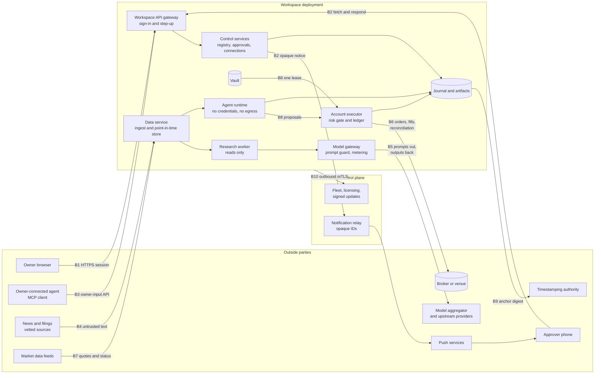
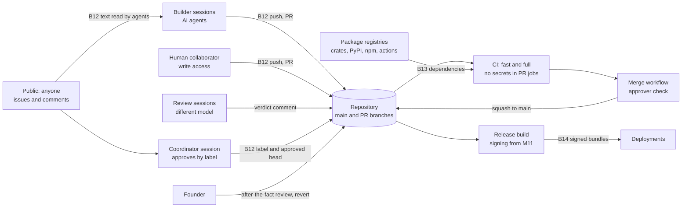

# Threat Model (v0.1, draft)

| | |
|---|---|
| **Owner** | The coordinating agent session; the founder reviews |
| **Status** | Draft v0.1, 2026-10-03. Design gap 10 ([register](../project/10-design-gaps.md)); story E21-10 |
| **Decisions** | [DEC-439](../project/decisions/DEC-439.md) |
| **Feeds** | The Phase 2 penetration test ([quality and release](../project/07-quality-and-release.md#phase-2-gate-design-partners)); every spec's adversary section |

This document lists what Mandate protects, where trust changes hands, who might attack, and what
stops each attack today. It ends with the risks that remain, ranked, and the work and decisions
that would reduce them.

**This repository is public.** The document stays at the level of architecture: classes of attack
and the controls against them. It contains no working exploit, no hostname, no account identifier,
and no secret, and changes to it must keep it that way. Findings that need more detail than that go
to the founder privately, never into an issue or PR.

## Contents

1. [Scope and method](#1-scope-and-method)
2. [Security goals](#2-security-goals)
3. [Assets](#3-assets)
4. [Trust boundaries and data flows](#4-trust-boundaries-and-data-flows)
5. [Attackers](#5-attackers)
6. [Threats by boundary](#6-threats-by-boundary)
7. [Focus areas](#7-focus-areas)
8. [Residual risks, ranked](#8-residual-risks-ranked)
9. [For the founder](#9-for-the-founder)
10. [Keeping this current](#10-keeping-this-current)
11. [Backlog and RAID](#11-backlog-and-raid)
12. [Open questions](#12-open-questions)

---

## 1. Scope and method

**In scope:** every plane the [HLD](../HLD.md) names (global control plane, workspace control
services, data plane, shared data plane, model gateway), all three deployment modes, the brokers and
data sources we connect to, and the way the software itself is built: AI builders, the coordinator,
review agents, CI, the merge workflow, and releases.

**Out of scope:** physical security of hosting providers, the brokers' own internal security, and
the security of an owner's own device beyond what our sign-in and step-up rely on.

**Method.** For each trust boundary (§4) we list threats by STRIDE category: Spoofing (S),
Tampering (T), Repudiation (R), Information disclosure (I), Denial of service (D), and Elevation of
privilege (E). Each threat names the controls that exist today, citing the rule, spec section, or
invariant that holds it, and the gap if one remains. A control is "specified" when a spec states it
and "built" only when code and tests on `main` enforce it; most controls beyond the trading core are
specified, not built, and the tables say so where it matters.

**Invariant prefixes cited.** `MI-` [mandate spec](../specs/mandate.md#1-principles), `INF-`
[inference spec](../specs/inference.md#2-invariants), `DP-` [data plane
spec](../specs/data-plane.md#2-invariants), `OPS-` [infrastructure
design](../design/infrastructure.md#2-invariants), `HI-` agent harness spec
(`docs/specs/agent-harness.md`, in review). The workspace API (`docs/specs/workspace-api.md`,
DEC-436), identity (`docs/specs/identity.md`, DEC-437), and notifications
(`docs/specs/notifications.md`, DEC-438) specs are drafted in parallel; their `API-`, `ID-`, and
`NT-` invariants are cited by document until they merge, and E21-20 cross-links them by number.

**Ratings.** Likelihood and impact are **H**igh, **M**edium, **L**ow, as in the
[RAID log](../project/03-raid-log.md).

---

## 2. Security goals

These are the properties the rest of the document defends. Each restates rules that already exist;
none is new policy.

| # | Goal | Held by |
|---|---|---|
| SG-1 | **No text, model, or outside input can place an order outside the mandate.** The worst any input can do is propose; deterministic code sizes, the autonomy rules classify, and the gate decides | Rules 1, 4, 11; MI-9, MI-15 to MI-17; INF-5; HI-1, HI-10; DP-8 |
| SG-2 | **Nobody but the owner, with step-up, can widen an envelope** | Rule 11; MI-12, MI-16; HLD §8 step-up |
| SG-3 | **Risk reduction always works,** whatever is down, compromised, or under attack | Rule 13; MI-1, MI-23; OPS-4; INF-13; HI-14; DP-13 |
| SG-4 | **The platform can never move funds.** Trading-only scopes; keys that allow withdrawal are refused | HLD §6 A step 2; infrastructure §5.3 |
| SG-5 | **Credentials stay in the vault** and in the memory of the one process that uses them | Rule 7; OPS-1; INF-14; HI-12 |
| SG-6 | **One tenant can neither read nor affect another** | HLD §8; OPS-6; INF-9; DP-10; E18-8 |
| SG-7 | **The record cannot be changed without detection** | Rule 5; journal §1 principle 5, §10, §11; OPS-8 |
| SG-8 | **Nothing sensitive leaves in a notification, log, metric, or telemetry** | Rule 6; OPS-10, OPS-11 |
| SG-9 | **What runs is what was reviewed.** Every change reaches `main` through CI and an independent review; every release is identified and, from M11, signed | DEC-79; DEC-175; OPS-15; ES-14, ES-17 |
| SG-10 | **No environment but production can reach live money** | Rule 8; OPS-5; ES-23 |

---

## 3. Assets

| Asset | Why it matters | Where it lives (managed / hybrid / on-prem) | Worst outcome if lost |
|---|---|---|---|
| **Money in users' broker accounts** | The thing users trust us with. We never hold it (no custody) | At the broker | Losses from trades outside intent; manipulation using victims' accounts |
| **Broker credentials and OAuth tokens** | Let a holder trade the account | Our vault / customer's vault / customer's vault | Unauthorized trading; account-data disclosure. Never withdrawal, by SG-4 |
| **Mandates, policies, delegations** | The contract; changing one changes what the agent may do | Workspace deployment (control stream) | Envelope widened without the owner |
| **Positions, orders, theses, approvals** | Trading intent and strategy | Workspace deployment (journal) | Strategy leak; front-running; privacy breach |
| **Journal integrity** | The audit record and the source of state on restart | Hot store, cold store with object lock, anchors | Undetected history rewrite; wrong state after replay |
| **Model provider keys and spend** | Every model call costs money | Vault, read only by the gateway (INF-14); also dev and builder sessions today | Spend run up; prompts sent under our identity |
| **Model prompts and outputs** | Contain theses, held instruments, and the owner's description | Artifact store; and in transit at the aggregator and provider | Strategy leak across tenants |
| **Tenant data in general** | Personal data, identities, records | Per-workspace keys; personal data by reference (journal §6.4) | Privacy breach; regulatory exposure |
| **The release pipeline and signing key** | Whatever it signs runs next to credentials | CI, `main`, the founder's hardware key (ES-17) | Malicious code in every deployment |
| **The repository's merge path** | Decides what reaches `main` | GitHub: the ruleset, the merge workflow, labels | Safety controls weakened by a merged change |
| **The founder's and collaborators' accounts** | Write access to the repository; the founder's account is also the approver identity | GitHub, the founder's devices | Any of the above, through the merge path |
| **The global control plane** | Directory, licensing, relay, signed updates | Ours in managed and hybrid | Updates pushed to customer sites; notification spoofing |

---

## 4. Trust boundaries and data flows

### 4.1 Runtime

Edges are labelled with the boundary that §6 analyses. B11 (operators and break-glass) and B12 to
B14 (development, supply chain, release) are drawn in §4.2.

### 4.2 Development and release

### 4.3 Boundaries

| # | Boundary | Crosses it | Untrusted side |
|---|---|---|---|
| B1 | Internet to the workspace API | Owner and admin sessions; the web app | Everything arriving |
| B2 | Approval channel | Opaque notices out; approval fetch and response in | The device, the channel, the relay |
| B3 | Owner-connected agent (DEC-141) | Owner-input requests from an LLM agent the owner runs | The agent and whatever it reads |
| B4 | News, filings, fundamentals into the data plane | Text and structured vendor fields | The text, the source, the vendor |
| B5 | Model gateway to the aggregator and providers | Prompts out; outputs and identity claims back; keys | The aggregator, the provider, the model |
| B6 | Executor to broker | Credentials, orders, fills, account state | The broker's responses; the network |
| B7 | Market data into perception and the gate | Quotes, bars, trading status | The feed |
| B8 | Inside the workspace deployment | Process to process, tenant to tenant, vault leases | Any one process; any other tenant |
| B9 | Journal stores and backups | Appends, segments, anchors, restores | Operators and storage |
| B10 | Workspace deployment to the global control plane | Health, usage, updates, relay | The other side, in both directions |
| B11 | Operators and platform staff | Break-glass, configuration, allowlists, registries | The insider |
| B12 | The development process | Code, reviews, approvals, merges | Agent sessions, collaborators, public text |
| B13 | Supply chain | Crates, Python and npm packages, CI actions, toolchains | Every upstream |
| B14 | Release and distribution | Builds, signatures, bundles | The pipeline; the channel |

### 4.4 By deployment mode

| Boundary | Managed | Hybrid | On-prem / air-gapped |
|---|---|---|---|
| B1, B2 | We run the API and the relay | Customer runs the API and identity; our relay carries opaque push only | Customer runs both, or allows our relay |
| B5 | Platform keys, the aggregator (DEC-432 item 14) | Local-only by default (DEC-432 item 8); hosted only if customer policy allows, with their own keys (item 16) | Local models only |
| B6, B8 | Our vault, our cells, shared hosts with per-workspace processes | Customer's vault and hosts; we hold no credential | Same as hybrid |
| B9 | Our stores; anchors with a timestamping authority | Customer's stores; anchor roots also sent to us (journal §10) | Customer's; anchors stay on site |
| B10, B14 | Not a boundary (one operator) | Our signed updates enter the customer's site | Signed bundles carried in by hand |
| B11 | Our staff, break-glass with customer approval (infrastructure §5.5) | Customer's staff; ours only by invitation | Customer's staff |

A compromise of **our** side therefore reaches hybrid and on-prem customers only through B10 and B14
(signed updates, relay), which is why release signing (E21-8) matters most for those modes.

---

## 5. Attackers

| # | Attacker | Capability | Wants | Enters at |
|---|---|---|---|---|
| A1 | **External attacker** | Internet access; phishing; credential stuffing; scanning | Account takeover, data, ransom | B1, B2, B10 |
| A2 | **Malicious tenant** | A legitimate workspace in a shared cell; can run agents and call the API | Other tenants' data; noisy-neighbour harm; using the platform for manipulation | B1, B3, B8 |
| A3 | **Compromised owner account** | The owner's session, possibly their step-up device | Trade the victim's account for the attacker's benefit | B1, B2, B3 |
| A4 | **Malicious insider or collaborator** | Write access to the repository, or operator access to a cell | Plant code, read tenant data, alter records | B9, B11, B12 |
| A5 | **Compromised AI coding agent or builder session** | Pushes code, comments, may hold paper and model keys, acts through a shared account | Merge a weakened control; exfiltrate keys | B12, B13 |
| A6 | **Malicious or compromised model, provider, or aggregator** | Sees prompts; writes outputs; reports model identity | Read strategy across tenants; steer outputs; inflate spend | B5 |
| A7 | **Poisoned news or filings source** | Publishes text the research agent reads | Make agents buy an instrument; leak data; flood | B4 |
| A8 | **Compromised dependency** | Code that runs in build, CI, or production | Steal credentials; backdoor builds | B13, B14 |
| A9 | **Broker or venue misbehaviour** | Wrong, late, duplicate, or other-account responses; outages; terms changes | Not malicious as a rule; harm is the same | B6 |
| A10 | **Bad market data** | Wrong ticks, crossed quotes, stale or missing status | Not malicious as a rule | B7 |

`AGENTS.md` names four adversaries for every design: a careless user, a bad model, a malicious
insider, and a bad market tick. A careless user is A3's capability without intent and is covered
where A3 is; the other three are A6, A4, and A10.

---

## 6. Threats by boundary

Each row: STRIDE letter, threat, controls today, gap. **Built** marks a control enforced by code and
tests on `main`; everything else is specified. Gaps link to backlog rows (§11) or DEC-439 items.

### 6.1 B1: Internet to the workspace API

| | Threat | Controls | Gap |
|---|---|---|---|
| S | Credential stuffing or phishing of an owner | Passkeys or OIDC SSO (E9-1); the web app's sign-in through a hosted auth service (DEC-211); passkeys are origin-bound | Email-link sign-in exists behind a flag; it must never satisfy step-up (DEC-439 item 4) |
| S | Session theft | Cookie sessions refreshed by the proxy, none in browser storage (DEC-211) | Session lifetime and binding belong to `identity.md` |
| T | Request tampering to raise a limit | Mandate changes are versioned, validated, classified, and need step-up to raise risk (mandate spec §9; HLD §8) | — |
| R | Owner denies a change they made | Every version, approval, and owner command is journaled with actor and auth method (HLD §6 C step 8) | Signed approvals and versions are E18-5 (not scheduled) |
| I | Reading another workspace's data by changing an ID (broken object-level authorization) | Workspace ID on every record; row-level security, specified but not built (HLD §8; journal §6.1; OPS-6) | The API is not yet specified; `workspace-api.md` must make every query workspace-scoped by construction; E18-8 fuzz |
| D | Flooding the API | Per-workspace quotas (HLD §8) | Rate-limit values belong to `workspace-api.md` |
| E | A viewer or approver acts as an admin | Roles (HLD §8, E9-2); separation of duties (E9-5); `independent_approval_required` (MI-24) | Built only in the mandate core; the role model is `identity.md`'s |

### 6.2 B2: Approval channel

| | Threat | Controls | Gap |
|---|---|---|---|
| S | A fake "approval needed" notice leads to a look-alike page that harvests a login | Notices carry only an opaque ID and generic text (rule 6); approval details are fetched from the approval service after sign-in; passkey step-up is origin-bound and cannot be replayed on another site | SMS or email must never be accepted as the step-up factor (DEC-439 item 4) |
| T | Changing what the approver sees, or binding the approval to a different order | The content object is hashed; a grant must repeat the content hash; the intent equals what was bound; re-validation can only skip (MI-22, MI-24) | — (built in `mandate-approval`, reference cases pass) |
| T | Replaying an old approval | Each grant needs step-up evidence whose assertion the workspace has never seen, before the deadline (MI-24) | — |
| R | An approver denies approving | Journaled who, when, channel, and auth method (HLD §6 C) | — |
| I | Trade details leak through the relay, push service, SMS, or email | Opaque payloads (rule 6, OPS-10); details only over the authenticated fetch, end-to-end encrypted through the relay (HLD §6 C step 5) | Payload capture tests (07, Privacy) not yet built |
| D | Notices suppressed so approvals time out | Timeout is `skip` (MI-21): silence never adds risk; risk reduction never waits (MI-23) | — |
| E | Text in the approval card pushes the approver ("approve now, urgent") | Model text is shown quoted and labelled as the research agent's, with sources (DEC-126); choices have equal weight and none preselected (mandate spec §6.4) | Disclosed, not blocked. Rendering rules for quoted text: E21-21 |

### 6.3 B3: Owner-connected agent (DEC-141)

| | Threat | Controls | Gap |
|---|---|---|---|
| S | A stolen client token used by an attacker | Tokens issued to Mandate only, never passed through (E18-4); sender-constrained, not plain bearer tokens (`identity.md`, settlement X5 on #557); revocable connection | Token scope and lifetime belong to `identity.md` and `workspace-api.md` |
| R | Nobody can tell whether an order or an answer came from the owner or their client | A client acts as its own actor kind, `client`, never recorded as a `user`, with the human named beside it as `on_behalf_of` (`workspace-api.md` DEC-436 item 9; `identity.md` DEC-437 item 10; settlement X2 on #557). The runtime's approval checks therefore refuse a client's answer from the record alone (MI-24) | — once #556 and #560 merge with X2 |
| T | Prompt injection into the owner's own agent makes it request a buy | Client opens and increases are never `auto` (MI-30); same builder, gate, and autonomy as owner input (rule 11) | — |
| T | The same injection makes it request exits that churn or flatten the book | Exits are risk reduction (rule 2), paced only by participation caps for owner exits (rule 13) | **Residual:** an injected client can liquidate positions, at a cost in spread, fees, and taxes. Read-only default scope for clients (E18-4; DEC-439 item 16) |
| E | The client widens the envelope | Client requests never change the envelope (rule 11; DEC-141) | — |

### 6.4 B4: News and filings into the research agent

The full chain is in §7.1. In short:

| | Threat | Controls | Gap |
|---|---|---|---|
| T | Injected instructions in an article or filing | Text is inert to deterministic code (DP-8); the model has no tools (INF-5, HI-4); output is a thesis that passes mandate spec §8.5; admission is `ask` by default (MI-17) | Plausible false content on a vetted source (§8 rank 3) |
| T | A vetted source turns malicious | Allowlist versions (DP-9, DEC-101); corroboration; drift detector (E17-5); operator per-thesis halt (E17-6) | Live theses citing a revoked source: DEC-433 item 19 |
| I | Injection tries to exfiltrate data | No outbound path; inputs hold only public data and the agent's own memory (HI-11, INF-8) | The prompt itself still reaches the aggregator (B5) |
| D | Flooding sources | Bounded queues; the slow tier never blocks the hot tier (data plane §3.6; HI-7) | — |

### 6.5 B5: Model gateway to the aggregator and providers

DEC-432 item 14 puts **one aggregator in the path of every model call.** The aggregator sees every
prompt, writes every output, reports which model answered, and holds a key that spends money.

| | Threat | Controls | Gap |
|---|---|---|---|
| S | The aggregator or an upstream host serves a different or cheaper model under the pinned name | Routing locked per pin; a reported identity that differs fails as `identity_mismatch` (INF-2, DEC-432 items 9, 10); canary probes (inference §10) | The reported identity is the aggregator's own claim. A dishonest aggregator can report the pin and serve anything. Bounded by T below |
| T | Outputs altered or invented | Every output is treated as a possibly compromised model's: schema and limits, then §8.5, the builder, autonomy, and the gate, none of which read model text (HI-6, HI-10, INF-4) | None for safety; quality harm is caught only by forward-paper scorecards |
| I | Prompts read, retained, or trained on | Prompts hold no credential, account ID, personal data, dollar figure, or other tenant's data (INF-8, HI-11); terms that exclude training, shortest retention (DEC-432 item 15) | **Residual:** the aggregator sees, across all managed tenants, which instruments agents hold and consider and when. That is a strategy and front-running exposure that no prompt guard removes (§8 rank 5; DEC-439 items 6, 14) |
| I | Cross-tenant leak through provider-side prompt caching | Only data-free prefixes may be cached (INF-9) | Test with two workspaces (INF-9 test) not yet built |
| D | Aggregator outage | Missing is safe (INF-4); research never blocks trading (HI-7, INF-13) | One aggregator is one outage for every model; accepted |
| E | Key theft runs up spend | Key in the vault, gateway-only (INF-14); per-call reservation and caps (INF-7) | The same aggregator key family is also used by development sessions today; no provider-side hard limit is recorded (DEC-439 items 6, 17) |

### 6.6 B6: Executor to broker

| | Threat | Controls | Gap |
|---|---|---|---|
| S | A credential that can withdraw, or one for the wrong account or environment | Scope, environment, and account checks at connect and every start, journaled without the credential (infrastructure §5.3) | Where a venue cannot report key permissions, disclosed only |
| T | Network tampering | rustls TLS; no redirects; HTTPS only (dependencies registry: `reqwest`) | — |
| T | Broker returns wrong, duplicate, late, or another account's data | Reconciliation by `client_order_id` and fill ID; mismatch pauses the agent (trading spec §11); `Unknown` orders hold exits in that instrument only (rule 13) | Robinhood's MCP scope reads every account of the customer (R-25) |
| R | A disputed fill | Raw broker responses kept, credentials redacted (journal §6.3) | — |
| I | Credential exfiltration from the executor | One lease per executor; `secrecy` wrapper so `Debug` never prints it (ES-09); log-scan test (OPS-1); the runtime holds no credential (rule 12) | Vault product undecided (DEC-434 item 14); E21-9 blocked |
| D | Broker outage or rate limit | Protective orders rest at the broker (trading spec §5.4); staleness halts openings (DP-4) | — |
| E | The agent calls the broker directly | All account-level actions go through the account ledger (rule 12); the runtime has no route to a broker (infrastructure §9) | Network egress rules are E21-1 |

### 6.7 B7: Market data into perception and the gate

| | Threat | Controls | Gap |
|---|---|---|---|
| T | One bad low tick fires a limit or a flatten | Breach confirmation and two-quote triggers (mandate spec §5.6); tripwires read no marks; stale marks never flatten (DP-6) | — |
| T | One bad high tick raises the high-water mark or sets the day's start equity | — | **Known gap:** DP-6; DEC-433 item 17 proposes confirmation by a second quote |
| T | Unknown trading status treated as trading | Presumed halt (DP-5) | — |
| D | Feed stops | No openings without a fresh sane quote; exits continue (DP-4) | — |

### 6.8 B8: Inside the workspace deployment

| | Threat | Controls | Gap |
|---|---|---|---|
| E | A compromised runtime (for example through a parser bug on model output) places orders | The runtime holds no credential and has no broker route; it can only propose to the executor, whose gate re-checks everything (rules 1, 12; HI-12) | Egress rules E21-1 |
| E | A compromised runtime writes another agent's stream | One writer per stream, fenced by epoch (journal §1 principle 3; OPS-3) | Database roles per process (infrastructure §9) not yet built |
| I | Cross-tenant read in a shared cell: database, artifacts, caches, message subjects, metrics labels | Built today: workspace carried in `stream_id`, per-role INSERT and SELECT grants, append-only triggers (journal §6.1). Specified, not built: a `workspace_id` column with row-level security (journal §6.1; identity spec §14, #556), per-workspace keys (journal §6.5); exact per-workspace model cache (INF-9, INF-11); NATS accounts per workspace (HLD §8); opaque metrics labels (OPS-6); agent processes never shared (HLD §8) | No cross-layer isolation suite yet (07, Isolation; E18-8). See §7.3 |
| D | A noisy tenant starves others | Per-workspace quotas, rate buckets, and process limits (HLD §8; inference §8.4) | Values unset |
| I | A memory dump or core file holds a credential | Credentials only in the using process's memory (OPS-1) | Core dumps off and memory locking for executors: E21-9's acceptance should state it |

### 6.9 B9: Journal stores and backups

| | Threat | Controls | Gap |
|---|---|---|---|
| T | An operator or attacker edits or deletes events | Application roles have INSERT and SELECT only; triggers reject changes; DDL and superuser sessions alert (journal §6.1, **built** for the hot store's constraints); hash chain; anchors every 5 minutes with a timestamp token; object lock in compliance mode (journal §6.2, §10); verification at startup and weekly (journal §11) | See §7.4 for the window before anchoring |
| T | Restoring an old backup to roll back history | A restore older than the last anchor is an integrity incident and no agent trades (OPS-8) | E21-5 |
| I | A stolen backup | Encrypted at rest under per-workspace keys; canary scan for secrets in restored data (E21-5) | Backup storage keys must be separate from the data they protect: infrastructure §6 to confirm |
| R | Records disputed | Anchors reveal only hashes; examination bundles verify offline (journal §12) | — |

### 6.10 B10 and B14: Global control plane, updates, and release

| | Threat | Controls | Gap |
|---|---|---|---|
| S, T | A malicious update reaches customer sites | Signed bundles; every process checks its own signature at start (OPS-15; infrastructure §7.1) | Signing starts at M11; until then no external site exists. E21-8 |
| T | A build differs from its source | Reproducible builds and SBOM from M6 (ES-17) | E21-8 |
| I | The global control plane learns strategy | It holds only IDs, counts, and versions (HLD "Where data lives") | — |
| D | Control-plane outage stops trading | Never in the trade path (OPS-12) | — |
| E | The managed global kill switch reaches a customer site | It cannot (HLD §8) | — |

### 6.11 B11: Operators and platform staff

| | Threat | Controls | Gap |
|---|---|---|---|
| I | Staff read tenant data | Break-glass only, with customer approval, journaled to a stream the customer reads (journal §7; infrastructure §5.5); credentials are write-only | Two-person break-glass is Proposed (infrastructure §5.5) |
| T | An operator changes a model registry entry, price table, or source allowlist | Registry entries immutable and hashed into the mandate pin; price tables and allowlists versioned and journaled (inference §10; HI adversaries; DP-9) | Allowlist changes are "reviewed like code"; who approves them is not yet stated (E21-20) |
| E | An operator issues an operator halt or kill switch maliciously | Both only remove permissions and are journaled (HLD §8) | Harm is lost opportunity only |

### 6.12 B12: The development process

See §7.5 for the full analysis.

| | Threat | Controls | Gap |
|---|---|---|---|
| S | A builder session approves its own PR | Approval needs the label and an approved-head line, and the label's last application and the description's last edit must come from an approver login (`merge-approved.sh`, #541) | **Every agent session acts through the founder's account,** which is also the approver login. The check cannot tell the coordinator from a builder (DEC-439 item 9; E21-13) |
| E | **Anything acting as an admin writes to `main` directly.** The `main` ruleset's one bypass entry is the repository admin role with bypass mode "always", which exempts it from every rule: the PR requirement, the `fast` and `full` checks, and linear history. The founder's account holds that role, and every agent session acts through it | None on that path: no PR, label, approved head, merge script, CI, or review applies | **The shortest path to `main`** (§7.5 item 1; §8 rank 1). Bypass by pull request only, or no bypass (DEC-439 item 18) |
| S | A collaborator merges with GitHub's Merge button | `COLLABORATION.md` rule 2 forbids it | **Not enforced:** the ruleset requires green checks but no approving review, so write access can merge a green PR (DEC-439 item 10; E21-16) |
| T | A merged change weakens a control: a CI check, `merge-approved.sh`, `deny.toml`, the layer rules, a test | Independent review on a different model (DEC-79); mutants on safety-critical diffs; spec guard; CODEOWNERS lists these paths | CODEOWNERS requests a founder review but nothing waits for it, since DEC-79 made founder review after the fact. The checks guard everything except changes to themselves (DEC-439 items 7, 12; E21-14) |
| T | Public text steers an agent: an issue, a comment, or text planted in a PR | None written down | DEC-439 items 2, 3; E21-15 |
| I | A session leaks the paper or model keys it holds | gitleaks per PR and over full history; paper keys only (rule 8) | Model key spend; DEC-439 item 17; E21-18 |
| R | Who approved a merge | Label events and the approved-head line are on the PR | All agents share one login, so the record cannot say which session acted (item 9) |

### 6.13 B13: Supply chain

| | Threat | Controls | Gap |
|---|---|---|---|
| T | A malicious or typo-squatted crate or Python package | Lockfiles, `--locked`; cargo-deny for advisories, licenses, and unknown registries or git sources; every direct dependency needs a registry row (`cargo xtask deps`); safety-critical crates limited to `allowed_external` (ES-14) | Transitive code is not reviewed; cargo-vet is deferred to M6 (infrastructure §9) |
| T | A malicious npm package in `web/` | `package-lock.json`; one reviewed row per framework | npm rows are not machine-checked and install scripts run (E21-19) |
| T | A compromised CI action or tool binary | Actions pinned by commit SHA; `permissions: {}` by default; tool binaries checksum-verified; no secrets in PR jobs; the merge workflow runs only default-branch code (ES-12) | — |
| T | A compromised toolchain | Pinned toolchain from the official channel | Accepted |

---

## 7. Focus areas

### 7.1 Prompt injection reaching an order

RAID R-05 and ADR-0002 call this the top technical risk. The question is not whether a model can be
fooled (it can) but what a fooled model can do. Every layer below holds **without the model's
cooperation:**

| Layer | What it stops | Held by |
|---|---|---|
| 1. Vetted sources only | Open web and social media never enter | DP-9; DEC-101 |
| 2. Text is inert | No deterministic code parses instructions from text | DP-8 |
| 3. No capabilities | The model has no tools, browsing, or network; the retrieval plan is fixed by the harness | INF-5; HI-4 |
| 4. Nothing to leak | Prompts hold no secret, account ID, personal data, or other tenant's data, checked by a deterministic guard | INF-8; HI-11 |
| 5. Output contract | Schema, output limits, platform-filled facts (identity, timing, asset class, corroboration) | HI-18; inference §8.3 |
| 6. Admission | Eligibility floor, allowlisted evidence, independent corroboration, asset classes, `max_instruments`, operator halt | Mandate spec §8.5; MI-15, MI-16 |
| 7. Autonomy | First order in a newly admitted instrument at least as strict as `autonomy.admission`, default `ask` | MI-17 |
| 8. Sizing | Deterministic builder, user-chosen method, clipped to limits; missing outputs never enlarge a buy | MI-9, MI-10 |
| 9. Risk gate | Independent of agent logic; every limit, US account rule, conduct control | Rule 1; trading spec §9 |
| 10. Bounded loss | Drawdown ladder, daily loss, lifetime floor; protective orders at the broker | Mandate spec §5; trading spec §5.4 |

**What still gets through:** a false but plausible story on a vetted source, corroborated by a
second outlet that repeated it or by a price move it caused, can produce a thesis that an owner
approves, or that `auto` admits under the retail profile. The loss is bounded by the envelope, not
prevented. E19-6's adversarial bench (zero limit breaches with a fully compromised model) and E17-5's
drift detector are the tests that hold layers 3 to 9.

**Correlated flow.** One poisoned item can steer many agents into the same instrument at once
(R-26). Each account stays inside its own limits; the aggregate-flow monitor and operator halt
(E17-6) are the cross-account controls.

### 7.2 Credential exfiltration through prompts and logs

| Path | Control |
|---|---|
| A credential in a prompt | The runtime and research worker hold none (HI-12); the gateway guard scans for credential formats before any byte leaves (INF-8) |
| A credential in the owner's description | The construction check disables research for that version and alerts the owner (harness §9) |
| A credential in a log, metric, trace, journal event, artifact, or backup | `secrecy` values (ES-09); redaction of raw broker records (journal §6.3); log scan and backup canary scan (OPS-1, E21-5); opaque telemetry labels (OPS-10) |
| A credential in an environment variable of a live process | Live credentials come only from the vault (ES-23; infrastructure §5.2) |
| A credential committed | gitleaks per PR and weekly over history (ES-14) |
| A credential read back by a person | Write-only after entry; break-glass grants no read-out (infrastructure §5.1, §5.5) |

The remaining exposure is in development, not production: builder and dev sessions hold paper and
model keys in their environment, and a prompt-injected session could print or send them. Paper keys
move no money (rule 8); a model key spends it (DEC-439 item 17, E21-18).

### 7.3 Cross-tenant leakage

| Shared thing | Risk | Control |
|---|---|---|
| Model response cache | One tenant receives another's output | Exact cache keyed by workspace, identity, and request digest (INF-11); no similarity cache (DEC-432 item 6) |
| Provider-side prompt cache | Timing or content reveals another tenant's prefix | Only data-free prefixes cached (INF-9) |
| The aggregator | Sees all tenants' prompts together | Prompt contents limited (INF-8); residual in §6.5 |
| Shared data plane | One tenant's universe visible to others | Whole-dataset broadcast, pull only; no tenant datum enters it (DP-10) |
| Database | Missing workspace filter | **Specified, not built:** row-level security on every table with `workspace_id` (journal §6.1). The only migration today has neither; isolation rests on the workspace in `stream_id` and per-role grants |
| Artifact store | Guessable or shared keys | Content-addressed by hash, encrypted per workspace (journal §6.3, §6.5): a hash is not an access right, so reads must be authorized by workspace, not by knowing the hash |
| Messaging | Subject wildcard across workspaces | NATS accounts per workspace (HLD §8) |
| Metrics and alerts | Labels carry symbols or sizes | Opaque labels, linted (OPS-6, E21-3) |
| Aggregate-flow monitor | Sees all workspaces of a cell | Operator-only, writes to no workspace (HLD §8) |

None of these has a cross-layer test yet. The isolation suite (07, Isolation; OPS-6; E18-8) is the
control; it belongs before any shared cell holds a second real tenant.

### 7.4 Journal tampering

The chain makes edits detectable; anchors make a whole-chain rewrite detectable; object lock makes
exported history unchangeable. What remains:

- **The window before anchoring.** An attacker with database superuser rights could rewrite the
  unanchored tail (at most one anchor interval, 5 minutes, plus segments not yet exported). Broker
  reconciliation still catches any order or fill that differs from what the broker holds (trading
  spec §11), and superuser sessions alert (journal §6.1). Accepted for v1.
- **Truncating the tail.** Dropping recent events that were never anchored looks like a crash.
  Reconciliation re-ingests missing fills and adopts broker order state (trading spec §11), so
  trading state recovers; what is lost is the record of decisions in that window, and the gap is
  visible as a `seq` regression against the last anchor. Accepted for v1.
- **Hybrid sites.** The customer controls the store and the anchors; our copy of the anchor roots
  (journal §10) is the outside witness, if the customer keeps sending it (journal §13 question 2).

### 7.5 The agent-driven development process

How code reaches `main` today: builders (AI sessions) push branches and open PRs; review sessions on
a different model post verdicts; the coordinator writes the approved head into the PR description
and applies the `coordinator-approved` label; the merge workflow runs `merge-approved.sh` from the
default branch, which re-reads everything from GitHub and squash-merges only when the head matches,
CI is green on that head, and the label and description were last set by an approver login
(DEC-175, #541). The founder reviews after the fact and can revert (DEC-79). Safety-critical diffs
need zero missed mutants. All of this applies only to changes that go through a pull request.

This is strong against a **careless** agent and against a collaborator who applies the label (the
approver check withdraws it). It is weaker against a **compromised** or **steered** agent, because:

1. **The ruleset's bypass is the shortest path to `main`.** The `main` ruleset exempts the
   repository admin role from every rule, always. The founder's account holds that role, and it is
   the account every agent session acts through. A session steered by text it read, or anyone holding
   a credential of that account, does not need to defeat the approver check: it can change `main`
   with no pull request, no CI, and no review. The grant is to a role, not to one named account.
   The fix, bypass by pull request only or no bypass, is the founder's (DEC-439 item 18).
2. **One identity for all agents.** Builders, reviewers, and the coordinator act through the
   founder's GitHub account, which is the approver login. A steered builder can therefore apply the
   label and write the approved head, and the approver check passes. Independent review is a process
   step the coordinator follows, not something the merge path can verify.
3. **The checks do not protect themselves.** A PR can change `merge-approved.sh`, a CI workflow, an
   `xtask` check, `deny.toml`, or `.gitleaks.toml`. The merge workflow runs the default-branch copy,
   so a malicious change takes effect for the PRs after it. CODEOWNERS lists these paths, but no
   rule waits for the founder, and ADR-0001 ES-13 still says the ruleset requires CODEOWNERS review,
   which DEC-79 superseded in practice. This text and the configuration disagree; the founder decides
   which to keep (DEC-439 item 12).
4. **The repository is public.** Anyone can open issues and comment. Sessions that read issues and
   PR comments (the coordinator watches for `ready` and `Decision needed:` lines) read attacker text.
   Code, fixtures, PR descriptions, and test data written by one agent are read by the next, including
   the reviewer.
5. **The Merge button.** Write access can merge any green PR directly; `COLLABORATION.md` forbids it
   but nothing enforces it.
6. **Same-family review.** Reviews run on a different model, but models share failure modes, and a
   reviewer briefed from the PR's own description inherits its framing.

What already limits the damage, **for changes that go through a pull request** (none of it applies
to a bypass write, item 1): CI must be green; safety-critical crates need zero missed mutants;
reference cases are founder-approved and generated, never hand-edited; spec changes need a cited
DEC and cannot ship with code (ES-22); history is linear and force-push is refused; everything is
revertible; and no environment but production can reach live money (OPS-5), and no production
exists yet. **Before live money, items 18, 9, 10, 11, and 12 of DEC-439 should be decided,** because
from then on a merged change is one deploy from real accounts.

### 7.6 Supply chain

The Rust side is well covered for direct dependencies (registry rows, cargo-deny, lockfiles,
`allowed_external` for safety-critical crates). The weak points are transitive code nobody reviews
(cargo-vet deferred to M6), the npm tree of `web/` (rows are per framework and not machine-checked,
and install scripts run in CI), and the lack of signing until M11. The web app holds sign-in
sessions, so a malicious npm package there reaches owner sessions (B1) even though it never touches
the trading core. E21-19 closes the npm gaps; E21-8 the build ones.

---

## 8. Residual risks, ranked

Ranked by likelihood times impact after today's controls, then by how soon the risk becomes real.

| Rank | Residual risk | L | I | Why it remains | Mapped to |
|---|---|---|---|---|---|
| 1 | **The founder's GitHub account is a single point of failure for the repository.** It is the identity every agent session acts through, the only approver login, the holder of the ruleset's admin bypass ("always": direct writes to `main` with no PR, CI, or review), and from M11 the holder of the release signing key. Steered (a session acting on injected text) or compromised (a stolen credential), it reaches `main` without defeating any check | M | H | The bypass exempts the admin role from every rule; one account carries every role; no hardware-key requirement is stated today (§6.12, §7.5 items 1 and 2) | R-29, R-32; E21-13, E21-16; DEC-439 items 18, 9, 11 |
| 2 | **A steered or compromised agent session merges, through the PR path, a change that weakens a safety control or the checks themselves** | M | H | Checks that do not protect their own files; public text read by agents; reviews briefed from the PR (§7.5 items 3 to 6) | R-29; E21-14, E21-15; DEC-439 items 2, 3, 7, 12 |
| 3 | **A plausible false story on a vetted source becomes an approved or auto-admitted position, across many accounts at once** | M | H | Every layer of §7.1 holds, but none judges truth; the envelope bounds the loss | R-05, R-26; E17-5, E17-6, E17-7, E19-6 |
| 4 | **An owner account taken over raises the envelope and trades the account,** for example buying a thin stock the attacker sells into | L | H | Step-up guards the change, but a stolen step-up device or a phished session plus a weak factor passes; no delay or out-of-band notice today, and the notices arrive only when `notifications.md` carries settlement X4's kinds | R-31; E9-1, E9-4, E21-20; DEC-439 items 4, 5, 15 |
| 5 | **The model aggregator sees every managed tenant's research prompts** and is the only witness to which model answered | M | M | DEC-432 item 14; prompt limits remove secrets, not strategy | R-30; E21-17; DEC-439 items 6, 14 |
| 6 | **A compromised dependency** in the build, CI, or the web app | L | H | Transitive code unreviewed; npm install scripts; signing from M11 | R-33; E21-8, E21-19 |
| 7 | **A collaborator's GitHub account is compromised** | L | H | Write access can merge a green PR by hand; the ruleset requires no approving review (§7.5 item 5) | R-32; E21-16; DEC-439 items 10, 11 |
| 8 | **Broker credentials stolen from the managed vault or an executor** | L | H | Vault product and leasing not built; trading-only scopes bound it | R-04; E21-9; DEC-434 item 14 |
| 9 | **Cross-tenant read in a shared cell** through an untested layer | L | H | No cross-layer isolation suite yet, and row-level security is specified, not built | OPS-6; E18-8; 07 Isolation; DEC-439 item 8 |
| 10 | **One bad high tick** raises the high-water mark or start-of-day equity for good | M | M | Known gap | DP-6; DEC-433 item 17 |
| 11 | **Approver persuaded by quoted model text** | M | L | Disclosed, not blocked | E21-21 |
| 12 | **An injected owner-connected agent flattens the book** | L | M | Exits never need approval (rule 2) | DEC-439 item 16; E18-4 |
| 13 | **Model key spend run up** from a dev or builder session | M | L | Keys in session environments; no provider-side cap recorded | DEC-439 item 17; E21-18 |
| 14 | **Unanchored journal tail rewritten by a superuser** | L | M | Up to one anchor interval | Journal §6.1, §10; accepted |

---

## 9. For the founder

Item 18 comes first because it is the shortest path to `main`. These touch your accounts, spending, a safety rule's enforcement, or a founder decision already
taken, so they stay **Proposed** in [DEC-439](../project/decisions/DEC-439.md). Work continues on the
most conservative option meanwhile.

| DEC-439 item | Question | Recommendation |
|---|---|---|
| 18 | Change the `main` ruleset's bypass: the admin role now bypasses every rule "always". Either bypass only by pull request (the role must still open a PR, though it may skip the review requirement), or no bypass at all, with a named break-glass account that no agent uses if one is needed for recovery, its use reviewed from the ruleset's bypass events | Bypass by pull request only, now. It is a configuration change with no engineering cost or spend, and it closes the shortest path to `main` (§7.5 item 1) |
| 9 | Give the coordinator its own GitHub identity (a GitHub App or a machine account) and make it the only approver login; builders and reviewers use another | Yes, before more builder lanes start |
| 10 | Human collaborators: keep Write, or move to Triage and fork-based PRs; and restrict merging on `main` to the merge workflow and the founder | Triage plus forks, and restrict merging |
| 11 | Require two-factor authentication with hardware security keys or passkeys for the founder and every collaborator | Yes, now |
| 12 | Require a founder approving review before merge for the self-protecting paths (`.github/`, `xtask/`, `deny.toml`, `.gitleaks.toml`, `CODEOWNERS`, `AGENTS.md`, `.cursor/`, `rust-toolchain.toml`, `docs/dependencies.md`), enforced by `merge-approved.sh`; and align ES-13's text with what is enforced | Yes. It adds review load only on rare, high-leverage changes |
| 13 | An external penetration test of the workspace deployment, web app, and global control plane, plus a red-team of the research path, scoped by this document, before the first design partner | Yes; it is already a Phase 2 gate item, and it is spending |
| 14 | Aggregator controls under DEC-432 item 14: separate keys per environment, provider-side spend limits, zero-retention routing where offered, counsel on processor terms; revisit direct provider APIs for users' agents at M8 | Yes, and revisit at M8 |
| 15 | A cooling-off delay for risk-increasing envelope changes (raise a limit, enable `auto`, add a delegation, go live), cancellable by the owner | Yes for the retail profile, one hour by default |
| 16 | Owner-connected clients read-only by default, with exit requests an opt-in scope (changes DEC-141's boundary) | Yes, as E18-4 already sketches |
| 17 | Separate, capped model keys for each development lane, rotated after any suspected injection | Yes |

---

## 10. Keeping this current

| When | Who | What |
|---|---|---|
| A new spec or design document | Its author | Add or update the boundary rows it touches, cite this document from its adversary section, and change both in the same PR (DEC-439 item 1) |
| A spec gains invariants that close a gap here | The author of that change | Move the gap to the control column with the invariant ID |
| A security incident, near miss, or review finding about security | The coordinator | Add the threat, the control, and a RAID entry within the post-mortem's PR |
| A new third party in a data path (provider, vendor, identity service) | Whoever proposes it | Add it to §4 and §5 before the dependency or contract is accepted |
| Each milestone gate (M8, M11, M13) | The coordinator; the founder reviews | Re-rank §8 and confirm the pen-test scope |

The document's version rises with each change; the change history goes in the PR, not here.

---

## 11. Backlog and RAID

**New backlog rows** under [E21](../project/06-backlog-v1.md#e21-operations-and-infrastructure-proposed-dec-434):
E21-13 (separate agent identities), E21-14 (self-protecting paths), E21-15 (untrusted-author rule for
agent sessions), E21-16 (merge restricted to the merge path), E21-17 (aggregator controls), E21-18
(development key hygiene), E21-19 (npm supply chain), E21-20 (cross-links and out-of-band notices),
E21-21 (quoted model text in approval cards), E21-22 (penetration test), and E21-23 (round-1 minor
findings). E21-10 is this document.

**New RAID risks:** R-29 to R-33 ([RAID log](../project/03-raid-log.md#risks)).

---

## 12. Open questions

1. Whether the artifact store authorizes reads by workspace or relies on unguessable hashes; this
   document assumes the former (§7.3).
2. Whether backup encryption keys are held apart from the stores they protect (§6.9).
3. Who approves a change to the source allowlist, and whether it follows the code review path
   (§6.11).
4. How a hybrid customer who opts out of sending anchor roots gets an outside witness (§7.4; journal
   §13 question 2).
5. Whether executors should disable core dumps and lock credential memory (§6.8).
