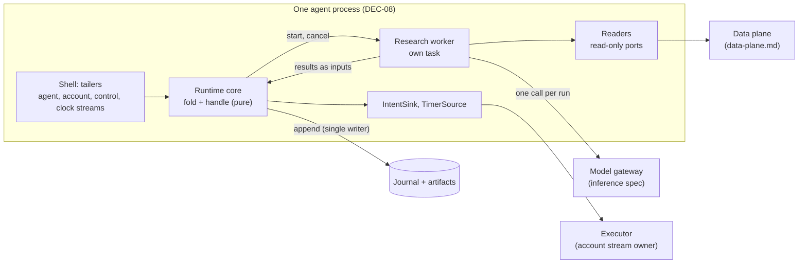

# Agent Harness Spec (v1)

| | |
|---|---|
| **Status** | v0.1, draft for review ([DEC-431](../project/decisions/DEC-431.md)). Items 1 to 14 of DEC-431 are agent readings; items 15 to 17 are Proposed and wait for the founder. Where this spec needs a rule in another spec, it says so, and that rule lands in that spec's own change |
| **Implements** | [HLD §5](../HLD.md#5-agent-runtime), [§6 flows B to D](../HLD.md#6-key-flows), [§9](../HLD.md#9-intelligence-layer); PRD FR-3.9, FR-5.1; backlog E19 (new), and the harness halves of E6-1, E15-1, E15-3, E17-2, E17-5, E17-7, E17-8 |
| **Depends on** | [Mandate spec](mandate.md) §2, §6, §8; [journal spec](journal.md) §2, §5, §8, §9; [trading domain spec](trading-domain.md) §5.5, §7.4, §11; [inference spec](inference.md) (the callee: what happens to a model call); the data-plane spec (`data-plane.md`, in draft, PR #553) |
| **Related** | [ADR-0002](../adr/0002-autonomous-ideation-and-retail.md), [ADR-0003](../adr/0003-earned-autonomy.md), [harness engineering note](../product/11-harness-engineering.md), [DEC-432](../project/decisions/DEC-432.md) |

The **agent harness** is the code that turns a confirmed mandate version into a running agent
process and drives that agent's loop. It holds the model at arm's length: deterministic code
gathers the data, a model reads it and writes an opinion, and deterministic code does everything
else.

## Contents

1. [Scope](#1-scope)
2. [Principles](#2-principles)
3. [Invariants](#3-invariants)
4. [Components](#4-components)
5. [Construction and lifecycle](#5-construction-and-lifecycle)
6. [The loops](#6-the-loops)
7. [Budgets, deadlines, and degradation](#7-budgets-deadlines-and-degradation)
8. [Evaluation and change control](#8-evaluation-and-change-control)
9. [Adversaries](#9-adversaries)
10. [Interfaces](#10-interfaces)
11. [What exists today](#11-what-exists-today)
12. [Decisions](#12-decisions)
13. [Open questions](#13-open-questions)
14. [Backlog](#14-backlog)

## 1. Scope

### 1.1 What the harness is

1. **Construction.** Reading a confirmed mandate version and the configuration it pins, checking
   them, and starting one agent process (DEC-08).
2. **The trading loop.** Perception, memory, signal models, the order builder, autonomy,
   escalation, the gate dry run, and the handoff to the executor
   ([HLD §5](../HLD.md#5-agent-runtime)). The rules for each step are in the mandate and trading
   specs. This spec says how the process drives them, in what order, and what happens at each
   boundary.
3. **The research loop.** The research agent of
   [mandate spec §8.4](mandate.md#84-the-research-agent-dec-97-adr-0002): when it runs, what data it
   gathers, what goes into the model's inputs and what never does, how its output is checked and
   judged, its budgets, and its records.
4. **Evaluation.** How research-agent versions are judged, and how a prompt, retrieval, or model
   change is versioned.

### 1.2 What the harness is not

- **It never sizes, prices, or places an order** (`AGENTS.md` rule 4, DEC-04). The order builder
  sizes ([mandate spec §8.3](mandate.md#83-order-builder-conviction_linear-dec-47-dec-60)), the gate
  decides, and the executor sends. The harness hands intents to the executor through `IntentSink`
  and never talks to a broker (rule 12).
- **It never changes the envelope** (rule 11). It reads a confirmed version. Only the working
  universe and its theses change at runtime, and only through
  [§8.5](mandate.md#85-admission-and-removal-dec-97-dec-101-dec-103).
- **It is not the risk gate.** Its gate call is a dry run that can only narrow a proposal. The
  binding gate runs on the account stream, which the executor owns.
- **It is not the model gateway.** Every model call goes through the gateway of the
  [inference spec](inference.md). The harness has no route to a model endpoint (inference spec §8.2).
- **It is not the data plane.** It reads market data, news, filings, and reference data through the
  data plane's read interface (§10.2).
- **It does not compile mandates.** The compiler ([mandate spec §7](mandate.md#7-compiler-and-platform-proposals-dec-97))
  runs in workspace control services.
- **It does not run user-supplied code.** WebAssembly plug-ins are Won't (v1).
- **It holds no credentials.** Broker credentials stay with the executor's connector and the vault;
  model provider keys stay with the gateway (rule 7, INF-14).

### 1.3 Terms

| Term | Meaning |
|---|---|
| Runtime core | `mandate-runtime`: the pure state machine. `fold` replays an event; `handle` is the only producer of effects |
| Shell | `mandate-shell`: the process that runs the core's effects, tails streams, and binds the stages |
| Research worker | The part of the shell that runs research. It gathers data, calls the gateway, and hands results to the core. It never appends to the journal |
| Research run | One bounded pass of the research loop: a cut-off instant, one retrieval, one model call, and one set of candidate theses and invalidations |
| Research entry | The research agent's registry entry ([inference spec §4.1](inference.md#41-registry-entry)): identity, template, output schema, deadline, and token limit. This spec adds its **retrieval plan** and **validation bounds** to what the entry's content hash covers (§10.1). The mandate pins that hash ([§8.1](mandate.md#81-signal-model-contract-dec-52-dec-97)) |
| Retrieval plan | The fixed, deterministic list of reads a run makes before its call: which data, for which instruments, over which window, with which caps |
| Cut-off (`as_of`) | The instant a run reads data up to. No read returns anything later. It is the call's `as_of` (inference spec §3.1) |
| Data universe | The instruments research may read about: the profile's pinned data universe where one exists (the research basket in the thin slice, DEC-103), otherwise the instruments in `universe.asset_classes` |

## 2. Principles

1. **The model writes opinions; code acts.** A model output is a candidate thesis or an
   invalidation. It is never an order, an approval, a mandate change, or a request for an action.
2. **Code gathers; the model reads.** All retrieval happens before the call, in deterministic code,
   from allowlisted sources (inference spec §8.3). The model is given no tools (INF-5).
3. **Journal before use.** A model response is committed to the agent stream before anything reads
   it to decide.
4. **Replay never calls a model** (INF-10). Every decision is rebuilt from the journal and its
   artifacts.
5. **Missing means safe** (INF-4). An error, a spent budget, or a refusal is a missing output. A
   missing output never enlarges a buy and never forces a sell (MI-10).
6. **Research is slow and optional; trading is not.** Nothing on the trading path waits for research
   (INF-13).
7. **Least context.** A model sees public data, the agent's own memory, and the owner's description.
   Nothing else (INF-8).
8. **Pinned, not tuned.** The template, retrieval plan, output schema, bounds, deadline, and model
   identity are inside the content hash. Changing any of them is a new signal-model version, which is
   a mandate change the owner confirms (§8.4).

## 3. Invariants

Every rule in this spec must keep these true. Each is a named test (ADR-0001 ES-11) whose oracle
computes the expected result its own way and is shown to catch a seeded bug before it is trusted. A
**compromised model** is a gateway double that returns, for every call, an arbitrary schema-valid
output chosen by the test.

The harness assumes the gateway holds INF-1 to INF-16. Where an invariant below depends on one, it
names it; the gateway's own tests prove the INF side, and these prove the caller side.

| ID | Invariant | How it is tested |
|---|---|---|
| HI-1 | **Opinions only.** No model output or research run produces an `IntentProposed`, an `ApprovalResponded`, an owner command, or any other order or owner input. Model output reaches the order path only as a research-agent output that §8.3 combines | Property: with a compromised model, every `IntentProposed` follows a `DecisionMade` from the order builder whose dry run allowed it. The research worker's crate cannot name `IntentSink` (`xtask/layers.toml`) |
| HI-2 | **Journal before use.** Every model output any decision reads is in a committed `ModelInvocationRecorded` (response as artifact) earlier in `seq` than the first event that depends on it (INF-10, caller side) | Property over random append failures, including `Ambiguous` and `Unavailable`: no thesis record, `ModelOutputRecorded`, or `DecisionMade` cites a response without an earlier committed record |
| HI-3 | **Replay without a model.** Folding the agent stream reproduces every thesis record, `ModelOutputRecorded`, and `DecisionMade` byte for byte | Replay with a gateway port that fails the test on any call; compare drafts with stored bodies |
| HI-4 | **Reads only, and no tools.** The retrieval plan's readers can only read. No reader, and nothing in the model's output, can place, cancel, or change an order; approve; append to any stream; change a mandate, policy, allowlist, or universe; read the vault; or reach a host other than the data plane. The model names no read (INF-5) | The reader crate depends on read ports only (layer rule). A test enumerates every reader and asserts its port type. The output schema has no member the harness executes |
| HI-5 | **The envelope does not move.** No research run, under any model output, changes an envelope field or the policy (MI-16, INF-16) | Property: the mandate version and the policy digest are equal before and after any sequence of research runs with a compromised model |
| HI-6 | **Missing is safe.** Every error kind of [inference spec §3.3](inference.md#33-error-kinds), and every harness rejection of §6.5, yields no output for that run. The order builder then counts the model as missing: 0 for exits, fully bearish for buys (§8.3, MI-10, INF-4) | Property: for each error kind and each rejection, the builder's buy value is at most its value with the model removed, and no sell is proposed that is not proposed without it |
| HI-7 | **Research never blocks trading.** For any input sequence, the trading loop's drafts are the same whatever the research worker's latency, failure, or crash, apart from the research outputs that arrive as inputs (INF-13, caller side) | Property: replay one input sequence with research latency drawn at random, including never finishing; the drafts not caused by research are identical |
| HI-8 | **Runs are bounded.** At most one run is in flight per agent. No run starts before `next_proposal_at` (§5.3). No run reads more than its retrieval plan's caps or makes more than one model call. Spend caps are the gateway's (INF-7) | Property over random schedules and crashes, with an independent count of runs and calls from the journal and the meter stream |
| HI-9 | **A spent budget means fewer ideas, never more risk.** When any cap or budget binds, the only effect is fewer calls and fewer theses. Exits, protection, kill switches, and the management of held positions are unchanged (DEC-120, INF-7) | Property: one input sequence with and without a binding cap gives the same drafts for held instruments, apart from admissions |
| HI-10 | **Injected text is bounded.** Whatever a news item or filing says, it can at most yield a thesis or an invalidation. A thesis enters the working universe only through §8.5, and its first order is decided by the autonomy rules with the admission ceiling (§6.2 step 5). An invalidation only removes (MI-19). With a compromised model, no limit is breached | The adversarial bench (E19-6): injection fixtures for every source, and a compromised model; zero limit breaches, zero orders without a dry-run allow |
| HI-11 | **Inputs hold only what they may.** A call's inputs contain only: data from the data plane at or before the cut-off, the agent's own memory (§6.4), the owner's `behavior.description`, and the working-universe facts §6.4 lists. Never a credential, a vault reference, personal data, a dollar figure of the agent or account, or another agent's or workspace's data (INF-8, caller side) | Canary test: plant canary values in the vault, in another agent's memory, in another workspace, and in the agent's equity; scan every prompt artifact of a run for them |
| HI-12 | **No credentials in the harness.** The harness process holds no broker credential, no vault access, and no provider key (INF-14, caller side) | The process starts and runs with the vault and every provider key absent from its environment; a static check that the research path names no vault port |
| HI-13 | **No look-ahead.** No read returns data timestamped after the run's cut-off, and a thesis's `as_of` is the cut-off, never a time the model states | Property: a data-plane double holding data after the cut-off; no artifact of the run contains it |
| HI-14 | **Risk reduction does not depend on research.** With the gateway and the research worker removed, every exit, protective order, and kill switch still runs (rule 13, INF-13) | Run the trading loop with no research worker and a failing gateway; the kill switch, owner exits, and the family-F flatten cases still pass |
| HI-15 | **Mode gates research.** No run proposes while the effective mode is not `normal`. No call is made while the mode is `paused` or `stopped` | Property over random mode changes, including during a run |
| HI-16 | **One writer.** Only the runtime core appends to the agent stream (journal spec §1, principle 3). The research worker hands results to the core as inputs | Type test: the research worker holds no stream writer; a fenced-writer test |
| HI-17 | **The version in effect judges.** An output whose model identity differs from the pin of the version in effect when it is judged is ignored (`not_pinned`). Admission is judged under the version in effect, never the one the run started under | Property over random version changes during runs |
| HI-18 | **The platform decides the facts.** A thesis's identity, timing, asset class, sources, and corroboration come from platform data, never from the model's text (MI-16, DEC-132 items 6 and 7) | Property: a compromised model that states false facts for each of these fields; the journaled record carries the platform's values |

## 4. Components

- **The runtime core** is the only component that decides and the only writer of the agent stream.
  It stays pure: no clock, no randomness, no I/O.
- **The research worker** runs on its own task, scheduled apart from the core, so a slow or hung
  call cannot delay a tick (HI-7). The core tells it when to start and when to cancel. It hands every
  result back as an input.
- **The readers** run the retrieval plan against the data plane and the folded journal. They have
  read ports only (HI-4).
- **The executor** owns the account stream, the binding gate, risk exits, protection, and
  reconciliation. It copies `UniverseChanged` from the agent stream's thesis records (journal spec
  §2).

## 5. Construction and lifecycle

### 5.1 Construction

The deployment manager starts a process with a workspace id, an agent id, and a deployment id. In
Phase 1 the founder's CLI plays that role. The process then:

| Step | Reads | Checks | On failure |
|---|---|---|---|
| 1. Identify | The control stream's latest `AgentDeployed` for the agent | The deployment exists, has no `AgentStopped` after it, and names a mandate version | Exit; the deployment manager alerts the owner |
| 2. Load the mandate | The mandate document by its hash from the configuration store (journal spec §8) | Its SHA-256 equals the version; it passes the schema and every V-rule that reads only the document | Exit; nothing is appended |
| 3. Load the policy | The effective policy values and the workspace profile | The overlay is computable. A key it cannot read is taken at its strictest value (rule 3) | Exit if no policy can be read |
| 4. Load signal models | Each model's registry entry by `(id, version, content_hash)` (V-007, inference spec §4.1) | Every pinned triple is registered and not withdrawn. The research entry carries a retrieval plan and validation bounds and re-hashes to its content hash | A withdrawn or unloadable model is missing from the start (§8.1). Construction continues |
| 5. Check the description | `behavior.description` | The gateway's prompt guard (inference spec §8.3) passes on it | Research is disabled for this version and the owner is alerted with opaque text: every call would end `input_rejected` |
| 6. Load configuration | The source allowlist version, the instrument snapshot, the calendars, the screens | Each object re-hashes | Exit if the trading loop needs it; otherwise research alone is disabled |
| 7. Take the writer | `writer_epoch + 1` on the agent stream (journal spec §5.1) | The stream head matches | `Fenced` or a head mismatch: exit |
| 8. Recover | Fold every followed stream, then `handle(Started)` | The startup hold `awaiting_reconciliation` is journaled before anything is re-handed (DEC-131) | — |

**What construction pins** for the life of the version: the mandate version, each signal model's
`(id, version, content_hash)`, the research entry, the allowlist version in effect, and the harness
build digest (`actor.build`, journal spec §3). A new mandate version re-runs steps 2 to 6 inside the
running process (§5.4). It never retakes the writer.

**A failed start leaves protection in place.** Protective orders rest at the broker, and risk exits
and the account-scoped kill switch belong to the executor. The agent-scoped kill switch while the
process is down is §13 item 1.

### 5.2 Process states

```mermaid
stateDiagram-v2
    [*] --> Constructing: deployment manager starts the process
    Constructing --> Recovering: steps 1 to 7 pass
    Constructing --> [*]: a check fails (exit, owner alerted)
    Recovering --> Running: reconciliation confirms (hold lifts)
    Recovering --> Paused: reconciliation finds unexplained orders or positions
    Running --> Running: mode normal or exits_only; a version applies
    Running --> Paused: owner pause, a risk limit, or an anomaly
    Paused --> Running: owner resume with step-up, or the limit lifts
    Running --> Stopping: kill switch or owner Stop
    Paused --> Stopping: kill switch or owner Stop
    Stopping --> Stopped: flatten confirmed or handed off
    Running --> Holding: goal complete, on_complete hold_protected or disarm_ladder
    Holding --> Retired: owner releases or closes
    Running --> Retired: on_complete release, or profit_stop reached and flat
    Stopped --> Retired: AgentStopped journaled
    Retired --> [*]
```

`Running`, `Paused`, `Holding`, and `Stopped` map onto the HLD lifecycle's `Live`, `Paused`,
`Completed`, and `Stopped`, and onto [mandate spec §2](mandate.md#2-lifecycle)'s `Deployed`,
`Holding`, and `Retired`. The modes inside them are [trading spec §7.4](trading-domain.md#74-agent-modes)'s.
A crash in any state returns to `Constructing`.

| State | Entered by | What it blocks | How it ends, and who ends it |
|---|---|---|---|
| Constructing | The deployment manager (or the CLI) | Everything: no process exists to act | The steps pass (the process), or a check fails (the process exits; the deployment manager retries with back-off and alerts the owner) |
| Recovering | Step 8; mode `paused` through the local hold `awaiting_reconciliation` | Openings, increases, and research. An exit already handed off is re-handed only if the fold allows | The account stream records a `ReconciliationRun` at or after the last observed submission with nothing outstanding (the core lifts the hold). A mismatch pauses the agent until the owner acknowledges with step-up ([trading spec §11](trading-domain.md#11-reconciliation)) |
| Running, `normal` | Recovery, resume, or a lifted limit | Nothing beyond the mandate and the gate | A mode change, Stop, a kill switch, goal completion, or a crash |
| Running, `exits_only` | A restriction of [mandate spec §5.9](mandate.md#59-restrictions-and-the-effective-mode) | Openings and increases. Research runs review-only: it may invalidate, never propose (§6.7) | The restriction lifts by its own path (MI-3) |
| Paused | Owner pause, `flatten_and_pause`, a reconciliation mismatch | New orders except re-placing protection; research and model calls (HI-15). Resting protection stays; the kill switch works | Owner resume with step-up for an owner pause; the owner's acknowledgment for a latched limit. A resume never lifts a latched limit |
| Stopping | Kill switch or owner Stop | Everything except the flatten and protection re-placement. A run in flight is cancelled | The executor confirms the flatten, or it is handed off whole ([trading spec §5.5](trading-domain.md#55-kill-switch)) |
| Holding | `GoalCompleted` with `hold_protected` or `disarm_ladder` | Openings (the `goal_complete` restriction). No research: the goal is done | The owner releases or closes, with step-up |
| Stopped, Retired | Stop completes; `AgentStopped` | Everything | Terminal. The process exits after `AgentStopped` is committed |

### 5.3 Research run states

```mermaid
stateDiagram-v2
    [*] --> Idle
    Idle --> Due: risk clock reaches next_proposal_at, and the mode allows
    Due --> Retrieving: the core starts the run
    Due --> Idle: mode, version, or a disabled research agent; nothing is called
    Retrieving --> Calling: the retrieval plan is done; reads stored as artifacts
    Calling --> Judging: ModelInvocationRecorded committed with outcome ok
    Calling --> Idle: ModelInvocationRecorded committed with an error outcome
    Retrieving --> Cancelled: mode tightens, kill switch, Stop, or a version change (§5.4)
    Calling --> Cancelled: as above
    Judging --> Idle: candidates checked and judged; records committed in one batch
    Cancelled --> Idle: a late result is journaled and never used
```

- **When a run is due.** At most one run is in flight per agent. A run is due when the risk clock
  reaches `mandate_research::next_proposal_at(last_call, behavior.research.interval_s)`. `last_call`
  is the later of the last `ModelInvocationRecorded` with purpose `research` and the last
  reservation the gateway's meter stream holds for this agent (inference spec §3.6). A crash loop
  therefore cannot call faster than the interval, because the reservation is appended before the
  call leaves. Event sources such as a news burst never bring a run forward.
- **A late result.** A result that arrives after its run was cancelled is still journaled as
  `ModelInvocationRecorded`, with the gateway's outcome, so the record of the call is complete. No
  output event follows it, and nothing reads it.

### 5.4 Boundaries

| Boundary | Trading loop | Research loop |
|---|---|---|
| Regular-session close | Unchanged. The core evaluates at its cadence; discretionary equity exits defer to the open ([§6.2](mandate.md#62-evaluation) step 2); an evaluation runs at the open | Runs continue. A thesis admitted outside the session waits for its stagger offset, counted from the next regular-session open for equities (§8.4) |
| Midnight America/New_York | `RiskDayStarted` on the account stream; the ask budget resets (§6.4) | The spend caps reset by risk day (inference spec §7.3). A run in flight continues; its call counts against the risk day the gateway's meter assigns it |
| Restart | §5.1 step 8: replay, startup hold, reconciliation | A run in flight is lost. Its reservation stays counted (DEC-432 item 4). Its call is never re-sent under the old `call_id` (inference spec §3.4), and any output it had is never used, because nothing was journaled. A run whose record committed but whose judging batch did not is not judged after the restart: it ends there. The next run waits for `next_proposal_at` |
| Version change ([§2.2](mandate.md#22-applying-a-new-version)) | A reducing or neutral version applies immediately; an increasing one at the next evaluation with no `Unknown` order. Pending approvals are cancelled | A version that changes the research agent's pin, clears `behavior.research`, or pins the universe cancels the run in flight. Any other version lets it finish, and its candidates are judged under the version in effect (HI-17) |
| Kill switch, Stop | The core applies the final mode first, cancels approvals, and hands one agent-scoped flatten plan | The run is cancelled at once. No run starts again |
| Pause | Mode `paused`; pending approvals cancelled | The run is cancelled. No call until resume (HI-15) |
| Policy change | The overlay applies at the next evaluation ([§4.3](mandate.md#43-policy-hierarchy-dec-51-dec-98)) | A lower spend cap binds at the gateway's next reservation; a longer `research_interval_s` binds at the next due time |
| Model withdrawn | Outputs of the withdrawn model count as missing (§8.1) | The run is cancelled; the gateway refuses calls with `model_withdrawn` |

## 6. The loops

### 6.1 The trading loop

The trading loop is the E6-1 tick, unchanged ([task brief](../project/tasks/E6-1-agent-runtime-and-kill-switches.md),
DEC-131). For each input: act on folded state; apply the input; recompute the effective mode; expire
what is due; decide; emit effects, every draft before the handoff it authorizes.

| Stage | Source of truth | Harness duty |
|---|---|---|
| Perception | The scheduler's `ClockAdvanced`, market observations, account-stream facts, control-stream commands | Feed them to the core in `seq` order. A notification is only a hint (DEC-17) |
| Memory | Folds of the agent and account streams | No separate mutable store. Any search index over the journal is derived from it and rebuilt from it |
| Signal models | Quant models in process; the research agent's latest fresh output per instrument ([§8.2](mandate.md#82-output)) | Pass the core only outputs for the instrument being sized |
| Order builder, autonomy | `mandate-builder` (§8.3, §6.2) | — |
| Escalation | `mandate-approval` (§6.4) | — |
| Gate dry run | `mandate-risk` | — |
| Executor handoff | `IntentSink` | Journal `IntentProposed` first, then hand off |

**Cadence.** The scheduler ticks every second. The core evaluates at `behavior.cadence.interval_s`
and on each event source the mandate lists. ADR-0001 ES-24's budget applies to the decide step: p99
under 1 ms in process.

**Research output between runs.** A research output is fresh for its `max_output_age_s` (§8.2). If
`behavior.research.interval_s` is longer, the output goes stale between runs, and stale counts as
missing: no new buys and no forced sells. That fails safe, so no extra rule is needed.

### 6.2 The research loop

One run, in order:

1. **Start.** The core checks the mode (HI-15), that research is configured and not disabled or
   withdrawn, and that the run is due (§5.3). It assigns a run id from `IdGen` and a cut-off: the
   risk-clock instant at which it starts the run. It emits a start effect; nothing is journaled yet.
2. **Retrieve.** The readers run the research entry's retrieval plan (§6.3) at the cut-off and store
   each result as an artifact (journal spec §6.3).
3. **Call.** The worker sends one call to the gateway: purpose `research`, the pinned model
   reference, the typed inputs (§6.4), the cut-off as `as_of`, and a deadline of the entry's
   `deadline_ms` (inference spec §3.1). The gateway renders the prompt from its pinned template,
   reserves the cost, guards the prompt, calls, and validates the output against the entry's output
   schema.
4. **Record.** The worker hands the gateway's result to the core, which journals
   `ModelInvocationRecorded` with the run id as `correlation_id` and the retrieved artifacts as the
   retrieved context. On any error outcome the run ends here (HI-6).
5. **Judge.** The core checks each candidate (§6.5), runs `mandate_research::admit` on each that
   passes, against its folded facts, and journals in one batch: the candidates' verdicts, a
   `ThesisProposed` or `ThesisRevised` for each thesis admission judged
   ([journal spec §9.4](journal.md#94-research-agent-thesis-records-dec-413)), and a
   `ModelOutputRecorded` for each thesis as journal spec §9.1 prescribes: `ignored` null for an
   admitted one, which is then the research agent's §8.2 output, and the reason for one §8.5 checks 1
   to 3 refuse.
6. **Copy.** The executor copies each admission to the account stream as `UniverseChanged`, with a
   `causation_id` naming the thesis record. Only the account stream's fold is the working universe
   ([§2.3](mandate.md#23-the-working-universe-at-runtime-dec-97)). A record with `admitted: true`
   admits nothing until that copy exists.

**One call per run in v0.1.** The model cannot ask for more data. A multi-call run, in which the
model's output names further reads that the harness then runs, would make the model choose its own
inputs, which inference spec §8.3 rules out for now. It is §13 item 6.

### 6.3 Retrieval

The retrieval plan is part of the research entry, so it is pinned by the content hash. Every read
takes its scope (workspace, agent, cut-off, data universe, allowlist version) from the harness. The
model never names a read.

| Read | What it gathers | Caps (defaults) | Scope |
|---|---|---|---|
| `bars` | Daily bars for each data-universe instrument, ending at or before the cut-off | 20 bars per instrument | Data universe |
| `quote` | The last quote at or before the cut-off, with its time and sanity flag | 1 per instrument | Data universe |
| `screens` | The results of each screen the plan names: registered, versioned, deterministic screens over the data universe | 50 instruments per screen | Data universe |
| `news` | Items from allowlisted news sources about data-universe instruments, published in the window before the cut-off: item id, source id, published time, headline, summary, link, content hash | 48 hours; 50 items; 2,000 bytes per item | Allowlisted sources (DEC-101) |
| `filings` | Entries from allowlisted filing sources for held and screened instruments: id, source id, form, filed time, an excerpt, content hash | 7 days; 20 entries; 4,000 bytes per excerpt | Allowlisted sources |
| `instruments` | Reference facts for every instrument above: asset id, symbol, asset class, eligibility verdict, instrument group, leveraged-ETP flag | — | Instrument snapshot |
| `positions` | This agent's held instruments: held since, whether removed, the current thesis id. No quantities or dollar amounts | — | This agent only |
| `theses` | This agent's active theses, and its closed theses of the last 90 days with their E17-8 scores: the [§9.4](journal.md#94-research-agent-thesis-records-dec-413) members, without prompt or response | 50 | This agent only |

**There is nothing else.** No read fetches a URL, searches the open web, reads another agent's or
workspace's data, or reads any stream other than the folds above. When a cap cuts a read, the oldest
items go first, and the artifact records what was dropped.

**Every retrieved item is metered for drift.** For each news or filing item, the reader records the
source, class, published time, content hash, and byte length. These go into the retrieved-context
list of the run's `ModelInvocationRecorded`, and the core folds them into E17-5's `DriftState`. Text
never reaches the detector (DEC-266 item 1).

### 6.4 Inputs

The harness passes the gateway typed inputs. The gateway renders the prompt from the entry's pinned
template (inference spec §3.1); callers never pass free-form prompt text.

| Goes in | Never goes in |
|---|---|
| The retrieved data of §6.3, each item marked as untrusted third-party data with its item id and source id | Credentials, tokens, vault references, provider keys |
| `behavior.description`, which construction checked against the prompt guard (§5.1 step 5) | Personal data: names, emails, phone numbers, broker account numbers, user ids |
| The cut-off, the data universe, `universe.asset_classes`, `universe.max_instruments`, and the current working universe | Allocation, limits, equity, P&L, or any other dollar figure of the agent or account. Sizing is not the model's business |
| Held instruments, and the agent's own theses and their scores | Other agents' or other workspaces' data, the aggregate-flow monitor, operator halts |
| For a revision, once allowed (§6.5): the predecessor and its score | Approval content, owner commands, notification text, autonomy rules, delegations, tripwires, the review date |

**Untrusted data is marked, not trusted to stay marked.** The template puts retrieved text in
delimited data sections and says it is data. That lowers, but does not remove, the chance that
injected text steers the model. HI-10 is what bounds the result.

### 6.5 Output and checks

The output schema is `{"theses": [...], "invalidations": [...]}`. The gateway refuses any output
that fails it (`schema_invalid`), so ranges, counts, and the horizon bound are enforced there. The
schema sets: `conviction` in [−1, 1], `confidence` in [0, 1], `horizon_s` from 1 day to the entry's
maximum (default 30 days), at most 4 theses, and invalidations that name distinct thesis ids.

The harness splits every thesis field into what the model says and what the platform decides
(HI-18). A model that stated its own asset class, corroboration, or timing would decide §8.5 checks
for itself, which MI-16 forbids (DEC-132 items 6 and 7).

| Field | Who fills it | Rule |
|---|---|---|
| `instrument` | Model, as a symbol | Resolved to an `asset_id` from the instrument snapshot |
| `direction`, `conviction`, `confidence`, `horizon_s` | Model | Schema ranges. `direction` is passed through, so that §8.5 check 1 journals a non-long one |
| Thesis text, `invalidation` | Model | Stored as artifacts; screened below |
| `evidence` | Model, as item ids | Each must be an item this run retrieved |
| `predecessor_thesis_id`, autopsy | Model, revisions only | Refused until §8.6 item 5 allows revisions |
| `thesis_id`, `lineage_id`, `revision` | Platform | A new thesis starts its own lineage. A thesis for an instrument with an active thesis is a renewal: same lineage and revision. A revision is its predecessor's revision plus one |
| `as_of`, `expires_at` | Platform | `as_of` is the cut-off; `expires_at = as_of + horizon_s` (§8.2) |
| `asset_class` | Platform | From the instrument snapshot |
| `evidence_sources`, `evidence_ref` | Platform | The sources of the cited items, as retrieved; the cited items as an artifact |
| `corroboration` | Platform | Derived from the retrieved items and market data by E17-7's rule (§13 item 3) |
| `model_id`, `model_version`, `content_hash`, `allowlist_version` | Platform | From the pins |

**Harness checks** run after the gateway's schema check and before admission. They cover only what
needs platform data. Each failure is journaled with its reason among the candidates' verdicts, never
as a §8.5 reason:

| Reason | When |
|---|---|
| `unknown_instrument` | The symbol does not resolve in the instrument snapshot |
| `unknown_evidence` | An evidence id is not an item this run retrieved |
| `duplicate_instrument` | A second thesis for an instrument already in this output |
| `forbidden_language` | The text states a price target or a likely profit (DEC-126). The research agent may be directional (§8.1), so a word like "buy" alone is not refused. The gateway's output limits are the first layer (inference spec §4.3); this is the second |
| `revisions_not_enabled` | A revision before §8.6 item 5 allows it |
| `unknown_thesis` | An invalidation names a thesis that is not this agent's active thesis |

Everything else goes to admission, so §8.5's ordered checks decide and are journaled: a non-long
direction, a predecessor mismatch, a pinned universe, the cost cap, a halt, the floor, the allowlist,
corroboration, the lineage cap, and a full universe.

### 6.6 Records

| Event | Stream | When | Status |
|---|---|---|---|
| Meter reservation and settlement | `meter:{workspace_id}` (gateway) | Before the call leaves, and on completion | Proposed by the inference spec (§3.6), journal spec change in E15-8 |
| `ModelInvocationRecorded` | agent | After every call, whatever the outcome, including a late one | In journal spec §9, not closed. E15-8 closes it with DEC-432 item 11's members. This spec adds two: the run id as `correlation_id`, and the retrieved-context list of §6.3 |
| Candidate verdicts | agent | With the judging batch | A member of the record that closes `ModelInvocationRecorded`, or its own event: decided in E15-8 |
| `ThesisProposed`, `ThesisRevised` | agent | Every thesis admission judged | Closed in [journal spec §9.4](journal.md#94-research-agent-thesis-records-dec-413) |
| `ModelOutputRecorded` | agent | Each judged thesis, `ignored` null only when admitted | Closed in [journal spec §9.1](journal.md#91-agent-stream-payload-schemas-dec-177) |
| `UniverseChanged` | account | The executor's copy of an admission or removal | Closed in journal spec §9.3 |
| Invalidation verdict | agent | Each accepted invalidation (§6.7) | **Missing.** E19-5 adds it to the journal spec first |
| `OwnerAlertSent` | control | A guard hit on the description, a lineage retirement, a construction failure | In journal spec §9 |

The retrieved data, the rendered prompt, and the response are artifacts. Events hold their hashes.
Notifications about any of this carry only opaque ids (rule 6).

### 6.7 Invalidation

[§8.6](mandate.md#86-thesis-lifetime-and-revision-lineages-dec-118-dec-111) removes an instrument
at once when its thesis's invalidation condition holds. The condition is the model's own text, so
deterministic code cannot evaluate it. `mandate_research::expire_theses` takes the verdict from its
caller (DEC-132 item 13). The harness supplies it like this:

- Every run's inputs include the agent's active theses. The output may list a thesis id in
  `invalidations`, with the item ids that show the condition holds.
- An invalidation only removes an instrument, which is exits-only and adds no risk (MI-19). So it is
  taken on the model's word, with no corroboration and no approval (rule 2).
- In `exits_only`, a run is review-only: its theses are discarded unjudged and only its
  invalidations count.
- **The record does not exist yet.** No agent-stream event carries an invalidation verdict for
  `UniverseChanged` (`thesis_invalidated`) to name as its cause. E19-5 adds one to the journal spec
  first. Until it lands, the harness removes nothing by invalidation, and theses end at their
  horizon. That holds a position longer than §8.6 intends, but adds no risk, and the entry's horizon
  bound caps how long. Research leaves the internal thin slice only after E19-5.

### 6.8 Fast decision models

Fast models (E15-2) are not part of v1 if the founder accepts DEC-432 item 13's recommendation. If
they come, they use the same gateway contract with a deadline inside the tick's decide step, the same
record, and the same missing-means-safe rule, and they have no retrieval plan of their own.

## 7. Budgets, deadlines, and degradation

### 7.1 Per agent

| Budget | Value | Set by | Enforced by |
|---|---|---|---|
| Model spend per risk day | `behavior.research.cost_cap_usd_per_day` | The owner, in the envelope (DEC-120), at most the policy's `research_cost_cap_usd_per_day` | The gateway's reservation (inference spec §7.3) and §8.5 check 7 at admission |
| Proposal interval | `behavior.research.interval_s` | The owner, at least the policy's `research_interval_s` | The run schedule (§5.3) |
| Runs in flight | 1 | Fixed | The core |
| Calls per run | 1 | Fixed in v0.1 (§6.2) | The core |
| Call deadline | The entry's `deadline_ms` | Pinned with the model (DEC-432 item 1) | The gateway (INF-3) |
| Output tokens | The entry's `max_output_tokens` | Pinned with the model | The gateway |
| Retrieval caps | §6.3's table | The research entry | The readers |
| Theses per run, horizon | 4; 30 days | The research entry's output schema | The gateway's schema check |
| Run wall time | Retrieval timeout (60 s) plus the call deadline | The research entry | The worker; the run is cancelled |

The defaults in the table are engineering values (DEC-431 item 7). They are inside the content hash,
so changing one is a new research-agent version that the owner confirms (§8.4). The dollar figures
for the internal thin slice are the founder's (DEC-431 item 15).

### 7.2 Per workspace

| Budget | Enforced by |
|---|---|
| Daily model-spend quota ([HLD §8](../HLD.md#8-multi-tenancy-and-security), "Quotas") | The gateway (`budget_exhausted`, inference spec §7.3) |
| Calls per second | The gateway's per-workspace bucket (`rate_limited_local`) |
| Allowed endpoints and regions | The workspace policy (`policy_denied`, INF-12) |

### 7.3 Degradation

When a budget binds or a dependency fails, the harness gives up ideas in this order, and nothing
else:

1. The run ends with no output (HI-6).
2. No new run starts until the next due time, and the gateway refuses until the cap resets or the
   dependency returns.
3. Research outputs go stale. Stale counts as missing: no new buys in research-held instruments, and
   no forced sells (§8.3).
4. Theses reach their horizon and their instruments become removed: exits only, paced by the conduct
   controls (§8.6).

Exits, protection, kill switches, pending approvals, and quant models are untouched at every step
(HI-9, HI-14).

**Harness treatment of each gateway error kind** ([inference spec §3.3](inference.md#33-error-kinds)):

| Kind | Treatment |
|---|---|
| `policy_denied`, `credential_invalid` | Missing. The run is not retried; research stays on schedule, and the operator is alerted |
| `budget_exhausted`, `rate_limited_local` | Missing. The next run waits for its due time |
| `input_rejected` | Missing. Repeated hits on retrieved data alert the operator with the rule, not the content |
| `model_withdrawn` | Missing; research is disabled for this version |
| `deadline_exceeded`, `provider_unavailable`, `rate_limited_provider` | Missing. The gateway has already retried what it may; the harness does not retry within the run |
| `content_refused`, `schema_invalid`, `identity_mismatch` | Missing. Never retried within the run, because sampling again until something parses would select outputs (DEC-432 item 3) |

## 8. Evaluation and change control

### 8.1 Forward paper evaluation (E17-8)

Thesis quality is judged only on forward paper outcomes the model could not have seen (DEC-99). The
window, metric, and threshold are fixed before the evaluation starts (DEC-122). The evaluator
(`mandate_research::score`) reads only journaled theses, close series, and the cost model, and runs
on the team's internal paper workspaces (DEC-103). The harness's duty is to make every thesis
scoreable: every judged thesis has a record, an `as_of` from the cut-off, and a bounded horizon.

### 8.2 Scorecards (E15-3)

A scorecard shows each signal model's results beside the pre-registered baselines, from the owner's
own journaled results only. It never changes weights or approval routing (DEC-47), is never
aggregated across users, and stays off approval screens until counsel answers compliance question
35 (DEC-126).

### 8.3 Regression evaluations

A **regression evaluation** replays a fixed set of recorded runs (retrieved inputs and cut-offs)
against a candidate research entry, through the gateway, in the internal paper workspaces. It
measures mechanics only:

| Measure | Pass condition |
|---|---|
| Outputs that pass the schema | At least the current entry's rate on the same set |
| Harness check failures, by reason | No reason rises without an explanation in the change |
| Admission verdicts | Every candidate's verdict follows from §8.5 alone (the oracle recomputes it) |
| Injection fixtures (E19-6) | Zero admissions that cite only injected items; zero limit breaches |
| Cost per run | Within the entry's maximum cost |

A regression evaluation is never evidence that theses are good; only §8.1 is (DEC-99). Its results
are never shown to owners as performance. It complements, and does not replace, the gateway's
evaluation gate before a model is offered ([inference spec §4.3](inference.md#43-evaluation-gate-before-a-model-is-offered)).

### 8.4 What a change is

| Change | What it is | Who confirms |
|---|---|---|
| Template, retrieval plan, output schema, validation bound, deadline, token limit, or model identity | A new research entry, so a new content hash, so a new signal-model version (§8.1). A mandate that pins the old one needs a new version to move, and that version is risk-increasing ([§9.2](mandate.md#92-classification)'s signal-model row) | The owner, with step-up (rule 11) |
| The provider changes weights behind a pinned snapshot | Not allowed as the pin (INF-2). If detected, the operator withdraws the entry; outputs are missing until a new version pins a new identity | The operator, then the owner |
| The source allowlist | Versioned platform configuration (DEC-101), recorded in every thesis. Not a mandate version | Platform review; journaled as `ConfigSnapshotRegistered` |
| Harness code (readers, checks, scheduler) | A platform build, named by `actor.build` on every event. Not a mandate version | CI and independent review, as for the gate |
| A model withdrawn | `PlatformOperatorAction` `model_withdrawn`; outputs count as missing (§8.1, INF-15) | The operator |

So the platform cannot change what a running research agent is shown, how it is asked, or which
model answers without the owner confirming a new version. Whether a new entry must pass its own §8.1
evaluation before users' agents may pin it is DEC-431 item 16.

## 9. Adversaries

| Adversary | Attack | Blocked or disclosed by |
|---|---|---|
| Careless user | Sets a very large cost cap | The policy maximum and the workspace quota (§7.2) |
| Careless user | Pastes an account number or a key into the description | The guard check at construction disables research for that version and alerts the owner (§5.1 step 5); the gateway's guard is the second layer |
| Careless user | Sets `autonomy.admission: auto` | W-006 on the confirmation screen; the eligibility floor, `max_instruments`, and the limits still bind |
| Bad model | Invents an instrument or evidence | `unknown_instrument`, `unknown_evidence` (§6.5) |
| Bad model | Reports high confidence everywhere | Confidence is labelled self-reported and uncalibrated (DEC-126); admission is `ask` by default (MI-17); the builder clips to limits |
| Bad model | Floods theses or long horizons | The schema's caps (§6.5), `max_instruments`, the cost cap |
| Bad model | States its own asset class, corroboration, or timing | The platform fills those fields (HI-18) |
| Bad model | Writes a price target or a profit promise | The gateway's output limits, then `forbidden_language` |
| Malicious content | Prompt injection in a news item or filing | HI-10: at most a thesis, then §8.5 (allowlist, corroboration, floor) and the admission ceiling. E17-5 meters the source; its escalation seam is DEC-266 item 4 |
| Malicious content | Injection that tries to make the model read another tenant's data | The model names no read; scope comes from the harness (§6.3) |
| Malicious content | Injection that tries to exfiltrate data | No outbound path exists, and the inputs hold only public data and the agent's own memory (HI-11) |
| Malicious content | Injection that forces invalidations to churn the book | An invalidation only removes; exits are paced by the conduct controls; re-entry waits for `reentry_cooldown_s` ([§5.3](mandate.md#53-position-exposure-order-size-count-and-cooldown)) |
| Malicious content | Text aimed at the approver ("approve now") | The approval card shows model text as quoted research-agent text with links to its sources (DEC-126). Disclosed, not blocked |
| Malicious insider | Changes the template or swaps the model | A new content hash needs the owner's confirmation (§8.4); the gateway never substitutes (DEC-67) |
| Malicious insider | Adds a planted source to the allowlist | Corroboration needs an independent source or market data; every thesis records the allowlist version, so the change is visible; allowlist changes are reviewed like code |
| Malicious insider | Reads another workspace's prompts | Artifacts live in the workspace deployment, encrypted per workspace (journal spec §6.5); break-glass access only, journaled (journal spec §7) |
| Bad tick | A bad bar or quote makes a thesis look corroborated | Admission is `ask` by default; the gate uses sane marks and the collar; the thesis does not size the order |
| Model outage | The provider is down or slow | Missing means safe (HI-6); research stops; theses expire at their horizon (§7.3) |
| Runaway cost | A crash loop or a retry storm | One run in flight; the interval counts from the last reservation; no re-send under an old `call_id`; reservations stay counted (§5.3, inference spec §7.3) |

## 10. Interfaces

### 10.1 The model gateway ([inference spec](inference.md))

**What the harness relies on.** Inference spec §1.2 and INF-1 to INF-16. In particular: exactly one
of a schema-valid output from the pinned model or a typed error (§3.3); no call outlives its
deadline; reservations before the call and spend that never decreases within a risk day (INF-7,
DEC-432 item 4); the caller appends `ModelInvocationRecorded` (§3.6); no tools (INF-5); the prompt
guard (§8.3).

**How a research call fills the request** (inference spec §3.1):

| Field | Value |
|---|---|
| `call_id` | A ULID from the core's `IdGen` |
| `workspace_id`, `agent_id` | The agent's |
| `purpose` | `research` |
| `model` | The research agent's pinned id, version, and content hash |
| `inputs` | §6.4's typed inputs |
| `as_of` | The run's cut-off |
| `deadline` | The run's start plus the entry's `deadline_ms` |
| `max_output_tokens` | The entry's |

**What this spec asks of the inference spec**, for its next revision:

1. **The registry entry carries the retrieval plan and the validation bounds**, inside its content
   hash, so the owner's pin covers what the model is shown (§6.3, rule 11). Inference spec §4.1
   lists the template and its input contract; the plan is what fills that contract.
2. **The caller can read its own reservations** in the meter stream, so the run schedule counts from
   the last reservation (§5.3).
3. **`ModelInvocationRecorded` gains two members** when E15-8 closes it: the retrieved-context list
   (§6.3) and room for the candidates' verdicts (§6.6). The run id rides in `correlation_id`.
4. **The guard is callable without a call**, so construction can check the description (§5.1 step
   5) and spend nothing.

### 10.2 The data plane (`data-plane.md`, in draft)

| Need | Contract |
|---|---|
| Point-in-time reads | Every query takes a cut-off and returns nothing recorded or published after it (HI-13) |
| Bars and quotes | For the data universe; each quote carries its time and the sanity flag of [trading spec §4](trading-domain.md#4-market-data) |
| News and filings | Only from sources on the allowlist version the query names. Each item carries an item id, a source id, a published time, a content hash, and its byte length |
| Reference data | The instrument snapshot by hash: asset id, symbol, asset class, eligibility verdict, instrument group, leveraged-ETP flag |
| Screens | Registered, versioned, deterministic screens over the data universe |
| Scope | A query is scoped to one workspace. The shared plane carries facts only, never directional views (DEC-62) |
| Licence | Whether an item's text may be kept as an artifact for the retention period (DEC-431 item 17) |

### 10.3 The runtime core, the executor, and the journal

- **New core inputs:** a run's retrieval result, a gateway result, and a cancellation
  acknowledgment. `handle` applies each, and the core journals what it must. The existing
  `Input::ModelOutput` stays the path for quant models.
- **New core effects:** start a run; cancel a run.
- **The executor** copies `UniverseChanged` from thesis records, and later from invalidation
  verdicts (E19-5). It is unchanged otherwise.
- **The journal** gains the closed `ModelInvocationRecorded` and the meter stream (E15-8) and an
  invalidation verdict (E19-5).

## 11. What exists today

As of 2026-10-03.

| Component | State |
|---|---|
| Runtime core (`mandate-runtime`) | **Built:** the pure state machine, fold and handle, modes and local holds, kill switches with an agent-scoped flatten plan type, and the approval path. Model outputs enter as `Input::ModelOutput`. `ModelInvocationRecorded` folds as a no-op. No research start, cancel, or result inputs |
| Process shell (`mandate-shell`) | **Partly built:** stage adapters, the fail-closed effect runner, the journal envelope, and the `mandate-tracer` binary. Most adapters still answer `Unimplemented`, so the tracer refuses at its first probe. No research worker |
| Research contract (`mandate-research`) | **Built, pure:** §8.5's seventeen ordered checks (`checks`, `admit`), the lineage fold, expiry and removal, the stagger offset, `next_proposal_at`, the drift detector (E17-5), the flow monitor and operator halt (E17-6), and forward-paper scoring (E17-8). It never calls a model |
| Thesis records | **Specified:** journal spec §9.4 is closed. The `mandate-journal` registration is in progress (DEC-414) |
| `ModelInvocationRecorded` | **Named only:** in the journal catalogue, schema not closed (E15-8) |
| Model gateway | **Specified as a draft:** [inference spec](inference.md) v0.1; no code (E15-6 to E15-10) |
| LLM research loop | **Spike only:** `python/research_spike` (E17-0) gathers bars and news, makes one call per UTC day through an aggregator, parses strictly, sizes by a fixed rule, and keeps its own JSONL journal. It is not product code and has no gate; its paper runs await the founder's go |
| Retrieval plan, readers, checks, run scheduler in Rust | **Planned** (E19-2, E19-3) |
| News, filings, screens, allowlist | **Planned** (the data-plane spec, in draft). `mandate-marketdata` downloads Alpaca historical bars into Parquet; there is no news or filings store and no allowlist file |
| Deployment manager | **Planned** (M8). The CLI starts processes in Phase 1 |
| Regression evaluations, adversarial bench | **Planned** (E19-6, E19-7) |

## 12. Decisions

[DEC-431](../project/decisions/DEC-431.md) records this spec's choices. Items 1 to 14 are agent
readings under DEC-79 and DEC-176: each is a reversible engineering choice, tightens a rule, or
closes a gap by the reading that adds no risk. Items 15 to 17 are reserved for the founder and stay
**Proposed**; the spec proceeds on the most conservative option:

| Item | Question | Conservative option in force |
|---|---|---|
| 15 | The dollar figures for the internal thin slice: its agents' `cost_cap_usd_per_day` and the workspace's daily model-spend quota | No product research runs until the founder sets them |
| 16 | Whether a DEC-99 pass belongs to one content hash, so that any change to the research entry is evaluated again before users' agents may pin it | Yes: a pass belongs to the content hash evaluated |
| 17 | Whether licensed news and filing text may be kept as artifacts for the retention period | Only sources whose terms allow it are allowlisted |

Provider and vendor choice, and provider data terms, are DEC-432 items 14 and 15, not repeated here.

## 13. Open questions

1. **The agent-scoped kill switch while the agent process is down.** The account-scoped kill switch
   is the executor's, but the agent-scoped flatten plan comes from the runtime core. If the process
   cannot start, an owner's agent kill switch waits for it. Either the executor plans and runs the
   agent-scoped flatten from the control stream after a deadline, or the deployment manager
   guarantees a restart that handles the kill switch first. Rule 13 says the kill switch is always
   available, so one of these must hold before live trading (E19-8).
2. **Admission against a moving account.** The core judges §8.5 checks 13 and 17 on its folded view
   of the account stream, and the executor's copy comes later. Whether the executor checks again
   before copying, and what the thesis record says if it refuses, belongs to E17-3. Until then the
   account stream's fold alone is the working universe (§2.3).
3. **How corroboration is derived.** `mandate-research` takes it as a platform fact; no document
   says how the platform derives it from retrieved items and market data (E17-7). The harness
   supplies the inputs; the rule is E17-7's.
4. **The invalidation record** (§6.7, E19-5): its event type, its members, and whether the executor
   copies `UniverseChanged` from it directly.
5. **Drift escalation** is DEC-266 item 4, the founder's. Until then the detector computes and
   reports, and every thin-slice admission is `ask` under the internal research profile.
6. **Multi-call runs.** Whether a run may make a second call with reads the first call's output
   named. It would let the model choose its inputs, so it needs its own spec change and a matching
   inference spec change.
7. **Where research runs.** This spec keeps the worker inside the agent process (DEC-08). If memory
   or CPU limits make that costly, a separate research process per agent could hand results through
   the journal. The invariants do not change.

## 14. Backlog

The work is epic **E19 Agent harness** in the [backlog](../project/06-backlog-v1.md#e19-agent-harness-dec-431).
Existing stories keep their ids: E6-1 (the runtime), E15-1 (the LLM research signal model), E15-3
(scorecards), E15-6 to E15-10 (the gateway, the registry, `ModelInvocationRecorded`, metering,
locality), E17-2 (the thesis contract), E17-5 (drift), E17-7 (vetted sources), and E17-8 (forward
paper). E19 holds only what none of them covered.
