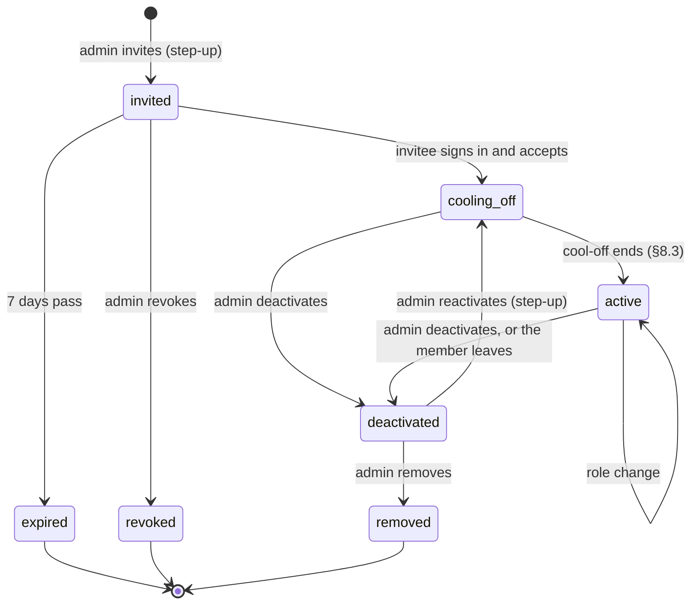

# Identity, Tenancy, and Authentication Spec (v1)

| | |
|---|---|
| **Status** | v0.2 ([DEC-437](../project/decisions/DEC-437.md); v0.2 adds the readings code needs, [DEC-640](../project/decisions/DEC-640.md) to [DEC-643](../project/decisions/DEC-643.md)). Items 1 to 14 of DEC-437 are agent readings; item 15 is decided by DEC-820 (PR #762) and applied by DEC-640; items 16 to 21 are Proposed and wait for the founder |
| **Implements** | [HLD §4](../HLD.md#4-architecture) (org directory, workspace deployment, deployment modes) and [§8](../HLD.md#8-multi-tenancy-and-security); PRD [FR-1.1 to FR-1.6](../product/04-prd-v1.md#61-identity-and-tenancy); backlog E9 |
| **Depends on** | [Mandate spec §4.3, V-047, §6.1, §6.4, §6.5](mandate.md#43-policy-hierarchy-dec-51-dec-98); [journal spec §2, §3, §6.4, §7](journal.md#3-event-envelope); [infrastructure design §5, OPS-6](../design/infrastructure.md#5-secrets-and-the-vault); [inference spec INF-9, INF-11](inference.md#2-invariants); [DEC-141](../project/04-decision-log.md#decisions), [DEC-211](../project/04-decision-log.md#decisions), [DEC-411](../project/decisions/DEC-411.md) |
| **Read by** | The workspace services API spec (`docs/specs/workspace-api.md`, DEC-436), the notifications spec (`docs/specs/notifications.md`, DEC-438), and the threat model (`docs/security/threat-model.md`, DEC-439), all drafted in parallel. They take roles, principals, and step-up from here |
| **Safety-critical** | Yes: authentication, step-up, roles, and tenant isolation are on the `AGENTS.md` list. Code under this spec follows DEC-77 (tests first, then the implementation, then status) |

This spec says who can act in Mandate, on what, and how the platform knows it is them. The trading
specs say what an owner's command, an approval, or an acknowledgment does once it is committed; this
spec says what has to be true before workspace services will commit one.

## Contents

1. [Scope](#1-scope)
2. [Invariants](#2-invariants)
3. [Principals, organizations, and workspaces](#3-principals-organizations-and-workspaces)
4. [Roles and permissions](#4-roles-and-permissions), with the authorization step (§4.5)
5. [Membership lifecycle](#5-membership-lifecycle)
6. [Authentication and sessions](#6-authentication-and-sessions)
7. [Step-up](#7-step-up)
8. [Separation of duties](#8-separation-of-duties)
9. [Tenant isolation](#9-tenant-isolation)
10. [Recovery and break-glass](#10-recovery-and-break-glass)
11. [Hybrid and on-prem](#11-hybrid-and-on-prem)
12. [Journal records](#12-journal-records)
13. [Adversary review](#13-adversary-review)
14. [What exists today and what is planned](#14-what-exists-today-and-what-is-planned)
15. [Decisions](#15-decisions)
16. [Open questions](#16-open-questions)

---

## 1. Scope

### 1.1 In scope

- **Principals:** people (users), service accounts, owner-connected agents
  ([DEC-141](../project/04-decision-log.md#decisions), called *clients* here), the platform's own
  agents and processes, and platform staff.
- **Organizations, workspaces, and memberships**, with membership states and the user count that
  [V-047](mandate.md#41-v-rules) reads.
- **Roles and the permission matrix.**
- **Authentication:** passkeys, OIDC single sign-on, and the fallback for hybrid deployments;
  sessions; step-up; recovery; break-glass.
- **Separation of duties** under `independent_approval_required`.
- **Tenant isolation** at every layer: API, storage, journal streams, messaging, caches, the
  inference cache, the vault, and logs and telemetry.

### 1.2 Not in scope

- What a control does once committed (mandate spec §6.1, §6.4; trading spec §5.5).
- Broker connections and their OAuth scopes (`docs/specs/connections.md`, gap 9). This spec only
  says who may connect or revoke one, and that doing so needs step-up.
- Notification delivery (DEC-438). This spec only says identity notices are opaque (ID-14).
- Billing and seats (gap 11). The global directory's role list feeds seat counts; nothing here
  depends on billing.

### 1.3 Who never holds a principal

The repository's coding agents, its CI, and its review agents never hold a principal in any
workspace deployment, paper or live (`AGENTS.md` rule 8). No test, fixture, or workflow creates a
credential for one. Tests use local fixtures and an in-memory identity provider (§14).

---

## 2. Invariants

Each invariant is a test. "Test" names the oracle; each oracle is computed independently of the
code under test (`AGENTS.md`, "Independent oracles") and is shown to fail on a seeded bug before it
is trusted (§14, E9-11).

| ID | Invariant | Source | Test |
|---|---|---|---|
| **ID-1** | **Every action is attributed.** Every mutation workspace services accept, and every event they commit to the control stream, carries the authenticated principal (`actor.kind`, opaque `actor.id`) and the session it came through. The principal comes from the authenticated channel, never from the request body. Nothing anonymous is committed | Journal §3; HLD §8 "Agent identity" | A fuzz of API calls with forged `actor`, `user`, `responder`, and `workspace_id` fields in bodies asserts every committed event's actor equals the oracle's record of who authenticated |
| **ID-2** | **A role grants exactly its matrix row.** `authorize(principal, scope, permission)` allows exactly when some effective role the principal holds through a membership in that scope that reaches it (one that reaches its scope when `active` or `cooling_off`, with its roles effective as §8.3 allows) has the permission in §4.2's matrix, or, for a principal that holds no membership (a client, a service account, the host CLI, a platform operator in break-glass), when its own column has it within that column's stated scope. Everything else is denied, including a permission the matrix leaves blank. It covers exactly the rows the matrix names (DEC-641 item 6) | §4 | An exhaustive test over every (role set or non-member principal kind, permission, scope) triple against a table parsed from §4.2 itself, by the grammar of §4.2, not from the code |
| **ID-3** | **Only a member reaches a workspace.** A membership reaches its scope when `active` or `cooling_off`, with its roles effective as §8.3 allows (§5.1); a principal with no membership in workspace W that reaches it can neither read nor write W. A deactivation applies to every request authorized after it commits, and open streams (server-sent events, websockets) of that principal in W close within 60 s | §5 | A fuzz interleaving requests with membership changes; the oracle replays `Member*` events and asserts no request authorized after a deactivation succeeded, and every stream closed within the bound |
| **ID-4** | **Step-up where risk can grow.** These need valid step-up (§7): confirming a risk-increasing mandate version, deploying (going live or paper), approving under policy (mandate §6.4 check 6), granting a delegation, connecting or changing a connection, revoking a connection, re-enabling a halted scope if DEC-437 item 21 creates one (§4.4), resume, Stop, acknowledgments (mandate §6.1), owner exits, accepting a disclosure (V-005), loosening a policy, granting a role, connecting a client, enrolling a step-up credential, and break-glass | FR-1.4; mandate §6.1 | A table test per command: with each failure mode (missing, stale, reused, wrong method, wrong action digest, wrong principal) the command is refused and nothing else is committed |
| **ID-5** | **Never for risk reduction.** No step-up, session freshness, or identity-provider round trip is required to pause, to engage a kill switch at any scope (its stop and flatten; only its extra privileges need step-up, mandate §6.1), to skip an approval, to tighten a policy, to remove or narrow a delegation, or to revoke a client. Automated exits, protective orders, and risk exits involve no principal at all | `AGENTS.md` rules 2, 3, 13; MI-23 | With step-up absent, stale, and with the identity provider unreachable, each of these commits, and the kill switch stops and flattens |
| **ID-6** | **Approver is not the requester.** Under the effective `independent_approval_required`, the user who grants, acknowledges, or approves (deployment, a risk-increasing change, a high-water-mark reset, loosening a latched floor, lifting a tripwire, an approval) is a different `user` principal from the requester and, for approvals, from the mandate's author. A client counts as the user named in its `on_behalf_of` (§12.2) and a service account as its issuing admin, so neither is ever the other party | Mandate §4.3, §6.4 check 7, §5.8, §6.7; E9-5 | A fuzz over principals, clients, and service accounts; the oracle maps each to its human and asserts no grant counted where the two humans match |
| **ID-7** | **The user count is active humans.** `workspace_users` (the count V-047 and V-020 read) is the number of distinct `user` principals whose membership in the workspace is `active` and past its cool-off (§8.3) at the read. Invited, cooling-off, deactivated, and removed memberships, clients, service accounts, agents, and platform staff count zero. A count that cannot be read counts as one | V-047; DEC-411 item 2 | The oracle folds `Member*` events itself and is compared with the count validation reads, at validation and at application, over random membership histories |
| **ID-8** | **Cross-tenant access is unrepresentable.** Every store, cache, queue, and journal API takes a `TenantContext` that only the authorization step can construct; no data API accepts a bare workspace ID. A request for W's data under another workspace's context fails at the type, at row-level security, at the journal stream prefix, at the messaging account, at the cache key, and at the vault namespace | HLD §8; OPS-6; INF-9 | Compile-fail tests for the type; cross-workspace attack tests at every layer listed in §9.1 (07, Isolation) |
| **ID-9** | **Secrets stay secret.** Session tokens, refresh tokens, recovery codes, OIDC client secrets, and WebAuthn challenges never appear in logs, metrics, traces, the journal, artifacts, or notifications. Recovery codes are stored only as salted slow hashes and shown once. No password is stored at all | `AGENTS.md` rules 6, 7; OPS-1 | The log-scan test with canary tokens through every authentication path; a test that the recovery-code table holds no plaintext |
| **ID-10** | **An identity-provider outage never blocks risk reduction.** With the identity provider (ours or the customer's) and the global control plane unreachable, a member can still pause and engage a kill switch, through a session the outage interrupted, workspace-local passkey verification, or the host CLI's registered principal (§6.4). The workspace-held passkey verifier is not part of what DEC-437 item 15 leaves open | Rules 3, 13; OPS-4, OPS-12 | The kill-switch drill with the identity provider, the global control plane, and the model gateway all unreachable |
| **ID-11** | **A client is never the human.** A client principal (DEC-141) is recorded as `actor.kind` `client` with `on_behalf_of` its user, never as a `user` (§12.2); it is scoped to one user in one workspace, holds a revocable sender-constrained token, and never approves, confirms a version, presents step-up, pauses (DEC-191), resumes, stops, releases, makes an owner exit, changes a connection, or changes a membership. Revoking it takes effect for every request authorized after the revocation commits | DEC-141 items 1 to 5; DEC-191; E10-6 | The ID-2 table run for the `client` principal; a test that a `client` actor's approval response is refused by mandate §6.4 check 3 from the record alone; a revocation race test as in ID-3 |
| **ID-12** | **Platform staff never decide for a customer.** No platform operator approves, confirms, acknowledges, or holds a workspace role. Break-glass is time-bound, approved by the customer with no other route (§10.3), limited to operational actions, and journaled to a stream the customer reads | Journal §7; infrastructure §5.5; mandate §6.4 check 3 | A test that a `platform_operator` actor is refused by every permission except the PO column of §4.2, and only inside an approved window in the workspace it names |
| **ID-13** | **Roles change only by journaled membership events, and never by their holder.** No principal grants a role to itself, removes or raises its own roles, or lifts its own cool-off; every grant is a committed `MemberRoleChanged` with step-up. The one exception is the founding grant when an organization or workspace is created (§3.2), which the system issues and journals as `MemberActivated` with reason `founding` | §5, §8.3 | A fuzz of membership commands asserting the oracle's role state equals the fold of `Member*` events and no grant or removal names its own author as subject |
| **ID-14** | **Identity notices are opaque.** The identity and account-security notice kinds (a new device or passkey, a role grant, a member deactivated, a recovery started, a break-glass) carry only an opaque ID and generic text, and go to the recipients of §4.1's receive column; their kinds are those the notifications spec adds to its catalogue (DEC-438) | Rule 6; OPS-10 | Payload capture tests (07, Privacy) on each notice |
| **ID-15** | **The global directory holds IDs and roles only.** The global control plane holds organization, workspace, and user IDs and role names for seats and routing. It never holds sessions, tokens, credential material, recovery codes, step-up evidence, or approval content, and it is never in the path of a sign-in to a hybrid or on-prem deployment | HLD §4 "Where data lives" | A schema test on the directory's tables and the outbound sync payload; the drill with the outbound link cut |

**How the invariants close the brief's list.** Attributed actions: ID-1. Matrix rows: ID-2.
Step-up where required and never for risk reduction: ID-4, ID-5. Approver ≠ requester: ID-6.
Pending or deactivated members count as no user and lose access in bounded time: ID-3, ID-7.
No cross-tenant read or write: ID-8. Credentials and recovery codes out of logs: ID-9. Identity
provider outage: ID-10.

---

## 3. Principals, organizations, and workspaces

### 3.1 Principals

| Kind | Journal `actor.kind` | Who | Authenticates by | Counts as a user (ID-7) |
|---|---|---|---|---|
| User | `user` | A person | Passkey or OIDC (§6) | Yes, when its membership is `active` and past cool-off |
| Client | `client`, with `on_behalf_of` its user (§12.2) | An owner-connected agent acting for one user (DEC-141) | A scoped, sender-constrained token the user issued (§6.6) | No; it is its user for independence (ID-6) |
| Service account | `system` | An organization's automation, for example a fund's records export | A scoped token issued by an org admin with step-up | No |
| Agent | `agent` | A deployed agent's runtime | Its workload identity (infrastructure §3.5) | No |
| Process | `system` | Executor, scheduler, workspace services | Workload identity | No |
| Host CLI | `system`, with `on_behalf_of` the registering admin | The on-host command line of a workspace deployment, for pause and the kill switch only (§6.4 route 3) | A registration made at install by a workspace admin with step-up (`HostCliRegistered`), bound to the host's operating-system account; its own ULID | No |
| Platform staff | `platform_operator` | Our staff, managed mode only | Our own staff identity, through break-glass (§10.3) | No |

Every principal has an opaque ID (a ULID). Names, emails, and identity-provider subjects live in
the personal-data vault (journal §6.4); events carry only the opaque ID.

**Linking.** One person has one user principal per organization. An OIDC subject and each passkey
are *credentials* of that principal, never principals of their own. Linking a new credential to an
existing principal needs step-up with an existing credential, or recovery (§10.1).

### 3.2 Organizations and workspaces

- An **organization** is the billing and policy unit (FR-1.2, FR-1.5). It owns workspaces, its
  org-level policy (mandate §4.3), its SSO configuration, and its org memberships.
- A **workspace** is the tenant boundary (HLD §8). Agents, connections, mandates, approvals, the
  journal streams, and the vault namespace all belong to exactly one workspace.
- A **retail sign-up** creates one organization of kind `individual` with one workspace, and
  makes the person its org owner and the workspace's admin, operator, and approver (the *owner
  bundle*, §4.3). The workspace takes the retail profile (mandate §4.3) unless the organization is
  verified otherwise.
- A user may belong to several workspaces (FR-1.2); each is a separate membership with its own
  roles and state.

### 3.3 Where identity data lives

| Data | Managed | Hybrid | On-prem |
|---|---|---|---|
| Org, workspace, user IDs; role names | Global directory and workspace | Global directory (IDs only) and workspace | Customer's |
| Names, emails, IdP subjects | Personal-data vault in the workspace deployment | Customer's | Customer's |
| Passkey public keys and credential IDs | Workspace deployment (and the managed sign-in provider, §6.1) | Customer's | Customer's |
| Sessions, refresh tokens | Workspace deployment | Customer's | Customer's |
| Recovery-code hashes | Workspace deployment | Customer's | Customer's |
| Step-up evidence and raw assertions | Control stream and artifacts | Customer's | Customer's |
| SSO configuration (issuer, client ID) | Workspace deployment; client secret in the vault | Customer's | Customer's |

---

## 4. Roles and permissions

### 4.1 Roles

From [HLD §8](../HLD.md#8-multi-tenancy-and-security), PRD FR-1.3, and the
[personas](../product/02-personas-and-journeys.md#roles-in-the-product). Roles are sets: a member
may hold several, and their permissions add. There is no inheritance from org roles to workspace
roles: to act in a workspace, an org owner needs a workspace membership like anyone else (the
retail sign-up creates it).

| Scope | Role | Purpose | Receives (notice classes, DEC-438) |
|---|---|---|---|
| Org | **Org owner** | Owns the organization; transfers ownership; deletes it. At least one at all times | `safety`, `info` for org-scope events; every identity and account-security notice of the org's workspaces |
| Org | **Org admin** | Org policy, SSO, workspaces, org memberships | `safety`, `info` for org-scope events |
| Org | **Billing admin** | Plan and invoices only | `info` for billing only |
| Workspace | **Workspace admin** | Members, connections, workspace policy | `safety`, `info`; every identity and account-security notice of the workspace |
| Workspace | **Operator** | Author mandates, deploy, pause, stop, kill switch, owner exits | `safety`, `info` |
| Workspace | **Approver** | Answer approvals; pause (PX-11 (b)) | `action` (only when listed in the agent's `autonomy.approval.approvers`), `safety`, `info` |
| Workspace | **Viewer** | See agents, positions, decisions | `info` only, never `action` |
| Workspace | **Auditor** | Read records, verification, exports; nothing else | `info` only |
| — | Client, service account, host CLI | — | None |

**Receiving is not acting** (notifications spec NT-11): a notice gives no permission, and the receive
column only bounds who may be sent each class. An identity or account-security notice about a
member also goes to that member.

"The owner" in the mandate and trading specs means a member holding the permission the control
needs in this matrix. Approving also needs the user to be listed in the mandate's
`autonomy.approval.approvers` (mandate §6.4 check 3, V-024): the role is necessary, the listing is
what makes them an approver of that agent.

### 4.2 Permission matrix

**S** marks a permission that needs step-up (§7). A blank cell is a denial (ID-2). OO org owner,
OA org admin, Bill billing admin, WA workspace admin, Op operator, Ap approver, Vi viewer, Au auditor,
Cl client (DEC-141), SA service account, HC host CLI (§6.4 route 3), PO platform operator inside an
approved break-glass window (§10.3).

The HC column applies only in the deployment's own workspace, the one whose admin registered the
CLI (§3.1). The PO column applies only inside a window the customer approved, in the one workspace
it names; outside such a window a platform operator has no permission at all (ID-12).

| Permission | S | OO | OA | Bill | WA | Op | Ap | Vi | Au | Cl | SA | HC | PO |
|---|---|---|---|---|---|---|---|---|---|---|---|---|---|
| View agents, positions, decisions | | | | | ✓ | ✓ | ✓ | ✓ | ✓ | ✓ | | | |
| Make an owner request through the owner-input API (builder, gate, and autonomy apply; DEC-141) | | | | | | ✓ | | | | ✓ | | | |
| Dry run of a request (DEC-190) | | | | | | ✓ | | | | ✓ | | | |
| Chat thread with the agent | | | | | | ✓ | | | | | | | |
| Read records, verification; export (journal §7) | | | | | ✓ | | | | ✓ | | ✓ | | |
| Draft a mandate version | | | | | | ✓ | | | | ✓ (propose only) | | | |
| Confirm a version: reducing or neutral | | | | | | ✓ | | | | | | | |
| Confirm a version: risk-increasing (incl. a delegation grant, V-022) | S | | | | | ✓ | | | | | | | |
| Deploy, go live (E10-4) | S | | | | | ✓ | | | | | | | |
| Pause | | | | | ✓ | ✓ | ✓ | | | | | ✓ | ✓ |
| Hold new openings (`exits_only`, DEC-191) | | | | | ✓ | ✓ | | | | ✓ | | | |
| Lift a hold a client set (DEC-191) | S | | | | ✓ | ✓ | | | | | | | |
| Resume, Stop, Stop with release | S | | | | ✓ | ✓ | | | | | | | |
| Kill switch, agent scope: engage | | | | | ✓ | ✓ | | | | | | ✓ | ✓ |
| Kill switch, connection or workspace scope: engage | | | | | ✓ | ✓ | | | | | | ✓ | ✓ |
| Kill switch, org scope: engage | | ✓ | ✓ | | | | | | | | | | |
| Kill switch, any scope: privileges beyond the stop (mandate §6.1), for a scope one may engage | S | ✓ | ✓ | | ✓ | ✓ | | | | | | | |
| Re-enable a halted scope (§4.4; only if DEC-437 item 21 creates the state) | S | ✓ (org) | ✓ (org) | | ✓ | | | | | | | | |
| Owner exit (close a position) | S | | | | | ✓ | | | | | | | |
| Acknowledge (ladder, tripwire, reconciliation) | S | | | | ✓ | ✓ | | | | | | | |
| Answer an approval: approve | S | | | | | | ✓ | | | | | | |
| Answer an approval: skip | | | | | | | ✓ | | | | | | |
| Remove or narrow a delegation | | | | | | ✓ | | | | | | | |
| Connect, change, or revoke a broker connection | S | | | | ✓ | | | | | | | | |
| Accept a disclosure (V-005) | S | | | | | ✓ | | | | | | | |
| Workspace policy: tighten | | | | | ✓ | | | | | | | | |
| Workspace policy: loosen (within the org's) | S | | | | ✓ | | | | | | | | |
| Invite, deactivate, remove a workspace member | S for invite | | | | ✓ | | | | | | | | |
| Grant or remove a workspace role | S for grant | | | | ✓ | | | | | | | | |
| Connect a client (issue its token) | S | | | | | ✓ | | | | | | | |
| Revoke a client | | | | | ✓ | ✓ | | | | | | | |
| Enrol or remove one's own passkey | S | own | own | own | own | own | own | own | own | | | | |
| Leave: deactivate one's own membership | | ✓ | ✓ | ✓ | ✓ | ✓ | ✓ | ✓ | ✓ | | | | |
| Org policy: tighten | | ✓ | ✓ | | | | | | | | | | |
| Org policy: loosen (within the platform's) | S | ✓ | ✓ | | | | | | | | | | |
| SSO configuration | S | ✓ | ✓ | | | | | | | | | | |
| Create or archive a workspace | S | ✓ | ✓ | | | | | | | | | | |
| Org memberships and org roles | S | ✓ | ✓ (not owner) | | | | | | | | | | |
| Issue or revoke a service account | S | ✓ | ✓ | | | | | | | | | | |
| Billing | | ✓ | | ✓ | | | | | | | | | |
| Transfer org ownership; delete the org | S | ✓ | | | | | | | | | | | |
| Approve a break-glass request (§10.3) | S | ✓ | | | ✓ | | | | | | | | |
| Restart a process; read verification results (break-glass operational set, §10.3) | | | | | | | | | | | | | ✓ |

**Reading the matrix** ([DEC-641](../project/decisions/DEC-641.md)). The ID-2 test parses this
table, so its cells follow a closed grammar, and any other text is a spec defect the test fails on:

- **S cell:** blank (no step-up), `S` (step-up for every use), `S for invite` (only an invitation
  needs it; deactivating or removing a member does not), or `S for grant` (only a grant needs it;
  removing a role does not).
- **Principal cells:** blank (denied); `✓` (granted); `own` (granted for the principal's own
  credential only, at the scope of any membership it holds that reaches that scope); `✓ (propose only)` (granted; confirming is its own row); `✓ (org)` (granted
  at org scope only); `✓ (not owner)` (granted, except that granting or removing the org owner
  role is refused `owner_role_reserved`).
- **Column scopes:** OO, OA, and Bill apply only at an organization's scope, through an org
  membership; WA, Op, Ap, Vi, and Au only at a workspace's scope, through that workspace's
  membership (§4.1: no inheritance either way). Cl applies only in the one workspace its token
  names, and only while its user holds a membership there that reaches it and whose effective
  roles grant the same row. SA applies only in the workspaces it names, HC only in its own deployment's
  workspace, and PO only in the workspace of a break-glass window in force; none of the four
  applies at org scope.
- **Effective roles:** a membership reaches its scope when `active` or `cooling_off`, with its roles effective as §8.3 allows (§5.1): a role still in its cool-off grants
  nothing.
- **Inactive rows:** a row whose permission applies only if a Proposed decision creates its state
  (re-enabling a halted scope, DEC-437 item 21) is refused to everyone, `inactive_permission`,
  until that decision is accepted and the row's text edited.
- **Leaving:** the leave row is the member's own membership only, at the scope of that
  membership: a workspace membership at the workspace's scope, an org membership at the
  organization's. The last-owner and last-admin rules (§5.2) still apply to it.
- **Rows, not routes:** ID-2 covers exactly these rows (E9-12 item 2). An operation with no row
  and no mapping in workspace API §3.7 has no route until a row is added.

Notes:

- **Pause by approvers** is PX-11 (b). Stop and flattening stay with operators and admins.
- **Revoking a connection needs step-up** even though it ends trading: it also ends the executor's
  ability to re-place protection and run risk exits (infrastructure §5.4), so it is not a risk
  reduction. The kill switch is the risk-reduction path.
- **Clients** may view, propose a version (never confirm it), place requests through the owner-input
  API that go through the builder and gate (DEC-141), and hold new openings by setting `exits_only`,
  never pause, which would hold the agent's exits (DEC-191). Lifting that hold is the owner's, with
  step-up. Their
  requests are the user's requests for independence (ID-6). Everything else is blank.
- **Service accounts** in v1 read and export records only. A wider service-account scope is a new
  decision.
- An org admin cannot grant or remove the org owner role; only an org owner can (ID-13 and §13).

### 4.3 The owner bundle

A one-person workspace has one member holding workspace admin, operator, and approver. This is the
retail default (§3.2). It satisfies every control a solo owner needs, and V-047 refuses it under
`independent_approval_required` exactly as DEC-411 decided.

### 4.4 After a kill switch

**In force** (trading spec §5.5, mandate §6.1): engaging a kill switch at any scope is one action,
needs no step-up for its stop and flatten, and leaves each agent it covers `stopped`, which is
terminal. Trading again in that scope means deploying an agent again, which needs the deploy
permission and its step-up (§4.2). This spec adds no state to that.

**Proposed** ([DEC-437](../project/decisions/DEC-437.md) item 21): a connection-, workspace-, or
org-scope kill switch would also leave its scope **halted**, so that no agent in it deploys until a
member re-enables the scope with step-up, journaled. That is a new state that trading spec §5.5 and
mandate §6.1 do not have, so it waits for the founder and for those specs to be edited in the same
change. Until then no halted state is enforced, and the matrix row for re-enabling a scope is
inactive.

### 4.5 The authorization step

`authorize(lookup, principal, session, scope, permission)` applies §4.2 by its grammar and nothing
else.

**The membership read** ([DEC-642](../project/decisions/DEC-642.md) item 4). Authorizing needs a
read before any context exists. `authorize` builds the `MembershipQuery` itself (the principal, or
a client's user, and the scope) and reads, uncached, through the membership lookup it is given
(§6.2), which takes only that query and returns memberships only. No data API accepts a
`MembershipQuery`, and the caller passes no membership list, so it can neither reach workspace
data through the read nor hand the step a forged list. `MembershipLookup` is sealed and
implemented only by the workspace store crate, and `Membership` has private fields, built only by
that store from the control stream's fold (DEC-642 item 7 says which crates the seal admits);
test doubles live only behind `cfg(test)` or in `mandate-identity`'s dev-only test support.

**The session.** `Session` is an authenticated-session type with private fields, built only by
§6's code (`mandate-authn`), from the session record it reads for this request, and by test
support; if that read fails there is no `Session`, and the request is refused before authorizing.
It contributes the `session_ref` every committed event names (ID-1, §12.2), the workspace it was
opened in, its kind, and its **roles snapshot**: the principal's memberships in that workspace and
its organization (a client token's record: its user's), as of the last successful membership read.
`MemberDeactivated` revokes every session and client token of the member in the same transaction
(§5.2 step 2), and `MemberRoleChanged` rewrites the member's snapshots in the same transaction
(§5.2), so a snapshot is never wider than the committed membership. A reduction-only session
(§6.4: route 1 after the provider became unreachable, route 2) authorizes exactly these rows of
§4.2: Pause; Kill switch, agent scope: engage; Kill switch, connection or workspace scope:
engage; Kill switch, org scope: engage. "Kill switch, any scope: privileges beyond the stop" is not
among them. Any other row is refused `reduction_only`. A route-1 session leaves reduction-only
when a refresh succeeds (it is a full session again) or the provider refuses one (it ends, §6.4).

**A failed membership read** (DEC-642 item 10, an agent reading under DEC-176 on the
coordinator's ruling). `membership_unavailable` is never the outcome of a risk-reducing operation
(`AGENTS.md` rules 2, 3, 13). The risk-reducing rows are those of workspace API-7's operations:
pause; holding new openings; an owner exit; Skip on an approval; removing or narrowing a
delegation, and away mode; and engaging a kill switch at agent, connection or workspace, or org
scope. When the live membership read fails on one of them, a
user's or a client's request is authorized from its session's roles snapshot against the same
§4.2 row, by the same grammar, at the session's workspace or its organization; the context carries
`membership_unverified`, and the committed event records `membership_unverified: true` beside its
`session_ref` (§12.1). This holds for every session kind; a reduction-only session still reaches
only its four rows. A failed read refuses (`membership_unavailable`) only the rows that add or
keep risk or change configuration, and only for a user or a client: the host CLI (whose route 3
rests on its registration alone), a service account, and a platform operator never read
memberships. Step-up still applies where §4.2 already asks for it (an owner exit): it is verified
locally against the passkey public keys in the workspace deployment's credential table (§3.3) and
needs no membership read; a reduction-only session cannot present step-up (§7.3), so it cannot
make an owner exit, as before, while a full session or route 1 after a refresh can. That is not a
new refusal. If the session record cannot be read either, the request is refused, and nothing
could be journaled anyway (workspace API §7). The ID-3 and ID-5 fuzz assert, across the whole
risk-reducing set with an injected membership-store outage, that `membership_unavailable` never
occurs, that each such operation commits with `membership_unverified: true`, and that no
operation outside the set commits during the outage.

**`TenantContext`** ([DEC-642](../project/decisions/DEC-642.md)). Only the authorization step
constructs one, and only when it authorizes a permission at a workspace's scope; an org-scope
authorization yields none. Its fields are private, and it has no public constructor, no `Default`,
no deserializer, and no `Clone`. It carries the workspace and its organization, the authenticated
principal (ID and kind), and the one permission authorized. Every store, cache, queue, journal,
and vault API over a workspace's data takes a context and reads the workspace from it; none takes
a bare workspace ID (ID-8). A context lives for one request and is never stored or serialized.

**`SystemContext`** (DEC-642 items 5 to 8). The deployment's own background processes act with
no request and no principal behind them (ID-5), yet nothing they commit is anonymous (ID-1). They
hold a `SystemContext`: one workspace and the process's workload identity (§3.1), recorded as
`actor.kind` `agent` for an agent's runtime and `system` for the executor and the scheduler. It is
not an output of `authorize`, and it is unrepresentable from a request by crate boundary, with no
Cargo feature involved:

- `SystemContext` and its only constructor live in their own crate, `mandate-identity-system`.
- **An allowlist, not a denylist:** only the bootstrap crates of the agent runtime, the executor,
  and the scheduler may depend on `mandate-identity-system`; E9-8 creates those bootstrap crates.
  `xtask/layers.toml` gains an `allowed_dependents` key that `cargo xtask layers` checks. That
  check lands with E9-8, under a claim on `xtask`, which is shared, and does not run before.
- **Two seals**, so no crate that builds sessions or memberships can mint a context:
  - `mandate-tenant` holds only the `Tenant` trait (re-exported as `mandate_identity::Tenant`) and
    its sealing supertrait. Its allowed dependents are `mandate-identity` and
    `mandate-identity-system`, and nothing else, so only `TenantContext` and `SystemContext`
    implement `Tenant`. Data APIs take either context through it.
  - `mandate-identity-seal` holds the tokens that the constructors of `Membership` and `Session`
    and the impls of `MembershipLookup` require. Its allowed dependents are `mandate-identity`,
    `mandate-authn`, the workspace store crate, and `mandate-identity-testkit` (a `tool`-layer
    crate that only dev-dependencies reach).
- The planned crates are named in `xtask/layers.toml`'s `planned` list (DEC-525).

Workspace services' request path never holds a `SystemContext`: every write it makes is
attributed to the authenticated principal, including revoking a deactivated member's sessions and
client tokens (§5.2 step 2), which carry the deactivating admin as actor. System-attributed
control writes (refresh-family revocation on expiry, deprovision signals, scheduled expiry) come
only from a separate process. A back-channel logout arrives as an inbound request: its endpoint
verifies the provider's logout token (signature, `iss`, `aud`, and the `events` claim) and writes
it only to a relay table outside the journal (an outbox), attributed to the verified issuer as its
principal. The separate process reads the outbox and commits `SessionRevoked` with reason
`deprovisioned`, attributed to `system`; the request path itself commits nothing to the journal. A `SystemContext` never gates risk reduction:
automated exits, protective orders, and kill switches proceed without any check it could fail
(`AGENTS.md` rule 13).

**Role changes.** A grant or removal of roles, and a deactivation, pass the same step for their
row (deactivating one's own membership is the leave row), then: no change grants or removes a
role of its own author (ID-13); only an org owner grants or removes the org owner role, and
deactivating another member who holds it counts as removing it; and the last-owner and last-admin rules of §5.2 hold on the state after the change.

**Refusals** ([DEC-643](../project/decisions/DEC-643.md)), each with a stable code:

| Code | When | Workspace API (§3.5) |
|---|---|---|
| `no_membership` | No membership reaching the scope; a non-member principal outside its column's scope; a principal kind with no column | 404 `not_found` (API-9) |
| `forbidden` | The scope is reached, but no effective role or column grants the row | 403 `forbidden` |
| `inactive_permission` | The row is inactive (§4.2, "Reading the matrix") | 403 `forbidden` |
| `own_roles` | A change grants or removes a role of its own author (ID-13) | 403, code `own_roles` |
| `owner_role_reserved` | A principal other than an org owner grants or removes the org owner role | 403, code `owner_role_reserved` |
| `last_owner`, `last_admin` | The change leaves no `active` org owner, or no `active` workspace admin (§5.2) | 409, the code itself |
| `reduction_only` | A reduction-only session asks for a row other than pause or a kill switch's engage (§6.4) | 403, code `reduction_only` |
| `membership_unavailable` | The membership lookup cannot answer, for a user or a client, on a row that is not risk-reducing (never on a risk-reducing row, above) | 503, `retryable` |

Step-up is not judged here: an authorization carries the row's step-up requirement, and §7
verifies the evidence.

---

## 5. Membership lifecycle

### 5.1 States



| State | Reaches the workspace (ID-3) | Counts in `workspace_users` (ID-7) | Can hold roles |
|---|---|---|---|
| `invited` | No | No | Roles are recorded, not effective |
| `cooling_off` | Yes, roles as §8.3 allows | No | Yes, limited by §8.3 |
| `active` | Yes | Yes (users only) | Yes |
| `deactivated` | No | No | Kept for reactivation, not effective |
| `removed`, `expired`, `revoked` | No | No | None |

**Cool-off.** Every activation passes through `cooling_off`, for the length §8.3's rule sets. In
most cases that is zero seconds, and a workspace's founding membership never has one.

### 5.2 Walk

**Invite.** A workspace admin invites an address with a role set, with step-up. The invitation
token is single use, expires after 7 days, and is never logged (ID-9). The invite email is generic
text and a link; it names no agent, strategy, or amount (rule 6). An invitation names roles but
grants nothing until accepted.

**Accept.** The invitee signs in (§6), proves control of the invited address or the organization's
SSO domain, and enrols a passkey before any step-up permission becomes usable. The membership moves
to `cooling_off` (`MemberActivated` with the cool-off end).

**Role change.** A workspace admin grants (step-up) or removes (no step-up) roles. A grant may start
a cool-off for the added role, as §8.3's rule says. No admin changes their own roles (ID-13). The
same transaction as `MemberRoleChanged` rewrites the member's session and client-token roles
snapshots (§4.5).

**Deactivate.** An admin deactivates a member, or a member leaves. Deactivation is never refused for
the effect it has on V-047 or on any mandate's approvers (DEC-437 item 17, Proposed, interim reading
below). In order, workspace services:

1. commit `MemberDeactivated`;
2. revoke every session and client token of that principal in the workspace, in the same
   transaction as step 1, and close its open streams within 60 s (ID-3);
3. leave every committed event as it was. A response or command committed before step 1 was
   authorized when committed and is judged by the runtime as usual. One arriving after step 1 is
   refused at the API and never committed;
4. alert the remaining admins (opaque, ID-14).

**Effects on agents.** Deactivation changes no mandate. If the person was a listed approver, asks
that need them cannot reach a quorum, time out, and are skipped (mandate §6.4, MI-21), which adds no
risk. If the workspace drops below two users under `independent_approval_required`, the agents keep
running and nothing they latched can be lifted until a second user exists (DEC-411 item 6). The
founder decided on 2026-10-03 that a risk-reducing version is exempt from V-047 in such a workspace
(the mandate spec change is owed by the E10-1 stream), so the owner can still tighten; neutral and
risk-increasing versions stay refused. Whether such a workspace's agents are also flagged
`policy_nonconforming` is still the founder's question (backlog, DEC-411 item 6).

**Remove.** A deactivated member can be removed. Identity records (who acted, their role, the
identity-provider subject at the time) are retained for the records period (journal §6.4); the
person's name and email are erased after it, by key destruction (`PersonalDataErased`).

**Last owner, last admin.** A change that would leave an organization with no `active` org owner, or
a workspace with no `active` workspace admin, is refused with `last_owner` or `last_admin`, unless
it is a transfer that adds the successor in the same command. A sole owner who wants to leave
transfers ownership first or deletes the organization. If every org owner is locked out, org
recovery (§10.2) applies.

**Organization deletion.** The org owner requests it with step-up. It is refused while any agent in
any of its workspaces is deployed and not `stopped`, or any connection is not revoked. Once
accepted, the organization enters a 30-day `closing` period, in which every member can read and
export records and nothing can deploy, and the owner can cancel with step-up. After it, sessions and
memberships end, the workspaces become read-only archives held for the records period (journal
§6.2, §6.4), and then they are erased as journal §6.4 says. Deletion never deletes a journal event
before its retention ends.

### 5.3 The user count V-047 reads

The validation context's `workspace_users` (mandate §4; the reference cases' context member) is
derived, never stored:

```text
workspace_users(W, t) = |{ p : p.kind = user,
                              membership(p, W) folded from the control stream up to t is active,
                              and its cool-off ended at or before t }|
```

- **At validation**, *t* is the validation read; **at application** (V-047's second check, as
  V-002), *t* is the application step, read in the same transaction as the version applies.
- **Distinct principals, not people.** Two principals are two users. V-047 is not proof of two
  people (DEC-411 item 2); the cool-off (§8.3) and the alerts (§5.2) are what make a second principal
  harder to fake.
- **Unreadable is one.** If the membership fold is unavailable, the count is 1 (rule 3; DEC-411
  item 2).
- **Any role counts.** As DEC-411 item 2 decided, every active user counts, not only approvers.
  Whether to count only members who could act as the independent party is an open question (§16),
  because narrowing it goes past the founder's decision.

---

## 6. Authentication and sessions

### 6.1 Methods

| Method | Use | Notes |
|---|---|---|
| **Passkey** (WebAuthn, user verification required) | Sign-in after the first; every step-up | Resident or synced credentials; attestation not required in v1; a user may hold several |
| **OIDC sign-in** | First sign-in and account recovery in managed mode (Google today, DEC-211); every sign-in under an organization's SSO (Okta, Microsoft Entra, Google Workspace; FR-1.1) | Authorization code flow with PKCE; `nonce` and `state` checked; ID token signature, issuer, audience, and expiry verified; `email_verified` required for matching an invitation by address |
| **Email link** | Behind a flag until mail exists (DEC-211); never creates an account | Single use, 10 minutes |
| **`cli_confirm`** | Step-up in a `paper` environment only (mandate §6.1, DEC-155) | Retired for any live environment |

No passwords (DEC-211's rationale). No SMS codes: they are phishable and SIM-swappable.

**The relying party.** Today the web app's passkeys and sessions are Supabase Auth's (DEC-211), and
the Rust services verify its access token against its published keys. For step-up and for the
risk-reduction path of §6.4, the workspace deployment must verify a passkey assertion itself,
without any outside service (ID-10, and HLD §4's rule that no hosted-only dependency sits in a core
path). This spec therefore has workspace services act as a WebAuthn relying party in their own
right, holding the public keys of each member's passkeys, while the sign-in provider stays a
replaceable OIDC issuer. Which provider that is for managed mode at launch, and whether passkeys
are enrolled once (with the workspace) or twice, was DEC-437 item 15, decided by DEC-820.

**Item 15 as applied** ([DEC-640](../project/decisions/DEC-640.md), applying DEC-820): the
managed sign-in provider (Supabase Auth, DEC-211, free tier) is one OIDC issuer, whose tokens
workspace services verify against the keys it publishes, selected by `kid` from the configured
issuer only. Every configured issuer is verified with asymmetric algorithms only (RS256, PS256,
ES256, EdDSA; never `none`, an `HS*` algorithm, or a key the token carries itself), and an
issuer's configuration may narrow the list: the managed issuer (`https://<ref>.supabase.co/auth/v1`,
audience `authenticated`) accepts ES256 only. Workspace services are the WebAuthn relying party
for passkey sign-in, step-up, and §6.4 route 2, with RP ID `app.owlhead.ai` and the one origin
`https://app.owlhead.ai`, so a passkey is enrolled once, with the workspace.

### 6.2 Sessions

A session is the workspace's record that a principal authenticated through a method at a time on a
device. It is held server side; the browser holds only an opaque, `HttpOnly`, `Secure`,
`SameSite=Strict` cookie, never a token in browser storage (as DEC-211 already does).

| Limit | Retail (individual org) | Business org | Can the org change it? |
|---|---|---|---|
| Access token lifetime | 5 min | 5 min | No |
| Idle timeout | 24 h | 1 h | Shorter only |
| Absolute lifetime | 7 days | 12 h | Shorter only |
| Concurrent sessions | Unlimited, each listed under Settings | Unlimited, listed | Can cap |

- **Every request re-checks membership** (ID-3): authorization reads the membership state from the
  workspace's own store, uncached, so the 5-minute token lifetime never extends access after a
  deactivation.
- **Refresh tokens rotate** on use; reusing a rotated refresh token revokes the whole session
  family (stolen-token detection).
- **Sign-out and revocation** end the session server side at once; the user can end any listed
  session.
- **New device notice.** Every sign-in commits `SessionOpened` (§12.1), whose `first_seen_device`
  flag is true when the principal has not used that device before (a device is its DPoP key
  thumbprint, or for a browser a long-lived device cookie's opaque ID; a synced passkey on a new
  machine is a new device). A first-seen sign-in sends an opaque notice
  (ID-14).

### 6.3 Device binding

- A passkey is bound to its relying party ID and, for device-bound credentials, to the
  authenticator. Synced passkeys move with the user's platform account; this is accepted in v1 and
  disclosed in the security settings.
- Non-browser clients (the mobile app, the CLI, owner-connected clients) hold sender-constrained
  tokens (DPoP, RFC 9449), never plain bearer tokens: a token is usable only with a proof signed by the key it was issued to,
  so a copied token alone is useless.
- A session records its device's key thumbprint (for DPoP clients) or the cookie's session ID; the
  journal's `session` reference (§12) is an opaque ID, never the cookie or the token.

### 6.4 The risk-reduction path

Pause and the kill switch must work when sign-in does not (ID-5, ID-10). Three routes, any one
enough:

1. **A session the outage interrupted.** When a session's refresh fails because the identity
   provider is **unreachable** (a timeout, a connection or TLS failure, a name-resolution failure, or
   a 5xx answer), the session keeps the pause and kill-switch permissions, and only those, until its
   absolute lifetime ends. When the provider **answers and refuses** (`invalid_grant`, a revoked or
   disabled subject, a back-channel logout), that is a deprovision, not an outage: the session ends at
   once with every permission (§11.1). Only a transport-level failure or a 5xx keeps anything.
2. **Workspace-local passkey.** The workspace deployment verifies a fresh passkey assertion
   against the public keys it holds (§6.1) and opens a *reduction-only session*: pause and kill
   switch, nothing else, 15 minutes. No identity provider, global control plane, or model is
   involved. It is refused to a principal whose identity-provider subject the workspace has seen
   refused (route 1's deprovision signal) since its last successful sign-in.
3. **The host CLI** (hybrid and on-prem; Phase 1's control), for the same two commands. It acts as
   its own registered principal (§3.1): a workspace admin registers it at install with step-up,
   journaled as `HostCliRegistered`, which gives it a ULID and binds it to one operating-system
   account on that host. Its events carry `actor.kind` `system` with that ULID and `on_behalf_of` the
   registering admin, and `session_ref` is the registration ID. No event is committed without it
   (ID-1). Deactivating the registering admin suspends the registration until another admin
   re-registers it. In Phase 1 the founder's CLI is the control-stream writer and is registered the
   same way when E9-1 lands.

The owner can also always act at the broker directly; protection rests there (OPS-4).

### 6.5 Service accounts

Issued by an org admin with step-up, scoped to named workspaces and to read and export only in v1,
with an expiry of at most 90 days. Their tokens are sender-constrained (§6.3), shown once, stored
only as a hash, and revocable at once.

### 6.6 Owner-connected clients (DEC-141)

- Connected by an operator with step-up, through OAuth 2.1 authorization code with PKCE (the MCP
  authorization model), producing a DPoP-bound token scoped to that user, that workspace, and the
  client scopes of §4.2.
- The user names the client when connecting it; the name is what an approval card shows as "your
  connected agent" (mandate §6.4 `trigger.client`).
- Tokens last at most 1 hour with a refresh token of at most 30 days; deactivating the user or
  revoking the client ends both (ID-11).
- A client never sees a broker credential (DEC-141 item 4), never receives a step-up challenge,
  and is never offered delegation scopes (mandate §6.4).

---

## 7. Step-up

### 7.1 What step-up proves

That the principal who committed this action was present, verified by user verification on a
passkey, within the last 300 seconds, for **this** action and no other.

### 7.2 Mechanics

1. The client asks workspace services for a challenge, naming the action. Workspace services issue
   a challenge record: `{challenge_id (ULID), workspace_id, principal_id, action_kind,
   action_digest, issued_at, expires_at = issued_at + 300 s}`. The `action_digest` is the SHA-256
   of the canonical action (journal §4): an approval's content hash (mandate §6.4), a version's
   hash, or a command's canonical body.
2. The WebAuthn challenge bytes are the SHA-256 of that canonical record, so the authenticator signs
   the action itself.
3. The user verifies on the authenticator (user verification required, not just presence).
4. Workspace services verify, in order: the challenge exists, is unused, is not expired, and names
   this principal and workspace; the credential belongs to this principal and its enrolment cool-off
   (§10.1) has ended; the signature verifies; the authenticator's flags show user verification; the
   signature counter, where the authenticator keeps one, has not gone backwards; and the submitted
   action's digest equals the challenge's.
5. On success, the challenge is marked used in the same transaction that commits the action's
   control-stream event, with step-up evidence `{assertion: challenge_id, authenticated_at,
   method: passkey}` as mandate §6.1 defines it. The raw assertion (authenticator data, client data,
   signature, credential ID) is stored as an artifact referenced from the event, so an auditor can
   re-verify it later against the public key.
6. On failure nothing is committed; the API returns the reason (`step_up_missing`,
   `step_up_stale`, `step_up_reused`, `step_up_method`, or `step_up_mismatch` for a digest that does
   not match).

The runtime and executor still judge evidence at the effective time as mandate §6.1 says (window,
reuse in the control stream, method per environment). Steps 4 and 5 are the authentication the
mandate spec says E9-4 provides; they add the action binding and never relax the runtime's checks.

### 7.3 Rules

- **One assertion, one action** (mandate §6.4). No gesture covers several approvals, commands, or
  versions.
- **Methods per environment.** `paper`: `passkey` or `cli_confirm`. `live`: `passkey` only.
- **Step-up is never a precondition of risk reduction** (ID-5). Where mandate §6.1 says a kill
  switch's extra privilege or an owner exit needs step-up, failing it loses only that privilege.
- **A reduction-only session (§6.4) cannot present step-up**: its 15 minutes are for pause and the
  kill switch only.
- **Recent sign-in is not step-up.** A session authenticated a minute ago by passkey still needs a
  fresh, action-bound assertion.

---

## 8. Separation of duties

### 8.1 What independence requires

Under the effective `independent_approval_required` (mandate §4.3; once true at a level, true for
every child), these need a user other than the requester: deployment, a risk-increasing change, a
high-water-mark reset, loosening a latched lifetime floor, and lifting a fired tripwire (mandate
§4.3, §5.8, §6.7); and an approval needs an approver other than the mandate's author (§6.4 check 7).
FR-1.6 and E9-5 (creator not the sole approver above a threshold) are this rule plus
`two_approver_above_usd`.

### 8.2 How identity decides "other"

- **Human of a principal.** `human(p)` is `p` for a user, the `on_behalf_of` user for a client or
  the host CLI, and the issuing org admin for a service account (which cannot approve anyway).
- **Requester and author** are recorded as principals on the request (`MandateVersionCreated`'s
  author, the requesting user on `OwnerAcknowledged`, the confirming user on `MandateConfirmed`).
- **Other** means `human(responder) ≠ human(requester)` and, for approvals,
  `human(responder) ≠ human(author)`. A client's proposal is its user's (ID-6), so a user cannot
  use their own client as the second party.
- The runtime compares humans, not actors. Because a client is recorded as `actor.kind` `client`
  (§12.2), a version drafted through a client has a client as its recorded author, so mandate §6.4
  check 7 and the independence checks of §4.3, §5.8, and §6.7 must compare `human(author)` and
  `human(requester)`, reading `on_behalf_of`. That edit to the mandate spec is owed with the journal
  edit (§12.2) and must land before any client token is issued.

### 8.3 Cool-off against sock puppets

A workspace admin could invite a second account they control and use it as the "other user". The
platform cannot prove two principals are two people. It makes that harder and visible:

- **The cool-off rule, stated once** (§5.1, §5.2, §11.1, and ID-7 cite it). A cool-off of 24 hours
  applies exactly when both hold: the workspace's effective `independent_approval_required` is true
  at the grant, and the grant (an invitation accepted, a reactivation, or a role grant) adds operator
  or approver to a member of an existing workspace. Every other grant has a cool-off of zero
  seconds, and the **founding membership** that creates a workspace (§3.2) never has one. While a
  cool-off runs, the added role is not effective for that member; a member whose activation is
  cooling off does not count in `workspace_users`; and the member is not the other party of §8.1.
  So a retail sign-up counts as one user at once.
- Every grant that starts a cool-off alerts every other workspace admin and org owner (opaque).
- An organization with SSO configured can require that members sign in through it, so a new member
  is an account the customer's directory issued (the org setting `sso_required`, §11.1).

---

## 9. Tenant isolation

### 9.1 Layers

| Layer | Rule | Enforced by |
|---|---|---|
| API | The workspace comes from the route and the authorized membership, never from a body field; a body field that names another workspace is refused | Authorization middleware; `TenantContext` construction (ID-8) |
| Storage | Every row carries `workspace_id`; row-level security keyed on a per-transaction setting that only the `TenantContext` sets; per-workspace encryption keys | Postgres RLS; infrastructure OPS-6 |
| Journal | Stream IDs carry the workspace (journal §2); a writer's database role and workload identity are scoped to its workspace's streams | Journal append; writer roles |
| Messaging | One NATS account per workspace (HLD §8); no cross-account exports | NATS account configuration |
| Caches | Every cache key starts with the workspace ID; nothing derived from one workspace's data is served to another | Cache wrapper that takes a `TenantContext` |
| Inference cache | Keyed by workspace, model identity, and request digest; never shared (INF-9, INF-11) | Model gateway |
| Vault | One namespace per workspace; per-process policies (infrastructure §5.2) | Vault policies |
| Processes | Agent processes never shared across workspaces (HLD §8) | Orchestrator |
| Logs and telemetry | Opaque IDs only; no workspace data in labels; no cross-tenant aggregates leave the deployment (OPS-6, OPS-10) | Label lint; log scan |
| Notifications | Opaque ID and generic text (rule 6) | Notification type (DEC-438) |
| Global directory | IDs and role names only (ID-15) | Directory schema |

### 9.2 Cross-workspace views

A user in several workspaces sees each through its own membership; there is no merged view that
reads two workspaces in one query. An org-level summary (seat counts, which workspaces exist) reads
the directory, never workspace data. The aggregate-flow monitor and per-thesis halt (HLD §8,
DEC-100) are operator controls in the deployment, outside any user's session.

---

## 10. Recovery and break-glass

### 10.1 A user who lost their passkeys

1. **Another enrolled passkey** on another device: sign in, remove the lost one (step-up with the
   remaining one).
2. **OIDC sign-in** (managed: Google, DEC-211; SSO orgs: their IdP), then enrol a new passkey.
3. **Recovery codes**: ten single-use codes, offered at the first passkey enrolment, stored as salted
   slow hashes, shown once (ID-9).

After 2 or 3, the new passkey is in an **enrolment cool-off** of 24 hours: it signs in and can pause
or kill switch, but cannot present step-up until the cool-off ends, and the user's other channels
receive an opaque notice. An attacker who took over the email or OIDC account therefore cannot move
money-adding controls for a day, and the real owner is told. Support staff never reset credentials.

### 10.2 An organization whose every owner is locked out

Recovery by the platform for a managed organization: a documented procedure with identity
verification, a 7-day waiting period, notice to every member, and a journaled
`PlatformOperatorAction`. The procedure's text involves identity verification and terms, so it is
DEC-437 item 18 (Proposed). Until it is decided, there is no platform-assisted org recovery: the
owner keeps their recovery codes, and every agent's protection rests at the broker.

### 10.3 Break-glass for platform staff (managed mode)

As infrastructure §5.5 and journal §7 set it, and made exact here:

- A staff member requests break-glass for one workspace, a reason, and a window (at most 4 hours).
- A second staff member approves (two-person), and a customer member with the permission (§4.2)
  approves with step-up. **There is no other route**: without the customer's approval there is no
  break-glass, whatever the incident. Risk reduction never needs break-glass, because the kill
  switch and pause are always the customer's own (§6.4), and protection rests at the broker. Whether
  staff should ever have a path without the customer, and if so whether it is limited to pause, is
  DEC-437 item 20 (Proposed); until the founder decides, there is none.
- Break-glass grants operational actions only: pause, kill switch, restart a process, read
  verification results. Never a credential read-out, a version confirmation, an approval, an
  acknowledgment, a membership change, or a policy loosening (ID-12).
- Each step is journaled to the workspace's control stream as `PlatformOperatorAction`, which the
  customer reads.
- Break-glass cannot reach a hybrid or on-prem deployment (HLD §8).

---

## 11. Hybrid and on-prem

### 11.1 The customer's identity provider

- Workspace services are the OIDC relying party of the customer's IdP directly (HLD §4, §8); our
  global control plane is not in the login path (ID-15).
- v1 supports OIDC. SAML 2.0 is DEC-437 item 16 (Proposed).
- Group-to-role mapping is optional: an admin may map IdP groups to workspace roles. A mapped grant
  is still a `MemberRoleChanged`, still subject to cool-off (§8.3), and a group removal deactivates at
  the next sign-in or directory sync, whichever is first. Without a mapping, roles are assigned in
  the product.
- `sso_required` (an org identity setting, not a mandate §4.3 policy key; a workspace cannot turn it
  off under an org that sets it) refuses every sign-in method but the org's IdP and passkeys enrolled after an SSO
  sign-in.
- Deprovisioning: the customer's IdP is the source of truth for who still works there. A
  **deprovision signal** (the IdP answers a refresh with `invalid_grant` or a disabled or revoked
  subject, or sends a back-channel logout) ends every session of that subject in the workspace at
  once, each journaled as `SessionRevoked` with reason `deprovisioned` (§12.1), with every permission,
  blocks §6.4 route 2 for it, and from that event alerts the workspace admins to
  deactivate the membership (opaque). An **unreachable** IdP is an outage, not a deprovision (§6.4
  route 1). SCIM provisioning is planned (§14); with it, a deprovision commits `MemberDeactivated`
  directly.

### 11.2 With the global control plane offline

| Function | Behaviour |
|---|---|
| Sign-in with the customer's IdP | Continues (direct) |
| Passkey sign-in and step-up | Continue (verified locally, §6.1) |
| Approvals | Continue through customer channels (HLD §4) |
| Membership changes | Continue; the directory sync of IDs and roles queues |
| Seat counts and licenses | Queue. A lapsed license never blocks an exit, a protective order, the kill switch, or any risk reduction (rule 13); after its grace period it refuses only new deployments and new openings |

### 11.3 With the customer's IdP offline

Existing sessions keep working until their refresh fails; then only §6.4's risk-reduction path
remains, and step-up still works through locally verified passkeys. New sign-ins wait for the IdP.

---

## 12. Journal records

### 12.1 Events (proposed additions to journal §9, control stream)

The journal spec does not yet have membership events. These are owed by E9-7's tests PR, which adds
them to journal §9 with schemas (DEC-437 item 9):

| Event | Key payload fields |
|---|---|
| `MemberInvited` | invitation (opaque), roles, inviting user, step-up evidence, expiry |
| `MemberActivated` | member (opaque), roles, cool-off end, method used |
| `MemberRoleChanged` | member, roles added and removed, granting user, step-up evidence for a grant, cool-off end per added role |
| `MemberDeactivated`, `MemberReactivated`, `MemberRemoved` | member, by whom, reason code |
| `CredentialEnrolled`, `CredentialRemoved` | member, credential (opaque reference, never the key), kind, enrolment cool-off end |
| `SessionOpened` | member, session (opaque), method, device (opaque), `first_seen_device` (true when the principal has not used the device before); the subject event of the notifications spec's `new_device` kind |
| `SessionRevoked` | member, session (opaque), reason (`sign_out`, `deactivated`, `deprovisioned`, `refresh_reuse`, `admin`); with `deprovisioned` (§11.1), the subject event of the notifications spec's `deprovisioned` kind |
| `ClientConnected`, `ClientRevoked` | client id, user, scopes, step-up evidence |
| `ServiceAccountIssued`, `ServiceAccountRevoked` | account, scopes, workspaces, expiry, issuing user |
| `HostCliRegistered`, `HostCliRevoked` | registration (its ULID), host (opaque), operating-system account (opaque), registering admin, step-up evidence |
| `ScopeHalted`, `ScopeReenabled` | Only if DEC-437 item 21 is accepted (§4.4): kill-switch scope, by whom, step-up evidence for re-enabling |
| `BreakGlassRequested`, `BreakGlassGranted`, `BreakGlassEnded` | operator (opaque), reason code, window, approvers |

**Owed with these events:** the events of the risk-reducing operations (§4.5; workspace API-7:
pause, hold, owner exit, Skip, ending or narrowing a delegation and away mode, and kill-switch
engage) gain `membership_unverified` (bool), beside the `session_ref` every event carries, true
only for such an operation authorized from a session's roles snapshot during a failed membership
read (§4.5). Their schemas take the field when this journal change lands.

Organization-scope events (ownership, SSO, org policy) are written to each of the org's workspaces'
control streams, so each workspace's records are complete on their own.

### 12.2 Actor fields

- **A client is its own actor kind** (DEC-437 item 10, matching the workspace API spec, DEC-436
  item 9). A client's events carry `actor.kind` `client`, `actor.id` the client's opaque ID, and
  `actor.on_behalf_of` the opaque ID of the user it acts for. A client is never recorded as a `user`,
  so mandate §6.4 check 3 ("the response's actor is a `user` in `autonomy.approval.approvers`")
  refuses a client's answer from the record alone, with no extra rule. `DecisionMade`'s `client_id`
  and `requested_by` stay as they are and must agree with the actor.
- **Owed edits, gating clients.** Journal §3 adds `client` to the closed `actor.kind` set and
  `on_behalf_of` to `actor` (null for every other kind except the host CLI, §6.4), and the mandate
  spec's independence checks compare humans (§8.2). Both land in E9-9's tests PR, and no client
  token is issued, in any environment, before they do (E9-9 precedes E10-6), so the record never
  holds a client under the old kind set.
- Every committed event names its session as an opaque reference (`session_ref`), so a revoked or
  stolen session's actions can be listed afterwards.

---

## 13. Adversary review

| Attacker | Attack | Outcome |
|---|---|---|
| **Account takeover (phished OIDC or email)** | Signs in, tries to deploy, raise limits, approve | Blocked: every such action needs step-up with a passkey (ID-4); a passkey enrolled after recovery cannot step up for 24 h (§10.1) and the owner is told. The attacker can pause or kill switch (ID-5) without step-up, as mandate §6.1 sets. Neither opens risk, but neither is free: a pause holds the agent's exits other than resting protection (trading spec principle 4), and a kill switch's flatten realizes losses. Both alert the owner at once (opaque), the owner can resume with step-up, and rule 13 forbids gating either. Disclosed |
| **Stolen passkey device, unlocked** | Steps up for actions | Not blocked by the platform beyond user verification on the device; the user removes the passkey from another credential. Disclosed |
| **Insider escalation** | An operator grants themselves approver to approve their own asks | Blocked: only a workspace admin grants roles, never to themselves (ID-13); under independence, the author cannot approve (ID-6) |
| **Malicious workspace admin** | Invites a sock puppet to defeat maker-checker | Delayed and disclosed: 24-hour cool-off and alerts to every other admin and org owner (§8.3); `sso_required` ties members to the customer's directory. Not fully blockable: two principals are not proof of two people (DEC-411 item 2) |
| **Malicious org admin** | Loosens org policy, makes themselves owner, removes the owner | Org policy loosening needs step-up and is journaled; a loosened policy affects running agents only through a conforming version the operator confirms (mandate §4.3); only an org owner grants the owner role; removing the last owner is refused; every change alerts the owners |
| **Stale session after deactivation** | A departed employee's open tab keeps acting | Blocked: membership re-checked on every request, uncached (§6.2); streams close within 60 s (ID-3) |
| **Departed employee still in the customer's IdP** | Signs in again | The workspace membership is deactivated, so sign-in reaches nothing (ID-3) |
| **Departed employee disabled in the IdP, membership not yet deactivated** | Keeps an open tab and uses pause or the kill switch | Blocked: the IdP's refusal is a deprovision signal, which ends the session with every permission and blocks the local passkey route (§6.4, §11.1); only an unreachable IdP keeps reduction permissions |
| **OIDC misconfiguration** | Wrong audience, `alg: none`, a different tenant of the same IdP, unverified email matching an invitation, open redirect after sign-in | Each refused: signature, issuer, audience, expiry, and nonce are checked against the configured issuer only; `email_verified` is required for address matching; `next` is a same-origin path only (DEC-211). Configuring SSO needs step-up and is journaled |
| **IdP compromised (customer's)** | Mints a token for an admin | Gets a session; still needs that admin's passkey for any step-up action. Disclosed: the IdP is the customer's trust root for sign-in |
| **Owner-connected agent with stolen tokens** | Replays the token from another machine | Blocked by DPoP: without the client's key the token is useless (§6.3). With the key too: it can propose and request as the client, every request passes builder, gate, and autonomy (DEC-141); it cannot approve, confirm, step up, stop, release, or change connections (ID-11); new openings it asks for are never `auto` (MI-30). The owner revokes it at once |
| **Cross-tenant probe** | Changes `workspace_id` in a body or path; guesses another workspace's IDs | Refused at the API, and unrepresentable below it (ID-8) |
| **Cache or inference-cache poisoning across tenants** | Crafts a request whose cache key collides with another workspace's | Keys start with the workspace ID (§9.1, INF-9) |
| **Platform insider (our staff)** | Approves a trade, reads a credential | Blocked: no platform operator approves (ID-12, check 3); credentials are write-only (infrastructure §5.5); break-glass is two-person, customer-approved, and journaled where the customer reads it |
| **Replay of a step-up** | Reuses one assertion for a second approval | Blocked: challenge single use and bound to the action digest (§7.2); the runtime's reuse check backs it (mandate §6.1) |
| **IdP outage as a weapon** | Makes sign-in fail during a market drop | Pause and kill switch remain (§6.4, ID-10); protection rests at the broker |
| **Careless user** | Loses every device and has no recovery codes | OIDC recovery in managed mode; for an org with every owner locked out, item 18 (Proposed). Agents keep running within their mandate; protection rests at the broker |

---

## 14. What exists today and what is planned

| Part | Exists | Planned |
|---|---|---|
| Web sign-in | Supabase Auth: Google first, passkeys after, email link behind a flag; server-verified claims; cookies (DEC-211, `web/`) | Becomes one OIDC issuer under §6.1; the workspace's own WebAuthn relying party (E9-1) |
| Roles in the web app | Fixture roles and a role switch (PX-11); not tied to signed-in users | The §4.2 matrix server side (E9-2) |
| Step-up | `cli_confirm` in paper (DEC-155); a mock passkey dialog in `web/` | Action-bound passkey step-up (E9-4) |
| Journal actor | `actor` with `user` opaque IDs; step-up evidence fields on owner events | The `client` actor kind with `on_behalf_of`, `session_ref`, `Member*` and `HostCliRegistered` events (E9-7, E9-9) |
| V-047 count | A context number in the reference cases | Derived from memberships (§5.3; E9-7, read by E10-1's V-047) |
| Tenant isolation | Stream IDs carry the workspace; per-workspace keys specified (journal §6.5) | `TenantContext`, RLS, NATS accounts, cache wrapper, cross-tenant tests (E9-8) |
| Clients (DEC-141) | `requested_by` and `client_id` on `DecisionMade` | OAuth 2.1 with DPoP tokens (E9-9, before E10-6) |
| Break-glass, recovery | Specified in infrastructure §5.5 | §10 (E9-10) |
| SSO for organizations, SCIM | None | OIDC per org (E9-1); SCIM after M8 |
| Test identity provider | None | An in-memory OIDC issuer and a software WebAuthn authenticator for tests; never a real account (§1.3) |

No identity code exists in the Rust workspace today. The Phase 1 paper environment's only operator
is the founder at the CLI (journal §2, control stream owner in Phase 1).

---

## 15. Decisions

[DEC-437](../project/decisions/DEC-437.md) records this spec's choices.

**Accepted (agent, DEC-79, DEC-176):** each tightens a rule or closes a gap by the reading that adds
no risk, and none weakens a safety invariant or a non-negotiable: workspace roles need a workspace
membership (item 1); the matrix (item 2); `workspace_users` derived from memberships (item 3); the
cool-off (item 4); action-bound step-up (item 5); the risk-reduction path (item 6); session limits
(item 7); clients are their user (item 8); the membership events owed to the journal (item 9);
the `client` actor kind with `on_behalf_of` (item 10); revoking a connection needs step-up (item 11); last
owner and last admin refusals (item 12); organization deletion (item 13); the E9 rows (item 14).

**Decided by the founder:** item 15, in DEC-820 (PR #762): Supabase Auth as the managed OIDC issuer,
free tier, and workspace services as the WebAuthn relying party.

**v0.2's readings (agent, DEC-79, DEC-176)**, each tightening only, for the code of E9-1, E9-2, and
E9-8: how item 15 is applied (asymmetric-only OIDC verification, ES256 only for the managed issuer,
the RP ID and origin), [DEC-640](../project/decisions/DEC-640.md); the matrix's cell
grammar, column scopes, inactive rows, and ID-2 scoped to the rows the matrix names (E9-12 item 2),
[DEC-641](../project/decisions/DEC-641.md); the `TenantContext` contract,
[DEC-642](../project/decisions/DEC-642.md); and the authorization step's refusal codes,
[DEC-643](../project/decisions/DEC-643.md).

**Proposed for the founder**, item 15 now decided (spending, legal text, a safety rule, or a question already put to the founder):

| Item | Decision | Recommendation |
|---|---|---|
| 15 | Identity provider for managed mode at launch, and whether the workspace holds its own passkeys | **Decided by the founder in DEC-820**: Supabase Auth as the managed OIDC issuer, free tier; workspace services as the WebAuthn relying party (applied in DEC-640) |
| 16 | SAML 2.0 for business SSO in v1 | OIDC only in v1; most enterprise IdPs offer OIDC. SAML later, with a library chosen then |
| 17 | Deactivating the second user under `independent_approval_required` (DEC-411 item 6's open half) | Never refuse a deactivation (removing access is a security action); keep the agents running as DEC-411 item 6 says; flagging them `policy_nonconforming` stays the founder's product call. This spec proceeds on "never refuse" because refusing would keep a departed person's access, and not refusing adds no trading risk (a latch only holds) |
| 18 | Platform-assisted organization recovery and its identity-verification text | A 7-day waiting procedure with notice to every member (§10.2), wording reviewed by counsel. None until decided |
| 19 | Customer approval wording and terms for break-glass | Counsel-reviewed text in the terms; the mechanics of §10.3 stand |
| 20 | A staff-only break-glass path when the customer cannot be reached | None. If one is wanted: pause only (it places no order), two staff, the customer told at once; never a flatten. Interim: none |
| 21 | A halted state after a scope kill switch, re-enabled with step-up (§4.4) | Adopt it, with trading spec §5.5 and mandate §6.1 edited in the same change, and decide with item 17 whether re-enabling needs a user other than the one who engaged it. Interim: no halted state; redeploying needs the deploy step-up |

---

## 16. Open questions

1. **Count only members who could be the other party?** DEC-411 item 2 counts every active user.
   Counting only members who hold a role that can grant the independent action would refuse more,
   but goes past the founder's decision (DEC-411 item 2, #528 round 1, M3).
2. **Synced passkeys.** Should business orgs be able to require device-bound authenticators
   (attestation), at the cost of excluding synced passkeys?
3. **Mobile approvals for hybrid sites** (HLD §12 item 7): how a phone reaches an on-site approval
   service affects §6.3's token handling.
4. **Round-1 minors** (#556): recorded as backlog row E9-12 under the freeze rule.
