# Mandate Spec (v1)

| | |
|---|---|
| **Status** | v0.6 (the direction change of [ADR-0002](../adr/0002-autonomous-ideation-and-retail.md); v0.5 approved by the founder 2026-09-25, [DEC-71](../project/04-decision-log.md#decisions)); requires a decision-log entry and founder approval to change (safety-critical) |
| **Implements** | PRD 6.3 (FR-3.1 to FR-3.8), 6.5 (FR-5.2 to FR-5.5), 6.6 (FR-6.1 to FR-6.6); backlog E6, E10, E17 |
| **Schemas** | [mandate.schema.json](../../schemas/mandate.schema.json), [policy.schema.json](../../schemas/policy.schema.json) (structural rules) |
| **Reference cases** | [reference-cases/mandate.yaml](reference-cases/mandate.yaml) |
| **Related** | [Trading domain spec](trading-domain.md), [journal spec](journal.md), [ADR-0002](../adr/0002-autonomous-ideation-and-retail.md), decisions [DEC-39 to DEC-70](../project/04-decision-log.md#decisions) and [DEC-97 to DEC-103](../project/04-decision-log.md#decisions), [DEC-111](../project/04-decision-log.md#decisions), [DEC-117 to DEC-126](../project/04-decision-log.md#decisions) |

A **mandate** is the binding risk envelope and goal the owner sets for an agent: its capital, goal,
allowed asset classes, working-universe ceiling, signal models and their weights, sizing,
protection, risk limits, autonomy rules, and notifications. Those are **envelope fields**: the
owner confirms every one, and they are the hashed, versioned document. The **working universe** and
the theses behind it are **strategy fields**: the research agent produces them at runtime, inside
the envelope, and they are journaled rather than hashed ([DEC-97](../project/04-decision-log.md#decisions)).
This spec defines the document's structure, validation, the policy hierarchy, the risk state and
its limits, the autonomy rule language, signal models, the research agent and admission, the order
builder, versioning, change classification, and the records kept.

## Change history

- **v0.6 ([DEC-97](../project/04-decision-log.md#decisions), [DEC-98](../project/04-decision-log.md#decisions),
  [ADR-0002](../adr/0002-autonomous-ideation-and-retail.md), follow-ups
  [DEC-99](../project/04-decision-log.md#decisions) to [DEC-103](../project/04-decision-log.md#decisions),
  [DEC-111](../project/04-decision-log.md#decisions), and the rewrite answers
  [DEC-117](../project/04-decision-log.md#decisions) to [DEC-126](../project/04-decision-log.md#decisions)):**
  envelope fields and strategy fields split (§1, §3); the working universe becomes runtime state
  bounded by `universe.max_instruments` and `universe.asset_classes` (§2.3, §3.2);
  bring-your-own-strategy becomes the `universe.pinned` mode; the research agent, admission, the
  thesis lifetime, and revision lineages are specified (§8.4 to §8.6); provenance gains
  `platform_proposed` (§2.1, §7); `autonomy.admission`, `new_instrument`, and `thesis_confidence`
  join the autonomy language (§6); V-003, V-008, V-020, and V-022 are restated and V-034 to V-039
  and W-006 added (§4.1, §4.2); the retail profile is replaced and an internal research profile
  added (§4.3); `ThesisProposed`, `ThesisRevised`, and `UniverseChanged` join the records (§5.10,
  §10, journal spec §9); 291 reference cases (§11).
- **v0.5:** founder sign-off ([DEC-71](../project/04-decision-log.md#decisions)).

## 1. Principles

1. **The mandate is binding** (DEC-03). The agent cannot act outside it; the risk gate enforces it
   independently of agent logic.
2. **The owner sets the envelope; the platform brings the ideas** (DEC-97, ADR-0002). Every
   envelope field — everything in this document — is confirmed by the owner. The compiler and
   templates may **propose** values (provenance `platform_proposed`, shown as proposed); nothing
   proposed is active until the owner confirms it (§7). Pinned instruments are never proposed
   (V-038). The working universe and its theses are produced at runtime inside the envelope and
   never widen it (MI-16).
3. **Reducing risk never needs approval and is never denied** (DEC-05, DEC-48). Discretionary exits
   are paced by market-conduct controls.
4. **Losses are bounded.** Daily loss, drawdown, and a lifetime loss floor each have a defined
   response; nothing resets the lifetime floor (DEC-44, DEC-55).
5. **Deterministic.** Every field is typed; conditions are structured; inputs are journaled events
   in sequence order; time comes from the risk clock; ratios are rounded by fixed rules.
6. **Versioned and hashed.** A mandate version is the SHA-256 of its canonical form (journal spec
   §4); deployments pin a version. The working universe is **not** in the hashed document:
   admitting or removing an instrument is not a mandate version (DEC-97 amends DEC-43 for that
   field alone; every other classification row stands).
7. **LLMs produce opinions, never orders** (DEC-04). The research agent proposes theses; the order
   builder sizes deterministically and the gate decides (§8.3 to §8.5). A thesis is an input to
   sizing, never an instruction.

### 1.1 Invariants

Every rule in this spec must preserve these properties. The reference implementation asserts
them with property-based tests over random sequences of marks, fills, clock ticks, allocation
changes, acknowledgments, and version changes (AGENTS.md, "Getting it right the first time").

| ID | Invariant |
|---|---|
| MI-1 | Risk reduction is never denied by a mandate limit, conduct control, session rule, or instrument restriction: `risk_exit` and `protective` orders are allowed; `owner_exit` is allowed (outside the regular session, once the bid is confirmed); `discretionary_exit` is allowed or deferred. Exits may be held only by agent mode `paused` or `stopped`, an `Unknown` order, or the broker (trading spec principle 4) |
| MI-2 | An applied allocation change never triggers or lifts a limit, never lowers drawdown or the daily loss fraction, and never raises floor headroom or agent return |
| MI-3 | Latched limits lift only by their defined path (§5.8): drawdown by owner acknowledgment once flat; daily loss by a new risk day plus `daily_breach_min_s`; the lifetime floor only by a loosening version (§5.7) |
| MI-4 | The lifetime floor bounds cumulative loss: it latches once its breach has accumulated `breach_confirm_s` of breach time, or when 1.25 × its loss level holds on two sane quotes at least min(`breach_confirm_s`, 10 s) apart (checked against an independent oracle) |
| MI-5 | H ≥ E and 0 ≤ DD < 1 |
| MI-6 | The effective mode is the strictest active restriction; `AgentModeApplied` is journaled exactly when it changes |
| MI-7 | Allocation increases are rejected while any limit is latched |
| MI-8 | The same mandate and inputs give identical outputs |
| MI-9 | An order-builder proposal never fails a mandate size limit (position, order size, gross exposure) |
| MI-10 | A missing model output never increases the order builder's buy value |
| MI-11 | A version classified risk-reducing or neutral never makes any autonomy decision less strict |
| MI-12 | Every envelope field is user-sourced (`user_stated`, `user_entered`, or `platform_proposed`) and confirmed; a proposed value is inactive until confirmed; every `auto`, including `autonomy.admission`, is `user_entered` and confirmed (V-020, V-022; checked by the semantic cases, not fuzzed) |
| MI-13 | Dropping clock ticks that emitted no events changes no other result, so only ticks with events need journaling (§5.2) |
| MI-14 | The loss carried to the connection at retirement is the net dollar loss (net contributed − E), whatever withdrawals came first (§5.7) |
| MI-15 | The working universe never exceeds `universe.max_instruments`, holds no duplicate, and every instrument in it satisfied every admission check of §8.5 when it was admitted |
| MI-16 | Admission never changes an envelope field: a thesis can neither raise a limit, add an asset class, nor make any autonomy decision less strict |
| MI-17 | The autonomy decision for an order in a newly admitted instrument is at least as strict as `autonomy.admission`, whose platform default is `ask` |
| MI-18 | A lineage never admits a revision past `max_revisions_per_lineage`, and no revision carries a predecessor's score |
| MI-19 | Exactly the theses that expired, were invalidated, or whose lineage retired remove their instrument; removal restricts that instrument only, never the agent, and MI-1 still holds for it |
| MI-20 | A pinned universe (bring-your-own-strategy) admits nothing |

## 2. Lifecycle

```mermaid
stateDiagram-v2
    [*] --> Draft: plain-language description or form
    Draft --> Compiled: compiler extracts stated values and may propose the rest
    Compiled --> Reviewed: user enters or confirms every envelope field
    Reviewed --> Validated: schema + V-rules + policy hierarchy pass; warnings acknowledged
    Validated --> Versioned: canonical hash = mandate_version
    Versioned --> Deployed: backtest and paper requirements met; owner approves (step-up)
    Deployed --> Deployed: new version applied (§2.2)
    Deployed --> Holding: goal complete or end date, on_complete = hold_protected or disarm_ladder
    Deployed --> Retired: on_complete = release; profit_stop reached and flat; agent stopped
    Holding --> Retired: owner releases or closes positions
    Retired --> [*]
```

### 2.1 Provenance and confirmation

Provenance is recorded per field (JSON Pointer) in `MandateVersionCreated`, not in the hashed
document:

| `source` | Meaning |
|---|---|
| `user_stated` | Extracted by the compiler from the user's words; the quoted source span is recorded |
| `user_entered` | Entered by the user in the form or YAML editor |
| `template_structure` | Present because a template included the field or rule |
| `platform_proposed` | Proposed by the compiler or a template (DEC-97). Shown as proposed, inactive until confirmed, and never allowed on `universe.pinned_instruments`, `environment`, or `connection_id` (V-038), nor for any `auto` (V-022) |
| `platform_default` | Filled by the platform; allowed only for the fields and values in §7 |

Each field also has `confirmed`. `MandateConfirmed` binds the version hash to the list of confirmed
paths and the rendered confirmation screen (§10). Platform defaults are shown on that screen marked
"platform default" and platform proposals marked "proposed by the platform — confirm or change"
(V-020 requires `confirmed` on every proposal).

### 2.2 Applying a new version

- **Risk-reducing and neutral versions apply immediately.** Pending approvals are canceled
  (`ApprovalCanceled`) and re-proposed under the new version; working opening orders that violate
  the new limits are canceled.
- **Risk-increasing versions apply at a safe point:** the next evaluation with no `Unknown` orders
  for the agent. Pending approvals are canceled when the version applies.
- **Latched limits are never cleared by a version change** (MI-3), except that raising
  `max_loss_from_allocation` can lift the lifetime floor as §5.7 allows. `environment` and
  `connection_id` never change (V-031).
- **Allocation changes** follow §5.1 and may be rejected at application.
- **Removed instruments** keep their claim (trading spec §7.1) until the agent is flat in them;
  until then the instrument is exits-only for the agent: protection stays, risk exits apply, and
  model outputs are still requested so discretionary exits work. An instrument leaves the working
  universe the same way (§2.3), whether a version removed it from a pinned list or a thesis ended.
- **Policy changes** apply to running agents as an overlay (§4.3).
- Application is journaled as `MandateVersionApplied` (result `applied` or `rejected` with reason).

### 2.3 The working universe at runtime (DEC-97)

The **working universe** is the set of instruments the agent may open or increase now. It is
**runtime state, not part of the hashed document**: it is rebuilt by folding the account stream's
`UniverseChanged` events, so it survives restarts and version changes, and admitting or removing an
instrument is never a mandate version.

```mermaid
stateDiagram-v2
    [*] --> Proposed: the research agent proposes a thesis (ThesisProposed)
    Proposed --> Refused: an admission check fails (§8.5); journaled, nothing changes
    Proposed --> Active: every check passes (UniverseChanged, admitted)
    Active --> Active: renewed before expiry, or revised in the same lineage (§8.6)
    Active --> Removed: the thesis expires or is invalidated, the lineage retires, eligibility is lost, or an operator halts it
    Removed --> Active: a fresh thesis for it is admitted again
    Removed --> [*]: the agent is flat and the instrument-group claim is released
    Refused --> [*]
```



- **Bring-your-own-strategy** (`universe.pinned`): the pinned universe *is* the working universe,
  the research agent is off (V-037), and nothing is ever admitted (MI-20). This is v0.5's behavior,
  and an `accumulate` goal always uses it (V-003).
- A **removed** instrument is exits-only for the agent, exactly as §2.2 defines: protection stays,
  risk exits and owner exits apply, and discretionary exits still work.
- The gate denies any opening or increasing order in an instrument outside the working universe
  (§5.3), so the runtime universe binds the order path independently of agent logic.
- Every change is journaled as `UniverseChanged` in the account stream, a risk input carrying
  `risk_clock` (§5.2).

## 3. Structure

The schema defines structure; this table defines meaning. Money is USD. Fraction fields are
decimal strings; the schema gives each field's bounds.

| Path | Meaning |
|---|---|
| `mandate_schema_version`, `source_text_ref` | System fields: `1`; artifact hash of the user's description (or `null`) |
| `name` | Agent name (lowercase, hyphens) |
| `environment`, `connection_id` | `paper` or `live`; the broker connection. Immutable across versions |
| `capital.allocation_usd` | The agent's capital allocation A (§5.1) |
| `capital.max_loss_from_allocation` | Lifetime loss floor as a fraction of the capital base (§5.7) |
| `goal` | `continuous`, `accumulate`, or `profit_stop` (§3.1) |
| `universe.pinned` | Bring-your-own-strategy: the owner pins the universe and the research agent admits nothing (§2.3) |
| `universe.pinned_instruments[]` | The pinned universe (1–20 when pinned, empty otherwise), sorted by `asset_id` (V-034). The schema's ceiling matches `max_instruments`, which V-035 keeps at or above the count |
| `universe.max_instruments` | Ceiling on the working universe, 1 to 20 (DEC-117: the platform proposes 5). Never below the pinned count (V-035) |
| `universe.asset_classes[]` | Asset classes an admission may use, sorted and non-empty. Every pinned instrument is in one of them (V-039) |
| `universe.leveraged_etps_enabled`, `leveraged_etp_disclosure_version` | Opt-in for complex ETPs (trading spec §3.2) and the accepted disclosure version |
| `behavior.description` | The user's description of the strategy; given to LLM signal models and the research agent |
| `behavior.signal_models[]` | Selected signal models: id, version, content hash, parameters, fixed weight, `max_output_age_s`, `admits_instruments` |
| `behavior.signal_models[].admits_instruments` | True for the **research agent** (§8.4): at most one model, with the `llm.` prefix (V-036) |
| `behavior.research` | The research agent's envelope fields: `interval_s` (how often it may propose), `cost_cap_usd_per_day` (DEC-120), `max_revisions_per_lineage` (DEC-111). Null exactly when no model admits (V-036) |
| `behavior.cadence` | Scheduled interval and the event sources that trigger evaluation |
| `behavior.sizing` | Sizing method, entry and exit thresholds, rebalance band (§8.3) |
| `protection` | Resting protection: stop and take-profit distances as fractions of entry price; crypto stop-limit offset as a fraction of the stop price |
| `risk.*` | Limits, timings, and `scale_action` (§5) |
| `autonomy.rules[]`, `default`, `approval` | Autonomy rules and approval settings (§6) |
| `autonomy.admission` | Ceiling on the autonomy decision for the first order in a newly admitted instrument (§6.2); platform default `ask` |
| `notifications` | Channels and quiet hours |

**Set-like arrays are sorted and unique** (V-009) so that equal mandates hash equally: pinned
instruments by `asset_id`, signal models by `id`, parameters by `key`, and `asset_classes`,
`event_sources`, `channels`, and `approvers` lexically. Rule order is significant (first match);
rule ids are unique.

### 3.1 Goals and stop conditions (DEC-46, DEC-59)

`end_date` is the last risk day of the goal (§5.4); the goal ends at 00:00 America/New_York after
it. `null` means no end.

| Type | Parameters | Behavior | Done when | Then |
|---|---|---|---|---|
| `continuous` | `end_date`, `on_complete` | Trades the working universe (§2.3) | `end_date` passes | `on_complete` |
| `accumulate` | instrument, `target_qty`, `max_avg_price` (or null), `max_spend_usd`, `end_date`, `on_complete` | Buys only the goal instrument; the universe is **pinned** to exactly that instrument and admits nothing (V-003). **Discretionary exits are disabled**; risk exits and protection apply. Buys are clipped (§8.3) | Remaining quantity (`target_qty` − position) is below one increment or below the minimum order; remaining spend is below the minimum order; or `end_date` passes | `on_complete` |
| `profit_stop` | `profit_level`, `end_date` | Trades the working universe (§2.3) | Agent return reaches the level, confirmed in the risk state by breach time per §5.6 with no hard trigger: E − C ≥ `profit_level` × C (C = capital base, §5.1); or `end_date` passes | Discretionary exit of every position, then Retired (`AgentStopped`, reason `profit_stop_reached` or `end_date`) |

- `profit_stop` is a stop condition, not a target: the UI shows `profit_level` as the level at
  which the agent stops, never as progress toward a goal.
- **Goal spend** is the sum of the agent's buy fills in the goal instrument, including fees; sales
  never reduce it.
- **`on_complete`** (chosen at confirmation, an envelope field):

| Value | Effect |
|---|---|
| `hold_protected` | **Holding:** restriction `goal_complete` (mode `exits_only`); protection and every risk limit stay armed |
| `disarm_ladder` | Holding, but the drawdown ladder and daily loss are disarmed; protection and the lifetime floor stay armed |
| `release` | The agent cancels its protective orders, the ledger records `PositionReleased`, the positions become the owner's external holdings, claims are released, and the agent retires |

- **Holding:** the owner is alerted when it starts. The owner can later release (step-up; journaled
  as `PositionReleased`, including the warning shown that the positions will be unprotected) or
  close (`owner_exit`, §6.1). **Release counts as closing the position for retention** (trading
  spec §13).

### 3.2 Strategy fields: what is not in the document (DEC-97)

These are runtime state, journaled and folded, never hashed and never a mandate version:

| State | Where it lives | Fold input |
|---|---|---|
| The working universe (§2.3) | Account stream | `UniverseChanged` |
| The current thesis per instrument: instrument, direction, horizon, evidence, corroboration, invalidation, conviction, confidence, lineage, revision (§8.4) | Agent stream | `ThesisProposed`, `ThesisRevised` |
| The lineage's revision count and whether it is retired (§8.6) | Agent stream | `ThesisProposed`, `ThesisRevised` |
| The research agent's model spend in the risk day (DEC-120) | Agent stream | `ModelInvocationRecorded` |

Bring-your-own-strategy is the exception: a **pinned** universe is an envelope field
(`universe.pinned_instruments`) under the ordinary classification rules, because the owner chose it.

## 4. Validation

A mandate is valid when it passes the JSON Schema, every V-rule, and the policy hierarchy (§4.3).
Failures return all violated codes. Warnings (§4.2) do not block, but each must be acknowledged
and is recorded in `MandateConfirmed`.

### 4.1 V-rules

| Code | Rule |
|---|---|
| V-001 | `connection_id` belongs to the workspace and matches `environment` (paper or live account) |
| V-002 | Other active agents' allocations on the account + this allocation ≤ account equity. Checked at validation and again atomically when a version is applied |
| V-003 | `accumulate`: the universe is pinned (`universe.pinned`), `pinned_instruments` is exactly the goal instrument, and `behavior.research` is null, so the goal admits nothing (DEC-97, ADR-0002 part 9) |
| V-005 | `leveraged_etps_enabled = true` requires `leveraged_etp_disclosure_version`, a `DisclosureAccepted` by the owner (with step-up) for exactly that version, and policy allowing it (§4.3). A new disclosure version makes leveraged-ETP openings inactive until the owner accepts it |
| V-006 | No pinned instrument's **instrument group** (trading spec §7.1) is claimed by another agent on the account. Admissions are checked again at runtime (§8.5) |
| V-007 | Each signal model's id, version, and content hash are registered together; parameters are exactly the model's declared parameters and match its parameter schema |
| V-008 | If protection is enabled and `universe.asset_classes` contains `crypto`, `crypto_stop_limit_offset` is set. If protection is disabled, `stop_distance`, `take_profit_distance`, and `crypto_stop_limit_offset` are null |
| V-009 | Set-like arrays are sorted and unique (§3); rule ids are unique |
| V-010 | Ladder `at` strictly increasing; actions in non-decreasing severity (`scale_sizes`, `exits_only`, `flatten_and_pause`); `factor` set for `scale_sizes` and null otherwise |
| V-011 | Exactly one `flatten_and_pause` rung, last, with `at = max_drawdown` |
| V-012 | `hysteresis` < the first rung's `at` |
| V-013 | `max_order_usd ≤ max_position_usd ≤ max_gross_exposure_usd ≤ allocation_usd` |
| V-014 | `max_loss_from_allocation ≥ max_drawdown` |
| V-015 | Dates are valid calendar dates |
| V-016 | Quiet hours `start ≠ end` |
| V-017 | Conditions nest at most 4 levels |
| V-018 | Rules do not use `unusual_input` until the input-drift detector ships (DEC-60) |
| V-020 | Every envelope field except the system fields and the platform defaults of §7 is `user_stated`, `user_entered`, or `platform_proposed`, **and confirmed**. A `platform_default` is valid only on a §7 field with its listed value; `approvers` may be a platform default only in a single-user workspace |
| V-022 | Every `auto` (the default, a rule's `then`, or `autonomy.admission`) is `user_entered` and confirmed; the compiler and templates never produce or propose `auto` |
| V-023 | Condition values match the field type (§6.3): enums take listed values (`purpose` only `open` or `increase`); decimal fields take canonical decimal strings with `eq`, `ne`, `gt`, `gte`, `lt`, `lte`; `in`/`not_in` take non-empty arrays and only on enum and string fields; booleans take `eq`/`ne`; `combined_score` and `drawdown` values are in [0, 1] |
| V-024 | Approvers resolve to at least one user with the approver role; if `two_approver_above_usd` is set, to at least two distinct users |
| V-030 | `end_date`, if set, is not before the validation date |
| V-031 | `environment` and `connection_id` equal the previous version's |
| V-032 | The connection's loss carry (§5.7) is below `max_loss_from_allocation` × allocation; otherwise deployment is rejected |
| V-033 | `scale_action: trim_to_target` is not allowed with an `accumulate` goal (trims would consume `max_spend_usd` without adding units) |
| V-034 | `universe.pinned` is true if and only if `universe.pinned_instruments` is non-empty |
| V-035 | `universe.max_instruments ≥` the number of pinned instruments |
| V-036 | At most one signal model has `admits_instruments: true`; if one does, its id has the `llm.` prefix; `behavior.research` is non-null exactly when one does |
| V-037 | `universe.pinned` true requires that no signal model admits instruments: pinning the universe turns the research agent off (§2.3) |
| V-038 | `universe.pinned_instruments`, `environment`, and `connection_id` are never `platform_proposed`: bring-your-own-strategy means the owner's own universe, and the research agent is the path for platform ideas (§7) |
| V-039 | Every pinned instrument's `asset_class` is in `universe.asset_classes` |

### 4.2 Warnings and the confirmation screen

| Code | Warning |
|---|---|
| W-001 | An instrument fails the eligibility floor at validation time (the gate enforces at runtime) |
| W-002 | Worst-case loss of one full position at its stop exceeds the daily loss budget: min(`max_position_usd`, `max_position_fraction` × A) × (`stop_distance` + crypto offset if crypto) > `max_daily_loss` × A |
| W-003 | Protection is disabled: no resting protective orders at the broker |
| W-005 | A rule follows a catch-all rule (`purpose in [increase, open]`) and can never match |
| W-006 | `autonomy.admission` is `auto` with a research agent configured: the agent will open positions in instruments the owner has not seen. The screen names the eligibility floor, `max_instruments`, and the position and daily-loss limits as what still bounds them |

The confirmation screen also shows, in dollars: one position's loss at its stop, the daily loss
budget, the loss at which the agent flattens (`max_drawdown` × A), and the lifetime floor loss.
It states that gaps and exit pricing can exceed each of them, and it describes `scale_action` in
plain language ("limits new buys only" or "sells down to the scaled size"). With a research agent
configured it also states, in plain language, that the platform chooses which instruments to
propose within the envelope, that each admission is decided by `autonomy.admission`, and that the
agent's own confidence is self-reported and uncalibrated (DEC-126).

### 4.3 Policy hierarchy (DEC-51, DEC-98)

Platform → organization → workspace → mandate. **A child may only tighten.** Each level is checked
against every level above it. A violation reports the key, the violating level and value, and the
**nearest** ancestor whose value it breaks. Policies are documents validated by
[policy.schema.json](../../schemas/policy.schema.json); policy ceilings are shown to users as
limits, never pre-filled as values.

| Kind | Keys | Rule |
|---|---|---|
| Maximums | `allocation_usd`, `max_loss_from_allocation`, `max_position_usd`, `max_position_fraction`, `max_gross_exposure_usd`, `max_order_usd`, `max_orders_per_day`, `max_daily_loss`, `max_drawdown`, `breach_confirm_s`, `max_output_age_s` (every model), `exit_threshold`, `stop_distance_max`, `exits_only_at_max` (the first rung with action `exits_only` or stricter), `two_approver_above_usd` (the mandate must set one at or below it), `max_instruments`, `research_weight` (the admitting model's weight), `research_cost_cap_usd_per_day`, `max_revisions_per_lineage` | Child ≤ parent |
| Minimums | `entry_threshold`, `rebalance_band`, `hysteresis`, `cadence_interval_s`, `approval_timeout_s`, `reentry_cooldown_s`, `daily_breach_min_s`, `scale_lift_after_s`, `research_interval_s`, `stagger_window_s` (§8.4) | Child ≥ parent |
| Permissions | `leveraged_etps_allowed`, `auto_allowed` (any `auto` in the mandate), `research_agent_allowed` (any model with `admits_instruments`), `admission_auto_allowed` (`autonomy.admission` is `auto`) | Child may be `true` only if every ancestor is `true` |
| Requirements | `protection_required`, `independent_approval_required` | Once `true` at a level, every child is `true` |
| Sets | `asset_classes`, `signal_model_types` (`fast`, `llm`, `quant`), `goal_types`, `channels`, `environments` (`paper`, `live`) | Child ⊆ parent |

- **Platform base:** `max_loss_from_allocation ≤ 0.5`; `breach_confirm_s ≤ 300` (also in the
  schema); `max_instruments ≤ 20` and `stagger_window_s ≥ 900` (DEC-117, DEC-123).
- **Retail profile** (platform level, applied to retail workspaces; DEC-98 replaces DEC-61's
  values): `auto_allowed: true`, `signal_model_types: [llm, quant]`, `leveraged_etps_allowed:
  false`, `protection_required: true`, `research_agent_allowed: false` (until the DEC-99 evaluation
  passes on the thin slice, DEC-103), `environments: [paper]` (no live trading for any user until
  counsel signs off, DEC-98). The lifetime-loss ceiling and approval-timeout minimum are **set with
  counsel** ([questions 20 to 33](../product/08-compliance-and-regulatory.md)); until counsel
  answers, the conservative placeholders of DEC-61 stand: `approval_timeout_s ≥ 120` and
  `max_loss_from_allocation ≤ 0.2`. `fast` stays out of `signal_model_types` until counsel answers
  question 33. **A workspace is retail unless its owning organization is a verified entity other
  than an individual's personal investment vehicle, or meets the investor-status test counsel sets
  (question 4).** Deployment mode does not affect the profile; an unassigned workspace is treated as
  retail. Each assignment or change and its basis are journaled as `WorkspaceProfileAssigned`
  (DEC-68).
- **Retail wording on `auto`** (DEC-125): the retail profile screen and the go-live screen state
  that live `auto` depends on counsel's answer to question 33 and may come with lower ceilings or be
  unavailable, so a paper run sets no expectation for live. The wording is compliance text, so the
  founder accepts it (DEC-79).
- **Internal research profile** (platform level, DEC-103's thin slice): `research_agent_allowed:
  true`, `environments: [paper]`, `admission_auto_allowed: false` (every admission is `ask`), and
  `max_revisions_per_lineage ≤ 3`. It is assigned only to the team's own workspaces, and the
  research agent's data universe is fixed there to the research basket (DEC-90), enforced at
  admission (§8.5, check 8, `not_in_data_universe`). The basket is never offered to a user as an
  instrument choice; users'
  agents get `research_agent_allowed: true` only after the DEC-99 evaluation passes, and then each
  owner's envelope alone decides what may be admitted.
- `independent_approval_required` (maker-checker): deployment, risk-increasing changes,
  high-water-mark resets, and loosening a latched lifetime floor need approval by a user other than
  the requester.
- **Policy changes** are journaled as `PolicyChanged` (level, diff, author, step-up evidence,
  affected agents). They apply to running agents at the next evaluation as an **overlay**: the
  stricter value governs, and `auto` evaluates as `ask` when `auto_allowed` becomes false. Affected
  agents are flagged `policy_nonconforming` and their owners are alerted; a conforming version is
  required before any risk-increasing change.

## 5. Risk state and limits

The executor computes the risk state from the account ledger, so it is part of the **account
stream** fold (journal spec §2). It belongs to the agent and survives restarts and version changes.

### 5.1 Capital, equity, and allocation changes (DEC-39, DEC-50, DEC-53)

- **Allocation** A: Σ allocations on an account ≤ account equity (V-002). If withdrawals or other
  agents' losses make Σ allocations exceed account equity, the owner is alerted and allocation
  increases are rejected; account-level buying power still binds every order.
- **Capital base** C: starts at the initial allocation and scales with allocation changes (below).
- **Net contributed** N: the initial allocation plus every applied allocation change, in dollars
  (withdrawals are negative). It measures the dollar loss carried to the connection (§5.7).
- **Agent equity** E = A + agent realized P&L (net of fees) + agent income + agent market value at
  risk marks − cost basis. Cost basis follows trading spec §8.1 (reductions rounded half-even to 12
  places). The agent sub-ledger is the account ledger filtered to the agent's orders.
- **An allocation change** of Δ is applied when its version applies, **after** time has been
  settled at that instant (§5.2), with no time passing:
  1. **Rejected** if Δ > 0 while any limit is latched; if E + Δ ≤ 0; if E + Δ < the agent's gross
     exposure (Σ |MV| + working opening orders); or if, after scaling, any limit condition would be
     newly true (`would_trigger_limit`).
  2. Otherwise, with k = (E + Δ) ÷ E: A′ = A + Δ, N′ = N + Δ; H′, E₀′, C′, and the inherited loss L′
     are H, E₀, C, and L multiplied by k, rounded **up** to 12 places (so drawdown and loss fractions
     never fall). Drawdown, the daily loss fraction, floor headroom, and agent return are preserved,
     up to that conservative rounding (MI-2).

### 5.2 Inputs, the risk clock, and determinism

- **Inputs** are account-stream events in `seq` order: `MarkUpdated` (risk marks), `FillApplied`,
  `LateFillApplied`, `FeesCharged`, `CorporateActionApplied` (splits, and dividend receivables on
  the ex-date per trading spec §8.3), `CashInLieuPosted`, `CompensatingEvent`,
  `MandateVersionApplied`, `UniverseChanged` (§2.3), `RiskDayStarted`, copied `ClockAdvanced`, and
  owner acknowledgments.
- **The risk clock** is the scheduler's `ClockAdvanced` time, in whole seconds and monotone. The
  scheduler ticks every second; the executor evaluates every tick but journals a copied
  `ClockAdvanced` in the account stream only when the evaluation emits an event (or the tick
  crosses midnight). **Every other risk input carries a required `risk_clock` field** (the latest
  tick the executor had seen); the journal rejects a `risk_clock` that decreases along `seq`.
  `event_time` is never used for risk timing. Durations are integer seconds.
- **Durations** (confirmation, lift delays, cooldowns, staleness) are sums over intervals between
  evaluations, each credited according to the state at the **start** of the interval. Conditions
  change only at inputs, never at ticks, so unjournaled ticks do not change any result (MI-13).
- **Risk marks** (trading spec §8.2: bid for longs). For **equities, only regular-session sane marks
  update E**; extended-hours quotes are ignored, so E₀ at 00:00 reflects the last regular-session
  mark. Crypto uses sane marks at all times.
- **Staleness is per instrument.** If a held instrument has no sane mark for the data profile's
  staleness limit (measured in regular-session time for equities), or a mark fails the checks, it
  gets restriction `stale_mark` (journaled as `InstrumentRestrictionChanged`): no opening or
  increasing orders in it until a sane mark arrives. A stale mark never triggers a flatten.
- **Comparisons are exact:** a rung is breached when H − E ≥ `at` × H and lifts when
  H − E < (`at` − `hysteresis`) × H. Daily loss: E − E₀ ≤ −`max_daily_loss` × E₀. Floor:
  E ≤ C × (1 − `max_loss_from_allocation`) + L.
- **Reported ratios** (DD, daily P&L fraction, `position_pnl_fraction`, and the `drawdown` and
  `daily_pnl_fraction` condition fields) are rounded half-even to 12 places.
- **Evaluation order per input:** settle time; apply the input; update E, then H = max(H, E); ladder
  rungs in ascending `at`; daily loss (trigger, renewal, or lift); lifetime floor; then the
  effective mode (§5.9). Journal events follow this order.

### 5.3 Position, exposure, order size, count, and cooldown

These limits apply to **opening and increasing orders only**; exits, protective orders, owner
exits, and the kill switch are never denied by them (MI-1).

| Limit | Definition | Gate check (trading spec §9.1) | Reason code |
|---|---|---|---|
| Working universe | The instrument is in the working universe (§2.3): the pinned universe when `universe.pinned`, otherwise the instruments admitted by §8.5 and not removed | 2 | `not_in_working_universe` |
| Per-instrument position | MV(instrument) + max cost of working opening orders in it + the proposed order ≤ min(`max_position_usd`, `max_position_fraction` × E) | 2 | `concentration_limit` |
| Order size | Limit price × quantity ≤ `max_order_usd` | 2 | `max_order_size` |
| Re-entry cooldown | No opening order in an **instrument group** until `reentry_cooldown_s` after the agent's last exit fill in any instrument of the group | 2 | `reentry_cooldown` |
| Orders per day | Opening and increasing orders submitted by the agent in the risk day (each `client_order_id` once, including rejected ones) + 1 ≤ `max_orders_per_day`. Denies the order; the platform rate limits of trading spec §9.7 are separate | 6 | `max_orders_per_day` |
| Agent gross exposure | Σ \|MV\| of the agent's positions + max cost of its working opening orders + the proposed order ≤ min(`max_gross_exposure_usd`, E) | 7 | `gross_exposure_limit` |

### 5.4 Daily loss (DEC-40, DEC-49, DEC-54)

- The **risk day** runs from 00:00 to 00:00 America/New_York (23 or 25 hours on daylight-saving
  change days). The executor journals `RiskDayStarted` when the copied `ClockAdvanced` crosses
  midnight, and sets E₀ = E.
- **Breach:** E − E₀ ≤ −`max_daily_loss` × E₀, confirmed per §5.6. **A breach still confirming at
  the rollover keeps confirming against the previous day's E₀** (at most `breach_confirm_s`, so at
  most 300 s): it latches (reason `resolved_at_rollover`) if it confirms, and is discarded if the
  condition stays false for `breach_confirm_s`. A flash print just before midnight therefore
  latches nothing. The action is `daily_loss_action`:
  - `exits_only`: restriction `daily_loss` (mode `exits_only`).
  - `flatten_and_pause`: the agent-scoped kill switch (§5.5), restriction `daily_loss` (mode
    `paused`). Once the agent is flat, owner acknowledgment (step-up) changes it to `exits_only`.
- **Lift:** automatically, once a new risk day has started, at least `daily_breach_min_s` has
  passed since the breach, and (for `flatten_and_pause`) the owner has acknowledged. During the
  lift delay the new day's loss is evaluated against the new E₀; a confirmed new-day breach renews
  the latch (reason `new_day_breach`).

### 5.5 Drawdown and the ladder (DEC-41, DEC-44, DEC-56)

- **High-water mark** H = the maximum E since deployment or the last reset (§5.8).
  **Drawdown** DD = (H − E) ÷ H.

| Action | Trigger | Effect | Lifts when |
|---|---|---|---|
| `scale_sizes` | Immediately | Size factor = product of active rungs' factors. `scale_action: limit_buys`: order-builder targets are multiplied by it. `trim_to_target`: also, a position with MV − factor × cap ≥ `rebalance_band` × cap is sold down to factor × cap as a `risk_exit` (quantity rounded up to the increment) at the next evaluation, only once the rung has been active for `breach_confirm_s`, only if the order meets the minimum, for equities only in the regular session, and never while Holding (DEC-65) | H − E < (`at` − `hysteresis`) × H for `scale_lift_after_s` of regular-session time (crypto: all time) |
| `exits_only` | Confirmed (§5.6) | Restriction `drawdown_exits_only` (mode `exits_only`) | Owner acknowledgment (§5.8) |
| `flatten_and_pause` | Confirmed (§5.6) | Agent-scoped kill switch; restriction `drawdown_flatten` (mode `paused`) | Owner acknowledgment once flat (§5.8) |

- **Agent-scoped kill switch** (trading spec §5.5): the final mode is applied first. The executor
  cancels only the agent's orders (by `client_order_id`, confirming each), never the broker's
  cancel-all, then sells exactly the agent's sub-ledger quantity, never the broker's
  close-position. **Automated** flattens (limits, lifetime floor) wait for the regular session to
  sell equities, with protection left in place; crypto sells go immediately. An owner kill switch
  follows §6.1 `owner_exit`.

### 5.6 Breach confirmation (DEC-49, DEC-54)

Applies to `exits_only` and `flatten_and_pause` rungs, daily loss, the lifetime floor, and
`profit_stop`.

- **Breach time** accumulates over every interval between inputs that starts with the condition
  true. The limit triggers at the first input where the condition is true and breach time
  ≥ `breach_confirm_s`.
- Breach time resets to 0 only after the condition has been false continuously for
  `breach_confirm_s`, so a brief bounce does not restart confirmation.
- **Hard trigger** (DEC-63): a loss of at least 1.25 × the limit's loss level (for a rung,
  H − E ≥ 1.25 × `at` × H; daily, E − E₀ ≤ −1.25 × `max_daily_loss` × E₀; floor,
  E ≤ C × (1 − 1.25 × `max_loss_from_allocation`) + L) on a sane quote immediately applies
  restriction `hard_breach` (mode `exits_only`, reason `hard_breach_pending`). The limit itself
  latches (reason `hard_trigger`) when the hard level holds on a second sane quote at least
  min(`breach_confirm_s`, 10 s) later. A sane quote below the hard level clears `hard_breach`
  (`hard_breach_cleared`), and normal confirmation continues. One bad print therefore never
  latches or flattens anything.
- Confirmation continues on clock ticks when no marks arrive (for example after the close).
  `breach_confirm_s` is at most 300 s; 0 triggers on the first breaching input.
- Limits with breach time accumulating are shown in the agent's state (`pending`); they are
  journaled when they trigger.

### 5.7 Lifetime loss floor (DEC-44, DEC-55)

- **Breach:** E ≤ C × (1 − `max_loss_from_allocation`) + L, confirmed per §5.6. The result is the
  agent-scoped kill switch and restriction `lifetime_floor` (mode `paused`).
- **It cannot be acknowledged or reset.** It lifts only when a version raising
  `max_loss_from_allocation` to f′ applies with E > C × (1 − f′) + L (strictly), journaled as
  `RiskLimitLifted` with reason `version_loosened`; confirmation then starts afresh. While the floor
  is latched, that version needs independent approval (a second user). In a single-user workspace
  it applies only once the first full risk day after the confirmation day has ended; earlier it is
  rejected (`waiting_period`), as is a version that leaves E at or below the new floor
  (`still_below_new_floor`) or does not loosen (`not_loosening`).
- **Inherited loss L.** Each connection keeps a **loss carry**: the sum, over agents retired on it
  in the last 90 days, of their **net dollar loss** max(0, N − E) at retirement (§5.1). Withdrawals
  lower N and E equally, so withdrawing before retiring cannot shrink the carry (MI-14). A new agent
  on the connection starts with L = the carry, so retiring and redeploying cannot reset the floor.
  Deployment is rejected if the carry ≥ `max_loss_from_allocation` × allocation (V-032).
- The platform caps `max_loss_from_allocation` (§4.3).

### 5.8 Acknowledgment and high-water-mark reset (DEC-44, DEC-57)

- **Latched limits:** `drawdown_exits_only`, `drawdown_flatten`, `daily_loss` (until its lift), and
  `lifetime_floor`.
- **Acknowledging the drawdown ladder** (owner, step-up; with `independent_approval_required`, by
  a user other than the requester):
  - is rejected with `flatten_in_progress` while a flatten has not finished (the agent is not
    flat);
  - otherwise resets H := E (`HighWaterMarkReset`), unlatches the `exits_only` and
    `flatten_and_pause` rungs, and sets every `scale_sizes` rung active.
- **After a reset the scale rungs lift one at a time,** highest `at` first, each after
  `scale_lift_after_s` of regular-session time (crypto: all time) counted from the reset or from the
  previous lift. Sizes therefore return in steps.
- Resets touch neither C nor L, so the lifetime floor bounds cumulative loss across any number of
  resets (MI-4).

### 5.9 Restrictions and the effective mode

Agent restrictions each have a mode and lift independently: `daily_loss`, `drawdown_exits_only`,
`drawdown_flatten`, `lifetime_floor`, `hard_breach`, `goal_complete`, and the trading spec's account,
external-activity, reconciliation, and rate-limit restrictions (§7.3, §7.4, §9.7). The **effective
mode** is the strictest (`normal` < `exits_only` < `paused` < `stopped`); `AgentModeApplied` is
journaled only when it changes (MI-6). On entering `exits_only` or stricter, the executor cancels
the agent's working opening orders and pending approvals. Instrument restrictions (`stale_mark`,
`removed_instrument`) block opening and increasing orders in that instrument only. An instrument
becomes `removed_instrument` when a version removed it from a pinned universe, when its thesis
expired or was invalidated, when its lineage retired, when it lost eligibility, or when an operator
halted it (§2.3, §8.6); the restriction is journaled with the reason and lifts when the instrument
is admitted again.

### 5.10 Journal events

| Event | Stream | When | Payload |
|---|---|---|---|
| `MandateVersionApplied` | account | A version takes effect or is rejected (§2.2) | agent, old and new version, classification, step-up evidence, allocation change, result and reason |
| `RiskDayStarted` | account | 00:00 America/New_York | agent, E₀ |
| `RiskLimitTriggered`, `RiskLimitLifted` | account | A limit or rung changes state | agent, limit (`max_daily_loss`, `drawdown_ladder[i]`, `lifetime_floor`), action, reason (`hard_trigger`, `resolved_at_rollover`, `new_day_breach`, `after_reset`, `owner_acknowledged`), E, H, DD, E₀, C, L, breach time |
| `HighWaterMarkReset` | account | Owner acknowledgment (§5.8) | agent, old and new H, acknowledging user (opaque), step-up evidence |
| `AgentModeApplied` | account | The effective mode changes | agent, from, to, restrictions; copied by the agent runtime into the agent stream as `AgentModeChanged` |
| `KillSwitchActivated` | account | A flatten | scope, initiator, orders canceled, sells submitted or deferred |
| `UniverseChanged` | account | An instrument is admitted to or removed from the working universe (§2.3); a risk input with `risk_clock` | agent, instrument, change (`admitted`, `removed`), reason (`thesis_admitted`, `thesis_expired`, `thesis_invalidated`, `lineage_retired`, `eligibility_lost`, `operator_halt`, `version_applied`), thesis and lineage ids, working-universe size after |
| `InstrumentRestrictionChanged` | account | `stale_mark` or `removed_instrument` is set or cleared. **One event per restriction that changed**, never one event standing for another | agent, instrument, restriction, reason (`no_sane_mark`, `sane_mark`, or the `UniverseChanged` reason that removed or re-admitted the instrument), active |
| `GoalCompleted` | account | A goal completes (§3.1) | agent, reason (`profit_stop_reached`, `target_qty`, `max_spend`, `end_date`), `on_complete` applied |
| `AgentStopped` | workspace control | The agent retires | agent, reason, net dollar loss added to the connection's loss carry |
| `OwnerExitRequested` | agent | The owner closes a position or triggers a kill switch | instrument or scope, bid shown and confirmed, user (opaque), step-up evidence |
| `PositionReleased` | account | Release (§3.1) | agent, instrument, quantity, protective orders canceled, warning shown (artifact), user (opaque), step-up evidence |

## 6. Autonomy (DEC-42, DEC-48, DEC-58)

### 6.1 Purposes

The **gate assigns** each order's purpose from its side and the agent's position, not from the
proposer's label. A buy is `open` (no position) or `increase`. A sell of at most the position is an
exit, typed by its origin. A sell above the position is rejected (no short sales).

| Purpose | Origin | Approval | Market-conduct controls |
|---|---|---|---|
| `open`, `increase` | Order builder | Autonomy rules (§6.2) | Apply (trading spec §9.6) |
| `discretionary_exit` | Order builder (signal exit), goal completion, removed instruments (§2.3, including an expired or invalidated thesis) | Built-in AUTO; never denied | **Paced, never denied:** price collar and participation caps; in the close window, marketable limit orders only (DEC-70); equities in the regular session only (verdict `defer` outside it) |
| `owner_exit` | The owner closes a position or triggers a kill switch | The owner's instruction (step-up); never denied | Participation caps pace it. Outside the regular session, equities sell through the exit price ladder once the owner has confirmed the displayed bid and bid size and a **floor price** (default: the confirmed bid × (1 − the exit ladder's maximum offset)); the ladder never prices below the floor, any remainder rests at the floor and then waits for the session, and the owner is alerted (DEC-66) |
| `risk_exit` | Risk engine: limits, flatten, `trim_to_target`, stop watchdog (trading spec §5.4) | Built-in AUTO; never denied | Exempt |
| `protective` | Executor: placing and re-placing protection | Built-in AUTO; never denied | Exempt |

### 6.2 Evaluation

1. The risk engine proposes any `trim_to_target` risk exit (§5.5); otherwise the order builder
   proposes an action already **clipped to the limits** (§8.3).
2. **Gate dry run.** `deny`: the action is skipped and journaled; no approval is ever requested for
   an order the gate would deny. `defer` (discretionary exits only): nothing is submitted and the
   deferral is journaled. **No deferred intent is stored.** The order builder proposes again at
   each evaluation, and an evaluation also runs at the regular-session open, so a deferred exit
   happens only if the signal still calls for it.
3. **Built-in:** purposes other than `open` and `increase` are AUTO.
4. Otherwise, evaluate `autonomy.rules` **in order**; the first matching rule decides (`auto`,
   `ask`, `deny`). If none matches, `autonomy.default`.
5. **Admission ceiling.** If `new_instrument` is true (the order would be the first in an instrument
   the research agent admitted), the decision becomes the **stricter** of step 4's result and
   `autonomy.admission` (MI-17). The platform default for `autonomy.admission` is `ask` (§7), so an
   admission is never automatic unless the owner entered and confirmed `auto` for admissions
   (V-022, W-006); and because the ceiling only tightens, a `deny` rule still denies (DEC-05).
6. `auto` → submit (the gate runs again at submission). `deny` → skip. `ask` → approval (§6.4).

### 6.3 Condition language

Conditions are JSON objects: `{"all": [...]}`, `{"any": [...]}`, `{"not": {...}}`, or a comparison
`{"field", "op", "value"}`. Rules see only `open` and `increase` actions.

| Field | Type | Meaning |
|---|---|---|
| `purpose` | enum | `open`, `increase` |
| `order_usd` | decimal | Limit price × quantity |
| `combined_score` | decimal in [0, 1] | The order builder's combined model score (§8.3); **not a probability of profit** |
| `instrument` | string | Instrument `asset_id` |
| `asset_class` | enum | `us_equity`, `crypto` |
| `session` | enum | `pre_market`, `regular`, `after_hours`, `crypto` |
| `first_trade_in_instrument` | boolean | The agent has no prior fill in this instrument |
| `new_instrument` | boolean | The order would be the first in an instrument the research agent admitted and the agent is flat in it (ADR-0002 part 3) |
| `thesis_confidence` | decimal in [0, 1] | The admitting thesis's self-reported confidence (§8.2); **uncalibrated, and not a probability of profit**. 0 when no thesis applies |
| `drawdown`, `daily_pnl_fraction` | decimal | §5.2 values (12 places) |
| `position_usd_after` | decimal | MV of the instrument + working opening orders in it + this order |
| `gross_usd_after` | decimal | Agent gross exposure including this order |
| `bought_today_usd` | decimal | Opening and increasing order value submitted in the risk day, including this order |
| `position_pnl_fraction` | decimal | (MV − cost basis) ÷ cost basis of the current position, 12 places; 0 if none |
| `unusual_input` | boolean | **Reserved:** not usable until the input-drift detector ships (V-018) |

Operators: `eq`, `ne`, `gt`, `gte`, `lt`, `lte` (decimals compare numerically), `in`, `not_in`
(arrays). Type rules are V-023. The exposure fields let users bound what order splitting could
otherwise evade (for example, `bought_today_usd gt 2000 → ask`), and `new_instrument` with
`thesis_confidence` lets an owner who allowed `auto` for admissions still ask on thin theses (for
example, `thesis_confidence lt 0.6 → ask`).

### 6.4 Approvals

- **Content:**
  - the proposed action (instrument, side, quantity, limit price, order value), its purpose, the
    mandate version, and the rule that triggered it;
  - the combined score, labeled "combined model score, not a probability of profit";
  - the deadline, and "If you do nothing, this action is skipped".
  - Model outputs sit behind "View model output", labeled by author. A user-selected model is
    labeled "Output of software you selected"; the research agent's thesis is labeled
    platform-authored.
  - **For an admission** (`new_instrument`), the full thesis in the §8.2 and §8.4 shape (DEC-126):
    instrument, direction, horizon, evidence and corroboration as links to the allowlisted sources
    (DEC-101), invalidation conditions, and confidence labeled "self-reported by the model and
    uncalibrated". For a revision it also shows the lineage's revision count and what the revision
    changed (DEC-111). No price targets, no profit estimates, and **no scorecard** until counsel
    answers [question 35](../product/08-compliance-and-regulatory.md), because a scorecard may count
    as hypothetical performance.
  - Notification payloads carry only opaque IDs and generic text (`AGENTS.md` rule 6); no thesis
    content ever reaches them.
  - Never persuasive language or profit estimates.
- **Binding:** an approval binds the quantity, limit price, and mandate version. On approval the
  gate runs again; if it denies, or the version has changed, the action is skipped. No re-pricing
  in v1.
- **Step-up:** live approvals require step-up authentication within the 5 minutes before the
  response.
- **Two approvers:** an ASKed action with `order_usd` above `two_approver_above_usd` needs two
  distinct approvers; with `independent_approval_required`, neither may be the mandate's author.
  `deny` is never overridden.
- **Timeout:** `on_timeout` is always `skip`. Approval requests are not delivered during quiet
  hours, so they time out and are skipped. **Risk-limit alerts ignore quiet hours.**

## 7. Compiler and platform proposals (DEC-97)

- **Envelope fields are every field except:** the system fields (`mandate_schema_version`,
  `source_text_ref`) and these platform defaults:

| Field | Allowed platform default |
|---|---|
| `name`, `notifications` | Any (shown for confirmation) |
| `environment` | `paper` only; `live` is always user-entered |
| `autonomy.approval.on_timeout` | `skip` |
| `autonomy.approval.approvers` | Any, in a single-user workspace only; in a multi-user workspace the user must enter it |
| `autonomy.default` | `ask` |
| `autonomy.admission` | `ask` |
| `universe.leveraged_etps_enabled`, `leveraged_etp_disclosure_version` | `false`, `null` |

- **Input:** the user's plain-language description (stored as an artifact), optional form fields,
  and optional templates.
- **The compiler extracts values the user explicitly stated,** recording the quoted source span
  (`user_stated`). For an unstated envelope field it may **propose** a value (`platform_proposed`),
  which is shown as proposed and is inactive until the owner confirms it (V-020, MI-12). The owner
  may always enter a different value (`user_entered`). Templates may now carry proposed values, also
  shown as proposed.
- **Never proposed:** `autonomy.admission: auto`, `autonomy.default: auto`, or any rule with
  `then: auto` (V-022); `universe.pinned_instruments`, `environment`, and `connection_id` (V-038).
  The platform proposes ideas through the research agent (§8.4), never by filling in the owner's own
  universe.
- **What the platform proposes by default,** when the user has not stated it:
  `universe.max_instruments` 5 (DEC-117) and `behavior.research.max_revisions_per_lineage` 3
  (DEC-111). Both are shown as proposed and both need confirmation.
- **Unenforced constraints:** if the description contains a constraint the mandate cannot express
  (for example, "avoid trading around macro releases"), the compiler flags it on the review screen
  as **not enforced**. It reaches LLM models only as description text.
- The compiler is a model invocation (`ModelInvocationRecorded`); its output must pass the schema
  before review. **Quality metric:** extraction accuracy on a maintained evaluation set.

## 8. Signal models and the order builder

### 8.1 Signal model contract (DEC-52, DEC-97)

- A signal model is a registered component with an id (`quant.`, `fast.`, or `llm.` prefix), a
  semantic version, and a **content hash** of its code, prompt, parameter schema, and underlying
  model identity (provider, model name, and version, or weights hash); the mandate pins all three
  (V-007). **Signal models never place orders.**
- **The model gateway never substitutes a model** (DEC-67): a fallback may route only to another
  endpoint serving the identical pinned model; otherwise the call fails and the output counts as
  missing (§8.3). The platform withdraws a model version only through a journaled
  `PlatformOperatorAction` (`model_withdrawn`, with reason); owners are alerted and the withdrawn
  model's outputs count as missing.
- **Parameter schemas have no defaults;** every parameter is set by the user. **Documentation
  describes methodology only,** with no performance claims, rankings, or "recommended" labels.
  Each model carries an authorship label (platform-authored; user-authored later).
- **LLM models** receive `behavior.description`, the working universe, and their market-data and news
  inputs. Their output is limited to observations, evidence references, and invalidation conditions:
  no imperatives ("buy", "should"), no price targets, no statements of likely profit. Outputs that
  violate this are ignored and journaled.
- **The research agent is the one exception** (DEC-97 part 4, lifting DEC-52's output limits for it
  alone): its outputs may be directional and may name instruments outside the working universe,
  because naming an instrument is what it is for. It also reads the agent's own memory — positions,
  past theses and their outcomes (DEC-97 supersedes DEC-62 for the agent's own memory; the shared
  plane still carries no directional views). Everything else in this section still binds it:
  content-hash pinning, no substitution, methodology-only documentation, no performance claims, and
  the authorship label, which is platform-authored. Its contract is §8.4.
- **Scorecards** use only the user's own journaled results. They are never aggregated across users,
  never shown in the model picker, never used in marketing, never change weights, and are kept off
  approval screens until counsel answers question 35 (DEC-126). DEC-103's evaluation scores the
  team's own paper workspaces, so no user's results are aggregated.

### 8.2 Output

| Field | Type | Rule |
|---|---|---|
| `model_id`, `model_version`, `content_hash` | string | Must equal the pinned values; otherwise ignored |
| `instrument_id` | uuid | In the working universe, or a held removed instrument (§2.2). The research agent may name any instrument, which is a proposal for admission (§8.5) |
| `as_of` | timestamp | Data cut-off used (no look-ahead) |
| `expires_at` | timestamp | |
| `direction` | enum | `long` only in v1 (DEC-32, no short sales). A research-agent thesis with any other direction is ignored (§8.5) |
| `conviction` | decimal in [−1, 1] | Positive favors holding; negative favors exiting (long-only in v1) |
| `confidence` | decimal in [0, 1] | The model's self-reported confidence (uncalibrated in v1) |
| `horizon_s` | integer | Intended holding horizon |
| `thesis_ref`, `evidence` | artifact hash; event IDs | Observations and references |
| `invalidation` | string | What would invalidate the output |

For a research-agent output, `expires_at` equals `as_of + horizon_s`: the thesis and its horizon end
together, so the thesis is scored exactly when the position's reason for existing runs out (DEC-118,
DEC-99). An output where they disagree is ignored (§8.5).

**Fresh** means `as_of ≤ now < expires_at` and `now − as_of ≤` that model's `max_output_age_s`.
Only the latest fresh output per model counts (latest `as_of`, ties by journal sequence). Outputs
are journaled (`ModelOutputRecorded`); ignored outputs are journaled with the reason.

### 8.3 Order builder: `conviction_linear` (DEC-47, DEC-60)

The user selects the sizing method (v1 has one), shown in plain language on the confirmation
screen. Weights are fixed user-set values; **there is no calibration in v1.** For each instrument at
each evaluation:

1. **Combine.** W = Σ weights of **all** configured models. With F = Σ over fresh outputs of
   wᵢ · convictionᵢ · confidenceᵢ, and M = Σ weights of models without a fresh output:
   - exit conviction c = round₁₂(F ÷ W): a missing model counts as 0, so an outage never forces
     sells;
   - buy conviction b = round₁₂((F − M) ÷ W): a missing model counts as fully bearish, so an outage
     never enlarges a buy (MI-10);
   - combined score s = round₁₂(Σ fresh wᵢ · confidenceᵢ ÷ W);
   - no fresh outputs: hold.
2. **Decide.**
   - c ≤ −`exit_threshold`: discretionary exit of the whole position (minus working exits) at the
     bid within the collar; working opening orders in the instrument are canceled first. Disabled
     for `accumulate`.
   - b ≥ `entry_threshold`: target T = b × cap × size factor, where
     cap = min(`max_position_usd`, `max_position_fraction` × E).
   - Otherwise hold (no new buys, no sells).
3. **Size.** Delta = T − MV (at the risk mark) − max cost of working opening orders.
   - Hold if Delta ≤ 0. There are no signal trims in v1; positions shrink by exits and by
     `trim_to_target`.
   - Hold if Delta < `rebalance_band` × cap.
   - Otherwise the buy value is min(Delta, `max_order_usd`, cap − MV − working,
     min(`max_gross_exposure_usd`, E) − gross exposure), at the ask, truncated to the increment.
     **Hold if this value is below `rebalance_band` × cap** (no tiny top-ups after clipping).
   - Then apply the goal clips.
4. **Accumulate clips,** with per-unit cost a = ask × (1 + cash fee rate) and quantity received per
   unit β = 1 − asset fee rate (crypto fees are taken in the asset). Truncate every bound to the
   increment:
   - n ≤ (`target_qty` − position) ÷ β;
   - n ≤ (`max_spend_usd` − goal spend) ÷ a;
   - if `max_avg_price` is set and a − `max_avg_price` × β > 0:
     n ≤ (`max_avg_price` × position − cost basis) ÷ (a − `max_avg_price` × β). Then hold if the
     projected average (cost basis + n × a) ÷ (position + n × β) would exceed `max_avg_price`.
5. Hold if the result is below the minimum order. Otherwise the proposal (purpose, quantity, limit
   price, s, outputs used, clips applied) goes to the gate dry run and autonomy (§6.2).


### 8.4 The research agent (DEC-97, ADR-0002)

The research agent is **one signal model** with `admits_instruments: true`, an `llm.` id, a
content hash, and a fixed weight the owner confirms (V-007, V-036; DEC-47 stands, so there is no
calibration). It runs asynchronously, never blocks trading, and never places an order: it produces
theses, and §8.3 sizes them (MI-16, DEC-04).

**Inputs.** Market data for the eligible universe, screens over it, news and filings from sources on
a **vetted allowlist** kept as versioned configuration, and the agent's own memory (positions, past
theses and their outcomes). The allowlist version in effect is recorded in every `ThesisProposed`
(DEC-101). The input-drift detector (`unusual_input`, V-018) escalates unusual inputs before the
agent acts on them; prompt injection through news and filings is the top technical risk (RAID R-05),
and the allowlist, corroboration, the eligibility floor, `max_instruments`, and `autonomy.admission`
are the defenses.

**A thesis** names one instrument and carries:

| Field | Rule |
|---|---|
| `thesis_id`, `lineage_id`, `revision` | Identity and lineage (§8.6). `lineage_id` is the first thesis's id in the lineage; `revision` is 0 for a first thesis |
| `predecessor_thesis_id` | Present exactly when `revision > 0` (§8.5, otherwise ignored) |
| `instrument_id`, `asset_class` | What it is about; the asset class must be in `universe.asset_classes` |
| `direction` | `long` only in v1 |
| `horizon_s` | The intended holding horizon; also when DEC-99 scores it |
| `evidence`, `evidence_sources` | Artifact references and the sources cited; every source must be on the allowlist |
| `corroboration` | `independent_source` or `market_data`: at least one independent source, or market data consistent with the thesis (DEC-101). Required for admission |
| `invalidation` | The conditions that end the thesis before its horizon (§8.6) |
| `conviction`, `confidence` | The §8.2 output shape. `confidence` is self-reported and uncalibrated |

`ThesisProposed` (agent stream) records the thesis, the prompt and response as artifacts, the
allowlist version, and the admission decision with its reason; a revision is `ThesisRevised` and
also records its predecessor (journal spec §9).

**Cost cap** (DEC-120). `behavior.research.cost_cap_usd_per_day` bounds the agent's model spend per
risk day. The cap is enforced by deterministic code, not by the model: a thesis proposed once the
day's spend has reached the cap is journaled and refused (§8.5, check 7). Existing positions are
managed normally — their theses stay valid until they expire or are invalidated — and exits,
protection, and kill switches are unaffected. The cap resets with the risk day (§5.4).

**Correlated flow** (DEC-100, DEC-123), as it touches the mandate:

- Each workspace's risk gate stays the only binding control and reads only that workspace's own
  mandate, policy, state, and market data, including its participation cap (trading spec §9.6). No
  other workspace's state is ever a gate input (DEC-09).
- An **aggregate-flow monitor** in the workspace deployment, outside the trade path, sums
  research-agent exposure per instrument over that deployment's workspaces and alerts the operator
  above 1% of the instrument's 20-day average daily dollar volume or 1,000,000 USD per instrument
  per deployment, whichever is lower (DEC-123). It never halts by itself and sends nothing to the
  global control plane.
- An **operator per-thesis halt** names an instrument and optionally the research agent's pinned
  content hash. Every workspace that operator's deployment hosts then refuses matching admissions
  (§8.5, check 9) and matching openings, while exits and protection continue (DEC-05). It is
  journaled in each workspace as a `PlatformOperatorAction` and is the only way one workspace's
  situation changes another's decisions.
- **Staggered execution.** The first opening order on a newly admitted thesis waits a deterministic
  offset of `SHA-256(workspace_id ‖ 0x00 ‖ thesis_id)`, read as a big-endian integer, modulo
  `stagger_window_s` (policy, minimum 900 s; DEC-123), in whole seconds. For equities it is counted
  from the later of the admission and the next regular-session open; crypto trades continuously, so
  it is counted from the admission. Accounts therefore do not act at once without sharing any state,
  and the wait is inside the conduct controls. A window of 0 means no wait.
  Bring-your-own-strategy agents keep per-account controls only.

**Evidence** (DEC-99). Historical backtests of LLM-originated theses are not evidence of thesis
quality: the model may have read what happened after the test period. Backtests stay valid for
mechanics (sizing, the gate, accounting). Thesis quality comes only from forward paper: every thesis
is scored after its horizon against the pre-registered baselines — buy-and-hold of the eligible
basket, and a broad index ETF — net of modeled costs. The evaluation window ends at the later of
three months of forward paper trading and 100 closed theses; the metric is mean excess return per
closed thesis over the same holding window against each baseline; the pass threshold is a one-sided
95% lower confidence bound above zero against **both** baselines (DEC-122). The window, metric, and
threshold are fixed before the evaluation starts, so the result cannot be chosen afterwards.

**Thin slice** (DEC-103). The first slice runs only in the team's internal paper workspaces, never on
a user's agent, under the internal research profile (§4.3): the data universe is fixed to the
research basket (DEC-90), every admission is `ask`, paper only, scorecards on. Users' agents get the
research agent only after the DEC-99 evaluation passes, and then each owner's envelope alone decides
what may be admitted.

### 8.5 Admission and removal (DEC-97, DEC-101, DEC-103)

An instrument enters the working universe only through these checks, **in order**; the first failure
decides and is the journaled reason. Nothing here can change an envelope field (MI-16). A thesis for
an instrument already active is a **renewal**: every check applies except `universe_full`, and on
success it replaces that instrument's current thesis without a second entry.

| # | Reason if it fails | Check |
|---|---|---|
| 1 | `direction_not_allowed` | `direction` is `long` (DEC-32). **Ignored output** (§8.2) |
| 2 | `horizon_mismatch` | `expires_at` equals `as_of + horizon_s` (§8.2). **Ignored output** |
| 3 | `revision_without_predecessor` | `predecessor_thesis_id` is present exactly when `revision > 0`. **Ignored output** |
| 4 | `research_disabled` | A signal model has `admits_instruments` and `behavior.research` is set (V-036) |
| 5 | `universe_pinned` | `universe.pinned` is false (MI-20) |
| 6 | `admission_denied` | `autonomy.admission` is not `deny` (§6.2) |
| 7 | `cost_cap_reached` | The day's research spend is below `cost_cap_usd_per_day` (DEC-120) |
| 8 | `not_in_data_universe` | Where a profile pins a data universe, the instrument is in it (DEC-103) |
| 9 | `operator_halt` | The instrument is not under an operator per-thesis halt (DEC-100) |
| 10 | `not_allowed_asset_class` | The instrument's asset class is in `universe.asset_classes` |
| 11 | `leveraged_etp_not_enabled` | A leveraged or inverse ETP requires `universe.leveraged_etps_enabled` **and** a `DisclosureAccepted` for exactly `leveraged_etp_disclosure_version`, the same condition V-005 applies at validation (trading spec §3.2) |
| 12 | `eligibility_floor` | The instrument passes the eligibility floor (trading spec §3.2) |
| 13 | `instrument_group_claimed` | Its instrument group is unclaimed by another agent on the account (trading spec §7.1) |
| 14 | `source_not_allowlisted` | Every cited evidence source is on the allowlist (DEC-101) |
| 15 | `no_corroboration` | The thesis is corroborated by an independent source or by market data (DEC-101) |
| 16 | `lineage_retired` | The lineage is not retired and `revision ≤ max_revisions_per_lineage` (DEC-111) |
| 17 | `universe_full` | The working universe holds fewer than `universe.max_instruments` instruments (MI-15). **The only check a renewal skips** |

- **A refusal admits nothing.** It is journaled (`ThesisProposed` or `ThesisRevised` with
  `admitted: false` and the reason) and no order is proposed. It leaves the working universe as it
  was, with one exception: a refusal that retires a lineage removes the instrument that lineage held
  (§8.6 item 4), which is a removal, never an admission. A **full universe never displaces an
  active instrument**: the thesis is refused, so an agent cannot churn its book by admitting and
  removing to reset the re-entry cooldown (§5.3).
- **On success** the executor writes `UniverseChanged` (admitted) into the account stream, with a
  `causation_id` pointing at the agent stream's `ThesisProposed` or `ThesisRevised`, so each stream
  stays a self-contained fold (journal spec §1, §2). The thesis then becomes that instrument's
  research-agent output for §8.3. The **first order** in the instrument is
  then decided by the autonomy rules with `new_instrument: true` and the admission ceiling (§6.2):
  admission does not itself authorize a trade.
- **Removal** is §8.6 for thesis reasons, §2.2 for a version change, the eligibility floor for
  `eligibility_lost`, and the operator halt for `operator_halt`. A removed instrument is exits-only
  in that instrument and keeps its claim until the agent is flat (§2.3, MI-19).

### 8.6 Thesis lifetime and revision lineages (DEC-118, DEC-111)

**Lifetime.** A thesis is current for its instrument from admission until `expires_at` (§8.2).

- **Expiry.** At its horizon the thesis is **not** renewed automatically. The instrument becomes
  removed (`UniverseChanged`, reason `thesis_expired`): exits only, protection stays, and the
  discretionary exit follows §2.2. The horizon is also when DEC-99 scores the thesis, so the position
  and its score end together.
- **Renewal.** Only a new `ThesisProposed` with fresh evidence, before expiry, which passes §8.5 and
  the autonomy rules again. A renewal keeps the lineage and its revision number; it is not a
  revision.
- **Invalidation.** When an invalidation condition holds, the instrument becomes removed at once
  (`thesis_invalidated`), whatever the horizon.
- **Expiry of an output without a thesis ending** is the ordinary freshness rule of §8.2: a stale
  research-agent output counts as 0 for exits and fully bearish for buys (§8.3), so an outage never
  enlarges a buy (MI-10).

**Revisions** (DEC-111). A thesis that fails on forward paper is neither discarded silently nor
rewritten in place. The research agent may propose a **revised** thesis: a new version in the same
lineage that names what the autopsy found and what changed, journaled as `ThesisRevised` with its
predecessor.

1. A revision is scored only by the forward-paper evaluator (DEC-99, §8.4); a backtest may check its
   mechanics, never score it.
2. A revision starts with **no track record**: scorecards never carry a predecessor's score forward,
   and every report shows the lineage's revision count (MI-18).
3. A revision is a proposal like any other: the eligibility floor, corroboration, and the autonomy
   rules all apply, and it can never loosen an envelope field (MI-16).
4. A lineage is capped by `behavior.research.max_revisions_per_lineage` (the platform proposes 3). A
   proposal with `revision >` the cap is refused (`lineage_retired`) and **retires the lineage**: no
   further thesis in it is ever admitted, and the owner is told (`OwnerAlertSent`).
   **Retirement removes the instrument the lineage holds**, at once and in the same fold step, as
   `UniverseChanged` (removed, reason `lineage_retired`). The platform has failed on the idea
   `max_revisions_per_lineage` times and no renewal can be admitted, so leaving the position in the
   working universe would leave it with no path back; removal is exits-only, so it adds no risk
   (MI-19, and the safe-default rule of `AGENTS.md` rule 3). This is the one case where a refusal
   changes the working universe: the refusal admits nothing, and the retirement it triggers removes.
   Retirement is read from the lineage state the events fold to, never asserted per instrument, and it
   follows the **journaled refusal reason**: a thesis an earlier check refused (§8.5 checks 1 to 15)
   retires nothing, whatever its revision number, because that thesis never reached the cap. A
   lineage holds an instrument only until another lineage's thesis for it is admitted, so retirement
   never removes an instrument another lineage now holds.
5. **Not before the evaluator.** No revision loop ships before the forward-paper evaluator exists
   (E17-8) and the DEC-99 evaluation has run once on the DEC-103 thin slice.

## 9. Versioning and change classification (DEC-43)

### 9.1 Version

`mandate_version` = `sha256:` + SHA-256 of the mandate's canonical JSON (journal spec §4).
Provenance is not part of the hashed document; `MandateConfirmed` binds it to the hash. The working
universe and its theses are not in the document either (§3.2), so they change no version.

### 9.2 Classification

Each changed path is classified. The version is **risk-increasing if any path is**, otherwise
risk-reducing if any path is, otherwise neutral. Changing `environment` or `connection_id` is
invalid (V-031).

| Change | Classification |
|---|---|
| Maximums: allocation, `max_loss_from_allocation`, `max_*`, `breach_confirm_s`, goal quantity, spend, `max_avg_price`, `profit_level`, `stop_distance`, `exit_threshold`, `universe.max_instruments`, `research.cost_cap_usd_per_day`, `research.max_revisions_per_lineage` | Increasing if larger (null means unbounded); otherwise reducing |
| Minimums: `entry_threshold`, `rebalance_band`, `hysteresis`, `reentry_cooldown_s`, `daily_breach_min_s`, `scale_lift_after_s`, `research.interval_s` | Increasing if smaller; otherwise reducing |
| Ladder | Increasing if the actions change, or any `at` or `factor` is larger; otherwise reducing |
| `scale_action` | `limit_buys` → `trim_to_target` reducing; the reverse increasing |
| `universe.pinned_instruments` | Increasing if any instrument is added; reducing if only removed. Skipped when `universe.pinned` itself changed (the next two rows decide) |
| **Pinning** (`universe.pinned` false → true) **from a version that had an admitting model**, together with clearing `behavior.research` and every `admits_instruments`, and not raising `max_instruments`, and changing nothing else | **Reducing as one change** (DEC-121): bring-your-own-strategy turns the research agent off. Instruments the agent had admitted and that are not in the pinned list become removed instruments (§2.2) |
| **Pinning from a version that had no admitting model** | Increasing. Such a version has an empty working universe and can open nothing (§5.3), so pinning hands the agent instruments it could not trade before. DEC-121's reason for calling pinning reducing — that it removes the platform's discretion — does not apply when there was no discretion to remove |
| **Unpinning** (`universe.pinned` true → false) | Increasing: it lets the platform admit instruments the owner did not choose. Needs step-up (DEC-121) |
| `universe.asset_classes` | Increasing if any class is added; otherwise reducing |
| `behavior.research` set from null | Increasing (the research agent may now admit); cleared to null is reducing |
| `protection.crypto_stop_limit_offset` | Increasing if newly set or larger; reducing if cleared (crypto left `asset_classes`) or smaller |
| `autonomy.admission` | Part of the autonomy row: reducing only if it becomes stricter (auto → ask → deny) |
| `end_date` | Increasing if later or removed (null); reducing if earlier |
| `leveraged_etps_enabled` on, `protection.enabled` off | Increasing (the reverse is reducing) |
| Autonomy | Reducing only if every change is one of the following; anything else (reordering rules, or changing a field, operator, or compound condition, approvers, or the approval timeout) is increasing:<br>• a `then` or the `default` made stricter (auto → ask → deny);<br>• a rule added whose `then` is at least as strict as every later rule and the default;<br>• a rule removed when every later rule and the default are at least as strict as its `then`;<br>• in a single-comparison `auto` rule, one value changed so it matches less often;<br>• in a single-comparison `ask`/`deny` rule, one value changed so it matches more often, when no later rule and not the default is stricter;<br>• `two_approver_above_usd` set or lowered |
| Notifications | Removing a channel: increasing. Adding a channel or changing quiet hours: neutral |
| `name` | Neutral |
| Signal models (any change, including `max_output_age_s` and `admits_instruments`), sizing method, `description`, cadence, `daily_loss_action`, `take_profit_distance`, goal type, `on_complete`, and every path not listed | Increasing (fail safe). Turning the research agent off therefore classifies as increasing unless it is the pinning switch above, which covers the whole mode change in one row |

**Risk-increasing versions require step-up authentication** (and independent approval where
policy requires it); reducing and neutral versions take effect on owner confirmation (§2.2). MI-11
is asserted by fuzzing random autonomy changes against random actions.

## 10. Records (DEC-51, DEC-97)

| Event | Stream | Contents |
|---|---|---|
| `MandateVersionCreated` | workspace control | Source text (artifact); compiled fields; provenance per path with quoted spans, including every `platform_proposed` value and what was proposed (§7); template id and version; policy-set hashes in effect; validation results, warnings, and worst-case figures; classification against the previous version; diff |
| `MandateConfirmed` | workspace control | Version hash; confirmed paths; the rendered confirmation screen (artifact) and UI build; warnings acknowledged; step-up evidence; confirming user (opaque) |
| `DisclosureAccepted` | workspace control | Disclosure document and version hash; user (opaque); step-up evidence |
| `AgentDeployed` | workspace control | Mandate version; the rendered go-live screen (artifact) and UI build; the `BacktestRunRecorded` and paper-run IDs shown; the hypothetical-performance legend and disclosure versions shown; approving user(s), including the independent approver where policy requires one; step-up evidence |
| `PolicyChanged`, `WorkspaceProfileAssigned` | workspace control | Level, diff, author (opaque), step-up evidence, affected agents; profile, basis, assigning user |
| `MandateVersionApplied`, `HighWaterMarkReset`, `PositionReleased`, `UniverseChanged` | account | §5.10 |
| `ThesisProposed`, `ThesisRevised` | agent | Research agent id, version, and content hash; thesis id, lineage id, revision, and (for a revision) the predecessor and what it changed; instrument, direction, horizon, evidence and sources, corroboration, invalidation, conviction, confidence; the source-allowlist version; prompt and response (artifacts); the admission decision and its reason (§8.5) |
| `OwnerExitRequested`, `ApprovalRequested` … `ApprovalCanceled` | agent | §5.10; content shown (artifact), bound quantity and price, approvers, step-up evidence |

A mandate version and its records are retained at least 6 years after the later of its
supersession and the closing (or release) of every position opened under it (trading spec §13).

## 11. Reference cases

[reference-cases/mandate.yaml](reference-cases/mandate.yaml) holds the base mandates, the
canonical-form hash vector, a signal-model registry, and 298 cases that implementations must
reproduce exactly. A case patches a base mandate with an RFC 6902 JSON Patch. They are produced by
the reference implementation in [reference/mandate](../../reference/mandate/ref.py):
`generate.py` writes the file, `check_cases.py` checks every case against the claim in its title,
`fuzz.py` asserts the invariants of §1.1 against independent oracles, and `mutants.py` confirms
the fuzz catches seeded bugs.

| Family | IDs | Covers |
|---|---|---|
| Schema | MC-S01 to MC-S31 | Structural rejects, including `on_complete`, the 300 s confirmation cap, per-model output age, `max_instruments` bounds, the research object, `autonomy.admission` |
| Semantic | MC-V01 to MC-V67 | Every V-rule and warning, the closed platform-default list, loss carry, the field split (V-034 to V-037, V-038, V-039), `platform_proposed` provenance |
| Policy | MC-P01 to MC-P22 | Nearest-level reporting, each key kind, the retail profile (DEC-98), the internal research profile (DEC-103), paper-only environments, the research keys, platform maximums |
| Risk state | MC-R01 to MC-R24 | Ladder, time-in-breach confirmation, two-quote hard triggers and flash prints, clock ticks, rollover (confirmed and discarded), renewal, reset and stepwise lifts, the floor with carry and its loosening, allocation scaling and rejections, staleness, `on_complete`, `profit_stop`, dollar loss carry, a universe change as a risk input |
| Risk day | MC-T01 to MC-T05 | Daylight-saving boundaries |
| Gate | MC-G01 to MC-G16 | Position cap, order size, group cooldown, orders per day, gross exposure, exits exempt, the working universe (including an empty one, which denies every opening) |
| Order builder | MC-B01 to MC-B32 | Exit and buy conviction, freshness, clipping, band, trim and its guards, deferral, averaging down, accumulate clips with fees |
| Autonomy | MC-A01 to MC-A16 | Built-in AUTO including `owner_exit`, rule order, thresholds, default, two approvers, the admission ceiling, `new_instrument`, `thesis_confidence` |
| Agent flatten | MC-F01 to MC-F04 | Shared account, session deferral, owner kill switch with a floor price, and without confirmation |
| Goal | MC-L01 to MC-L05 | `accumulate` completion, `on_complete`, end date (`profit_stop` is in the risk-state family) |
| Admission | MC-N01 to MC-N16, MC-N25, MC-N26 | Every §8.5 check in order: asset class, eligibility, group claim, corroboration, the allowlist, `max_instruments`, the pinned mode, the cost cap, the operator halt, the thin slice, ignored outputs, renewal, the admission ceiling, and leveraged ETPs with and without the accepted disclosure |
| Lineage | MC-N17 to MC-N19, MC-N24, MC-N27, MC-N28 | The revision cap and retirement, the instrument retirement removes, that an earlier check's refusal retires nothing, that retirement leaves what another lineage holds, no score carried forward, a revision without a predecessor |
| Thesis expiry | MC-N20 to MC-N22 | The horizon, invalidation before it, a retired lineage |
| Stagger | MC-N23 | The deterministic per-workspace offset inside the window |
| Change | MC-C01 to MC-C48 | Every classification row, including rule addition, removal, and reordering, the pinning switch, pinning a mandate that had no research agent, the research fields, and the admission ceiling |

## 12. Open questions

1. Evaluation set and target for extraction accuracy.
2. Input-drift detector for `unusual_input` (V-018), now Must in Phase 1 (DEC-101, E17-5).
3. Instrument-group source and maintenance (trading spec §7.1).
4. Calibration (post-v1): a user-selected, versioned method; each change journaled and classified
   risk-increasing (DEC-47).
5. Additional sizing methods (partial trims, volatility scaling) and rule fields (event windows,
   minutes to close, spread).
6. Rule fields for the close window and event windows (for example, minutes to close).
7. A crypto-spot disclosure, and an acceptable-use rule on material nonpublic information for
   user-supplied data feeds.
8. The source allowlist's contents and how it is vetted and versioned (DEC-101); rule fields over
   thesis age and lineage depth.
9. Whether a platform bound on the research agent's weight is needed, once the DEC-99 evaluation
   gives evidence for one (DEC-119 leaves it to the policy hierarchy until then).
10. Counsel's answers on the retail profile's lifetime-loss ceiling and approval-timeout minimum,
    on live `auto` for retail (question 33), and on showing scorecards (question 35).
