# Mandate Spec (v1)

| | |
|---|---|
| **Status** | v0.7 (schema version 2, [DEC-539](../project/decisions/DEC-539.md); v0.6 the direction change of [ADR-0002](../adr/0002-autonomous-ideation-and-retail.md); v0.5 approved by the founder 2026-09-25, [DEC-71](../project/04-decision-log.md#decisions)); requires a decision-log entry and founder approval to change (safety-critical) |
| **Implements** | PRD 6.3 (FR-3.1 to FR-3.8), 6.5 (FR-5.2 to FR-5.5), 6.6 (FR-6.1 to FR-6.6); backlog E6, E10, E17 |
| **Schemas** | [mandate.schema.json](../../schemas/mandate.schema.json), [policy.schema.json](../../schemas/policy.schema.json) (structural rules) |
| **Reference cases** | [reference-cases/mandate.yaml](reference-cases/mandate.yaml) |
| **Related** | [Trading domain spec](trading-domain.md), [journal spec](journal.md), [ADR-0002](../adr/0002-autonomous-ideation-and-retail.md), decisions [DEC-39 to DEC-70](../project/04-decision-log.md#decisions) and [DEC-97 to DEC-103](../project/04-decision-log.md#decisions), [DEC-111](../project/04-decision-log.md#decisions), [DEC-117 to DEC-126](../project/04-decision-log.md#decisions) |

A **mandate** is the binding risk envelope and goal the owner sets for an agent: its capital, goal,
allowed asset classes, working-universe ceiling, signal models and their weights, sizing,
protection, risk limits, autonomy rules, and notifications. Those are **envelope fields**: the
owner confirms every one, and they are the hashed, versioned document. The **working universe** and
the theses behind it are **strategy fields**: the research agent produces them at runtime, inside
the envelope, and they are journaled rather than hashed ([DEC-97](../project/04-decision-log.md#decisions)).
This spec defines the document's structure, validation, the policy hierarchy, the risk state and
its limits, the autonomy rule language, signal models, the research agent and admission, the order
builder, versioning, change classification, and the records kept.

## Change history

- **v0.7 ([DEC-539](../project/decisions/DEC-539.md), the founder's decision of 2026-10-08):** mandate
  schema version 2 renames `protection.crypto_stop_limit_offset` to `protection.stop_limit_offset`,
  one offset for every protective stop-limit the platform places, whatever the asset class. V-008
  requires it when protection is enabled and any asset class the mandate may hold is protected by a
  stop-limit under its connection's capability profile (trading spec §5.2), which validation now
  reads as an explicit input (§4). That input is required: when it is absent, or the broker is
  unknown, every allowed asset class counts as protected by a stop-limit, so V-008 and W-002 fail
  closed, exactly DEC-539's fixed table (the tightening reading, [DEC-176](../project/04-decision-log.md#decisions)).
  The reference cases' `validation_context_defaults` state the bases' Alpaca paper profile
  (`stop_limit_asset_classes: [crypto]`), so no existing outcome changes. W-002 adds the offset for
  those positions. Classification is unchanged in meaning (§9.2). A version-1 document reads
  `crypto_stop_limit_offset` as `stop_limit_offset`, so every existing case is unchanged and a move
  from version 1 to 2 classifies only the values that changed. New documents are written at version
  2; version 1 is still read, and a version below its previous version's schema version is refused
  (V-031). The schema's `$id` stays `.../mandate/1` deliberately: it names the one schema document,
  which admits both versions, and `mandate_schema_version` says which a document is. Family K, MC-K01
  to MC-K15, is added (§11): schema, semantic and change cases of its own, pending until the code
  reads version 2.
- **v0.6, amended ([DEC-529](../project/decisions/DEC-529.md) item 3, founder, Accepted
  2026-10-08):** §6.1's `cli_confirm` and V-001 admit one founder-run live deployment. V-001 accepts
  a `live` mandate only on a Robinhood connection the founder recorded through the CLI (E7-11's
  first slice); the default build stays paper only. On that connection only, `cli_confirm` is the
  step-up method for the version's confirmation, the deployment, and each grant, until E9-4's
  signed assertions replace it. MC-E16 (`cli_confirm` on any other live connection is
  `step_up_method`) and every other reference case is unchanged. The narrowing lapses once that
  connection is spent (V-001); the agent deployed on it keeps `cli_confirm` for its controls until
  its account is flat.
- **v0.6, amended ([DEC-536](../project/decisions/DEC-536.md), under DEC-176):** §6.2 gains step 5c, the policy overlay of §4.3,
  which applies last and names itself `policy_overlay` only when it changed the decision: while the
  confirmed version is `policy_nonconforming` it denies an opening or an increase ([DEC-534](../project/decisions/DEC-534.md)
  item 2), and otherwise it narrows an `auto` to `ask` when the effective `auto_allowed` is false.
  §4.3 already required both; the step says where they apply and how the decision is labelled.
  §6.4's `trigger.decided_by` gains the label, with `trigger.rule` `null`, and journal spec v0.18
  adds it to `DecisionMade.decided_by`. Exits are untouched: step 3 decides them first.
- **v0.6, amended ([DEC-445](../project/decisions/DEC-445.md) item 2):** §5.5's `trim_to_target`
  states the gate's order of operations: the agent's own non-protective sells resting in the
  instrument come off the excess before it is rounded up on the instrument's quantity grid
  (`qty_increment`, [DEC-427](../project/decisions/DEC-427.md)), and a remainder beside them that is
  off the grid and is not the whole position is truncated onto it, the largest quantity on the grid
  at or below what they leave unsold. Zero, or below the minimum, is withheld as
  [DEC-423](../project/decisions/DEC-423.md) item 2 withholds it. The reference model takes the same
  order. MC-B38 (the 3 shares 2 resting leave, off a 2-share grid, trim 2) and MC-B39 (1.49 shares
  rounds up to 2 on a 2-share grid, where rounding the whole excess up first gives 3) are added
  (§11).
- **v0.6, amended ([DEC-444](../project/decisions/DEC-444.md), the founder's decision of 2026-10-03
  on DEC-411 item 6):** V-047 no longer refuses a new version of a running agent that §9.2
  classifies as risk-reducing against its previous version, in a workspace of fewer than two users
  under `independent_approval_required`. A neutral version, a risk-increasing one (including one
  that reduces some fields and adds risk on another), a first version, and a version whose previous
  document validation does not have are still refused. The previous version is the agent's current
  one: the document whose canonical hash is its current `mandate_version`, supplied by the platform,
  never by the requester; a document that does not match it is refused (#570 round 1, B1). The
  exemption reads §9.2's own result, not a second classifier. MC-V72 to MC-V77 are added (§11).
- **v0.6, amended ([DEC-432](../project/decisions/DEC-432.md) item 18, under DEC-176):** §8.1's
  content-hash sentence lists everything the hash covers for a model called through the gateway, as
  inference spec §4.1 defines it, and says endpoints and status are outside it. It pins more, so it
  only tightens; no rule, case, or fixture changes, since the reference cases carry hashes as
  opaque values.
- **v0.6, amended ([DEC-438](../project/decisions/DEC-438.md) item 10, under DEC-176):** §6.4's
  notification payload and §6.7's tripwire alert carry a random notice id instead of the approval's
  or the limit event's id, since a ULID's leading bits are its creation time. It only sends less to
  providers; no rule, case, or fixture changes. Until E8-9, nothing leaves the workspace: v0's only
  channel is `cli_inbox`.
- **v0.6, amended ([DEC-429](../project/decisions/DEC-429.md), wording only; #528 round 2, minors 1 to
  3):** V-047's reasons name a risk-increasing change again, which §4.3 lists and a lone user cannot
  make either (the latched-floor reason stays out). §5.7's single-user sentence says what V-047
  refuses there, a loosening version, since a single-user workspace under the policy exists after
  confirmation (DEC-411 item 6). §6.7 says MC-W50, MC-W53, MC-W54 and MC-W56 specify the
  lone-workspace state, pending until E6-13. No rule, case, or fixture changes.
- **v0.6, amended ([DEC-399](../project/decisions/DEC-399.md) item 7):** §5.5's `trim_to_target`
  states what the risk gate already does: a trim is sized after the agent's own non-protective
  sells resting in the instrument, the minimum is judged on what they leave, and no trim is due
  when they cover the excess. The reference model takes it through a new trim input,
  `open_sell_qty`, which the seven trim cases state as `'0'` with no expectation changed. MC-B36
  (a 1-share remainder beside 2 resting, at a 3-share minimum the whole excess would meet, is
  withheld) and MC-B37 (the same remainder at a 1-share minimum is the trim) are added (§11).
- **v0.6, amended ([DEC-672](../project/decisions/DEC-672.md); carries the accepted
  [DEC-191](../project/04-decision-log.md#decisions), DEC-176):** §6.1's owner controls gain two
  rows. Holding new openings needs no step-up and always applies; the owner or a client with the
  `hold` scope may issue it. Lifting a hold needs step-up, is the owner's alone, and lifts only the
  hold, never a pause or a latched limit (MI-3). Journal spec §9.11 records both. No rule loosens;
  no case or fixture changes.
- **v0.6, amended ([DEC-436](../project/decisions/DEC-436.md) items 9 and 19, the workspace API
  spec; tightening only, DEC-176):** §6.4's check 7 counts an owner-connected client as the user it
  acts for (`on_behalf_of`): a version proposed through a client has that user as its author, and a
  grant can never come from a client (check 3 already refuses any actor not of kind `user`). No
  rule loosens; no case or fixture changes.
- **v0.6, amended ([DEC-423](../project/decisions/DEC-423.md)):** §5.5's `trim_to_target`
  minimum no longer withholds a trim of the whole position. That trim is a sell closing the full
  position by its exact quantity, which [trading spec §5.3](trading-domain.md) rule 2 exempts from
  `min_order_size`, so it goes at any size. Any other trim below `min_order_size` is still
  withheld, including the remainder beside one of the agent's own resting sells, since that order
  is not the position's quantity. The reference model, which has no resting sell, skips the
  minimum for a trim equal to the quantity held. MC-B35 is added: 1 share at a 999 bid, whose
  trim is that share, goes at a 2-share minimum (§11). No existing case changes. The example in
  the entry below is not released by this: on the gate's 1e-9 quantity grid its trim is
  0.000116667, not the whole position, and it waits for the instrument's real quantity grid
  (DEC-423, Rationale).
- **v0.6, amended ([DEC-411](../project/decisions/DEC-411.md), the founder's decision of 2026-10-02):**
  V-047 refuses a mandate at validation, and again at application, when the workspace's policy
  requires independent approval and the workspace has fewer than two active users (an unknown count
  is one). Under that policy deployment, a high-water-mark reset, and lifting a fired tripwire each
  need a second user, so a single user could neither deploy the mandate nor acknowledge its ladder or
  its tripwires; §5.7's single-user path is therefore never reached under that policy. §4 lists
  what validation reads. A workspace that loses its second user after a version is confirmed is not
  covered: see DEC-411. MC-V69 to MC-V71 are added (§11).
- **v0.6, amended ([DEC-399](../project/decisions/DEC-399.md) item 8):** §5.5's
  `trim_to_target` minimum is named: a trim is sent only if its quantity is at least the
  instrument's minimum order size (`min_order_size`, [trading spec §5.3](trading-domain.md) rule 2),
  which is the minimum the risk gate holds. §8.3 step 5's "minimum order" is named as the minimum
  order value, `min_order_usd`, with its rule unchanged, and so is the `accumulate` goal's minimum
  order (§3). The reference model judges a trim by the quantity, which matches the gate. Where the
  two minimums disagree, a trim below `min_order_size` that is not a full close is an order the
  broker would refuse for size. **Known defect:** a trim that would close the whole position is, on
  this version, still withheld below `min_order_size`, though trading spec §5.3 rule 2 exempts a
  full close. For example, 0.0002 BTC at a 600,000 bid (120 dollars) with a cap of 100, a confirmed
  factor of 0.5 and a `min_order_size` of 0.001: the trim is the whole position on the venue's
  0.0001 grid (on the gate's 1e-9 grid it is 0.000116667, as the entry above says), and it is
  withheld at every evaluation. [DEC-423](../project/decisions/DEC-423.md) fixes it, in the gate first and
  then here. No existing reference case changes, the four trim cases state `min_order_size`, and
  MC-B33 and MC-B34 are added where the two minimums disagree; MC-B33 sits on the boundary (§11).
- **v0.6, amended ([DEC-353](../project/decisions/DEC-353.md), [#444](https://github.com/kunwarshivam/mandate/issues/444)):**
  §9.2's autonomy row no longer calls a rule change reducing when it sends an order that reached an
  undelegated ask to an ask a delegation of the new version lifts: widening an `ask` rule a
  delegation lifts, or removing a non-`auto` rule ahead of a rule or default a delegation lifts, is
  risk-increasing. Read with the delegations row alone, such a change let a delegation decide an
  order less strictly than before (MI-29, MI-11). MI-29 is reworded to the strictness it was for,
  by the founder's decision: an order that was `auto` and is now lifted by a delegation stays
  `auto`, so removing or narrowing an `auto` rule, or making a rule's `then` `ask`, stays reducing.
  V-042 keeps its basis. The classification only tightens, so no existing case changes; the MC-J
  cases are added (§11). The row names V-041 as what its added-rule bullet relies on
  ([#471](https://github.com/kunwarshivam/mandate/pull/471) round 2, minors 3 and 6; no behaviour change).
- **v0.6, amended ([DEC-187](../project/04-decision-log.md#decisions), read by [DEC-350](../project/decisions/DEC-350.md) to [DEC-352](../project/decisions/DEC-352.md)):** tripwires. `autonomy.tripwires` holds
  conditions the owner sets in advance over the agent's recorded fills (a losing streak, a realized loss
  in the risk day, new instruments), each with an action, `end_delegations` or `exits_only`, never
  `paused` (§3, §6.7). A tripwire fires at the first evaluation at which its metric, counted since it
  was armed, reaches its threshold; it is then a latched limit (`RiskLimitTriggered`, limit
  `tripwire:<id>`, §5.8, §5.10) that suspends every delegation (§6.5, MI-28) and, for `exits_only`,
  adds the restriction `tripwire` (§5.9). It alerts with opaque text and lifts only by the owner's
  acknowledgment with step-up (by a user other than the requester under `independent_approval_required`),
  which re-arms it with nothing counted (§5.8, §6.1, MI-3, MI-31); an acknowledgment refused for that
  is journaled with the new reason `not_independent` (§6.1, journal spec rule 28). Adding or
  tightening one is risk-reducing and applies at once; removing or loosening one is risk-increasing,
  and no version lifts a fired one (§9.2). V-044 bounds the thresholds (§4.1); the platform may
  propose tripwires (§7). It only tightens, so no existing reference case changes; the MC-W cases
  are added (§11).
- **v0.6, amended ([DEC-261](../project/04-decision-log.md#decisions)):** §10 says where
  [journal spec §9.2](journal.md#92-control-stream-payload-schemas-dec-261) puts each record's
  contents. The version, provenance per path, and confirmed paths are event members. The rest of each
  row is a stored record named by its hash, which this section still defines. §5.10's `AgentStopped`
  row names the connection and the retirement date, which §9.2 carries as members. No rule changes.
- **v0.6, amended ([DEC-173](../project/04-decision-log.md#decisions) item 1, [DEC-280](../project/04-decision-log.md#decisions)):**
  the MC-E reference cases for approval escalation v0, generated from the reference model of §6.1
  and §6.4 under their own `kind: escalation` (§11): admission and its refusals, re-validation and
  drift, the ask budget and its suppressions, quiet hours, and a grant batched with a cancellation.
  No rule changes, so no existing case changes; §11 no longer says the shared harness pins the case
  count, which it has not since the families it owns are counted by prefix. §6.1 names the record of
  a refused resume, Stop, or acknowledgment, `OwnerCommandRefused` (journal spec §9), which "a
  refusal is journaled" already required and no event carried (the #395 review, major 1).
- **v0.6, amended ([DEC-188](../project/04-decision-log.md#decisions), read by
  [DEC-271](../project/04-decision-log.md#decisions) to [DEC-273](../project/04-decision-log.md#decisions)):**
  the review date. `autonomy.review_by` is the last risk day on which any `auto` or delegation
  stands; from 00:00 America/New_York after it, every `auto` and every delegation decides `ask`
  until a version moves it, and exits are untouched (§3, §6.2 step 5b, §6.6, MI-32). The platform
  default is the validation date + 90 days (§7); V-046 bounds a date set or moved to at most 180
  days after the validation date and keeps a set date set (§4.1); moving it later is risk-increasing
  and carries the delegations over, so re-confirming restores them (§9.2, V-042); the approval
  content and `DecisionMade` may name `review_ceiling` (§6.4, §10, journal spec §9). The field is
  optional and absent means no review date, so no existing reference case changes; the MC-D cases
  are added (§11).
- **v0.6, amended ([DEC-270](../project/04-decision-log.md#decisions), [DEC-274](../project/04-decision-log.md#decisions)):**
  `on_complete: release` retires the agent with its loss carry: `AgentStopped` (reason
  `goal_complete`) follows `PositionReleased` and carries max(0, N − E) to the connection, so
  releasing and redeploying cannot reset the floor (§3.1, §5.7, MI-14). It only tightens: MC-R17's
  journal gains the event, and MC-R25, MC-R26, and MC-V68 show the carry, the redeploy at the
  carried L, and V-032 counting it.
- **v0.6, amended ([DEC-185](../project/04-decision-log.md#decisions)):** the client ceiling: an
  order an owner-connected client requested is never `auto` (§6.2 step 5a, MI-30), the approval card
  names the client from the content object's `trigger` and its `decided_by` may be `client_ceiling`
  (§6.4), and `DecisionMade` records `requested_by` (§10). It only tightens, so no
  existing reference case changes.
- **v0.6, amended ([DEC-181](../project/04-decision-log.md#decisions), [ADR-0003](../adr/0003-earned-autonomy.md)):**
  `autonomy.delegations` lets the owner turn an `ask` into `auto` inside the envelope, bounded in
  value, count, and time and suspended by any sign of trouble (§6.2 step 4a, §6.5); V-018 and V-022
  are restated and V-041 to V-043 added (§4.1); delegations count as `auto` for the policy
  hierarchy (§4.3); an approval card may offer delegation scopes, and the compiler and templates
  still never propose one (§6.4, §7); adding or widening a delegation is risk-increasing (§9.2);
  MI-12 is restated and MI-26 to MI-29 added (§1.1); `DecisionMade` and `ApprovalResponded` carry
  the delegation (§10, journal spec §9). The MC-U reference cases follow in their own tests-first
  change (§11).
- **v0.6, amended ([DEC-173](../project/04-decision-log.md#decisions)):** approval escalation v0
  (M7; [DEC-155](../project/04-decision-log.md#decisions), [DEC-156](../project/04-decision-log.md#decisions),
  [DEC-158](../project/04-decision-log.md#decisions)). §6.4 specifies the request's content object
  and hash, the lifecycle, admission and re-validation in order, drift, lateness, step-up, two
  approvers (at the stricter of the bound requirement and the current policy overlay, so a policy
  change never loosens a pending approval), the ask budget, quiet hours as push-only, and
  cancellation; §6.1 states the owner controls, the step-up each needs and when it is judged, the
  kill switch under DEC-158 option (c),
  and what a refused owner exit loses; MI-1 names the owner exit's step-up and MI-21 to MI-25 join
  §1.1. The reference implementation models and fuzzes all of it; the MC-E cases follow in a later
  change, so §11 is unchanged.
- **v0.6, amended ([DEC-167](../project/04-decision-log.md#decisions)):** V-040 bounds the
  precision of the ladder's scale factors, so no valid mandate can hold a size factor the order
  builder or the risk state cannot compute exactly (§4.1, §5.5, §8.3).
- **v0.6 ([DEC-97](../project/04-decision-log.md#decisions), [DEC-98](../project/04-decision-log.md#decisions),
  [ADR-0002](../adr/0002-autonomous-ideation-and-retail.md), follow-ups
  [DEC-99](../project/04-decision-log.md#decisions) to [DEC-103](../project/04-decision-log.md#decisions),
  [DEC-111](../project/04-decision-log.md#decisions), and the rewrite answers
  [DEC-117](../project/04-decision-log.md#decisions) to [DEC-126](../project/04-decision-log.md#decisions)):**
  envelope fields and strategy fields split (§1, §3); the working universe becomes runtime state
  bounded by `universe.max_instruments` and `universe.asset_classes` (§2.3, §3.2);
  bring-your-own-strategy becomes the `universe.pinned` mode; the research agent, admission, the
  thesis lifetime, and revision lineages are specified (§8.4 to §8.6); provenance gains
  `platform_proposed` (§2.1, §7); `autonomy.admission`, `new_instrument`, and `thesis_confidence`
  join the autonomy language (§6); V-003, V-008, V-020, and V-022 are restated and V-034 to V-039
  and W-006 added (§4.1, §4.2); the retail profile is replaced and an internal research profile
  added (§4.3); `ThesisProposed`, `ThesisRevised`, and `UniverseChanged` join the records (§5.10,
  §10, journal spec §9); 291 reference cases (§11).
- **v0.5:** founder sign-off ([DEC-71](../project/04-decision-log.md#decisions)).

## 1. Principles

1. **The mandate is binding** (DEC-03). The agent cannot act outside it; the risk gate enforces it
   independently of agent logic.
2. **The owner sets the envelope; the platform brings the ideas** (DEC-97, ADR-0002). Every
   envelope field — everything in this document — is confirmed by the owner. The compiler and
   templates may **propose** values (provenance `platform_proposed`, shown as proposed); nothing
   proposed is active until the owner confirms it (§7). Pinned instruments are never proposed
   (V-038). The working universe and its theses are produced at runtime inside the envelope and
   never widen it (MI-16).
3. **Reducing risk never needs approval and is never denied** (DEC-05, DEC-48). Discretionary exits
   are paced by market-conduct controls.
4. **Losses are bounded.** Daily loss, drawdown, and a lifetime loss floor each have a defined
   response; nothing resets the lifetime floor (DEC-44, DEC-55).
5. **Deterministic.** Every field is typed; conditions are structured; inputs are journaled events
   in sequence order; time comes from the risk clock; ratios are rounded by fixed rules.
6. **Versioned and hashed.** A mandate version is the SHA-256 of its canonical form (journal spec
   §4); deployments pin a version. The working universe is **not** in the hashed document:
   admitting or removing an instrument is not a mandate version (DEC-97 amends DEC-43 for that
   field alone; every other classification row stands).
7. **LLMs produce opinions, never orders** (DEC-04). The research agent proposes theses; the order
   builder sizes deterministically and the gate decides (§8.3 to §8.5). A thesis is an input to
   sizing, never an instruction.

### 1.1 Invariants

Every rule in this spec must preserve these properties. The reference implementation asserts
them with property-based tests over random sequences of marks, fills, clock ticks, allocation
changes, acknowledgments, version changes, approval requests and responses, and owner commands
(AGENTS.md, "Getting it right the first time").

| ID | Invariant |
|---|---|
| MI-1 | Risk reduction is never denied by a mandate limit, conduct control, session rule, or instrument restriction: `risk_exit` and `protective` orders are allowed; `owner_exit` is allowed (outside the regular session, once the bid is confirmed and the owner's step-up is valid as committed, §6.1; otherwise it waits for the regular session); `discretionary_exit` is allowed or deferred. Exits may be held only by agent mode `paused` or `stopped`, an `Unknown` order, or the broker (trading spec principle 4) |
| MI-2 | An applied allocation change never triggers or lifts a limit, never lowers drawdown or the daily loss fraction, and never raises floor headroom or agent return |
| MI-3 | Latched limits lift only by their defined path (§5.8): drawdown by owner acknowledgment once flat; daily loss by a new risk day plus `daily_breach_min_s`; the lifetime floor only by a loosening version (§5.7); a fired tripwire only by owner acknowledgment (§6.7) |
| MI-4 | The lifetime floor bounds cumulative loss: it latches once its breach has accumulated `breach_confirm_s` of breach time, or when 1.25 × its loss level holds on two sane quotes at least min(`breach_confirm_s`, 10 s) apart (checked against an independent oracle) |
| MI-5 | H ≥ E and 0 ≤ DD < 1 |
| MI-6 | The effective mode is the strictest active restriction; `AgentModeApplied` is journaled exactly when it changes |
| MI-7 | Allocation increases are rejected while any limit is latched |
| MI-8 | The same mandate and inputs give identical outputs |
| MI-9 | An order-builder proposal never fails a mandate size limit (position, order size, gross exposure) |
| MI-10 | A missing model output never increases the order builder's buy value |
| MI-11 | A version classified risk-reducing or neutral never makes any autonomy decision less strict |
| MI-12 | Every envelope field is user-sourced (`user_stated`, `user_entered`, or `platform_proposed`) and confirmed; a proposed value is inactive until confirmed; every `auto`, including `autonomy.admission`, and every delegation is `user_entered` and confirmed (V-020, V-022; checked by the semantic cases, not fuzzed) |
| MI-13 | Dropping clock ticks that emitted no events changes no other result, so only ticks with events need journaling (§5.2) |
| MI-14 | The loss carried to the connection at retirement is the net dollar loss (net contributed − E), whatever withdrawals came first (§5.7) |
| MI-15 | The working universe never exceeds `universe.max_instruments`, holds no duplicate, and every instrument in it satisfied every admission check of §8.5 when it was admitted |
| MI-16 | Admission never changes an envelope field: a thesis can neither raise a limit, add an asset class, nor make any autonomy decision less strict |
| MI-17 | The autonomy decision for an order in a newly admitted instrument is at least as strict as `autonomy.admission`, whose platform default is `ask` |
| MI-18 | A lineage never admits a revision past `max_revisions_per_lineage`, and no revision carries a predecessor's score |
| MI-19 | Exactly the theses that expired, were invalidated, or whose lineage retired remove their instrument; removal restricts that instrument only, never the agent, and MI-1 still holds for it |
| MI-20 | A pinned universe (bring-your-own-strategy) admits nothing |
| MI-21 | **Silence never acts** (§6.4). An `IntentProposed` follows an approval only when an admitted, timely grant was re-validated to `act`, at most once per approval; every approval ends in exactly one terminal event of the §6.4 lifecycle; no approval outlives the version or tightening that cancelled it, and a response processed in the same step as that cancellation is never admitted; each control-stream response is copied once, and replay folds to the same approvals |
| MI-22 | **A grant never widens** (§6.4). The intent equals the bound instrument, side, quantity, limit price, purpose, and mandate version; re-validation can only skip; drift is inside the band exactly when \|m_now − m_req\| × 10 000 ≤ band_bp × m_req, and no mark is outside it (checked against scaled integers) |
| MI-23 | **Risk reduction never waits on an approval or on step-up** (§6.1, rule 13). No exit, protective order, risk exit, or flatten waits on, or is cancelled by, any approval state; pause always applies; a kill switch always stops and flattens its agent, and only step-up valid as the owner committed it lets it sell equities outside the regular session; a refused owner exit loses only that privilege and is still routed; each owner control is judged at its own moment |
| MI-24 | **Only a listed human approves what they were shown** (§6.4). A grant counts exactly when the response comes from a `user` actor in `autonomy.approval.approvers`, before the deadline, for a delivered request, repeats its content hash, and carries step-up evidence valid at the effective time whose assertion the workspace has never seen; each approver counts once, and not the mandate's author when independence is required; the approver count and independence are the stricter of the bound values and the workspace policy overlay at the effective time, so no policy change loosens a pending approval |
| MI-25 | **Asking is bounded** (§6.4). At most one risk-adding approval is pending per agent, and a risk-adding proposal waits exactly while one is; at most 10 requests per agent per risk day; a skipped instrument is not asked again that risk day until a version applies, nor a timed-out one within `timeout_s`; quiet hours suppress exactly the push deliveries inside [start, end) America/New_York wall time, in both DST states, and never the inbox |
| MI-26 | A delegation only lifts: with or without `autonomy.delegations`, every decision is the same, except that an `ask` from the rule or default a live delegation names may become `auto`. A `deny` is never lifted, built-in decisions never change, and the admission ceiling still holds (MI-17), so no delegation covers a newly admitted instrument |
| MI-27 | A delegation is bounded: over any sequence of decisions, the orders decided `auto` under it are each at most its `max_order_usd`, number at most its `max_orders`, total at most its `max_total_usd`, and were all decided in [`starts_at`, `expires_at`) (checked against an independent accumulator over the decision log) |
| MI-28 | While the agent's effective mode is not `normal`, a drawdown rung is active, a limit is accumulating breach time or latched, a tripwire has fired and is not acknowledged (§6.7), or a kill switch in the agent's scope is engaged, every decision is what it would be with no delegations |
| MI-29 | A version classified risk-reducing or neutral never makes any decision less strict than the previous version made it, with each version's delegations in force, for the same action at the same time with the same usage and suspension state (the delegation half of MI-11). An order `auto` by a rule may become `auto` by a delegation ([DEC-353](../project/decisions/DEC-353.md)) |
| MI-30 | An `open` or `increase` order an owner-connected client requested (`requested_by: client`, DEC-141) is never `auto`: it is `ask`, or `deny` when the rules deny, whatever the rules, the default, a delegation, or the admission setting say. Orders the owner or the agent requested are decided exactly as without this rule ([DEC-185](../project/04-decision-log.md#decisions)) |
| MI-31 | **A tripwire only tightens, and only the owner lifts it** ([DEC-187](../project/04-decision-log.md#decisions)). A tripwire fires at the first evaluation at which its metric, counted over the inputs since it was armed, reaches its threshold, and at no other. Once fired it stays fired through every later input, version, risk day, and restart until the owner acknowledges it with valid step-up (§6.1), and, with `independent_approval_required`, as a user other than the requester (§5.8), which re-arms it with nothing counted. While fired it is a latched limit, so no allocation increase applies (MI-7). While any tripwire is fired, no delegation lifts (MI-28); while one whose action, or whose action in the version in effect, is `exits_only` is fired, the effective mode is at least `exits_only`. With or without `autonomy.tripwires`, every other decision is the same, a tripwire never makes the mode `paused`, and no exit is held or denied by it (MI-1). A version classified risk-reducing or neutral never lifts a fired tripwire, softens what it holds, or makes one fire later (checked against an independent oracle that recounts each metric from the fill log) |
| MI-32 | **Silence ends autonomy** ([DEC-188](../project/04-decision-log.md#decisions)). From 00:00 America/New_York after `autonomy.review_by` in the version in effect, judged on the risk clock, no `open` or `increase` is `auto`: it is `ask`, or `deny` when the decision without the review date denies, whatever the rules, the default, or a delegation say, and an `ask` keeps its own source. The admission ceiling only tightens (MI-17), so it never yields an `auto` of its own: an `auto` admission setting leaves the rules' `auto` standing, and that is what the review ceiling turns into `ask`. Exits stay built-in AUTO (MI-1). Before that instant, and with no review date, every decision, label, and delegation id is what it would be without this rule. With no risk clock to judge by, nothing is `auto` (checked against an independent oracle that builds the instant from the calendar date) |

## 2. Lifecycle

```mermaid
stateDiagram-v2
    [*] --> Draft: plain-language description or form
    Draft --> Compiled: compiler extracts stated values and may propose the rest
    Compiled --> Reviewed: user enters or confirms every envelope field
    Reviewed --> Validated: schema + V-rules + policy hierarchy pass; warnings acknowledged
    Validated --> Versioned: canonical hash = mandate_version
    Versioned --> Deployed: backtest and paper requirements met, then the owner approves (step-up)
    Deployed --> Deployed: new version applied (§2.2)
    Deployed --> Holding: goal complete or end date, on_complete = hold_protected or disarm_ladder
    Deployed --> Retired: on_complete = release, profit_stop reached and flat, or agent stopped
    Holding --> Retired: owner releases or closes positions
    Retired --> [*]
```

### 2.1 Provenance and confirmation

Provenance is recorded per field (JSON Pointer) in `MandateVersionCreated`, not in the hashed
document:

| `source` | Meaning |
|---|---|
| `user_stated` | Extracted by the compiler from the user's words; the quoted source span is recorded |
| `user_entered` | Entered by the user in the form or YAML editor |
| `template_structure` | Present because a template included the field or rule |
| `platform_proposed` | Proposed by the compiler or a template (DEC-97). Shown as proposed, inactive until confirmed, and never allowed on `universe.pinned_instruments`, `environment`, or `connection_id` (V-038), nor for any `auto` or any delegation (V-022) |
| `platform_default` | Filled by the platform; allowed only for the fields and values in §7 |

Each field also has `confirmed`. `MandateConfirmed` binds the version hash to the list of confirmed
paths and the rendered confirmation screen (§10). Platform defaults are shown on that screen marked
"platform default" and platform proposals marked "proposed by the platform — confirm or change"
(V-020 requires `confirmed` on every proposal).

### 2.2 Applying a new version

- **Risk-reducing and neutral versions apply immediately.** Pending approvals are canceled
  (`ApprovalCanceled`) and re-proposed under the new version; working opening orders that violate
  the new limits are canceled.
- **Risk-increasing versions apply at a safe point:** the next evaluation with no `Unknown` orders
  for the agent. Pending approvals are canceled when the version applies.
- **Latched limits are never cleared by a version change** (MI-3), except that raising
  `max_loss_from_allocation` can lift the lifetime floor as §5.7 allows. `environment` and
  `connection_id` never change (V-031).
- **Allocation changes** follow §5.1 and may be rejected at application.
- **Removed instruments** keep their claim (trading spec §7.1) until the agent is flat in them;
  until then the instrument is exits-only for the agent: protection stays, risk exits apply, and
  model outputs are still requested so discretionary exits work. An instrument leaves the working
  universe the same way (§2.3), whether a version removed it from a pinned list or a thesis ended.
- **Policy changes** apply to running agents as an overlay (§4.3).
- Application is journaled as `MandateVersionApplied` (result `applied` or `rejected` with reason).

### 2.3 The working universe at runtime (DEC-97)

The **working universe** is the set of instruments the agent may open or increase now. It is
**runtime state, not part of the hashed document**: it is rebuilt by folding the account stream's
`UniverseChanged` events, so it survives restarts and version changes, and admitting or removing an
instrument is never a mandate version.

```mermaid
stateDiagram-v2
    [*] --> Proposed: the research agent proposes a thesis (ThesisProposed)
    Proposed --> Refused: an admission check fails (§8.5); journaled, nothing changes
    Proposed --> Active: every check passes (UniverseChanged, admitted)
    Active --> Active: renewed before expiry, or revised in the same lineage (§8.6)
    Active --> Removed: the thesis expires or is invalidated, the lineage retires, eligibility is lost, or an operator halts it
    Removed --> Active: a fresh thesis for it is admitted again
    Removed --> [*]: the agent is flat and the instrument-group claim is released
    Refused --> [*]
```

- **Bring-your-own-strategy** (`universe.pinned`): the pinned universe *is* the working universe,
  the research agent is off (V-037), and nothing is ever admitted (MI-20). This is v0.5's behavior,
  and an `accumulate` goal always uses it (V-003).
- A **removed** instrument is exits-only for the agent, exactly as §2.2 defines: protection stays,
  risk exits and owner exits apply, and discretionary exits still work.
- The gate denies any opening or increasing order in an instrument outside the working universe
  (§5.3), so the runtime universe binds the order path independently of agent logic.
- Every change is journaled as `UniverseChanged` in the account stream, a risk input carrying
  `risk_clock` (§5.2).

## 3. Structure

The schema defines structure; this table defines meaning. Money is USD. Fraction fields are
decimal strings; the schema gives each field's bounds.

| Path | Meaning |
|---|---|
| `mandate_schema_version`, `source_text_ref` | System fields: `2`, which every new document is written at (`1` is still read, its `crypto_stop_limit_offset` as `stop_limit_offset`, and V-031 refuses a version below its previous version's, DEC-539); artifact hash of the user's description (or `null`) |
| `name` | Agent name (lowercase, hyphens) |
| `environment`, `connection_id` | `paper` or `live`; the broker connection. Immutable across versions |
| `capital.allocation_usd` | The agent's capital allocation A (§5.1) |
| `capital.max_loss_from_allocation` | Lifetime loss floor as a fraction of the capital base (§5.7) |
| `goal` | `continuous`, `accumulate`, or `profit_stop` (§3.1) |
| `universe.pinned` | Bring-your-own-strategy: the owner pins the universe and the research agent admits nothing (§2.3) |
| `universe.pinned_instruments[]` | The pinned universe (1–20 when pinned, empty otherwise), sorted by `asset_id` (V-034). The schema's ceiling matches `max_instruments`, which V-035 keeps at or above the count |
| `universe.max_instruments` | Ceiling on the working universe, 1 to 20 (DEC-117: the platform proposes 5). Never below the pinned count (V-035) |
| `universe.asset_classes[]` | Asset classes an admission may use, sorted and non-empty. Every pinned instrument is in one of them (V-039) |
| `universe.leveraged_etps_enabled`, `leveraged_etp_disclosure_version` | Opt-in for complex ETPs (trading spec §3.2) and the accepted disclosure version |
| `behavior.description` | The user's description of the strategy; given to LLM signal models and the research agent |
| `behavior.signal_models[]` | Selected signal models: id, version, content hash, parameters, fixed weight, `max_output_age_s`, `admits_instruments` |
| `behavior.signal_models[].admits_instruments` | True for the **research agent** (§8.4): at most one model, with the `llm.` prefix (V-036) |
| `behavior.research` | The research agent's envelope fields: `interval_s` (how often it may propose), `cost_cap_usd_per_day` (DEC-120), `max_revisions_per_lineage` (DEC-111). Null exactly when no model admits (V-036) |
| `behavior.cadence` | Scheduled interval and the event sources that trigger evaluation |
| `behavior.sizing` | Sizing method, entry and exit thresholds, rebalance band (§8.3) |
| `protection` | Resting protection: stop and take-profit distances as fractions of entry price; `stop_limit_offset`, how far below the stop price a protective stop-limit's limit sits, as a fraction of the stop price, for every stop-limit protection (DEC-539) |
| `risk.*` | Limits, timings, and `scale_action` (§5) |
| `autonomy.rules[]`, `default`, `approval` | Autonomy rules and approval settings (§6) |
| `autonomy.admission` | Ceiling on the autonomy decision for the first order in a newly admitted instrument (§6.2); platform default `ask` |
| `autonomy.delegations[]` | Optional. Owner-created, bounded, expiring permissions that turn an `ask` into `auto` (§6.5); at most 20, in evaluation order. Absent means none |
| `autonomy.tripwires[]` | Optional. Owner-set conditions over the agent's recorded fills that end its delegations or hold new openings once met, until the owner acknowledges them (§6.7); at most 20, sorted by `id` (V-044). Absent means none |
| `autonomy.review_by` | Optional. The **review date** (§6.6): the last risk day (§5.4) on which any `auto` or delegation stands. Platform default: the validation date + 90 days (§7). Absent means no review date |
| `notifications` | Channels and quiet hours |

**Set-like arrays are sorted and unique** (V-009) so that equal mandates hash equally: pinned
instruments by `asset_id`, signal models by `id`, parameters by `key`, and `asset_classes`,
`event_sources`, `channels`, and `approvers` lexically, and tripwires by `id` (V-044). Rule order is significant (first match);
rule ids are unique. Delegation order is significant too (the first live match lifts, §6.5), and
delegation ids are unique (V-041).

### 3.1 Goals and stop conditions (DEC-46, DEC-59)

`end_date` is the last risk day of the goal (§5.4); the goal ends at 00:00 America/New_York after
it. `null` means no end.

| Type | Parameters | Behavior | Done when | Then |
|---|---|---|---|---|
| `continuous` | `end_date`, `on_complete` | Trades the working universe (§2.3) | `end_date` passes | `on_complete` |
| `accumulate` | instrument, `target_qty`, `max_avg_price` (or null), `max_spend_usd`, `end_date`, `on_complete` | Buys only the goal instrument; the universe is **pinned** to exactly that instrument and admits nothing (V-003). **Discretionary exits are disabled**; risk exits and protection apply. Buys are clipped (§8.3) | Remaining quantity (`target_qty` − position) is below one increment or below the minimum order value (`min_order_usd`); remaining spend is below the minimum order value (`min_order_usd`); or `end_date` passes | `on_complete` |
| `profit_stop` | `profit_level`, `end_date` | Trades the working universe (§2.3) | Agent return reaches the level, confirmed in the risk state by breach time per §5.6 with no hard trigger: E − C ≥ `profit_level` × C (C = capital base, §5.1); or `end_date` passes | Discretionary exit of every position, then Retired (`AgentStopped`, reason `profit_stop_reached` or `end_date`) |

- `profit_stop` is a stop condition, not a target: the UI shows `profit_level` as the level at
  which the agent stops, never as progress toward a goal.
- **Goal spend** is the sum of the agent's buy fills in the goal instrument, including fees; sales
  never reduce it.
- **`on_complete`** (chosen at confirmation, an envelope field):

| Value | Effect |
|---|---|
| `hold_protected` | **Holding:** restriction `goal_complete` (mode `exits_only`); protection and every risk limit stay armed |
| `disarm_ladder` | Holding, but the drawdown ladder and daily loss are disarmed; protection and the lifetime floor stay armed |
| `release` | The agent cancels its protective orders, the ledger records `PositionReleased`, the positions become the owner's external holdings, claims are released, and the agent retires (`AgentStopped`, reason `goal_complete`), carrying its net dollar loss to the connection as any retirement does (§5.7, [DEC-270](../project/04-decision-log.md#decisions)) |

- **Holding:** the owner is alerted when it starts. The owner can later release (step-up; journaled
  as `PositionReleased`, including the warning shown that the positions will be unprotected) or
  close (`owner_exit`, §6.1). **Release counts as closing the position for retention** (trading
  spec §13).

### 3.2 Strategy fields: what is not in the document (DEC-97)

These are runtime state, journaled and folded, never hashed and never a mandate version:

| State | Where it lives | Fold input |
|---|---|---|
| The working universe (§2.3) | Account stream | `UniverseChanged` |
| The current thesis per instrument: instrument, direction, horizon, evidence, corroboration, invalidation, conviction, confidence, lineage, revision (§8.4) | Agent stream | `ThesisProposed`, `ThesisRevised` |
| The lineage's revision count and whether it is retired (§8.6) | Agent stream | `ThesisProposed`, `ThesisRevised` |
| The research agent's model spend in the risk day (DEC-120) | Agent stream | `ModelInvocationRecorded` |

Bring-your-own-strategy is the exception: a **pinned** universe is an envelope field
(`universe.pinned_instruments`) under the ordinary classification rules, because the owner chose it.

## 4. Validation

A mandate is valid when it passes the JSON Schema, every V-rule, and the policy hierarchy (§4.3).
Besides the document, validation reads: the account's equity and the other active agents' allocations
on it, the validation date, the signal-model registry, each field's provenance, the workspace's users
and approvers, the disclosures accepted, the instrument groups and other agents' claims, the
connection's environment and loss carry, the asset classes its capability profile protects with a
stop-limit (`stop_limit_asset_classes`, trading spec §5.2; V-008, W-002; required: when it is absent,
or the connection's broker is unknown, every asset class in `universe.asset_classes` counts as one,
so validation fails closed, [DEC-539](../project/decisions/DEC-539.md) item 2), the eligibility failures, the previous version and the
agent's current `mandate_version` (V-047), and the effective policy values (§4.3),
`independent_approval_required` among them.
Failures return all violated codes. Warnings (§4.2) do not block, but each must be acknowledged
and is recorded in `MandateConfirmed`.

### 4.1 V-rules

| Code | Rule |
|---|---|
| V-001 | `connection_id` belongs to the workspace and matches `environment` (paper or live account). A `live` mandate is accepted only on a Robinhood connection the founder recorded through the CLI and has not spent ([DEC-529](../project/decisions/DEC-529.md) item 3); the default build is paper only. The connection is spent once an order it placed fills, wholly or partly, or its answer is lost and the order is `Unknown`, until the founder reconciles it (DEC-529 item 1); "unspent" is checked when the version is confirmed and deployed and when the runner starts, never against an agent already deployed |
| V-002 | Other active agents' allocations on the account + this allocation ≤ account equity. Checked at validation and again atomically when a version is applied |
| V-003 | `accumulate`: the universe is pinned (`universe.pinned`), `pinned_instruments` is exactly the goal instrument, and `behavior.research` is null, so the goal admits nothing (DEC-97, ADR-0002 part 9) |
| V-005 | `leveraged_etps_enabled = true` requires `leveraged_etp_disclosure_version`, a `DisclosureAccepted` by the owner (with step-up) for exactly that version, and policy allowing it (§4.3). A new disclosure version makes leveraged-ETP openings inactive until the owner accepts it |
| V-006 | No pinned instrument's **instrument group** (trading spec §7.1) is claimed by another agent on the account. Admissions are checked again at runtime (§8.5) |
| V-007 | Each signal model's id, version, and content hash are registered together; parameters are exactly the model's declared parameters and match its parameter schema |
| V-008 | If protection is enabled and any of `universe.asset_classes` is one the connection's capability profile protects with a stop-limit (trading spec §5.2: crypto on Alpaca; US equities on Robinhood), `stop_limit_offset` is set. Without the profile input, or for an unknown broker, every allowed asset class counts as protected by a stop-limit (fail closed, §4). If protection is disabled, `stop_distance`, `take_profit_distance`, and `stop_limit_offset` are null ([DEC-539](../project/decisions/DEC-539.md) item 2) |
| V-009 | Set-like arrays are sorted and unique (§3); rule ids are unique |
| V-010 | Ladder `at` strictly increasing; actions in non-decreasing severity (`scale_sizes`, `exits_only`, `flatten_and_pause`); `factor` set for `scale_sizes` and null otherwise |
| V-011 | Exactly one `flatten_and_pause` rung, last, with `at = max_drawdown` |
| V-012 | `hysteresis` < the first rung's `at` |
| V-013 | `max_order_usd ≤ max_position_usd ≤ max_gross_exposure_usd ≤ allocation_usd` |
| V-014 | `max_loss_from_allocation ≥ max_drawdown` |
| V-015 | Dates are valid calendar dates |
| V-016 | Quiet hours `start ≠ end` |
| V-017 | Conditions nest at most 4 levels |
| V-018 | Rules and delegations do not use `unusual_input` until the input-drift detector ships (DEC-60) |
| V-020 | Every envelope field except the system fields and the platform defaults of §7 is `user_stated`, `user_entered`, or `platform_proposed`, **and confirmed**. A `platform_default` is valid only on a §7 field with its listed value; `approvers` may be a platform default only in a single-user workspace |
| V-022 | Every `auto` (the default, a rule's `then`, or `autonomy.admission`) and every delegation is `user_entered` and confirmed; the compiler and templates never produce or propose `auto` or a delegation. An approval card that offers delegation scopes (§6.4) is not a proposal: the owner picks one or none, nothing is pre-selected, and the delegation exists only once the owner confirms its version with step-up ([DEC-181](../project/04-decision-log.md#decisions)) |
| V-023 | Condition values match the field type (§6.3): enums take listed values (`purpose` only `open` or `increase`); decimal fields take canonical decimal strings with `eq`, `ne`, `gt`, `gte`, `lt`, `lte`; `in`/`not_in` take non-empty arrays and only on enum and string fields; booleans take `eq`/`ne`; `combined_score` and `drawdown` values are in [0, 1] |
| V-024 | Approvers resolve to at least one user with the approver role; if `two_approver_above_usd` is set, to at least two distinct users |
| V-030 | `end_date`, if set, is not before the validation date |
| V-031 | `environment` and `connection_id` equal the previous version's, and `mandate_schema_version` is not below the previous version's: a version-2 mandate never moves back to version 1 ([DEC-539](../project/decisions/DEC-539.md) item 5) |
| V-032 | The connection's loss carry (§5.7) is below `max_loss_from_allocation` × allocation; otherwise deployment is rejected |
| V-033 | `scale_action: trim_to_target` is not allowed with an `accumulate` goal (trims would consume `max_spend_usd` without adding units) |
| V-034 | `universe.pinned` is true if and only if `universe.pinned_instruments` is non-empty |
| V-035 | `universe.max_instruments ≥` the number of pinned instruments |
| V-036 | At most one signal model has `admits_instruments: true`; if one does, its id has the `llm.` prefix; `behavior.research` is non-null exactly when one does |
| V-037 | `universe.pinned` true requires that no signal model admits instruments: pinning the universe turns the research agent off (§2.3) |
| V-038 | `universe.pinned_instruments`, `environment`, and `connection_id` are never `platform_proposed`: bring-your-own-strategy means the owner's own universe, and the research agent is the path for platform ideas (§7) |
| V-039 | Every pinned instrument's `asset_class` is in `universe.asset_classes` |
| V-040 | The `factor`s of the `scale_sizes` rungs have at most 12 fractional digits in total, so the size factor of every set of active rungs is exact at 12 places: the places of the size fraction the order builder multiplies its targets by (§8.3 step 2), which is also within the 24 the risk state reports it at (§5.5; [DEC-167](../project/04-decision-log.md#decisions)) |
| V-041 | Delegation ids are unique. Each delegation's `lifts` is `default` while `autonomy.default` is `ask`, or `rule:<id>` naming a rule whose `then` is `ask`; and `starts_at` < `expires_at` ≤ `starts_at` + 30 days (2,592,000 s). A version that makes the named rule or the default anything but `ask`, or removes the rule, must remove the delegation too ([DEC-181](../project/04-decision-log.md#decisions)) |
| V-042 | A version that is risk-increasing on any path other than `autonomy.delegations` and `autonomy.review_by` (§9.2, classified with the delegations removed from both versions and the new version's review date in both) carries no delegation over from the previous version: every delegation id it holds is new. The owner re-creates what they still want, with the step-up that version needs anyway. A version that is risk-increasing only because of what its delegations lift (the autonomy row's delegation conditions, [DEC-353](../project/decisions/DEC-353.md)) is classified reducing on this basis, so it carries them over: dropping the delegations that made it increasing would be circular, and the version needs step-up regardless |
| V-043 | Each delegation's caps fit inside the envelope: `max_order_usd` ≤ `risk.max_order_usd`, `max_order_usd` ≤ `max_total_usd`, and `max_total_usd` ≤ `capital.allocation_usd`; and when `two_approver_above_usd` is set, `max_order_usd` ≤ it, so a delegation never stands in for a second approver. The gate enforces every limit regardless (§6.5); this keeps a delegation from even appearing to widen one |
| V-044 | Tripwire ids are sorted and unique. A `consecutive_losing_exits` or `new_instruments` threshold is a whole number from 1 to 1,000; a `realized_loss_usd` threshold is in whole cents and at most `capital.allocation_usd`, so a tripwire never appears to guard what it cannot reach ([DEC-187](../project/04-decision-log.md#decisions), [DEC-352](../project/decisions/DEC-352.md)) |
| V-046 | An `autonomy.review_by` the version sets or moves (absent from, or different from, the previous version's) is not before the validation date and at most 180 days after it; one carried unchanged is not checked again, so a lapsed date stays lapsed through a version that changes something else. A version whose previous version set a review date sets one too ([DEC-188](../project/04-decision-log.md#decisions), [DEC-272](../project/04-decision-log.md#decisions)) |
| V-047 | When the workspace's policy requires independent approval (`independent_approval_required`, §4.3, its effective value), the workspace has at least two users. Users are the workspace's active members: a pending invitation or a deactivated account is not one, and a user count that is absent or not known counts as one user (rule 3, as §6.7 says of a missing name). Under that policy, deployment, a risk-increasing change, a high-water-mark reset, and lifting a fired tripwire each need a user other than the requester (§4.3, §5.8, §6.7). A one-user workspace could not deploy the mandate, make a risk-increasing change to it, acknowledge its drawdown ladder, or lift a tripwire it fired, so it is refused here, where the owner sees why, rather than at deployment or at the first latch. **One exception** ([DEC-444](../project/decisions/DEC-444.md), the founder's decision of 2026-10-03 on DEC-411 item 6): a new version of a running agent that §9.2 classifies as **risk-reducing** against its previous version is not refused by V-047. The classification is §9.2's own result for the two documents, as change classification computes it, and no other reading of "reducing" counts. The previous version is the agent's **current** version: the document whose canonical hash (§9.1) is the agent's current `mandate_version`, which the platform supplies from the journal and the requester never does. A document validation cannot match to that hash is not a previous version for this purpose. A version with any risk-increasing path is risk-increasing (§9.2), so one that reduces some fields and adds risk on another is refused, and so is a **neutral** version, a first version (no previous version: a deployment), and a version whose previous document validation does not have or cannot match to the agent's current `mandate_version` (rule 3). At application the current version is read again: a version validated against a predecessor that is no longer current when it applies is refused. Checked at validation and again when a version is applied, as V-002 is ([DEC-411](../project/decisions/DEC-411.md)) |

### 4.2 Warnings and the confirmation screen

| Code | Warning |
|---|---|
| W-001 | An instrument fails the eligibility floor at validation time (the gate enforces at runtime) |
| W-002 | Worst-case loss of one full position at its stop exceeds the daily loss budget: min(`max_position_usd`, `max_position_fraction` × A) × (`stop_distance` + `stop_limit_offset` if any of `universe.asset_classes` is protected by a stop-limit, as V-008 reads it, failing closed the same way when the profile input is absent or the broker unknown) > `max_daily_loss` × A (DEC-539 item 3) |
| W-003 | Protection is disabled: no resting protective orders at the broker |
| W-005 | A rule follows a catch-all rule (`purpose in [increase, open]`) and can never match |
| W-006 | `autonomy.admission` is `auto` with a research agent configured: the agent will open positions in instruments the owner has not seen. The screen names the eligibility floor, `max_instruments`, and the position and daily-loss limits as what still bounds them |

The confirmation screen also shows, in dollars: one position's loss at its stop, the daily loss
budget, the loss at which the agent flattens (`max_drawdown` × A), and the lifetime floor loss.
It states that gaps and exit pricing can exceed each of them, and it describes `scale_action` in
plain language ("limits new buys only" or "sells down to the scaled size"). With a research agent
configured it also states, in plain language, that the platform chooses which instruments to
propose within the envelope, that each admission is decided by `autonomy.admission`, and that the
agent's own confidence is self-reported and uncalibrated (DEC-126).

### 4.3 Policy hierarchy (DEC-51, DEC-98)

Platform → organization → workspace → mandate. **A child may only tighten.** Each level is checked
against every level above it. A violation reports the key, the violating level and value, and the
**nearest** ancestor whose value it breaks. Policies are documents validated by
[policy.schema.json](../../schemas/policy.schema.json); policy ceilings are shown to users as
limits, never pre-filled as values.

| Kind | Keys | Rule |
|---|---|---|
| Maximums | `allocation_usd`, `max_loss_from_allocation`, `max_position_usd`, `max_position_fraction`, `max_gross_exposure_usd`, `max_order_usd`, `max_orders_per_day`, `max_daily_loss`, `max_drawdown`, `breach_confirm_s`, `max_output_age_s` (every model), `exit_threshold`, `stop_distance_max`, `exits_only_at_max` (the first rung with action `exits_only` or stricter), `two_approver_above_usd` (the mandate must set one at or below it), `max_instruments`, `research_weight` (the admitting model's weight), `research_cost_cap_usd_per_day`, `max_revisions_per_lineage` | Child ≤ parent |
| Minimums | `entry_threshold`, `rebalance_band`, `hysteresis`, `cadence_interval_s`, `approval_timeout_s`, `reentry_cooldown_s`, `daily_breach_min_s`, `scale_lift_after_s`, `research_interval_s`, `stagger_window_s` (§8.4) | Child ≥ parent |
| Permissions | `leveraged_etps_allowed`, `auto_allowed` (any `auto` in the mandate, or any delegation), `research_agent_allowed` (any model with `admits_instruments`), `admission_auto_allowed` (`autonomy.admission` is `auto`) | Child may be `true` only if every ancestor is `true` |
| Requirements | `protection_required`, `independent_approval_required` | Once `true` at a level, every child is `true` |
| Sets | `asset_classes`, `signal_model_types` (`fast`, `llm`, `quant`), `goal_types`, `channels`, `environments` (`paper`, `live`) | Child ⊆ parent |

- **Platform base:** `max_loss_from_allocation ≤ 0.5`; `breach_confirm_s ≤ 300` (also in the
  schema); `max_instruments ≤ 20` and `stagger_window_s ≥ 900` (DEC-117, DEC-123).
- **Retail profile** (platform level, applied to retail workspaces; DEC-98 replaces DEC-61's
  values): `auto_allowed: true`, `signal_model_types: [llm, quant]`, `leveraged_etps_allowed:
  false`, `protection_required: true`, `research_agent_allowed: false` (until the DEC-99 evaluation
  passes on the thin slice, DEC-103), `environments: [paper]` (no live trading for any user until
  counsel signs off, DEC-98). The lifetime-loss ceiling and approval-timeout minimum are **set with
  counsel** ([questions 20 to 33](../product/08-compliance-and-regulatory.md)); until counsel
  answers, the conservative placeholders of DEC-61 stand: `approval_timeout_s ≥ 120` and
  `max_loss_from_allocation ≤ 0.2`. `fast` stays out of `signal_model_types` until counsel answers
  question 33. **A workspace is retail unless its owning organization is a verified entity other
  than an individual's personal investment vehicle, or meets the investor-status test counsel sets
  (question 4).** Deployment mode does not affect the profile; an unassigned workspace is treated as
  retail. Each assignment or change and its basis are journaled as `WorkspaceProfileAssigned`
  (DEC-68).
- **Retail wording on `auto`** (DEC-125): the retail profile screen and the go-live screen state
  that live `auto` depends on counsel's answer to question 33 and may come with lower ceilings or be
  unavailable, so a paper run sets no expectation for live. The wording is compliance text, so the
  founder accepts it (DEC-79).
- **Internal research profile** (platform level, DEC-103's thin slice): `research_agent_allowed:
  true`, `environments: [paper]`, `admission_auto_allowed: false` (every admission is `ask`), and
  `max_revisions_per_lineage ≤ 3`. It is assigned only to the team's own workspaces, and the
  research agent's data universe is fixed there to the research basket (DEC-90), enforced at
  admission (§8.5, check 8, `not_in_data_universe`). The basket is never offered to a user as an
  instrument choice; users'
  agents get `research_agent_allowed: true` only after the DEC-99 evaluation passes, and then each
  owner's envelope alone decides what may be admitted.
- `independent_approval_required` (maker-checker): deployment, risk-increasing changes,
  high-water-mark resets, loosening a latched lifetime floor, and lifting a fired tripwire (§6.7) need
  approval by a user other than the requester.
- **Policy changes** are journaled as `PolicyChanged` (level, diff, author, step-up evidence,
  affected agents). They apply to running agents at the next evaluation as an **overlay**: the
  stricter value governs, and `auto` evaluates as `ask` when `auto_allowed` becomes false, including
  an `auto` a delegation produced (§6.5); §6.2 step 5c applies it. A pending
  approval's quorum and independence follow the same overlay at §6.4 check 7, which only tightens
  what the request bound. Affected agents are flagged `policy_nonconforming` and their owners are
  alerted; a conforming version is required before any risk-increasing change. Until one is
  confirmed, §6.2 step 5c denies every opening and increase, and exits go through ([DEC-534](../project/decisions/DEC-534.md)).

## 5. Risk state and limits

The executor computes the risk state from the account ledger, so it is part of the **account
stream** fold (journal spec §2). It belongs to the agent and survives restarts and version changes.

### 5.1 Capital, equity, and allocation changes (DEC-39, DEC-50, DEC-53)

- **Allocation** A: Σ allocations on an account ≤ account equity (V-002). If withdrawals or other
  agents' losses make Σ allocations exceed account equity, the owner is alerted and allocation
  increases are rejected; account-level buying power still binds every order.
- **Capital base** C: starts at the initial allocation and scales with allocation changes (below).
- **Net contributed** N: the initial allocation plus every applied allocation change, in dollars
  (withdrawals are negative). It measures the dollar loss carried to the connection (§5.7).
- **Agent equity** E = A + agent realized P&L (net of fees) + agent income + agent market value at
  risk marks − cost basis. Cost basis follows trading spec §8.1 (reductions rounded half-even to 12
  places). The agent sub-ledger is the account ledger filtered to the agent's orders.
- **An allocation change** of Δ is applied when its version applies, **after** time has been
  settled at that instant (§5.2), with no time passing:
  1. **Rejected** if Δ > 0 while any limit is latched; if E + Δ ≤ 0; if E + Δ < the agent's gross
     exposure (Σ |MV| + working opening orders); or if, after scaling, any limit condition would be
     newly true (`would_trigger_limit`).
  2. Otherwise, with k = (E + Δ) ÷ E: A′ = A + Δ, N′ = N + Δ; H′, E₀′, C′, and the inherited loss L′
     are H, E₀, C, and L multiplied by k, rounded **up** to 12 places (so drawdown and loss fractions
     never fall). Drawdown, the daily loss fraction, floor headroom, and agent return are preserved,
     up to that conservative rounding (MI-2).

### 5.2 Inputs, the risk clock, and determinism

- **Inputs** are account-stream events in `seq` order: `MarkUpdated` (risk marks), `FillApplied`,
  `LateFillApplied`, `FeesCharged`, `CorporateActionApplied` (splits, and dividend receivables on
  the ex-date per trading spec §8.3), `CashInLieuPosted`, `CompensatingEvent`,
  `MandateVersionApplied`, `UniverseChanged` (§2.3), `RiskDayStarted`, copied `ClockAdvanced`, and
  owner acknowledgments.
- **The risk clock** is the scheduler's `ClockAdvanced` time, in whole seconds and monotone. The
  scheduler ticks every second; the executor evaluates every tick but journals a copied
  `ClockAdvanced` in the account stream only when the evaluation emits an event (or the tick
  crosses midnight). **Every other risk input carries a required `risk_clock` field** (the latest
  tick the executor had seen); the journal rejects a `risk_clock` that decreases along `seq`.
  `event_time` is never used for risk timing. Durations are integer seconds.
- **Durations** (confirmation, lift delays, cooldowns, staleness) are sums over intervals between
  evaluations, each credited according to the state at the **start** of the interval. Conditions
  change only at inputs, never at ticks, so unjournaled ticks do not change any result (MI-13).
- **Risk marks** (trading spec §8.2: bid for longs). For **equities, only regular-session sane marks
  update E**; extended-hours quotes are ignored, so E₀ at 00:00 reflects the last regular-session
  mark. Crypto uses sane marks at all times.
- **Staleness is per instrument.** If a held instrument has no sane mark for the data profile's
  staleness limit (measured in regular-session time for equities), or a mark fails the checks, it
  gets restriction `stale_mark` (journaled as `InstrumentRestrictionChanged`): no opening or
  increasing orders in it until a sane mark arrives. A stale mark never triggers a flatten.
- **Comparisons are exact:** a rung is breached when H − E ≥ `at` × H and lifts when
  H − E < (`at` − `hysteresis`) × H. Daily loss: E − E₀ ≤ −`max_daily_loss` × E₀. Floor:
  E ≤ C × (1 − `max_loss_from_allocation`) + L.
- **Reported ratios** (DD, daily P&L fraction, `position_pnl_fraction`, and the `drawdown` and
  `daily_pnl_fraction` condition fields) are rounded half-even to 12 places.
- **Evaluation order per input:** settle time; apply the input; update E, then H = max(H, E); ladder
  rungs in ascending `at`; daily loss (trigger, renewal, or lift); lifetime floor; tripwires in `id`
  order (§6.7); then the effective mode (§5.9). Journal events follow this order.

### 5.3 Position, exposure, order size, count, and cooldown

These limits apply to **opening and increasing orders only**; exits, protective orders, owner
exits, and the kill switch are never denied by them (MI-1).

| Limit | Definition | Gate check (trading spec §9.1) | Reason code |
|---|---|---|---|
| Working universe | The instrument is in the working universe (§2.3): the pinned universe when `universe.pinned`, otherwise the instruments admitted by §8.5 and not removed | 2 | `not_in_working_universe` |
| Per-instrument position | MV(instrument) + max cost of working opening orders in it + the proposed order ≤ min(`max_position_usd`, `max_position_fraction` × E) | 2 | `concentration_limit` |
| Order size | Limit price × quantity ≤ `max_order_usd` | 2 | `max_order_size` |
| Re-entry cooldown | No opening order in an **instrument group** until `reentry_cooldown_s` after the agent's last exit fill in any instrument of the group | 2 | `reentry_cooldown` |
| Orders per day | Opening and increasing orders submitted by the agent in the risk day (each `client_order_id` once, including rejected ones) + 1 ≤ `max_orders_per_day`. Denies the order; the platform rate limits of trading spec §9.7 are separate | 6 | `max_orders_per_day` |
| Agent gross exposure | Σ \|MV\| of the agent's positions + max cost of its working opening orders + the proposed order ≤ min(`max_gross_exposure_usd`, E) | 7 | `gross_exposure_limit` |

### 5.4 Daily loss (DEC-40, DEC-49, DEC-54)

- The **risk day** runs from 00:00 to 00:00 America/New_York (23 or 25 hours on daylight-saving
  change days). The executor journals `RiskDayStarted` when the copied `ClockAdvanced` crosses
  midnight, and sets E₀ = E.
- **Breach:** E − E₀ ≤ −`max_daily_loss` × E₀, confirmed per §5.6. **A breach still confirming at
  the rollover keeps confirming against the previous day's E₀** (at most `breach_confirm_s`, so at
  most 300 s): it latches (reason `resolved_at_rollover`) if it confirms, and is discarded if the
  condition stays false for `breach_confirm_s`. A flash print just before midnight therefore
  latches nothing. The action is `daily_loss_action`:
  - `exits_only`: restriction `daily_loss` (mode `exits_only`).
  - `flatten_and_pause`: the agent-scoped kill switch (§5.5), restriction `daily_loss` (mode
    `paused`). Once the agent is flat, owner acknowledgment (step-up) changes it to `exits_only`.
- **Lift:** automatically, once a new risk day has started, at least `daily_breach_min_s` has
  passed since the breach, and (for `flatten_and_pause`) the owner has acknowledged. During the
  lift delay the new day's loss is evaluated against the new E₀; a confirmed new-day breach renews
  the latch (reason `new_day_breach`).

### 5.5 Drawdown and the ladder (DEC-41, DEC-44, DEC-56)

- **High-water mark** H = the maximum E since deployment or the last reset (§5.8).
  **Drawdown** DD = (H − E) ÷ H.

| Action | Trigger | Effect | Lifts when |
|---|---|---|---|
| `scale_sizes` | Immediately | Size factor = product of active rungs' factors. `scale_action: limit_buys`: order-builder targets are multiplied by it. `trim_to_target`: also, a position with MV − factor × cap ≥ `rebalance_band` × cap is sold down to factor × cap as a `risk_exit` (the excess less the agent's own non-protective sells already resting in the instrument, [DEC-399](../project/decisions/DEC-399.md) item 7, rounded up on the instrument's quantity grid, `qty_increment` ([DEC-427](../project/decisions/DEC-427.md)); none when they cover the excess; a remainder beside them that is off the grid and is not the whole position is truncated onto it, the largest quantity on the grid at or below what they leave unsold, [DEC-445](../project/decisions/DEC-445.md) item 2) at the next evaluation, only once the rung has been active for `breach_confirm_s`, only if its quantity is at least the instrument's minimum order size (`min_order_size`, the minimum the risk gate holds; not §8.3 step 5's minimum order value) or is the whole position held, a full close trading spec §5.3 rule 2 exempts ([DEC-423](../project/decisions/DEC-423.md)), which matches the gate; any other trim below the minimum is an order the broker would refuse for size, for equities only in the regular session, and never while Holding (DEC-65) | H − E < (`at` − `hysteresis`) × H for `scale_lift_after_s` of regular-session time (crypto: all time) |
| `exits_only` | Confirmed (§5.6) | Restriction `drawdown_exits_only` (mode `exits_only`) | Owner acknowledgment (§5.8) |
| `flatten_and_pause` | Confirmed (§5.6) | Agent-scoped kill switch; restriction `drawdown_flatten` (mode `paused`) | Owner acknowledgment once flat (§5.8) |

- **Agent-scoped kill switch** (trading spec §5.5): the final mode is applied first. The executor
  cancels only the agent's orders (by `client_order_id`, confirming each), never the broker's
  cancel-all, then sells exactly the agent's sub-ledger quantity, never the broker's
  close-position. **Automated** flattens (limits, lifetime floor) wait for the regular session to
  sell equities, with protection left in place; crypto sells go immediately. An owner kill switch
  follows §6.1 `owner_exit`.

### 5.6 Breach confirmation (DEC-49, DEC-54)

Applies to `exits_only` and `flatten_and_pause` rungs, daily loss, the lifetime floor, and
`profit_stop`.

- **Breach time** accumulates over every interval between inputs that starts with the condition
  true. The limit triggers at the first input where the condition is true and breach time
  ≥ `breach_confirm_s`.
- Breach time resets to 0 only after the condition has been false continuously for
  `breach_confirm_s`, so a brief bounce does not restart confirmation.
- **Hard trigger** (DEC-63): a loss of at least 1.25 × the limit's loss level (for a rung,
  H − E ≥ 1.25 × `at` × H; daily, E − E₀ ≤ −1.25 × `max_daily_loss` × E₀; floor,
  E ≤ C × (1 − 1.25 × `max_loss_from_allocation`) + L) on a sane quote immediately applies
  restriction `hard_breach` (mode `exits_only`, reason `hard_breach_pending`). The limit itself
  latches (reason `hard_trigger`) when the hard level holds on a second sane quote at least
  min(`breach_confirm_s`, 10 s) later. A sane quote below the hard level clears `hard_breach`
  (`hard_breach_cleared`), and normal confirmation continues. One bad print therefore never
  latches or flattens anything.
- Confirmation continues on clock ticks when no marks arrive (for example after the close).
  `breach_confirm_s` is at most 300 s; 0 triggers on the first breaching input.
- Limits with breach time accumulating are shown in the agent's state (`pending`); they are
  journaled when they trigger.

### 5.7 Lifetime loss floor (DEC-44, DEC-55)

- **Breach:** E ≤ C × (1 − `max_loss_from_allocation`) + L, confirmed per §5.6. The result is the
  agent-scoped kill switch and restriction `lifetime_floor` (mode `paused`).
- **It cannot be acknowledged or reset.** It lifts only when a version raising
  `max_loss_from_allocation` to f′ applies with E > C × (1 − f′) + L (strictly), journaled as
  `RiskLimitLifted` with reason `version_loosened`; confirmation then starts afresh. While the floor
  is latched, that version needs independent approval (a second user). In a single-user workspace
  (under `independent_approval_required` a loosening version is refused there, by V-047)
  it applies only once the first full risk day after the confirmation day has ended; earlier it is
  rejected (`waiting_period`), as is a version that leaves E at or below the new floor
  (`still_below_new_floor`) or does not loosen (`not_loosening`).
- **Inherited loss L.** Each connection keeps a **loss carry**: the sum, over agents retired on it
  in the last 90 days, of their **net dollar loss** max(0, N − E) at retirement (§5.1), whether the
  owner stopped the agent or a completed goal released its positions (§3.1). Withdrawals
  lower N and E equally, so withdrawing before retiring cannot shrink the carry (MI-14). A new agent
  on the connection starts with L = the carry, so retiring and redeploying cannot reset the floor.
  Deployment is rejected if the carry ≥ `max_loss_from_allocation` × allocation (V-032).
- The platform caps `max_loss_from_allocation` (§4.3).

### 5.8 Acknowledgment and high-water-mark reset (DEC-44, DEC-57)

- **Latched limits:** `drawdown_exits_only`, `drawdown_flatten`, `daily_loss` (until its lift),
  `lifetime_floor`, and every fired tripwire (§6.7), which lifts only by the owner's acknowledgment of it
  with step-up (§6.1) and, with `independent_approval_required`, by a user other than the requester, as
  for the drawdown ladder below; it touches neither H, C, nor L.
- **Acknowledging the drawdown ladder** (owner, step-up; with `independent_approval_required`, by
  a user other than the requester):
  - is rejected with `flatten_in_progress` while a flatten has not finished (the agent is not
    flat);
  - otherwise resets H := E (`HighWaterMarkReset`), unlatches the `exits_only` and
    `flatten_and_pause` rungs, and sets every `scale_sizes` rung active.
- **After a reset the scale rungs lift one at a time,** highest `at` first, each after
  `scale_lift_after_s` of regular-session time (crypto: all time) counted from the reset or from the
  previous lift. Sizes therefore return in steps.
- Resets touch neither C nor L, so the lifetime floor bounds cumulative loss across any number of
  resets (MI-4).

### 5.9 Restrictions and the effective mode

Agent restrictions each have a mode and lift independently: `daily_loss`, `drawdown_exits_only`,
`drawdown_flatten`, `lifetime_floor`, `hard_breach`, `goal_complete`, `tripwire` (mode `exits_only`, while a
tripwire that holds `exits_only` is fired, §6.7), and the trading spec's account,
external-activity, reconciliation, and rate-limit restrictions (§7.3, §7.4, §9.7). The **effective
mode** is the strictest (`normal` < `exits_only` < `paused` < `stopped`); `AgentModeApplied` is
journaled only when it changes (MI-6). On entering `exits_only` or stricter, the executor cancels
the agent's working opening orders and pending approvals. Instrument restrictions (`stale_mark`,
`removed_instrument`) block opening and increasing orders in that instrument only. An instrument
becomes `removed_instrument` when a version removed it from a pinned universe, when its thesis
expired or was invalidated, when its lineage retired, when it lost eligibility, or when an operator
halted it (§2.3, §8.6); the restriction is journaled with the reason and lifts when the instrument
is admitted again.

### 5.10 Journal events

| Event | Stream | When | Payload |
|---|---|---|---|
| `MandateVersionApplied` | account | A version takes effect or is rejected (§2.2) | agent, old and new version, classification, step-up evidence, allocation change, result and reason |
| `RiskDayStarted` | account | 00:00 America/New_York | agent, E₀ |
| `RiskLimitTriggered`, `RiskLimitLifted` | account | A limit or rung changes state | agent, limit (`max_daily_loss`, `drawdown_ladder[i]`, `lifetime_floor`, `tripwire:<id>`), action, reason (`hard_trigger`, `resolved_at_rollover`, `new_day_breach`, `after_reset`, `owner_acknowledged`, `tripwire_condition`), E, H, DD, E₀, C, L, breach time; for a tripwire, its metric, threshold, and the value reached (§6.7) |
| `HighWaterMarkReset` | account | Owner acknowledgment (§5.8) | agent, old and new H, acknowledging user (opaque), step-up evidence |
| `AgentModeApplied` | account | The effective mode changes | agent, from, to, restrictions; copied by the agent runtime into the agent stream as `AgentModeChanged` |
| `KillSwitchActivated` | account | A flatten | scope, initiator, orders canceled, sells submitted or deferred |
| `UniverseChanged` | account | An instrument is admitted to or removed from the working universe (§2.3); a risk input with `risk_clock` | agent, instrument, change (`admitted`, `removed`), reason (`thesis_admitted`, `thesis_expired`, `thesis_invalidated`, `lineage_retired`, `eligibility_lost`, `operator_halt`, `version_applied`), thesis and lineage ids, working-universe size after |
| `InstrumentRestrictionChanged` | account | `stale_mark` or `removed_instrument` is set or cleared. **One event per restriction that changed**, never one event standing for another | agent, instrument, restriction, reason (`no_sane_mark`, `sane_mark`, or the `UniverseChanged` reason that removed or re-admitted the instrument), active |
| `GoalCompleted` | account | A goal completes (§3.1) | agent, reason (`profit_stop_reached`, `target_qty`, `max_spend`, `end_date`), `on_complete` applied |
| `AgentStopped` | workspace control | The agent retires | agent, connection, reason, retirement date (the America/New_York date §5.7's 90 days count from), net dollar loss added to the connection's loss carry ([journal spec §9.2](journal.md#92-control-stream-payload-schemas-dec-261)) |
| `OwnerExitRequested` | agent | The owner closes a position or triggers a kill switch | instrument or scope, bid shown and confirmed, user (opaque), step-up evidence |
| `PositionReleased` | account | Release (§3.1) | agent, instrument, quantity, protective orders canceled, warning shown (artifact), user (opaque), step-up evidence |

## 6. Autonomy (DEC-42, DEC-48, DEC-58)

### 6.1 Purposes

The **gate assigns** each order's purpose from its side and the agent's position, not from the
proposer's label. A buy is `open` (no position) or `increase`. A sell of at most the position is an
exit, typed by its origin. A sell above the position is rejected (no short sales).

| Purpose | Origin | Approval | Market-conduct controls |
|---|---|---|---|
| `open`, `increase` | Order builder | Autonomy rules (§6.2) | Apply (trading spec §9.6) |
| `discretionary_exit` | Order builder (signal exit), goal completion, removed instruments (§2.3, including an expired or invalidated thesis) | Built-in AUTO; never denied | **Paced, never denied:** price collar and participation caps; in the close window, marketable limit orders only (DEC-70); equities in the regular session only (verdict `defer` outside it) |
| `owner_exit` | The owner closes a position or triggers a kill switch | The owner's instruction, with step-up judged as the owner committed it; never denied (without valid step-up it loses only the owner-exit privilege, below) | Participation caps pace it. Outside the regular session, equities sell through the exit price ladder once the owner has confirmed the displayed bid and bid size and a **floor price** (default: the confirmed bid × (1 − the exit ladder's maximum offset)); the ladder never prices below the floor, any remainder rests at the floor and then waits for the session, and the owner is alerted (DEC-66) |
| `risk_exit` | Risk engine: limits, flatten, `trim_to_target`, stop watchdog (trading spec §5.4) | Built-in AUTO; never denied | Exempt |
| `protective` | Executor: placing and re-placing protection | Built-in AUTO; never denied | Exempt |

**Owner controls and step-up** ([DEC-155](../project/04-decision-log.md#decisions),
[DEC-158](../project/04-decision-log.md#decisions), [DEC-173](../project/04-decision-log.md#decisions);
product experience PX-4). The owner's controls reach an agent only as events committed to the
workspace control stream: `ApprovalResponseSubmitted` for an answer to an approval (§6.4) and
`OwnerCommandIssued` for a command (journal spec §2, §9). The agent runtime copies each into its own
stream with `causation_id` and judges it there; nothing the owner's client checks is authority.

| Control | Step-up | Judged at | Without valid step-up |
|---|---|---|---|
| Pause | None | — | Always applies |
| Resume | Required | When the runtime processes it | Refused. A resume lifts only the owner's own pause, never a latched limit or a hold (MI-3) |
| Hold new openings ([DEC-191](../project/04-decision-log.md#decisions)) | None | — | Always applies: the agent goes to `exits_only` and every exit keeps running. The owner or a client with the `hold` scope may issue it (journal spec §9.11) |
| Lift a hold | Required | When the runtime processes it | Refused. Only the owner lifts, never a client. A lift lifts only the hold, never a pause or a latched limit (MI-3) |
| Stop (DEC-136) | Required | When the runtime processes it | Refused |
| Acknowledge (§5.8, §6.7, trading spec §11) | Required | When the runtime processes it | Refused |
| Owner exit | Required | When the owner committed it | Refused **as an owner exit**: it loses only the owner-exit privilege (selling equities outside the regular session at the confirmed bid, DEC-58, DEC-66). The exit is still routed, and never dropped: in the regular session, or at once for crypto; an equity sale outside the session waits for it unless the owner commits it again with a freshly confirmed bid and fresh step-up |
| Kill switch, any scope | Only for its privileges beyond the stop | When the owner committed it | **Never refused** (DEC-158 option (c)): it stops the agent and flattens as an automated flatten does, equities waiting for the regular session (trading spec §5.5). With valid step-up and a confirmed bid it also sells equities outside the regular session as an owner exit does |
| Approve (§6.4) | Required, one assertion per approval | The response's effective time | Refused |
| Skip (§6.4) | None | — | — |

- **Valid step-up.** Evidence is `{assertion, authenticated_at, method}`. It is valid at a moment
  *t* when 0 ≤ *t* − `authenticated_at` ≤ 300 s (evidence authenticated after *t* is stale, so
  clock skew fails closed); its assertion id appears on no earlier `ApprovalResponseSubmitted`,
  `OwnerCommandIssued`, or `OwnerAcknowledged` in the workspace's control stream, whatever that
  event's outcome; and its method is allowed for the environment. Missing or malformed evidence
  counts as missing. A refusal is journaled with `step_up_missing`, `step_up_stale`,
  `step_up_reused`, or `step_up_method`, and an acknowledgment that lifts a fired tripwire may also be
  refused with `not_independent` under `independent_approval_required` (§5.8, §6.7; never a resume or
  Stop, journal spec rule 28): a refused approval as its `ApprovalResponded`, and a
  refused resume, Stop, or acknowledgment as `OwnerCommandRefused` on the stream of whichever owner
  judged it (the agent runtime for resume and Stop, the executor for an acknowledgment), naming the
  control-stream event as `causation_id` (journal spec §9, [DEC-280](../project/04-decision-log.md#decisions)).
  An owner exit and a kill switch are never refused as commands, so they have no such record: their
  step-up outcome is `OwnerExitRequested.step_up_status`.
- **Methods.** v0's only method is `cli_confirm`: the owner re-types a confirmation code the CLI
  derives locally, with no network, runtime, or model state. It is allowed only in a `paper`
  environment (DEC-155 item 4), and in `live` only on the founder's own Robinhood connection that
  V-001 admits, for its confirmation, deployment, and each grant
  ([DEC-529](../project/decisions/DEC-529.md) item 3). Once that connection is spent, the agent
  deployed on it keeps `cli_confirm` for owner exits, pause, resume, stop, acknowledgments and
  grants until its account is flat, so no control is lost (rule 13); no second opening is sent
  (DEC-529 item 13). Any other live step-up waits for E9-4's signed assertions, which replace it
  there too.
- **Why a refused owner exit is not a denied exit (rule 13, MI-1).** What is refused is an
  instruction not shown to be the owner's, never the exit. Pause and the kill switch stay
  available, and every automated exit, protective order, and risk exit runs untouched (MI-23).
  Judging an owner exit and a kill switch when the owner committed them means a runtime that was
  down or lagging still applies them when it reads them.

### 6.2 Evaluation

1. The risk engine proposes any `trim_to_target` risk exit (§5.5); otherwise the order builder
   proposes an action already **clipped to the limits** (§8.3).
2. **Gate dry run.** `deny`: the action is skipped and journaled; no approval is ever requested for
   an order the gate would deny. `defer` (discretionary exits only): nothing is submitted and the
   deferral is journaled. **No deferred intent is stored.** The order builder proposes again at
   each evaluation, and an evaluation also runs at the regular-session open, so a deferred exit
   happens only if the signal still calls for it.
3. **Built-in:** purposes other than `open` and `increase` are AUTO.
4. Otherwise, evaluate `autonomy.rules` **in order**; the first matching rule decides (`auto`,
   `ask`, `deny`). If none matches, `autonomy.default`.
   - **4a. Delegations.** If step 4's result is `ask`, the first delegation in
     `autonomy.delegations` that is live for this order (§6.5) turns it into `auto`, recording the
     delegation's id. Any other result, including `deny`, passes through unchanged (MI-26).
5. **Admission ceiling.** If `new_instrument` is true (the order would be the first in an instrument
   the research agent admitted), the decision becomes the **stricter** of the result so far and
   `autonomy.admission` (MI-17). The platform default for `autonomy.admission` is `ask` (§7), so an
   admission is never automatic unless the owner entered and confirmed `auto` for admissions
   (V-022, W-006); and because the ceiling only tightens, a `deny` rule still denies (DEC-05). The
   ceiling applies after step 4a, so no delegation makes an admission automatic.
   - **5a. Client ceiling** ([DEC-185](../project/04-decision-log.md#decisions)). If the order was
     requested by an owner-connected client (`requested_by: client`), the decision becomes the
     stricter of the result so far and `ask` (MI-30). A connected agent reads untrusted content (web
     pages, posts, messages), so an order it asks for always reaches the human, even under `auto`
     rules, an `auto` default, or a live delegation. `requested_by` is `agent` (the order builder's
     own proposal), `owner` (the owner through the web app or CLI), or `client` (through the MCP
     server of E10-6). The platform sets it from the authenticated channel, never from the request's
     content, and the order builder carries it from the request to the order it proposes.
   - **5b. Review ceiling** ([DEC-188](../project/04-decision-log.md#decisions), §6.6). If
     `autonomy.review_by` is set and the risk day (§5.4) of the risk clock is after it, the decision
     becomes the stricter of the result so far and `ask` (MI-32): no `auto` rule, `auto` default, or
     delegation acts alone on a mandate nobody has confirmed since its review date. The admission
     ceiling only tightens (MI-17), so an `auto` admission setting yields no `auto` of its own; an
     `auto` it leaves standing is the rules', which this step catches. With no risk clock to judge
     by, the date has passed (`AGENTS.md` rule 3). Like the two ceilings before it, it names itself
     (`review_ceiling`) only when it changed the decision, so an `ask` keeps its own source and a
     `deny` its own.
   - **5c. Policy overlay** (§4.3, [DEC-534](../project/decisions/DEC-534.md), [DEC-536](../project/decisions/DEC-536.md)). The effective policy applies last, so it only
     tightens. While the confirmed version is `policy_nonconforming` (§4.3), the decision becomes
     `deny`: no opening or increase runs until a conforming version is confirmed (DEC-534 item 2),
     and exits, which step 3 already decided, are untouched. Otherwise, if the effective
     `auto_allowed` is false, the decision becomes the stricter of the result so far and `ask`,
     including an `auto` a delegation produced. Like the ceilings before it, it names itself
     (`policy_overlay`) only when it changed the decision.
6. `auto` → submit (the gate runs again at submission). `deny` → skip. `ask` → approval (§6.4).

### 6.3 Condition language

Conditions are JSON objects: `{"all": [...]}`, `{"any": [...]}`, `{"not": {...}}`, or a comparison
`{"field", "op", "value"}`. Rules see only `open` and `increase` actions.

| Field | Type | Meaning |
|---|---|---|
| `purpose` | enum | `open`, `increase` |
| `order_usd` | decimal | Limit price × quantity |
| `combined_score` | decimal in [0, 1] | The order builder's combined model score (§8.3); **not a probability of profit** |
| `instrument` | string | Instrument `asset_id` |
| `asset_class` | enum | `us_equity`, `crypto` |
| `session` | enum | `pre_market`, `regular`, `after_hours`, `crypto` |
| `first_trade_in_instrument` | boolean | The agent has no prior fill in this instrument |
| `new_instrument` | boolean | The order would be the first in an instrument the research agent admitted and the agent is flat in it (ADR-0002 part 3) |
| `thesis_confidence` | decimal in [0, 1] | The admitting thesis's self-reported confidence (§8.2); **uncalibrated, and not a probability of profit**. 0 when no thesis applies |
| `drawdown`, `daily_pnl_fraction` | decimal | §5.2 values (12 places) |
| `position_usd_after` | decimal | MV of the instrument + working opening orders in it + this order |
| `gross_usd_after` | decimal | Agent gross exposure including this order |
| `bought_today_usd` | decimal | Opening and increasing order value submitted in the risk day, including this order |
| `position_pnl_fraction` | decimal | (MV − cost basis) ÷ cost basis of the current position, 12 places; 0 if none |
| `unusual_input` | boolean | **Reserved:** not usable until the input-drift detector ships (V-018) |

Operators: `eq`, `ne`, `gt`, `gte`, `lt`, `lte` (decimals compare numerically), `in`, `not_in`
(arrays). Type rules are V-023. The exposure fields let users bound what order splitting could
otherwise evade (for example, `bought_today_usd gt 2000 → ask`), and `new_instrument` with
`thesis_confidence` lets an owner who allowed `auto` for admissions still ask on thin theses (for
example, `thesis_confidence lt 0.6 → ask`).

### 6.4 Approvals

An `ask` (§6.2 step 6) requests an approval for one `open` or `increase` order the gate dry run
allowed. The agent runtime journals the request with everything it binds (`ApprovalRequested`,
journal spec §9), notifies, and acts only on an admitted human grant that passes re-validation.
Silence, lateness, a failed check, a restart, a version change, and a tightening all end in `skip`
(MI-21) ([DEC-155](../project/04-decision-log.md#decisions),
[DEC-156](../project/04-decision-log.md#decisions), [DEC-173](../project/04-decision-log.md#decisions)).

**Content.** The request carries a canonical **content object**; the SHA-256 of its canonical form
(journal spec §4), written `sha256:` and 64 lowercase hex digits, is the **content hash**. The object
has exactly these keys, and everything an approver is shown comes from it:

| Key | Content |
|---|---|
| `action` | `instrument`, `asset_class`, `side` (`buy`), `qty`, `limit` (the limit price), `order_usd` (limit price × quantity), and `purpose` |
| `trigger` | `mandate_version`; `decided_by`, the label of what asked (`rule:<id>`, `default`, `admission_ceiling`, `client_ceiling`, `review_ceiling`, or `policy_overlay`); `requested_by` (`agent`, `owner`, or `client`) and `client`, the name the owner gave the connected client when connecting it, or `null` unless `requested_by` is `client` (§6.2 step 5a; the approver is shown "Requested by your connected agent" with that name); and `rule`, the owner's confirmed rule `{id, when, then}` exactly as the mandate holds it, or `null` for `default`, `admission_ceiling`, `client_ceiling`, `review_ceiling`, and `policy_overlay` |
| `evidence` | `combined_score` as `{value, label}`, labeled "combined model score, not a probability of profit"; and `outputs`, one `{event_id, artifact, label}` per model output used (the artifact hash or `null`, and the author label below) |
| `risk_impact` | One `{field, value, cap}` for each of `order_usd`, `position_usd_after`, `gross_usd_after`, `bought_today_usd`, `drawdown`, and `daily_pnl_fraction`: its §6.3 value at the request and the mandate cap it is measured against, respectively `max_order_usd`; min(`max_position_usd`, `max_position_fraction` × E); min(`max_gross_exposure_usd`, E); `null`; the lowest ladder rung's `at`; and `max_daily_loss` (§5.5, §8.3) |
| `reference_mark` | The last `MarkUpdated` for the instrument as `{price, seq}`, or `null` |
| `deadline` | A UTC timestamp: the request's risk clock + `autonomy.approval.timeout_s` |
| `default` | "If you do nothing, this action is skipped" |
| `choices` | `approve` and `skip`, with equal weight and neither preselected (PX-10); then, when delegation scopes are offered (below), the names of the §6.5 shapes offered, none preselected (PX-15). These are the only "alternatives" an approval shows; it never shows a platform-authored alternative trade |
| `approvers` | `required`: 2 when `two_approver_above_usd` is set and `order_usd` exceeds it, else 1; `independent`: `independent_approval_required`, the workspace policy's maker-checker requirement (a §4.3 policy key, not a mandate field). Both are the values at the request; check 7 can only raise them |

Decimals are canonical strings (journal spec §4). The owner-written `trigger.rule` is the owner's
own text, shown as theirs and never as the platform's.

- Model outputs sit behind "View model output", labeled by author. A user-selected model is
  labeled "Output of software you selected"; the research agent's thesis is labeled
  platform-authored. Large parts (a thesis, a model's output) are artifacts referenced by hash.
- **For an admission** (`new_instrument`), the full thesis in the §8.2 and §8.4 shape (DEC-126):
  instrument, direction, horizon, evidence and corroboration as links to the allowlisted sources
  (DEC-101), invalidation conditions, and confidence labeled "self-reported by the model and
  uncalibrated". For a revision it also shows the lineage's revision count and what the revision
  changed (DEC-111). No price targets, no profit estimates, and **no scorecard** until counsel
  answers [question 35](../product/08-compliance-and-regulatory.md), because a scorecard may count
  as hypothetical performance.
- Notification payloads are exactly a random notice id, which resolves to the request only inside
  the workspace and is never the request's event id, and one generic text (`AGENTS.md` rule 6;
  [notifications spec §4.2](notifications.md#42-the-payload), DEC-438): no instrument, side,
  quantity, price, order value, score, thesis, agent name, rule, deadline, or event timestamp ever
  reaches them.
- Never persuasive language or profit estimates.

**Lifecycle.** An approval is **pending** from its `ApprovalRequested` until exactly one terminal
event:

- an admitted skip (`ApprovalResponded`, verdict `skipped`, result `admitted`);
- `ApprovalRevalidated` with result `act` (followed in the same batch by `IntentProposed`) or
  `skip`;
- `ApprovalTimedOut` (`on_timeout: skip`) at the first tick at or after the deadline;
- `ApprovalCanceled`, with reason `version_applied`, `mode_tightened` (exits-only or stricter,
  §5.9), `owner_pause`, `owner_stop`, or `kill_switch`.

A refused response and a grant short of the quorum (`counted`) are not terminal, and nothing after
the terminal event changes the outcome. The deadline is folded state and never moves; a timer only
says when to look, so a lost timer delays the `ApprovalTimedOut` record and never produces an act.
Pending approvals survive a restart with their deadlines. While a risk-adding approval is pending,
the agent makes no new risk-adding proposal; exits, protective orders, risk exits, flattens, and
kill switches never wait on, are ordered after, or are cancelled by any approval state (rule 13,
MI-23).

**Responses.** An answer reaches the runtime only as an `ApprovalResponseSubmitted` committed to
the workspace control stream, which names the approval, the verdict (`approved` or `skipped`), the
content hash, `submitted_at`, the responder, and step-up evidence for a grant (§6.1). The runtime
copies each such event exactly once, as one `ApprovalResponded` with `causation_id` pointing to it;
a re-tailed or replayed event is not copied again. A response's **effective time** is the later of
its `submitted_at` and the runtime's folded risk clock. The runtime folds the scheduler's
`ClockAdvanced` before it steps a tick, and every event a step writes carries that step's clock, so
replay and restart give the same answers.

**Admission** (checks 1 to 7). The first failing check refuses the response with its reason code,
journaled on `ApprovalResponded` with result `refused`:

| # | Check | Reason on failure |
|---|---|---|
| 1 | The approval is pending, read after any cancellation the same step or batch applies | `not_pending` |
| 2 | The effective time is before the deadline | `late` |
| 3 | The response's actor is a `user` in `autonomy.approval.approvers` (journal spec §3); no agent, system, broker, or platform operator can approve | `not_an_approver` |
| 4 | The request was delivered on at least one channel | `not_delivered` |
| 5 | The response repeats the request's content hash | `content_mismatch` |
| 6 | Step-up evidence is valid at the effective time (§6.1) | `step_up_missing`, `step_up_stale`, `step_up_reused`, `step_up_method` |
| 7 | The responder is not already in the approval's grant set, and, when independence is required, is not the mandate's author. A version proposed through an owner-connected client is authored by the user the client acts for (`on_behalf_of`, [workspace API spec §3.3](workspace-api.md#33-authentication-and-sessions)), so proposing through one's own client never makes one independent of the result. The requirement is the **stricter** of the bound `approvers` and the workspace policy overlay (§4.3) current at the effective time: independence is required if either requires it, and the approver count is the larger of the bound `required` and the overlay's (2 when the overlay's `two_approver_above_usd` is set and `order_usd` exceeds it, else 1) | `duplicate_approver`, `not_independent` |

A grant that passes all seven joins the approval's grant set. It is `admitted` if the set now holds
check 7's approver count of distinct approvers, none of them the mandate's author while check 7
requires independence, and otherwise `counted`, and the approval stays pending. A skip runs checks 1
to 5 only: it needs no step-up, and one admitted skip from any listed approver ends the approval
whatever the quorum.

**Policy changes only tighten a pending approval** (DEC-173 item 13). The overlay current at the
effective time is every `PolicyChanged` the runtime folded before the step that judges the response;
the runtime folds them as it folds `ClockAdvanced`, and `ApprovalResponded` records the count and
independence check 7 applied. An admin who turns on `independent_approval_required` or lowers
`two_approver_above_usd` while an approval is pending binds that approval: with maker-checker on,
the author can no longer grant it and an author's earlier `counted` grant stops counting toward the
quorum, and a lowered ceiling can only raise the count to 2. A `PolicyChanged` that turns either
off or raises the ceiling leaves the bound values in force.

**Re-validation** (checks 8 to 12). An admitted grant is re-validated in the same step, against the
current state, and the result is journaled on `ApprovalRevalidated` with every value compared.
Re-validation only skips: it never re-prices, re-sizes, or changes the order.

| # | Check | Reason on failure |
|---|---|---|
| 8 | The current mandate version equals the bound version | `version_changed` |
| 9 | The effective mode is `normal`, and the instrument is unrestricted and in the working universe | `mode`, `instrument_restricted` |
| 10 | Re-classifying the bound order (§6.2) gives neither `deny` nor an `ask` decided by a different `decided_by` label | `reclassified_deny`, `reclassified_other_trigger` |
| 11 | The gate dry run allows the bound order | The gate's reason code |
| 12 | The price drift since the request is inside the band | `drift` |

Checks 10 and 11 measure the bound order's own fields and its bound combined score against the
current §6.3 risk fields and the current view. The score is bound because it is what the approver
saw; the risk fields are current because they are what could have made the order unsafe since. An
`auto` at check 10 passes (the grant still covers the order); a different `ask` trigger is a
question the approver has not seen, so it skips and is asked afresh at a later evaluation.

**Drift.** With `m_req` the `reference_mark` price and `m_now` the latest folded mark, the drift is
inside the band exactly when |`m_now` − `m_req`| × 10 000 ≤ `band_bp` × `m_req`, on exact decimals
with no division. `band_bp` is 100 for `us_equity` and 200 for `crypto`: the smallest
aggressiveness `x` the price collar uses for each asset class, which trading spec §9.6 states as
1% or 2%. Drift is symmetric, and a missing mark at the request or now is outside the band.

**Binding.** An approval binds the instrument, side, quantity, limit price, purpose, and mandate
version. On `act`, `IntentProposed` carries them unchanged (MI-22) and the executor's binding gate
still decides; the dry run is never authority. No re-pricing in v1: anything still wanted is
proposed again at a later evaluation at its own price.

**Step-up.** Every grant carries step-up evidence valid at its effective time (§6.1), one assertion
per approval and never one gesture for several. Paper grants use `cli_confirm`, and so do grants
on the founder's own live connection (§6.1, DEC-529 item 3); other live approvals wait for E9-4's
step-up methods.

**Two approvers.** An ASKed action with `order_usd` above `two_approver_above_usd`, as bound or as
the policy overlay lowers it while the approval is pending, needs two distinct approvers; when the
request bound `independent_approval_required` or the overlay now requires it, neither may be the
mandate's author (check 7). Each approver counts once. In a one-person workspace such an approval
cannot reach its quorum, so it times out and is skipped. Under `independent_approval_required` V-047
refuses a one-user workspace at validation, so there this describes a workspace that fell to one user,
or turned the requirement on, after its version was confirmed
([DEC-411](../project/decisions/DEC-411.md) item 6). `deny` is never overridden.

**Delegation scopes** ([DEC-181](../project/04-decision-log.md#decisions)): an approval card may
offer, beside Approve and Skip, the delegation shapes of §6.5, listed in `choices`. "Approve just
this" comes first; no scope is pre-selected, and each option carries the same visual weight as
Skip. The card may
show counts for the agent (asks approved, skipped, and timed out; orders decided under each
delegation), never profit, loss, or outcome, until counsel answers questions 35 and 37. A scope
is never offered for an admission (`new_instrument`), for an ask that needs two approvers, in a
live environment until counsel signs off (`AGENTS.md` rule 8), or to an owner-connected agent's
session (DEC-141).

**Asking is bounded.** Besides the one pending risk-adding approval per agent, an `ask` is
suppressed, in this precedence:

1. `budget`: the agent already has 10 `ApprovalRequested` in the current risk day (§5.2);
2. `skipped_today`: the owner skipped this instrument earlier in the risk day and no version has
   applied since;
3. `recent_timeout`: an approval for this instrument timed out at *t* and the ask falls in
   [*t*, *t* + `timeout_s`).

A suppressed ask is journaled on `DecisionMade` as `ask_suppressed` with its reason and skipped. It
is not an `ApprovalRequested`, so it does not count against the budget.

**Timeout.** `on_timeout` is always `skip`. A response at or after the deadline is late even when
the tick that would time the approval out has not come. A timed-out request creates no delegation.

**Quiet hours and delivery.** A request is grantable only once it has been delivered on at least one
channel. `notifications.quiet_hours` is the window [start, end) in America/New_York wall time, and
it suppresses **push** deliveries only, journaled as `ApprovalDelivered` with status
`suppressed_quiet_hours`. `cli_inbox` is a pull channel: it is delivered in the request's own batch
and never suppressed, so a request is listed and grantable in quiet hours too. v0's only channel is
`cli_inbox`; push channels are E8-4. A request whose every channel was suppressed or failed is not
grantable and times out. **Risk-limit alerts ignore quiet hours.**

**Cancellation.** Any `MandateVersionApplied` (§2.2), an effective mode of exits-only or stricter
(§5.9), an owner pause or Stop, and a kill switch cancel every pending approval in the same step,
before the switch's own effects. A response processed in that step or batch is judged against the
pending set after those cancellations, so it is refused as `not_pending` (MI-21).

### 6.5 Delegations (DEC-181, ADR-0003)

A delegation is the owner's standing yes to one kind of ask, bounded and expiring. It changes only
§6.2 step 4a; it never changes a limit, the gate dry run, the gate at submission, a `deny`, a
built-in decision, or the admission ceiling (MI-26).

| Field | Meaning |
|---|---|
| `id` | Unique among the mandate's delegations (V-041); the id the journal records |
| `lifts` | The ask it answers: `default`, or `rule:<id>` for a rule whose `then` is `ask` (V-041) |
| `when` | A condition in the §6.3 language, typed by V-023; the order must also match it |
| `max_order_usd` | The largest single order it lifts (V-043) |
| `max_orders` | How many orders it may lift in total, 1 to 1,000 |
| `max_total_usd` | The total order value it may lift (V-043) |
| `starts_at`, `expires_at` | UTC instants; at most 30 days apart (V-041) |
| `source_approval_id` | The approval request it was chosen on, or `null` if the owner created it in settings |

**Live.** A delegation lifts an `ask` only when every one of these holds; otherwise the decision
stays `ask` and the next delegation is tried:

1. `lifts` equals the source of step 4's result (the matching rule, or `default`);
2. the risk clock is in [`starts_at`, `expires_at`);
3. `when` matches the order, and `order_usd` ≤ `max_order_usd`;
4. fewer than `max_orders` orders have been decided `auto` under it, and their total plus this
   order's `order_usd` is at most `max_total_usd`. **Usage** is counted from the journaled
   `DecisionMade` events that name the delegation, at decision time, whether or not the order later
   fills or the gate at submission denies it (the conservative count);
5. it is not **suspended**: the effective mode is `normal` (§5.9), no drawdown rung is active
   (§5.5), no limit is accumulating breach time or latched (§5.6, §5.8), no tripwire has fired and
   not been acknowledged (§6.7), and no kill switch in the agent's scope is engaged (MI-28).

**Created only by the owner.** A delegation is an envelope field: the owner creates, widens,
narrows, or removes it only in a confirmed mandate version (V-022). Adding or widening one is
risk-increasing and needs step-up (§9.2); removing or narrowing one takes effect on confirmation. An
owner-connected agent can do none of these, and cannot choose a scope on an approval card
(DEC-141 items 1 and 2).

**Chosen on an approval card.** The offered shapes are fixed:

| Shape | `lifts` and `when` | Caps and expiry |
|---|---|---|
| Approve just this | No delegation | — |
| Like this until the close | The ask's source; `instrument` and `purpose` equal to this order's | `max_order_usd` this order's value; the owner enters `max_orders`; `max_total_usd` = `max_order_usd` × `max_orders`; expires at this regular session's close (crypto: 24 hours) |
| This instrument for a set time | The ask's source; `instrument` equal to this order's | The owner enters every cap and the expiry, up to 30 days |
| This kind of order for a set time | The ask's source; `purpose` equal to this order's | The owner enters every cap and the expiry, up to 30 days |

The card shows every field of the chosen shape before the owner confirms. Choosing a shape does two
things: it approves this action exactly as "Approve just this" would (binding, step-up, the gate
again), under the version it was asked under; and it creates the new version holding the
delegation, confirmed with the same step-up. That version applies at the next safe point after this
action is submitted (§2.2), so it neither skips nor covers the action it was offered on.

**Ending.** A delegation stops lifting when it expires, when its usage is spent, while it is
suspended (a fired tripwire included, §6.7), and when a version removes it. V-041 removes it with the rule it lifts, and V-042 drops
every delegation from a version that is risk-increasing elsewhere. Expiry and exhaustion are runtime
states, not versions; the owner is told when a delegation ends (`OwnerAlertSent`, opaque text only,
`AGENTS.md` rule 6). Across restart, usage and suspension are rebuilt from the journal (MI-8).
Past the review date (§6.6) a delegation may still match, but the review ceiling turns what it
lifted back into `ask`; that decision names no delegation, so it uses none of the caps.

### 6.6 The review date ([DEC-188](../project/04-decision-log.md#decisions))

Silence ends autonomy instead of extending it (`AGENTS.md` rule 3, applied over time). A mandate
nobody has confirmed since its review date keeps running, but nothing in it acts alone.

- **What it is.** `autonomy.review_by` is a calendar date, an envelope field like every other
  (rule 11): the owner enters or confirms it, and the compiler fills the platform default, the
  validation date + 90 days, which the confirmation screen shows marked "platform default" (§7).
  It is the **last risk day** (§5.4) on which any `auto` or delegation stands, read like
  `goal.end_date` (§3.1): it passes at 00:00 America/New_York after it, so the same date is the
  same instant in both daylight-saving states.
- **What it changes.** From that instant, §6.2 step 5b turns every `auto` an `open` or `increase`
  would get into `ask`: the rules', the default's, and a delegation's, including on the first order
  in a newly admitted instrument, where an `auto` admission setting leaves the rules' `auto`
  standing (the admission ceiling only tightens, MI-17) (MI-32). A `deny` still denies, an `ask`
  keeps its source, and the `ask` times out to `skip` (§6.4). Nothing is flattened, cancelled, or held: exits, protective orders, risk exits, owner
  exits, and kill switches are built-in AUTO at step 3, before the ceiling (MI-1, `AGENTS.md`
  rules 2 and 13), and positions keep their protection.
- **Time base.** Only the risk clock judges it (§5.2), never `event_time` or a client's clock, so
  replay gives the same decisions (MI-8) and a skewed clock cannot keep autonomy alive. A decision
  the ceiling changed journals `DecisionMade` with `decided_by: review_ceiling` (§10).
- **How it ends: re-confirming.** The owner confirms a version that moves the date later, with
  step-up: a later date is risk-increasing (§9.2), so it needs step-up as DEC-188 asks and applies
  at the next safe point (§2.2), and MI-11 holds. V-046 keeps the new date within 180 days of the
  validation date, so every confirmation buys at most about six months. V-042 classifies a version
  with its review date left out, so a re-confirmation that changes nothing else carries every
  delegation over, and they lift again within their own windows and caps; one that also adds risk
  elsewhere carries none (V-042).
- **Other versions.** Setting a date where there was none, or moving it earlier, is
  risk-reducing. A version that changes something else and keeps the date unchanged is valid even
  when the date has lapsed (V-046 does not check a carried date), so the owner can tighten a limit
  without being made to re-arm autonomy. A set date can never be removed (V-046). A version
  validated before the date and applied after it decides `ask` from the moment it applies until
  one moves the date: the ceiling reads the version in effect at each decision.
- **What it does not do.** It never changes a limit, the gate, an approval already pending, or a
  human's answer to an ask: a grant to an `ask` is the owner's decision, not autonomy. A delegation
  created past the date (§6.5, an approval-card shape) is valid but lifts nothing until a version
  moves the date.
- **Attack list.** A careless owner who never returns: every `auto` becomes `ask`, every `ask`
  times out to `skip`, and the positions stay protected. A skewed or replayed clock: only the
  journaled risk clock counts. A version racing the date: the version in effect at the decision
  decides, and a re-confirmation is risk-increasing, so it waits for a safe point and step-up. A
  delegation granted after the date: it lifts nothing. A connected client: it can neither confirm a
  version nor move the date (DEC-141 item 1). A pushed-out date: at most 180 days from
  validation (V-046). Removing the date: refused (V-046).

### 6.7 Tripwires ([DEC-187](../project/04-decision-log.md#decisions), [DEC-350](../project/decisions/DEC-350.md), [DEC-351](../project/decisions/DEC-351.md))

Trust given under one set of conditions should not outlive them. A **tripwire** is a condition the
owner names in advance; when the agent's own record meets it, the runtime acts at once, without
asking, and only the owner lifts it. A tripwire only ever reduces risk (MI-31).

| Field | Meaning |
|---|---|
| `id` | Unique among the mandate's tripwires, which are sorted by it (V-044); the limit is journaled as `tripwire:<id>` |
| `metric` | What is counted, from the list below |
| `threshold` | The tripwire fires when the metric reaches it (≥). A whole number from 1 to 1,000 for a count; whole cents, at most the allocation, for `realized_loss_usd` (V-044) |
| `action` | `end_delegations` or `exits_only`; never `paused`, which would hold the agent's own exits (`AGENTS.md` rule 13) |

**Metrics.** Each is counted from the agent's fills (`FillApplied` and `LateFillApplied`, when the
executor applies them) over the tripwire's **window**: the inputs after the one that armed it (below).
A fill's **net realized** is its gross realized P&L (trading spec §8.1, with the basis removed rounded
half-even at 12 places) less its own fees, so a buy's is minus its fees.

| `metric` | Value |
|---|---|
| `consecutive_losing_exits` | The number of the window's latest sell fills, counted back from the most recent, whose net realized is below 0, stopping at the first that is 0 or more. Buys neither count nor break the streak; each fill of an exit counts on its own, so the count is never lower than it would be per order |
| `realized_loss_usd` | max(0, −Σ net realized) over the window's fills in the current risk day (§5.4): after both the arming input and the latest `RiskDayStarted`. Gains in the same window offset losses |
| `new_instruments` | The number of the window's fills that are the agent's first fill ever in their instrument, so re-entering an instrument held before does not count |

Marks never enter a metric, so a bad tick can neither fire nor delay a tripwire.

**Arming.** A tripwire is armed by the `MandateVersionApplied` of the first version in an unbroken run
of versions that hold its `id` with the same `metric`, and again by each acknowledgment that lifts it.
A version that only changes its threshold or action keeps the window, so tightening never restarts a
count; one that changes its metric arms it afresh, which is why that change is risk-increasing (§9.2).
Fills before the arming input never count.

**Firing.** The executor evaluates every tripwire of the version in effect, in `id` order, after the
lifetime floor at each input (§5.2). One that is not fired and whose metric has reached its threshold
fires at that input: `RiskLimitTriggered` (limit `tripwire:<id>`, its action, reason
`tripwire_condition`, the metric, the threshold, and the value reached), then an `OwnerAlertSent` naming
that event, whose notice carries only a random notice id and one generic text (`AGENTS.md` rule 6;
notifications spec §4.2); it is a risk-limit
alert, so quiet hours never suppress it (§6.4). A version input is evaluated too, so a version that
adds a tripwire, or lowers a threshold to a count already reached, applies at once (§2.2).

**While fired.** A fired tripwire is a latched limit (§5.8): every delegation stops lifting (§6.5
condition 5, MI-28) and allocation increases are rejected (MI-7). It **holds** the stricter of the
action it fired with and its action in the version in effect, if that version still holds its `id`;
while it holds `exits_only`, the agent has restriction `tripwire` (mode `exits_only`, §5.9), whose
entry cancels working opening orders and pending approvals as any `exits_only` does. Nothing else
changes: rules, the default, the ceilings, the gate, and every limit decide as before, and exits,
protective orders, risk exits, owner exits, and kill switches are untouched (MI-1, `AGENTS.md`
rule 13). A fired tripwire does not fire again; its metric goes on being counted, and only the next
arming resets it.

**How it ends.** Only the owner's acknowledgment of it lifts it: an `OwnerAcknowledged` naming the
`RiskLimitTriggered`, judged with step-up when the executor processes it (§6.1). With
`independent_approval_required`, as for the drawdown ladder (§5.8), the acknowledging user must not be
the user who requested the lift. The requirement is the stricter of the policy when the lift was
requested, which the acknowledgment carries, and the overlay when the executor processes it, as §4.3
and §6.4 check 7 read it. Under it the acknowledgment names both users, and one that names the
requester as the acknowledging user, or omits either name, is refused with `not_independent` (rule 3:
a missing name never counts as a second user). With the requirement on and only one user in the
workspace, a fired tripwire could not be lifted until a second user exists, as for the drawdown ladder,
so V-047 refuses such a mandate at validation. What stays reachable is a workspace that falls to one
user, or turns the requirement on, after its version was confirmed
([DEC-411](../project/decisions/DEC-411.md) item 6): the tripwire then stays fired until a second user
acknowledges it, as MC-W50, MC-W53, MC-W54 and MC-W56 specify (pending until E6-13 makes them bind).
A refused one is journaled as `OwnerCommandRefused` and the tripwire stays fired. A valid one journals
`RiskLimitLifted` (reason `owner_acknowledged`), lifts the restriction it held, and, if the version in
effect still holds the `id`, arms it afresh with nothing counted, so the owner is not asked again for
what they have just seen. An acknowledgment of a tripwire that is not fired changes nothing. No
version, risk day, restart, or time lifts a fired tripwire: a version that removes it, raises its
threshold, or softens its action leaves it fired, holding what it held, until it is acknowledged
(MI-3, MI-31). Across restart, the state is rebuilt by folding the account stream (MI-8).

**Versions.** Tripwires are envelope fields. Adding one, lowering a threshold, or making an action
stricter (`end_delegations` → `exits_only`) is risk-reducing and applies at once; removing one,
raising a threshold, softening an action, or changing a metric is risk-increasing and needs step-up
(§9.2). So removing or loosening a tripwire also drops the delegations a version would carry (V-042).
The compiler and templates may propose tripwires (`platform_proposed`, shown as proposed and inactive
until the owner confirms them, §7), because they only reduce risk.

**Attack list.**

- *A careless owner* sets a tripwire that can never fire: V-044 refuses a threshold above 1,000 or a
  loss above the allocation. One that fires often costs only asks and held openings, never an exit.
- *A bad model* keeps losing in small steps under a delegation: `consecutive_losing_exits` counts each
  losing fill, and `realized_loss_usd` sums the day's losses whatever their size; either ends the
  delegations at the next input. A model cannot acknowledge, edit, or remove a tripwire: those are
  the owner's, with step-up.
- *An owner-connected agent* can neither confirm a version nor acknowledge (DEC-141 item 1).
- *A malicious insider* removes or loosens a tripwire to free the agent: that is risk-increasing and
  needs step-up, a fired tripwire stays fired through it, and the removal is journaled with the
  version. Removing and re-adding one restarts its count only through two confirmed versions, the
  first of them with step-up.
- *A bad market tick* never enters a metric, which counts fills only.
- *Splitting an exit into many fills* only raises the losing streak, firing it sooner.
- *Racing a version against a firing*: inputs are folded in `seq` order, so the version in effect at
  each input decides, and a reducing version never fires one later (MI-31).

## 7. Compiler and platform proposals (DEC-97)

- **Envelope fields are every field except:** the system fields (`mandate_schema_version`,
  `source_text_ref`) and these platform defaults:

| Field | Allowed platform default |
|---|---|
| `name`, `notifications` | Any (shown for confirmation) |
| `environment` | `paper` only; `live` is always user-entered |
| `autonomy.approval.on_timeout` | `skip` |
| `autonomy.approval.approvers` | Any, in a single-user workspace only; in a multi-user workspace the user must enter it |
| `autonomy.default` | `ask` |
| `autonomy.admission` | `ask` |
| `autonomy.review_by` | The validation date + 90 days ([DEC-188](../project/04-decision-log.md#decisions)) |
| `universe.leveraged_etps_enabled`, `leveraged_etp_disclosure_version` | `false`, `null` |

- **Input:** the user's plain-language description (stored as an artifact), optional form fields,
  and optional templates.
- **The compiler extracts values the user explicitly stated,** recording the quoted source span
  (`user_stated`). For an unstated envelope field it may **propose** a value (`platform_proposed`),
  which is shown as proposed and is inactive until the owner confirms it (V-020, MI-12). The owner
  may always enter a different value (`user_entered`). Templates may now carry proposed values, also
  shown as proposed.
- **Never proposed:** `autonomy.admission: auto`, `autonomy.default: auto`, any rule with
  `then: auto`, or any delegation (V-022; the approval card's offer of §6.4 is the owner's choice,
  not a proposal); `universe.pinned_instruments`, `environment`, and `connection_id` (V-038).
  The platform proposes ideas through the research agent (§8.4), never by filling in the owner's own
  universe.
- **Tripwires** (§6.7, DEC-187) may be proposed: they only reduce risk, so a proposal is shown as
  proposed, and is inactive until the owner confirms it like any other envelope field (V-020).
- **What the platform proposes by default,** when the user has not stated it:
  `universe.max_instruments` 5 (DEC-117) and `behavior.research.max_revisions_per_lineage` 3
  (DEC-111). Both are shown as proposed and both need confirmation.
- **Unenforced constraints:** if the description contains a constraint the mandate cannot express
  (for example, "avoid trading around macro releases"), the compiler flags it on the review screen
  as **not enforced**. It reaches LLM models only as description text.
- The compiler is a model invocation (`ModelInvocationRecorded`); its output must pass the schema
  before review. **Quality metric:** extraction accuracy on a maintained evaluation set.

## 8. Signal models and the order builder

### 8.1 Signal model contract (DEC-52, DEC-97)

- A signal model is a registered component with an id (`quant.`, `fast.`, or `llm.` prefix), a
  semantic version, and a **content hash** of its code, prompt, parameter schema, and underlying
  model identity (provider, model name, and version, or weights hash); the mandate pins all three
  (V-007). For a model called through the model gateway, the hash also covers the rest of the
  registry entry's pinned content: the retrieval plan, the output schema and validation bounds, the
  call deadline, the output-token limit, the sampling parameters, the quantization of open weights,
  the methodology text, and the authorship label
  ([inference spec §4.1](inference.md#41-registry-entry), DEC-432 items 17 and 18). The entry's
  endpoints and status are **not** in the hash: a routing or status change never changes a pin.
  **Signal models never place orders.**
- **The model gateway never substitutes a model** (DEC-67): a fallback may route only to another
  endpoint serving the identical pinned model; otherwise the call fails and the output counts as
  missing (§8.3). The platform withdraws a model version only through a journaled
  `PlatformOperatorAction` (`model_withdrawn`, with reason); owners are alerted and the withdrawn
  model's outputs count as missing.
- **Parameter schemas have no defaults;** every parameter is set by the user. **Documentation
  describes methodology only,** with no performance claims, rankings, or "recommended" labels.
  Each model carries an authorship label (platform-authored; user-authored later).
- **LLM models** receive `behavior.description`, the working universe, and their market-data and news
  inputs. Their output is limited to observations, evidence references, and invalidation conditions:
  no imperatives ("buy", "should"), no price targets, no statements of likely profit. Outputs that
  violate this are ignored and journaled.
- **The research agent is the one exception** (DEC-97 part 4, lifting DEC-52's output limits for it
  alone): its outputs may be directional and may name instruments outside the working universe,
  because naming an instrument is what it is for. It also reads the agent's own memory — positions,
  past theses and their outcomes (DEC-97 supersedes DEC-62 for the agent's own memory; the shared
  plane still carries no directional views). Everything else in this section still binds it:
  content-hash pinning, no substitution, methodology-only documentation, no performance claims, and
  the authorship label, which is platform-authored. Its contract is §8.4.
- **Scorecards** use only the user's own journaled results. They are never aggregated across users,
  never shown in the model picker, never used in marketing, never change weights, and are kept off
  approval screens until counsel answers question 35 (DEC-126). DEC-103's evaluation scores the
  team's own paper workspaces, so no user's results are aggregated.

### 8.2 Output

| Field | Type | Rule |
|---|---|---|
| `model_id`, `model_version`, `content_hash` | string | Must equal the pinned values; otherwise ignored |
| `instrument_id` | uuid | In the working universe, or a held removed instrument (§2.2). The research agent may name any instrument, which is a proposal for admission (§8.5) |
| `as_of` | timestamp | Data cut-off used (no look-ahead) |
| `expires_at` | timestamp | |
| `direction` | enum | `long` only in v1 (DEC-32, no short sales). A research-agent thesis with any other direction is ignored (§8.5) |
| `conviction` | decimal in [−1, 1] | Positive favors holding; negative favors exiting (long-only in v1) |
| `confidence` | decimal in [0, 1] | The model's self-reported confidence (uncalibrated in v1) |
| `horizon_s` | integer | Intended holding horizon |
| `thesis_ref`, `evidence` | artifact hash; event IDs | Observations and references |
| `invalidation` | string | What would invalidate the output |

For a research-agent output, `expires_at` equals `as_of + horizon_s`: the thesis and its horizon end
together, so the thesis is scored exactly when the position's reason for existing runs out (DEC-118,
DEC-99). An output where they disagree is ignored (§8.5).

**Fresh** means `as_of ≤ now < expires_at` and `now − as_of ≤` that model's `max_output_age_s`.
Only the latest fresh output per model counts (latest `as_of`, ties by journal sequence). Outputs
are journaled (`ModelOutputRecorded`); ignored outputs are journaled with the reason.

### 8.3 Order builder: `conviction_linear` (DEC-47, DEC-60)

The user selects the sizing method (v1 has one), shown in plain language on the confirmation
screen. Weights are fixed user-set values; **there is no calibration in v1.** For each instrument at
each evaluation:

1. **Combine.** W = Σ weights of **all** configured models. With F = Σ over fresh outputs of
   wᵢ · convictionᵢ · confidenceᵢ, and M = Σ weights of models without a fresh output:
   - exit conviction c = round₁₂(F ÷ W): a missing model counts as 0, so an outage never forces
     sells;
   - buy conviction b = round₁₂((F − M) ÷ W): a missing model counts as fully bearish, so an outage
     never enlarges a buy (MI-10);
   - combined score s = round₁₂(Σ fresh wᵢ · confidenceᵢ ÷ W);
   - no fresh outputs: hold.
2. **Decide.**
   - c ≤ −`exit_threshold`: discretionary exit of the whole position (minus working exits) at the
     bid within the collar; working opening orders in the instrument are canceled first. Disabled
     for `accumulate`.
   - b ≥ `entry_threshold`: target T = b × cap × size factor, where
     cap = min(`max_position_usd`, `max_position_fraction` × E).
   - Otherwise hold (no new buys, no sells).
3. **Size.** Delta = T − MV (at the risk mark) − max cost of working opening orders.
   - Hold if Delta ≤ 0. There are no signal trims in v1; positions shrink by exits and by
     `trim_to_target`.
   - Hold if Delta < `rebalance_band` × cap.
   - Otherwise the buy value is min(Delta, `max_order_usd`, cap − MV − working,
     min(`max_gross_exposure_usd`, E) − gross exposure), at the ask, truncated to the increment.
     **Hold if this value is below `rebalance_band` × cap** (no tiny top-ups after clipping).
   - Then apply the goal clips.
4. **Accumulate clips,** with per-unit cost a = ask × (1 + cash fee rate) and quantity received per
   unit β = 1 − asset fee rate (crypto fees are taken in the asset). Truncate every bound to the
   increment:
   - n ≤ (`target_qty` − position) ÷ β;
   - n ≤ (`max_spend_usd` − goal spend) ÷ a;
   - if `max_avg_price` is set and a − `max_avg_price` × β > 0:
     n ≤ (`max_avg_price` × position − cost basis) ÷ (a − `max_avg_price` × β). Then hold if the
     projected average (cost basis + n × a) ÷ (position + n × β) would exceed `max_avg_price`.
5. Hold if the result is below the minimum order value (`min_order_usd`). Otherwise the proposal (purpose, quantity, limit
   price, s, outputs used, clips applied) goes to the gate dry run and autonomy (§6.2).

### 8.4 The research agent (DEC-97, ADR-0002)

The research agent is **one signal model** with `admits_instruments: true`, an `llm.` id, a
content hash, and a fixed weight the owner confirms (V-007, V-036; DEC-47 stands, so there is no
calibration). It runs asynchronously, never blocks trading, and never places an order: it produces
theses, and §8.3 sizes them (MI-16, DEC-04).

**Inputs.** Market data for the eligible universe, screens over it, news and filings from sources on
a **vetted allowlist** kept as versioned configuration, and the agent's own memory (positions, past
theses and their outcomes). The allowlist version in effect is recorded in every `ThesisProposed`
(DEC-101). The input-drift detector (`unusual_input`, V-018) escalates unusual inputs before the
agent acts on them; prompt injection through news and filings is the top technical risk (RAID R-05),
and the allowlist, corroboration, the eligibility floor, `max_instruments`, and `autonomy.admission`
are the defenses.

**A thesis** names one instrument and carries:

| Field | Rule |
|---|---|
| `thesis_id`, `lineage_id`, `revision` | Identity and lineage (§8.6). `lineage_id` is the first thesis's id in the lineage; `revision` is 0 for a first thesis |
| `predecessor_thesis_id` | Present exactly when `revision > 0` (§8.5, otherwise ignored) |
| `instrument_id`, `asset_class` | What it is about; the asset class must be in `universe.asset_classes` |
| `direction` | `long` only in v1 |
| `horizon_s` | The intended holding horizon; also when DEC-99 scores it |
| `evidence`, `evidence_sources` | Artifact references and the sources cited; every source must be on the allowlist |
| `corroboration` | `independent_source` or `market_data`: at least one independent source, or market data consistent with the thesis (DEC-101). Required for admission |
| `invalidation` | The conditions that end the thesis before its horizon (§8.6) |
| `conviction`, `confidence` | The §8.2 output shape. `confidence` is self-reported and uncalibrated |

`ThesisProposed` (agent stream) records the thesis, the prompt and response as artifacts, the
allowlist version, and the admission decision with its reason; a revision is `ThesisRevised` and
also records its predecessor (journal spec §9).

**Cost cap** (DEC-120). `behavior.research.cost_cap_usd_per_day` bounds the agent's model spend per
risk day. The cap is enforced by deterministic code, not by the model: a thesis proposed once the
day's spend has reached the cap is journaled and refused (§8.5, check 7). Existing positions are
managed normally — their theses stay valid until they expire or are invalidated — and exits,
protection, and kill switches are unaffected. The cap resets with the risk day (§5.4).

**Correlated flow** (DEC-100, DEC-123), as it touches the mandate:

- Each workspace's risk gate stays the only binding control and reads only that workspace's own
  mandate, policy, state, and market data, including its participation cap (trading spec §9.6). No
  other workspace's state is ever a gate input (DEC-09).
- An **aggregate-flow monitor** in the workspace deployment, outside the trade path, sums
  research-agent exposure per instrument over that deployment's workspaces and alerts the operator
  above 1% of the instrument's 20-day average daily dollar volume or 1,000,000 USD per instrument
  per deployment, whichever is lower (DEC-123). It never halts by itself and sends nothing to the
  global control plane.
- An **operator per-thesis halt** names an instrument and optionally the research agent's pinned
  content hash. Every workspace that operator's deployment hosts then refuses matching admissions
  (§8.5, check 9) and matching openings, while exits and protection continue (DEC-05). It is
  journaled in each workspace as a `PlatformOperatorAction` and is the only way one workspace's
  situation changes another's decisions.
- **Staggered execution.** The first opening order on a newly admitted thesis waits a deterministic
  offset of `SHA-256(workspace_id ‖ 0x00 ‖ thesis_id)`, read as a big-endian integer, modulo
  `stagger_window_s` (policy, minimum 900 s; DEC-123), in whole seconds. For equities it is counted
  from the later of the admission and the next regular-session open; crypto trades continuously, so
  it is counted from the admission. Accounts therefore do not act at once without sharing any state,
  and the wait is inside the conduct controls. A window of 0 means no wait.
  Bring-your-own-strategy agents keep per-account controls only.

**Evidence** (DEC-99). Historical backtests of LLM-originated theses are not evidence of thesis
quality: the model may have read what happened after the test period. Backtests stay valid for
mechanics (sizing, the gate, accounting). Thesis quality comes only from forward paper: every thesis
is scored after its horizon against the pre-registered baselines — buy-and-hold of the eligible
basket, and a broad index ETF — net of modeled costs. The evaluation window ends at the later of
three months of forward paper trading and 100 closed theses; the metric is mean excess return per
closed thesis over the same holding window against each baseline; the pass threshold is a one-sided
95% lower confidence bound above zero against **both** baselines (DEC-122). The window, metric, and
threshold are fixed before the evaluation starts, so the result cannot be chosen afterwards.

**Thin slice** (DEC-103). The first slice runs only in the team's internal paper workspaces, never on
a user's agent, under the internal research profile (§4.3): the data universe is fixed to the
research basket (DEC-90), every admission is `ask`, paper only, scorecards on. Users' agents get the
research agent only after the DEC-99 evaluation passes, and then each owner's envelope alone decides
what may be admitted.

### 8.5 Admission and removal (DEC-97, DEC-101, DEC-103)

An instrument enters the working universe only through these checks, **in order**; the first failure
decides and is the journaled reason. Nothing here can change an envelope field (MI-16). A thesis for
an instrument already active is a **renewal**: every check applies except `universe_full`, and on
success it replaces that instrument's current thesis without a second entry.

| # | Reason if it fails | Check |
|---|---|---|
| 1 | `direction_not_allowed` | `direction` is `long` (DEC-32). **Ignored output** (§8.2) |
| 2 | `horizon_mismatch` | `expires_at` equals `as_of + horizon_s` (§8.2). **Ignored output** |
| 3 | `revision_without_predecessor` | `predecessor_thesis_id` is present exactly when `revision > 0`. **Ignored output** |
| 4 | `research_disabled` | A signal model has `admits_instruments` and `behavior.research` is set (V-036) |
| 5 | `universe_pinned` | `universe.pinned` is false (MI-20) |
| 6 | `admission_denied` | `autonomy.admission` is not `deny` (§6.2) |
| 7 | `cost_cap_reached` | The day's research spend is below `cost_cap_usd_per_day` (DEC-120) |
| 8 | `not_in_data_universe` | Where a profile pins a data universe, the instrument is in it (DEC-103) |
| 9 | `operator_halt` | The instrument is not under an operator per-thesis halt (DEC-100) |
| 10 | `not_allowed_asset_class` | The instrument's asset class is in `universe.asset_classes` |
| 11 | `leveraged_etp_not_enabled` | A leveraged or inverse ETP requires `universe.leveraged_etps_enabled` **and** a `DisclosureAccepted` for exactly `leveraged_etp_disclosure_version`, the same condition V-005 applies at validation (trading spec §3.2) |
| 12 | `eligibility_floor` | The instrument passes the eligibility floor (trading spec §3.2) |
| 13 | `instrument_group_claimed` | Its instrument group is unclaimed by another agent on the account (trading spec §7.1) |
| 14 | `source_not_allowlisted` | Every cited evidence source is on the allowlist (DEC-101) |
| 15 | `no_corroboration` | The thesis is corroborated by an independent source or by market data (DEC-101) |
| 16 | `lineage_retired` | The lineage is not retired and `revision ≤ max_revisions_per_lineage` (DEC-111) |
| 17 | `universe_full` | The working universe holds fewer than `universe.max_instruments` instruments (MI-15). **The only check a renewal skips** |

- **A refusal admits nothing.** It is journaled (`ThesisProposed` or `ThesisRevised` with
  `admitted: false` and the reason) and no order is proposed. It leaves the working universe as it
  was, with one exception: a refusal that retires a lineage removes the instrument that lineage held
  (§8.6 item 4), which is a removal, never an admission. A **full universe never displaces an
  active instrument**: the thesis is refused, so an agent cannot churn its book by admitting and
  removing to reset the re-entry cooldown (§5.3).
- **On success** the executor writes `UniverseChanged` (admitted) into the account stream, with a
  `causation_id` pointing at the agent stream's `ThesisProposed` or `ThesisRevised`, so each stream
  stays a self-contained fold (journal spec §1, §2). The thesis then becomes that instrument's
  research-agent output for §8.3. The **first order** in the instrument is
  then decided by the autonomy rules with `new_instrument: true` and the admission ceiling (§6.2):
  admission does not itself authorize a trade.
- **Removal** is §8.6 for thesis reasons, §2.2 for a version change, the eligibility floor for
  `eligibility_lost`, and the operator halt for `operator_halt`. A removed instrument is exits-only
  in that instrument and keeps its claim until the agent is flat (§2.3, MI-19).

### 8.6 Thesis lifetime and revision lineages (DEC-118, DEC-111)

**Lifetime.** A thesis is current for its instrument from admission until `expires_at` (§8.2).

- **Expiry.** At its horizon the thesis is **not** renewed automatically. The instrument becomes
  removed (`UniverseChanged`, reason `thesis_expired`): exits only, protection stays, and the
  discretionary exit follows §2.2. The horizon is also when DEC-99 scores the thesis, so the position
  and its score end together.
- **Renewal.** Only a new `ThesisProposed` with fresh evidence, before expiry, which passes §8.5 and
  the autonomy rules again. A renewal keeps the lineage and its revision number; it is not a
  revision.
- **Invalidation.** When an invalidation condition holds, the instrument becomes removed at once
  (`thesis_invalidated`), whatever the horizon.
- **Expiry of an output without a thesis ending** is the ordinary freshness rule of §8.2: a stale
  research-agent output counts as 0 for exits and fully bearish for buys (§8.3), so an outage never
  enlarges a buy (MI-10).

**Revisions** (DEC-111). A thesis that fails on forward paper is neither discarded silently nor
rewritten in place. The research agent may propose a **revised** thesis: a new version in the same
lineage that names what the autopsy found and what changed, journaled as `ThesisRevised` with its
predecessor.

1. A revision is scored only by the forward-paper evaluator (DEC-99, §8.4); a backtest may check its
   mechanics, never score it.
2. A revision starts with **no track record**: scorecards never carry a predecessor's score forward,
   and every report shows the lineage's revision count (MI-18).
3. A revision is a proposal like any other: the eligibility floor, corroboration, and the autonomy
   rules all apply, and it can never loosen an envelope field (MI-16).
4. A lineage is capped by `behavior.research.max_revisions_per_lineage` (the platform proposes 3). A
   proposal with `revision >` the cap is refused (`lineage_retired`) and **retires the lineage**: no
   further thesis in it is ever admitted, and the owner is told (`OwnerAlertSent`).
   **Retirement removes the instrument the lineage holds**, at once and in the same fold step, as
   `UniverseChanged` (removed, reason `lineage_retired`). The platform has failed on the idea
   `max_revisions_per_lineage` times and no renewal can be admitted, so leaving the position in the
   working universe would leave it with no path back; removal is exits-only, so it adds no risk
   (MI-19, and the safe-default rule of `AGENTS.md` rule 3). This is the one case where a refusal
   changes the working universe: the refusal admits nothing, and the retirement it triggers removes.
   Retirement is read from the lineage state the events fold to, never asserted per instrument, and it
   follows the **journaled refusal reason**: a thesis an earlier check refused (§8.5 checks 1 to 15)
   retires nothing, whatever its revision number, because that thesis never reached the cap. A
   lineage holds an instrument only until another lineage's thesis for it is admitted, so retirement
   never removes an instrument another lineage now holds.
5. **Not before the evaluator.** No revision loop ships before the forward-paper evaluator exists
   (E17-8) and the DEC-99 evaluation has run once on the DEC-103 thin slice.

## 9. Versioning and change classification (DEC-43)

### 9.1 Version

`mandate_version` = `sha256:` + SHA-256 of the mandate's canonical JSON (journal spec §4).
Provenance is not part of the hashed document; `MandateConfirmed` binds it to the hash. The working
universe and its theses are not in the document either (§3.2), so they change no version.

### 9.2 Classification

Each changed path is classified. The version is **risk-increasing if any path is**, otherwise
risk-reducing if any path is, otherwise neutral. Changing `environment` or `connection_id` is
invalid (V-031).

| Change | Classification |
|---|---|
| Maximums: allocation, `max_loss_from_allocation`, `max_*`, `breach_confirm_s`, goal quantity, spend, `max_avg_price`, `profit_level`, `stop_distance`, `exit_threshold`, `universe.max_instruments`, `research.cost_cap_usd_per_day`, `research.max_revisions_per_lineage` | Increasing if larger (null means unbounded); otherwise reducing |
| Minimums: `entry_threshold`, `rebalance_band`, `hysteresis`, `reentry_cooldown_s`, `daily_breach_min_s`, `scale_lift_after_s`, `research.interval_s` | Increasing if smaller; otherwise reducing |
| Ladder | Increasing if the actions change, or any `at` or `factor` is larger; otherwise reducing |
| `scale_action` | `limit_buys` → `trim_to_target` reducing; the reverse increasing |
| `universe.pinned_instruments` | Increasing if any instrument is added; reducing if only removed. Skipped when `universe.pinned` itself changed (the next two rows decide) |
| **Pinning** (`universe.pinned` false → true) **from a version that had an admitting model**, together with clearing `behavior.research` and every `admits_instruments`, and not raising `max_instruments`, and changing nothing else | **Reducing as one change** (DEC-121): bring-your-own-strategy turns the research agent off. Instruments the agent had admitted and that are not in the pinned list become removed instruments (§2.2) |
| **Pinning from a version that had no admitting model** | Increasing. Such a version has an empty working universe and can open nothing (§5.3), so pinning hands the agent instruments it could not trade before. DEC-121's reason for calling pinning reducing — that it removes the platform's discretion — does not apply when there was no discretion to remove |
| **Unpinning** (`universe.pinned` true → false) | Increasing: it lets the platform admit instruments the owner did not choose. Needs step-up (DEC-121) |
| `universe.asset_classes` | Increasing if any class is added; otherwise reducing |
| `behavior.research` set from null | Increasing (the research agent may now admit); cleared to null is reducing |
| `protection.stop_limit_offset` (version 1: `crypto_stop_limit_offset`) | Increasing if newly set or larger; reducing if cleared (no asset class needs it any more) or smaller. A version-1 document is read as version 2 before the two are compared (DEC-539 items 4 and 5) |
| `autonomy.admission` | Part of the autonomy row: reducing only if it becomes stricter (auto → ask → deny) |
| `end_date` | Increasing if later or removed (null); reducing if earlier |
| `leveraged_etps_enabled` on, `protection.enabled` off | Increasing (the reverse is reducing) |
| `autonomy.review_by` ([DEC-188](../project/04-decision-log.md#decisions), §6.6) | Increasing if later or removed; reducing if set where there was none, or earlier. V-042 leaves it out, so a re-confirmation carries the delegations over |
| `autonomy.tripwires` ([DEC-187](../project/04-decision-log.md#decisions), [DEC-352](../project/decisions/DEC-352.md), §6.7) | Matched by `id`. Reducing if every change adds a tripwire, lowers a threshold, or makes an action stricter (`end_delegations` → `exits_only`); increasing if any removes one, raises a threshold, softens an action, or changes a metric. A fired tripwire stays fired whatever the version does (MI-31) |
| Autonomy (every `autonomy` path except `delegations`, `review_by`, and `tripwires`) | The two versions are compared with `delegations` removed from both; the new version's delegations are read only for the rules and default they lift (`lifts`). Reducing only if every change is one of the following; anything else (reordering rules, or changing a field, operator, or compound condition, approvers, or the approval timeout) is increasing: • a `then` or the `default` made stricter (auto → ask → deny); • a rule added whose `then` is at least as strict as every later rule and the default; • a rule removed when every later rule and the default are at least as strict as its `then`, and, unless its `then` is `auto`, no delegation of the new version lifts a later rule or the default; • in a single-comparison `auto` rule, one value changed so it matches less often; • in a single-comparison `ask`/`deny` rule, one value changed so it matches more often, when no later rule and not the default is stricter and, for an `ask` rule, no delegation of the new version lifts it; • `two_approver_above_usd` set or lowered. The two delegation conditions keep MI-29: without them, an order that reached an undelegated ask could reach one a delegation lifts and be decided `auto`. An order that was `auto` stays `auto` wherever it lands, so the changes that move only `auto` orders need none ([DEC-353](../project/decisions/DEC-353.md)). The conditions read the rules, not the orders, so they also call some changes increasing that move no order (a delegation's caps or `when` may exclude every order moved). The added-rule bullet needs no delegation condition only because V-041 refuses a delegation naming a rule its version does not have, and a delegation added with the rule is increasing by the row below; a `then` made `ask` likewise cannot be one a carried delegation names (DEC-353 items 2 and 5) |
| `autonomy.delegations` ([DEC-181](../project/04-decision-log.md#decisions)) | Classified on its own. The row above compares the rest of `autonomy` with the delegations removed from both versions, reading the new version's delegations only for what they lift. Reducing only if every change is one of the following; anything else (adding one, reordering, or changing `lifts`, `when`, or `source_approval_id`) is increasing: • a delegation removed; • a delegation narrowed: same `id`, `lifts`, `when`, and `source_approval_id`, with no cap larger, `starts_at` no earlier, and `expires_at` no later. Expiry and exhaustion are runtime states, never versions (§6.5) |
| Notifications | Removing a channel: increasing. Adding a channel or changing quiet hours: neutral |
| `name` | Neutral |
| Signal models (any change, including `max_output_age_s` and `admits_instruments`), sizing method, `description`, cadence, `daily_loss_action`, `take_profit_distance`, goal type, `on_complete`, and every path not listed | Increasing (fail safe). Turning the research agent off therefore classifies as increasing unless it is the pinning switch above, which covers the whole mode change in one row |

**Risk-increasing versions require step-up authentication** (and independent approval where
policy requires it); reducing and neutral versions take effect on owner confirmation (§2.2). MI-11
is asserted by fuzzing random autonomy changes against random actions, MI-29 by fuzzing random
delegation changes, and random rule changes with the delegations standing, against random actions,
times, usage, and suspension states, and MI-31's version
clause by applying random tripwire changes at random inputs of random fill histories.

## 10. Records (DEC-51, DEC-97)

| Event | Stream | Contents |
|---|---|---|
| `MandateVersionCreated` | workspace control | Source text (artifact); compiled fields; provenance per path with quoted spans, including every `platform_proposed` value and what was proposed (§7); template id and version; policy-set hashes in effect; validation results, warnings, and worst-case figures; classification against the previous version; diff |
| `MandateConfirmed` | workspace control | Version hash; confirmed paths; the rendered confirmation screen (artifact) and UI build; warnings acknowledged; step-up evidence; confirming user (opaque) |
| `DisclosureAccepted` | workspace control | Disclosure document and version hash; user (opaque); step-up evidence |
| `AgentDeployed` | workspace control | Mandate version; the rendered go-live screen (artifact) and UI build; the `BacktestRunRecorded` and paper-run IDs shown; the hypothetical-performance legend and disclosure versions shown; approving user(s), including the independent approver where policy requires one; step-up evidence |
| `PolicyChanged`, `WorkspaceProfileAssigned` | workspace control | Level, diff, author (opaque), step-up evidence, affected agents; profile, basis, assigning user |
| `MandateVersionApplied`, `HighWaterMarkReset`, `PositionReleased`, `UniverseChanged` | account | §5.10 |
| `ThesisProposed`, `ThesisRevised` | agent | Research agent id, version, and content hash; thesis id, lineage id, revision, and (for a revision) the predecessor and what it changed; instrument, direction, horizon, evidence and sources, corroboration, invalidation, conviction, confidence; the source-allowlist version; prompt and response (artifacts); the admission decision and its reason (§8.5) |
| `OwnerExitRequested`, `ApprovalRequested` … `ApprovalCanceled` | agent | §5.10, §6.4; the content object inline (large parts by artifact reference) and its hash, the bound fields, approvers, admission and re-validation results, step-up evidence; the delegation shapes offered appear in the content object's `choices`, and `ApprovalResponded` records the shape chosen and, if one, the new mandate version and delegation id |
| `DecisionMade` | agent | Journal spec §9; its autonomy classification names the source (`rule:<id>`, `default`, built-in, the admission ceiling, the client ceiling, or the review ceiling) and `requested_by` and, when §6.2 step 4a lifted the decision, `delegation_id`. Delegation usage (§6.5) is counted from these events |

[Journal spec §9.2](journal.md#92-control-stream-payload-schemas-dec-261) carries the version, the
provenance per path, and the confirmed paths as members of `MandateVersionCreated` and
`MandateConfirmed`, and the agent and version as members of `AgentDeployed`. It stores the rest of
each row above as a record named by its hash, whose contents this section defines
([DEC-261](../project/04-decision-log.md#decisions)).

A mandate version and its records are retained at least 6 years after the later of its
supersession and the closing (or release) of every position opened under it (trading spec §13).

## 11. Reference cases

[reference-cases/mandate.yaml](reference-cases/mandate.yaml) holds the base mandates, the
canonical-form hash vector, a signal-model registry, and 458 cases that implementations must
reproduce exactly. A case patches a base mandate with an RFC 6902 JSON Patch. They are produced by
the reference implementation in [reference/mandate](../../reference/mandate/ref.py):
`generate.py` writes the file, `check_cases.py` checks every case against the claim in its title,
`fuzz.py` asserts the invariants of §1.1 against independent oracles, and `mutants.py` confirms
the fuzz catches seeded bugs. Delegations (§6.5) are in the reference model and its fuzz (MI-26 to
MI-29) already; their family, **MC-U**, is still to come. A new family needs no change to the
shared harness, which counts only the families it owns, by case-ID prefix.

| Family | IDs | Covers |
|---|---|---|
| Schema | MC-S01 to MC-S31 | Structural rejects, including `on_complete`, the 300 s confirmation cap, per-model output age, `max_instruments` bounds, the research object, `autonomy.admission` |
| Semantic | MC-V01 to MC-V77 | Every V-rule and warning, independent approval in a one-user workspace (V-047) and its risk-reducing exception, the closed platform-default list, loss carry (including a released agent's), the field split (V-034 to V-037, V-038, V-039), `platform_proposed` provenance |
| Policy | MC-P01 to MC-P22 | Nearest-level reporting, each key kind, the retail profile (DEC-98), the internal research profile (DEC-103), paper-only environments, the research keys, platform maximums |
| Risk state | MC-R01 to MC-R26 | Ladder, time-in-breach confirmation, two-quote hard triggers and flash prints, clock ticks, rollover (confirmed and discarded), renewal, reset and stepwise lifts, the floor with carry and its loosening, allocation scaling and rejections, staleness, `on_complete`, `profit_stop`, dollar loss carry, a release's loss carry and a redeploy at the carried L, a universe change as a risk input |
| Risk day | MC-T01 to MC-T05 | Daylight-saving boundaries |
| Gate | MC-G01 to MC-G16 | Position cap, order size, group cooldown, orders per day, gross exposure, exits exempt, the working universe (including an empty one, which denies every opening) |
| Order builder | MC-B01 to MC-B39 | Exit and buy conviction, freshness, clipping, band, trim and its guards and its full-close exemption, the trim after a resting sell and on the venue's quantity grid (DEC-445 item 2), deferral, averaging down, accumulate clips with fees |
| Autonomy | MC-A01 to MC-A16 | Built-in AUTO including `owner_exit`, rule order, thresholds, default, two approvers, the admission ceiling, `new_instrument`, `thesis_confidence` |
| Agent flatten | MC-F01 to MC-F04 | Shared account, session deferral, owner kill switch with a floor price, and without confirmation |
| Goal | MC-L01 to MC-L05 | `accumulate` completion, `on_complete`, end date (`profit_stop` is in the risk-state family) |
| Admission | MC-N01 to MC-N16, MC-N25, MC-N26 | Every §8.5 check in order: asset class, eligibility, group claim, corroboration, the allowlist, `max_instruments`, the pinned mode, the cost cap, the operator halt, the thin slice, ignored outputs, renewal, the admission ceiling, and leveraged ETPs with and without the accepted disclosure |
| Lineage | MC-N17 to MC-N19, MC-N24, MC-N27, MC-N28 | The revision cap and retirement, the instrument retirement removes, that an earlier check's refusal retires nothing, that retirement leaves what another lineage holds, no score carried forward, a revision without a predecessor |
| Thesis expiry | MC-N20 to MC-N22 | The horizon, invalidation before it, a retired lineage |
| Stagger | MC-N23 | The deterministic per-workspace offset inside the window |
| Review date | MC-D01 to MC-D27 | V-046's bounds and its carried and removed dates, the platform default, re-confirming with a delegation (V-042), the §9.2 row, and, as `kind: review` cases at a stated risk clock, §6.2 step 5b either side of 00:00 New York after the date: rules, default, admission, a delegation, a deny, an ask's own source, exits, and no date ([DEC-188](../project/04-decision-log.md#decisions)) |
| Delegation routing | MC-J01 to MC-J10 | §9.2's autonomy row with delegations standing: widening an `ask` rule a delegation lifts, and removing an `ask` rule ahead of a delegated rule and ahead of a delegated default, are increasing; removing and narrowing an `auto` rule ahead of a delegated rule stay reducing, since their orders stay `auto`; each has a control, the same change with no delegation, that is reducing ([DEC-353](../project/decisions/DEC-353.md)) |
| Tripwires | MC-W01 to MC-W57 | Schema rejects (an unknown metric, `paused`, no threshold, 0, 21 tripwires); V-044's order, ids, and threshold bounds at and past each edge; a proposed tripwire confirmed and not; V-042 when a version removes or adds one; the §9.2 row for each change; and, as `kind: tripwire` folds of account-stream inputs, firing at and short of each metric's threshold, a winning exit and a buy in a streak, a buy's fees, the risk-day reset, re-entry, arming, a threshold lowered to the count reached, a fired tripwire removed, softened, and tightened, refused and valid acknowledgments and the fresh count after them, two firings on one fill, a metric changed, a late fill, the half-even tie, a streak across midnight, a refused acknowledgment's assertion replayed, independent approval refusing the requester, a missing requester, and a missing user, binding at the request and at processing, and accepting a second user, the decisions with a delegation before and after a firing, and, as `kind: risk_state` cases, an allocation increase rejected while an `exits_only` and an `end_delegations` tripwire is fired (MI-7), the second across a risk day ([DEC-187](../project/04-decision-log.md#decisions), [DEC-350](../project/decisions/DEC-350.md) to [DEC-352](../project/decisions/DEC-352.md)) |
| Escalation | MC-E01 to MC-E32 | As `kind: escalation` cases (§6.1, §6.4, MI-21 to MI-25): a timely grant acts with the bound order; a skip, the timeout, lateness at the deadline and by the folded clock; a response copied once; the content hash; every non-`user` actor and an unlisted user; step-up missing, 301 s stale, reused, and `cli_confirm` on `live`; re-validation's version, mode, `deny`, and another trigger; drift at and beyond the band, with no mark, and crypto's 200 bp; the ask budget across the DST change, a skip's and a timeout's suppression; quiet hours for `cli_inbox`, for a push in both DST states, and read as New York wall time rather than UTC; and a grant batched with a cancellation ([DEC-173](../project/04-decision-log.md#decisions), [DEC-280](../project/04-decision-log.md#decisions)) |
| Change | MC-C01 to MC-C48 | Every classification row, including rule addition, removal, and reordering, the pinning switch, pinning a mandate that had no research agent, the research fields, and the admission ceiling |
| Stop-limit offset | MC-K01 to MC-K15 | Mandate schema version 2 ([DEC-539](../project/decisions/DEC-539.md)): its field name in schema cases, V-008 and W-002 on a profile that protects equities with a stop-limit (`stop_limit_asset_classes` in the validation context), on one that does not, and with the profile absent (`null`: fail closed, V-008 and W-002 both), version 1's field read as version 2's, V-031 refusing a move back to version 1, and the version-1-to-2 move in change cases |

## 12. Open questions

1. Evaluation set and target for extraction accuracy.
2. Input-drift detector for `unusual_input` (V-018), now Must in Phase 1 (DEC-101, E17-5).
3. Instrument-group source and maintenance (trading spec §7.1).
4. Calibration (post-v1): a user-selected, versioned method; each change journaled and classified
   risk-increasing (DEC-47).
5. Additional sizing methods (partial trims, volatility scaling) and rule fields (event windows,
   minutes to close, spread).
6. Rule fields for the close window and event windows (for example, minutes to close).
7. A crypto-spot disclosure, and an acceptable-use rule on material nonpublic information for
   user-supplied data feeds.
8. The source allowlist's contents and how it is vetted and versioned (DEC-101); rule fields over
   thesis age and lineage depth.
9. Whether a platform bound on the research agent's weight is needed, once the DEC-99 evaluation
   gives evidence for one (DEC-119 leaves it to the policy hierarchy until then).
10. Counsel's answers on the retail profile's lifetime-loss ceiling and approval-timeout minimum,
    on live `auto` for retail (question 33), and on showing scorecards (question 35).
11. Counsel's answers on offering delegation scopes and on the track record the approval card may
    show (question 37), and whether retail delegations need a span shorter than 30 days.
12. Further tripwire metrics (DEC-187's examples): a client request rate, which needs the executor to
    see `requested_by` on an intent, and firing on an opening order's submission rather than its fill,
    which needs `GateDecided` as a risk input carrying `risk_clock` (journal spec §2) ([DEC-350](../project/decisions/DEC-350.md)).
