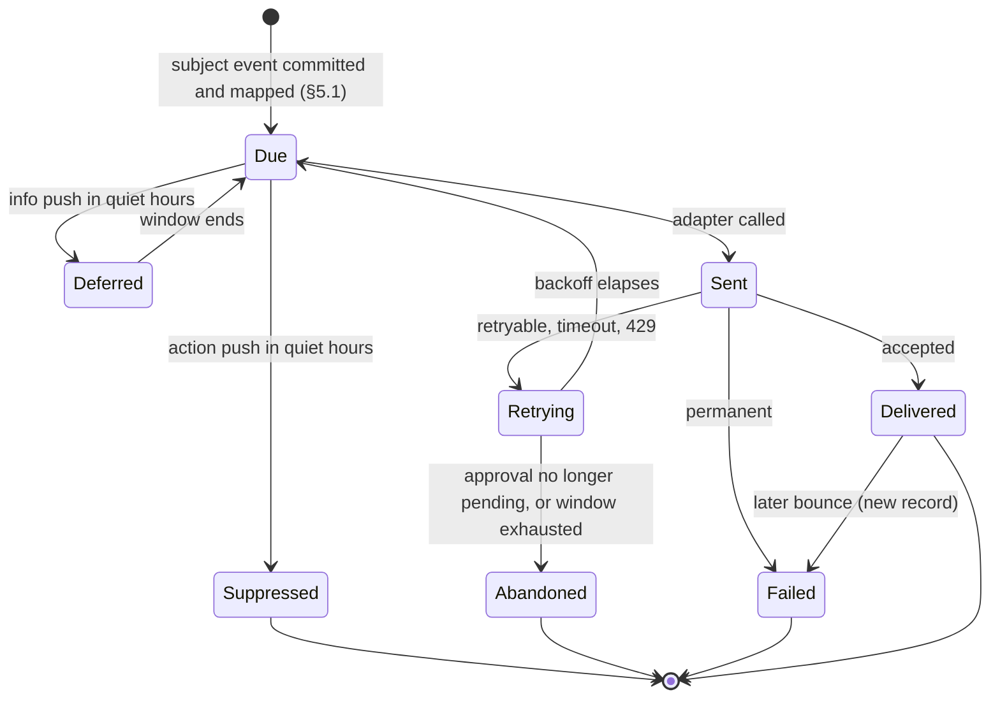

# Notifications and Approval Channels Spec (v0.1, draft)

| | |
|---|---|
| **Status** | Draft v0.1, not yet reviewed |
| **Owner** | Engineering |
| **Decisions** | [DEC-438](../project/decisions/DEC-438.md) (items 1 to 18 Accepted; items 19 to 26 Proposed for the founder) |
| **Backlog** | E8-4, E8-5, E8-7, and E8-9 to E8-14 ([backlog](../project/06-backlog-v1.md#e8-escalation-and-approvals)) |
| **Safety-critical** | Yes: notification payloads and the approval flow (`AGENTS.md`, "Safety-critical paths") |

This spec covers everything the platform sends to a person outside the workspace app: approval
requests, alerts about risk and protection, and the daily brief. It also covers the channels that
carry them, the relay in the global control plane, and how an approver gets from a notification back
into the workspace deployment to act. It adds no trading rule. The approval rules themselves (content,
deadline, admission checks 1 to 12, quorum, ask budget, cancellation) are the
[mandate spec §6.4](mandate.md#64-approvals)'s, and the events are the
[journal spec](journal.md#9-event-catalogue)'s. Where this spec touches them, those specs win; this
one only says what the notification path must do so that their rules hold.

Three sibling documents are drafted in parallel and own the pieces this spec leans on: the workspace
services API (`docs/specs/workspace-api.md`, DEC-436) serves the approval screen and records the
answer; the identity spec (`docs/specs/identity.md`, DEC-437) owns sign-in, step-up, roles, and
account recovery; the threat model (`docs/security/threat-model.md`, DEC-439) owns the
cross-plane attacker list. §8 lists the contracts this spec needs from each.

## Contents

1. Scope
2. Invariants
3. Message catalogue
4. Channels and payloads
5. Delivery
6. Acting on a notification
7. Lifecycle and failure walk
8. Cross-spec contracts
9. Adversaries
10. What exists and what is planned
11. Decisions
12. Open questions

---

## 1. Scope

### 1.1 In scope

| Area | What this spec decides |
|---|---|
| Notices | Every outbound notice: approval requests and reminders; alerts for risk limits and tripwires, kill switches, unprotected intervals and stalled exits, reconciliation mismatches, account restrictions, faults that pause an agent; spend caps and other information; the daily brief |
| Channels | Pull channels (`cli_inbox`, `web_inbox`); push channels (email and one chat channel at M7, web push at M10, SMS and phone later under E8-7); native mobile push later ([DEC-19](../project/04-decision-log.md#decisions)) |
| Payloads | The exact bytes that may leave the workspace deployment, and how that is enforced |
| Delivery | The dispatcher, the provider interface, retries, bounces, receipts, coalescing, rate limits, quiet hours, unsubscribe |
| Relay | The notification relay in the global control plane ([HLD §4](../HLD.md#global-control-plane-thin)) |
| Acting | The deep link back into the workspace deployment, sign-in, step-up, and the landing screen (G4 in [09-product-experience](../product/09-product-experience.md)) |

### 1.2 Out of scope

- The approval rules (mandate spec §6.4), delegations (§6.5), and tripwires (§6.7).
- Sign-in, step-up methods, roles, and recovery (identity spec). This spec only says where they are
  required.
- The workspace services API's routes and schemas (workspace API spec).
- Operator paging (on-call alerts to the team). It follows the same opaque rule
  ([infrastructure OPS-10](../design/infrastructure.md)), but the paging tool and its routing are
  the infrastructure design's.
- The in-app chat thread with an agent (D14, DEC-184). It is a workspace screen, not a notification
  channel.

### 1.3 Terms

| Term | Meaning |
|---|---|
| **Notice** | One thing the platform tells one recipient: a kind, a subject event, and a class |
| **Subject event** | The committed journal event a notice is about, named by its `event_id` (a ULID) |
| **Class** | `action` (an approval waits on the recipient), `safety` (something that holds, restricts, or protects money happened), or `info` (nothing the agent may do has changed) |
| **Pull channel** | A list the recipient reads inside the workspace: `cli_inbox` (the founder's CLI) and `web_inbox` (the web app's inbox and alerts center). The list is the journal itself, so it is delivered when the subject event commits |
| **Push channel** | Anything that sends a message out of the workspace deployment: email, chat, web push, SMS, phone |
| **Payload** | The bytes a push channel carries to a provider, relay, or device |
| **Address** | Where a push channel sends: an email address, a chat destination, a push subscription. Personal data, held in the vault ([journal spec §6.4](journal.md#64-personal-data-and-identity)) |
| **Dispatcher** | The workspace service that turns committed subject events into sends |

---

## 2. Invariants

Every rule below must preserve these. Each names its test; each test checks against an independent
oracle (a canary scan, a count derived from the journal, or a fault-injection harness), never against
the dispatcher's own predicate (`AGENTS.md`, "Getting it right the first time").

| ID | Invariant | How it is tested |
|---|---|---|
| NT-1 | **Payloads are opaque.** Anything that leaves the workspace deployment as a notice carries exactly the subject event's id and one text key from a closed set (§4.2), rendered through fixed templates. Never an instrument, side, quantity, price, order value, P&L, score, thesis, rule, deadline, agent name, mandate content, broker account, or personal data, the recipient's name included (`AGENTS.md` rule 6, [DEC-11](../project/04-decision-log.md#decisions), PX-6). The payload type has no field and no constructor that takes free text from domain data (rung 1) | Type test: the payload and every channel's rendered message are built only from `Notification`; a captured-payload test seeds a workspace whose instruments, agent names, rule ids, prices, and user names are unique canary strings, drives every notice kind through every channel adapter and the relay, and scans every captured byte for every canary (E8-5's acceptance) |
| NT-2 | **Addresses stay minimal and private.** A recipient is journaled and logged only as an opaque user id and a channel. The address is read from the vault at send time, passed to the one provider that needs it, and never journaled, logged, or put in a metric | Log, metric, and journal scans for canary addresses after a full run; a test that the dispatcher's only path to an address is the vault client |
| NT-3 | **Approval happens only inside the workspace.** A grant, a skip, an acknowledgment, or any owner command reaches the runtime only as a control-stream event that workspace services write after authenticating the user in the workspace deployment ([mandate spec §6.4](mandate.md#64-approvals) "Responses"). No channel adapter, relay, provider webhook, email reply, or chat message can write one | Layering: the notification crates cannot depend on the control-stream writer (`xtask/layers.toml`); a fuzz test feeds every inbound path (replies, chat messages, button callbacks, provider webhooks) and asserts the control stream is unchanged |
| NT-4 | **Links carry no authority.** A link holds the workspace app's fixed origin and the subject id, nothing else: no session, token, one-time code, or sign-in. Opening it requires sign-in; a grant requires step-up as mandate spec §6.1 and §6.4 require | Template test: every link matches `<origin>/n/<ULID>`; an end-to-end test opens a captured link with no session and reaches only the sign-in screen |
| NT-5 | **Delivery never adds risk** (rule 3). Failure, delay, duplication, or loss of any notice changes no order, intent, limit, or mode. Its only effect on trading state is check 4 (`not_delivered`), which can only refuse a response. An approval nobody could see times out to `skip` | Fault injection: with every push channel failing, hung, or duplicating, a soak run's intents, gate decisions, and modes are identical to a run with perfect delivery, except asks that time out to `skip` |
| NT-6 | **Nothing suppresses a safety notice.** Retry de-duplication, rate limits, coalescing, quiet hours, unsubscribe, and provider quotas never drop a `safety` notice. Every `safety` subject event produces, within 60 seconds of its commit while the dispatcher runs, a send attempt on every configured push channel the recipient has not lost (§5.6) and an entry in the pull channels | Property test: random storms of safety events across quiet hours, rate limits, and provider 429s; an oracle derived from the journal's subject events counts the attempts per subject, recipient, and channel and requires every one within the bound |
| NT-7 | **Quiet hours never delay a safety notice.** Quiet hours apply only to `action` push sends (suppressed, as mandate spec §6.4 says) and `info` push sends (deferred to the window's end). Pull channels are never affected, so a request stays listed and grantable | Property test over random quiet-hour windows, including ones spanning midnight and the DST changes (`mandate_approval::deliver_now`'s DST cases extended per class) |
| NT-8 | **Every send is journaled, and only after its subject.** The dispatcher sends nothing about an event that is not committed. Every attempt's outcome is journaled: kind, subject, recipient (opaque), channel, attempt, status, provider message id, and time. A crash between a send and its record re-sends the notice (at least once); it never loses one | Crash injection at every step of a send; an oracle that reads only the journal finds, for every subject event with a notice kind, a terminal outcome per recipient and channel |
| NT-9 | **The notification path is never in the trade path.** No exit, protective order, risk exit, kill switch, owner exit, or gate decision waits on, is ordered after, or fails because of the dispatcher, a provider, or the relay (rule 13; [OPS-4](../design/infrastructure.md), [OPS-12](../design/infrastructure.md)) | Fault injection: the kill-switch and exit suites pass with the dispatcher hung and the relay unreachable |
| NT-10 | **Notices stay in their workspace.** A notice goes only to users of the subject's workspace whose role may see that kind (§3.3); its link resolves only for such a user, and to anyone else it looks the same as a missing subject | Two-workspace test: a user of workspace B opening workspace A's link gets the same response as for a random ULID |
| NT-11 | **Being notified is not being allowed.** Receiving a notice gives no right to act. A response is still judged by checks 1 to 7 (mandate spec §6.4): a notice sent to someone outside `autonomy.approval.approvers` changes nothing, and a removed approver is refused `not_an_approver` | Admission test: responses from every recipient class that is not a current approver are refused |
| NT-12 | **Notices never advise or persuade.** The text set has no trade, no urgency beyond "needs your approval", no outcome, and no count of profit or loss (rule 6; mandate spec §6.4 "Never persuasive language") | A wording test over the closed text set, against the advice-wording list `the_content_never_carries_advice_wording` uses |

**Claims not made.** Push delivery is best effort: no invariant promises a person *read* a notice.
Safety does not depend on it: limits are enforced by the gate whether or not anyone is told (rule 1),
and an unanswered approval is a skip.

---

## 3. Message catalogue

### 3.1 Classes

| Class | Push channels | Quiet hours (push) | Retry window | Coalescing | Rate limit |
|---|---|---|---|---|---|
| `action` | Every configured push channel, at once | Suppressed and journaled `suppressed_quiet_hours`; the pull channels still list it (mandate spec §6.4) | Until the approval stops being pending | No | Bounded by the ask budget (mandate spec §6.4) and one reminder |
| `safety` | Every configured push channel, at once | Ignored | 24 hours | Yes, never dropping (§5.4) | None |
| `info` | Only the daily brief pushes; every other `info` kind goes to the pull channels and the next brief (PX-16) | The brief waits for the window's end | 6 hours | No | One brief per recipient per risk day |

PX-16 (DEC-198) fixed what may interrupt: asks with a deadline, risk-limit alerts, restrictions and
reconciliation holds that need an acknowledgment, a fired tripwire, and a kill switch. The `safety`
class is that list plus the protection alerts the alerts center (G5) already treats as safety.

### 3.2 Catalogue

The kind is an internal key. It is journaled and shown inside the workspace, and **never sent**: the
payload carries only the text key (§4.2), so a provider learns at most whether a notice is an
approval, an alert, or the brief.

| Kind | Trigger (committed subject event) | Class | Text key | Recipients |
|---|---|---|---|---|
| `approval_requested` | `ApprovalRequested` (agent stream) | action | `approval_needed` | The approval's approvers |
| `approval_reminder` | The approval is still pending when a quarter of `timeout_s` remains and at least 60 seconds remain; the subject is the `ApprovalRequested` | action | `approval_needed` | Approvers who have not responded |
| `risk_limit` | `RiskLimitTriggered`, any limit, a tripwire included ([mandate spec §5.10](mandate.md#510-journal-events), §6.7) | safety | `attention_needed` | Owners |
| `kill_switch` | `KillSwitchActivated` on any stream, whoever initiated it (owner, automated limit, or `PlatformOperatorAction`) ([trading spec §5.5](trading-domain.md#55-kill-switch)) | safety | `attention_needed` | Owners, and every workspace admin for an account-wide or operator switch |
| `agent_held` | `AgentModeApplied` or `AgentModeChanged` to `paused` or `exits_only` that the owner did not command: faults, an instrument that became non-tradable, an out-of-scope corporate action, an unmapped broker status ([trading spec §7.4](trading-domain.md#74-agent-modes)) | safety | `attention_needed` | Owners |
| `account_restriction` | `AccountRestrictionChanged` (trading spec §7.3) | safety | `attention_needed` | Owners of every agent on the account |
| `protection` | `ProtectionChanged` for an unprotected interval that reached `max_unprotected_s`, or the triggered-stop watchdog ([trading spec §5.4](trading-domain.md#54-protective-exits-dec-28-dec-36)); executor keys `unprotected_interval_limit`, `stop_watchdog` | safety | `attention_needed` | Owners |
| `exit_stalled` | An exit resting at the ladder's floor, held past its bound, or with nothing to price from, and the owner-exit remainder at its floor ([trading spec §5.6](trading-domain.md#56-exit-pricing)); executor keys `exit_ladder_floor`, `exit_held_long`, `exit_unpriced` | safety | `attention_needed` | Owners |
| `reconciliation` | `ReconciliationRun` with a difference that pauses or alerts ([trading spec §11](trading-domain.md#11-reconciliation)); executor keys `reconciliation_mismatch`, `reconciliation_cash_drift`, `reconciliation_fees` | safety | `attention_needed` | Owners |
| `external_activity` | `ExternalActivityIngested` (trading spec §7.1) | safety | `attention_needed` | Owners |
| `account_state` | Allocations exceeding account equity ([mandate spec §5.1](mandate.md#51-capital-equity-and-allocation-changes-dec-39-dec-50-dec-53)), a policy that makes a version nonconforming, the Holding state starting (mandate spec §3.1) | safety | `attention_needed` | Owners |
| `data_feed_down` | The market-data connection `down` past the data plane's threshold (data plane spec §3.2) | safety | `attention_needed` | Owners |
| `integrity_incident` | `IntegrityIncidentRecorded` (journal spec §11) | safety | `attention_needed` | Owners and workspace admins |
| `daily_brief` | The brief for the risk day is built (D13, DEC-184) | info | `brief_ready` | Owners |
| `delegation_ended` | A delegation expires, is spent, or is suspended (mandate spec §6.5) | info | none (pull and brief only) | Owners |
| `model_status` | A pinned model deprecated or withdrawn (inference spec; mandate spec §8.1) | info | none | Owners |
| `research_status` | A lineage retired or a thesis halt (mandate spec §8.6) | info | none | Owners |
| `spend_cap` | A spend cap refuses a reservation, `budget_exhausted` (inference spec) | info | none | Owners |
| `approval_closed` | `ApprovalTimedOut`, `ApprovalCanceled`, or a terminal `ApprovalRevalidated` | info | none | The approval's approvers |

`ask_suppressed` decisions are never notices; the brief lists them once (DEC-195). "Owners" means the
users the workspace's alert routing names (§3.3).

### 3.3 Recipients

- An `action` notice goes to each user in the approval's `autonomy.approval.approvers`, resolved at
  the request.
- `safety` and `info` notices go to the agent's approvers and to the users the workspace's alert
  routing adds. Until roles exist (E9-2), that is the founder. With roles, the identity spec says
  which roles may receive which class; a viewer may receive `info` but never `action` (§8).
- A recipient is an opaque user id. A user with no address on any push channel still has the pull
  channels.

---

## 4. Channels and payloads

### 4.1 Channels

| Channel | Kind | Where it runs | Stage | Notes |
|---|---|---|---|---|
| `cli_inbox` | Pull | The founder's CLI reading the journal | Built (M7, E8-1 to E8-3) | Delivered in the request's own batch, never suppressed (DEC-156 item 6) |
| `web_inbox` | Pull | The web app's inbox and alerts center (G5) | M9 | Same rule as `cli_inbox`: the list is the journal, read through the workspace API |
| `email` | Push | From the workspace deployment to a mail provider | M7 | §4.4 |
| `slack` or `telegram` | Push | From the workspace deployment to the chat provider | M7: one of them (DEC-438 item 20) | §4.5. Outbound only |
| `web_push` | Push | The workspace deployment, directly or through the relay, to the browser's push service | M10 | §4.6 |
| `sms`, `phone` | Push | A messaging provider | E8-7 (P1) | Same payload rule; phone reads the text aloud |
| Native mobile push | Push | The relay to Apple's and Google's push services | After v1 (DEC-19) | Needs the relay's app credentials |

The mandate's `notifications.channels` (schema enum `email`, `phone`, `slack`, `sms`, `telegram`,
`web_push`) names the push channels; the pull channels are always on and are not listed. Removing a
channel is a risk-increasing change and adding one is neutral ([mandate spec §9.2](mandate.md#92-classification)).

### 4.2 The payload

The payload is today's `mandate_approval::notification_payload`, generalized:

```
{"subject": "<26-character ULID of the subject event>", "text": "<text key>"}
```

| Text key | Rendered text (English) |
|---|---|
| `approval_needed` | "An agent in your workspace needs your approval" (fixed by mandate spec §6.4 and PX-6) |
| `attention_needed` | "Your workspace has a new alert" |
| `brief_ready` | "Your daily brief is ready" (D13) |

- `subject` is built only by `ApprovalRef::of_requested_event`-style constructors that accept a
  ULID-shaped event id and nothing else (DEC-165 item 13). The kind, the class, the agent, and the
  workspace are not in the payload.
- The text set is a closed enum. Adding a key is a spec change; no key may name a kind more
  precisely than "approval", "alert", or "brief".
- PX-6's option (c), a platform-assigned label such as "Agent 7" that the owner can turn on, would
  add one optional field holding a label from a fixed platform pattern. It is not in v0.1: it needs
  its own decision on whether a stable label lets a provider link notices over time (§12 item 3).

### 4.3 Rendering and links

Every channel renders from the payload and fixed templates only. The **link** is
`<origin>/n/<subject>`, where `<origin>` is the workspace app's fixed origin from the deployment's
configuration: the managed app's origin, or in hybrid and on-prem the customer's own workspace app
origin, which may be reachable only on their network. The link never holds a token, a session, a
one-time code, a query string, or a tracking parameter (NT-4). The product name in copy is Owlhead
(DEC-171).

### 4.4 Email

- **Sender:** a fixed no-reply address on a sending subdomain of the product domain, with SPF, DKIM,
  and DMARC `p=reject` (DEC-438 item 23). Replies go to a mailbox that discards them; nothing reads
  a reply (NT-3).
- **Subject:** the rendered text. **Body:** the rendered text, the sentence "Open Owlhead to see
  it.", the link, and the footer placeholder `[[EMAIL-FOOTER]]`, whose wording is the founder's and
  counsel's (DEC-79). Plain text, plus HTML with no remote images, no tracking pixel, and no styling
  fetched from elsewhere.
- **Provider settings:** open and click tracking off, so the provider never rewrites the link
  through its own domain; message retention at the provider set to the minimum it offers.
- **No greeting by name** (NT-1). The address is the only personal data the provider receives.
- **Unsubscribe:** `List-Unsubscribe` appears only on `info` mail (the brief). §5.7.

### 4.5 Chat

- **Slack:** an incoming webhook into a channel the owner chooses. The webhook URL is a credential:
  it lives in the vault and is never logged (rule 7). Link unfurling is turned off in the message.
- **Telegram:** the platform's bot posts to the owner's chat. The owner links the chat by sending the
  bot a short-lived code that the web app or CLI shows to the signed-in owner; this is the only
  inbound message the bot acts on, and it can only record a chat address for that owner.
- **Outbound only.** No buttons, no slash commands, no interactive callbacks. Every other inbound
  message, reaction, or callback is discarded unread (NT-3). The message is the rendered text and
  the link.
- **Hybrid and on-prem:** the customer may point the chat channel at their own Slack or Teams
  webhook, as the HLD's deployment modes allow ([HLD §4](../HLD.md#deployment-modes)). Teams is not
  in the schema enum yet (§12 item 5).

### 4.6 Web push and the relay

- **Encryption.** The workspace deployment encrypts the payload to the subscribing browser with Web
  Push message encryption (RFC 8291) and signs with its own application server key (RFC 8292). The
  browser's push service and the relay see only ciphertext, of a payload that is opaque anyway.
- **Direct or relayed.** A managed workspace deployment sends to the push service directly. A hybrid
  deployment whose egress allows only the global control plane sends through the relay over its
  existing outbound mutual-TLS link ([HLD §4](../HLD.md#workspace-deployment)).
- **The relay** accepts `{relay_id, endpoint, urgency, ttl_s, ciphertext}`. It checks that the
  ciphertext is at most 512 bytes and `urgency` is `high` (`action`, `safety`) or `normal`
  (`info`), forwards, and returns the push service's status. It stores no ciphertext after the
  attempt, logs opaque ids and counts only, and has no route into any workspace deployment. The size
  cap bounds what a compromised deployment could smuggle through it.
- **The service worker** shows the rendered text and, on a tap, opens the link. It caches no
  approval, position, or mandate content (P5, 09-product-experience §7).
- **Native push** (after v1) goes through the relay, which alone holds the app's push credentials;
  the same payload and size rules apply.

---

## 5. Delivery

### 5.1 The dispatcher

The dispatcher is a workspace service that **tails the journal**, which is its outbox:

1. It reads committed events on the agent, account, and control streams of its workspace and maps
   each subject event to zero or more notices (§3.2). It never receives a notice from anywhere
   else, so a notice can never name an uncommitted event (NT-8, rule 5).
2. For each notice, recipient, and push channel it reads the address from the vault and sends
   through the channel's adapter (§5.2).
3. It journals each attempt's outcome (§5.5).
4. On restart it replays from its last recorded outcome: any notice with no terminal outcome is due
   again, as are reminders whose time has passed while the approval is still pending.

**M7 shape.** At M7 there is no separate service: the runtime's and executor's shells host the
dispatcher. The runtime still emits `Effect::NotifyApproval` after the `ApprovalRequested` draft in
the same effect list, and journals `ApprovalDelivered` for each channel (M7 brief). The executor's
`Effect::Notify` alerts reach the same dispatcher. From M8 the dispatcher moves into workspace
control services and reads the streams instead of effects; the records do not change.

**Idempotency key:** `(subject event id, kind, recipient, channel)`. A retry reuses it; a provider
that supports idempotency keys is given it, so a resend after a crash is a duplicate at most once
per channel.

### 5.2 Provider interface

Every channel is one adapter behind one interface:

| Operation | Takes | Returns |
|---|---|---|
| `send` | A `Notification` (closed), the rendered template for the channel, an address handle, the idempotency key | `accepted { provider_message_id }`, `retryable { reason }`, or `permanent { reason }` |
| `receipt` (inbound) | A provider callback, verified by the provider's signature | `delivered`, `bounced`, `complained`, or `unsubscribed`, for a `provider_message_id` |

- Adapters take no string from the caller except the address handle, which they dereference
  through the vault client. They cannot read the journal or write the control stream (NT-3).
- `reason` is a closed enum (`timeout`, `rate_limited`, `provider_error`, `address_rejected`,
  `auth_failed`, `too_large`); provider error text is never journaled or logged, since a provider
  may echo the message.
- A receipt can only mark an attempt or an address. It never changes an approval or any trading
  state (NT-5).

### 5.3 Retries

| Class | Attempts | Stops when |
|---|---|---|
| `action` | At once; then after 15 s, 60 s, 5 min; then every 15 min | The approval is no longer pending (terminal event, deadline passed, or cancellation), recorded as `abandoned` with reason `not_pending` |
| `safety` | Same schedule | Accepted, a permanent failure, or 24 hours |
| `info` | Same schedule | Accepted, a permanent failure, or 6 hours |

A `retryable` result, a timeout, and a provider 429 all retry. `permanent` stops that channel for
that notice and, for `address_rejected` or `auth_failed`, marks the address (§5.6).

### 5.4 Coalescing and rate limits

- **Safety notices are coalesced, never dropped.** The first `safety` notice to a recipient on a
  channel goes at once. Further `safety` notices to the same recipient and channel within the next
  60 seconds are combined into one message sent at the window's end, whose subject is the first of
  them and whose link opens the alerts center. Every combined notice gets its own outcome record
  pointing to the combined message's provider id, so the oracle of NT-6 counts it. No `safety`
  notice waits more than 60 seconds.
- **Action notices** are bounded by the ask budget (10 `ApprovalRequested` per agent per risk day,
  mandate spec §6.4), one pending risk-adding approval per agent, and one reminder each.
- **Info notices** push only the brief, once per recipient per risk day.
- **Provider quotas.** A provider's rate limit is a `retryable` failure. A per-workspace send quota,
  if one is ever set to bound cost, counts `action` and `info` only; `safety` is never refused by it.

### 5.5 Records

| Record | Stream | When | Fields |
|---|---|---|---|
| `ApprovalDelivered` | Agent (runtime) | Each channel's outcome for an approval at M7, and the pull channel's `delivered` in the request's own batch at every stage | As journal spec §9: approval, channel, status, message id |
| `OwnerAlertSent` | Control (workspace services) | Each attempt's outcome for every other notice, and from M8 for approval push sends too | Today: subject event, channel, delivery status. Added by E8-9: `kind`, `recipient` (opaque), `attempt`, `status` (`delivered`, `failed`, `suppressed_quiet_hours`, `deferred_quiet_hours`, `abandoned`), `reason`, `provider_message_id`, `coalesced_into` |

`delivered` means the provider accepted the message, not that a person read it. A later bounce is a
new record for the same provider message id with `failed` and reason `bounced`; it never retracts an
earlier `delivered`, and check 4 is satisfied by the pull channel in any case. The journal-spec
change for the added fields lands in E8-9's tests PR, under the journal spec's own change rule.

### 5.6 Bounces, complaints, and lost addresses

- A hard bounce, `address_rejected`, or a complaint marks that user's address on that channel
  `unreachable`. The dispatcher stops sending to it and raises an `account_state`-style alert on the
  user's other channels and the pull channels, saying a notification channel stopped working.
- `auth_failed` (a revoked Slack webhook, a removed Telegram bot) does the same, and also raises an
  operator alert when the credential is the platform's (the Telegram bot token).
- An address comes back only when the signed-in user re-verifies it in the workspace.
- An owner whose every push address is `unreachable` still has the pull channels. No trading state
  changes (NT-5); whether a live agent should hold openings in that case is Proposed (DEC-438 item
  25).

### 5.7 Unsubscribe and mandatory notices

| Notice | Can the recipient stop it? |
|---|---|
| `info` push (the brief) | Yes, from the email's unsubscribe link or the settings screen; the brief stays readable in the app |
| `action` and `safety` push | Not by a link. They follow the mandate's `notifications.channels`; removing a channel is a mandate version, risk-increasing, so it is confirmed with step-up (mandate spec §9.2). A provider-level unsubscribe or suppression is honored as a lost address (§5.6), never ignored |

The mandate schema keeps at least one push channel (`minItems: 1`), so an owner always has one
configured; whether it still works is §5.6's question.

### 5.8 Quiet hours

`notifications.quiet_hours` is `[start, end)` in America/New_York wall time
(`mandate_approval::deliver_now`). At send time:

- `action` push inside the window: not sent; `suppressed_quiet_hours` recorded. The reminder is
  judged on its own time the same way. Not deferred, so a request made at 02:00 with a 15-minute
  deadline is never pushed at 07:00 after it has expired.
- `safety`: sent; quiet hours are not read (NT-7).
- `info` (the brief): deferred to the window's end, recorded `deferred_quiet_hours`, then sent.

A request is grantable once delivered on any channel, and the pull channel always is, so quiet hours
never make a request ungrantable; they only mean nobody was interrupted.

---

## 6. Acting on a notification

1. **Open.** The link opens `<origin>/n/<subject>`. The page title is generic and the page shows only
   a sign-in until the user is authenticated (G4).
2. **Sign in.** Passkey or OIDC against the workspace deployment's identity configuration (identity
   spec). In hybrid and on-prem, against the customer's identity provider, from the customer's own
   app origin; off their network, the screen says "Cannot reach your workspace" and caches nothing.
3. **Resolve.** The app asks the workspace API for the subject among the workspaces the user belongs
   to. A subject the user may not see answers exactly as a missing one does (NT-10).
4. **Show.** For an approval, the content object from the approval service (mandate spec §6.4
   "Content"), with the deadline and the default. For an alert, the screen that resolves it.
   A subject that is no longer pending shows its terminal state: "skipped" with the time, or
   "canceled" with the reason (G4's Expired state).
5. **Answer.** Approve, Skip, or (where offered) a delegation shape. A grant needs step-up valid at
   its effective time (mandate spec §6.1; live approvals need a fresh assertion within
   `STEP_UP_WINDOW_S`, 300 seconds, one assertion per approval, PX-7). A skip needs sign-in only.
6. **Record.** Workspace services commit `ApprovalResponseSubmitted` with the content hash the screen
   showed. From here the mandate spec decides: checks 1 to 7, then re-validation 8 to 12. The screen
   then shows what happened: submitted after the gate re-ran, or skipped with the reason.

No step happens in a provider, the relay, an email client, or a chat app. The deep link is a
convenience; opening the app directly reaches the same inbox.

---

## 7. Lifecycle and failure walk

**One notice:**



**Failures and boundaries:**

| Situation | What happens | Effect on trading | Recorded as |
|---|---|---|---|
| **A provider is down** | Retries per §5.3; other channels unaffected; after the window, `failed` | None. An approval stays grantable through the pull channels and otherwise times out to `skip` | `OwnerAlertSent` or `ApprovalDelivered`, `failed`, per attempt |
| **The relay is down** | Relayed web push fails and retries; email and chat leave the deployment directly and are unaffected; managed web push does not use the relay | None (NT-9, OPS-12). The status strip says relay push is unavailable (09-product-experience §7) | `failed`, reason `provider_error` |
| **The dispatcher is down** | Nothing is sent; on restart it replays from the journal and sends what is still due; an operator alert fires when its lag passes 60 seconds | None. Approvals stay listed in the pull channels; any that expire meanwhile are skipped | Outcomes appear late; the lag is an operator metric |
| **A crash between send and record** | The notice is re-sent with the same idempotency key | None | Two attempts, one possibly a duplicate the recipient sees |
| **The user is unreachable on every push channel** | Pull channels only; §5.6 alerts on any channel still working | None. Asks time out to `skip`; limits hold regardless | `failed` and the lost-address alert |
| **The deadline passes** | Retries stop; the reminder is not sent if under 60 seconds would remain; the runtime journals `ApprovalTimedOut` at the first tick at or after the deadline | `skip` (mandate spec §6.4) | `abandoned`, `not_pending`; `ApprovalTimedOut` |
| **The approver acts after cancellation or timeout** | The screen shows the terminal state. A response already in flight is committed and refused `not_pending` or `late` | None | `ApprovalResponded`, `refused` |
| **A version applies while an approval is pending** | `ApprovalCanceled` (`version_applied`) in the same step; retries stop; no push is sent about the cancellation; the inbox shows it closed | `skip`; any new ask happens afresh under the new version | `ApprovalCanceled`; `abandoned` |
| **A kill switch, pause, or Stop while an approval is pending** | As a version change, reason `kill_switch`, `owner_pause`, or `owner_stop`; the kill switch's own `safety` notice goes out | The switch never waits on the dispatcher (NT-9) | `ApprovalCanceled`; `kill_switch` notice outcomes |
| **The approver is removed from `approvers`** | The removal is a version, so the approval is canceled as above; a stale notice opens a closed request | None | As above |
| **Quiet hours begin or end mid-retry** | Each attempt is judged at its own send time (§5.8) | None | `suppressed_quiet_hours` or `deferred_quiet_hours` per attempt |
| **The notice arrives after the request closed** | Link opens the terminal state | None | Nothing new |
| **The same notice arrives twice** | The landing screen shows the subject's current state either time | None | Two attempts |
| **The workspace deployment is unreachable from the phone** (hybrid, off VPN) | "Cannot reach your workspace", no content cached | None; the approval times out to `skip` if nobody reaches it | Nothing, since nothing reached the deployment |
| **The global control plane is down** | Only relay push is lost; hybrid customers' email and chat go through their own gateways (HLD §4) | None (OPS-12) | Relayed attempts `failed` |
| **A safety storm** (hundreds of reconciliation alerts) | Coalesced per recipient and channel per 60-second window; every subject recorded | None | One `OwnerAlertSent` per subject, with `coalesced_into` |
| **Restart with approvals pending** | Pending approvals survive with their deadlines (mandate spec §6.4); the dispatcher resumes due reminders | None | As before the restart |

---

## 8. Cross-spec contracts

| Needed from | Contract | Status |
|---|---|---|
| Mandate spec §6.4 | Payload is exactly the approval id and one generic text; quiet hours suppress push only; a request is grantable once delivered on one channel; risk-limit alerts ignore quiet hours | Consistent. This spec adds `web_inbox` as a second pull channel under the same reading as `cli_inbox` (DEC-438 item 3) |
| Mandate spec §6.5, §6.7 | Delegation ends and fired tripwires produce `OwnerAlertSent` with opaque text; a fired tripwire is a risk-limit alert | Consistent: `delegation_ended` is `info`, a tripwire is `risk_limit` (`safety`) |
| Journal spec §9 | `ApprovalDelivered` and `OwnerAlertSent` carry the outcome fields of §5.5 | `OwnerAlertSent` lacks `kind`, `recipient`, `attempt`, `reason`, `provider_message_id`, `coalesced_into`, and two statuses. Added by E8-9's tests PR |
| Identity spec (DEC-437) | Sign-in from a deep link; step-up per grant within 300 seconds for live; **account recovery for an approver never relies on email or chat alone**, since those are the channels this spec sends to; which roles may receive each class | Required of the sibling; listed here so it is not lost |
| Workspace API spec (DEC-436) | Resolve a subject id across the user's workspaces with no existence oracle; serve approval content; commit `ApprovalResponseSubmitted`; list the pull channels | Required of the sibling |
| Threat model (DEC-439) | Includes §9's attackers for the notification path | Required of the sibling |
| Infrastructure design | OPS-10 opaque operator alerts; the "approval notification delivered, p95 under 30 seconds" SLO; vault for addresses and webhook URLs | Consistent |
| 09-product-experience | P5, PX-6 (b), PX-7 (b), PX-16 (b), G4, G5, X3, D13 | Consistent. The HLD's flow C example that names an agent is corrected in this change |

---

## 9. Adversaries

| Attacker | Attack | Defence | Residual |
|---|---|---|---|
| **Phisher** | Sends a lookalike email or chat message ("Approve now") linking to a lookalike origin to harvest a sign-in | Our notices carry only generic text and a link to the fixed origin; DMARC `p=reject` stops spoofing of our exact domain; passkeys are bound to the real origin and fail on a lookalike; no notice ever asks for a reply, a code, or a password, and the app says so on X3 | A user who signs in with a password-based OIDC provider on a lookalike can lose that password; step-up for live grants still needs the passkey |
| **Someone with the user's email or chat account** | Reads notices; follows links; tries a password reset | They learn that an approval or alert exists, and its timing. A link opens only a sign-in; nothing is approved by reply (NT-3); recovery must not rest on email alone (§8, identity spec) | Activity timing is visible to them |
| **A leaked Slack webhook** | Posts fake messages into the owner's channel | They can post phishing text but not act; same defences as the phisher | Phishing surface |
| **Malicious relay operator or push service** | Reads, drops, delays, replays, or forges push | Reads only ciphertext of an opaque payload. Dropping or delaying turns into a `skip` or a later alert, and email and chat do not pass through the relay. A replay is a duplicate. A forged push can only show our generic text or a link to the fixed origin the service worker opens | Traffic analysis: the count and timing of notices per workspace reveal activity levels (§12 item 4) |
| **Malicious insider at the platform** | Tries to approve through the notification path, or to read content from it | The notification path has no write to the control stream (NT-3); check 3 refuses any actor that is not a listed user; there is no content in the path to read | Insider risks elsewhere belong to the threat model |
| **A compromised workspace deployment** | Tries to exfiltrate data through notices | The relay's 512-byte cap and schema check bound it; email and chat leave directly and are bounded only by the deployment's own code | A fully compromised deployment has the data anyway; the threat model owns it |
| **Notification flooding** (a bug, a hostile connected agent, or market chaos) | Floods the owner so real alerts are ignored, or exhausts the provider quota | Ask budget and one pending risk-adding approval per agent; owner-connected agents' asks count against the client budget (DEC-195); `safety` storms are coalesced; quotas never refuse `safety` | An owner may still tune out a burst of `attention_needed` |
| **Link replay or forwarding** | Replays a captured link, or forwards a notice to someone else | The link carries no authority; the receiver must sign in as a member of the workspace and pass check 3 and step-up; a replayed submission re-uses a step-up assertion and is refused `step_up_reused` | None beyond showing a sign-in page |
| **Forged provider webhook** | Fakes bounces to silence a channel | Webhooks are signature-verified; even a forged one only marks an address lost, which alerts the user on other channels | A silenced channel until the user re-verifies |
| **Bad model or prompt injection** | Gets model text into a notice | No free-text path into a payload (NT-1); model outputs reach only the content object, inside the workspace | None |
| **Careless user** | Sets quiet hours to the whole day, or keeps one dead channel | Approvals are still grantable from the pull channels and otherwise skip; `safety` ignores quiet hours; a dead channel raises §5.6's alert | They may miss alerts; limits hold regardless |
| **Bad market tick** | Triggers a burst of alerts | Alerts follow committed events only; coalescing bounds the messages | None |

---

## 10. What exists and what is planned

| Piece | Exists today | Planned |
|---|---|---|
| Approval payload | `mandate_approval::Notification` with `ApprovalRef` (ULID only) and `GenericText::ApprovalNeeded`; `notification_payload` gives `{"subject", "text"}` | E8-9 adds `attention_needed` and `brief_ready` |
| Alert payload | `NotificationRef { subject_event, message_key: &'static str }` in `mandate-runtime` and `mandate-executor`, emitted as `Effect::Notify` with nine executor keys and one runtime key | E8-9 replaces `message_key` with the closed kind enum (rung 1: a `&'static str` can be any literal) and maps each kind to a text key |
| Quiet hours | `mandate_approval::deliver_now` (push vs `cli_inbox`, DST-tested) | E8-10 judges by class (§5.8) |
| Pull channel | `cli_inbox`: `ApprovalDelivered` in the request's own batch; `mandate approvals list` and `show` | `web_inbox` with the web app (E8-13) |
| Delivery records | `ApprovalDelivered` written by the runtime; `OwnerAlertSent` catalogued but **not written by anything**: executor alerts reach only the tracer's report today | E8-10 writes every outcome (NT-8) |
| Dispatcher | None. The shell collects alerts into the tracer report | E8-10 |
| Email, chat | None | E8-11, E8-12 (M7) |
| Web push, relay | None; the relay is an HLD box | E8-14 (M10) |
| Deep-link landing | None; the web app renders fixtures (DEC-200) | E8-13 (M9/M10), with the workspace API and identity specs |
| SMS, phone, escalation chain | None | E8-7 |
| Captured-payload test | None | E8-5's acceptance, run for each channel as it lands |

---

## 11. Decisions

[DEC-438](../project/decisions/DEC-438.md) records them. Items 1 to 18 are reversible engineering
readings the agent accepted; most only tighten what the specs already say. Items 19 to 26 are the
founder's (DEC-79: spending, vendors, legal wording, or a new restriction); until each is decided,
the most conservative option holds: `cli_inbox` only, no vendor, no spend.

---

## 12. Open questions

1. **Who receives alerts in a multi-user workspace.** §3.3 sends to approvers plus an alert routing
   list; the identity spec decides which roles may be on it.
2. **Teams and other customer chat tools.** The schema enum has `slack` and `telegram` only; a
   hybrid customer's Teams webhook needs an enum value and a decision.
3. **PX-6 (c), the opaque agent label.** A stable label lets a provider link notices about one agent
   over time. Decide whether it is per notice, per day, or stable before building it.
4. **Traffic analysis.** Notice counts and timing reveal how active a workspace is. Padding or cover
   traffic is not planned for v1; the threat model should state the residual.
5. **Escalation order for SMS and phone.** v1 fans out to every configured channel at once. With
   E8-7, the HLD's push → SMS → phone chain needs an ordered field in the mandate's `notifications`,
   which is a schema change.
6. **The brief's send time.** D13 says one a day; §3.1 assumes the end of quiet hours, or 08:00
   America/New_York without them. The product brief should fix it.
