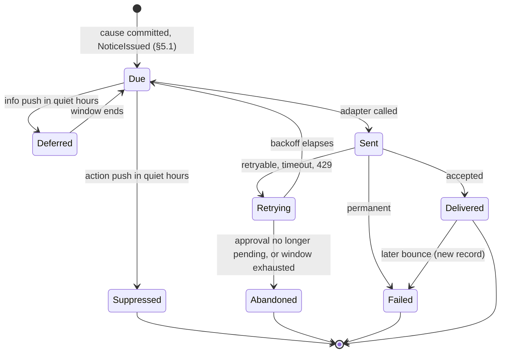

# Notifications and Approval Channels Spec (v0.7, draft)

| | |
|---|---|
| **Status** | Draft v0.7: a failed attempt's record carries the provider's verdict, and §7's provider-down row ends `abandoned` ([DEC-706](../project/decisions/DEC-706.md), §5.1, §5.5, §7); v0.6: what a relay refusal means to the deployment ([DEC-728](../project/decisions/DEC-728.md), §4.6, §5.2); v0.5: a relayed send's VAPID `sub` is a role mailbox, never a person's address ([DEC-727](../project/decisions/DEC-727.md), §4.6); v0.4: the relay carries the deployment's VAPID header, the founder's choice on DEC-724 item 9 ([DEC-726](../project/decisions/DEC-726.md), §4.6, §9); v0.3: wording and consistency only (DEC-712, DEC-722, and [#763](https://github.com/kunwarshivam/mandate/pull/763)'s review minors; freeze rule); v0.2 fixed round 1's minors (E8-16); v0.1 was reviewed in [#558](https://github.com/kunwarshivam/mandate/pull/558) |
| **Owner** | Engineering |
| **Decisions** | [DEC-438](../project/decisions/DEC-438.md) (items 1 to 18 and 27 to 29 Accepted; items 21, 23, and 24 for mail to the founder's own address decided by the founder in [DEC-820](../project/decisions/DEC-820.md); items 19, 20, 22, and 25 decided by the founder, 2026-10-08 (DEC-824); item 26 and item 24 for any other recipient Proposed for the founder); v0.2's readings [DEC-700](../project/decisions/DEC-700.md), the code layout [DEC-701](../project/decisions/DEC-701.md), and the notice id's source [DEC-702](../project/decisions/DEC-702.md) (Accepted, agent); v0.3's readings DEC-712 (who dereferences the address, and `send` renders) and DEC-722 (allowlist labels) (Accepted, agent); v0.4's relay request, [DEC-726](../project/decisions/DEC-726.md) (item 1 decided by the founder; items 2 to 8 Accepted, agent); v0.5's relayed subject, [DEC-727](../project/decisions/DEC-727.md) (Accepted, agent); v0.6's relay refusals, [DEC-728](../project/decisions/DEC-728.md) (Accepted, agent); v0.7's verdict on a failed attempt, [DEC-706](../project/decisions/DEC-706.md) (Accepted, agent) |
| **Backlog** | E8-4, E8-5, E8-7, E8-9 to E8-14, and E8-16 ([backlog](../project/06-backlog-v1.md#e8-escalation-and-approvals)) |
| **Safety-critical** | Yes: notification payloads and the approval flow (`AGENTS.md`, "Safety-critical paths") |

This spec covers everything the platform sends to a person outside the workspace app: approval
requests, alerts about risk and protection, and the daily brief. It also covers the channels that
carry them, the relay in the global control plane, and how an approver gets from a notification back
into the workspace deployment to act. It adds no trading rule. The approval rules themselves (content,
deadline, admission checks 1 to 12, quorum, ask budget, cancellation) are the
[mandate spec §6.4](mandate.md#64-approvals)'s, and the events are the
[journal spec](journal.md#9-event-catalogue)'s. Where this spec touches them, those specs win; this
one only says what the notification path must do so that their rules hold.

Three sibling documents are drafted in parallel and own the pieces this spec leans on: the workspace
services API (`docs/specs/workspace-api.md`, DEC-436) serves the approval screen and records the
answer; the identity spec (`docs/specs/identity.md`, DEC-437) owns sign-in, step-up, roles, and
account recovery; the threat model (`docs/security/threat-model.md`, DEC-439) owns the
cross-plane attacker list. §8 lists the contracts this spec needs from each.

## Contents

1. Scope
2. Invariants
3. Message catalogue
4. Channels and payloads
5. Delivery
6. Acting on a notification
7. Lifecycle and failure walk
8. Cross-spec contracts
9. Adversaries
10. What exists and what is planned
11. Decisions
12. Open questions

---

## 1. Scope

### 1.1 In scope

| Area | What this spec decides |
|---|---|
| Notices | Every outbound notice: approval requests and reminders; alerts for risk limits and tripwires, kill switches, unprotected intervals and stalled exits, reconciliation mismatches, account restrictions, faults that pause an agent; identity and account-security notices (a new credential, a recovery, a role grant, a deactivation, break-glass, a risk-increasing version, a new connection, going live, a new delegation, a newly connected client); spend caps and other information; the daily brief |
| Channels | Pull channels (`cli_inbox`, `web_inbox`); push channels (email at M7, web push at M10, SMS and phone later under E8-7; chat is not in v1, DEC-824); native mobile push later ([DEC-19](../project/04-decision-log.md#decisions)) |
| Payloads | The exact bytes that may leave the workspace deployment, and how that is enforced |
| Delivery | The dispatcher, the provider interface, retries, bounces, receipts, coalescing, rate limits, quiet hours, unsubscribe |
| Relay | The notification relay in the global control plane ([HLD §4](../HLD.md#global-control-plane-thin)) |
| Acting | The deep link back into the workspace deployment, sign-in, step-up, and the landing screen (G4 in [09-product-experience](../product/09-product-experience.md)) |

### 1.2 Out of scope

- The approval rules (mandate spec §6.4), delegations (§6.5), and tripwires (§6.7).
- Sign-in, step-up methods, roles, and recovery (identity spec). This spec only says where they are
  required.
- The workspace services API's routes and schemas (workspace API spec).
- Operator paging (on-call alerts to the team). It follows the same opaque rule
  ([infrastructure OPS-10](../design/infrastructure.md)), but the paging tool and its routing are
  the infrastructure design's.
- The in-app chat thread with an agent (D14, DEC-184). It is a workspace screen, not a notification
  channel.

### 1.3 Terms

| Term | Meaning |
|---|---|
| **Notice** | One thing the platform tells its recipients about one cause: a kind, a class, and a cause (§3.4) |
| **Notice id** | A random 128-bit id the dispatcher mints for each notice. It is the only id that leaves the workspace, and it is never derived from, or equal to, any journal event id (§4.2) |
| **Cause** | The one committed event a notice answers: an `ApprovalRequested`, an `OwnerAlertSent`, or for a user's kill switch the `OwnerCommandIssued` (§3.4) |
| **Subject event** | The committed journal event a notice is about, named by its `event_id` (a ULID) |
| **Class** | `action` (an approval waits on the recipient), `safety` (something that holds, restricts, or protects money happened, or who and what can act on the account changed), or `info` (nothing the agent may do has changed) |
| **Pull channel** | A list the recipient reads inside the workspace: `cli_inbox` (the founder's CLI) and `web_inbox` (the web app's inbox and alerts center). The list is the journal itself, so it is delivered when the subject event commits |
| **Push channel** | Anything that sends a message out of the workspace deployment: email, chat, web push, SMS, phone |
| **Payload** | The bytes a push channel carries to a provider, relay, or device |
| **Address** | Where a push channel sends: an email address, a chat destination, a push subscription. Personal data, held in the vault ([journal spec §6.4](journal.md#64-personal-data-and-identity)) |
| **Dispatcher** | The workspace service that turns committed causes into sends, and the single writer of the workspace's notice stream `ntf:{workspace_id}` (§5.1) |

---

## 2. Invariants

Every rule below must preserve these. Each names its test; each test checks against an independent
oracle (a canary scan, a count derived from the journal, or a fault-injection harness), never against
the dispatcher's own predicate (`AGENTS.md`, "Getting it right the first time").

| ID | Invariant | How it is tested |
|---|---|---|
| NT-1 | **Payloads are opaque.** Anything that leaves the workspace deployment as a notice carries exactly a notice id (random, never a journal event id) and one text key from a closed set (§4.2), rendered through fixed templates. Never an instrument, side, quantity, price, order value, P&L, score, thesis, rule, deadline, agent name, mandate content, broker account, or personal data, the recipient's name included (`AGENTS.md` rule 6, [DEC-11](../project/04-decision-log.md#decisions), PX-6). The payload type has no field and no constructor that takes free text from domain data (rung 1). A web push also travels in an envelope the relay and the push service read (§4.6): its `urgency` and TTL are fixed per class, never taken from a deadline or any subject's time, so they reveal at most the class; the push endpoint is an address, under NT-2 | Type test: the payload and every channel's rendered message are built only from `Notification`, whose id type has no constructor from an event id; a captured-payload test seeds a workspace whose instruments, agent names, rule ids, prices, and user names are unique canary strings, drives every notice kind through every channel adapter and the relay, and scans every captured byte for every canary (E8-5's acceptance); an envelope test that every relayed and direct request's `urgency` and TTL equal its class's fixed pair whatever the subject's deadline, against the three pairs written into the test from DEC-700 item 3, not read from §4.6's table or the code's |
| NT-2 | **Addresses stay minimal and private.** A recipient is journaled and logged only as an opaque user id and a channel. The address is read from the vault at send time, passed to the one provider that needs it, and never journaled, logged, or put in a metric | Log, metric, and journal scans for canary addresses after a full run; a test that the only path to an address is the vault client, called by the channel adapter (§5.2), and that the dispatcher holds only the handle |
| NT-3 | **Approval happens only inside the workspace.** A grant, a skip, an acknowledgment, or any owner command reaches the runtime only as a control-stream event that workspace services write after authenticating the user in the workspace deployment ([mandate spec §6.4](mandate.md#64-approvals) "Responses"). No channel adapter, relay, provider webhook, email reply, or chat message can write one | Layering: the notification crates cannot depend on the control-stream writer (`xtask/layers.toml`); a fuzz test feeds every inbound path (replies, chat messages, button callbacks, provider webhooks) and asserts the control stream is unchanged |
| NT-4 | **Links carry no authority.** A link holds the workspace app's fixed origin and the notice id, nothing else, so it reveals neither an event reference nor a creation time: no session, token, one-time code, or sign-in. Opening it requires sign-in; a grant requires step-up as mandate spec §6.1 and §6.4 require | Template test: every link matches `<origin>/n/<notice id>`; a property test that two notices about one cause get different ids and no id parses as a ULID of any journaled event; an end-to-end test opens a captured link with no session and reaches only the sign-in screen |
| NT-5 | **Delivery never adds risk** (rule 3). Failure, delay, duplication, or loss of any notice changes no order, intent, limit, or mode. Its only effect on trading state is check 4 (`not_delivered`), which can only refuse a response. An approval nobody could see times out to `skip`. Check 4 is the only effect because only an approval reads delivery, and an approval gates only a risk-adding action: no exit, protective order, risk exit, owner exit, or kill switch is ever gated by an approval (`AGENTS.md` rules 2 and 13). So the claim holds under any later autonomy change that keeps those rules, and one that gated a risk-reducing action on an approval would break rule 13 first | Fault injection: with every push channel failing, hung, or duplicating, a soak run's intents, gate decisions, and modes are identical to a run with perfect delivery, except asks that time out to `skip` |
| NT-6 | **Nothing suppresses a safety notice.** Retry de-duplication, rate limits, coalescing, quiet hours, unsubscribe, and provider quotas never drop a `safety` notice. Every `safety` cause (§3.4) produces, within 60 seconds of its commit while the dispatcher runs, a send attempt on every configured push channel the recipient has not lost (§5.6) and an entry in the pull channels. A notice coalesced with others (§5.4) meets the bound too: a cause not in a window's first message, including one that commits while that message's send is still in flight, either goes at once in its own message or joins a window that ends within 60 seconds of its own commit | Property test: random storms of safety events across quiet hours, rate limits, and provider 429s; an oracle that derives the causes from the subject streams on its own (one per `OwnerAlertSent`, one per kill-switch command however many streams journal `KillSwitchActivated`) counts the attempts per cause, recipient, and channel and requires every one within the bound; the storms include causes that commit while a first message's send hangs at the provider, which must not be dropped or held past their own 60 seconds |
| NT-7 | **Quiet hours never delay a safety notice.** Quiet hours apply only to `action` push sends (suppressed, as mandate spec §6.4 says) and `info` push sends (deferred to the window's end). Pull channels are never affected, so a request stays listed and grantable | Property test over random quiet-hour windows, including ones spanning midnight and the DST changes (`mandate_approval::deliver_now`'s DST cases extended per class) |
| NT-8 | **Every send is journaled, and only after its cause.** The dispatcher sends nothing about an event that is not committed, journals `NoticeIssued` before the first send, and journals every attempt's outcome as `NoticeAttempted` (recipient (opaque), channel, attempt, status, provider message id, time), all on the notice stream, of which it is the only writer (journal spec §2). A crash between a send and its record re-sends the notice (at least once); it never loses one | Crash injection at every step of a send, and a second dispatcher started for the same workspace (the older is `Fenced`, journal spec §5.1, and the newer re-sends); an oracle that reads only the journal finds, for every cause, a terminal outcome per recipient and channel |
| NT-9 | **The notification path is never in the trade path.** No exit, protective order, risk exit, kill switch, owner exit, or gate decision waits on, is ordered after, or fails because of the dispatcher, a provider, or the relay (rule 13; [OPS-4](../design/infrastructure.md), [OPS-12](../design/infrastructure.md)) | Fault injection: the kill-switch and exit suites pass with the dispatcher hung and the relay unreachable |
| NT-10 | **Notices stay in their workspace.** A notice goes only to users of the cause's workspace whose roles may receive its class under the identity spec's **receive** column (§3.3); its link resolves only for such a user, and to anyone else it looks the same as a missing notice | Two-workspace test: a user of workspace B opening workspace A's link gets the same response as for a random notice id; a role test drives every class to a workspace holding every role and checks the recipients against the receive column, read as data, not through the dispatcher's own routing |
| NT-11 | **Being notified is not being allowed.** Receiving a notice gives no right to act. A response is still judged by checks 1 to 7 (mandate spec §6.4): a notice sent to someone outside `autonomy.approval.approvers` changes nothing, and a removed approver is refused `not_an_approver` | Admission test: responses from every recipient class that is not a current approver are refused |
| NT-12 | **Notices never advise or persuade.** The text set has no trade, no urgency beyond "needs your approval", no outcome, and no count of profit or loss (rule 6; mandate spec §6.4 "Never persuasive language") | A wording test over the closed text set, against the advice-wording list `the_content_never_carries_advice_wording` uses |

**Claims not made.** Push delivery is best effort: no invariant promises a person *read* a notice.
Safety does not depend on it: limits are enforced by the gate whether or not anyone is told (rule 1),
and an unanswered approval is a skip.

---

## 3. Message catalogue

### 3.1 Classes

| Class | Push channels | Quiet hours (push) | Retry window | Coalescing | Rate limit |
|---|---|---|---|---|---|
| `action` | Every configured push channel, at once | Suppressed and journaled `suppressed_quiet_hours`; the pull channels still list it (mandate spec §6.4) | Until the approval stops being pending | No | Bounded by the ask budget (mandate spec §6.4) and one reminder |
| `safety` | Every configured push channel, at once | Ignored | 24 hours | Yes, never dropping (§5.4) | None |
| `info` | Only the daily brief pushes; every other `info` kind goes to the pull channels and the next brief (PX-16) | The brief waits for the window's end | 6 hours | No | One brief per recipient per risk day |

PX-16 (DEC-198) fixed what may interrupt: asks with a deadline, risk-limit alerts, restrictions and
reconciliation holds that need an acknowledgment, a fired tripwire, and a kill switch. The `safety`
class is that list, plus the protection alerts the alerts center (G5) already treats as safety, plus
the identity and account-security notices: each tells a person that who or what can act on their
money changed, which is the only out-of-band signal of an account takeover or a sock-puppet grant
(identity spec ID-14, §8.3, §10.1; threat model DEC-439 item 5).

### 3.2 Catalogue

The kind is an internal key. It is journaled and shown inside the workspace, and **never sent**: the
payload carries only the text key (§4.2), so a provider learns at most whether a notice is an
approval, an alert, an account change, or the brief.

For every kind except the two approval kinds and `channel_lost`, the trigger is the **subject**: the
owner of the subject's stream writes an `OwnerAlertSent` naming it, with the kind, in the subject's
own batch (§5.5), and that record is the notice's cause. The approval kinds' cause is the
`ApprovalRequested`. `channel_lost`'s cause is the dispatcher's own `NoticeAttempted` that marks the
address `unreachable` (§3.4, §5.6), so no other stream is written for it.

| Kind | Trigger (committed subject event) | Class | Text key | Recipients |
|---|---|---|---|---|
| `approval_requested` | `ApprovalRequested` (agent stream) | action | `approval_needed` | The approval's approvers |
| `approval_reminder` | The approval is still pending when a quarter of `timeout_s` remains and at least 60 seconds remain; the subject is the `ApprovalRequested` | action | `approval_needed` | Approvers who have not responded |
| `risk_limit` | `RiskLimitTriggered`, any limit, a tripwire included ([mandate spec §5.10](mandate.md#510-journal-events), §6.7) | safety | `attention_needed` | Owners |
| `kill_switch` | A user's kill switch: the control stream's `OwnerCommandIssued` (`kill_switch`), once, however many stream owners then journal `KillSwitchActivated` for it (§3.4). An automated switch (a mandate limit): the account stream's `KillSwitchActivated`. An operator's: `PlatformOperatorAction` ([trading spec §5.5](trading-domain.md#55-kill-switch)) | safety | `attention_needed` | Owners, and every workspace admin for an account-wide or operator switch |
| `agent_held` | `AgentModeApplied` or `AgentModeChanged` to `paused` or `exits_only` that the owner did not command: faults, an instrument that became non-tradable, an out-of-scope corporate action, an unmapped broker status ([trading spec §7.4](trading-domain.md#74-agent-modes)); executor key `broker_status_unmapped` | safety | `attention_needed` | Owners |
| `account_restriction` | `AccountRestrictionChanged` (trading spec §7.3) | safety | `attention_needed` | Owners of every agent on the account |
| `protection` | `ProtectionChanged` for an unprotected interval that reached `max_unprotected_s`, or the triggered-stop watchdog ([trading spec §5.4](trading-domain.md#54-protective-exits-dec-28-dec-36)); executor keys `unprotected_interval_limit`, `stop_watchdog` | safety | `attention_needed` | Owners |
| `exit_stalled` | An exit resting at the ladder's floor, held past its bound, or with nothing to price from, and the owner-exit remainder at its floor ([trading spec §5.6](trading-domain.md#56-exit-pricing)); executor keys `exit_ladder_floor`, `exit_held_long`, `exit_unpriced` | safety | `attention_needed` | Owners |
| `reconciliation` | `ReconciliationRun` with a difference that pauses or alerts ([trading spec §11](trading-domain.md#11-reconciliation)); executor keys `reconciliation_mismatch`, `reconciliation_cash_drift`, `reconciliation_fees` | safety | `attention_needed` | Owners |
| `external_activity` | `ExternalActivityIngested` (trading spec §7.1) | safety | `attention_needed` | Owners |
| `account_state` | Allocations exceeding account equity ([mandate spec §5.1](mandate.md#51-capital-equity-and-allocation-changes-dec-39-dec-50-dec-53)), a policy that makes a version nonconforming, the Holding state starting (mandate spec §3.1) | safety | `attention_needed` | Owners |
| `data_feed_down` | The market-data connection `down` past the data plane's threshold (data plane spec §3.2) | safety | `attention_needed` | Owners |
| `integrity_incident` | `IntegrityIncidentRecorded` (journal spec §11) | safety | `attention_needed` | Owners and workspace admins |
| `credential_added` | `CredentialEnrolled` (identity spec §12.1): a new passkey or device | safety | `account_changed` | The member, on every push channel |
| `new_device` | `SessionOpened` with the first-seen-device flag (identity spec §6.2, §12.1): a sign-in from a device the member has not used, which a synced passkey makes possible with no enrolment | safety | `account_changed` | The member, on every push channel |
| `notification_address_changed` | `NotificationAddressChanged`, `added` or `removed` (workspace API spec §4.11, §5.7): a member set or removed one of their own push addresses, with step-up ([DEC-795](../project/decisions/DEC-795.md)) | safety | `account_changed` | The member, on every push channel they hold after the change (an address just added included), once more on an address the member removed (never on one a replacement retired), and in the pull channels |
| `recovery_used` | A sign-in by OIDC or a recovery code that starts an enrolment cool-off (identity spec §10.1) | safety | `account_changed` | The member, on every push channel |
| `role_granted` | `MemberActivated` or `MemberRoleChanged` adding a role (identity spec §8.3) | safety | `account_changed` | Every other workspace admin and org owner, and the member. An org owner with no workspace membership receives none in identity spec v0.3 (§4.5, DEC-816 item 2); the identity E9-11 tests owe `every_org_owner_notice_has_a_deliverable_channel` |
| `member_deactivated` | `MemberDeactivated` or `MemberRemoved` (identity spec §5.2) | safety | `account_changed` | The remaining workspace admins |
| `deprovisioned` | `SessionRevoked` with reason `deprovisioned` (identity spec §11.1, §12.1): the customer's identity provider ended the member's access | safety | `account_changed` | The remaining workspace admins |
| `break_glass` | `BreakGlassRequested`, `BreakGlassGranted`, `BreakGlassEnded` (identity spec §10.3) | safety | `account_changed` | Every workspace admin and org owner. An org owner with no workspace membership receives none in identity spec v0.3 (§4.5, DEC-816 item 2); the identity E9-11 tests owe `every_org_owner_notice_has_a_deliverable_channel` |
| `version_risk_increasing` | `MandateConfirmed` whose classification is risk-increasing ([mandate spec §9.2](mandate.md#92-classification)), a delegation's included | safety | `account_changed` | Owners and workspace admins |
| `delegation_added` | `MandateConfirmed` that adds a delegation (mandate spec §6.5) and is not already `version_risk_increasing` | safety | `account_changed` | Owners |
| `connection_added` | `ConnectionEstablished` | safety | `account_changed` | Owners and workspace admins |
| `went_live` | `AgentDeployed` in a live environment | safety | `account_changed` | Owners and workspace admins |
| `client_connected` | `ClientConnected` (identity spec §12.1, DEC-141) | safety | `account_changed` | The member and workspace admins |
| `channel_lost` | A `NoticeAttempted` that marks the member's address `unreachable` or fails it as `address_missing` (§5.1, §5.6); the dispatcher's own record, so no other stream is written | safety | `account_changed` | The member, on their other channels |
| `daily_brief` | The brief for the risk day is built (D13, DEC-184) | info | `brief_ready` | Owners |
| `delegation_ended` | A delegation expires, is spent, or is suspended (mandate spec §6.5) | info | none (pull and brief only) | Owners |
| `model_status` | A pinned model deprecated or withdrawn (inference spec; mandate spec §8.1) | info | none | Owners |
| `research_status` | A lineage retired or a thesis halt (mandate spec §8.6) | info | none | Owners |
| `spend_cap` | A spend cap refuses a reservation, `budget_exhausted` (inference spec) | info | none | Owners |
| `approval_closed` | `ApprovalTimedOut`, `ApprovalCanceled`, or a terminal `ApprovalRevalidated` | info | none | The approval's approvers |

`ask_suppressed` decisions are never notices; the brief lists them once (DEC-195). "Owners" means the
users the workspace's alert routing names (§3.3).

### 3.3 Recipients

The identity spec's roles table has a **receive** column (identity spec §4.1, the roles table; the
coordinator's settlement X1 on #556 and #558): which roles may receive which class. It is
authoritative, and the dispatcher reads it as data. The Recipients column above narrows it and never
widens it: a recipient must both be named by the row and hold a role the receive column allows.

Until the column merges, this interim reading holds, and it is the stricter one:

| Class | Roles that may receive it |
|---|---|
| `action` | Approver, and only users listed in the approval's `autonomy.approval.approvers`, resolved at the request |
| `safety` | Operator, approver of the agent, workspace admin; org owner for the account-security kinds the rows name |
| `info` | Operator, approver, workspace admin, viewer |

Viewers never receive `action` or `safety`; auditors and billing admins receive nothing pushed.
Before roles exist (E9-2) every row resolves to the founder. A recipient is an opaque user id; a
user with no address on any push channel still has the pull channels.

### 3.4 One notice per cause

- A notice answers exactly one cause, and the dispatcher's key for it is the cause's event id. The
  causes are `ApprovalRequested`, `OwnerAlertSent`, and the dispatcher's own `NoticeAttempted`
  that marks an address `unreachable` or fails it as `address_missing` (`channel_lost`).
- **A user's kill switch is one cause.** Journal spec §2 makes it a command that each stream owner
  journals as `KillSwitchActivated` in its own stream. The cause is the `OwnerAlertSent`
  (`kill_switch`) the API writes with the command's `OwnerCommandIssued` in its batch on the control
  stream, whose `subject` and `owner_command` name the command (journal spec §9.15, DEC-720 item 8),
  and the runtime and executor write none for a `KillSwitchActivated` whose `causation_id` is an owner
  command. If any other alert ever names the same `owner_command`, the dispatcher de-duplicates it
  on the command's event id, so one user kill switch is one notice.
- **One subject, one kind.** Where a subject fits two rows (a confirmed version that both increases
  risk and adds a delegation), the first row in §3.2's order wins.
- Coalescing (§5.4) only merges messages; it never merges causes.

---

## 4. Channels and payloads

### 4.1 Channels

| Channel | Kind | Where it runs | Stage | Notes |
|---|---|---|---|---|
| `cli_inbox` | Pull | The founder's CLI reading the journal | Built (M7, E8-1 to E8-3) | Delivered in the request's own batch, never suppressed (DEC-156 item 6) |
| `web_inbox` | Pull | The web app's inbox and alerts center (G5) | M9 | Same rule as `cli_inbox`: the list is the journal, read through the workspace API |
| `email` | Push | From the workspace deployment to a mail provider | M7 | §4.4 |
| `slack` or `telegram` | Push | From the workspace deployment to the chat provider | Not in v1: DEC-438 item 20 is not taken (the founder, 2026-10-08 (DEC-824)); chat is in the backlog, Telegram at M10 a later option | §4.5. Outbound only |
| `web_push` | Push | The workspace deployment, directly or through the relay, to the browser's push service | M10 (DEC-438 item 19, the founder, 2026-10-08 (DEC-824)) | §4.6. Our own self-hosted relay and VAPID keys, no vendor (DEC-438 item 22); the VAPID subject is `mailto:push@notify.owlhead.ai` |
| `sms`, `phone` | Push | A messaging provider | E8-7 (P1) | Same payload rule; phone reads the text aloud |
| Native mobile push | Push | The relay to Apple's and Google's push services | After v1 (DEC-19) | Needs the relay's app credentials |

The mandate's `notifications.channels` (schema enum `email`, `phone`, `slack`, `sms`, `telegram`,
`web_push`) names the push channels; the pull channels are always on and are not listed. Removing a
channel is a risk-increasing change and adding one is neutral ([mandate spec §9.2](mandate.md#92-classification)).

### 4.2 The payload

The payload is today's `mandate_approval::notification_payload`, generalized, with the subject
replaced by a notice id:

```
{"notice": "<notice id: 32 lowercase hex digits>", "text": "<text key>"}
```

| Text key | Rendered text (English) |
|---|---|
| `approval_needed` | "An agent in your workspace needs your approval" (fixed by mandate spec §6.4 and PX-6) |
| `attention_needed` | "Your workspace has a new alert" |
| `account_changed` | "There was a change to your account or workspace access" |
| `brief_ready` | "Your daily brief is ready" (D13) |

- **The notice id** is 128 bits from a secure random source, minted by the dispatcher when it
  issues the notice and journaled on `NoticeIssued` beside the cause. The source is injected: the
  operating system's CSPRNG in production, a deterministic fixture in tests (DEC-702), and
  `NoticeId` has no constructor from an event id or any other journal value; parsing one takes
  exactly 32 lowercase hex digits, which no ULID is. It is
  never a journal event id: a ULID's leading 48 bits are its creation time to the millisecond, so
  an event id in a payload would hand every provider the exact time of an approval or a limit
  breach. Inside the workspace the API resolves the notice id to its cause for an authorized user
  (workspace API spec §3.9, `GET /notices/{notice_id}`).
- **What changes in code** (E8-9): `ApprovalRef::of_requested_event` stays as the in-workspace
  reference to the request, and stops being what a payload carries; the payload's id type becomes a
  minted `NoticeId` with no constructor from an event id. This is the one place that sentence
  lives; workspace API spec §3.9 points here. M7 v0 sends nothing out of the workspace
  (`cli_inbox` only), so nothing has leaked a timestamp so far.
- The kind, the class, the agent, the workspace, and the cause are not in the payload.
- The text set is a closed enum. Adding a key is a spec change; no key may name a kind more
  precisely than "approval", "alert", "account change", or "brief". `account_changed` was added in
  round 1 so that an account-security notice reads differently from a trading alert, and a person
  who did not make the change knows to look.
- PX-6's option (c), a platform-assigned label such as "Agent 7" that the owner can turn on, would
  add one optional field holding a label from a fixed platform pattern. It is not in v0.1: it needs
  its own decision on whether a stable label lets a provider link notices over time (§12 item 3).

### 4.3 Rendering and links

Every channel renders from the payload and fixed templates only. The **link** is
`<origin>/n/<notice id>`, where `<origin>` is the workspace app's fixed origin from the deployment's
configuration: the managed app's origin, or in hybrid and on-prem the customer's own workspace app
origin, which may be reachable only on their network. The link never holds a token, a session, a
one-time code, a query string, or a tracking parameter (NT-4). The product name in copy is Owlhead
(DEC-171).

### 4.4 Email

- **Sender:** a fixed no-reply address on `notify.owlhead.ai`, with SPF, DKIM, and DMARC `p=reject`
  (DEC-438 item 23, decided in [DEC-820](../project/decisions/DEC-820.md) item 1). For the demo the mail goes out through the founder's
  own SMTP submission account, whose credential lives only in the vault (rule 7; DEC-438 item 21,
  decided in DEC-820 item 3); a transactional vendor comes before any customer mail and is a new
  decision. Replies go to a mailbox that discards them; nothing reads
  a reply (NT-3).
- **Subject:** the rendered text. **Body:** the rendered text, the sentence "Open Owlhead to see
  it.", the link, and the footer placeholder `[[EMAIL-FOOTER]]`, whose wording is the founder's and
  counsel's (DEC-79). For mail addressed only to the founder's own address it resolves to exactly
  `Sent by your Mandate workspace to its owner.` (DEC-820 item 4); for every other recipient it is
  unresolved until counsel supplies the general footer and unsubscribe wording. Plain text, plus
  HTML with no remote images, no tracking pixel, and no styling fetched from elsewhere.
- **Provider settings:** open and click tracking off, so the provider never rewrites the link
  through its own domain; message retention at the provider set to the minimum it offers.
- **No greeting by name** (NT-1). The address is the only personal data the provider receives.
- **Unsubscribe:** `List-Unsubscribe` appears only on `info` mail (the brief). §5.7.
- **No mail reaches anyone but the founder while the general footer is unresolved** (DEC-700 item
  4, DEC-820 item 4, which covers only the founder's own account). Two transports may exist: the
  recorded-fixture transport, which writes each rendered message to a test capture and sends
  nothing, and the founder-only SMTP transport. The founder-only transport is bound at construction
  to a one-address allowlist: the single founder address the deployment's configuration names, read
  from the vault. It is not bound to each workspace's owner, and its send takes no recipient, so no
  other address can reach it (rung 1). A notice for any other recipient, a workspace owner who is
  not the founder included, is refused at the adapter as `permanent { recipient_not_permitted }`
  before any connection and journaled with no address (NT-2); §5.2 says what that reason does and
  does not do. E8-11's tests pin both: the founder-only transport sends only to the allowlisted
  address with exactly DEC-820's footer, and every other recipient is refused.
- **The check that holds it** (rung 2). E8-11 builds it in the same change as the adapter: an
  `xtask` check, run by `cargo xtask ci fast`'s lint, that fails while the general footer is still
  `[[EMAIL-FOOTER]]`. Its primary rule fails on any implementor of the mail transport trait other
  than those two. Its second rule is a deny-list, kept as the check's configuration, of
  mail-sending crates (`lettre` and similar SMTP or mail-provider client crates), which may appear
  only as dependencies of the founder-only transport. The change that supplies counsel's general
  footer removes the check, and only that change may add a transport that can address anyone else.
  `AGENTS.md`'s trust ladder lists the check under "Checked" once it exists.

### 4.5 Chat

**Deferred** (DEC-824): v1 has no chat channel (DEC-438 item 20 is not taken). This section is kept
as the design for when chat is taken up.

- **Slack:** an incoming webhook into a channel the owner chooses. The webhook URL is a credential:
  it lives in the vault and is never logged (rule 7). Link unfurling is turned off in the message.
- **Telegram:** the platform's bot posts to the owner's chat. The owner links the chat by sending the
  bot a short-lived code that the web app or CLI shows to the signed-in owner; this is the only
  inbound message the bot acts on, and it can only record a chat address for that owner. The
  **linking code** (DEC-700 item 2) is 128 bits from the same secure random source as the notice id
  (DEC-702), written as 26 base32 characters; it lives 10 minutes from when it is shown; it is
  single use, spent by the first message that carries it whether or not the address is then
  recorded; and showing a new code revokes the owner's earlier one. A code that is unknown,
  expired, or spent records nothing and gets no reply that tells those cases apart. The residual is
  §9's: whoever obtains a live code binds their own chat.
- **Outbound only.** No buttons, no slash commands, no interactive callbacks. Every other inbound
  message, reaction, or callback is discarded unread (NT-3). The message is the rendered text and
  the link.
- **Hybrid and on-prem:** the customer may point the chat channel at their own Slack or Teams
  webhook, as the HLD's deployment modes allow ([HLD §4](../HLD.md#deployment-modes)). Teams is not
  in the schema enum yet (§12 item 5).

### 4.6 Web push and the relay

- **Encryption.** The workspace deployment encrypts the payload to the subscribing browser with Web
  Push message encryption (RFC 8291) and signs with its own application server key (RFC 8292). The
  browser's push service and the relay see only ciphertext, of a payload that is opaque anyway, and
  the deployment's signed VAPID header, which carries no notice content (below, DEC-726).
- **Only the browsers' push services** ([DEC-792](../project/decisions/DEC-792.md)).
  A subscription's endpoint is accepted, stored, and sent to only if it parses as `https`, port 443
  (none written, or `:443`), with no user information, and a host that is a lowercase ASCII name:
  an IP literal, a trailing dot, a non-ASCII or `xn--` (IDN) label, or a percent-encoded character
  is refused, never normalized into a match. The host must then match the deployment's allowlist,
  whose entries are an exact host or `*.` and a domain; `*.domain` matches a proper subdomain at any
  depth and never the domain itself. An entry names at least two labels (an exact host of two or
  more; a wildcard's domain of two or more), and no label of an entry or of an endpoint's host
  starts or ends with `-` (DEC-722). The default list is `fcm.googleapis.com`,
  `updates.push.services.mozilla.com`, `*.push.apple.com`, and `*.notify.windows.com`. A send follows
  no redirect: a `3xx` answer is a permanent failure, `address_rejected`. One parser
  (`mandate_webpush::PushEndpoint`) serves the workspace API, the dispatcher, and the relay, with one
  shared table test; the web client checks the same table before it hands a subscription over.
- **Direct or relayed.** A managed workspace deployment sends to the push service directly. A hybrid
  deployment whose egress allows only the global control plane sends through the relay over its
  existing outbound mutual-TLS link ([HLD §4](../HLD.md#workspace-deployment)).
- **The relay** accepts `{relay_id, endpoint, urgency, ttl_s, authorization, ciphertext}`, every
  field required ([DEC-724](../project/decisions/DEC-724.md),
  [DEC-726](../project/decisions/DEC-726.md)). It checks, in this order, the relay id, the
  endpoint, that `urgency` is `high` (`action`, `safety`) or `normal` (`info`) with its class's
  TTL, that the ciphertext is at most 512 bytes, and the `authorization`; it then forwards once
  and returns the push service's status.
- **What a relay refusal means to the deployment** ([DEC-728](../project/decisions/DEC-728.md)).
  `invalid_relay_id`, `invalid_envelope`, `too_large`, and `invalid_authorization` are faults on
  the deployment's side that a retry cannot heal: the attempt is journaled `failed` with
  `permanent { provider_error }`, never `auth_failed` or `address_rejected`, so no address is
  marked `unreachable` and no `channel_lost` is raised. A relayed subject that fails the role
  mailbox rule below is the same outcome, and nothing is sent. The relay's `address_rejected` is
  §5.2's permanent `address_rejected`, which marks the address and raises `channel_lost`
  ([DEC-724](../project/decisions/DEC-724.md) item 4). The relay's `unreachable`, a push service
  that did not answer, is `retryable { timeout }` on §5.3's schedule. A push service's own
  status, returned unchanged, is mapped by the dispatcher as for a direct send.
- **The VAPID header goes through the relay unopened** (the founder, DEC-726). `authorization` is
  the deployment's own RFC 8292 header, `vapid t=<JWT>, k=<public key>`, built for each request
  with that attempt's time and never reused, journaled, or logged by the deployment; the private
  key never leaves the deployment. The relay treats the field as opaque: it checks only that it is
  exactly the form `mandate_webpush` writes (`vapid t=<a>.<b>.<c>, k=<d>`, unpadded base64url,
  `<c>` 86 characters and `<d>` 87) and at most 1 024 octets, and refuses anything else, an absent
  or empty field included, as `invalid_authorization` without posting. It never decodes the token
  or checks its signature, adds no `Authorization` of its own, and forwards the field byte for byte
  as the `Authorization` header. It never logs, stores, or echoes it: its log stays the `relay_id`
  and the closed answer, and its refusals are closed codes that carry no input. The token's claims
  are encoded, not encrypted: `aud` is the push service's origin, `exp` a fixed 12 hours after
  signing (never a deadline, NT-1), and `sub` the deployment's one contact URI (DEC-790 item 4).
  On a relayed send that URI must be a role mailbox, never a person's address, so the claims name no member to the relay or
  the push service (NT-2): exactly `mailto:<role>@<domain>`, `<role>` one of `push`,
  `notifications`, `postmaster`, `abuse`, or `security`, and `<domain>` lowercase ASCII letters,
  digits, dots, and hyphens with nothing after it; an `https:` subject is refused
  ([DEC-727](../project/decisions/DEC-727.md)). The deployment checks it before it builds any
  relayed header and sends nothing through the relay with a subject that fails; the relay reads no
  claim (DEC-726 item 2). A direct send keeps DEC-790 item 4's rule. So NT-1's captured-payload
  scan, and control plane design CP-1's canary scan, decode the claims segment and scan it as well
  as the raw bytes.
- **The envelope is fixed per class** (NT-1, DEC-700 item 3). `urgency` and `ttl_s` are a pair per
  class, the same whether the push goes through the relay or straight to the push service:
  `action` `high` and 3 600 s, `safety` `high` and 86 400 s (its retry window), `info` `normal` and
  21 600 s (its retry window). Neither is taken from an approval's deadline or any subject's time,
  which would tell the relay and the push service when a request expires. An `action` TTL shorter
  than an approval's window is safe: a push the service drops when its TTL ends is only a missed
  interruption, retries continue per §5.3 until the approval stops being pending, the pull channels
  list the request throughout, and an ask nobody answers times out to `skip` (NT-5). The `endpoint` is the
  subscription's push endpoint: an address, held and handled under NT-2, and the relay logs only
  its `relay_id`. It stores no ciphertext or header after the
  attempt, logs opaque ids and counts only, and has no route into any workspace deployment. The size
  caps (512 bytes of ciphertext, 1 024 octets of header, 2 048 octets of endpoint) bound what a
  compromised deployment could smuggle through it.
- **The service worker** shows the rendered text and, on a tap, opens the link. It caches no
  approval, position, or mandate content (P5, 09-product-experience §7).
- **Native push** (after v1) goes through the relay, which alone holds the app's push credentials;
  the same payload and size rules apply.

---

## 5. Delivery

### 5.1 The dispatcher

**One writer per stream** (journal spec §2). Every stream has exactly one owner, and cross-stream
facts are copied by the consuming stream's owner. So the work is split by stream:

| Who | Writes | On |
|---|---|---|
| The runtime | `ApprovalRequested`, and `ApprovalDelivered` for the pull channels in the request's own batch | Its agent stream |
| The runtime, the executor, workspace services | `OwnerAlertSent` naming the subject, with its kind, in the subject's own batch (§3.2) | Each on its own stream: agent, account, or control |
| The dispatcher | `NoticeIssued` and `NoticeAttempted` | The notice stream `ntf:{workspace_id}`, which only it writes |

The dispatcher **never writes the agent, account, or control stream**, and no other process writes
the notice stream. One dispatcher runs per workspace; a second is fenced by the writer epoch
(journal spec §5.1) before it can append, and a send it made after it was fenced has no record, so
the live dispatcher re-sends it (a duplicate at most).

The dispatcher **tails the journal**, which is its outbox:

1. It reads committed `ApprovalRequested` and `OwnerAlertSent` events on its workspace's agent,
   account, and control streams. With its own `channel_lost` records, these are the only causes
   (§3.4); it receives nothing from
   anywhere else, so a notice can never name an uncommitted event (NT-8, rule 5).
2. For each new cause it mints a notice id, resolves the recipients (§3.3), and journals
   `NoticeIssued` before any send.
3. For each recipient and push channel it calls the channel's adapter (§5.2) with the closed notice
   and the address handle, never the address; the adapter renders the message itself and
   dereferences the handle through the vault client (DEC-712). The dispatcher then journals the
   outcome as `NoticeAttempted`.
   **An address is sent to only while it is active**, that is, while its last
   `NotificationAddressChanged` is `added` (workspace API spec §4.11), and only while its host is on
   the allowlist (§4.6). The single exception is the one last send of a
   `notification_address_changed` notice to the very address its `removed` event names: opaque like
   every notice, subject to the allowlist, retried within the safety window (NT-6), and never
   repeated for a later notice. If the adapter finds the vault entry already gone when that last
   send is made, the dispatcher journals the attempt `abandoned` with reason `retry_window_ended`
   (the safety window's reason, from [#763](https://github.com/kunwarshivam/mandate/pull/763)): it
   is not `address_missing`, marks
   nothing, and raises no `channel_lost`; once the entry is swept, no exception remains. **An active
   address whose vault entry is missing** (repaired by the member removing the address and setting it
   again, workspace API spec §5.7; removing needs no entry) is reported by the adapter as
   `permanent { address_missing }` (§5.2), and the dispatcher journals a terminal `failed` with
   that reason: it does not mark the address `unreachable`, and it raises `channel_lost` once
   (§5.6).
4. On restart it replays its own stream and the subject streams: a cause with no `NoticeIssued` is
   issued, a notice with no terminal attempt is due again, as are reminders whose time has passed
   while the approval is still pending. A `failed` attempt is terminal only when its verdict is
   `permanent`; a `retryable` one leaves that channel due on §5.3's schedule (journal spec §9.15,
   [DEC-706](../project/decisions/DEC-706.md)).

**A process of its own, from M7.** The dispatcher runs in its own process, not inside the runtime or
the executor, so no trading process does provider I/O or waits on it (NT-9). At M7 that is one more
process on the founder's host; from M8 it runs beside workspace control services, still with its own
stream. The runtime's `Effect::NotifyApproval` and the executor's `Effect::Notify` become the
`OwnerAlertSent` drafts above (E8-9); the shell no longer delivers anything itself.

**Idempotency key:** `(notice id, recipient, channel)`. A retry reuses it; a provider that supports
idempotency keys is given it, so a resend after a crash is a duplicate at most once per channel. A
cause is issued once: `NoticeIssued` names its cause, and a cause that already has one is skipped.

### 5.2 Provider interface

Every channel is one adapter behind one interface:

| Operation | Takes | Returns |
|---|---|---|
| `send` | A `Notification` (closed), which the adapter renders through the channel's fixed templates itself (DEC-712), an address handle, the idempotency key | `accepted { provider_message_id }`, `retryable { reason }`, or `permanent { reason }` |
| `receipt` (inbound) | A provider callback, verified by the provider's signature | `delivered`, `bounced`, `complained`, or `unsubscribed`, for a `provider_message_id` |

- Adapters take no string from the caller except the address handle, which they dereference
  through the vault client. They cannot read the journal or write the control stream (NT-3).
- `reason` is a closed enum (`timeout`, `rate_limited`, `provider_error`, `address_rejected`,
  `auth_failed`, `too_large`, `recipient_not_permitted`, `address_missing`, `bounced`, `complained`, `unsubscribed`);
  provider error text is never journaled or logged, since a provider may echo the message. The
  last three come from a provider `receipt`. `address_rejected`, `auth_failed`, `bounced`,
  `complained`, and `unsubscribed` are `permanent`, mark the address `unreachable`, and raise
  `channel_lost` (§5.6) (DEC-700 item 8). The brief's own opt-out is not a receipt and never one of
  these reasons (§5.7).
- `address_missing` is the platform's own finding, not a provider verdict: the address is active,
  so the dispatcher sent to it, but the adapter finds no vault entry for its handle, answers
  `permanent { address_missing }`, and the dispatcher journals it (§5.1, DEC-712). It is
  `permanent`, marks no address `unreachable`, and raises `channel_lost` once (§5.6).
- `recipient_not_permitted` is the platform's own refusal (§4.4: a recipient the founder-only mail
  transport may not address), not the provider's verdict on the address. It is `permanent` for that
  notice and channel, is not retried, marks no address `unreachable`, and raises no `channel_lost`
  (§5.6); the recipient keeps the pull channels and every other push channel.
- A relay refusal of the deployment's own request (§4.6) is `permanent { provider_error }` and
  marks no address ([DEC-728](../project/decisions/DEC-728.md)); the relay's `address_rejected`
  and `unreachable` keep `address_rejected` and `timeout`.
- A receipt can only mark an attempt or an address. It never changes an approval or any trading
  state (NT-5).

### 5.3 Retries

| Class | Attempts | Stops when |
|---|---|---|
| `action` | At once; then after 15 s, 60 s, 5 min; then every 15 min | The approval is no longer pending (terminal event, deadline passed, or cancellation), recorded as `abandoned` with reason `not_pending` |
| `safety` | Same schedule | Accepted, a permanent failure, or 24 hours; or at once, for the one last send to a removed address whose vault entry is already gone (§5.1), recorded as `abandoned` with reason `retry_window_ended` |
| `info` | Same schedule | Accepted, a permanent failure, or 6 hours, recorded as `abandoned` with reason `retry_window_ended` |

A `retryable` result, a timeout, and a provider 429 all retry. `permanent` stops that channel for
that notice and, for `address_rejected` or `auth_failed`, marks the address (§5.6), as a receipt's
`bounced`, `complained`, or `unsubscribed` also does (§5.2); `recipient_not_permitted` and
`address_missing` mark nothing (§5.2).
`not_pending` is for `action` only and `retry_window_ended` for `safety` and `info` only.

### 5.4 Coalescing and rate limits

- **Safety notices are coalesced, never dropped** (DEC-700 item 5). The dispatcher reads causes in
  passes, and its read watermark, not a send's time, decides which message a cause goes in:
  - With no window open for a recipient and channel, the `safety` causes read in one pass go at once
    in one message, the first, and a window opens.
  - A `safety` cause read in a later pass, including one that committed while the first message's
    send was still in flight, joins the open window. The window's message is sent when the window
    ends, which is 60 seconds after the earliest commit among the causes that joined it, and never
    later than 60 seconds after the window opened. It does not wait on the first message's outcome.
  - A cause read when its own commit is already 60 seconds old (the dispatcher lagged) goes at once
    in its own message; the lag alert of §7 fires. The age is the cause's journal commit time
    against the dispatcher's clock; a skew between the two clocks shows as lag, which the same
    alert covers.

  So every `safety` notice is sent within 60 seconds of its own commit while the dispatcher keeps
  up, and none is dropped. The combined message's notice id is the first combined notice's and its
  link opens the alerts center. Every combined notice gets its own outcome record pointing to the
  combined message's provider id, so the oracle of NT-6 counts it. While the dispatcher keeps up,
  a recipient gets at most one message per channel per window; after a lag the windows can be
  shorter, since the bound wins over the message count.
- **Action notices** are bounded by the ask budget (10 `ApprovalRequested` per agent per risk day,
  mandate spec §6.4), one pending risk-adding approval per agent, and one reminder each.
- **Info notices** push only the brief, once per recipient per risk day.
- **Provider quotas.** A provider's rate limit is a `retryable` failure. A per-workspace send quota,
  if one is ever set to bound cost, counts `action` and `info` only; `safety` is never refused by it.

### 5.5 Records

| Record | Stream | When | Fields |
|---|---|---|---|
| `ApprovalDelivered` | Agent (the runtime) | The pull channels' `delivered`, in the request's own batch, at every stage. Push outcomes are not copied here: check 4 is met by the pull channel | As journal spec §9: approval, channel, status, message id |
| `OwnerAlertSent` | The subject's own stream (its owner) | With the subject, in the same batch | Subject event, kind, and for a kill switch the owner command it carries out (journal spec v0.12) |
| `NoticeIssued` | Notice (the dispatcher) | Before the first send | Notice id, kind, class, cause and its stream, recipients (opaque) |
| `NoticeAttempted` | Notice (the dispatcher) | Each attempt's outcome | Notice id, recipient (opaque), channel, attempt, `status` (`delivered`, `failed`, `suppressed_quiet_hours`, `deferred_quiet_hours`, `abandoned`), `reason` (§5.2's closed enum, plus the dispatcher's own `not_pending` for `action` and `retry_window_ended` for `safety` and `info`, both only with `abandoned`), `provider_message_id`, `coalesced_into`, and `verdict` (`retryable` or `permanent`, the outcome §5.2's `send` returned, only with `failed`; journal spec v0.40, [DEC-706](../project/decisions/DEC-706.md)) |

`delivered` means the provider accepted the message, not that a person read it. A later bounce is a
new record for the same provider message id with `failed` and reason `bounced`; it never retracts an
earlier `delivered`, and check 4 is satisfied by the pull channel in any case. Journal spec v0.12
adds the notice stream and these records; journal spec v0.28 §9.15 closes their payload schemas
([DEC-720](../project/decisions/DEC-720.md)), and E8-9 registers them.

**The stream type in code.** Journal spec v0.12 (its version history, and the stream table of
journal spec §2) is where the notice stream's type is described. In code, `mandate_journal::StreamType`
is a closed four-variant type (`Account`, `Agent`, `Control`, `Scheduler`) and `StreamId::parse`
refuses an `ntf:` id, so E8-10's tests PR extends both first, before any dispatcher record can be
appended.

**`OwnerAlertSent`'s shape** (DEC-700 item 6). The mandate reference cases still journal a fired
tripwire as `OwnerAlertSent {subject, text: "tripwire_fired"}`, the shape from before journal spec
v0.12. This spec reads that record as `{subject, kind: risk_limit}`: `tripwire_fired` is neither a
kind nor one of §4.2's text keys, a fired tripwire is the `risk_limit` kind (§3.2), and the text key
`attention_needed` is derived from the kind when a notice is rendered, never journaled on the record.
The reference cases and the code change to `kind` in E8-9 (slice S4); until then the cases'
`text` member is read as that kind.

### 5.6 Bounces, complaints, and lost addresses

- Exactly five reasons mark that user's address on that channel `unreachable` on its
  `NoticeAttempted`: `address_rejected`, `auth_failed`, `bounced` (a hard bounce), `complained`,
  and `unsubscribed` (a provider-level unsubscribe or suppression, from a provider receipt). The dispatcher stops sending to the address and issues a `channel_lost` notice, whose
  cause is that record on its own stream, to the user's other channels and the pull channels. No
  other reason marks an address; `recipient_not_permitted` and `address_missing` in particular mark nothing (§5.2).
- `auth_failed` (a revoked Slack webhook, a removed Telegram bot) also raises an operator alert
  when the credential is the platform's (the Telegram bot token).
- An address comes back only when the signed-in user re-verifies it in the workspace.
- **An allowlist change.** An address whose host leaves the allowlist is no longer sent to: its next
  attempt is journaled `failed` with `address_rejected`, which marks it `unreachable` and raises
  `channel_lost` to the member's other channels, as for any rejected address. It stays unreachable,
  still counts toward the member's limit, and shows its status in the workspace until the member
  removes it or sets the same endpoint again, which replaces it with a new address in one batch
  (workspace API spec §4.11, §5.7).
- **A missing entry is reported once.** The first `address_missing` attempt on an address raises
  `channel_lost`; later attempts on it are `failed` `address_missing` with no new `channel_lost`.
  The report resets on the next `delivered` attempt on that address, and a new `address_ref` (the
  member removing the address and setting it again) starts afresh.
- **A member's own change is not a loss.** Adding or removing a push address through the workspace
  API (workspace API spec §4.11) is journaled as `NotificationAddressChanged` on the control
  stream and raises a `notification_address_changed` notice, not `channel_lost`. Its one last send
  to a removed address is the only send to that address after the removal, so a member whose address
  was removed by someone else learns of it there (DEC-795).
- An owner whose every push address is `unreachable` still has the pull channels. No trading state
  changes (NT-5); whether a live agent should hold openings in that case is Proposed (DEC-438 item
  25).

### 5.7 Unsubscribe and mandatory notices

| Notice | Can the recipient stop it? |
|---|---|
| `info` push (the brief) | Yes, from the email's unsubscribe link or the settings screen; the brief stays readable in the app. The brief's `List-Unsubscribe` header and link point at the workspace's own one-click endpoint (RFC 8058), keyed by the brief's notice id, never at the provider; a request there stops only the brief for that recipient and channel and marks no address, so it never silences `action` or `safety` mail. It is told apart from a provider suppression by where it arrives: only that endpoint records a brief opt-out, and a provider `unsubscribed` receipt is never read as one. The notice id carries no authority, so whoever holds it can at most stop that recipient's brief push |
| `action` and `safety` push | Not by a link. They follow the mandate's `notifications.channels`; removing a channel is a mandate version, risk-increasing, so it is confirmed with step-up (mandate spec §9.2). A provider-level unsubscribe or suppression arrives as a provider receipt, is the `unsubscribed` reason, and is honored as a lost address (§5.6), never ignored |

The mandate schema keeps at least one push channel (`minItems: 1`), so an owner always has one
configured; whether it still works is §5.6's question.

### 5.8 Quiet hours

`notifications.quiet_hours` is `[start, end)` in America/New_York wall time
(`mandate_approval::deliver_now`). At send time:

- `action` push inside the window: not sent; `suppressed_quiet_hours` recorded. The reminder is
  judged on its own time the same way. Not deferred, so a request made at 02:00 with a 15-minute
  deadline is never pushed at 07:00 after it has expired.
- `safety`: sent; quiet hours are not read (NT-7).
- `info` (the brief): deferred to the window's end, recorded `deferred_quiet_hours`, then sent.

A request is grantable once delivered on any channel, and the pull channel always is, so quiet hours
never make a request ungrantable; they only mean nobody was interrupted.

---

## 6. Acting on a notification

1. **Open.** The link opens `<origin>/n/<notice id>`. The page title is generic and the page shows only
   a sign-in until the user is authenticated (G4).
2. **Sign in.** Passkey or OIDC against the workspace deployment's identity configuration (identity
   spec). In hybrid and on-prem, against the customer's identity provider, from the customer's own
   app origin; off their network, the screen says "Cannot reach your workspace" and caches nothing.
3. **Resolve.** The app asks the workspace API to resolve the notice id among the workspaces the
   user belongs to (workspace API spec §3.9). A notice the user may not see answers exactly as a
   missing one does (NT-10).
4. **Show.** For an approval, the content object from the approval service (mandate spec §6.4
   "Content"), with the deadline and the default. For an alert, the screen that resolves it.
   A subject that is no longer pending shows its terminal state: "skipped" with the time, or
   "canceled" with the reason (G4's Expired state).
5. **Answer.** Approve, Skip, or (where offered) a delegation shape. A grant needs step-up valid at
   its effective time (mandate spec §6.1; live approvals need a fresh assertion within
   `STEP_UP_WINDOW_S`, 300 seconds, one assertion per approval, PX-7). A skip needs sign-in only.
6. **Record.** Workspace services commit `ApprovalResponseSubmitted` with the content hash the screen
   showed. From here the mandate spec decides: checks 1 to 7, then re-validation 8 to 12. The screen
   then shows what happened: submitted after the gate re-ran, or skipped with the reason.

No step happens in a provider, the relay, an email client, or a chat app. The deep link is a
convenience; opening the app directly reaches the same inbox.

---

## 7. Lifecycle and failure walk

**One notice:**



**Failures and boundaries:**

| Situation | What happens | Effect on trading | Recorded as |
|---|---|---|---|
| **A provider is down** | Retries per §5.3; other channels unaffected; after the window, `abandoned` with reason `retry_window_ended` (for an `action` notice, once the approval is no longer pending, `not_pending`) | None. An approval stays grantable through the pull channels and otherwise times out to `skip` | `NoticeAttempted`, `failed` with verdict `retryable`, per attempt; then `abandoned` |
| **The relay is down** | Relayed web push fails and retries; email and chat leave the deployment directly and are unaffected; managed web push does not use the relay | None (NT-9, OPS-12). The status strip says relay push is unavailable (09-product-experience §7) | `failed`, reason `provider_error` |
| **The dispatcher is down** | Nothing is sent; on restart it replays from the journal and sends what is still due; an operator alert fires when its lag passes 60 seconds | None. Approvals stay listed in the pull channels; any that expire meanwhile are skipped | Outcomes appear late; the lag is an operator metric |
| **A crash between send and record** | The notice is re-sent with the same idempotency key | None | Two attempts, one possibly a duplicate the recipient sees |
| **Two dispatchers for one workspace** (a slow termination, an orchestrator restart) | The older is `Fenced` at its next append (journal spec §5.1); the newer replays and re-sends what has no record | None: no other stream is written by either, so no trading writer is fenced (NT-9) | `NoticeAttempted` from the live dispatcher only |
| **A stream owner commits an alert while the dispatcher lags** | `OwnerAlertSent` waits in the subject stream until the dispatcher reads it | None | `NoticeIssued` late; the lag alert fires past 60 seconds |
| **A user's kill switch reaches two stream owners** | One notice for the command (§3.4); each `KillSwitchActivated` is an effect, not a cause | None | One `NoticeIssued`, cause the `OwnerCommandIssued` |
| **The user is unreachable on every push channel** | Pull channels only; §5.6 alerts on any channel still working | None. Asks time out to `skip`; limits hold regardless | `failed` and the lost-address alert |
| **The deadline passes** | Retries stop; the reminder is not sent if under 60 seconds would remain; the runtime journals `ApprovalTimedOut` at the first tick at or after the deadline | `skip` (mandate spec §6.4) | `abandoned`, `not_pending`; `ApprovalTimedOut` |
| **The approver acts after cancellation or timeout** | The screen shows the terminal state. A response already in flight is committed and refused `not_pending` or `late` | None | `ApprovalResponded`, `refused` |
| **A version applies while an approval is pending** | `ApprovalCanceled` (`version_applied`) in the same step; retries stop; no push is sent about the cancellation; the inbox shows it closed | `skip`; any new ask happens afresh under the new version | `ApprovalCanceled`; `abandoned` |
| **A kill switch, pause, or Stop while an approval is pending** | As a version change, reason `kill_switch`, `owner_pause`, or `owner_stop`; the kill switch's own `safety` notice goes out | The switch never waits on the dispatcher (NT-9) | `ApprovalCanceled`; `kill_switch` notice outcomes |
| **The approver is removed from `approvers`** | The removal is a version, so the approval is canceled as above; a stale notice opens a closed request | None | As above |
| **Quiet hours begin or end mid-retry** | Each attempt is judged at its own send time (§5.8) | None | `suppressed_quiet_hours` or `deferred_quiet_hours` per attempt |
| **The notice arrives after the request closed** | Link opens the terminal state | None | Nothing new |
| **The same notice arrives twice** | The landing screen shows the subject's current state either time | None | Two attempts |
| **The workspace deployment is unreachable from the phone** (hybrid, off VPN) | "Cannot reach your workspace", no content cached | None; the approval times out to `skip` if nobody reaches it | Nothing, since nothing reached the deployment |
| **The global control plane is down** | Only relay push is lost; hybrid customers' email and chat go through their own gateways (HLD §4) | None (OPS-12) | Relayed attempts `failed` |
| **A safety storm** (hundreds of reconciliation alerts) | Coalesced per recipient and channel per 60-second window; every subject recorded | None | One `NoticeIssued` per cause; `NoticeAttempted` with `coalesced_into` |
| **Restart with approvals pending** | Pending approvals survive with their deadlines (mandate spec §6.4); the dispatcher resumes due reminders | None | As before the restart |

---

## 8. Cross-spec contracts

| Needed from | Contract | Status |
|---|---|---|
| Mandate spec §6.4 | Payload is exactly a random notice id and one generic text; quiet hours suppress push only; a request is grantable once delivered on one channel; risk-limit alerts ignore quiet hours | Amended in this change (notice id for approval id, DEC-438 item 10, a tightening under DEC-176). This spec adds `web_inbox` as a second pull channel under the same reading as `cli_inbox` (DEC-438 item 3) |
| Mandate spec §6.5, §6.7 | Delegation ends and fired tripwires produce `OwnerAlertSent` (written by the stream owner) with opaque text; a fired tripwire is a risk-limit alert | Consistent: `delegation_ended` is `info`, a tripwire is `risk_limit` (`safety`); §6.7's sentence amended for the notice id |
| Journal spec §2, §9 | One writer per stream; the notice stream `ntf:{workspace_id}` with `NoticeIssued` and `NoticeAttempted`; `OwnerAlertSent` written by the subject stream's owner | Amended in this change (journal v0.12); journal spec v0.28 §9.15 closes the payload schemas (DEC-720), and v0.40 adds `NoticeAttempted` version 2 with a failed attempt's verdict (DEC-706) |
| Identity spec (DEC-437) | Sign-in from a deep link; step-up per grant within 300 seconds for live; **account recovery for an approver never relies on email or chat alone** (identity spec §10.1 meets it with passkeys, OIDC, recovery codes, and a 24-hour enrolment cool-off); the **receive** column of the roles table (§4.1, settlement X1); the membership and credential events §3.2's account-security rows read (§12.1) | The receive column is owed by #556 under X1; §3.3's interim reading holds until it merges |
| Workspace API spec (DEC-436) | Resolve a notice id across the user's workspaces with no existence oracle (§3.9, `GET /notices/{notice_id}`); serve approval content; commit `ApprovalResponseSubmitted`; write `OwnerAlertSent` with an owner kill-switch command (§3.4); list the pull channels | Consistent with #560 §3.9 (settlement X3) |
| Threat model (DEC-439) | Includes §9's attackers; item 5's out-of-band notices for a risk-increasing version, a new connection, going live, a new delegation, and a newly connected client are §3.2's rows | §3.2 now carries the list (settlement X4) |
| Infrastructure design | OPS-10 opaque operator alerts; the "approval notification delivered, p95 under 30 seconds" SLO; vault for addresses and webhook URLs | Consistent |
| 09-product-experience | P5, PX-6 (b), PX-7 (b), PX-16 (b), G4, G5, X3, D13 | Consistent. The HLD's flow C example that names an agent is corrected in this change |

---

## 9. Adversaries

| Attacker | Attack | Defence | Residual |
|---|---|---|---|
| **Phisher** | Sends a lookalike email or chat message ("Approve now") linking to a lookalike origin to harvest a sign-in | Our notices carry only generic text and a link to the fixed origin; DMARC `p=reject` stops spoofing of our exact domain; passkeys are bound to the real origin and fail on a lookalike; no notice ever asks for a reply, a code, or a password, and the app says so on X3 | A user who signs in with a password-based OIDC provider on a lookalike can lose that password; step-up for live grants still needs the passkey |
| **Someone with the user's email or chat account** | Reads notices; follows links; tries a password reset | They learn that an approval or alert exists, and its timing. A link opens only a sign-in; nothing is approved by reply (NT-3); recovery must not rest on email alone (§8, identity spec) | Activity timing is visible to them |
| **Someone who obtains a Telegram linking code** (shoulder-surfing, a shared screen, a screenshot) | Sends the code to the bot from their own chat before the owner does | The code lives 10 minutes, is single use, and a new code revokes the old one (§4.5); it can only record a chat address, never act or read content; the owner's own later attempt with that code records nothing | Whoever uses a live code first binds their own chat and receives the opaque notices (generic text and a link that opens only a sign-in) until the owner links their own chat with a new code, which replaces the address |
| **A leaked Slack webhook** | Posts fake messages into the owner's channel | They can post phishing text but not act; same defences as the phisher | Phishing surface |
| **Malicious relay operator or push service** | Reads, drops, delays, replays, or forges push | Reads only ciphertext of an opaque payload, and a VAPID header with no notice content (§4.6). Dropping or delaying turns into a `skip` or a later alert, and email and chat do not pass through the relay. A replay is a duplicate. A forged push can only show our generic text or a link to the fixed origin the service worker opens | Traffic analysis: the count and timing of notices per workspace reveal activity levels (§12 item 4). A relay operator holding a header until its `exp` can post to endpoints it has seen on that push service, but without the browser's keys only a push with no body or one the browser cannot decrypt (DEC-726 item 8) |
| **Malicious insider at the platform** | Tries to approve through the notification path, or to read content from it | The notification path has no write to the control stream (NT-3); check 3 refuses any actor that is not a listed user; there is no content in the path to read | Insider risks elsewhere belong to the threat model |
| **A compromised workspace deployment** | Tries to exfiltrate data through notices | The relay's caps (512 bytes of ciphertext, a 1 024-octet header of one fixed shape, a 2 048-octet endpoint) and schema check bound it; email and chat leave directly and are bounded only by the deployment's own code | A fully compromised deployment has the data anyway; the threat model owns it |
| **Notification flooding** (a bug, a hostile connected agent, or market chaos) | Floods the owner so real alerts are ignored, or exhausts the provider quota | Ask budget and one pending risk-adding approval per agent; owner-connected agents' asks count against the client budget (DEC-195); `safety` storms are coalesced; quotas never refuse `safety` | An owner may still tune out a burst of `attention_needed` |
| **Link replay or forwarding** | Replays a captured link, or forwards a notice to someone else | The link carries no authority; the receiver must sign in as a member of the workspace and pass check 3 and step-up; a replayed submission re-uses a step-up assertion and is refused `step_up_reused` | None beyond showing a sign-in page |
| **Forged provider webhook** | Fakes bounces to silence a channel | Webhooks are signature-verified; even a forged one only marks an address lost, which alerts the user on other channels | A silenced channel until the user re-verifies |
| **Bad model or prompt injection** | Gets model text into a notice | No free-text path into a payload (NT-1); model outputs reach only the content object, inside the workspace | None |
| **Careless user** | Sets quiet hours to the whole day, or keeps one dead channel | Approvals are still grantable from the pull channels and otherwise skip; `safety` ignores quiet hours; a dead channel raises §5.6's alert | They may miss alerts; limits hold regardless |
| **Bad market tick** | Triggers a burst of alerts | Alerts follow committed events only; coalescing bounds the messages | None |

---

## 10. What exists and what is planned

**Where the code goes** ([DEC-701](../project/decisions/DEC-701.md)). Two new crates, both
safety-critical (notification payloads), each with its `xtask/layers.toml` entry, CODEOWNERS line,
and lint header in the change that creates it:

- **`mandate-notify`**, a pure layer-1 crate: the notice id and its source trait, the kinds, the
  classes, the text keys, the payload, the channel templates, the quiet-hours rule by class, the
  retry schedule, the coalescing fold, and the provider trait. It does no I/O and depends on no
  impure crate. Quiet hours' window arithmetic stays `mandate_approval::deliver_now`'s (DEC-165
  item 12): `mandate-notify` maps a class and the window's verdict to send, suppress, or defer, and
  the dispatcher computes the verdict, so there is one window rule and one time base.
- **`mandate-dispatcher`**, the process crate: tails the journal, mints notice ids, resolves
  recipients, drives the adapters, which dereference address handles through the vault client
  (§5.2), and appends to the
  notice stream. Its `forbidden_internal` list in `xtask/layers.toml` bars it from reaching, by any
  chain of dependencies, every crate that writes an agent, account, or control stream
  (`mandate-runtime`, `mandate-executor`, `mandate-mcp`, `mandate-shell`, `mandate-cli`,
  `mandate-paper`, and the broker connectors), which is NT-3's layering test. The journal crate it
  must use also builds control-stream drafts, so its appends go through a writer that takes only an
  `ntf:` stream id, which E8-10's tests pin.

The notice id's source ([DEC-702](../project/decisions/DEC-702.md)) is a trait in `mandate-notify`;
`mandate-dispatcher` implements it over the operating system's CSPRNG, and tests inject a
deterministic fixture, so every id-dependent test replays.

| Piece | Exists today | Planned |
|---|---|---|
| Approval payload | `mandate_approval::Notification` with `ApprovalRef` (ULID only) and `GenericText::ApprovalNeeded`; `notification_payload` gives `{"subject", "text"}`, with the event's ULID as subject | E8-9 moves the payload into `mandate-notify`, replaces the subject with a minted notice id (`{"notice", "text"}`), and adds `attention_needed`, `account_changed`, and `brief_ready`; `ApprovalRef` stays in `mandate-approval` (§4.2) |
| Notice id | None | `mandate_notify::NoticeId`, minted through the injected source (DEC-702): no constructor from an event id |
| Notice stream type | `mandate_journal::StreamType` has four closed variants and `StreamId::parse` refuses `ntf:` (§5.5) | E8-10's tests PR adds the notice stream type first (journal spec v0.12) |
| Alert payload | `NotificationRef { subject_event, message_key: &'static str }` in `mandate-runtime` and `mandate-executor`, emitted as `Effect::Notify` with nine executor keys and one runtime key | E8-9 replaces `message_key` with the closed kind enum (rung 1: a `&'static str` can be any literal) and maps each kind to a text key |
| Quiet hours | `mandate_approval::deliver_now` (push vs `cli_inbox`, DST-tested) | E8-10 judges by class (§5.8) |
| Pull channel | `cli_inbox`: `ApprovalDelivered` in the request's own batch; `mandate approvals list` and `show` | `web_inbox` with the web app (E8-13) |
| Delivery records | `ApprovalDelivered` written by the runtime; `OwnerAlertSent` catalogued but **not written by anything**: executor alerts reach only the tracer's report today; no notice stream | E8-9 has each stream owner write `OwnerAlertSent`; E8-10 adds the notice stream and writes every outcome (NT-8) |
| Dispatcher | None. The shell collects alerts into the tracer report | E8-10: `mandate-dispatcher`, its own process with its own stream, over `mandate-notify`'s pure core |
| Identity and account-security notices | None; the identity events are proposed in #556 | E8-10 issues them once E9-7 journals the events |
| Email, chat | None | E8-11 (M7); E8-12, chat, is deferred: v1 has no chat channel (the founder, 2026-10-08 (DEC-824)). Email has only the recorded-fixture transport and the founder-only SMTP transport, bound to the one founder address in the deployment's configuration, until counsel's general footer (§4.4, DEC-820) |
| Web push, relay | None; the relay is an HLD box | E8-14 (M10) |
| Deep-link landing | None; the web app renders fixtures (DEC-200) | E8-13 (M9/M10), with the workspace API and identity specs |
| SMS, phone, escalation chain | None | E8-7 |
| Captured-payload test | None | E8-5's acceptance, run for each channel as it lands |

---

## 11. Decisions

[DEC-438](../project/decisions/DEC-438.md) records them. Items 1 to 18 and 27 to 29 are reversible engineering
readings the agent accepted; most only tighten what the specs already say. v0.2's readings are
[DEC-700](../project/decisions/DEC-700.md), with the code layout in
[DEC-701](../project/decisions/DEC-701.md) and the notice id's source in
[DEC-702](../project/decisions/DEC-702.md); each only tightens (DEC-176). Items 19 to 26 are the
founder's (DEC-79: spending, vendors, legal wording, or a new restriction). The founder decided
items 21 (the sender is the founder's own SMTP submission account), 23 (`notify.owlhead.ai`, with
SPF, DKIM, and DMARC `p=reject`), and 24 for mail to the founder's own address only (the footer above) in [DEC-820](../project/decisions/DEC-820.md).
The founder also decided, on 2026-10-08 (DEC-824): item 19's staging is accepted; item 22 is
accepted, so web push runs through our own self-hosted relay with our own VAPID keys and no vendor;
item 20 is not taken, so v1 has no chat channel (its channels are email, `web_inbox`, and web push,
with `cli_inbox`), chat goes to the backlog, and Telegram at M10 stays a later option; and item 25
is accepted but built after the demo as its own story, since it needs a mandate spec change. Item
26, and item 24 for any other recipient, stay Proposed; until each is decided, the most
conservative option holds. v0.3's readings are DEC-712 (the adapter, not the dispatcher,
dereferences the address handle and renders the notice) and DEC-722 (an allowlist entry names at
least two labels, and no host label has an edge hyphen); each only tightens (DEC-176). v0.4 records
the founder's choice on DEC-724 item 9 in [DEC-726](../project/decisions/DEC-726.md) item 1 (the
relay request carries the deployment's VAPID header, loosening control plane design CP-1 by that
one field); its items 2 to 8 only tighten (DEC-176). v0.5 records
[DEC-727](../project/decisions/DEC-727.md) (a relayed send's `sub` is one of five role mailboxes,
never a person's address), which only tightens (DEC-176). v0.6 records
[DEC-728](../project/decisions/DEC-728.md) (the deployment's own faults the relay refuses are a
permanent `provider_error` that marks no address), a gap closed by the reading that adds no risk
(DEC-176); it supersedes nothing. v0.7 records [DEC-706](../project/decisions/DEC-706.md) (a
`failed` attempt's record carries §5.2's verdict, so a reader of the notice stream tells a retry
from a stop), which adds information and changes no send, mark, or `channel_lost` (DEC-176); it
also corrects §7's provider-down row, which said `failed` where §5.3 and journal spec rule 127 say
`abandoned` with `retry_window_ended`.

---

## 12. Open questions

1. **Who receives alerts in a multi-user workspace.** Settled in principle by X1: the identity spec's
   receive column. §3.3's interim reading holds until it merges.
2. **Teams and other customer chat tools.** The schema enum has `slack` and `telegram` only; a
   hybrid customer's Teams webhook needs an enum value and a decision.
3. **PX-6 (c), the opaque agent label.** A stable label lets a provider link notices about one agent
   over time. Decide whether it is per notice, per day, or stable before building it.
4. **Traffic analysis.** Notice counts and timing reveal how active a workspace is. Padding or cover
   traffic is not planned for v1; the threat model should state the residual.
5. **Escalation order for SMS and phone.** v1 fans out to every configured channel at once. With
   E8-7, the HLD's push → SMS → phone chain needs an ordered field in the mandate's `notifications`,
   which is a schema change.
6. **The brief's send time.** D13 says one a day; §3.1 assumes the end of quiet hours, or 08:00
   America/New_York without them. The product brief should fix it.
