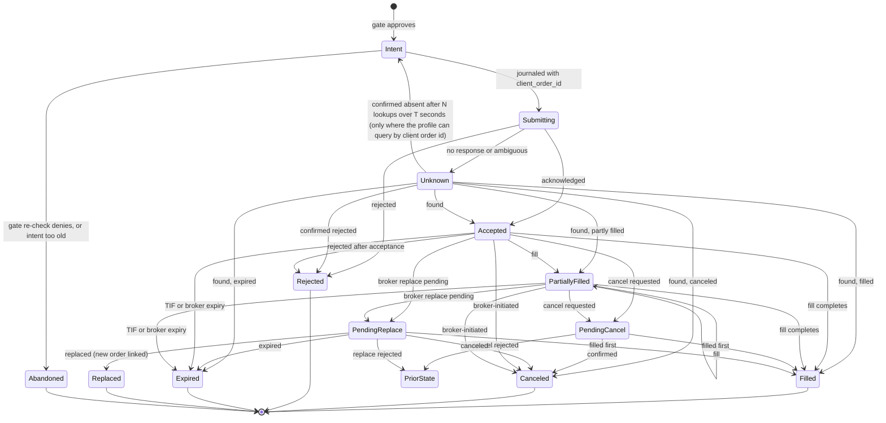

# Trading Domain Spec (v1)

| | |
|---|---|
| **Status** | **Approved** v0.14 (v0.8 founder sign-off 2026-09-25, [DEC-71](../project/04-decision-log.md#decisions); v0.9 amendment [DEC-86](../project/04-decision-log.md#decisions); v0.10 amendment [DEC-92 to DEC-94](../project/04-decision-log.md#decisions); v0.11 and v0.12 amendments [DEC-160](../project/04-decision-log.md#decisions); v0.13 amendment [DEC-255](../project/04-decision-log.md#decisions); v0.14 amendment [DEC-269](../project/04-decision-log.md#decisions); v0.15 amendment [DEC-441](../project/decisions/DEC-441.md) item 23; v0.16 amendment [DEC-529](../project/decisions/DEC-529.md) and [DEC-531](../project/decisions/DEC-531.md); v0.17 amendment [DEC-687](../project/decisions/DEC-687.md) item 4); changes need a decision-log entry (safety-critical) |
| **Scope** | US stocks, ETFs, and crypto spot on Alpaca ([DEC-23](../project/04-decision-log.md#decisions)); US equities on Robinhood for the founder's one live order ([DEC-529](../project/decisions/DEC-529.md)) |
| **Implements** | PRD 6.2, 6.4, 6.5, 6.7; backlog E2–E7 |
| **Reference cases** | [reference-cases/trading-domain.yaml](reference-cases/trading-domain.yaml) (schema v3) |

## Change history

- **v0.17:** §7.3's `connection_unavailable` row no longer lists a reconnect as lifting the
  restriction: the connection's condition clears by good probes for `degraded`, by
  re-authorization for `suspended` ([DEC-800](../project/decisions/DEC-800.md) item 5, journal
  §9.8 rule 68, DEC-824 item 6), and for contract drift as
  [DEC-687](../project/decisions/DEC-687.md) item 3 says, then the owner acknowledges. Text only,
  a tightening under DEC-176: no reference case and no outcome for a broker restriction changes,
  and no exit, protective order, cancel, or kill switch is held.
- **v0.16:** §5.2 "Alpaca capability matrix" becomes "Broker capability profiles": each connector
  declares a profile of its broker's published rules, shared code reads it and never names a
  broker, and Robinhood's equity profile sits beside Alpaca's
  ([DEC-531](../project/decisions/DEC-531.md), [ADR-0004](../adr/0004-broker-capability-profiles.md)).
  Alpaca's rows are unchanged. §5.1 and §5.4 take protection from the profile: on a profile with no
  OCO or bracket, equities are protected by one GTC stop-limit for the whole position after the
  entry fills completely (DEC-529 item 7). §4.2 adds the cross-checked broker quote for the
  founder's one live order (DEC-529 item 12); §7.2 adds Robinhood's account type, 1× and regime
  rows (DEC-529 item 11; [DEC-620](../project/decisions/DEC-620.md) items 1 and 2). The stop-limit's
  limit is the mandate's `stop_limit_offset` ([DEC-539](../project/decisions/DEC-539.md)). Founder-reserved under DEC-79 and accepted on 2026-10-08. Every narrowing
  is for DEC-529's one order; no Alpaca outcome and no reference case changes. §5.7: on a profile
  with no query by client order id, `Unknown` never returns to `Intent`, so nothing is resubmitted
  (DEC-529 item 4). No pre-trade alert or quote cross-check refuses an exit or a protective order
  (`AGENTS.md` rule 13).
- **v0.15:** §7.3 gains a row for a connection the connector reports `degraded` or `suspended`
  ([connections spec §9.1](connections.md#91-states)): account state `closing_only`, all agents
  `exits_only`. `AccountRestrictionChanged` carries an enumerated `cause` (`broker_reject`,
  `broker_notice`, `connection_unavailable`), so the journal never records a broker restriction
  that did not happen, and the connection cause has its own owner alert. The connection row lifts
  on the connection's own condition and then the owner's acknowledgment, not on an account
  refresh. A tightening under DEC-176 ([DEC-441](../project/decisions/DEC-441.md) item 23): no
  outcome changes for a real broker restriction, and no existing reference case changes; the
  connection row's case is added with E7-13's tests.
- **v0.14:** §9.2's `legacy_pdt` day trade is stated as an opening and a closing of the same
  position on one trade date. A sale of an overnight position followed by a same-day repurchase
  is not a day trade; a later sale of the repurchased shares is one. "Selling and purchasing" is
  the short sale and its cover, which v1 never takes. This is the founder's reading
  ([DEC-269](../project/04-decision-log.md#decisions)), and it matches FINRA Rule 4210(f)(8)(B)
  and the broker's own count. `required`'s +1 after a same-day sale is unchanged, and so is every
  reference case.
- **v0.13:** §3.2 item 7's "USD pairs only" gets a reason code of its own, `crypto_pair_not_usd`,
  registered in the reference-case file beside the floor's other codes. A pair the research agent
  admitted is in the working universe, so reporting it as `not_in_working_universe` would say
  something false ([DEC-255](../project/04-decision-log.md#decisions)). No existing code changes
  (ES-09), and every reference case is unchanged.
- **v0.12:** each exit-ladder rung after the first, and the triggered-stop watchdog's exit, get a
  deterministic `client_order_id` (§2.3); a watchdog exit no single agent holds is cancelled by
  every kill switch covering its instrument, and no agent's own (§5.5). An exit with nothing to
  price from is never refused: a
  risk exit, protective order, or owner exit goes at its intent's own limit, never below an owner
  exit's floor, and a discretionary exit is held until a price arrives, each journaled with an
  owner alert (§5.6, [DEC-160](../project/04-decision-log.md#decisions)). Every reference case is
  unchanged.
- **v0.11:** protective order IDs name the entry they protect (§2.3). A protective leg the broker
  created, which no submission recorded, belongs to the entry's agent when its ID names the entry,
  otherwise to the agent whose attributed lots make up the whole open quantity; failing both it is
  unattributed, and the instrument holds new openings (`protection_unattributed`, checked before
  `add_blocked_by_protective_order`, §9.1) until the leg is attributed or gone. Exit sequences and
  an agent-scoped kill switch cancel an unattributed leg by its own ID, so it never holds an exit
  (§5.4, [DEC-160](../project/04-decision-log.md#decisions)). Every reference case is unchanged;
  registering `protection_unattributed` is Proposed (founder).
- **v0.10:** corporate-action rules found while implementing E3-2
  ([DEC-92 to DEC-94](../project/04-decision-log.md#decisions)). A split that leaves no share
  removes the whole basis (DEC-92); otherwise the residual formula is unchanged and never removes
  more than the basis held. Cash in lieu is `round(f × p, 2, half_even)`, and a broker posting
  settles an outstanding cash in lieu of exactly that amount (DEC-93) (§2.1, §8.3, §8.5). I3's
  market-value bound is |Q_raw| × 5 × 10⁻¹³, not |Q'| × 5 × 10⁻¹³ (DEC-94, §8.6). Every
  reference case is unchanged.
- **v0.9:** a reducing fill's removed basis is limited to the basis held, so a position's cost
  basis always has the sign of its quantity (§2.1, §8.1, I2,
  [DEC-86](../project/04-decision-log.md#decisions)). Refines DEC-27 only when the basis has digits
  below the 12th decimal place; every reference case is unchanged.
- **v0.8:** discretionary exits are allowed in the close window as marketable limit orders within the
  collar and participation caps; openings stay blocked and MOC/LOC orders stay banned (§9.6,
  [DEC-70](../project/04-decision-log.md#decisions); OD-10 resolved).
- **v0.7:** owner exits confirm a floor price below which the exit price ladder never goes (§5.5,
  [DEC-66](../project/04-decision-log.md#decisions)).
- **v0.6:** alignment with [mandate spec v0.3](mandate.md) and
  [DEC-53 to DEC-62](../project/04-decision-log.md#decisions): owner exits (`owner_exit`) may sell
  equities in extended hours through the exit price ladder after the owner confirms the displayed
  bid; only automated flattens wait for the regular session (§5.5); deferred discretionary exits
  are not stored, but re-proposed (§9.1). RC-25 gains owner-exit steps.
- **v0.5:** alignment with [mandate spec v0.2](mandate.md) and
  [DEC-44 to DEC-52](../project/04-decision-log.md#decisions). Agent-scoped kill switch cancels and
  sells only the agent's orders and sub-ledger quantity (§5.5); exits split into risk exits and
  discretionary exits, with discretionary exits paced by conduct controls and a new close-window
  control (§9.6, verdict `defer`); the gate assigns purpose from side and position (§9.1);
  triggered-stop watchdog (§5.4); crypto stop-limit offset is the mandate fraction; instrument
  groups for claims (§7.1); mandate order-count limit denies while platform rate limits switch to
  `exits_only` (§9.7). Reference cases: RC-25; exit purposes in existing cases are `risk_exit`.
- **v0.4:** third three-role review (all "approve with changes"; all 24 cases recomputed
  exactly). Consistency fixes, no new decisions: when exits may be held (principle 4); order-
  constraint exemptions for risk-reducing orders at first gate decision; exit price ladder
  (§5.6); bounded unprotected intervals, partial-bracket timeout, passive exits as OCO take-profit,
  crypto adds as IOC; cash dividends keep protective orders; restriction detection stored as
  account state with reason codes; related-accounts coordinator for exits; ETP classification
  fails closed; crypto liquidity minimum; uncleared deposits excluded; buying power before gross
  exposure; I3 corrected; single-division residual formula; expiry definition; backtest halt
  source; Alpaca margin policy labeled. Reference cases: 25 cases (RC-24 exit ladder).
- **v0.3:** second three-role review (all "approve with changes"). Applies
  [DEC-34 to DEC-38](../project/04-decision-log.md#decisions): margin buying power on total cash;
  IEX paper profile and SIP for live equities; crypto protection with simple orders; no
  extended-hours openings; refined posture wording. Also: continuous-trading limit fills, split
  mark adjustment, trade-date dividend entitlement, broker-posting gates for corporate actions,
  bracket mechanics, conduct-control exemptions for risk reduction, restriction detection from
  rejects, agent modes, complete state machine, reason-code precedence, journal event catalogue,
  retention start point, related-account self-trade groups. Reference cases: schema v3, 24 cases.
- **v0.2:** first three-role review (all "needs rework"); DEC-26 to DEC-33.
- **v0.1:** initial draft.

## 1. Principles

1. **The broker is the source of truth in paper and live trading.** The model runs backtests,
   pre-checks orders, and reconciles. When they disagree, the broker wins and the difference is
   journaled as a compensating event ([§11](#11-reconciliation)).
2. **Venue facts come from the venue.** Tick sizes, increments, flags, calendars, and sessions come
   from broker APIs or effective-dated configuration, never code.
3. **Unknown means stop.** An unrecognized corporate action, status, account condition, or data
   fault pauses the affected agents and alerts the owner.
4. **Conservative when in doubt,** except that **risk reduction is never denied by conduct
   controls, eligibility, day-trade budgets, buying power, or opening-session rules.** Risk exits,
   protective orders, and automated kill switches are exempt from all of them; owner exits are paced
   only by participation caps; discretionary exits (signal or goal driven) are paced by conduct
   controls but never denied (§9.6), except when the exits already allowed sell the whole position,
   so nothing is left for it to sell; then it is refused `sell_exceeds_available` as DEC-410 item 3
   says. Exits and protective
   orders may be held only by agent mode `paused` or `stopped` (state integrity), by an `Unknown`
   order in the same instrument, or by the broker. **The kill switch is always available** and
   does not depend on model state (§5.5).
5. **The owner sets the envelope; the platform brings the ideas**
   ([DEC-97](../project/04-decision-log.md#decisions),
   [ADR-0002](../adr/0002-autonomous-ideation-and-retail.md), superseding
   [DEC-38](../project/04-decision-log.md#decisions)). Every **envelope field** — capital, goal,
   limits, autonomy rules, signal models and their weights, sizing, protection, cadence, allowed
   asset classes, `universe.max_instruments` — is confirmed by the owner. The compiler and templates
   may **propose** a value, shown as proposed and inactive until confirmed
   ([mandate spec §7](mandate.md#7-compiler-and-platform-proposals-dec-97)); the owner's own pinned
   universe is never proposed. The **working universe and its theses** come from the research agent
   at runtime, inside the envelope and through the ordered admission checks
   ([mandate spec §8.5](mandate.md#85-admission-and-removal-dec-97-dec-101-dec-103)); the owner may
   pin the universe instead (bring-your-own-strategy). The user selects the sizing method and there
   is no calibration in v1. Approval requests show the agent's proposal, the rule it follows, and,
   for an admission, the full thesis with its sources
   ([DEC-126](../project/04-decision-log.md#decisions)); never persuasive alternatives or profit
   estimates.

## 2. Conventions

### 2.1 Numbers

- Fixed-point decimals only (`rust_decimal`, Python `decimal.Decimal` with precision ≥ 60).
  **Never floating point.**
- Rounding is written as `round(x, scale, mode)`. Internal values keep full precision unless a
  rule below applies.

| Field | Rule |
|---|---|
| Price | ≤ 9 decimal places |
| Quantity | ≤ 9 decimal places; per-instrument increment |
| Cost-basis reduction | `round(B × part ÷ whole, 12, half_even)`, limited to the basis held (§8.1) |
| Adjusted marks after splits | `round(mark × old ÷ new, 12, half_even)` (§8.5) |
| Split residual basis | `round(B × (Q·new − Q'·old) ÷ (Q·new), 12, half_even)`; the whole basis when Q' = 0 (§8.5) |
| Cash in lieu | `round(f × p, 2, half_even)`, signed like Q (§8.5) |
| Order quantity | Truncate to the quantity increment, except a sell closing the full position (§5.3) |
| Notional amount | Truncate to 0.01; minimum 1.00 USD |
| Buy limit / stop price | Round down to the tick of the rounded price |
| Sell limit / stop price | Round up to the tick of the rounded price |
| Equity regulatory fees | Accrued per fill at full precision; charged as a daily total, `round(total, 2, ceiling)` (§6.2) |
| Crypto fee quantity | `round(gross × bps ÷ 10000, 9, half_up)` |
| Crypto fee in USD | `round(x, 2, half_up)` per fill |
| Fee reservation (buying power) | Per order: `round(estimated fees, 2, ceiling)` |
| Dividends | `round(Q × d, 2, half_even)` per position; broker amount authoritative |
| Reported money | `round(x, 2, half_even)`; internal unchanged |
| Backtest fill prices | Not tick-rounded |

**Equity ticks** (effective-dated, Reg NMS Rule 612): 0.01 at or above 1.00 USD, 0.0001 below.
Crypto uses the broker's `price_increment`.

### 2.2 Time and calendars

- Timestamps are UTC with nanosecond precision; sessions are evaluated in America/New_York.
- **Trading calendar:** NYSE trading days, holidays, early closes (from the broker).
- **Settlement calendar:** days that are both NYSE trading days **and** Federal Reserve business
  days; separate, versioned fixture.
- **Equity trade date:** the trading day of execution; **equity fills between 20:00 and 23:59:59
  ET belong to the next trading day.** Crypto has no trade date for settlement; the crypto
  reporting day ends at 00:00 UTC.

### 2.3 Identifiers

- **Instrument ID:** the broker's `asset_id` (UUID); symbol is a dated attribute; crypto symbols
  normalized at the connector (`BTC/USD` and `BTCUSD` are one instrument).
- **Intent ID:** ULID. **`client_order_id`:** `"{intent_ulid}-{attempt}"` (≤ 128 characters);
  `attempt` increments only after the broker confirms the previous attempt `Rejected`; retries of
  an unconfirmed attempt reuse the same ID.
- **Protective orders** ([DEC-160](../project/04-decision-log.md#decisions)): a protective order
  the platform places is named for the entry it protects. The parent is
  `"{entry}-p{protection}"`, where `{entry}` is the entry order's `client_order_id` and
  `{protection}` is the alphanumeric ID of the `ProtectionChanged` event that records the
  placement; a bracket's or OCO's legs are the parent's ID followed by `-tp` (the take-profit) or
  `-sl` (the stop). A re-placement keeps `{entry}` and takes its own event's `{protection}`. The
  entry is read back as everything before the last `-p`; an ID that does not parse this way names
  no entry. This grammar supersedes any other derivation of a protective order's ID.
- **Exit-ladder rungs** ([DEC-160](../project/04-decision-log.md#decisions)): each rung is a new
  order (§5.6), so each takes its own ID. The first rung keeps the exit intent's
  `client_order_id`; rung `{n}` for n ≥ 1 is that ID followed by `-l{n}`, with n derived from the
  journaled rung count, so a restart derives the same ID and a retry of an unconfirmed rung reuses
  it. The suffix is lowercase and an intent ID is an uppercase ULID, so a rung's ID never reads
  back as a protective order's (no `-p`) and never collides with another intent's.
- **The triggered-stop watchdog's exit** ([DEC-160](../project/04-decision-log.md#decisions)) has
  no agent intent. The executor journals it as its own intent, purpose `risk_exit`, whose
  `client_order_id` carries `"w-{event}"` where an intent's carries its ULID; `{event}` is the ID
  of the journaled watchdog record (a ULID, [journal spec](journal.md) §2), so a restart derives
  the same ID. A ULID has no hyphen and no lowercase letter, so the ID never matches an intent's
  and never reads back as a protective order's. Its agent is the position's single holder (§5.4's
  leg-agent rule); failing one, it belongs to no agent (`*`): every kill switch whose scope covers
  the instrument may cancel it by its own ID, and no agent-scoped kill switch treats it as that
  agent's own.
- **Fill ID:** the broker's execution ID; fills are de-duplicated by it.

## 3. Instruments and eligibility

### 3.1 Instrument fields

Loaded from the broker asset API; refreshed daily (equities after 19:45 ET), after any reject that
cites instrument properties, and on corporate-action events.

| Field | Meaning |
|---|---|
| `asset_id`, `symbol`, `asset_class`, `exchange` | Identity; exchange code (table below) |
| `status`, `tradable` | Active and tradable now |
| `fractionable` | Fractional quantities allowed |
| `marginable`, `shortable`, `easy_to_borrow` | Loaded; unused in v1 (no margin borrowing, no shorts) |
| `ipo` | Limit orders only until the first trade |
| `ptp_no_exception` | Publicly traded partnership without the withholding exception |
| `overnight_tradable`, `overnight_halted`, `fractional_eh_enabled` | Loaded; overnight and extended-hours openings are disabled in v1 |
| `min_order_size`, `min_trade_increment`, `price_increment` | Order constraints |

**Exchange codes (Alpaca):** `NASDAQ`, `NYSE`, `ARCA` (NYSE Arca), `AMEX` (NYSE American), `BATS`
(Cboe BZX) are eligible; `OTC` and anything else are not.

### 3.2 Eligibility floor ([DEC-31](../project/04-decision-log.md#decisions))

An **opening or increasing** order is allowed only if all hold, checked in this order:

1. Instrument in the agent's mandate universe, `status = active`, `tradable = true`.
2. US equities: eligible exchange code (§3.1).
3. Not `ipo`; not `ptp_no_exception`.
4. Prior close ≥ price floor (organization setting; default 5.00 USD; platform minimum 1.00).
5. 20-day median daily dollar volume ≥ liquidity floor (organization setting; platform minimum
   1,000,000 USD).
6. **Complex, leveraged, inverse, or volatility ETPs and ETNs** only if the mandate enables them and
   the owner acknowledged the risk disclosure. Every listed security's ETP status comes from a
   source that flags all ETFs (for example, the Nasdaq Trader symbol directory's ETF column) plus an
   ETN list; **an ETP not yet classified is treated as complex** (fails closed). If the
   classification data is older than the configured age, ETP openings are denied.
7. Crypto: USD pairs only (an opening in a pair quoted in anything else is denied
   `crypto_pair_not_usd`); account `crypto_status = ACTIVE`; 30-day median daily dollar volume ≥
   the crypto liquidity floor (organization setting; platform minimum 1,000,000 USD).

Risk-reducing orders for held positions are allowed regardless of the floor or universe. A held
instrument that becomes non-tradable pauses the agent and alerts the owner.

### 3.3 Concentration

A position's market value (including working opening orders at their maximum cost) may not exceed
the mandate's per-instrument cap, bounded by the organization ceiling.

## 4. Market data

### 4.1 Types

| Type | Fields |
|---|---|
| Trade | instrument, timestamp, price, size, exchange, feed |
| Quote | instrument, timestamp, bid, bid size, ask, ask size, feed |
| Bar | instrument, start (left edge), interval, OHLC, volume, VWAP, trade count, session, feed |
| Trading status | instrument, timestamp, halted / resumed, LULD band, short-sale restriction |
| Corporate action | instrument, type, ex-date, record date, pay date, ratio or cash amount |

### 4.2 Data profiles ([DEC-35](../project/04-decision-log.md#decisions))

| Profile | Used for | Rules |
|---|---|---|
| `sip` | Backtests; **live equity agents (required)**, except DEC-529's one order (row below) | Consolidated quotes and trades; standard staleness and spread limits |
| `iex` | **Paper trading** | IEX quotes as the reference for collars and risk marks; wider spread limit and longer staleness threshold (configured); an opening order requires a fresh IEX quote |
| `crypto` | Crypto, paper and live | Alpaca crypto feed |
| Broker quote, cross-checked | **DEC-529's one founder-run live order only** ([DEC-529](../project/decisions/DEC-529.md) item 12) | Robinhood's own quote (`get_equity_quotes`, re-read by `review_equity_order`) is the reference for the collar and the risk mark. It must agree with the `iex` quote within the collar, or the opening is refused and nothing is sent. The cross-check never refuses an exit or a protective order, which are priced as §5.6 prices them (`AGENTS.md` rule 13). Daily and minute bars stay Alpaca's `iex` (its minute volume understates, so the participation caps only tighten) |

A bar exists only when trades occur: a missing regular-session bar means "no trade", not a data
gap. `inspect` distinguishes no-trade minutes, session closures, and true gaps.

### 4.3 Sessions (US equities)

| Session | Hours (ET) | v1 agents |
|---|---|---|
| Overnight | 20:00 – 04:00 (Sunday night to Friday morning) | No orders ([DEC-30](../project/04-decision-log.md#decisions)) |
| Pre-market | 04:00 – 09:30 | **Exits only**, as limit orders with `extended_hours = true` ([DEC-37](../project/04-decision-log.md#decisions)) |
| Regular | 09:30 – 16:00 (early closes per calendar) | Per §5 |
| After-hours | 16:00 – 20:00 | **Exits only**, as limit orders with `extended_hours = true` |

**Auction windows:** opening 09:28–09:30 ET; closing: the last 10 minutes of the regular session
(configurable). No opening orders in either; exits in them use limit orders, never market orders.
Crypto trades continuously.

### 4.4 Halts

Live and paper runtimes **subscribe to trading-status and LULD channels**. For a halted or paused
instrument: no new opening orders, resting marketable opening orders are canceled, and a
cooling-off period applies after the reopen. A stale quote or dropped status feed is treated as a
**presumed halt**: no market orders; exits use marketable limit orders.

### 4.5 Adjustments

Backtests use raw prices plus explicit corporate actions (§8.5). Signal series are adjusted
**point in time** (only actions with ex-date ≤ decision time); vendor-adjusted history is never
used.

## 5. Orders

### 5.1 v1 order policy ([DEC-29](../project/04-decision-log.md#decisions), [DEC-37](../project/04-decision-log.md#decisions))

| Purpose | Allowed |
|---|---|
| Opening or increasing (equities) | Regular session only; **limit orders** within the price collar; plain, or **bracket** (entry + take-profit + stop) where the connection's profile offers one (§5.2) |
| Opening or increasing (crypto) | Limit orders within the collar (simple orders only); adds to a protected position are limit IOC (§5.4) |
| Reducing or closing | Limit orders in any session the instrument allows (marketable exits priced per §5.6); market orders only in the regular session outside auction windows and with current status data |
| Protective (equities) | The strongest form the connection's profile offers (§5.2): **OCO** or bracket legs, whole shares only, TIF GTC; on a profile with neither, one GTC stop-limit for the whole position ([§5.4](#54-protective-exits-dec-28-dec-36)) |
| Protective (crypto) | **One simple GTC stop-limit** for the whole position ([DEC-36](../project/04-decision-log.md#decisions)) |
| Not used in v1 | IOC (except crypto adds), FOK, trailing stops, replace/amend (except broker-initiated), notional market buys, options, short sales |

### 5.2 Broker capability profiles ([DEC-531](../project/decisions/DEC-531.md), [ADR-0004](../adr/0004-broker-capability-profiles.md))

Each connector declares a **capability profile**: a typed, versioned value of what its broker
accepts, built from the broker's published contract and nothing else. Per asset class and session
it lists the order types, the quantity forms each type allows (whole, fractional, notional), the
times in force, the protection forms offered (bracket, OCO, one resting stop-limit, none), and
idempotency (a client order id, whether a retry with it is idempotent, whether orders can be
queried by it).

- **Shared code reads the profile and never names a broker**, nor reads the asset class to learn a
  broker rule. The order builder sizes to the quantity form the profile allows for the order type
  the policy chose; protection takes the strongest form the profile offers (§5.4); reconciliation
  queries by client order id when the profile can, and otherwise takes the one shared fallback
  ([connections spec §6.2](connections.md#62-how-mcp-maps-to-the-connector-interface)); deployment
  refuses a mandate whose order policy or protection needs something the profile lacks.
- **Policy is not a profile row.** §5.1 and the gate (§9) are the platform's; the builder
  intersects them with the profile, and an empty intersection is a refusal before the intent,
  never a fallback to another order type.
- **The profile is journaled and pinned:** its canonical hash is registered configuration
  (`ConfigSnapshotRegistered`, kind `broker_profile`) and, for an MCP broker, tied to the contract
  hash (connections spec §6.2 rule 3). A changed profile is a new version.
- **Rows are added when a story needs them** (DEC-531 item 6). A row a profile does not declare is
  absent.

**Alpaca:**

| Asset / condition | Order types | Time in force |
|---|---|---|
| Equities, whole shares, regular session | market, limit, stop, stop-limit | day, gtc |
| Equities, fractional or notional | market, limit, stop, stop-limit | day only; **not allowed in OCO or bracket orders** |
| Equities, extended hours | limit only, `extended_hours = true` | day, gtc (fractional: day) |
| Equities, OCO and bracket | all legs share one TIF; no extended hours | day, gtc |
| Crypto | market, limit, stop-limit; **simple orders only** (Mandate uses stop-limit as GTC only) | gtc, ioc |
| Crypto | maximum 200,000 USD notional per order | — |

Protection: bracket and OCO for equities; one resting stop-limit for crypto. Idempotency:
`client_order_id`, queryable. GTC equity orders expire 90 days after creation. Orders not eligible
for the current session are queued by the broker for the next eligible session.

**Robinhood** (US equities, regular session; from the
[published tool contract](../project/tasks/robinhood-contract.md) of 2026-10-08):

| Row | Value | Source |
|---|---|---|
| Order types | market, limit, stop-market, stop-limit | `place_equity_order.type` |
| Quantity forms | market: whole, fractional, notional; every other type: whole shares | `quantity`, `dollar_amount` |
| Time in force | gfd (day), gtc | `time_in_force` |
| Protection forms | one resting stop-limit (gtc); **no OCO, no bracket** | Tool list (U-R4) |
| Idempotency | client order id `ref_id`, deduplicated by the broker; what a retry returns is unknown; **no query by it** | `ref_id`; `get_equity_orders` filters (U-R1, U-R2) |
| GTC expiry | Not published | — |
| Pre-trade check | `review_equity_order` | Tool list |

Crypto, extended hours and options are not declared, so no Robinhood mandate may use them. Having
no extended-hours row is a limit of this profile: every equity exit on it, an owner exit included,
waits for the regular session, and the owner is told so when the mandate is deployed. With
§5.1's limit openings, the intersection is limit, whole shares, day, regular session; protection is
the one stop-limit (DEC-529 item 2).

### 5.3 Constraints enforced before submission

1. Quantity and notional are mutually exclusive.
2. Quantity ≥ `min_order_size` and a multiple of the increment, except a sell closing the full
   position (exact quantity or the close-position endpoint).
3. **No order may cross zero** (`would_cross_zero`).
4. **Sell quantity ≤ position − Σ open sell quantity**, protective legs included
   (`sell_exceeds_available`). An exit ladder's remainder between rungs (§5.6 step 5) is a plan,
   not an open order ([DEC-410](../project/decisions/DEC-410.md)).
   - **Any sell the gate allows that is not a discretionary exit** is checked against the open
     orders alone and goes whole. Nothing is done to the remainders beside it: each counts only
     what the position and the open sells leave it (§5.6 step 5), so the sell takes their room as
     it goes, and the room comes back if the sell ends unsold before a ladder sends.
   - **A discretionary exit** is sized to what the open sells and the counted remainders leave.
     With nothing left, it is denied `sell_exceeds_available`, but only once it is otherwise
     releasable now: one held `session_closed`, `session_unknown` or `exit_unpriced` keeps its
     hold and is decided again when it is released. The denial is terminal: the intent is not
     retried, and a later proposal is judged afresh (DEC-410 item 3).
   - **Protective placements** are not gated here; §5.4 sizes them.
5. **One side at a time:** an agent's non-protective orders in an instrument are all on the same
   side (`working_order_limit`). Before a risk-reducing sell, the executor cancels the agent's own
   resting opening buys in that instrument and waits for confirmation.
6. At most one working non-protective order per instrument per account (`working_order_limit`).
7. Fractional and notional equity orders use TIF day; no fractional short sales.
8. **Self-crossing:** the broker rejects orders that could interact with the account's own
   opposite-side orders (OCO, bracket, and trailing-stop orders are exempt; crypto included). For
   **equities**, a risk-increasing order never cancels a protective order (§5.4); crypto adds follow
   the DEC-36 sequence.
9. An `Unknown` order reserves its maximum cost and counts as filled for exposure and
   concentration; no new orders in that instrument (`unknown_order_in_flight`) until resolved.

**Risk-reducing orders at the first gate decision:** rules 4–6 exclude the agent's own protective
orders, any unattributed protective leg (§5.4), and resting opening orders in the instrument, because the executor cancels them first
(rule 5, §5.4); the gate re-run immediately before submission applies every rule in full. Bracket
protective legs are checked against position + entry quantity.

### 5.4 Protective exits ([DEC-28](../project/04-decision-log.md#decisions), [DEC-36](../project/04-decision-log.md#decisions))

**Equities (whole shares):**

- **Tranche model:** each protected entry is a **GTC bracket order**. Adding to a position is a new
  bracket; Σ protective sell quantity ≤ position.
- **Bracket legs are held until the entry is completely filled.** The unprotected interval starts
  at the first partial fill. If the entry is not complete within `bracket_partial_fill_timeout`
  (default 60 seconds, and always before the closing auction window), the executor cancels the
  entry remainder, confirms, and submits a **GTC OCO for the filled quantity** at the bracket's
  prices. The same OCO is submitted if the entry reaches a terminal state partly filled.
- **Expiry:** GTC orders expire 90 calendar days after the creation date. Protection is re-placed
  (cancel, confirm, new OCO) at the first `TradingDayStarted` on or after the trading day that is
  `protective_replace_buffer_trading_days` trading days before the expiry date.
- A plain risk-increasing order in an instrument with resting protective orders is denied
  (`add_blocked_by_protective_order`).
- **Passive exits** (a sell limit above the bid) are placed as the take-profit leg of a new OCO
  that keeps the existing stop: cancel the OCO, confirm, submit the new OCO. The rest of the
  position keeps its stop at the recorded prices, so a passive exit never removes protection by
  itself ([DEC-422](../project/decisions/DEC-422.md)).
  - **Beside other exits.** The new OCO's stop and every other exit's sell must fit within the
    position together, and one fit decides it at every check
    ([DEC-425](../project/decisions/DEC-425.md)): whether the placement holds the other exits back,
    whether it is cancelled for them, and whether an exit the gate allows leaves it resting all
    read the same measure. The other exits are those still selling and those received with no order
    yet. Exits the gate holds are left out of the fit at every one of those checks — when the gate
    allows an exit, at every step an exit waits, the placement's own step included, and when a
    cancel is decided — because they cannot move; a held exit counts again once released. Where
    they do not fit, the new OCO is cancelled for them, as any protection is cancelled before a
    marketable exit.
  - **The gap is bounded.** That cancel falls inside an unprotected interval that is journaled and
    bounded by `max_unprotected_s`, like any other. Once the other exits end, or the bound ends
    them, protection is re-placed for what is left.
- **Marketable exit sequence:** cancel all protective orders in the instrument → confirm → re-run
  the gate on fresh state → submit the exit, priced marketable per §5.6 → after a terminal state,
  re-place protection for any remaining quantity. **Orders submitted while protection is canceled
  must be marketable at submission.**
- **Bounded unprotected intervals:** every interval is journaled from start to end. If an interval
  reaches `max_unprotected_s` (default 60 seconds) with the order unfilled, the executor cancels it,
  confirms, re-places protection for the held quantity, and alerts the owner.
- **Fractional positions:** only the whole-share part can be protected; the fraction is
  unprotected and disclosed.
- Protection triggers in the regular session only (stops do not trigger in extended hours).
- **Triggered-stop watchdog:** if a sane risk mark has been at or below a resting stop's stop price
  for `stop_watchdog_s` (default 60 seconds) in a session where the stop can trigger, with no fill,
  or is below a stop-limit's limit price, the executor cancels it, confirms, and exits the held
  quantity through the exit price ladder (§5.6) as a `risk_exit` (its ID and agent, §2.3), and
  alerts the owner.

**Crypto (simple orders only):**

- One **GTC stop-limit sell** for the whole position; limit = stop × (1 − `stop_limit_offset`), the mandate's fraction (`crypto_stop_limit_offset` in mandate schema version 1; [DEC-539](../project/decisions/DEC-539.md)).
- Take-profit is managed by the runtime (it watches price and submits a marketable exit when the
  target is reached), not a resting order.
- **Adds and exits:** cancel the stop-limit → confirm → submit the order → after a terminal state,
  re-place the stop-limit for the new net quantity. **Adds are limit IOC orders within the collar;
  exits are marketable** (§5.6). The unprotected interval is bounded as for equities.
- A stop-limit may not fill on a gap; disclosed to the owner.

**Equities on a profile with no OCO or bracket** (Robinhood, §5.2; [DEC-529](../project/decisions/DEC-529.md)
item 7, resolving DEC-441 item 17 for DEC-529's one order):

- One **GTC stop-limit sell** for the whole position, placed once the entry has filled completely,
  as for crypto. Its stop price is set from `stop_distance` as a bracket's stop leg is, and its
  limit = stop × (1 − `stop_limit_offset`), the same mandate fraction as crypto's
  ([DEC-539](../project/decisions/DEC-539.md)); mandate spec V-008 requires it here.
- Take-profit is managed by the runtime, as for crypto. The entry is a plain limit order; the
  unprotected interval starts at its first partial fill. If the entry is not complete within
  `bracket_partial_fill_timeout`, or ends partly filled, the executor cancels the remainder,
  confirms, and places the stop-limit for the filled quantity, as for a bracket above
  ([DEC-620](../project/decisions/DEC-620.md) item 3).
- The interval until the stop-limit rests is bounded by `max_unprotected_s`: if it is not resting
  by then, the executor exits the held quantity as a `risk_exit` through §5.6 and alerts the
  owner.
- A mandate with protection off is refused on such a profile.
- GTC expiry is not published, so no re-place is scheduled from it; the owner checks the resting
  stop in the broker's app while the position is held (disclosed). A stop-limit may not fill on a
  gap; disclosed to the owner.

**Ownership of broker-created legs** ([DEC-160](../project/04-decision-log.md#decisions)):

- A bracket's or OCO's legs are created by the broker, so no `OrderSubmitted` records them. When
  `ProtectionChanged` records them placed, each joins the order set as a live protective sell of the
  covered quantity, reserving nothing.
- A leg's owner is, in this order: the agent of the entry its `client_order_id` names (§2.3);
  otherwise the position's **single holder**, the one agent whose attributed lots (§8.1: bought by
  that agent's own orders, net of its own sells) make up the whole currently open quantity.
- Otherwise the leg is **unattributed** and the executor never guesses an owner. While an
  unattributed leg rests, every new opening in the instrument is **held**
  (`protection_unattributed`, §9.1). A reconciliation (§11) establishes the leg's presence, not its
  owner, so the hold ends only when the leg is attributed or is gone (canceled, filled, expired).
- An unattributed leg never holds an exit (`AGENTS.md` rule 13). The instrument's exit sequences
  and its protection re-placement cancel it as step 1, with the instrument's other protective
  orders, and an agent-scoped kill switch in the instrument cancels it by its own
  `client_order_id`, never by cancel-all (§5.5). Protection for any quantity that remains is then
  re-placed as after any exit.

### 5.5 Kill switch

| Scope | Cancel | Close |
|---|---|---|
| Account or workspace | Broker cancel-all endpoint (`Unknown` orders included) | Broker close-position endpoint per instrument |
| Agent (owner kill switch, `flatten_and_pause`, daily-loss flatten, lifetime floor) | Only the agent's orders, and any unattributed protective leg (§5.4) or unattributed watchdog exit (§2.3) in an instrument it closes, each by `client_order_id`, confirming each; never cancel-all. The agent's ladders between rungs are plans, not orders: the agent is stopped first, so a parked one counts nothing, the flatten goes whole, and any other counts only what the flatten leaves (§5.6 step 5) | Sell exactly the agent's sub-ledger quantity; never close-position (other agents' and the owner's unattributed shares are untouched) |

Sequence: apply the final mode first (`paused` for mandate limits; `stopped` for an owner kill
switch) → cancel → confirm → close (market orders only in the regular session outside auction
windows with current status data; otherwise the exit price ladder in §5.6) → journal each step.

- **Automated** kill switches (mandate limits) sell equities only in the regular session, leaving
  protection in place until then; crypto sells go immediately. Their orders are `risk_exit`.
- **Owner** kill switches and closes are `owner_exit`: outside the regular session they sell
  equities through the exit price ladder once the owner has confirmed the displayed bid, bid size,
  and a floor price (default: the confirmed bid × (1 − the ladder's maximum offset);
  `OwnerExitRequested`). The ladder never prices below the floor; any remainder rests at the floor,
  then waits for the session, and the owner is alerted. Without confirmation, equity sells wait for
  the session.
- Kill-switch orders are exempt from the agent's mode, never wait for approval, and do not depend on
  model state. `risk_exit` orders are exempt from §9.6; `owner_exit` orders are paced only by the
  participation caps.

### 5.6 Exit pricing

Where an exit must be marketable but a market order is not allowed (extended hours, auction
windows, presumed halts, the kill switch outside those conditions, and any exit submitted while
protection is canceled), the executor uses the **exit price ladder** (sell; buy is symmetric):

1. Limit = reference bid × (1 − `exit_offset`), rounded per §2.1. Reference bid = the best bid from
   a fresh, sane quote; if none, the last sane bid within the last 5 minutes; if none, the last
   trade.
2. If unfilled after `exit_step_s` (default 5 seconds), cancel, confirm, and resubmit with the offset
   increased by `exit_offset_step`, repricing from the current reference bid.
3. The offset never exceeds `max_exit_offset`. At the floor, the order rests and the owner is
   alerted.
4. **Nothing to price from** ([DEC-160](../project/04-decision-log.md#decisions); rules 3 and
   13): with no fresh sane bid, no sane bid within the last 5 minutes, and no last trade, the exit
   is never refused. A `risk_exit`, an `owner_exit`, or a protective order goes at its intent's own
   limit, never below an owner exit's floor price (§5.5); the fallback is journaled and the owner
   alerted. A `discretionary_exit` is held and re-evaluated on every tick; the hold is journaled
   once, never dropped, and the owner alerted as for the fallback. The ladder resumes stepping
   from the next priceable quote or trade: a fallback price is never where the ladder ends.
5. **Between rungs** ([DEC-409](../project/decisions/DEC-409.md),
   [DEC-410](../project/decisions/DEC-410.md)). A ladder is between rungs from the confirmation of
   a step's cancel that leaves part of the rung unsold, until it sends its next rung or ends.
   - **What it counts.** Its remainder is never stored. Whenever it is read, it is the stepped
     rung's unfilled quantity, capped at the position less the open non-protective sells and less
     the remainders counted ahead of it. Protective orders are left out, as §5.3's note on risk-
     reducing orders at the first gate decision leaves them out, because §5.4 cancels them before a
     rung is sent. One instrument holds at most two ladders, a sequence's and one without a
     sequence; the one whose exit's intent id sorts first counts first. Id order is used because it
     is deterministic, so a replay of the same journal shares the room the same way. Every ladder
     between rungs belongs to an exit already allowed, so no order of them adds risk.
   - **When it counts.** A remainder counts only while something will send it:
     - a sequence's (§5.4) while its ladder climbs: its agent neither paused nor stopped, and its
       unprotected interval not past its bound. A pause or stop after the confirmation suspends
       the count, and it counts again when the agent resumes;
     - a ladder without a sequence unless it is parked for the next open while its agent is
       paused or stopped. It counts again when the agent resumes.
   - **Its next rung** sends what it counts at that moment. A rung smaller than the stepped
     rung's unfilled quantity is journaled as short, with the quantity not sent and why: the
     position and the sells beside it took it. With nothing left, no rung is sent, the ladder
     ends, and that is journaled the same way.
   - **What changes it.** A position that shrank while the ladder waited, or a sell beside it
     that took room, lowers what it counts at once. A sell beside it that ends unsold gives that
     room back. Nothing is trimmed, and nothing has to be given back.
   - **How it ends.** Only these end it:
     - its next rung is sent, whole or short;
     - nothing is left when its next rung is due;
     - the exit's intent is abandoned;
     - for a sequence, its ladder stops climbing at the confirmation or at the bound (below).
   - **When a sequence's ladder stops climbing.**
     - **At the confirmation:** the agent is paused or stopped, or the interval is past its
       bound. The ladder ends there, and the remainder is never sent, even if the agent resumes.
       Protection returns for what is left once no other exit there is working or waiting
       (§5.4).
     - **Later**, at the interval's bound: the ladder ends. A parked one is not carried on when
       protection returns.
   - **Protection's return** ends a sequence that was not parked. A parked one becomes a ladder
     without a sequence, waiting for the next open.
   - **A new sequence for the same exit.** A ladder without a sequence whose exit starts a
     sequence (§5.4) is carried into it, stepping and parked as it was, and the sequence's rules
     then apply.
   - **Without a sequence**, a ladder whose step was asked while it climbed is not ended by a
     later pause. If it is parked, it waits for its agent to resume.

| Tier | `exit_offset` | `exit_offset_step` | `max_exit_offset` |
|---|---|---|---|
| Equities, 20-day median dollar volume ≥ 50 M USD | 0.5% | 0.5% | 3% |
| Other equities | 1% | 1% | 5% |
| Crypto | 1% | 1% | 5% |

### 5.7 Order lifecycle

`PriorState` means the state before `PendingCancel` or `PendingReplace` (Accepted or
PartiallyFilled); fills during either pending state update filled quantity without leaving it.

**Broker status mapping (Alpaca):**

| Broker status | Internal state |
|---|---|
| `new`, `accepted`, `pending_new`, `accepted_for_bidding`, `held` | Accepted |
| `partially_filled` / `filled` | PartiallyFilled / Filled (apply fill) |
| `done_for_day`, `stopped`, `calculated` | Unchanged |
| `pending_cancel` | PendingCancel |
| `canceled`, `expired` | Canceled, Expired (release reservation) |
| `rejected` | Rejected (journal reject code) |
| `suspended` | Accepted, flagged restricted; triggers reconciliation |
| `pending_replace` | PendingReplace (old order stays live) |
| `replaced` | Replaced (old) + Accepted (new, linked); gate re-run on the new order |
| Any other value | Pause agent and alert |

**Rules:**

- Terminal states are final. **Fills are always applied to accounting**; a fill for an order in a
  terminal state is journaled as `late_fill` and triggers reconciliation.
- A status update implying an illegal transition is journaled and ignored (fills still applied).
- Filled quantity is non-decreasing, ≤ order quantity, and equals the sum of unique fills.
- `Unknown → Intent` re-runs the gate: if allowed and younger than `max_intent_age`, resubmit
  with the **same** `client_order_id`; otherwise `Abandoned`.
- **On a profile with no query by client order id** (§5.2: Robinhood), absence cannot be shown, so
  `Unknown → Intent` never fires and nothing is resubmitted. The order leaves `Unknown` only by the
  list-and-match adoption of [connections spec §6.2](connections.md#62-how-mcp-maps-to-the-connector-interface),
  or by the owner reconciling it by hand ([DEC-529](../project/decisions/DEC-529.md) item 4).
- Per-event fill quantity and price are authoritative; cumulative quantity mismatches trigger
  reconciliation.
- Every transition is journaled before it takes effect in state.

## 6. Fills and fees

### 6.1 Fill record

fill ID, `client_order_id` (absent for external fills: each is its own order), instrument, trade
date, timestamp, side, **gross quantity**, price, liquidity (maker/taker, crypto), fees,
fee-configuration version.

### 6.2 US equities fees

| Fee | Side | Basis |
|---|---|---|
| Commission | — | Zero on Alpaca |
| SEC Section 31 | Sells | Rate × proceeds |
| FINRA TAF | Sells | Rate × shares, capped per execution by default (`taf_cap_basis`: `per_execution` or `per_order`) |
| CAT | Buys and sells | Rate × shares |

- Accrued per fill at full precision (USD). **`FeesCharged` (equities) at 20:00 ET for each trade
  date** replaces the accrual with `round(daily total, 2, ceiling)`.
- Accrued fees are a liability in equity and reserved against buying power.
- Rates come from an effective-dated configuration transcribed from Alpaca's fee schedule.

### 6.3 Crypto fees (Alpaca)

- Maker/taker by 30-day volume tier (tier 1: 15/25 bps), dated configuration.
- Buy: `fee_qty = round(gross × bps ÷ 10000, 9, half_up)`, received = gross − `fee_qty`; the fee is
  valued at the fill price (unrounded) and recorded as a USD fee; cost basis = received × price.
  **Asset-denominated fees are not accrued liabilities.**
- Sell: USD fee `round(x, 2, half_up)`, accrued; **`FeesCharged` (crypto) at 00:00 UTC.**
- Until Alpaca posts the fee, the broker shows the gross quantity; reconciliation allows the
  unposted fee (§11). Sells are sized from the model's net quantity.

### 6.4 Backtest fill model

Configuration: decision latency, approval latency, slippage s = half-spread + impact (`fixed` bps,
or `sqrt`: coefficient × √(fill qty ÷ reference volume)), volume cap fraction, first-bar volume
source.

1. **Timing.** An order is eligible from the first bar starting at or after decision time + latency
   (+ approval latency if approval was required). Nothing fills on the bar that produced the
   decision.
2. **Sessions.** Fills only in sessions the order may trade in. An ineligible order waits for the
   next eligible session; a day order's remainder is canceled at the end of its last eligible
   session.
3. **Volume cap.** Per bar, fills ≤ truncate(fraction × reference volume, increment), shared by the
   account's orders in the instrument in submission order. **Reference volume = the previous bar
   in the same session**; for the first bar of a session, the median volume of that minute over
   the prior 20 sessions; if unavailable, the cap is 0 for that bar.
4. **Market orders** fill at the open: buys open × (1 + s), sells open × (1 − s).
5. **Limit orders** (buy; sell symmetric):
   - **Marketable on arrival** (open ≤ limit on the first eligible bar): fill at
     min(limit, open × (1 + s)), taker. A remainder keeps filling this way on later bars whose
     open ≤ limit; on a later bar whose open is beyond the limit, the remainder **becomes resting**.
   - **Resting** (from the first eligible bar, if not marketable on arrival): fills at the limit,
     maker, when the bar's low is **strictly below** the limit — including when the bar opens
     below the limit (continuous trading cannot print through a resting limit). **Exception:** on
     an **auction bar** (the first regular-session bar of the day, or the first bar after a halt
     reopens), a resting limit the open gaps through fills at the open. A touch is not a fill.
     Halts in backtests come from a trading-status dataset or fixture; without one, only the first
     regular-session bar of the day is an auction bar.
6. **Stop orders** (sell stop S; buy symmetric). Equities trigger in the regular session only.
   If open ≤ S: fill at open × (1 − s). Else if low ≤ S: fill at S × (1 − s).
7. **Stop-limit** (sell, stop S, limit L): if the bar opens below L, no fill; the order rests as a
   limit at L (rule 5). Otherwise, once triggered, fill at max(L, min(open, S) × (1 − s)).
8. **Protective pairs (OCO).** If the open reaches a leg, that leg fills first under its own rule.
   Otherwise, if both legs are reachable within the bar, the stop fills first (adverse first). The
   other leg is canceled.
9. Fill prices are not tick-rounded.

## 7. Accounts

### 7.1 Account ledger ([DEC-26](../project/04-decision-log.md#decisions))

- One ledger per broker account, owned by one serialized executor; all account-level rules use it.
  Agents submit intents; they never call the broker.
- **One agent per instrument group per account** (`instrument_claimed` on deployment). An
  **instrument group** joins instruments with the same economic exposure: share classes of one
  issuer (GOOG, GOOGL), funds tracking the same index (SPY, VOO, IVV), and a crypto asset with its
  spot ETPs (BTC/USD, IBIT, FBTC). Groups come from the effective-dated instrument snapshot
  (config `ins`); an ungrouped instrument is its own group. A claim is held until the agent is flat
  in every instrument of the group.
- An agent may cancel only its own orders, with one exception: before a risk-reducing order, the
  **related-accounts coordinator** cancels resting opposite-side *opening* orders in that
  instrument across the owner's related-accounts group (§9.6) and waits for confirmation.
  Canceling an opening order never adds risk, and this prevents self-trades between related
  accounts that the broker's per-account protection cannot see.
- **External activity** (orders or fills not originated by Mandate) is ingested as unattributed,
  journaled, switches every agent on the account to `exits_only` until the owner acknowledges, and
  blocks claiming that instrument until acknowledged.

### 7.2 Account state and buying power

| Field | Source |
|---|---|
| Account type | Alpaca: always margin; `multiplier` 1, 2, or 4. Robinhood: not in the contract (connections spec U-R7); for DEC-529's order, the founder's attestation that the agentic account is a cash account or has margin disabled ([DEC-529](../project/decisions/DEC-529.md) item 11) |
| Equity, cash, `buying_power`, `non_marginable_buying_power`, `last_equity`, status flags | Broker |
| Settled and unsettled cash, reservations, accrued fees | Model, reconciled to broker |
| Day-trading regime | Alpaca: `intraday_margin` (§9.2). Robinhood: `legacy_pdt` (§9.2), since the contract does not show it has moved to the intraday margin standard; a pattern-day-trading alert from `review_equity_order` also refuses an opening or an increase, never a sell or a protective order, which is placed with the alert journaled (connections spec U-R6; [DEC-620](../project/decisions/DEC-620.md) item 1) |

**1× requirement.** At connect and daily, the platform verifies `multiplier = 1` (or an enforced
1× cap); otherwise agents are paused and the owner is prompted. Robinhood shows no margin field,
so for DEC-529's order only, 1× rests on the founder's attestation and on the gate's buying power
being the cash-account row below, taken as the lower of it and the broker's figure (DEC-620 item 2); any other
Robinhood connection is paused and prompted.

**Buying power used by the gate** ([DEC-34](../project/04-decision-log.md#decisions)) is the lower
of the model and the broker:

| Account / asset | Model buying power |
|---|---|
| Margin account, equities | settled + Σ unsettled − reservations − round(accrued, 2, ceiling) |
| Margin account, crypto | min(equity model above, broker `non_marginable_buying_power`) |
| Cash account (generic brokers; Robinhood's attested agentic account for DEC-529's order, DEC-620 item 2) | settled − reservations − round(accrued, 2, ceiling) |

**Uncleared deposits are excluded** from model buying power (a returned deposit would otherwise
create a debit). The fee reservation for crypto buys is 0 (the fee is paid in the asset). The gate
includes paper-mode simulated fees (§10) in accrued fees.

### 7.3 Account restrictions

The gate requires `status = ACTIVE`, `trading_blocked = false`, `account_blocked = false`,
`trade_suspended_by_user = false` (and `crypto_status = ACTIVE` for crypto). **Alpaca exposes no
closing-only field**, so restrictions are also detected from rejects:

Detected restrictions are stored as **account state** (evaluated in §9.1 check 1, before agent
mode) until the owner acknowledges and the account is refreshed:

| Signal | Account state | Agent effect | Reason code |
|---|---|---|---|
| Any status other than `ACTIVE`, `trading_blocked`, `account_blocked`, `trade_suspended_by_user` | `blocked` | All agents `paused` | `account_trading_blocked` |
| Reject whose code or message indicates closing-only or restricted trading (connector reject table) | `closing_only` | All agents `exits_only` | `account_restricted` |
| N consecutive 403 rejects without a known order-level cause (configured) | `closing_only` | All agents `exits_only`; account refreshed | `account_restricted` |
| Broker notice of an intraday margin call or freeze | `closing_only` | All agents `exits_only` | `account_restricted` |
| The connector reports the connection `degraded` or `suspended` ([connections spec §9.1](connections.md#91-states)) | `closing_only` | All agents `exits_only` | `account_restricted` |

`AccountRestrictionChanged` records the **cause** of each change, one of a closed list, so a
restriction the broker never imposed is never journaled as the broker's
([DEC-441](../project/decisions/DEC-441.md) item 23):

| `cause` | Rows above | Owner alert | Lifts when |
|---|---|---|---|
| `broker_reject` | Rows 2 and 3 (rejects) | Account restricted by the broker | The owner acknowledges and the account is refreshed |
| `broker_notice` | Rows 1 and 4 (status, flags, notices) | Account restricted by the broker | The owner acknowledges and the account is refreshed |
| `connection_unavailable` | Row 5 | A distinct alert: the platform cannot reach or use the connection; the broker has not restricted the account | The connection's own condition clears (good probes for `degraded`, re-authorization for `suspended`, and for contract drift [DEC-687](../project/decisions/DEC-687.md) item 3; connections spec §9.1), **then** the owner acknowledges. A reconnect does not lift it by itself. An account refresh neither is needed nor lifts it |

Causes lift independently: a `connection_unavailable` restriction that clears leaves any broker
restriction standing, and the reverse.

Rejects for unknown `client_order_id`s count toward the 403 threshold only; they are not external
activity unless they carry a fill.

### 7.4 Agent modes

| Mode | Allowed |
|---|---|
| `normal` | Everything the mandate and gate allow |
| `exits_only` | Risk-reducing and protective orders only |
| `paused` | No new orders except re-placing protection before expiry; resting protective orders stay; the kill switch still works |
| `stopped` | Terminal (after the kill switch or a stop); no orders |

An agent's mode is the strictest of its active restrictions, each lifting independently
([mandate spec §5.9](mandate.md#59-restrictions-and-the-effective-mode)).

## 8. Accounting

### 8.1 Positions and cost basis ([DEC-27](../project/04-decision-log.md#decisions))

Signed quantity Q; signed cost basis B (long: paid; short: received, negative). **Average cost
A = B ÷ Q is derived, never stored.** For a fill of signed quantity q at price p:

| Case | New Q | New B | Realized P&L (gross) |
|---|---|---|---|
| Opening or increasing | Q + q | B + q·p | 0 |
| Reducing (\|q\| < \|Q\|) | Q + q | B − R, R the removed basis (below) | −(q·p) − R |
| Closing (\|q\| = \|Q\|) | 0 | 0 | −(q·p) − B |
| Crossing zero | Not allowed as one order (§5.3); fills that cross (backtests, other brokers) are split into close and open | | |

A position's cost basis has the sign of its quantity: B ≥ 0 for a long, B ≤ 0 for a short, and
B = 0 when flat; an open position may have zero basis
([DEC-86](../project/04-decision-log.md#decisions)). **Reducing:** let
U = B − round(B × |q| ÷ |Q|, 12, half_even). If U is on the position's side of zero or zero
(U ≥ 0 for a long, U ≤ 0 for a short), the new basis is U and R = B − U. Otherwise the rounded
removal exceeds the basis held (|B − U| > |B|): the removal is limited to it, R = B, and the
position keeps zero basis. This is possible only when B has nonzero digits below the 12th decimal
place (B = q × p is exact to 18 places): if B is a multiple of 10⁻¹², then |B × |q| ÷ |Q|| < |B|,
and rounding to 12 places cannot pass B. The condition is on the rounded removal, not the exact
one: B = 0.000000000000527 reduced by 19 of 20 rounds the removal to 0.000000000001, so the new
basis is 0, not −0.000000000000473.

Fees are period expenses; **net realized = gross realized − fees.** Tax lots are recorded
separately (first-in first-out, fees included in lot basis); the broker's Form 1099-B is
authoritative.

### 8.2 Marks and equity

| Mark | Definition |
|---|---|
| Risk mark | Bid (long) / ask (short) from a sane quote (0 < bid ≤ ask; spread ≤ profile limit) fresher than the profile's staleness threshold; last trade only in-session and fresh |
| Reporting mark | Quote midpoint (same checks); otherwise last trade; with no mark yet, the last fill price (`last_fill`) |
| End of day | Equities: official close. Crypto: close of the bar ending 00:00 UTC |
| Previous close | Display only; stale for the gate |

- Opening orders require a fresh quote-based risk mark; risk-reducing orders accept any source.
- Backtest mark = bar close.
- Market value = Q × mark; unrealized = Q × mark − B.
- **Equity = settled + Σ unsettled + receivables − payables − accrued fees + Σ market value.**
- **Total P&L = realized (gross) + unrealized + income − fees.**

### 8.3 Cash buckets and movements

| Event | Effect |
|---|---|
| Equity buy fill | Settled −(q × p) |
| Equity sell fill | Unsettled[settlement date] +(\|q\| × p) |
| Crypto buy fill | Settled −(q × p); fee reduces quantity received |
| Crypto sell fill | Settled +(\|q\| × p); USD fee accrued |
| `FeesCharged` | Accrued (that family and day) → 0; settled − rounded charge |
| `SettlementPosted` (00:00 ET on the settlement date) | Unsettled[date] → settled |
| Dividend ex-date | Receivable (long) or payable (short); income |
| `DividendPaid` (00:00 ET on the pay date) | Receivable/payable → settled |
| `CashInLieuPosted` (broker activity) | The outstanding cash in lieu of exactly the posted amount, earliest ex-date first → settled; no such amount is an error, and a differing broker amount is a reconciliation difference (§11) |

**No-debit rule** ([DEC-34](../project/04-decision-log.md#decisions)): in margin accounts, settled +
Σ unsettled − accrued fees ≥ 0 (settled cash alone may go negative). In cash accounts, settled ≥ 0.

### 8.4 Settlement

US equities: T+1 on the settlement calendar from the trade date (a sale on Friday 2026-10-09
settles Tuesday 2026-10-13). Crypto: at fill.

### 8.5 Corporate actions

**Timing.** Preparation at **19:45 ET** and application at **20:00 ET** on the **last trading day
before the ex-date**.

| Action | Treatment |
|---|---|
| **Split** (integer ratio new:old) | Q_raw = Q × new ÷ old; B and realized unchanged. Fractionable: Q' = truncate(Q_raw, 9). Non-fractionable: Q' = whole shares. Residual f = Q_raw − Q' (either case) is removed: R = round(B × (Q·new − Q'·old) ÷ (Q·new), 12, half_even) (a single division of terminating inputs, equal to B × f ÷ Q_raw), or R = B when Q' = 0 ([DEC-92](../project/04-decision-log.md#decisions); while a share remains, \|R\| ≤ \|B\| and B' keeps the sign of Q'), B' = B − R, cash in lieu = round(f × p, 2, half_even) with p the broker price per post-split share (0 if none posted; negative for a short, [DEC-93](../project/04-decision-log.md#decisions)), realized += cash in lieu − R. **Every stored mark is replaced by round(mark × old ÷ new, 12, half_even)** (source unchanged). Nonzero cash in lieu is a receivable (payable for a short) until `CashInLieuPosted` of exactly that amount (§8.3) |
| **Cash dividend** (d per share) | Entitlement = position after all fills with **trade date before the ex-date**; receivable (payable for shorts) = round(Q × d, 2, half_even); **income on the ex-date**; `DividendPaid` on the pay date |
| Orders | **Splits:** at preparation, cancel the agent's open orders in the instrument (protective included) and require confirmation; an unconfirmed cancel at 20:00 alerts the owner, and a pre-split protective leg still live at 09:25 pauses the agent. Bracket and OCO legs are never adjusted by Alpaca, so they must be canceled. **Cash dividends:** cancel only non-protective orders; protective legs stay (an unadjusted sell stop is conservative by the dividend amount). Broker-initiated `replaced` orders are linked and re-checked |
| Pending action state | Between application and the broker's posting of the action (split activity or updated position), reconciliation treats the expected difference as `pending_corporate_action`, not a mismatch |
| Protection re-derivation | After the broker's position reflects the split: stop' and take-profit' = price × old ÷ new, rounded per §2.1 by side; quantity per §5.4; re-placed as OCO (equities) or stop-limit (crypto) |
| Tax lots | Split: lot quantity × new ÷ old; residual removed first-in first-out; basis per the split rule |
| Anything else (stock dividend, spin-off, merger, symbol change, delisting) | Out of scope: pause agents holding the instrument, cancel their orders, alert |

### 8.6 Invariants (property-based tests)

Evaluated after every event; exact unless stated.

- **I1 Conservation.** With no deposits or withdrawals: Δequity = Δrealized + Δunrealized + Δincome
  − Δfees (fees include accruals and the rounding difference when charged), except as bounded in I3.
- **I2 Reducing fills.** With U = B − round(B × |q| ÷ |Q|, 12, half_even), the new basis is U when
  U is on the position's side of zero or zero, and 0 otherwise (removal limited to the basis held,
  §8.1); removed basis = B − new basis.
- **I3 Splits.** Q', B', and realized are exact per §8.5. |ΔMV + f × mark'| ≤ |Q_raw| × 5 × 10⁻¹³
  (mark rounding only, where f is the residual removed and mark' the adjusted mark: ΔMV + f × mark'
  = Q_raw × (mark' − mark × old ÷ new)); exact when mark × old ÷ new terminates within 12 places
  ([DEC-94](../project/04-decision-log.md#decisions)).
- **I4 Cash.** Total cash = settled + Σ unsettled. After `SettlementPosted` for date D, no unsettled
  bucket is dated ≤ D. No-debit rule per §8.3 holds after every order the gate approved.
- **I5 Quantity.** Q = the fold, in `seq` order, of signed received fill quantities (gross minus
  asset fee on crypto buys), split truncations, and residual removals.
- **I6 Determinism.** Folding the journal is identical after a serialize/deserialize round trip.
- **I7 Orders.** Filled quantity non-decreasing, ≤ order quantity, = Σ unique fills; terminal
  states final; duplicate or reordered broker events yield the same fill set.

## 9. Risk gate

### 9.1 Evaluation order and reason codes

Checks run in this order; the **first failing check's reason code** is reported. Every decision,
including allows, is journaled with the checks evaluated.

1. Account status (§7.3) → agent mode (§7.4)
2. Working universe ([mandate spec §2.3](mandate.md#23-the-working-universe-at-runtime-dec-97):
   the pinned universe, or the instruments the research agent admitted and that are not removed),
   eligibility floor (§3.2, in list order), concentration (§3.3, including the mandate
   per-instrument position limit), mandate order size, then re-entry cooldown
   ([mandate spec §5.3](mandate.md#53-position-exposure-order-size-count-and-cooldown))
3. Session, auction window, and halt (§4.3, §4.4)
4. Order constraints (§5.3, in list order), then §5.4's two checks on an opening in an instrument
   with resting protective orders: an unattributed leg holds it (`protection_unattributed`), which
   comes first as the more specific cause, then a plain risk-increasing order is denied
   (`add_blocked_by_protective_order`)
5. Mark freshness and price collar (§8.2, §9.6)
6. Market-conduct controls (§9.6, including the close window and the mandate's orders per day)
7. Buying power (§9.5), then gross exposure (§9.3: the account at 1×, then the agent's mandate
   limit)
8. Day-trade budget (§9.2)

Reason codes are registered in the reference-case file.

**Purpose is assigned by the gate** from side and position, never taken from the proposer: a buy is
`open` or `increase`; a sell of at most the agent's position is an exit, typed by its originating
component (`risk_exit` from the risk engine, automated kill switches, `trim_to_target`, and the stop
watchdog; `discretionary_exit` from the order builder, goal completion, and removed instruments;
`owner_exit` from the owner's close or kill switch); protective orders are `protective`. A sell
above the position is denied (`would_cross_zero`). **Verdicts** are `allow`, `deny`, or `defer`
(discretionary exits only; never converted to a deny). A deferred intent is not stored: the order
builder proposes again at each evaluation and at the regular-session open
([mandate spec §6.2](mandate.md#62-evaluation)).

### 9.2 Day-trading regime

FINRA replaced the pattern-day-trader rules with an intraday margin standard (SEC approval
April 14, 2026; effective June 4, 2026; broker phase-in until October 20, 2027).

**`intraday_margin` (Alpaca):** never create an intraday margin deficit. With 1× long-only exposure
an approved order cannot create one; broker-reported maintenance excess is also checked. If the
broker reports a deficit, agents go `exits_only` and the owner is alerted. **Alpaca's policy:** a
call must be met within 2 business days; an account unmet by the 5th business day is frozen for
90 days from increasing debits; calls are generally not triggered below the lesser of 1,000 USD or
5% of equity. **The rule itself** (FINRA Rule 4210(d)(2); Regulatory Notice 26-10) requires
satisfaction as promptly as possible, and the 90-day freeze applies to a practice of failing to
meet deficits.

**`legacy_pdt` (generic brokers not yet transitioned):**

- Day trade = an opening and a closing of the same position in the same security on one trade
  date (§2.2) in a margin account: purchasing and then selling, or, for a short position, selling
  and then purchasing to cover, which v1 never takes (§9.3). Shares held overnight are sold first,
  so a sale that takes only shares held overnight closes no same-day open, and a sale of an
  overnight position followed by a same-day repurchase is **not** a day trade
  ([DEC-269](../project/04-decision-log.md#decisions), FINRA Rule 4210(f)(8)(B)); a later sale
  of the repurchased shares is one. Each same-day open-then-close counts once. Window = today plus
  the 4 prior trading days.
- remaining = 3 − count if prior-close equity < threshold, else unlimited; an account already
  flagged as a pattern day trader with equity below the threshold has remaining = 0.
- An opening order is allowed only if remaining ≥ required, where required = 1 + (1 if the same
  security was sold earlier today) + open same-day positions + working same-day opening orders in
  other instruments.
- **Exits are never denied** for day-trade count. The owner acknowledges in advance that an exit may
  become an extra day trade; if it does, the owner is alerted.

Crypto never counts. Fractional day trades count.

### 9.3 Leverage and short sales

1× gross exposure: Σ |market value| + Σ maximum cost of open opening orders, **including the
proposed order**, ≤ equity. **No short sales in v1** ([DEC-32](../project/04-decision-log.md#decisions)).

### 9.4 Sessions

Per §4.3: regular-session openings only; exits in extended hours as limit orders; no market orders
in auction windows or without current status data.

### 9.5 Buying power

Opening or increasing orders require: quantity × limit price + fee reservation (per order,
`round(estimated fees, 2, ceiling)`) ≤ buying power (§7.2) − existing reservations. **A fill
converts its share of the reservation into actual cost; the unfilled remainder stays reserved until
the order is terminal**, then is released.

### 9.6 Market-conduct controls ([DEC-31](../project/04-decision-log.md#decisions))

**These controls deny opening and increasing orders. Risk exits, protective orders, and automated
kill switches are exempt; owner exits are paced by the participation caps only. Discretionary exits
are paced, never denied:** the collar prices them, the participation caps slice them (remaining
slices continue in later intervals or on later days), and in the close window they are sent only
as marketable limit orders. Equity discretionary exits run in the regular session only; outside it
they are deferred (verdict `defer`) ([DEC-48, DEC-70](../project/04-decision-log.md#decisions)).

| Control | Default |
|---|---|
| One side at a time; one working non-protective order per instrument per account | §5.3 rules 5–6 |
| Minimum resting time before canceling a non-marketable opening order (does not apply to cancels that precede a risk-reducing order) | 2 seconds |
| **Price collar (aggressiveness only):** buy limit ≤ ask × (1 + x); sell limit ≥ bid × (1 − x). Passive prices are allowed within a wider passive band | x = 1% for equities with 20-day median dollar volume ≥ 50 M USD, 2% otherwise, 2% for crypto; passive band 20% |
| Order size vs trailing 5-minute volume | ≤ 5% |
| Daily participation vs 20-day average daily volume | ≤ 5% |
| Order-to-fill ratio per agent per instrument per day: orders ÷ max(fills, 1), evaluated after ≥ 20 orders; exit-sequence and kill-switch cancels excluded | ≤ 10; breach → agent `exits_only` |
| No opening order within 60 seconds after an opposite-side fill in the same instrument | 60 seconds |
| **Close window:** no opening or increasing orders (`close_window`, deny) in the last minutes of the regular session; exits there only as marketable limit orders within the collar and participation caps; no market-on-close or limit-on-close orders ([DEC-70](../project/04-decision-log.md#decisions)) | 10 minutes (15:50–16:00 ET on full days; the last 10 minutes on early-close days) |
| **Self-trade prevention across related accounts:** opening orders are blocked if an opposite-side order rests in the same instrument in any account of the owner-declared related-accounts group (organization level; default: all accounts in the workspace) | On |

**Surveillance report:** generated daily per workspace (self-trade checks, order-to-fill ratios,
close-window activity, concentration). Threshold breaches are routed to the owner, whose
acknowledgment is journaled. **The platform does not supervise users' trading**; users are
responsible for reviewing their reports.

### 9.7 Order-rate limits

Platform per-agent and per-account limits on orders per second and per day, within broker
limits; breaches switch the agent to `exits_only` (restriction `rate_limit`; risk-reducing orders
continue). The mandate's `max_orders_per_day` is separate: it denies the order
(`max_orders_per_day`) without changing the mode
([mandate spec §5.3](mandate.md#53-position-exposure-order-size-count-and-cooldown)).

### 9.8 Wash sales (informational)

Flag a possible wash sale when a US equity (including crypto ETPs) is sold at a loss and a
substantially identical security is bought within 30 days before or after. Scope: this account;
Form 1099-B is authoritative; information, not tax advice; never blocks trading. Crypto spot lots
are retained, not flagged.

## 10. Paper mode

Alpaca paper does not simulate regulatory fees or dividends, fills against the NBBO without size
checks, and returns random partial fills. Paper uses the `iex` data profile (§4.2).

- Regulatory fees and dividends are booked in a **shadow ledger** (`simulated = true`), excluded
  from cash reconciliation, included in reported P&L, buying power (§7.2), and the paper-to-live
  readiness report.
- Paper fills are not execution-quality evidence; readiness reports compare backtest, paper, and
  estimated live costs.

## 11. Reconciliation

Runs at startup, after any `Unknown` order, at each session boundary, after fee posting, and on a
schedule. Sources: broker orders, positions, account, and account activities (fills, fees,
dividends, deposits and withdrawals, journals, splits and reorganizations, interest).

| Compared | Tolerance | On mismatch |
|---|---|---|
| Equity position quantity | Exact, except `pending_corporate_action` (§8.5) | Agent `paused`; alert |
| Crypto position quantity | Model net + unposted asset fees = broker, until posting; exact after | Agent `paused`; alert |
| Open orders (by `client_order_id`) | Exact set and state | Adopt broker state (compensating event); an order unknown to us is external activity (§7.1) |
| Fills since checkpoint | Exact set by fill ID | Ingest missing fills; journal |
| Cash | 0.01 × fills since the last broker cash snapshot + accrued unposted fees; exact after posting | Alert above threshold; pause if persistent |
| Fees | Exact once posted | Alert; never silently adjusted |

Adopting broker state is always a journaled compensating event with the difference. **Resuming a
paused agent requires owner acknowledgment with step-up authentication.** A daily account snapshot
is journaled.

## 12. Journal events

The [journal spec](journal.md) defines the envelope, storage, hashing, and replay. This spec requires:

- Envelope: gapless per-stream `seq` (the only ordering key), `event_time` and `recorded_at`
  (informational), causation ID, previous hash, and configuration references (fee configuration,
  trading calendar, settlement calendar, instrument snapshot) as content hashes.
- State is a **pure fold** over events in `seq` order; handlers never read the wall clock or live
  configuration. Late fills apply at their arrival `seq`.

**Domain events** and the reference-case events that produce them:

| Journal event | Produced by (reference-case `event`) |
|---|---|
| `IntentProposed`, `GateDecided` (allow or deny, checks, rule-set version) | `propose_order` |
| `OrderSubmitted`, `OrderStateChanged`, `FillApplied`, `LateFillApplied` | `broker_order_update`, `fill` |
| `MarkUpdated` | `mark` |
| `FeesCharged` | `fees_charged` |
| `ClockAdvanced`, `TradingDayStarted`, `SettlementPosted`, `DividendPaid` | `advance_clock` (emits every due event in due order) |
| `CorporateActionPrepared`, `CorporateActionApplied`, `CashInLieuPosted` | `corporate_action_prepare`, `corporate_action_applied`, `broker_cash_posting` |
| `BrokerPositionObserved`, `ReconciliationRun`, `CompensatingEvent` | `broker_position_update`, reconciliation |
| `AccountStateObserved`, `RejectObserved`, `AccountRestrictionChanged`, `AgentModeApplied` (copied from the agent stream's `AgentModeChanged`, or originated here for account restrictions and mandate risk limits; journal spec §2) | `broker_account_update`, `broker_order_update` (reject) |
| `ExternalActivityIngested`, `OwnerAcknowledged` | `broker_order_update` (external), `owner_ack` |
| `ConductBreachDetected` | `conduct_breach` |
| `AgentDeployed`, `DeploymentRejected`, `KillSwitchActivated`, `ConfigSnapshotRegistered` | `deploy_agent`, `kill_switch`, configuration changes |

Each stream folds only its own events ([journal spec §1, §2](journal.md#2-streams)): the executor
copies gating facts from other streams (agent mode, trading-day start, time-driven events) into the
account stream, and the risk gate is a pure library called by the executor.

## 13. Records retention ([DEC-33](../project/04-decision-log.md#decisions))

Trading records are retained **6 years after the later of their creation and the closing of the
position, lot, or account they support**; organizations may extend, not shorten; legal holds
override deletion. Storage is write-once (object lock) for the retention period.

Records include: intents; every gate decision with checks, rule-set and configuration versions, and
the quotes and marks used; mandate and model versions; LLM prompts and outputs that informed
decisions; raw broker requests and responses (with reject codes); fills; account snapshots;
reconciliations; approvals with authentication method; owner acknowledgments; surveillance reports.
Personal data is stored by reference so crypto-shredding never alters trading records. In hybrid
mode, the customer attests to meeting the retention floor; the platform keeps signed release
manifests and journal hash anchors. Counsel to confirm.

## 14. Reference cases

[reference-cases/trading-domain.yaml](reference-cases/trading-domain.yaml), schema v3. The file's
header defines harness rules (time model, simulated broker, fixture defaults, vocabulary).

| ID | Covers | Scope |
|---|---|---|
| RC-01 | Buy, partial sell, fee accrual and daily charge, equity, settlement, conservation | Accounting |
| RC-02 | Averaging in; reducing keeps average cost | Accounting |
| RC-03 | Flip in fills; gate rejects a zero-crossing order | Accounting, gate |
| RC-04 | Forward split: OCO cancel, mark adjustment, broker-posting gate, protection re-derived | Accounting, executor |
| RC-05 | Reverse split with cash in lieu and adjusted mark | Accounting |
| RC-06 | Cash dividend, long and short; `DividendPaid` | Accounting |
| RC-07 | Crypto fees in the received asset; unposted-fee reconciliation | Accounting, reconciliation |
| RC-08 | Cash-account settlement and buying power (generic broker) | Gate, accounting |
| RC-09 | Legacy day-trade budget; Alpaca intraday-margin variant | Gate |
| RC-09B | Legacy regime: exits never denied; same-day positions limit openings | Gate |
| RC-10 | Backtest: timing, slippage, touch vs through, marketable limit, volume cap | Backtest |
| RC-11 | Settlement calendar with bank holidays; overnight trade date | Accounting |
| RC-12 | Backtest stops, gaps (continuous vs auction), stop-limit, OCO ordering | Backtest |
| RC-13 | Partial fills: TAF cap per execution; daily fee rounding | Accounting |
| RC-14 | Equity exit sequence; add blocked; add via bracket; kill switch | Executor, gate |
| RC-15 | Restrictions from rejects and status; external order | Gate |
| RC-16 | Eligibility floor; exits outside the universe | Gate |
| RC-17 | Account ledger: claims and shared buying power | Gate |
| RC-18 | Margin account reuses unsettled proceeds (DEC-34) | Gate, accounting |
| RC-19 | Backtest: resting limit fills on arrival bar; marketable remainder becomes resting | Backtest |
| RC-20 | Crypto protection with a simple stop-limit: add and exit sequences | Executor |
| RC-21 | Bracket partly filled → OCO for filled quantity; protective re-placement before expiry | Executor |
| RC-22 | Conduct controls: collar on aggressiveness only; exemptions for exits; exits-only on breach | Gate |
| RC-23 | Fractionable split residual; non-terminating adjusted mark | Accounting |
| RC-24 | Exit price ladder in extended hours; presumed-halt variant | Executor |
| RC-25 | Close window and sessions: openings denied in the window, discretionary exits allowed in the window and deferred after hours, risk exits allowed, owner exits allowed after bid confirmation | Gate |

## 15. Open questions

1. How Alpaca rounds per-fill cash for fractional fills (cash tolerance, §11).
2. Whether Alpaca posts crypto fees in real time yet, and whether crypto USD fees round half-up.
3. The Alpaca setting that enforces 1× buying power, and whether OAuth apps may read or set it.
4. The connector's reject-code table for closing-only and restricted-trading rejects (§7.3).
5. Source for the complex/leveraged/inverse/volatility ETP and ETN reference list (§3.2).
6. Whether Alpaca applies the TAF cap per execution or per order (fee activity check).
7. Whether pending crypto wash-sale legislation changes what must be recorded now.
8. The data source and refresh cadence for ETP and ETN classification (§3.2 item 6).
9. Answered by [DEC-539](../project/decisions/DEC-539.md): an equity stop-limit on a profile with
   no OCO or bracket takes its limit from the mandate's one `stop_limit_offset` (§5.4).

## 16. Out of scope for v1

Perpetual futures (backlog E16); options; short sales; margin borrowing; overnight trading;
extended-hours openings; corporate actions other than splits and cash dividends; non-USD and
crypto-to-crypto pairs; replace/amend initiated by Mandate.
