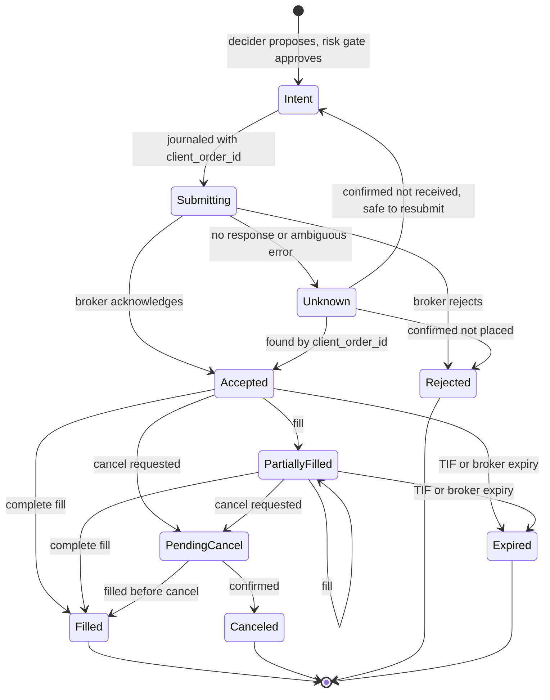

# Trading Domain Spec (v1)

| | |
|---|---|
| **Status** | Draft v0.1: requires founder approval before implementation (safety-critical) |
| **Scope** | US stocks, ETFs, and crypto spot on Alpaca ([DEC-23](../project/04-decision-log.md#decisions)) |
| **Implements** | PRD 6.4, 6.5 (FR-5.3, FR-5.10); backlog E2, E3, E4, E6-6, E7 |
| **Reference cases** | [reference-cases/trading-domain.yaml](reference-cases/trading-domain.yaml) |

This spec defines the exact rules for instruments, market data, orders, fills, fees,
accounting, settlement, corporate actions, and account rules. Implementations must match the
[reference cases](reference-cases/trading-domain.yaml) exactly. Anything this spec does not
define is out of scope for v1 and must fail safe (reject, pause, or alert), not be guessed.

## 1. Principles

1. **The broker is the source of truth in paper and live trading.** Our model exists to
   (a) run backtests, (b) pre-check orders in the risk gate before they reach the broker, and
   (c) reconcile against the broker. When our model and the broker disagree, the broker wins and
   the difference is journaled and investigated ([§10](#10-reconciliation)).
2. **Venue facts come from the venue.** Tick sizes, quantity increments, fractionability,
   shortability, calendars, and session times are read from the broker's APIs, never hardcoded.
3. **Unknown means stop.** An unrecognized corporate action, order state, or account condition
   pauses the affected agent and alerts the owner.
4. **Conservative when in doubt.** Where rules allow a choice, pick the one that cannot create a
   violation (for example, cash accounts use settled cash only).

## 2. Conventions

### 2.1 Numbers

- All prices, quantities, and money use **fixed-point decimals** (for example, `rust_decimal`
  in Rust, `decimal.Decimal` in Python). **Never floating point.**
- Internal calculations keep full precision. Rounding happens only at the points listed below.

| Quantity | Rounding rule |
|---|---|
| Order quantity | Truncate toward zero to the instrument's quantity increment |
| Buy limit / stop price | Round **down** to the instrument's price increment |
| Sell limit / stop price | Round **up** to the instrument's price increment |
| Regulatory fees (backtest model) | Per the fee configuration's rounding rule (§6.2) |
| Crypto fees in USD (backtest model) | Round to 0.01 USD, half-up |
| Reported money amounts (UI, exports) | 0.01 USD, half-even; internal values unchanged |

### 2.2 Time

- Timestamps are **UTC with nanosecond precision**.
- Trading calendars and sessions are evaluated in **America/New_York**.
- A **trading day** and **business day** follow the broker's market calendar (holidays and early
  closes included). Crypto has no trading-day boundary for settlement; for daily reporting, the
  crypto day is the UTC calendar day.

### 2.3 Identifiers

- Instrument ID: `<asset_class>:<symbol>`, for example `us_equity:AAPL`, `crypto:BTC/USD`.
- Order intent ID: a ULID generated by the runtime.
- Broker `client_order_id`: derived deterministically from the intent ID (at most 128
  characters), so a retried submission of the same intent is recognized as the same order.

## 3. Instruments

Loaded from the broker's asset API; refreshed at least daily and immediately after any order
rejection that cites instrument properties.

| Field | Meaning | Source |
|---|---|---|
| `id`, `symbol`, `asset_class` | Identity (`us_equity` or `crypto`) | Broker |
| `quote_currency` | USD in v1 | Broker |
| `tradable` | Can be traded now | Broker |
| `fractionable` | Fractional quantities and notional orders allowed | Broker |
| `marginable` | Eligible for margin (crypto: never) | Broker |
| `shortable`, `easy_to_borrow` | Short-sale eligibility | Broker |
| `min_order_size`, `qty_increment`, `price_increment` | Order constraints | Broker (crypto); broker or venue rules (equities) |
| `status` | Active or inactive | Broker |

An agent may only trade instruments in its mandate universe that are `tradable` and `active`.

## 4. Market data

### 4.1 Types

| Type | Fields |
|---|---|
| Trade | instrument, timestamp, price, size, exchange (equities) |
| Quote | instrument, timestamp, bid price, bid size, ask price, ask size |
| Bar | instrument, start timestamp, interval, open, high, low, close, volume, VWAP, trade count, session |
| Corporate action | instrument, type, ex-date, record date, pay date, ratio or cash amount |

### 4.2 Sessions (US equities)

| Session | Hours (ET) | Allowed orders ([§5.2](#52-constraints)) |
|---|---|---|
| Overnight | 20:00 – 04:00 | Limit, TIF day or GTC, `extended_hours = true` |
| Pre-market | 04:00 – 09:30 | Limit, TIF day or GTC, `extended_hours = true` |
| Regular | 09:30 – 16:00 (early closes per calendar) | All v1 types |
| After-hours | 16:00 – 20:00 | Limit, TIF day or GTC, `extended_hours = true` |

Crypto trades continuously. Session boundaries come from the broker's calendar and clock APIs.

### 4.3 Gaps and adjustments

- Missing bars during a closed session are **closures**, not gaps. `inspect` must distinguish
  them using the calendar.
- **Backtests use raw (unadjusted) prices plus explicit corporate actions** (§8.5), so P&L
  matches what an account would have experienced. Split- and dividend-adjusted series may be
  used for signals only.

## 5. Orders

### 5.1 v1 order types and time in force

| Asset class | Types | Time in force |
|---|---|---|
| US equities, whole shares, regular session | market, limit, stop, stop-limit | day, gtc, ioc, fok |
| US equities, fractional or notional | market, limit, stop, stop-limit | day only |
| US equities, extended or overnight session | limit only | day, gtc; `extended_hours = true` |
| Crypto | market, limit, stop-limit | gtc, ioc |

Agents in v1 use **market and limit** orders, plus **protective stops** for open positions
(PRD FR-5.8). Trailing stops, bracket orders, and options are out of scope.

### 5.2 Constraints

The risk gate rejects, before submission, any order that violates:

1. Quantity (`qty`) and notional are mutually exclusive.
2. Quantity is at least `min_order_size` and a multiple of `qty_increment` (after truncation).
3. Fractional and notional equity orders use TIF `day`.
4. **No fractional short sales**; fractional sell orders may only reduce a long position.
5. Outside the regular session, equity orders are limit orders with `extended_hours = true`.
6. **No self-crossing:** the broker rejects an order that could trade against the account's own
   resting order on the opposite side. Before submitting, the executor cancels any resting
   opposite-side order in the same instrument and waits for the cancel to be confirmed.
7. GTC equity orders expire after 90 days and are canceled by the broker before corporate
   actions; the runtime treats both as normal `expired` / `canceled` outcomes.

### 5.3 Order lifecycle

Invariants:

- Terminal states (`Filled`, `Canceled`, `Rejected`, `Expired`) are final.
- Filled quantity never decreases and never exceeds order quantity.
- **`Unknown` is never resolved by guessing.** It is resolved only by querying the broker by
  `client_order_id`. While any order is `Unknown`, the agent places no new orders in that
  instrument.
- Every transition is journaled before it takes effect in the agent's state.

## 6. Fills and fees

### 6.1 Fill record

instrument, order ID, fill ID, timestamp, side, quantity, price, liquidity (maker or taker,
crypto), fee amount, fee currency.

### 6.2 US equities fees

- **Commission:** zero on Alpaca.
- **Regulatory fees on sales only:**
  - SEC Section 31 fee: rate × sale proceeds.
  - FINRA Trading Activity Fee: rate × shares sold, capped per trade.
- Rates and rounding rules change over time. They live in an **effective-dated fee
  configuration**, never in code. Backtests apply the configuration in force on the trade date.
- In paper and live trading, the broker's reported fees are authoritative.

The reference cases use explicitly labeled **test values** (not real rates):
SEC rate 0.00003, TAF 0.0002 per share, both rounded up to the cent.

### 6.3 Crypto fees (Alpaca)

- Maker/taker fees by 30-day volume tier (tier 1: 15 bps maker, 25 bps taker), from a
  dated fee-schedule configuration.
- **Charged in the asset received:** a buy of BTC/USD pays the fee in BTC (you receive less
  BTC); a sell pays the fee in USD (you receive fewer dollars).
- **Accounting convention:** a fee paid in an asset is valued at the fill price and recorded as
  a fee in USD; the position's cost basis is received quantity × fill price
  ([RC-07](reference-cases/trading-domain.yaml)).
- Alpaca posts crypto fees at end of day. The runtime accrues the expected fee at fill time and
  reconciles it against the posted fee activity.

### 6.4 Backtest fill model

1. **No look-ahead:** a decision made on data up to the close of bar *t* can fill no earlier
   than the open of bar *t+1*.
2. **Market orders** fill at the next bar's open, adjusted by slippage: buys at
   open × (1 + s), sells at open × (1 − s), where s = half-spread + impact (configurable;
   defaults 1 bp + 2 bps for liquid US equities, stricter for crypto and illiquid names).
3. **Limit orders** fill only if price trades **through** the limit (buy: bar low strictly below
   the limit; sell: bar high strictly above), at the limit price.
4. **Stop orders** trigger when price reaches the stop, then fill as market (stop) or limit
   (stop-limit) from that bar onward.
5. **Volume cap:** a fill in one bar is at most a configurable share of that bar's volume
   (default 10%); the remainder stays working.
6. **Sessions:** no fills in sessions the order is not allowed in (§4.2, §5.1).
7. **Crypto liquidity:** marketable orders pay taker fees; resting limit fills pay maker fees.

## 7. Accounts

| Field | Source |
|---|---|
| Account type: cash or margin | Broker |
| Cash: settled and unsettled buckets, with settlement dates | Our model, reconciled to broker |
| Buying power | Broker-reported and our model; the risk gate uses the **lower** |
| Day-trading regime (§9.2) | Broker, confirmed per broker |
| Account restrictions (for example, trading blocked) | Broker |

## 8. Accounting

### 8.1 Positions

A position has a **signed quantity** (positive long, negative short) and an **average cost**
per unit. v1 uses the **average cost method** for P&L. Tax lots are also recorded first-in,
first-out for later tax reporting (§9.7), but do not affect P&L.

For a fill of quantity *q* at price *p* (q > 0 for buys, q < 0 for sells), with current
position *Q* at average cost *A*:

| Case | New quantity | New average cost | Realized P&L (gross) |
|---|---|---|---|
| Opening or increasing (Q = 0, or same sign as q) | Q + q | (A·\|Q\| + p·\|q\|) / \|Q + q\| | 0 |
| Reducing (opposite sign, \|q\| ≤ \|Q\|) | Q + q | A (unchanged) | (p − A) · \|q\| for a long; (A − p) · \|q\| for a short |
| Closing (\|q\| = \|Q\|) | 0 | undefined (reset) | as for reducing |
| Flipping (opposite sign, \|q\| > \|Q\|) | Q + q | p | close \|Q\| as above; open the remainder at p |

Fees are recorded separately and never folded into average cost. **Net realized P&L =
gross realized P&L − fees.**

### 8.2 Marking and valuation

- **Mark price:** quote midpoint if a quote is fresher than the staleness threshold; otherwise
  the last trade; otherwise the previous close. The risk gate treats a stale mark as a data
  fault (PRD FR-8.3).
- Market value = quantity × mark (negative for shorts).
- Unrealized P&L = (mark − A) × Q.
- **Equity = total cash (settled + unsettled) + Σ market values.**
- **Total P&L = realized + unrealized + income (dividends) − fees.**

### 8.3 Cash movements

| Event | Cash effect (trade date) |
|---|---|
| Buy | −(quantity × price) |
| Sell | +(quantity × price) − regulatory fees |
| Crypto sell | +(quantity × price) − fee in USD |
| Crypto buy | −(quantity × price); fee reduces quantity received, not cash |
| Dividend | Receivable on ex-date; cash on pay date (§8.5) |

### 8.4 Settlement

- **US equities: T+1 business day** (next trading day on the broker's calendar; holidays skip).
- **Crypto:** settles immediately.
- Proceeds sit in **unsettled cash** until the settlement date, then move to settled cash.
- **Cash accounts: buying power = settled cash − cash reserved by open buy orders.** Unsettled
  proceeds are never used ([RC-08](reference-cases/trading-domain.yaml)). This prevents
  good-faith and free-riding violations by construction.

### 8.5 Corporate actions

| Action | Treatment |
|---|---|
| **Split** (ratio r = new shares ÷ old shares; forward r > 1, reverse r < 1) | On the ex-date: Q' = Q × r, A' = A ÷ r; realized P&L unchanged; market value unchanged at the adjusted price. Open orders in the instrument are canceled |
| Reverse split leaving a fraction in a non-fractionable instrument | Fraction removed; cash in lieu at the broker's price; realized P&L on the removed fraction = (cash-in-lieu price − A') × fraction ([RC-05](reference-cases/trading-domain.yaml)) |
| **Cash dividend** (amount d per share) | On the ex-date, for the position held at the prior close: receivable = Q × d (negative for shorts, which owe the dividend). On the pay date: receivable moves to cash. Recorded as **income**, not realized trading P&L |
| Any other action (stock dividend, spin-off, merger, symbol change, delisting) | **Out of scope for v1:** pause agents holding the instrument, cancel their open orders, and alert the owner |

### 8.6 Invariants (property-based tests)

1. **Conservation:** with no deposits or withdrawals, change in equity = realized P&L + change in
   unrealized P&L + income − fees, to full internal precision.
2. Reducing fills never change average cost.
3. Splits never change market value, realized P&L, or equity.
4. In cash accounts, settled cash never goes negative.
5. Position quantity always equals the sum of filled quantities (buys minus sells) adjusted by
   corporate actions.
6. Replaying the same fills and corporate actions always yields identical state.

## 9. Account rules (risk gate)

### 9.1 Leverage

v1 agents use **no margin borrowing**: maximum leverage 1×, and no order may create a debit
(negative cash) balance. Crypto is never marginable.

### 9.2 Day-trading regime

The SEC approved FINRA's replacement of the pattern-day-trader rules with intraday margin
standards on April 14, 2026; it took effect June 4, 2026, and brokers may phase it in until
October 20, 2027. The risk gate therefore supports **two regimes, selected per broker account**:

| Regime | Rule the gate enforces |
|---|---|
| `legacy_pdt` (broker has not transitioned) | A day trade is opening and closing the same security on the same trading day in a margin account. Block any order that would create a fourth day trade within five business days when account equity is below the broker's threshold. Use the broker-reported day-trade count and our own count; act on the higher |
| `intraday_margin` (broker has transitioned) | Never create an intraday margin deficit. With v1's 1× leverage (§9.1), orders that pass the buying-power check cannot create one |

- Crypto round trips never count as day trades. Fractional share day trades do count.
- A blocked order is classified **DENY** (not ASK) and journaled with the rule that blocked it;
  the owner is notified.
- **Open question:** which regime Alpaca applies, and from when ([§12](#12-open-questions)).

### 9.3 Short sales

- **Disabled by default.** A mandate must enable shorting explicitly.
- When enabled: margin account only; instrument `shortable` and `easy_to_borrow`; whole shares
  only; equities only.
- When the short-sale price restriction (SEC Rule 201) is active for an instrument, the gate
  **blocks new short sales** in it for the restriction's duration (conservative).

### 9.4 Market hours

Orders must satisfy the session constraints in §4.2 and §5.1. Market orders are never sent
outside the regular session. Holidays and early closes come from the broker calendar.

### 9.5 Buying power

Every buy order must satisfy: order cost (quantity × limit price, or × mark × (1 + slippage
buffer) for market orders) + fees ≤ buying power (§7, §8.4).

### 9.6 Order-rate limits

Per-agent and per-account limits on orders per second and per day (configured), to stay within
broker rate limits and to stop runaway loops.

### 9.7 Wash sales (informational)

When a US equity is sold at a loss and a substantially identical security is bought within 30
days before or after, reports flag a possible wash sale. This is **information, not tax
advice**, and never blocks trading. Crypto is not flagged in v1.

## 10. Reconciliation

Run on startup, after any `Unknown` order, and on a schedule while running.

| Compared | Tolerance | On mismatch |
|---|---|---|
| Position quantity per instrument | Exact at the instrument's quantity precision | Pause agent, alert |
| Open orders (by `client_order_id`) | Exact set and state | Adopt broker state; journal; pause if an order is unknown to us |
| Fills since last checkpoint | Exact | Ingest missing fills; journal |
| Cash | Exact for equities; for crypto, within expected unposted fees until end-of-day posting | Pause agent, alert |
| Fees | Exact once posted | Adjust accrual; journal |

## 11. Reference cases

All reference cases, with inputs and exact expected outputs, are in
[reference-cases/trading-domain.yaml](reference-cases/trading-domain.yaml):

| ID | Covers |
|---|---|
| RC-01 | Buy, partial sell, regulatory fees, marking, equity, conservation |
| RC-02 | Averaging into a position; reducing keeps average cost |
| RC-03 | Flip from long to short; covering a short |
| RC-04 | Forward split |
| RC-05 | Reverse split with cash in lieu |
| RC-06 | Cash dividend, long and short |
| RC-07 | Crypto buy and sell with fees in the received asset |
| RC-08 | Cash-account settlement and buying power |
| RC-09 | Legacy day-trade blocking; crypto excluded |
| RC-10 | Backtest fills: no look-ahead, slippage, limit-through, volume cap |

Implementations must reproduce every expected value exactly. Adding or changing a reference case
requires founder approval.

## 12. Open questions

1. Which day-trading regime Alpaca applies to margin accounts today, and its transition date to
   the intraday margin standard.
2. Whether Alpaca offers cash (non-margin) accounts to all users, or only margin accounts with
   1× buying power below a balance threshold.
3. Current SEC Section 31 and FINRA TAF rates and their exact rounding rules, for the fee
   configuration.
4. Whether Alpaca posts crypto fees in real time yet (reconciliation tolerance in §10).
5. Treatment of crypto under wash-sale rules for future reporting.

## 13. Out of scope for v1

- Perpetual futures: funding, margin, liquidation (Kraken Derivatives US, backlog E16).
- Options.
- Corporate actions other than splits and cash dividends (fail safe per §8.5).
- Non-USD currencies and crypto-to-crypto pairs.
- Margin borrowing (leverage above 1×).
