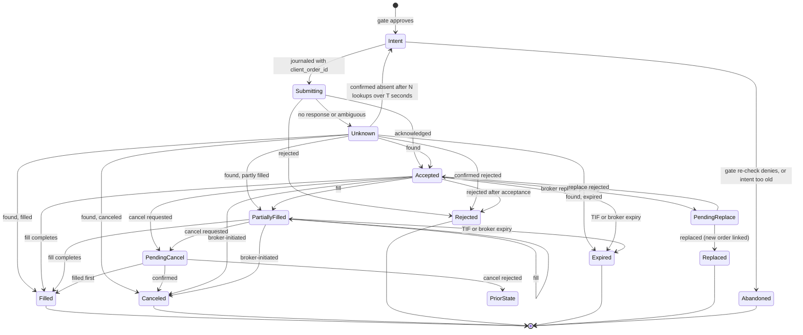

# Trading Domain Spec (v1)

| | |
|---|---|
| **Status** | Draft v0.3: requires founder approval before implementation (safety-critical) |
| **Scope** | US stocks, ETFs, and crypto spot on Alpaca ([DEC-23](../project/04-decision-log.md#decisions)) |
| **Implements** | PRD 6.2, 6.4, 6.5, 6.7; backlog E2–E7 |
| **Reference cases** | [reference-cases/trading-domain.yaml](reference-cases/trading-domain.yaml) (schema v3) |

## Change history

- **v0.3:** second three-role review (all "approve with changes"). Applies
  [DEC-34 to DEC-38](../project/04-decision-log.md#decisions): margin buying power on total cash;
  IEX paper profile and SIP for live equities; crypto protection with simple orders; no
  extended-hours openings; refined posture wording. Also: continuous-trading limit fills, split
  mark adjustment, trade-date dividend entitlement, broker-posting gates for corporate actions,
  bracket mechanics, conduct-control exemptions for risk reduction, restriction detection from
  rejects, agent modes, complete state machine, reason-code precedence, journal event catalogue,
  retention start point, related-account self-trade groups. Reference cases: schema v3, 24 cases.
- **v0.2:** first three-role review (all "needs rework"); DEC-26 to DEC-33.
- **v0.1:** initial draft.

## 1. Principles

1. **The broker is the source of truth in paper and live trading.** The model runs backtests,
   pre-checks orders, and reconciles. When they disagree, the broker wins and the difference is
   journaled as a compensating event ([§11](#11-reconciliation)).
2. **Venue facts come from the venue.** Tick sizes, increments, flags, calendars, and sessions come
   from broker APIs or effective-dated configuration, never code.
3. **Unknown means stop.** An unrecognized corporate action, status, account condition, or data
   fault pauses the affected agents and alerts the owner.
4. **Conservative when in doubt,** except that **risk reduction is never blocked by a
   conservative rule** (§9.6, §9.2): exits, protective orders, and the kill switch always proceed
   unless the broker itself refuses them.
5. **Mandate does not choose instruments, strategy, sizing, or limits**
   ([DEC-38](../project/04-decision-log.md#decisions)). These come from user-confirmed mandate
   fields; advisors are tools the user selects. Platform defaults only restrict trading. Inferred
   mandate fields are inactive until confirmed. Templates never ship with platform-chosen
   instruments or parameters. Calibration changes autonomy only within user-approved bounds, and
   each change is journaled. Approval requests show the agent's proposal and the mandate rule it
   follows, not platform-authored alternatives.

## 2. Conventions

### 2.1 Numbers

- Fixed-point decimals only (`rust_decimal`, Python `decimal.Decimal` with precision ≥ 60).
  **Never floating point.**
- Rounding is written as `round(x, scale, mode)`. Internal values keep full precision unless a
  rule below applies.

| Field | Rule |
|---|---|
| Price | ≤ 9 decimal places |
| Quantity | ≤ 9 decimal places; per-instrument increment |
| Cost-basis reduction | `round(B × part ÷ whole, 12, half_even)` (§8.1) |
| Adjusted marks after splits | `round(mark × old ÷ new, 12, half_even)` (§8.5) |
| Order quantity | Truncate to the quantity increment, except a sell closing the full position (§5.3) |
| Notional amount | Truncate to 0.01; minimum 1.00 USD |
| Buy limit / stop price | Round down to the tick of the rounded price |
| Sell limit / stop price | Round up to the tick of the rounded price |
| Equity regulatory fees | Accrued per fill at full precision; charged as a daily total, `round(total, 2, ceiling)` (§6.2) |
| Crypto fee quantity | `round(gross × bps ÷ 10000, 9, half_up)` |
| Crypto fee in USD | `round(x, 2, half_up)` per fill |
| Fee reservation (buying power) | Per order: `round(estimated fees, 2, ceiling)` |
| Dividends | `round(Q × d, 2, half_even)` per position; broker amount authoritative |
| Reported money | `round(x, 2, half_even)`; internal unchanged |
| Backtest fill prices | Not tick-rounded |

**Equity ticks** (effective-dated, Reg NMS Rule 612): 0.01 at or above 1.00 USD, 0.0001 below.
Crypto uses the broker's `price_increment`.

### 2.2 Time and calendars

- Timestamps are UTC with nanosecond precision; sessions are evaluated in America/New_York.
- **Trading calendar:** NYSE trading days, holidays, early closes (from the broker).
- **Settlement calendar:** days that are both NYSE trading days **and** Federal Reserve business
  days; separate, versioned fixture.
- **Equity trade date:** the trading day of execution; **equity fills between 20:00 and 23:59:59
  ET belong to the next trading day.** Crypto has no trade date for settlement; the crypto
  reporting day ends at 00:00 UTC.

### 2.3 Identifiers

- **Instrument ID:** the broker's `asset_id` (UUID); symbol is a dated attribute; crypto symbols
  normalized at the connector (`BTC/USD` and `BTCUSD` are one instrument).
- **Intent ID:** ULID. **`client_order_id`:** `"{intent_ulid}-{attempt}"` (≤ 128 characters);
  `attempt` increments only after the broker confirms the previous attempt `Rejected`; retries of
  an unconfirmed attempt reuse the same ID.
- **Fill ID:** the broker's execution ID; fills are de-duplicated by it.

## 3. Instruments and eligibility

### 3.1 Instrument fields

Loaded from the broker asset API; refreshed daily (equities after 19:45 ET), after any reject that
cites instrument properties, and on corporate-action events.

| Field | Meaning |
|---|---|
| `asset_id`, `symbol`, `asset_class`, `exchange` | Identity; exchange code (table below) |
| `status`, `tradable` | Active and tradable now |
| `fractionable` | Fractional quantities allowed |
| `marginable`, `shortable`, `easy_to_borrow` | Loaded; unused in v1 (no margin borrowing, no shorts) |
| `ipo` | Limit orders only until the first trade |
| `ptp_no_exception` | Publicly traded partnership without the withholding exception |
| `overnight_tradable`, `overnight_halted`, `fractional_eh_enabled` | Loaded; overnight and extended-hours openings are disabled in v1 |
| `min_order_size`, `min_trade_increment`, `price_increment` | Order constraints |

**Exchange codes (Alpaca):** `NASDAQ`, `NYSE`, `ARCA` (NYSE Arca), `AMEX` (NYSE American), `BATS`
(Cboe BZX) are eligible; `OTC` and anything else are not.

### 3.2 Eligibility floor ([DEC-31](../project/04-decision-log.md#decisions))

An **opening or increasing** order is allowed only if all hold, checked in this order:

1. Instrument in the agent's mandate universe, `status = active`, `tradable = true`.
2. US equities: eligible exchange code (§3.1).
3. Not `ipo`; not `ptp_no_exception`.
4. Prior close ≥ price floor (organization setting; default 5.00 USD; platform minimum 1.00).
5. 20-day median daily dollar volume ≥ liquidity floor (organization setting; platform minimum
   1,000,000 USD).
6. **Complex, leveraged, inverse, or volatility ETPs and ETNs** only if the mandate enables them and
   the owner acknowledged the risk disclosure. Identified from a maintained reference list; an
   instrument missing from the list is treated as not complex.
7. Crypto: USD pairs only; account `crypto_status = ACTIVE`; 30-day median daily dollar volume ≥
   the crypto liquidity floor.

Risk-reducing orders for held positions are allowed regardless of the floor or universe. A held
instrument that becomes non-tradable pauses the agent and alerts the owner.

### 3.3 Concentration

A position's market value (including working opening orders at their maximum cost) may not exceed
the mandate's per-instrument cap, bounded by the organization ceiling.

## 4. Market data

### 4.1 Types

| Type | Fields |
|---|---|
| Trade | instrument, timestamp, price, size, exchange, feed |
| Quote | instrument, timestamp, bid, bid size, ask, ask size, feed |
| Bar | instrument, start (left edge), interval, OHLC, volume, VWAP, trade count, session, feed |
| Trading status | instrument, timestamp, halted / resumed, LULD band, short-sale restriction |
| Corporate action | instrument, type, ex-date, record date, pay date, ratio or cash amount |

### 4.2 Data profiles ([DEC-35](../project/04-decision-log.md#decisions))

| Profile | Used for | Rules |
|---|---|---|
| `sip` | Backtests; **live equity agents (required)** | Consolidated quotes and trades; standard staleness and spread limits |
| `iex` | **Paper trading** | IEX quotes as the reference for collars and risk marks; wider spread limit and longer staleness threshold (configured); an opening order requires a fresh IEX quote |
| `crypto` | Crypto, paper and live | Alpaca crypto feed |

A bar exists only when trades occur: a missing regular-session bar means "no trade", not a data
gap. `inspect` distinguishes no-trade minutes, session closures, and true gaps.

### 4.3 Sessions (US equities)

| Session | Hours (ET) | v1 agents |
|---|---|---|
| Overnight | 20:00 – 04:00 (Sunday night to Friday morning) | No orders ([DEC-30](../project/04-decision-log.md#decisions)) |
| Pre-market | 04:00 – 09:30 | **Exits only**, as limit orders with `extended_hours = true` ([DEC-37](../project/04-decision-log.md#decisions)) |
| Regular | 09:30 – 16:00 (early closes per calendar) | Per §5 |
| After-hours | 16:00 – 20:00 | **Exits only**, as limit orders with `extended_hours = true` |

**Auction windows:** opening 09:28–09:30 ET; closing: the last 10 minutes of the regular session
(configurable). No opening orders in either; exits in them use limit orders, never market orders.
Crypto trades continuously.

### 4.4 Halts

Live and paper runtimes **subscribe to trading-status and LULD channels**. For a halted or paused
instrument: no new opening orders, resting marketable opening orders are canceled, and a
cooling-off period applies after the reopen. A stale quote or dropped status feed is treated as a
**presumed halt**: no market orders; exits use marketable limit orders.

### 4.5 Adjustments

Backtests use raw prices plus explicit corporate actions (§8.5). Signal series are adjusted
**point in time** (only actions with ex-date ≤ decision time); vendor-adjusted history is never
used.

## 5. Orders

### 5.1 v1 order policy ([DEC-29](../project/04-decision-log.md#decisions), [DEC-37](../project/04-decision-log.md#decisions))

| Purpose | Allowed |
|---|---|
| Opening or increasing (equities) | Regular session only; **limit orders** within the price collar; plain, or **bracket** (entry + take-profit + stop) |
| Opening or increasing (crypto) | Limit orders within the collar (simple orders only) |
| Reducing or closing | Limit orders in any session the instrument allows; market orders only in the regular session outside auction windows and with current status data |
| Protective (equities) | **OCO** or bracket legs, whole shares only, TIF GTC ([§5.4](#54-protective-exits-dec-28-dec-36)) |
| Protective (crypto) | **One simple GTC stop-limit** for the whole position ([DEC-36](../project/04-decision-log.md#decisions)) |
| Not used in v1 | IOC, FOK, trailing stops, replace/amend (except broker-initiated), notional market buys, options, short sales |

### 5.2 Alpaca capability matrix

| Asset / condition | Order types | Time in force |
|---|---|---|
| Equities, whole shares, regular session | market, limit, stop, stop-limit | day, gtc |
| Equities, fractional or notional | market, limit, stop, stop-limit | day only; **not allowed in OCO or bracket orders** |
| Equities, extended hours | limit only, `extended_hours = true` | day, gtc (fractional: day) |
| Equities, OCO and bracket | all legs share one TIF; no extended hours | day, gtc |
| Crypto | market, limit; stop-limit (GTC only); **simple orders only** | gtc, ioc |
| Crypto | maximum 200,000 USD notional per order | — |

GTC equity orders expire 90 days after creation. Orders not eligible for the current session are
queued by the broker for the next eligible session.

### 5.3 Constraints enforced before submission

1. Quantity and notional are mutually exclusive.
2. Quantity ≥ `min_order_size` and a multiple of the increment, except a sell closing the full
   position (exact quantity or the close-position endpoint).
3. **No order may cross zero** (`would_cross_zero`).
4. **Sell quantity ≤ position − Σ open sell quantity**, protective legs included
   (`sell_exceeds_available`).
5. **One side at a time:** an agent's non-protective orders in an instrument are all on the same
   side (`working_order_limit`). Before a risk-reducing sell, the executor cancels the agent's own
   resting opening buys in that instrument and waits for confirmation.
6. At most one working non-protective order per instrument per account (`working_order_limit`).
7. Fractional and notional equity orders use TIF day; no fractional short sales.
8. **Self-crossing:** the broker rejects orders that could interact with the account's own
   opposite-side orders (OCO, bracket, and trailing-stop orders are exempt; crypto included). A
   risk-increasing order never cancels a protective order (§5.4).
9. An `Unknown` order reserves its maximum cost and counts as filled for exposure and
   concentration; no new orders in that instrument (`unknown_order_in_flight`) until resolved.

### 5.4 Protective exits ([DEC-28](../project/04-decision-log.md#decisions), [DEC-36](../project/04-decision-log.md#decisions))

**Equities (whole shares):**

- **Tranche model:** each protected entry is a **GTC bracket order**. Adding to a position is a new
  bracket; Σ protective sell quantity ≤ position.
- **Bracket legs are held until the entry is completely filled.** If an entry reaches a terminal
  state partly filled (canceled or expired), the broker cancels its legs; the executor then
  submits a **GTC OCO for the filled quantity** at the bracket's prices.
- **Expiry:** protective orders are re-placed before `expires_at` (buffer configured): cancel,
  confirm, submit a new OCO.
- A plain risk-increasing order in an instrument with resting protective orders is denied
  (`add_blocked_by_protective_order`).
- **Exit sequence:** cancel all protective orders in the instrument → confirm → re-run the gate on
  fresh state → submit the exit → after a terminal state, re-place protection for any remaining
  quantity. The unprotected interval is journaled; beyond the configured limit the owner is alerted.
- **Fractional positions:** only the whole-share part can be protected; the fraction is
  unprotected and disclosed.
- Protection triggers in the regular session only (stops do not trigger in extended hours).

**Crypto (simple orders only):**

- One **GTC stop-limit sell** for the whole position; limit = stop × (1 − `crypto_stop_limit_offset_bps`).
- Take-profit is managed by the runtime, not a resting order.
- **Adds and exits:** cancel the stop-limit → confirm → submit the order → after a terminal state,
  re-place the stop-limit for the new net quantity. The unprotected interval is journaled.
- A stop-limit may not fill on a gap; disclosed to the owner.

### 5.5 Kill switch

Cancel all open orders in scope → confirm → close all positions in scope (close-position endpoint;
market orders only in the regular session outside auction windows with current status data;
marketable limit orders otherwise) → journal each step → agent mode `stopped`. The kill switch
never waits for approval and is exempt from §9.6.

### 5.6 Order lifecycle

`PriorState` means the state before `PendingCancel` (Accepted or PartiallyFilled); fills during
`PendingCancel` update filled quantity without leaving the state.

**Broker status mapping (Alpaca):**

| Broker status | Internal state |
|---|---|
| `new`, `accepted`, `pending_new`, `accepted_for_bidding`, `held` | Accepted |
| `partially_filled` / `filled` | PartiallyFilled / Filled (apply fill) |
| `done_for_day`, `stopped`, `calculated` | Unchanged |
| `pending_cancel` | PendingCancel |
| `canceled`, `expired` | Canceled, Expired (release reservation) |
| `rejected` | Rejected (journal reject code) |
| `suspended` | Accepted, flagged restricted; triggers reconciliation |
| `pending_replace` | PendingReplace (old order stays live) |
| `replaced` | Replaced (old) + Accepted (new, linked); gate re-run on the new order |
| Any other value | Pause agent and alert |

**Rules:**

- Terminal states are final. **Fills are always applied to accounting**; a fill for an order in a
  terminal state is journaled as `late_fill` and triggers reconciliation.
- A status update implying an illegal transition is journaled and ignored (fills still applied).
- Filled quantity is non-decreasing, ≤ order quantity, and equals the sum of unique fills.
- `Unknown → Intent` re-runs the gate: if allowed and younger than `max_intent_age`, resubmit
  with the **same** `client_order_id`; otherwise `Abandoned`.
- Per-event fill quantity and price are authoritative; cumulative quantity mismatches trigger
  reconciliation.
- Every transition is journaled before it takes effect in state.

## 6. Fills and fees

### 6.1 Fill record

fill ID, `client_order_id` (absent for external fills: each is its own order), instrument, trade
date, timestamp, side, **gross quantity**, price, liquidity (maker/taker, crypto), fees,
fee-configuration version.

### 6.2 US equities fees

| Fee | Side | Basis |
|---|---|---|
| Commission | — | Zero on Alpaca |
| SEC Section 31 | Sells | Rate × proceeds |
| FINRA TAF | Sells | Rate × shares, capped per execution by default (`taf_cap_basis`: `per_execution` or `per_order`) |
| CAT | Buys and sells | Rate × shares |

- Accrued per fill at full precision (USD). **`FeesCharged` (equities) at 20:00 ET for each trade
  date** replaces the accrual with `round(daily total, 2, ceiling)`.
- Accrued fees are a liability in equity and reserved against buying power.
- Rates come from an effective-dated configuration transcribed from Alpaca's fee schedule.

### 6.3 Crypto fees (Alpaca)

- Maker/taker by 30-day volume tier (tier 1: 15/25 bps), dated configuration.
- Buy: `fee_qty = round(gross × bps ÷ 10000, 9, half_up)`, received = gross − `fee_qty`; the fee is
  valued at the fill price (unrounded) and recorded as a USD fee; cost basis = received × price.
  **Asset-denominated fees are not accrued liabilities.**
- Sell: USD fee `round(x, 2, half_up)`, accrued; **`FeesCharged` (crypto) at 00:00 UTC.**
- Until Alpaca posts the fee, the broker shows the gross quantity; reconciliation allows the
  unposted fee (§11). Sells are sized from the model's net quantity.

### 6.4 Backtest fill model

Configuration: decision latency, approval latency, slippage s = half-spread + impact (`fixed` bps,
or `sqrt`: coefficient × √(fill qty ÷ reference volume)), volume cap fraction, first-bar volume
source.

1. **Timing.** An order is eligible from the first bar starting at or after decision time + latency
   (+ approval latency if approval was required). Nothing fills on the bar that produced the
   decision.
2. **Sessions.** Fills only in sessions the order may trade in. An ineligible order waits for the
   next eligible session; a day order's remainder is canceled at the end of its last eligible
   session.
3. **Volume cap.** Per bar, fills ≤ truncate(fraction × reference volume, increment), shared by the
   account's orders in the instrument in submission order. **Reference volume = the previous bar
   in the same session**; for the first bar of a session, the median volume of that minute over
   the prior 20 sessions; if unavailable, the cap is 0 for that bar.
4. **Market orders** fill at the open: buys open × (1 + s), sells open × (1 − s).
5. **Limit orders** (buy; sell symmetric):
   - **Marketable on arrival** (open ≤ limit on the first eligible bar): fill at
     min(limit, open × (1 + s)), taker. A remainder keeps filling this way on later bars whose
     open ≤ limit; on a later bar whose open is beyond the limit, the remainder **becomes resting**.
   - **Resting** (from the first eligible bar, if not marketable on arrival): fills at the limit,
     maker, when the bar's low is **strictly below** the limit — including when the bar opens
     below the limit (continuous trading cannot print through a resting limit). **Exception:** on
     an **auction bar** (the first regular-session bar of the day, or the first bar after a halt
     reopens), a resting limit the open gaps through fills at the open. A touch is not a fill.
6. **Stop orders** (sell stop S; buy symmetric). Equities trigger in the regular session only.
   If open ≤ S: fill at open × (1 − s). Else if low ≤ S: fill at S × (1 − s).
7. **Stop-limit** (sell, stop S, limit L): if the bar opens below L, no fill; the order rests as a
   limit at L (rule 5). Otherwise, once triggered, fill at max(L, min(open, S) × (1 − s)).
8. **Protective pairs (OCO).** If the open reaches a leg, that leg fills first under its own rule.
   Otherwise, if both legs are reachable within the bar, the stop fills first (adverse first). The
   other leg is canceled.
9. Fill prices are not tick-rounded.

## 7. Accounts

### 7.1 Account ledger ([DEC-26](../project/04-decision-log.md#decisions))

- One ledger per broker account, owned by one serialized executor; all account-level rules use it.
  Agents submit intents; they never call the broker.
- **One agent per instrument per account** (`instrument_claimed` on deployment).
- An agent may cancel only its own orders.
- **External activity** (orders or fills not originated by Mandate) is ingested as unattributed,
  journaled, switches every agent on the account to `exits_only` until the owner acknowledges, and
  blocks claiming that instrument until acknowledged.

### 7.2 Account state and buying power

| Field | Source |
|---|---|
| Account type | Alpaca: always margin; `multiplier` 1, 2, or 4 |
| Equity, cash, `buying_power`, `non_marginable_buying_power`, `last_equity`, status flags | Broker |
| Settled and unsettled cash, reservations, accrued fees | Model, reconciled to broker |
| Day-trading regime | Alpaca: `intraday_margin` (§9.2) |

**1× requirement.** At connect and daily, the platform verifies `multiplier = 1` (or an enforced
1× cap); otherwise agents are paused and the owner is prompted.

**Buying power used by the gate** ([DEC-34](../project/04-decision-log.md#decisions)) is the lower
of the model and the broker:

| Account / asset | Model buying power |
|---|---|
| Margin account, equities | settled + Σ unsettled − reservations − round(accrued, 2, ceiling) |
| Margin account, crypto | min(equity model above, broker `non_marginable_buying_power`) |
| Cash account (generic brokers) | settled − reservations − round(accrued, 2, ceiling) |

Uncleared deposits count as unsettled. The gate includes paper-mode simulated fees (§10) in
accrued fees.

### 7.3 Account restrictions

The gate requires `status = ACTIVE`, `trading_blocked = false`, `account_blocked = false`,
`trade_suspended_by_user = false` (and `crypto_status = ACTIVE` for crypto). **Alpaca exposes no
closing-only field**, so restrictions are also detected from rejects:

| Signal | Effect |
|---|---|
| Any status other than `ACTIVE`, `trading_blocked`, `account_blocked`, `trade_suspended_by_user` | All agents on the account `paused`; owner alerted |
| Reject whose code or message indicates closing-only or restricted trading (mapped in the connector's reject table) | All agents on the account `exits_only`; owner alerted |
| N consecutive 403 rejects without a known order-level cause (configured) | All agents `exits_only`; account refreshed; owner alerted |
| Broker notice of an intraday margin call or freeze | All agents `exits_only`; owner alerted |

### 7.4 Agent modes

| Mode | Allowed |
|---|---|
| `normal` | Everything the mandate and gate allow |
| `exits_only` | Risk-reducing and protective orders only |
| `paused` | No new orders; resting protective orders stay; the kill switch still works |
| `stopped` | Terminal (after the kill switch or a stop); no orders |

## 8. Accounting

### 8.1 Positions and cost basis ([DEC-27](../project/04-decision-log.md#decisions))

Signed quantity Q; signed cost basis B (long: paid; short: received, negative). **Average cost
A = B ÷ Q is derived, never stored.** For a fill of signed quantity q at price p:

| Case | New Q | New B | Realized P&L (gross) |
|---|---|---|---|
| Opening or increasing | Q + q | B + q·p | 0 |
| Reducing (\|q\| < \|Q\|) | Q + q | B − R, R = round(B·\|q\|/\|Q\|, 12, half_even) | −(q·p) − R |
| Closing (\|q\| = \|Q\|) | 0 | 0 | −(q·p) − B |
| Crossing zero | Not allowed as one order (§5.3); fills that cross (backtests, other brokers) are split into close and open | | |

Fees are period expenses; **net realized = gross realized − fees.** Tax lots are recorded
separately (first-in first-out, fees included in lot basis); the broker's Form 1099-B is
authoritative.

### 8.2 Marks and equity

| Mark | Definition |
|---|---|
| Risk mark | Bid (long) / ask (short) from a sane quote (0 < bid ≤ ask; spread ≤ profile limit) fresher than the profile's staleness threshold; last trade only in-session and fresh |
| Reporting mark | Quote midpoint (same checks); otherwise last trade; with no mark yet, the last fill price (`last_fill`) |
| End of day | Equities: official close. Crypto: close of the bar ending 00:00 UTC |
| Previous close | Display only; stale for the gate |

- Opening orders require a fresh quote-based risk mark; risk-reducing orders accept any source.
- Backtest mark = bar close.
- Market value = Q × mark; unrealized = Q × mark − B.
- **Equity = settled + Σ unsettled + receivables − payables − accrued fees + Σ market value.**
- **Total P&L = realized (gross) + unrealized + income − fees.**

### 8.3 Cash buckets and movements

| Event | Effect |
|---|---|
| Equity buy fill | Settled −(q × p) |
| Equity sell fill | Unsettled[settlement date] +(\|q\| × p) |
| Crypto buy fill | Settled −(q × p); fee reduces quantity received |
| Crypto sell fill | Settled +(\|q\| × p); USD fee accrued |
| `FeesCharged` | Accrued (that family and day) → 0; settled − rounded charge |
| `SettlementPosted` (00:00 ET on the settlement date) | Unsettled[date] → settled |
| Dividend ex-date | Receivable (long) or payable (short); income |
| `DividendPaid` (00:00 ET on the pay date) | Receivable/payable → settled |
| `CashInLieuPosted` (broker activity) | Receivable → settled |

**No-debit rule** ([DEC-34](../project/04-decision-log.md#decisions)): in margin accounts, settled +
Σ unsettled − accrued fees ≥ 0 (settled cash alone may go negative). In cash accounts, settled ≥ 0.

### 8.4 Settlement

US equities: T+1 on the settlement calendar from the trade date (a sale on Friday 2026-10-09
settles Tuesday 2026-10-13). Crypto: at fill.

### 8.5 Corporate actions

**Timing.** Preparation at **19:45 ET** and application at **20:00 ET** on the **last trading day
before the ex-date**.

| Action | Treatment |
|---|---|
| **Split** (integer ratio new:old) | Q_raw = Q × new ÷ old; B and realized unchanged. Fractionable: Q' = truncate(Q_raw, 9). Non-fractionable: Q' = whole shares. Residual f = Q_raw − Q' (either case) is removed: R = round(B × f ÷ Q_raw, 12, half_even), B' = B − R, cash in lieu = f × broker price per post-split share (0 if none posted), realized += cash in lieu − R. **Every stored mark is replaced by round(mark × old ÷ new, 12, half_even)** (source unchanged). Cash in lieu is a receivable until `CashInLieuPosted` |
| **Cash dividend** (d per share) | Entitlement = position after all fills with **trade date before the ex-date**; receivable (payable for shorts) = round(Q × d, 2, half_even); **income on the ex-date**; `DividendPaid` on the pay date |
| Orders | At preparation, cancel the agent's open orders in the instrument (protective included) and require confirmation; an unconfirmed cancel at 20:00 alerts the owner, and a pre-action protective leg still live at 09:25 pauses the agent. Bracket and OCO legs are never adjusted by Alpaca, so they must be canceled. Broker-initiated `replaced` orders are linked and re-checked |
| Pending action state | Between application and the broker's posting of the action (split activity or updated position), reconciliation treats the expected difference as `pending_corporate_action`, not a mismatch |
| Protection re-derivation | After the broker's position reflects the split: stop' and take-profit' = price × old ÷ new, rounded per §2.1 by side; quantity per §5.4; re-placed as OCO (equities) or stop-limit (crypto) |
| Tax lots | Split: lot quantity × new ÷ old; residual removed first-in first-out; basis per the split rule |
| Anything else (stock dividend, spin-off, merger, symbol change, delisting) | Out of scope: pause agents holding the instrument, cancel their orders, alert |

### 8.6 Invariants (property-based tests)

Evaluated after every event; exact unless stated.

- **I1 Conservation.** With no deposits or withdrawals: Δequity = Δrealized + Δunrealized + Δincome
  − Δfees (fees include accruals and the rounding difference when charged), except as bounded in I3.
- **I2 Reducing fills.** Removed basis = round(B × |q| ÷ |Q|, 12, half_even).
- **I3 Splits.** Q', B', and realized are exact per §8.5. |ΔMV| ≤ |Q'| × 5 × 10⁻¹³ from mark
  rounding; equality is exact when mark × old ÷ new terminates within 12 places.
- **I4 Cash.** Total cash = settled + Σ unsettled. After `SettlementPosted` for date D, no unsettled
  bucket is dated ≤ D. No-debit rule per §8.3 holds after every order the gate approved.
- **I5 Quantity.** Q = the fold, in `seq` order, of signed received fill quantities (gross minus
  asset fee on crypto buys), split truncations, and residual removals.
- **I6 Determinism.** Folding the journal is identical after a serialize/deserialize round trip.
- **I7 Orders.** Filled quantity non-decreasing, ≤ order quantity, = Σ unique fills; terminal
  states final; duplicate or reordered broker events yield the same fill set.

## 9. Risk gate

### 9.1 Evaluation order and reason codes

Checks run in this order; the **first failing check's reason code** is reported. Every decision,
including allows, is journaled with the checks evaluated.

1. Account status (§7.3) → agent mode (§7.4)
2. Eligibility floor (§3.2, in list order) and concentration (§3.3)
3. Session, auction window, and halt (§4.3, §4.4)
4. Order constraints (§5.3, in list order)
5. Mark freshness and price collar (§8.2, §9.6)
6. Market-conduct controls (§9.6)
7. Gross exposure and buying power (§9.3, §9.5)
8. Day-trade budget (§9.2)

Reason codes are registered in the reference-case file.

### 9.2 Day-trading regime

FINRA replaced the pattern-day-trader rules with an intraday margin standard (SEC approval
April 14, 2026; effective June 4, 2026; broker phase-in until October 20, 2027).

**`intraday_margin` (Alpaca):** never create an intraday margin deficit. With 1× long-only exposure
an approved order cannot create one; broker-reported maintenance excess is also checked. If the
broker reports a deficit: a margin call must be met within **2 business days**; if unmet by the
**5th business day**, the account is frozen for 90 days from increasing debits; de minimis
deficits (lesser of 1,000 USD or 5% of equity) do not trigger a call. Agents go `exits_only` and
the owner is alerted.

**`legacy_pdt` (generic brokers not yet transitioned):**

- Day trade = purchasing and selling, or selling and purchasing, the same security on the same
  trading day in a margin account; shares held overnight are sold first; each same-day
  open-then-close counts once. Window = today plus the 4 prior trading days.
- remaining = 3 − count if prior-close equity < threshold, else unlimited; an account already
  flagged as a pattern day trader with equity below the threshold has remaining = 0.
- An opening order is allowed only if remaining ≥ required, where required = 1 + (1 if the same
  security was sold earlier today) + open same-day positions + working same-day opening orders in
  other instruments.
- **Exits are never denied** for day-trade count. The owner acknowledges in advance that an exit may
  become an extra day trade; if it does, the owner is alerted.

Crypto never counts. Fractional day trades count.

### 9.3 Leverage and short sales

1× gross exposure: Σ |market value| + Σ maximum cost of open opening orders ≤ equity. **No short
sales in v1** ([DEC-32](../project/04-decision-log.md#decisions)).

### 9.4 Sessions

Per §4.3: regular-session openings only; exits in extended hours as limit orders; no market orders
in auction windows or without current status data.

### 9.5 Buying power

Opening or increasing orders require: quantity × limit price + fee reservation (per order,
`round(estimated fees, 2, ceiling)`) ≤ buying power (§7.2) − existing reservations. **A fill
converts its share of the reservation into actual cost; the unfilled remainder stays reserved until
the order is terminal**, then is released.

### 9.6 Market-conduct controls ([DEC-31](../project/04-decision-log.md#decisions))

**These controls restrict opening and increasing orders only. They never block risk-reducing
orders, protective orders, or the kill switch;** oversize exits are sliced, never denied.

| Control | Default |
|---|---|
| One side at a time; one working non-protective order per instrument per account | §5.3 rules 5–6 |
| Minimum resting time before canceling a non-marketable opening order | 2 seconds |
| **Price collar (aggressiveness only):** buy limit ≤ ask × (1 + x); sell limit ≥ bid × (1 − x). Passive prices are allowed within a wider passive band | x = 1% for equities with 20-day median dollar volume ≥ 50 M USD, 2% otherwise, 2% for crypto; passive band 20% |
| Order size vs trailing 5-minute volume | ≤ 5% |
| Daily participation vs 20-day average daily volume | ≤ 5% |
| Order-to-fill ratio per agent per instrument per day: orders ÷ max(fills, 1), evaluated after ≥ 20 orders; exit-sequence and kill-switch cancels excluded | ≤ 10; breach → agent `exits_only` |
| No opening order within 60 seconds after an opposite-side fill in the same instrument | 60 seconds |
| **Self-trade prevention across related accounts:** opening orders are blocked if an opposite-side order rests in the same instrument in any account of the owner-declared related-accounts group (organization level; default: all accounts in the workspace) | On |

**Surveillance report:** generated daily per workspace (self-trade checks, order-to-fill ratios,
close-window activity, concentration). Threshold breaches are routed to the owner, whose
acknowledgment is journaled. **The platform does not supervise users' trading**; users are
responsible for reviewing their reports.

### 9.7 Order-rate limits

Per-agent and per-account limits on orders per second and per day, within broker limits; breaches
switch the agent to `exits_only` (risk-reducing orders continue).

### 9.8 Wash sales (informational)

Flag a possible wash sale when a US equity (including crypto ETPs) is sold at a loss and a
substantially identical security is bought within 30 days before or after. Scope: this account;
Form 1099-B is authoritative; information, not tax advice; never blocks trading. Crypto spot lots
are retained, not flagged.

## 10. Paper mode

Alpaca paper does not simulate regulatory fees or dividends, fills against the NBBO without size
checks, and returns random partial fills. Paper uses the `iex` data profile (§4.2).

- Regulatory fees and dividends are booked in a **shadow ledger** (`simulated = true`), excluded
  from cash reconciliation, included in reported P&L, buying power (§7.2), and the paper-to-live
  readiness report.
- Paper fills are not execution-quality evidence; readiness reports compare backtest, paper, and
  estimated live costs.

## 11. Reconciliation

Runs at startup, after any `Unknown` order, at each session boundary, after fee posting, and on a
schedule. Sources: broker orders, positions, account, and account activities (fills, fees,
dividends, deposits and withdrawals, journals, splits and reorganizations, interest).

| Compared | Tolerance | On mismatch |
|---|---|---|
| Equity position quantity | Exact, except `pending_corporate_action` (§8.5) | Agent `paused`; alert |
| Crypto position quantity | Model net + unposted asset fees = broker, until posting; exact after | Agent `paused`; alert |
| Open orders (by `client_order_id`) | Exact set and state | Adopt broker state (compensating event); an order unknown to us is external activity (§7.1) |
| Fills since checkpoint | Exact set by fill ID | Ingest missing fills; journal |
| Cash | 0.01 × fills since the last broker cash snapshot + accrued unposted fees; exact after posting | Alert above threshold; pause if persistent |
| Fees | Exact once posted | Alert; never silently adjusted |

Adopting broker state is always a journaled compensating event with the difference. **Resuming a
paused agent requires owner acknowledgment with step-up authentication.** A daily account snapshot
is journaled.

## 12. Journal events

The journal spec (next) defines the envelope and storage. This spec requires:

- Envelope: gapless per-stream `seq` (the only ordering key), `event_time` and `recorded_at`
  (informational), causation ID, previous hash, and configuration references (fee configuration,
  trading calendar, settlement calendar, instrument snapshot) as content hashes.
- State is a **pure fold** over events in `seq` order; handlers never read the wall clock or live
  configuration. Late fills apply at their arrival `seq`.

**Domain events** and the reference-case events that produce them:

| Journal event | Produced by (reference-case `event`) |
|---|---|
| `IntentProposed`, `GateDecided` (allow or deny, checks, rule-set version) | `propose_order` |
| `OrderSubmitted`, `OrderStateChanged`, `FillApplied`, `LateFillApplied` | `broker_order_update`, `fill` |
| `MarkUpdated` | `mark` |
| `FeesCharged` | `fees_charged` |
| `ClockAdvanced`, `TradingDayStarted`, `SettlementPosted`, `DividendPaid` | `advance_clock` (emits every due event in due order) |
| `CorporateActionPrepared`, `CorporateActionApplied`, `CashInLieuPosted` | `corporate_action_prepare`, `corporate_action_applied`, `broker_cash_posting` |
| `BrokerPositionObserved`, `ReconciliationRun`, `CompensatingEvent` | `broker_position_update`, reconciliation |
| `AccountStateObserved`, `RejectObserved`, `AgentModeChanged` | `broker_account_update`, `broker_order_update` (reject) |
| `ExternalActivityIngested`, `OwnerAcknowledged` | `broker_order_update` (external), `owner_ack` |
| `ConductBreachDetected` | `conduct_breach` |
| `AgentDeployed`, `DeploymentRejected`, `KillSwitchActivated`, `SnapshotUpdated` | `deploy_agent`, `kill_switch`, configuration changes |

## 13. Records retention ([DEC-33](../project/04-decision-log.md#decisions))

Trading records are retained **6 years after the later of their creation and the closing of the
position, lot, or account they support**; organizations may extend, not shorten; legal holds
override deletion. Storage is write-once (object lock) for the retention period.

Records include: intents; every gate decision with checks, rule-set and configuration versions, and
the quotes and marks used; mandate and model versions; LLM prompts and outputs that informed
decisions; raw broker requests and responses (with reject codes); fills; account snapshots;
reconciliations; approvals with authentication method; owner acknowledgments; surveillance reports.
Personal data is stored by reference so crypto-shredding never alters trading records. In hybrid
mode, the customer attests to meeting the retention floor; the platform keeps signed release
manifests and journal hash anchors. Counsel to confirm.

## 14. Reference cases

[reference-cases/trading-domain.yaml](reference-cases/trading-domain.yaml), schema v3. The file's
header defines harness rules (time model, simulated broker, fixture defaults, vocabulary).

| ID | Covers | Scope |
|---|---|---|
| RC-01 | Buy, partial sell, fee accrual and daily charge, equity, settlement, conservation | Accounting |
| RC-02 | Averaging in; reducing keeps average cost | Accounting |
| RC-03 | Flip in fills; gate rejects a zero-crossing order | Accounting, gate |
| RC-04 | Forward split: OCO cancel, mark adjustment, broker-posting gate, protection re-derived | Accounting, executor |
| RC-05 | Reverse split with cash in lieu and adjusted mark | Accounting |
| RC-06 | Cash dividend, long and short; `DividendPaid` | Accounting |
| RC-07 | Crypto fees in the received asset; unposted-fee reconciliation | Accounting, reconciliation |
| RC-08 | Cash-account settlement and buying power (generic broker) | Gate, accounting |
| RC-09 | Legacy day-trade budget; Alpaca intraday-margin variant | Gate |
| RC-09B | Legacy regime: exits never denied; same-day positions limit openings | Gate |
| RC-10 | Backtest: timing, slippage, touch vs through, marketable limit, volume cap | Backtest |
| RC-11 | Settlement calendar with bank holidays; overnight trade date | Accounting |
| RC-12 | Backtest stops, gaps (continuous vs auction), stop-limit, OCO ordering | Backtest |
| RC-13 | Partial fills: TAF cap per execution; daily fee rounding | Accounting |
| RC-14 | Equity exit sequence; add blocked; add via bracket; kill switch | Executor, gate |
| RC-15 | Restrictions from rejects and status; external order | Gate |
| RC-16 | Eligibility floor; exits outside the universe | Gate |
| RC-17 | Account ledger: claims and shared buying power | Gate |
| RC-18 | Margin account reuses unsettled proceeds (DEC-34) | Gate, accounting |
| RC-19 | Backtest: resting limit fills on arrival bar; marketable remainder becomes resting | Backtest |
| RC-20 | Crypto protection with a simple stop-limit: add and exit sequences | Executor |
| RC-21 | Bracket partly filled → OCO for filled quantity; protective re-placement before expiry | Executor |
| RC-22 | Conduct controls: collar on aggressiveness only; exemptions for exits; exits-only on breach | Gate |
| RC-23 | Fractionable split residual; non-terminating adjusted mark | Accounting |

## 15. Open questions

1. How Alpaca rounds per-fill cash for fractional fills (cash tolerance, §11).
2. Whether Alpaca posts crypto fees in real time yet, and whether crypto USD fees round half-up.
3. The Alpaca setting that enforces 1× buying power, and whether OAuth apps may read or set it.
4. The connector's reject-code table for closing-only and restricted-trading rejects (§7.3).
5. Source for the complex/leveraged/inverse/volatility ETP and ETN reference list (§3.2).
6. Whether Alpaca applies the TAF cap per execution or per order (fee activity check).
7. Whether pending crypto wash-sale legislation changes what must be recorded now.

## 16. Out of scope for v1

Perpetual futures (backlog E16); options; short sales; margin borrowing; overnight trading;
extended-hours openings; corporate actions other than splits and cash dividends; non-USD and
crypto-to-crypto pairs; replace/amend initiated by Mandate.
