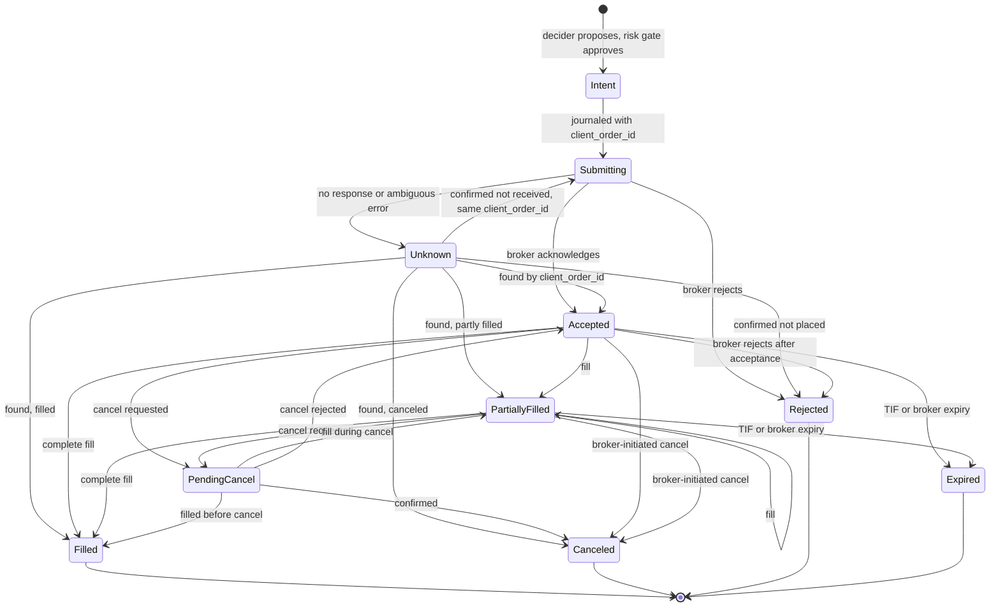

# Trading Domain Spec (v1)

| | |
|---|---|
| **Status** | Draft v0.2: requires founder approval before implementation (safety-critical) |
| **Scope** | US stocks, ETFs, and crypto spot on Alpaca ([DEC-23](../project/04-decision-log.md#decisions)) |
| **Implements** | PRD 6.2, 6.4, 6.5, 6.7; backlog E2, E3, E4, E5, E6, E7 |
| **Reference cases** | [reference-cases/trading-domain.yaml](reference-cases/trading-domain.yaml) (schema v2) |

## Changes in v0.2

v0.1 was reviewed from three roles (quant trader, risk and compliance, implementing engineer).
All three returned "needs rework": arithmetic was correct, but several rules did not match how
Alpaca works in 2026 and account-level rules were missing. v0.2 applies the accepted decisions
[DEC-26 to DEC-33](../project/04-decision-log.md#decisions) and the reviewers' fixes:

- Alpaca facts: intraday margin regime in effect; all accounts are margin accounts; paper does
  not simulate dividends or regulatory fees; CAT fee on both sides; fees charged as a daily
  total rounded up; overnight fills dated to the next trading day.
- One serialized **account ledger** per broker account; one agent per instrument per account.
- Protective exits through **OCO and bracket orders**, with defined exit and kill-switch
  sequences.
- **Opening orders are limit orders only**; shorting and the overnight session are disabled.
- **Instrument eligibility floor**, **market-conduct controls**, halts, and account restrictions.
- **Settlement calendar** separate from the trading calendar (bank holidays).
- Accounting stores **cost basis**, not average cost; equity includes receivables and accrued fees.
- Complete order state machine with Alpaca status mapping; journal replay contract.
- Paper-mode shadow ledger; broader reconciliation; records retention floor.
- Normalized reference-case schema v2 and seven new cases.

## 1. Principles

1. **The broker is the source of truth in paper and live trading.** Our model runs backtests,
   pre-checks orders in the risk gate, and reconciles against the broker. When they disagree,
   the broker wins, and the difference is journaled as a compensating event
   ([§11](#11-reconciliation)).
2. **Venue facts come from the venue.** Tick sizes, increments, eligibility flags, calendars,
   and sessions are read from broker APIs or effective-dated configuration, never hardcoded.
3. **Unknown means stop.** An unrecognized corporate action, order status, account condition, or
   data fault pauses the affected agents and alerts the owner.
4. **Conservative when in doubt.** Where a choice exists, pick the one that cannot create a
   violation or an unbounded loss.
5. **Mandate never originates a trade idea** ([DEC-33](../project/04-decision-log.md#decisions)).
   Every order traces to a user-confirmed mandate version. Platform defaults may only restrict
   trading, never expand it. Inferred mandate fields are inactive until the user confirms them.
   Calibration changes autonomy only within user-approved bounds, and each change is journaled.
   Approval requests show the agent's proposal and the mandate rule it follows, not
   platform-authored alternatives.

## 2. Conventions

### 2.1 Numbers

- Prices, quantities, and money use **fixed-point decimals** (`rust_decimal` in Rust,
  `decimal.Decimal` in Python). **Never floating point.**
- Internal calculations keep full precision unless a rounding point below applies. Python
  reference implementations use a precision of at least 60 digits.

| Field | Scale / rule |
|---|---|
| Price | Up to 9 decimal places |
| Quantity | Up to 9 decimal places; per-instrument increment |
| Money (internal) | Exact; cost-basis reductions rounded half-even to 12 places (§8.1) |
| Money (reported) | 0.01 USD, half-even; internal values unchanged |
| Order quantity | Truncate toward zero to the instrument's quantity increment, except a sell that closes the full position (§5.3) |
| Notional order amount | Truncate to 0.01 USD; minimum 1.00 USD |
| Buy limit / stop price | Round **down** to the tick of the rounded price |
| Sell limit / stop price | Round **up** to the tick of the rounded price |
| Equity regulatory fees | Accrued per fill at full precision; charged as an account-day total rounded **up** to 0.01 (§6.2) |
| Crypto fee quantity (asset) | Half-up to the asset's quantity scale (9 places) |
| Crypto fee in USD | Half-up to 0.01 per fill |
| Dividends | Quantity × amount per share, half-even to 0.01 per position; broker amount authoritative |
| Backtest fill prices | Not tick-rounded |

**Equity tick rule** (effective-dated configuration, Reg NMS Rule 612): 0.01 at or above
1.00 USD, 0.0001 below. Crypto uses the broker's `price_increment`.

### 2.2 Time and calendars

- Timestamps are **UTC with nanosecond precision**; sessions are evaluated in
  **America/New_York**.
- **Trading calendar:** NYSE trading days, holidays, and early closes (from the broker).
- **Settlement calendar:** days that are both NYSE trading days **and** Federal Reserve
  business days. Separate, versioned fixture (bank holidays such as Columbus Day and Veterans
  Day are trading days but not settlement days).
- **Trade date:** the trading day of execution. **Fills between 20:00 and 23:59:59 ET belong to
  the next trading day** (the overnight session starts the next trading day).
- Crypto has no trade-date boundary for settlement; the crypto reporting day ends at 00:00 UTC.

### 2.3 Identifiers

- **Instrument ID:** the broker's `asset_id` (UUID). Symbol is a dated attribute. Crypto
  symbols are normalized at the connector boundary (`BTC/USD` and legacy `BTCUSD` map to one
  instrument).
- **Order intent ID:** a ULID generated by the runtime.
- **`client_order_id`:** `"{intent_ulid}-{attempt}"`, at most 128 characters. `attempt` starts at
  1 and increments **only** after the broker confirms the previous attempt `Rejected`. Any retry
  of an unconfirmed attempt reuses the same `client_order_id`.
- **Fill ID:** the broker's execution ID; fills are de-duplicated by it.

## 3. Instruments and eligibility

### 3.1 Instrument fields

Loaded from the broker's asset API; refreshed daily (equities: after 19:45 ET), on every order
rejection that cites instrument properties, and on corporate-action events.

| Field | Meaning |
|---|---|
| `asset_id`, `symbol`, `asset_class`, `exchange` | Identity (`us_equity` or `crypto`); exchange (for example NASDAQ, NYSE, ARCA, OTC) |
| `status`, `tradable` | Active and tradable now |
| `fractionable`, `fractional_eh_enabled` | Fractional quantities; fractional in extended hours |
| `marginable`, `shortable`, `easy_to_borrow` | Margin and short-sale eligibility |
| `ipo` | Limit orders only until the first trade |
| `ptp_no_exception` | Publicly traded partnership without the withholding exception |
| `overnight_tradable`, `overnight_halted` | Overnight session eligibility |
| `min_order_size`, `min_trade_increment`, `price_increment` | Order constraints (crypto from broker; equities per §2.1) |

### 3.2 Platform eligibility floor ([DEC-31](../project/04-decision-log.md#decisions))

An **opening** order is allowed only for instruments that meet all of:

1. In the agent's mandate universe, `status = active`, `tradable = true`.
2. US equities: exchange is NYSE, NASDAQ, NYSE ARCA, NYSE American, or Cboe BZX (**no OTC**).
3. Not `ipo`; not `ptp_no_exception`.
4. Prior close ≥ the price floor (organization setting, default 5.00 USD, never below 1.00).
5. 20-day median daily dollar volume ≥ the liquidity floor (organization setting).
6. **Leveraged or inverse ETPs** only if the mandate explicitly enables them and the owner has
   acknowledged the risk disclosure. Identification uses a maintained reference list; an
   instrument whose status is unknown is treated as ineligible.
7. Crypto: USD pairs only, and the account's `crypto_status = ACTIVE`.

**Risk-reducing orders** for held positions are allowed even when the instrument is outside the
universe or below the floors. A held instrument that becomes non-tradable pauses the agent and
alerts the owner.

### 3.3 Concentration

A position's market value may not exceed the mandate's per-instrument cap, which may not exceed
the organization ceiling. Violations block opening and increasing orders.

## 4. Market data

### 4.1 Types

| Type | Fields |
|---|---|
| Trade | instrument, timestamp, price, size, exchange, feed |
| Quote | instrument, timestamp, bid, bid size, ask, ask size, feed |
| Bar | instrument, start timestamp (left edge), interval, open, high, low, close, volume, VWAP, trade count, session, feed |
| Trading status | instrument, timestamp, halted / resumed, LULD band, short-sale restriction flag |
| Corporate action | instrument, type, ex-date, record date, pay date, ratio or cash amount |

### 4.2 Feeds

- **Backtests use consolidated (SIP) bars and quotes.** The free IEX feed covers a small share of
  volume and must not drive volume caps or fill checks.
- Live marks record their feed. Staleness thresholds are configured per feed, asset class, and
  session.
- A bar exists only when trades occur. A missing regular-session bar means "no trade", not a
  gap; `inspect` distinguishes no-trade minutes, session closures, and true data gaps.

### 4.3 Sessions (US equities)

| Session | Hours (ET) | v1 agents |
|---|---|---|
| Overnight | 20:00 – 04:00, Sunday night to Friday morning | **Disabled** ([DEC-30](../project/04-decision-log.md#decisions)) |
| Pre-market | 04:00 – 09:30 | Limit orders, `extended_hours = true`, TIF day or GTC |
| Regular | 09:30 – 16:00 (early closes per calendar) | Per §5 |
| After-hours | 16:00 – 20:00 | Limit orders, `extended_hours = true`, TIF day or GTC |

Crypto trades continuously.

### 4.4 Halts

The risk gate consumes trading-status and LULD data. For a halted or paused instrument it sends
no new orders, cancels resting marketable orders when the halt starts, and applies a cooling-off
period after the reopen. If status data is unavailable for the user's feed, the instrument is
treated as restricted: limit orders within the price collar only.

### 4.5 Adjustments

Backtests use **raw prices plus explicit corporate actions** (§8.5). Signal series are adjusted
**point in time**: only actions with an ex-date on or before the decision time are applied.
Vendor-adjusted history (which applies future actions) is never used.

## 5. Orders

### 5.1 v1 order policy ([DEC-29](../project/04-decision-log.md#decisions))

| Purpose | Allowed |
|---|---|
| Opening or increasing | **Limit orders only**, priced within the price collar (§9.6); as plain limit orders or as **bracket orders** with protective legs |
| Reducing or closing | Limit orders; market orders **only in the regular session**, never in an auction window or a halted instrument |
| Protective exits | **OCO** (take-profit + stop) or bracket legs; crypto uses stop-limit legs |
| Not used in v1 | IOC, FOK, trailing stops, order replace/amend (except broker-initiated `replaced`), notional market buys, options |

### 5.2 Alpaca capability matrix

| Asset / condition | Order types | Time in force |
|---|---|---|
| Equities, whole shares, regular session | market, limit | day, gtc |
| Equities, whole shares, regular session | stop, stop-limit | day, gtc |
| Equities, fractional or notional | market, limit, stop, stop-limit | day only |
| Equities, extended hours | limit only, `extended_hours = true` | day, gtc (fractional: day) |
| Crypto | market, limit | gtc, ioc |
| Crypto | stop-limit | gtc only |
| Crypto | maximum notional per order: 200,000 USD | — |

Orders not eligible for the current session are queued by the broker for the next eligible
session. A GTC equity order expires 90 days after creation.

### 5.3 Constraints enforced before submission

1. Quantity and notional are mutually exclusive.
2. Quantity ≥ `min_order_size` and a multiple of the increment, **except** a sell that closes the
   full position, which uses the position's exact quantity (or the broker's close-position
   endpoint).
3. **An order may not cross zero.** A reduce that would flip a position is rejected
   (`would_cross_zero`); with shorting disabled in v1, no short leg is ever submitted.
4. **Sell quantity ≤ position − Σ open sell quantity** (including protective legs).
5. **At most one working non-protective order per instrument per side per account.**
6. Fractional and notional equity orders use TIF day; no fractional short sales.
7. **Self-crossing:** the broker rejects an order that could interact with the account's own
   opposite-side order (OCO, bracket, and trailing-stop orders are exempt). A risk-increasing
   order never cancels a protective order (§5.4).
8. An order whose status is `Unknown` reserves its full maximum cost against buying power and
   counts as fully filled for exposure and concentration limits.

### 5.4 Protective exits ([DEC-28](../project/04-decision-log.md#decisions))

- **Tranche model:** each entry that needs protection is a **bracket order** (entry + take-profit
  + stop). Its protective legs cover that tranche only. Adding to a position is a new bracket
  order. Σ protective sell quantity never exceeds the position.
- A **plain** (non-bracket) risk-increasing order in an instrument with resting protective
  orders is denied (`add_blocked_by_protective_order`).
- **Exit sequence:** cancel all protective orders in the instrument → wait for cancel
  confirmation → re-run the risk gate on fresh state → submit the exit → after a terminal state,
  re-place protection for any remaining quantity. The unprotected interval is journaled; if it
  exceeds the configured limit, the owner is alerted.
- Protection is **regular-session only** for equities (stops do not trigger in extended hours),
  and crypto stop-limit legs may not fill on gaps (offset set by `crypto_stop_limit_offset_bps`).
  Both limits are disclosed to the owner. Fractional positions are unprotected outside regular
  hours.

### 5.5 Kill switch

Cancel all open orders in scope → wait for confirmation → close all positions in scope (close
endpoint, market in the regular session, marketable limit otherwise) → journal each step. The
kill switch never waits for approval.

### 5.6 Order lifecycle

**Broker status mapping (Alpaca):**

| Broker status | Internal state | Action |
|---|---|---|
| `new`, `accepted`, `pending_new`, `accepted_for_bidding`, `held` | Accepted | None |
| `partially_filled` | PartiallyFilled | Apply fill |
| `filled` | Filled | Apply fill |
| `done_for_day` | Accepted or PartiallyFilled (unchanged) | None |
| `pending_cancel` | PendingCancel | None |
| `canceled` | Canceled | Release reservation |
| `expired` | Expired | Release reservation |
| `rejected`, `suspended` | Rejected | Release reservation; journal the reject code |
| `pending_replace`, `replaced` | Canceled (old) and Accepted (new, linked) | Broker-initiated only (corporate actions); link IDs, journal, re-run the gate on the new order |
| `stopped`, `calculated` | Accepted or PartiallyFilled (unchanged) | None |
| Any other value | — | Pause the agent and alert (unknown means stop) |

**Rules:**

- Terminal **states** are final. **Fills are always applied to accounting**, even for an order in
  a terminal state; such a fill is journaled as `late_fill` and triggers reconciliation.
- Filled quantity never decreases and never exceeds order quantity; it equals the sum of unique
  fills.
- `Unknown` is resolved only by querying the broker by `client_order_id`: at least N lookups over
  T seconds (configured) before concluding "not received". While any order is `Unknown`, the agent
  places no new orders in that instrument; risk-reducing orders in other instruments are allowed.
- Fill events carry per-event quantity and price, which are authoritative; the broker's
  cumulative filled quantity is checked against them, and a mismatch triggers reconciliation.
- Every transition is journaled before it takes effect in state.

## 6. Fills and fees

### 6.1 Fill record

fill ID (broker execution ID), `client_order_id`, instrument, trade date, timestamp, side,
**gross quantity**, price, liquidity (maker or taker, crypto), fees (list), fee-configuration
version.

### 6.2 US equities fees

| Fee | Side | Basis |
|---|---|---|
| Commission | — | Zero on Alpaca |
| SEC Section 31 | Sells | Rate × sale proceeds |
| FINRA Trading Activity Fee (TAF) | Sells | Rate × shares, capped per order (allocated to fills in sequence until the cap is reached) |
| Consolidated Audit Trail (CAT) | Buys and sells | Rate × shares |

- Fees are **accrued per fill at full precision**. Alpaca **charges each account the day's total,
  rounded up to 0.01**, at end of day. The model does the same: an end-of-day `FeesCharged` event
  replaces the accrual with the rounded charge.
- Accrued fees are a liability in equity (§8.2) and are reserved against buying power, rounded up
  to 0.01.
- Rates live in an **effective-dated fee configuration** transcribed from Alpaca's published fee
  schedule, never in code. Reference cases use labeled test values.

### 6.3 Crypto fees (Alpaca)

- Maker/taker by 30-day volume tier (tier 1: 15 bps maker, 25 bps taker), from a dated fee
  schedule configuration.
- **Charged in the asset received.** Buy: `fee_qty = half_up(gross_qty × bps / 10000, 9)` and
  received quantity = gross − `fee_qty`. Sell: fee in USD, half-up to 0.01.
- **Accounting convention:** a fee paid in an asset is valued at the fill price (unrounded) and
  recorded as a fee in USD. The position's cost basis is received quantity × fill price.
- Alpaca posts crypto fees at end of day. Until then the broker shows the gross quantity;
  reconciliation allows the unposted fee (§11). Sells are sized from the model's net quantity.

### 6.4 Backtest fill model

Configuration: decision latency, approval latency, slippage (half-spread plus an impact model:
`fixed` bps or `sqrt`, where impact = coefficient × √(fill quantity ÷ reference volume)), volume
cap fraction, and `crypto` presets.

1. **Timing.** An order becomes eligible at the first bar starting at or after decision time +
   decision latency (+ approval latency if it required approval). Nothing fills on the bar whose
   close produced the decision.
2. **Sessions.** Orders fill only in sessions they are allowed in. An order not eligible for the
   current session waits for the next eligible session. A day order's remainder is canceled at
   the end of its last eligible session.
3. **Volume cap.** A fill in a bar is at most `fraction × previous bar's volume` (truncated to the
   quantity increment); the remainder keeps working. The cap is shared by all of the account's
   orders in the instrument, in submission order.
4. **Market orders** fill at the eligible bar's open: buys at open × (1 + s), sells at
   open × (1 − s).
5. **Limit orders** (buy; sell is symmetric):
   - **Marketable on arrival** (open ≤ limit on the first eligible bar): fill at
     min(limit, open × (1 + s)), taker. Any remainder (volume cap) keeps filling as taker at
     min(limit, open × (1 + s)) on each later bar whose open ≤ limit.
   - **Resting** (not marketable on arrival): on a later bar that opens below the limit (gap
     through), fill at the open, maker, no slippage; else if the bar's low is **strictly below**
     the limit, fill at the limit, maker. A touch is not a fill.
6. **Stop orders** (sell stop S; buy is symmetric). Equities trigger only in the regular session.
   If open ≤ S: fill at open × (1 − s). Else if low ≤ S: fill at S × (1 − s).
7. **Stop-limit** (sell, stop S, limit L): if the bar gaps with open < L, no fill; the order rests
   as a limit at L. Otherwise, once triggered, fill at max(L, min(open, S) × (1 − s)).
8. **Adverse first.** If a protective stop and a take-profit are both reachable in one bar, the
   stop fills first and the take-profit is canceled.
9. Fill prices are not tick-rounded.

## 7. Accounts

### 7.1 Account ledger ([DEC-26](../project/04-decision-log.md#decisions))

- **One ledger per broker account,** owned by **one serialized executor**. All account-level rules
  (buying power, reservations, working-order limits, self-crossing, restrictions) are evaluated
  against it. Agents submit intents; they never talk to the broker directly.
- **One agent per instrument per account.** Deploying a mandate whose universe includes an
  instrument already claimed on the account is rejected (`instrument_claimed`).
- An agent may cancel only its own orders.
- **External activity:** orders or fills not originated by Mandate (for example, manual trades)
  are ingested and journaled, and every agent on the account switches to **exits-only** until the
  owner acknowledges.

### 7.2 Account state

| Field | Source |
|---|---|
| Account type | Alpaca: always margin; `multiplier` 1, 2, or 4 |
| Equity, cash, buying power, `non_marginable_buying_power`, `last_equity` | Broker |
| Settled and unsettled cash buckets | Model, reconciled to broker (§8.3) |
| Day-trading regime | Per broker: Alpaca `intraday_margin` (§9.2) |
| `status`, `trading_blocked`, `account_blocked`, `trade_suspended_by_user`, `crypto_status`, `shorting_enabled` | Broker |

**Leverage setting.** v1 requires 1× buying power. At connect and daily, the platform verifies the
account's margin configuration yields `multiplier = 1` (or a platform-enforced 1× cap); if not,
agents on the account are paused and the owner is asked to change the setting.

**Buying power used by the gate** is the lower of the model and the broker:

- Equities: min(model at 1×, broker `buying_power`).
- Crypto: min(model settled cash, broker `non_marginable_buying_power`).
- Uncleared deposits count as unsettled.

### 7.3 Account restrictions

Before every order and on every account-status event, the gate requires `status = ACTIVE`,
`trading_blocked = false`, `account_blocked = false`, `trade_suspended_by_user = false` (and
`crypto_status = ACTIVE` for crypto).

| Condition | Effect |
|---|---|
| Closing-only restriction (for example, Alpaca's equity/order-ratio check) or a margin freeze | **All agents on the account → exits-only**; owner alerted |
| `trading_blocked`, `account_blocked`, status not `ACTIVE`, or `trade_suspended_by_user` | **All agents paused** (the broker will reject every order); owner alerted |
| Order rejected with 403 and no known order-level cause | Refresh account state before any further order |

## 8. Accounting

### 8.1 Positions and cost basis ([DEC-27](../project/04-decision-log.md#decisions))

A position stores a **signed quantity** Q (positive long, negative short) and a **signed cost
basis** B (long: amount paid; short: amount received, negative). **Average cost is derived:
A = B ÷ Q, never stored.** For a fill of signed quantity q (buy positive, sell negative) at
price p:

| Case | New quantity | New cost basis | Realized P&L (gross) |
|---|---|---|---|
| Opening or increasing (Q = 0 or same sign as q) | Q + q | B + q·p | 0 |
| Reducing (opposite sign, \|q\| < \|Q\|) | Q + q | B − R, where R = half_even(B·\|q\|/\|Q\|, 12) | −(q·p) − R |
| Closing (\|q\| = \|Q\|) | 0 | 0 | −(q·p) − B |
| Crossing zero | Not allowed as one order (§5.3); fills that cross (backtests, other brokers) are split into a close and an open | | |

- **Fees are period expenses,** recognized on their fill, never folded into cost basis.
  **Net realized P&L = gross realized − fees.**
- **Tax lots** are recorded separately, first-in first-out, with fees included in lot basis, for
  tax reporting. The broker's Form 1099-B is authoritative; lots follow the broker's lot-relief
  method when known.

### 8.2 Marks and equity

| Mark | Definition |
|---|---|
| **Risk mark** | Bid for long positions, ask for short positions, from a quote that passes sanity checks (0 < bid ≤ ask, spread ≤ configured maximum) and is fresher than the staleness threshold. Falls back to the last trade only during a session and when fresh |
| **Reporting mark** | Quote midpoint (same checks); otherwise last trade |
| **End of day** | Equities: official close. Crypto: close of the bar ending 00:00 UTC |
| Previous close | Display only; the gate treats it as stale |

- Each mark carries its source (`quote`, `last_trade`, `prev_close`). **Opening orders require a
  fresh quote-based risk mark**; risk-reducing orders are allowed with any source.
- Backtest mark = bar close.
- Market value = Q × mark. Unrealized P&L = Q × mark − B.
- **Equity = settled cash + unsettled cash + receivables − payables − accrued fees + Σ market
  value.** Receivables include dividends and cash in lieu due; payables include dividends owed on
  shorts.
- **Total P&L = realized (gross) + unrealized + income − fees.**

### 8.3 Cash buckets and movements

All accounts keep settled and unsettled buckets (Alpaca margin accounts included).

| Event | Effect |
|---|---|
| Equity buy fill | Settled cash −(q × p) at fill time |
| Equity sell fill | Unsettled cash +(\|q\| × p) for the settlement date |
| Crypto buy fill | Settled cash −(q × p); fee reduces quantity received |
| Crypto sell fill | Settled cash +(\|q\| × p); USD fee accrued |
| Fee accrual | Accrued fees + amount |
| `FeesCharged` (end of day) | Accrued fees → 0; settled cash − rounded charge |
| `SettlementPosted` (00:00 ET on the settlement date) | Unsettled bucket for that date → settled |
| Dividend ex-date | Receivable (long) or payable (short), and income |
| Dividend pay date | Receivable or payable → settled cash |

### 8.4 Settlement

- **US equities: T+1** on the settlement calendar (§2.2), counted from the trade date. Example: a
  sale on Friday 2026-10-09 settles Tuesday 2026-10-13 (Monday is Columbus Day).
- **Crypto:** settles at fill.
- **Cash-account model** (generic brokers; Alpaca has no cash accounts): buying power = settled
  cash − reservations − accrued fees (rounded up). Unsettled proceeds are never used.

### 8.5 Corporate actions

| Action | Treatment |
|---|---|
| **Split** (integer ratio new:old) | Applied at the **start of the ex-date trading day** (20:00 ET the prior evening). Q_raw = Q × new ÷ old; B and realized unchanged. Fractionable instrument: Q' = truncate(Q_raw, quantity scale). Non-fractionable: Q' = whole shares of Q_raw, and the fraction f = Q_raw − Q' is removed with **cash in lieu** at the broker's price per post-split share: removed basis R = half_even(B × f ÷ Q_raw, 12), B' = B − R, realized = cash in lieu − R; the cash in lieu is a receivable until the broker posts it |
| **Cash dividend** (amount d) | Applied at the start of the ex-date trading day for the position held at the prior close: receivable (or payable for shorts) = half_even(Q × d, 0.01); **income recognized on the ex-date**; settled cash on the pay date |
| Open orders around corporate actions | At **19:45 ET** on the evening before the ex-date, the model cancels the agent's open orders in the instrument. Broker-initiated `replaced` orders are linked and re-checked. Protective orders are re-derived at adjusted prices and resubmitted after the action applies |
| Tax lots | Split: lot quantity × new ÷ old, lot basis unchanged |
| Any other action (stock dividend, spin-off, merger, symbol change, delisting) | **Out of scope for v1:** pause agents holding the instrument, cancel their orders, alert the owner |

### 8.6 Invariants (property-based tests)

Evaluated after every event; all equalities are exact.

- **I1 Conservation.** With no deposits or withdrawals: Δequity = Δrealized (gross) + Δunrealized
  + Δincome − Δfees, where fees include accruals and the rounding difference recognized when fees
  are charged.
- **I2 Reducing fills.** The removed basis equals half_even(B × |q| ÷ |Q|, 12). Conservation is
  exact; derived average cost may differ from the prior average in the 12th decimal place.
- **I3 Splits.** A split without cash in lieu leaves B, realized P&L, equity, and market value at
  the adjusted mark unchanged. With cash in lieu it obeys I1.
- **I4 Cash buckets.** Total cash = settled + Σ unsettled. After `SettlementPosted` for date D, no
  unsettled bucket has a date ≤ D. In a cash-account model, settled cash is never negative.
- **I5 Quantity.** Q = Σ over unique fill IDs of signed received quantity (gross minus asset fee
  on crypto buys), adjusted by later splits, minus fractions removed as cash in lieu.
- **I6 Determinism.** Folding the journal yields identical state after a serialize/deserialize
  round trip (canonical decimals).
- **I7 Orders.** Filled quantity is non-decreasing, ≤ order quantity, and equals Σ unique fills;
  terminal states never change; duplicate or reordered broker events produce the same fill set.

## 9. Risk gate: account rules

### 9.1 Leverage

v1 agents use **1× gross exposure**: Σ |market value| + Σ maximum cost of open opening orders ≤
equity. No order may create a debit (negative settled cash) balance. Crypto is never marginable.

### 9.2 Day-trading regime

FINRA replaced the pattern-day-trader rules with an intraday margin standard (SEC approval
April 14, 2026; effective June 4, 2026; broker phase-in until October 20, 2027).

| Regime | Rule |
|---|---|
| `intraday_margin` (**Alpaca**, since June 4, 2026) | Never create an intraday margin deficit. With 1× long-only exposure (§9.1) an order that passes the buying-power check cannot create one; the gate also checks broker-reported maintenance excess when available |
| `legacy_pdt` (generic brokers that have not transitioned) | Day trade = purchasing and selling, or selling and purchasing, the same security on the same trading day in a margin account; shares held overnight close first; each same-day open-then-close sequence counts once. Window = today plus the 4 prior trading days. Equity test uses prior-close equity. **Opening orders** are allowed only if remaining day trades ≥ 1 + open same-day positions. **Exits are never denied** for day-trade count; if an exit becomes an extra day trade, the owner is alerted |

Crypto round trips never count. Fractional day trades count. Deficit consequences under the new
rule (5-business-day cure, 90-day freeze, de minimis of the lesser of 5% of equity or 1,000 USD)
are surfaced to the owner if the broker reports a deficit.

### 9.3 Short sales

**Disabled in v1** ([DEC-32](../project/04-decision-log.md#decisions)). The accounting model
supports shorts for backtests and future brokers; the gate never submits a short sale.

### 9.4 Sessions and auction windows

- Orders must satisfy §4.3 and §5.2. Market orders are sent only in the regular session.
- **No opening orders** between 09:28 and 09:30 ET (opening auction routing) or in the last
  configured minutes before the close (default 10), except risk-reducing orders.
- Holidays and early closes come from the broker calendar.

### 9.5 Buying power

Every opening or increasing order must satisfy: quantity × limit price + estimated fees (rounded
up to 0.01) ≤ available buying power (§7.2) − existing reservations. The reservation is held until
the order is terminal; partial fills release the unfilled portion's reservation proportionally.

### 9.6 Market-conduct controls ([DEC-31](../project/04-decision-log.md#decisions))

Enforced by the gate, with organization-configurable limits:

| Control | Default |
|---|---|
| Working non-protective orders per instrument per side per account | 1 |
| Minimum resting time before cancel of a non-marketable order (except risk-reducing) | 2 seconds |
| Price collar: limit price within X of the reference (NBBO midpoint) | 1% (liquid equities), wider for crypto |
| Order size vs trailing 5-minute volume | ≤ 5% |
| Daily participation vs 20-day average daily volume | ≤ 5% |
| Order-to-fill ratio per agent per instrument per day | ≤ 10 (breach pauses the agent) |
| Minimum interval between opposite-side fills in one instrument | 60 seconds |
| Self-trade prevention across all accounts in the same workspace | Opposite-side orders in one instrument across the workspace's accounts are blocked |

A daily per-workspace **surveillance report** (self-trade checks, order-to-fill ratios,
close-window activity, concentration) is generated and retained as a record.

### 9.7 Order-rate limits

Per-agent and per-account limits on orders per second and per day, within broker rate limits;
breaches pause the agent.

### 9.8 Wash sales (informational)

Reports flag a possible wash sale when a US equity (including crypto ETPs, which are securities)
is sold at a loss and a substantially identical security is bought within 30 days before or after.
Scope: this account only; the broker's Form 1099-B is authoritative; this is information, not tax
advice, and never blocks trading. Crypto spot lots are retained for future rules but not flagged.

## 10. Paper mode

Alpaca paper trading does not simulate regulatory fees, dividends, or borrow fees; it fills
against the NBBO without size checks and returns random partial fills. Therefore:

- The model books regulatory fees and dividends in a **shadow ledger** marked `simulated = true`.
  They are excluded from cash reconciliation and included in all reported P&L and in the
  paper-to-live readiness report.
- Paper fills are not execution-quality evidence; readiness reports show backtest, paper, and
  estimated live costs side by side.

## 11. Reconciliation

Runs at startup, after any `Unknown` order, at each session boundary, after end-of-day fee
posting, and on a schedule while running. Source: broker orders, positions, account, and
**account activities** (fills, fees, dividends, deposits and withdrawals, journals, splits and
reorganizations, interest) since the last checkpoint.

| Compared | Tolerance | On mismatch |
|---|---|---|
| Equity position quantity | Exact | Pause agent, alert |
| Crypto position quantity | Model net quantity + unposted asset fees = broker quantity, until fee posting; exact after | Pause agent, alert |
| Open orders (by `client_order_id`) | Exact set and state | Adopt broker state as a compensating event; pause if an order is unknown to us |
| Fills since checkpoint | Exact set (by fill ID) | Ingest missing fills; journal |
| Cash | 0.01 × fills since the last broker cash snapshot + accrued unposted fees; exact after posting | Alert above threshold; pause if persistent |
| Fees | Exact once posted | Differences alert; never silently adjusted |
| External orders or fills | None expected | Exits-only for all agents on the account (§7.1) |

"Adopt broker state" is always a journaled compensating event containing the difference.
**Resuming a paused agent requires owner acknowledgment with step-up authentication.** A daily
account snapshot (status, equity, buying power, maintenance margin, flags) is journaled.

## 12. Journal and replay contract

Full schema in the journal spec (next). Requirements this spec depends on:

- Each event has a gapless per-stream **`seq`** (the only ordering key), `event_time` (source
  time, informational), `recorded_at` (local clock, informational), causation ID, previous hash,
  and **configuration references** (fee configuration, trading calendar, settlement calendar,
  instrument snapshot) as content hashes.
- State is a **pure fold** over events in `seq` order; handlers never read the wall clock or live
  configuration.
- Time-driven changes are explicit events: `ClockAdvanced`, `SettlementPosted`, `FeesCharged`,
  `CorporateActionApplied`, `OrderExpired`.
- Late fills are applied at their arrival `seq`, never re-sorted by `event_time`.
- Every risk-gate decision, **including allows**, is journaled with the rule IDs evaluated and the
  rule-set version.

## 13. Records retention ([DEC-33](../project/04-decision-log.md#decisions))

Trading records are retained **at least 6 years**; organizations may extend but not shorten this,
and legal holds override deletion. Trading records include: intents; every gate decision with rule
IDs and configuration versions; mandate and model versions; raw broker requests and responses
(including reject codes); fills; account snapshots; reconciliations; approvals with
authentication method; surveillance reports. Personal data is stored by reference so that
crypto-shredding never alters trading records. In hybrid mode, the platform retains signed release
manifests and journal hash anchors (no strategy content). Counsel to confirm periods.

## 14. Reference cases

[reference-cases/trading-domain.yaml](reference-cases/trading-domain.yaml), schema v2. Values
compare by decimal equality. Changing or adding a case requires founder approval.

| ID | Covers | Scope |
|---|---|---|
| RC-01 | Buy, partial sell, fee accrual and daily charge, marks, equity, settlement, conservation | Accounting |
| RC-02 | Averaging in; reducing keeps average cost; daily fee total | Accounting |
| RC-03 | Flip in fills (accounting); gate rejects a zero-crossing order | Accounting, gate |
| RC-04 | Forward split; order cancellation and protective re-derivation | Accounting, executor |
| RC-05 | Reverse split with cash in lieu | Accounting |
| RC-06 | Cash dividend, long and short; equity unchanged on ex-date | Accounting |
| RC-07 | Crypto fees in the received asset; unposted-fee reconciliation | Accounting, reconciliation |
| RC-08 | Cash-account settlement and buying power (generic broker) | Gate, accounting |
| RC-09 | Legacy day-trade budget blocks openings; Alpaca intraday-margin variant | Gate |
| RC-09B | Legacy regime: exits never denied; same-day position limits openings | Gate |
| RC-10 | Backtest: timing, slippage, limit through, marketable limit, volume cap | Backtest |
| RC-11 | Settlement calendar with bank holidays; overnight trade date | Accounting |
| RC-12 | Backtest stops, gaps, stop-limit, adverse-first, extended-hours non-trigger | Backtest |
| RC-13 | Partial fills: TAF cap per order, daily fee rounding | Accounting |
| RC-14 | Exit sequence with protective OCO; add blocked; add via bracket; kill switch | Executor, gate |
| RC-15 | Account restrictions: exits-only and paused; external order | Gate |
| RC-16 | Eligibility floor and exits outside the universe | Gate |
| RC-17 | Account ledger: instrument claims and shared buying power | Gate |

## 15. Open questions

1. How Alpaca rounds per-fill cash for fractional fills (cash tolerance in §11).
2. Whether Alpaca posts crypto fees in real time yet, and whether crypto USD fees round half-up.
3. The exact Alpaca API setting for capping margin at 1× (account configuration), and whether
   OAuth apps may read and set it.
4. Which Alpaca data channel provides halt, LULD, and short-sale-restriction status on the user's
   plan (§4.4).
5. Source for the leveraged/inverse ETP reference list (§3.2).
6. Whether pending crypto wash-sale legislation (applied retroactively if enacted) changes what
   must be recorded now.

## 16. Out of scope for v1

- Perpetual futures (Kraken Derivatives US, backlog E16).
- Options; short sales; margin borrowing; the overnight session.
- Corporate actions other than splits and cash dividends (fail safe per §8.5).
- Non-USD currencies and crypto-to-crypto pairs.
- Order replace/amend initiated by Mandate.
